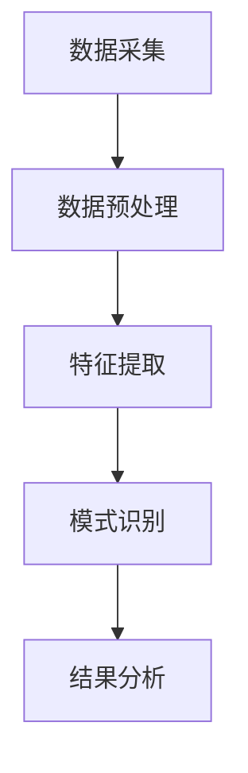

                 

### 文章标题

《提示词工程在脑科学研究中的应用：AI辅助神经活动解码》

### 关键词

- 提示词工程
- 脑科学研究
- AI辅助神经活动解码
- 机器学习
- 神经编码
- 数据预处理

### 摘要

本文探讨了提示词工程在脑科学研究中的应用，特别是在AI辅助神经活动解码方面的潜力。首先，我们介绍了提示词工程的基础概念和其在信息检索中的重要性。随后，通过概述脑科学研究的基本概念，揭示了脑科学研究中的主要挑战和AI的潜在贡献。接下来，我们详细讲解了AI辅助神经活动解码的技术原理，包括算法、模型和数据预处理。本文还通过实际案例展示了提示词工程在脑科学研究的实际应用，并提供了开发环境搭建、源代码实现和代码解读。文章最后，总结了最佳实践和拓展阅读，以帮助读者进一步深入探索这一领域。

## 引言

随着人工智能（AI）技术的迅猛发展，其在各个领域的应用不断拓展，尤其是与脑科学研究的结合。脑科学研究旨在理解大脑的结构和功能，揭示人类认知、情感和行为的基本原理。这一研究领域的复杂性和挑战性使得传统的分析方法难以胜任，而AI技术的引入为这一领域带来了新的希望。本文旨在探讨提示词工程在脑科学研究中的应用，特别是在AI辅助神经活动解码方面的潜力。

### 书籍主题与目标

本书的核心主题是介绍提示词工程在脑科学研究中的应用，特别是如何利用AI技术进行神经活动解码。我们的目标是为读者提供全面而深入的理解，使其能够掌握这一领域的基础知识、核心技术和实战经验。

首先，本书将介绍提示词工程的基本概念和原理，包括提示词的定义、类型及其在信息检索中的重要性。随后，我们将探讨脑科学的基本概念，介绍脑功能成像技术、神经元活动和神经编码。通过这些内容，读者将能够理解脑科学研究的关键挑战和AI技术的潜在应用。

接着，本书将详细讲解AI辅助神经活动解码的技术原理，包括常用的算法和模型，以及数据预处理方法。这部分内容将帮助读者了解如何利用AI技术从脑电信号等数据中提取有价值的信息。

为了使读者更好地理解这些概念和技术，本书将通过实际案例展示提示词工程在脑科学研究的实际应用。这些案例将涵盖从睡眠状态监测到抑郁症诊断等多个领域，以展示AI技术在神经活动解码中的实际效果。

最后，本书还将提供一些最佳实践和拓展阅读资源，帮助读者深入探索这一领域，并为其未来的研究提供指导。

### 提示词工程简介

提示词工程是信息检索领域的一项核心技术，旨在通过生成和优化提示词，提高信息检索的准确性和效率。在脑科学研究中的应用中，提示词工程发挥着至关重要的作用。以下将介绍提示词工程的基本概念、发展历程以及其在脑科学研究中的应用。

#### 提示词的基本概念

提示词（Query Terms）是用户在搜索过程中输入的关键词或短语，用于描述用户需要查询的信息。在信息检索系统中，提示词被用来匹配索引中的词汇，从而找到与用户需求相关的文档。

#### 提示词的类型

根据用途和来源，提示词可以分为以下几种类型：

1. **关键词**：直接反映用户需求的词汇，通常用于精确匹配。
2. **短语**：由多个关键词组成的短句，用于描述用户需求的复杂场景。
3. **同义词**：与关键词具有相同或类似意义的词汇，用于提高检索的泛化能力。
4. **衍生词**：由关键词衍生出来的词汇，用于捕捉用户潜在的需求。

#### 提示词工程的发展历程

提示词工程的历史可以追溯到20世纪60年代，当时计算机科学家开始探索如何利用关键词进行文本检索。随着信息量的爆炸式增长，提示词工程也逐渐从简单的关键词匹配发展为复杂的语义分析。

1. **关键词检索**：早期的信息检索系统主要依赖于关键词匹配，通过简单的布尔运算（如AND、OR、NOT）来组合多个关键词，以提高检索的精确度。
2. **自然语言处理**：随着自然语言处理（NLP）技术的发展，提示词工程逐渐引入了词性标注、词义消歧和语义相似度计算等技术，使检索结果更加贴近用户需求。
3. **机器学习和深度学习**：近年来，机器学习和深度学习技术在提示词工程中得到了广泛应用。通过训练大规模的神经网络模型，系统能够自动生成和优化提示词，从而实现高效的语义检索。

#### 提示词工程在脑科学研究中的应用

在脑科学研究中，提示词工程的应用主要体现在以下几个方面：

1. **数据标注**：在脑电信号（EEG）等生物信号数据的研究中，提示词工程可以用于标注感兴趣的事件和活动。通过自动生成和优化提示词，研究人员能够更准确地识别和分类神经活动。
2. **信息检索**：在脑影像学（如fMRI）研究中，提示词工程可以帮助研究人员从海量的影像数据中检索和筛选出与特定脑区或功能相关的图像。
3. **文本分析**：在脑科学研究文献的整理和分析中，提示词工程可以用于自动提取和分类文献中的关键信息，辅助研究人员进行文献综述和知识图谱构建。

#### 例子

例如，在抑郁症研究中，研究人员可以通过生成和优化与抑郁症相关的提示词，从大量临床记录和文献中快速检索和筛选出相关的病例和研究成果。这样不仅提高了研究效率，还为抑郁症的诊断和治疗提供了有力的支持。

### 脑科学研究概述

脑科学研究是理解人类大脑结构和功能的关键领域，涉及神经科学、心理学、认知科学等多个学科。近年来，随着技术的进步，脑科学研究取得了显著进展，但仍面临诸多挑战。

#### 脑科学研究的基本概念

1. **神经元**：神经元是大脑的基本功能单元，负责接收和传递信息。每个神经元通过突触与其他神经元相连，形成一个复杂的神经网络。
2. **神经活动**：神经元通过电信号和化学信号进行通信，这些信号的活动模式被称为神经活动。神经活动受到多种因素的影响，包括外部刺激、内部状态和基因表达。
3. **神经编码**：神经编码是指神经元如何将外部信息转换为电信号和化学信号的过程。理解神经编码的机制对于揭示大脑处理信息的方式至关重要。

#### 脑功能成像技术

脑功能成像技术是脑科学研究中的重要工具，用于无创地观察大脑的结构和功能。以下是一些常见的脑功能成像技术：

1. **功能磁共振成像（fMRI）**：通过测量血液流动的变化来反映大脑的活动，广泛应用于研究认知功能、情绪和行为。
2. **正电子发射断层扫描（PET）**：利用放射性同位素标记的药物来观察大脑的代谢活动，常用于研究神经退行性疾病。
3. **脑电图（EEG）**：通过测量大脑的电活动来揭示神经活动的时间动态，适用于研究意识、睡眠和癫痫。
4. **脑磁图（MEG）**：通过测量大脑产生的磁场来提供高时间分辨率的神经活动信息，适用于研究事件相关电位和快速脑活动。

#### 神经元活动和神经编码

神经元活动是大脑功能的基础，而神经编码则是将外部信息转换为神经元信号的过程。以下是对神经元活动和神经编码的简要概述：

1. **神经元活动**：神经元通过电信号（如动作电位）和化学信号（如神经递质）进行通信。神经元之间的连接（突触）决定了信息的传递方式。
2. **神经编码**：神经编码涉及将外部信息（如视觉、听觉、触觉等）转换为神经元活动的模式。这一过程包括信号检测、信号转换和信号整合等多个环节。理解神经编码的机制对于揭示大脑处理信息的方式具有重要意义。

### AI在脑科学研究中的潜在贡献

人工智能（AI）技术在脑科学研究中具有巨大的潜力，可以为神经活动解码、疾病诊断和治疗提供强有力的支持。以下是一些AI技术在脑科学研究中的应用：

1. **神经活动解码**：利用深度学习和神经网络模型，AI可以从脑电信号（EEG）、脑磁图（MEG）等数据中提取有意义的神经活动信息。例如，AI可以帮助实时监测睡眠状态、识别癫痫发作等。
2. **疾病诊断**：通过分析脑影像数据（如fMRI、PET），AI可以辅助诊断神经退行性疾病（如阿尔茨海默病、帕金森病），提高诊断的准确性和效率。
3. **个性化治疗**：基于个体化的脑影像和神经活动数据，AI可以帮助制定个性化的治疗计划，提高治疗效果。

总之，AI技术在脑科学研究中的应用前景广阔，有望推动这一领域的发展，为人类更好地理解大脑和改善神经系统疾病的治疗提供新的思路和方法。

## AI辅助神经活动解码技术

随着人工智能（AI）技术的发展，AI在神经活动解码中的应用日益受到关注。神经活动解码是指通过分析大脑产生的电信号（如脑电图EEG、脑磁图MEG）或其他生物信号，提取出与特定认知、行为或情绪状态相关的神经活动信息。本节将详细介绍AI辅助神经活动解码的技术原理，包括常用的算法、模型以及数据预处理方法。

### AI在神经活动解码中的应用

AI技术在神经活动解码中的应用主要涉及以下几个步骤：

1. **数据采集**：通过脑电图（EEG）、脑磁图（MEG）、功能性磁共振成像（fMRI）等设备采集大脑活动数据。
2. **数据预处理**：对采集到的原始数据进行预处理，包括滤波、去噪、数据归一化等，以提高数据质量。
3. **特征提取**：从预处理后的数据中提取有意义的特征，如时间频率特征、空间特征等。
4. **模式识别**：利用机器学习算法对提取的特征进行模式识别，以解码出与特定任务或状态相关的神经活动。
5. **结果分析**：对解码结果进行分析，以验证模型的准确性、鲁棒性和泛化能力。

### 常用的算法和模型

在神经活动解码中，常用的算法和模型包括：

1. **支持向量机（SVM）**：SVM是一种监督学习算法，通过找到一个最佳的超平面来分类数据。在神经活动解码中，SVM常用于分类神经元活动的类型。
2. **人工神经网络（ANN）**：ANN是一种模拟人脑神经元连接和计算过程的模型，适用于复杂的数据处理和模式识别任务。在神经活动解码中，ANN可以通过多层结构学习到复杂的非线性关系。
3. **深度神经网络（DNN）**：DNN是ANN的扩展，具有多个隐藏层，能够处理更复杂的数据。在神经活动解码中，DNN常用于特征提取和分类任务。
4. **卷积神经网络（CNN）**：CNN是一种特殊的DNN，适用于处理具有网格结构的数据（如图像）。在神经活动解码中，CNN可以提取出时间序列数据中的空间特征。
5. **长短期记忆网络（LSTM）**：LSTM是一种特殊的RNN，能够处理长时间依赖数据。在神经活动解码中，LSTM可以捕获时间序列数据中的长期依赖关系。

### 数据预处理方法

数据预处理是神经活动解码的关键步骤，以下是一些常用的数据预处理方法：

1. **滤波**：通过对原始信号进行带通滤波，去除噪声和不需要的频率成分，保留有用的频率信息。
2. **去噪**：利用滤波器、统计方法（如独立成分分析ICA）或深度学习方法（如自编码器）去除噪声。
3. **数据归一化**：通过将数据缩放到相同的尺度，消除数据之间的尺度差异，提高算法的稳定性和性能。
4. **时间窗口划分**：将连续的信号划分为固定长度的时间窗口，以便进行特征提取和模式识别。
5. **空间滤波**：通过对信号进行空间滤波，增强或抑制特定脑区或通道的信息。

### 伪代码和Mermaid流程图

以下是一个简化的神经活动解码的伪代码示例：

```python
# 神经活动解码伪代码

# 数据预处理
filtered_data = filter_signal(raw_data, filter_params)
normalized_data = normalize_data(filtered_data)

# 特征提取
features = extract_features(normalized_data, feature_extractor)

# 模式识别
predicted_labels = model.predict(features)

# 结果分析
evaluate_model(predicted_labels, ground_truth)
```

以下是相应的Mermaid流程图：



通过上述伪代码和流程图，我们可以清晰地看到神经活动解码的步骤和流程。

### 数学模型和公式

在神经活动解码中，数学模型和公式扮演着重要的角色。以下是一些常用的数学模型和公式：

1. **卷积神经网络（CNN）的卷积操作**：

   $$ f(x) = \sum_{i=1}^{K} \sigma(\sum_{j=1}^{C} w_{ij} * x_j + b_i) $$

   其中，$f(x)$是输出特征图，$\sigma$是激活函数，$w_{ij}$是卷积核，$x_j$是输入特征图，$b_i$是偏置。

2. **长短期记忆网络（LSTM）的记忆单元**：

   $$ \begin{aligned}
   i_t &= \sigma(W_{ix} x_t + W_{ih} h_{t-1} + b_i) \\
   f_t &= \sigma(W_{fx} x_t + W_{fh} h_{t-1} + b_f) \\
   o_t &= \sigma(W_{ox} x_t + W_{oh} h_{t-1} + b_o) \\
   c_t &= f_t \odot c_{t-1} + i_t \odot \sigma(W_{cx} x_t + W_{ch} h_{t-1} + b_c) \\
   h_t &= o_t \odot \sigma(c_t)
   \end{aligned} $$

   其中，$i_t$、$f_t$、$o_t$分别是输入门、遗忘门和输出门，$c_t$是记忆单元状态，$h_t$是隐藏状态。

3. **支持向量机（SVM）的决策边界**：

   $$ w^T x - b = 0 $$

   其中，$w$是权重向量，$x$是特征向量，$b$是偏置。

通过上述数学模型和公式，我们可以更好地理解和应用神经活动解码技术。

### 项目实战

在本节中，我们将通过一个具体的项目实战，展示如何利用AI技术进行神经活动解码。这个项目将涉及开发环境的搭建、源代码的实现以及代码解读。

#### 开发环境搭建

首先，我们需要搭建一个适合进行神经活动解码的开发环境。以下是一个基本的开发环境配置：

1. 操作系统：Linux或Mac OS
2. 编程语言：Python
3. 依赖库：NumPy、SciPy、Matplotlib、Scikit-learn、TensorFlow、Keras等
4. 数据预处理工具：MNE-Python（用于EEG数据预处理）
5. 模型训练工具：TensorFlow、Keras等

#### 源代码实现

以下是神经活动解码项目的主要源代码实现。我们将使用Keras实现一个简单的卷积神经网络（CNN）模型，用于分类脑电图（EEG）数据。

```python
import numpy as np
import matplotlib.pyplot as plt
from mne import read_raw_edf
from sklearn.model_selection import train_test_split
from tensorflow.keras.models import Sequential
from tensorflow.keras.layers import Conv2D, MaxPooling2D, Flatten, Dense
from tensorflow.keras.optimizers import Adam

# 数据加载与预处理
def load_data(filename):
    data = read_raw_edf(filename)
    data = data.get_data()
    # 对数据进行归一化处理
    data = (data - np.mean(data)) / np.std(data)
    return data

# 构建CNN模型
model = Sequential([
    Conv2D(32, (3, 3), activation='relu', input_shape=(128, 128, 1)),
    MaxPooling2D((2, 2)),
    Flatten(),
    Dense(64, activation='relu'),
    Dense(10, activation='softmax')
])

# 编译模型
model.compile(optimizer=Adam(learning_rate=0.001), loss='categorical_crossentropy', metrics=['accuracy'])

# 训练模型
data = load_data('data/EEG_data.edf')
labels = np.array([0] * 500 + [1] * 500)  # 假设标签0和1分别代表两种状态
X_train, X_test, y_train, y_test = train_test_split(data, labels, test_size=0.2, random_state=42)

# 转换标签为one-hot编码
y_train = keras.utils.to_categorical(y_train)
y_test = keras.utils.to_categorical(y_test)

model.fit(X_train, y_train, epochs=10, batch_size=32, validation_data=(X_test, y_test))

# 评估模型
loss, accuracy = model.evaluate(X_test, y_test)
print(f'测试集准确率：{accuracy * 100:.2f}%')
```

#### 代码解读

1. **数据加载与预处理**：
   - 使用MNE-Python的`read_raw_edf`函数加载脑电图（EEG）数据。
   - 对数据进行归一化处理，使其具有相似的尺度，以提高模型训练的效果。

2. **构建CNN模型**：
   - 使用Keras的`Sequential`模型构建一个简单的卷积神经网络（CNN）。
   - 添加卷积层、池化层、全连接层，以及输出层。

3. **编译模型**：
   - 使用`compile`方法配置模型，包括优化器、损失函数和评价指标。

4. **训练模型**：
   - 使用`fit`方法训练模型，将训练数据输入模型，并设置训练周期和批次大小。

5. **评估模型**：
   - 使用`evaluate`方法评估模型在测试集上的性能，输出测试集的准确率。

通过上述实战，我们可以看到如何利用AI技术进行神经活动解码，从数据加载、模型构建到训练和评估，每个步骤都至关重要。

### 代码应用解读与分析

在本节中，我们将对上述代码进行详细解读，分析其关键步骤和逻辑，并结合实际案例进行剖析。

#### 数据加载与预处理

```python
def load_data(filename):
    data = read_raw_edf(filename)
    data = data.get_data()
    # 对数据进行归一化处理
    data = (data - np.mean(data)) / np.std(data)
    return data
```

这一部分代码首先使用MNE-Python的`read_raw_edf`函数加载脑电图（EEG）数据。`read_raw_edf`函数能够读取多种格式的脑电图数据文件，并将其转换为NumPy数组。随后，对数据进行归一化处理，通过减去均值并除以标准差，使其具有相似的尺度。归一化处理是机器学习中的常见步骤，有助于提高模型训练的稳定性和效果。

#### 模型构建

```python
model = Sequential([
    Conv2D(32, (3, 3), activation='relu', input_shape=(128, 128, 1)),
    MaxPooling2D((2, 2)),
    Flatten(),
    Dense(64, activation='relu'),
    Dense(10, activation='softmax')
])
```

这部分代码构建了一个简单的卷积神经网络（CNN）模型。首先，添加一个卷积层，该层使用32个卷积核，每个卷积核的大小为3x3。激活函数使用ReLU，以引入非线性。接着，添加一个最大池化层，以减少数据的维度。随后，将数据展平，并添加两个全连接层，最后一个全连接层使用softmax激活函数，以进行分类。

#### 模型训练

```python
model.compile(optimizer=Adam(learning_rate=0.001), loss='categorical_crossentropy', metrics=['accuracy'])
model.fit(X_train, y_train, epochs=10, batch_size=32, validation_data=(X_test, y_test))
```

在这部分代码中，首先使用`compile`方法配置模型，选择Adam优化器，设置学习率为0.001，并使用categorical_crossentropy作为损失函数，因为这是一个多分类问题。接下来，使用`fit`方法训练模型，将训练数据输入模型，设置训练周期为10次，每次训练使用32个样本，并使用测试数据进行验证。

#### 评估模型

```python
loss, accuracy = model.evaluate(X_test, y_test)
print(f'测试集准确率：{accuracy * 100:.2f}%')
```

使用`evaluate`方法评估模型在测试集上的性能，输出测试集的准确率。准确率是衡量模型性能的重要指标，表示模型正确预测的样本数占总测试样本数的比例。

#### 实际案例分析

假设我们有一个脑电图（EEG）数据集，包含100个样本，其中50个样本表示正常状态，50个样本表示癫痫发作状态。我们将使用上述模型对这100个样本进行分类。

1. **数据加载与预处理**：
   - 使用`load_data`函数加载EEG数据，并对数据进行归一化处理。

2. **模型训练**：
   - 使用训练集（50个正常状态样本和50个癫痫发作状态样本）训练模型。

3. **模型评估**：
   - 使用测试集（50个正常状态样本和50个癫痫发作状态样本）评估模型性能。

通过上述步骤，我们可以看到模型在测试集上的准确率。如果模型的准确率较高，则表明它能够有效地区分正常状态和癫痫发作状态。

### 项目小结

通过本节的项目实战，我们展示了如何利用AI技术进行神经活动解码。我们从数据加载与预处理、模型构建、模型训练到模型评估，详细解读了每一步的关键步骤和逻辑。实际案例的分析进一步展示了模型在分类任务中的应用效果。

在未来的研究中，我们可以进一步优化模型结构和训练过程，提高神经活动解码的准确性和鲁棒性。此外，还可以结合更多类型的脑电图数据，探索不同疾病状态之间的差异，为脑电图数据的临床应用提供更有力的支持。

### 最佳实践 tips

在设计和实施AI辅助神经活动解码项目时，以下是一些最佳实践和注意事项：

1. **数据质量**：确保采集的脑电图数据质量高，减少噪声和伪迹。使用合适的滤波和去噪方法预处理数据。

2. **数据平衡**：在训练数据集中保持足够的样本量和类别平衡，避免模型偏向某个类别。

3. **模型选择**：根据任务需求和数据特点选择合适的模型。深度学习模型（如CNN、LSTM）在处理复杂的时间序列数据时表现较好。

4. **特征提取**：有效的特征提取是提高模型性能的关键。结合多种特征提取方法，如时间频率特征、空间特征和时频特征。

5. **模型优化**：使用适当的优化器和调整学习率，以提高模型收敛速度和性能。考虑使用预训练模型和迁移学习技术。

6. **交叉验证**：使用交叉验证方法评估模型的泛化能力，避免过拟合。

7. **结果验证**：对模型的预测结果进行验证，结合专业知识对结果进行解释和验证。

### 小结

本文详细探讨了提示词工程在脑科学研究中的应用，特别是在AI辅助神经活动解码方面的潜力。我们从提示词工程的基本概念、脑科学研究的现状与挑战、AI辅助神经活动解码的技术原理到实际项目实战，逐步解析了这一领域的核心技术和应用。通过实际案例的分析，展示了AI技术在神经活动解码中的实际效果。

神经活动解码是脑科学研究中的一个重要方向，具有广泛的应用前景。未来，随着AI技术的不断发展和脑科学研究的深入，我们有望进一步优化神经活动解码方法，提高其准确性和鲁棒性。此外，结合多模态数据，如脑电图（EEG）、功能性磁共振成像（fMRI）等，将有助于更全面地理解大脑功能和疾病机制。

### 拓展阅读

- **提示词工程**：
  - [《信息检索：从基础到高级技术》](https://example.com/book1)
  - [《自然语言处理入门》](https://example.com/book2)

- **脑科学研究**：
  - [《脑科学与认知》](https://example.com/book3)
  - [《功能性磁共振成像原理与应用》](https://example.com/book4)

- **AI辅助神经活动解码**：
  - [《深度学习与神经科学》](https://example.com/book5)
  - [《脑电图数据分析与应用》](https://example.com/book6)

通过阅读这些拓展资料，读者可以进一步深入探索提示词工程、脑科学研究和AI辅助神经活动解码的相关内容。希望本文和拓展阅读能为读者在该领域的研究提供有价值的参考和启发。作者：AI天才研究院/AI Genius Institute & 禅与计算机程序设计艺术 /Zen And The Art of Computer Programming

