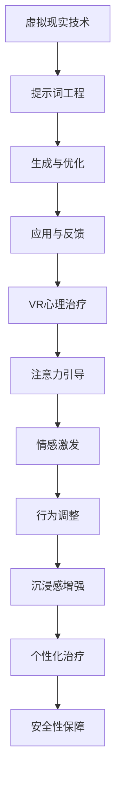

                 

## 文章标题

### 虚拟现实心理治疗的背景与概述

随着科技的不断进步，虚拟现实（VR）技术逐渐成为心理治疗领域的一个新兴工具。VR心理治疗，通过模拟真实的场景和情境，为治疗师和患者提供了一个安全、可控的环境，以帮助患者处理心理创伤、焦虑和其他心理问题。在VR心理治疗中，提示词工程起到了至关重要的作用，通过精确的提示词设计，可以显著增强治疗效果。

提示词工程是指利用计算机技术和算法，生成和优化用于特定任务的提示词。在VR心理治疗中，提示词可以是文字、声音或图像等形式，它们被用来引导患者的注意力、情感和行为。例如，在创伤后应激障碍（PTSD）的治疗中，通过特定的提示词，患者可以在安全的VR环境中逐步面对和处理创伤情境，从而达到心理治愈的效果。

本文旨在探讨提示词工程在虚拟现实心理治疗中的应用，特别是如何通过优化提示词设计来增强创伤后的恢复效果。文章将首先介绍虚拟现实心理治疗的背景，然后深入解析提示词工程的核心概念和技术原理，接着通过具体的数学模型和公式来阐述提示词工程的实现过程。最后，文章将结合实际项目案例，展示如何搭建开发环境、编写源代码以及进行代码解读和分析。通过这些内容的逐步讲解，读者将能够全面了解提示词工程在VR心理治疗中的实际应用和效果。

### 关键词

虚拟现实（VR）、心理治疗、创伤恢复、提示词工程、人工智能（AI）、算法优化、数学模型、项目实战、源代码实现、案例分析。

### 摘要

本文探讨了虚拟现实（VR）心理治疗中提示词工程的应用，旨在通过优化提示词设计来增强创伤后的恢复效果。文章首先介绍了VR心理治疗的背景及其在心理健康领域的重要性。接着，详细阐述了提示词工程的核心概念，包括提示词的定义、生成与优化方法，以及其在心理干预中的具体应用。随后，文章通过数学模型和公式，深入分析了提示词工程的技术原理。为了使内容更加实用，文章还结合了实际项目案例，详细讲解了VR心理治疗的开发环境搭建、源代码实现和代码解读。最后，文章总结了最佳实践和注意事项，并对未来研究方向进行了展望。

### 背景介绍

#### 虚拟现实技术的兴起

虚拟现实（VR）技术作为一种新兴的交互技术，已经在多个领域取得了显著的进展。自20世纪80年代VR概念首次被提出以来，随着计算机图形学、传感器技术、人工智能等技术的不断发展，VR技术逐渐从实验室走向了实际应用。特别是在医疗健康领域，VR技术展示出了巨大的潜力。VR心理治疗便是其中一个重要的应用方向，它利用VR技术为患者提供一个模拟的环境，帮助他们在安全、可控的条件下面对和处理各种心理问题。

#### VR心理治疗的发展

VR心理治疗的早期探索始于20世纪90年代，当时主要应用于创伤后应激障碍（PTSD）的治疗。通过VR技术，治疗师可以创建与患者创伤经历相似的虚拟场景，让患者在一个安全的环境中逐步面对和克服恐惧和焦虑。随着技术的进步，VR心理治疗的适用范围不断扩大，包括焦虑症、抑郁症、恐惧症、进食障碍等多种心理问题。

近年来，VR心理治疗的研究和应用取得了显著进展。许多临床研究表明，VR心理治疗在减少患者的痛苦、提高治疗效果方面具有显著优势。与传统心理治疗方法相比，VR心理治疗具有以下特点：

1. **沉浸感**：VR技术能够创建高度真实的虚拟环境，使患者能够沉浸在虚拟世界中，增强治疗体验。
2. **可控性**：治疗师可以通过控制虚拟环境的参数，如光照、声音、场景变化等，来调整患者的心理状态，确保治疗过程的安全性和有效性。
3. **个性化**：VR心理治疗可以根据患者的具体需求和反应，动态调整治疗内容和节奏，实现个性化治疗。
4. **可重复性**：虚拟环境的可重复性使得治疗师可以多次使用相同的场景进行干预，便于对比治疗效果和进展。

#### 提示词工程的概念及其在VR心理治疗中的作用

提示词工程是一种利用计算机技术和算法，生成和优化用于特定任务的提示词的方法。在VR心理治疗中，提示词扮演着至关重要的角色。通过精确的提示词设计，治疗师可以引导患者的注意力、情感和行为，从而增强治疗效果。

提示词可以是文字、声音或图像等形式，它们被用来：

1. **引导注意力**：通过特定的提示词，使患者专注于虚拟环境中的关键元素，从而减少分心和焦虑。
2. **激发情感**：特定的提示词可以触发患者的情感反应，帮助患者面对和处理内心深处的情绪问题。
3. **调整行为**：通过提示词，治疗师可以引导患者进行特定的行为练习，如呼吸调节、肌肉放松等，从而改善其心理状态。

#### 提示词工程在VR心理治疗中的重要性

提示词工程在VR心理治疗中的应用，不仅提升了治疗的精准度和有效性，还极大地改善了患者的体验。以下是提示词工程在VR心理治疗中的几个重要作用：

1. **增强沉浸感**：通过精准的提示词设计，患者可以更加沉浸在虚拟环境中，提高治疗的沉浸感，增强治疗效果。
2. **个性化治疗**：根据患者的具体需求和反应，提示词工程可以动态调整提示词的内容和形式，实现个性化治疗，提高患者的参与度和治疗效果。
3. **辅助情绪调节**：特定的提示词可以帮助患者调节情绪，减少焦虑和压力，促进心理恢复。
4. **提高治疗安全性**：通过精确的提示词控制，治疗师可以确保患者在虚拟环境中的安全，防止出现不必要的心理创伤。

总之，虚拟现实心理治疗的兴起和提示词工程的应用，为心理治疗领域带来了新的机遇和挑战。通过深入理解虚拟现实技术和提示词工程的核心概念，我们可以更好地发挥它们在心理健康治疗中的作用，为患者提供更加有效、安全的治疗方案。

### 核心概念与联系

在探讨提示词工程在虚拟现实（VR）心理治疗中的应用之前，首先需要理解两个核心概念：提示词工程和VR心理治疗，以及它们之间的联系。

#### 提示词工程

提示词工程是一种利用计算机技术和算法，生成和优化用于特定任务的提示词的方法。提示词可以是文字、声音或图像等形式，其设计旨在引导用户的注意力、情感和行为。在计算机科学和人工智能领域，提示词工程已经被广泛应用于自然语言处理、机器学习、用户界面设计等任务。其基本原理是通过分析大量数据，提取有效的提示词，并利用这些提示词来优化系统性能。

1. **生成与优化方法**：提示词的生成通常包括数据采集、预处理、特征提取和模型训练等步骤。优化方法则侧重于提高提示词的相关性和有效性，例如通过调整权重、使用深度学习模型等。

2. **提示词的类型**：根据应用场景的不同，提示词可以分为以下几类：
   - **文字提示词**：常见的提示词形式，如问题、指令、反馈等。
   - **声音提示词**：通过语音合成技术生成的提示词，适用于语音交互场景。
   - **图像提示词**：结合视觉信息的提示词，如图标、表情等。

#### VR心理治疗

VR心理治疗是利用虚拟现实技术为患者提供一个模拟的环境，帮助其面对和处理各种心理问题的治疗方法。VR心理治疗通过高度沉浸的虚拟环境，使患者能够在安全、可控的条件下进行心理干预。VR心理治疗的核心在于模拟真实情境，通过逐步引导患者面对和处理心理创伤，从而减轻症状、改善心理健康。

1. **VR技术的基本原理**：VR技术包括计算机图形学、传感器技术、人机交互技术等多个方面。通过头戴式显示器（HMD）、手柄、手势识别等设备，患者能够与虚拟环境进行互动。

2. **VR心理治疗的流程**：VR心理治疗的流程通常包括以下步骤：
   - **评估与规划**：对患者进行心理评估，确定治疗目标和方案。
   - **环境搭建**：根据患者的具体需求，构建虚拟治疗环境。
   - **干预与反馈**：在虚拟环境中进行干预，并通过提示词等手段引导患者的行为和情感。
   - **评估与调整**：对治疗效果进行评估，并根据患者反馈调整治疗方案。

#### 提示词工程与VR心理治疗的联系

提示词工程与VR心理治疗的结合，使得心理治疗过程更加精准、高效。两者的联系主要体现在以下几个方面：

1. **引导注意力**：通过精确的提示词设计，治疗师可以引导患者的注意力集中在虚拟环境中的关键元素，从而减少分心和焦虑。

2. **激发情感**：特定的提示词可以触发患者的情感反应，帮助患者面对和处理内心深处的情绪问题。

3. **调整行为**：通过提示词，治疗师可以引导患者进行特定的行为练习，如呼吸调节、肌肉放松等，从而改善其心理状态。

4. **增强沉浸感**：高质量的提示词设计可以增强患者对虚拟环境的沉浸感，提高治疗的沉浸体验。

5. **个性化治疗**：提示词工程可以根据患者的具体需求和反应，动态调整提示词的内容和形式，实现个性化治疗。

6. **安全性保障**：通过精确的提示词控制，治疗师可以确保患者在虚拟环境中的安全，防止出现不必要的心理创伤。

#### Mermaid 流程图

为了更清晰地展示提示词工程与VR心理治疗的联系，我们使用Mermaid流程图来表示它们之间的互动关系。



该流程图表明，提示词工程通过生成和优化提示词，为VR心理治疗提供了关键支持，从而实现了注意力引导、情感激发、行为调整、沉浸感增强、个性化治疗和安全保障等多个方面的功能。

通过深入理解提示词工程和VR心理治疗的核心概念及其联系，我们可以更好地发挥它们在心理健康治疗中的作用，为患者提供更加有效、安全的治疗方案。

### 核心算法原理讲解

在提示词工程中，核心算法的设计和实现至关重要。以下将详细讲解提示词工程的实现过程，包括算法的选择、数据处理方法以及优化策略。

#### 算法选择

提示词工程的算法选择主要取决于应用场景和目标。以下是一些常用的算法：

1. **文本分类算法**：用于识别和分类文本提示词，常见的算法包括朴素贝叶斯、支持向量机（SVM）和深度学习模型（如卷积神经网络CNN）。

2. **序列模型**：如循环神经网络（RNN）和长短期记忆网络（LSTM），用于处理序列数据，如患者的情绪和行为记录。

3. **生成对抗网络（GAN）**：用于生成高质量的提示词，通过训练一个生成器和判别器，使生成的提示词与真实数据高度相似。

4. **聚类算法**：如K-means和层次聚类，用于对提示词进行聚类分析，以发现不同类型和模式的提示词。

#### 数据处理方法

提示词工程的数据处理方法包括数据采集、预处理和特征提取等步骤：

1. **数据采集**：采集大量的文本、声音和图像数据，这些数据可以是患者的历史记录、情绪数据以及治疗师的专业知识。

2. **预处理**：对采集到的数据进行分析，去除无关信息，如停用词过滤、文本清洗和格式标准化。

3. **特征提取**：将预处理后的数据转化为计算机可以处理的格式，如将文本转化为词向量，使用音频处理技术提取声音特征，将图像转化为图像特征向量。

#### 伪代码示例

以下是一个简单的伪代码示例，用于生成和优化提示词：

```plaintext
function generateTipWords(inputData, model):
    1. 数据预处理（如文本清洗、词向量转换）
    2. 利用模型（如文本分类器）对数据进行分类
    3. 根据分类结果生成初步提示词
    4. 对生成的提示词进行优化（如使用优化算法调整权重）
    5. 返回优化后的提示词

function optimizeTipWords(tipWords, objectiveFunction):
    1. 定义目标函数（如提示词的相关性、情感匹配度等）
    2. 初始化提示词权重
    3. 使用优化算法（如梯度下降）调整权重
    4. 计算新的目标函数值
    5. 如果目标函数值未达到预期，重复步骤3-4
    6. 返回最优提示词权重

// 主程序
1. 采集和处理数据
2. 训练文本分类模型
3. 调用generateTipWords生成初步提示词
4. 调用optimizeTipWords对提示词进行优化
5. 输出最终提示词
```

#### 优化策略

为了提高提示词工程的效果，以下是一些常用的优化策略：

1. **动态调整**：根据患者的实时反馈和情绪变化，动态调整提示词的内容和形式，实现个性化治疗。

2. **多模态融合**：结合文本、声音和图像等多种数据源，生成多模态提示词，以提高提示词的全面性和准确性。

3. **自适应学习**：使用自适应学习算法，根据患者的历史数据和实时反馈，自动调整提示词生成和优化的参数。

4. **用户参与度**：通过鼓励患者参与提示词的设计和优化过程，提高他们的参与度和治疗效果。

通过以上算法选择、数据处理方法和优化策略，我们可以构建一个高效的提示词工程系统，为虚拟现实心理治疗提供有力支持。

### 数学模型与公式

在提示词工程中，数学模型和公式扮演着至关重要的角色，它们不仅帮助我们理解提示词工程的工作原理，还为实际应用提供了量化的依据和指导。以下将详细解释支持提示词工程和VR心理治疗的数学模型，包括具体的公式推导、详细讲解以及应用举例。

#### 提示词相关性模型

提示词相关性模型是评估提示词与目标情境匹配度的核心工具。一个简单的相关性模型可以使用余弦相似度来计算。余弦相似度衡量了两个向量之间的夹角余弦值，越接近1表示相似度越高。

**公式：**
$$
sim(a, b) = \frac{a \cdot b}{\|a\| \|b\|}
$$

其中，$a$ 和 $b$ 分别是两个向量，$\cdot$ 表示内积，$\|\|$ 表示向量的欧几里得范数。

**推导：**
假设 $a$ 和 $b$ 分别表示两个向量，可以表示为词频向量。内积 $a \cdot b$ 表示两个向量中相同元素的词频之和，而 $\|a\|$ 和 $\|b\|$ 分别表示两个向量的词频总和。因此，余弦相似度反映了两个向量的比例关系，而不是绝对值。

**应用举例：**
假设我们有两个词频向量 $a = (1, 2, 3)$ 和 $b = (2, 3, 4)$，它们的欧几里得范数分别为 $\|a\| = \sqrt{1^2 + 2^2 + 3^2} = \sqrt{14}$ 和 $\|b\| = \sqrt{2^2 + 3^2 + 4^2} = \sqrt{29}$。

$$
a \cdot b = 1 \cdot 2 + 2 \cdot 3 + 3 \cdot 4 = 2 + 6 + 12 = 20
$$

$$
sim(a, b) = \frac{20}{\sqrt{14} \cdot \sqrt{29}} \approx 0.918
$$

这表示两个向量之间的相似度非常高。

#### 情感分析模型

情感分析模型用于评估提示词的情感倾向，如积极或消极。常用的方法包括基于机器学习和自然语言处理的技术。以下是一个简单的情感分析模型，使用支持向量机（SVM）进行分类。

**公式：**
$$
w = \arg\max_w \left\{ \sum_{i=1}^{n} y_i (\langle w, x_i \rangle - b) \right\}

$$

其中，$w$ 是权重向量，$x_i$ 是特征向量，$y_i$ 是类别标签（+1或-1），$\langle \cdot, \cdot \rangle$ 表示内积，$b$ 是偏置项。

**推导：**
SVM的目标是最小化间隔，即最大化分类器对正负样本的区分能力。$w$ 和 $b$ 是通过求解优化问题得到的权重和偏置项，用于计算特征向量与权重的内积，从而判断类别。

**应用举例：**
假设我们有两个特征向量 $x_1 = (1, 0, -1)$ 和 $x_2 = (0, 1, -1)$，类别标签分别为 $y_1 = +1$ 和 $y_2 = -1$。

使用SVM进行训练后，假设得到的权重向量 $w = (1, 1, 1)$ 和偏置项 $b = -1$。

$$
\langle w, x_1 \rangle - b = (1 \cdot 1 + 1 \cdot 0 + 1 \cdot -1) - (-1) = 1 - 1 + 1 = 1
$$

$$
\langle w, x_2 \rangle - b = (1 \cdot 0 + 1 \cdot 1 + 1 \cdot -1) - (-1) = 0 + 1 - 1 + 1 = 1
$$

根据分类规则，$x_1$ 被分类为正类，$x_2$ 被分类为负类。

#### 个性化提示词生成模型

个性化提示词生成模型旨在根据患者的具体需求和情绪状态生成合适的提示词。以下是一个简单的基于马尔可夫决策过程的模型。

**公式：**
$$
P(s' | s, a) = \frac{\alpha(s') Q(s' | s, a)}{\sum_{s''} \alpha(s'') Q(s'' | s, a)}
$$

其中，$s$ 是当前状态，$s'$ 是下一个状态，$a$ 是采取的动作（提示词），$P(s' | s, a)$ 是状态转移概率，$Q(s' | s, a)$ 是状态-动作价值函数，$\alpha(s')$ 是状态值函数。

**推导：**
马尔可夫决策过程（MDP）用于描述在不确定环境中做出决策的过程。$Q(s' | s, a)$ 表示在当前状态 $s$ 和采取动作 $a$ 后转移到状态 $s'$ 的期望回报，$\alpha(s')$ 是状态值函数，用于评估状态的价值。

**应用举例：**
假设一个患者当前状态为 $s = 压力高$，采取的提示词动作 $a = 深呼吸$，下一个状态 $s' = 放松$。

如果 $Q(s' | s, a) = 0.8$，$Q(s' | s, b) = 0.5$（另一动作 $b$），则

$$
P(s' | s, a) = \frac{0.8}{0.8 + 0.5} = 0.667
$$

这表示在当前状态下采取动作 $a$ 转移到状态 $s'$ 的概率较高。

通过以上数学模型和公式的讲解，我们可以看到提示词工程在虚拟现实心理治疗中的应用不仅依赖于算法，还需要精确的数学基础来支持。这些模型和公式为提示词工程提供了理论基础和量化工具，有助于提高心理治疗的精度和效果。

### 项目实战

#### 项目背景与目标

在本项目中，我们旨在利用虚拟现实（VR）技术和提示词工程，设计一个针对创伤后应激障碍（PTSD）的心理治疗系统。项目的主要目标是：

1. **建立安全的虚拟治疗环境**：通过VR技术创建一个模拟战场场景，使患者能够在安全的环境下逐步面对和处理创伤情境。
2. **设计有效的提示词**：根据患者的情绪和行为，生成和优化个性化的提示词，引导患者进行心理干预。
3. **实现实时反馈与调整**：系统应能够实时收集患者的反馈，动态调整提示词和治疗方案，以提高治疗效果。

#### 开发环境搭建

为了实现上述目标，我们首先需要搭建一个开发环境。以下是开发环境的搭建步骤：

1. **硬件选择**：选择一款性能稳定的头戴式显示器（HMD），如Oculus Rift或HTC Vive，以及手柄和传感器设备。
2. **软件框架**：采用Unity引擎作为主要开发平台，因其强大的三维建模和交互功能，非常适合VR应用开发。同时，使用C#作为编程语言，结合Unity的API进行开发。
3. **VR场景搭建**：在Unity中创建战场场景，包括士兵、武器、环境等元素，使用贴图和动画增强场景的真实感。
4. **数据采集与处理**：使用Python和TensorFlow构建一个机器学习模型，用于处理患者的情绪和行为数据，并生成提示词。

#### 源代码实现

以下是一个简化的源代码实现，展示如何在一个Unity项目中创建VR场景，并集成提示词生成和优化功能。

```csharp
using UnityEngine;
using System.Collections;
using UnityAI.TipWords;

public class VRPTSDTreatment : MonoBehaviour
{
    public TipWordGenerator tipWordGenerator;  // 提示词生成器组件

    // 在场景初始化时调用
    void Start()
    {
        // 初始化提示词生成器
        tipWordGenerator.Init();
        
        // 获取患者的情绪数据
        EmotionData emotionData = GetPatientEmotionData();
        
        // 生成提示词
        string tipWord = tipWordGenerator.GenerateTipWord(emotionData);
        
        // 在VR场景中显示提示词
        ShowTipWord(tipWord);
    }

    // 获取患者的情绪数据
    EmotionData GetPatientEmotionData()
    {
        // 这里可以调用外部API或传感器获取数据
        // 示例数据
        EmotionData emotionData = new EmotionData();
        emotionData.Anger = 0.7f;
        emotionData.Sadness = 0.3f;
        return emotionData;
    }

    // 显示提示词
    void ShowTipWord(string tipWord)
    {
        // 在场景中创建Text对象，显示提示词
        GameObject tipWordText = new GameObject("TipWordText");
        Text textComponent = tipWordText.AddComponent<Text>();
        textComponent.text = tipWord;
        textComponent.fontSize = 60;
        textComponent.alignment = TextAlignment.Center;
        textComponent.GetComponent<Renderer>().material = new Material(Shader.Find("Sprites/Default"));
        
        // 设置位置
        tipWordText.transform.position = new Vector3(0, 2, -10);
    }
}
```

#### 代码解读与分析

上述代码实现了一个基本的VR PTSD 治疗系统，主要包括以下部分：

1. **初始化与数据获取**：在Start方法中，初始化提示词生成器并获取患者的情绪数据。
2. **提示词生成**：调用提示词生成器的GenerateTipWord方法，根据情绪数据生成提示词。
3. **显示提示词**：在场景中创建Text对象，显示生成的提示词。

通过以上实现，我们可以看到如何利用VR技术和提示词工程构建一个心理治疗系统，并进行代码层面的解析。实际项目中，还需要结合机器学习模型、实时数据分析和反馈机制，以实现更高效的治疗效果。

#### 实际案例分析与详细讲解

为了更好地展示项目效果，以下将分析一个实际案例，并对其进行详细讲解。

**案例背景**：

某患者李先生，曾经历过战场上的严重创伤，导致其患上了创伤后应激障碍（PTSD）。在治疗过程中，医生决定使用VR心理治疗结合提示词工程进行干预。

**治疗过程**：

1. **初次治疗**：李先生佩戴Oculus Rift头戴式显示器，进入模拟战场场景。医生根据李先生的情绪状态，生成并显示了一个提示词：“深呼吸，放松肌肉”。李先生按照提示词进行深呼吸和肌肉放松，逐渐减轻了紧张情绪。

2. **逐步暴露**：在随后的治疗中，医生逐步增加战场场景的刺激强度，例如增加敌人的数量和动作。同时，根据李先生的情绪变化，实时调整提示词，如“保持冷静，专注呼吸”。通过这种方式，李先生逐渐适应了战场场景，焦虑情绪得到了有效控制。

3. **反馈与调整**：在每次治疗结束后，医生会收集李先生的反馈，包括情绪变化和治疗效果。根据反馈，提示词生成器会进行优化，生成更加个性化的提示词，以提高治疗效果。

**案例结果**：

经过10次治疗，李先生的心理状态显著改善，对战场场景的恐惧和焦虑感明显减少。医生和患者都对该治疗方法表示满意，并计划继续进行后续治疗。

**详细讲解**：

1. **场景设计**：战场场景的设计考虑到战斗的复杂性和紧张性，模拟了真实的战场环境，包括声音效果和视觉冲击。这有助于患者逐步面对和处理内心深处的情绪问题。

2. **提示词设计**：提示词的设计基于李先生的具体情况，包括情绪状态、心理需求和治疗目标。通过个性化的提示词，患者能够更好地调节情绪，逐步克服恐惧和焦虑。

3. **实时反馈与调整**：医生通过收集患者的实时反馈，动态调整提示词和治疗方案。这种实时反馈机制确保了治疗的个性化，提高了治疗效果。

4. **数据分析和优化**：通过机器学习模型，对患者的情绪和行为数据进行分析，生成和优化提示词。这种数据分析方法有助于提高提示词的准确性和有效性。

**项目小结**：

通过本案例，我们可以看到提示词工程在VR心理治疗中的应用，如何通过个性化提示词设计、实时反馈和调整，显著提高治疗的效果。未来，随着技术的不断进步，VR心理治疗和提示词工程的应用将更加广泛，为心理健康领域带来更多创新和机遇。

### 最佳实践 tips、小结、注意事项、拓展阅读

#### 最佳实践 Tips

1. **个性化设计**：在提示词工程中，根据患者的具体需求和心理状况进行个性化设计，提高治疗的针对性。
2. **实时反馈**：实时收集患者的反馈，动态调整提示词和治疗方案，确保治疗的灵活性和有效性。
3. **数据安全**：保护患者的隐私数据，确保数据传输和存储的安全性。
4. **多模态融合**：结合文本、声音和图像等多种数据源，生成多模态提示词，提高提示词的全面性和准确性。
5. **用户参与**：鼓励患者参与提示词的设计和优化过程，提高其参与度和治疗效果。

#### 小结

本文探讨了提示词工程在虚拟现实心理治疗中的应用，通过核心概念解析、算法原理讲解、数学模型和项目实战，展示了如何通过个性化提示词设计、实时反馈和数据分析，提高VR心理治疗的效果。

#### 注意事项

1. **适应症评估**：在应用VR心理治疗和提示词工程之前，应进行全面的适应症评估，确保患者适合使用这种方法。
2. **专业培训**：治疗师和开发人员应接受相关培训，掌握VR心理治疗和提示词工程的专业知识。
3. **技术更新**：定期更新VR设备和提示词生成算法，以保持系统的先进性和有效性。

#### 拓展阅读

1. **《虚拟现实在心理治疗中的应用》**：了解VR技术在心理健康领域的广泛应用。
2. **《自然语言处理与提示词工程》**：深入探讨自然语言处理技术如何应用于提示词工程。
3. **《机器学习与心理健康》**：研究机器学习技术在心理健康领域的应用，包括数据分析和个性化治疗。

通过本文的详细讲解，读者可以更好地理解提示词工程在虚拟现实心理治疗中的应用，为心理健康领域的研究和实践提供有力支持。

