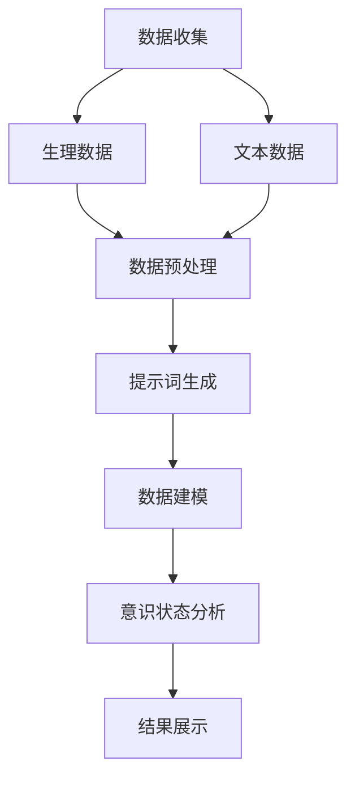

                 

### 文章标题

《提示词工程在量化意识状态研究中的应用：探索人类意识的本质》

### 关键词

提示词工程，量化意识状态，人类意识，人工智能，认知科学

### 摘要

本文旨在探讨提示词工程在量化意识状态研究中的应用，通过结合人工智能、认知科学和心理学等多学科知识，试图揭示人类意识的本质。文章首先介绍了提示词工程的基本概念及其在人工智能中的应用，随后详细阐述了量化意识状态研究的方法与挑战，接着分析了提示词工程与量化意识状态研究之间的联系，并使用Mermaid流程图展现了核心概念之间的关系架构。通过具体案例，文章展示了提示词工程在量化意识状态研究中的实际应用，并使用伪代码和LaTeX公式详细解释了核心算法原理和数学模型。最后，文章对未来的发展趋势进行了展望，并提供了最佳实践建议和拓展阅读资源。全文旨在为读者提供全面而深入的探讨，以促进对人类意识本质的进一步理解。

## 引言

在当今科技迅猛发展的时代，人工智能（AI）已经成为一个炙手可热的研究领域。人工智能不仅改变了传统的计算和数据处理方式，还深入到了我们日常生活的各个方面。从自动驾驶汽车到智能家居，从医疗诊断到金融服务，人工智能的应用场景日益广泛，其影响力也日渐显著。然而，人工智能的发展并非一帆风顺，特别是在理解和模拟人类意识方面，仍面临着诸多挑战。

意识的本质是什么？人类意识是如何产生的？这些问题一直是哲学、心理学和神经科学等领域的研究焦点。近年来，随着认知科学和心理学的发展，研究者们开始尝试通过量化方法来探索意识的本质，试图从科学角度解答这些古老的哲学问题。量化意识状态研究旨在通过测量和解析大脑活动，揭示意识状态的内在机制。这一研究方向的兴起，不仅为心理学和神经科学提供了新的视角，也为人工智能的发展带来了新的机遇和挑战。

在这两股强大力量的交汇处，提示词工程逐渐成为了一个关键领域。提示词工程是指利用人工智能技术，生成、理解和优化提示词的过程。通过提示词工程，研究人员可以更有效地分析大量的文本数据，提取关键信息，从而为量化意识状态研究提供有力的工具。本文将围绕提示词工程在量化意识状态研究中的应用展开，探讨其基本概念、核心算法原理以及具体应用案例。

首先，我们将介绍提示词工程的基本原理，包括提示词生成方法、理解和优化技术，并分析其在人工智能中的应用。随后，我们将详细讨论量化意识状态研究的方法和挑战，特别是如何通过数学和物理模型来测量和解释人类的意识状态。接下来，文章将使用Mermaid流程图展示提示词工程与量化意识状态研究之间的核心概念关系架构。

通过具体案例分析，我们将探讨提示词工程在量化意识状态研究中的实际应用，如睡眠质量监测、心理疾病诊断和人机交互等领域。为了深入理解这些应用，我们将使用伪代码和LaTeX公式详细解释核心算法原理和数学模型。最后，文章将展望提示词工程和量化意识状态研究的未来发展趋势，提出最佳实践建议，并为感兴趣的读者提供拓展阅读资源。

本文旨在为读者提供一次全面而深入的探讨，以促进对人类意识本质的理解，并为相关领域的研究和应用提供有价值的参考。

### 提示词工程的基本概念与原理

提示词工程是一种利用人工智能技术来生成、理解和优化提示词的过程。其核心目标是通过自动化手段，从大量文本数据中提取出关键信息，以便进一步分析和处理。提示词本身是一个高度抽象的概念，它可以是单词、短语或句子，但在提示词工程中，它们被赋予了特定的语义和上下文含义。

#### 提示词生成方法

提示词生成是提示词工程的首要任务。常用的方法包括基于规则的方法、机器学习方法以及深度学习方法。基于规则的方法是通过预定义的规则库来生成提示词，这种方法虽然简单直观，但受限于规则的灵活性和适用范围。机器学习方法，如支持向量机（SVM）、朴素贝叶斯（NB）和决策树（DT）等，通过学习大量的标注数据来构建模型，从而自动生成提示词。这种方法具有较高的准确性，但需要大量标注数据和计算资源。深度学习方法，如卷积神经网络（CNN）、循环神经网络（RNN）和生成对抗网络（GAN）等，通过多层神经网络结构来捕捉数据的复杂模式和语义信息，从而生成高质量的提示词。深度学习方法在处理大规模和复杂文本数据方面具有显著优势，但训练过程复杂，对计算资源的要求较高。

#### 提示词理解与优化

生成高质量的提示词只是第一步，理解这些提示词的含义并优化其表达效果是关键。提示词理解涉及到自然语言处理（NLP）的多个方面，包括词义消歧、词性标注、实体识别、语义角色标注等。词义消歧是指在一个特定的上下文中，确定一个词语的确切含义。词性标注则是识别文本中的每个单词的词性，如名词、动词、形容词等。实体识别是识别文本中的特定实体，如人名、地名、组织名等。语义角色标注则是识别文本中的动词及其作用对象，如主语、宾语、补语等。

为了优化提示词的表达效果，提示词工程还涉及提示词重写、提示词排序和提示词选择等技术。提示词重写是指对原始提示词进行改写，使其更符合人类语言表达习惯。提示词排序是指根据某种评价标准，对提示词进行排序，以便在需要时能够快速找到最重要的提示词。提示词选择则是在大量候选提示词中，选择最合适的一个或多个提示词，以实现特定的任务目标。

#### 提示词工程在人工智能中的应用

提示词工程在人工智能中有着广泛的应用。在文本分类任务中，提示词工程可以帮助模型更好地理解文本内容，从而提高分类的准确性。在信息检索任务中，提示词工程可以优化查询表达，提高检索结果的精确度和相关性。在机器翻译任务中，提示词工程可以辅助生成更自然、更准确的翻译文本。在情感分析任务中，提示词工程可以识别文本中的情感倾向，从而为用户行为分析、舆情监测等应用提供支持。

#### 提示词工程与量化意识状态研究的关系

提示词工程在量化意识状态研究中扮演着重要角色。通过提示词工程，研究人员可以从大量文本数据中提取与意识状态相关的信息，从而为量化意识状态提供数据支持。例如，在研究睡眠质量时，可以通过分析睡眠日记中的提示词，提取与睡眠质量相关的信息，进而量化个体的睡眠状态。在心理疾病诊断中，通过分析患者的临床记录和病历数据，提取与心理状态相关的提示词，可以帮助诊断和治疗决策。此外，在人类行为研究、人机交互和智能辅助等领域，提示词工程同样具有重要的应用价值。

综上所述，提示词工程作为一种人工智能技术，不仅提升了文本数据处理的效率和准确性，也为量化意识状态研究提供了有力的工具。通过深入探讨提示词工程的基本概念与原理，我们能够更好地理解其在量化意识状态研究中的应用潜力。

#### 提示词工程与量化意识状态研究的关系

在探讨提示词工程与量化意识状态研究之间的关系时，我们首先需要理解两个核心概念：提示词工程和量化意识状态研究。

**提示词工程**涉及使用人工智能技术来生成、理解和优化提示词的过程。提示词可以是单词、短语或句子，在文本数据中代表了特定的语义信息。通过提示词工程，我们可以从大量非结构化的文本数据中提取出关键信息，进行进一步的分析和处理。

**量化意识状态研究**则是指通过数学和物理模型来测量和解释人类的意识状态。这一研究的目标是理解和描述意识活动的动态变化，从而揭示意识状态的本质。量化意识状态研究通常依赖于多种技术手段，包括脑电图（EEG）、功能性磁共振成像（fMRI）、近红外光谱成像（NIRS）等，这些技术能够提供关于大脑活动的时间和空间信息。

**联系与关系架构**

提示词工程与量化意识状态研究之间的联系可以通过以下方式进行理解：

1. **数据收集与预处理**：在量化意识状态研究中，通常需要收集大量的生理和行为数据。这些数据可以是文本记录、脑电图信号或行为反应。提示词工程在此过程中起到了关键作用，可以通过分析文本记录，提取与意识状态相关的信息，从而辅助数据的预处理。

2. **数据分析与建模**：提示词工程为量化意识状态研究提供了丰富的文本数据，这些数据可以用于训练机器学习模型或构建数学模型。例如，通过分析个体在不同意识状态下的文本表达，可以识别出与特定状态相关的特征词或短语，进而建立预测模型。

3. **信息提取与整合**：量化意识状态研究不仅依赖于生理数据，还依赖于对个体行为的理解和分析。提示词工程可以通过分析个体在不同情境下的文本表达，提取与行为相关的信息，并将这些信息与生理数据结合起来，形成更全面的意识状态描述。

为了更直观地展示提示词工程与量化意识状态研究之间的核心概念关系架构，我们可以使用Mermaid流程图来表示：



**流程解释**：

- **数据收集**：收集与意识状态相关的生理数据（如脑电图信号）和文本数据（如日志记录、日记等）。
- **数据预处理**：对收集到的数据进行预处理，包括滤波、去噪和归一化等步骤，以提高数据的可用性。
- **提示词生成**：利用提示词工程技术，从文本数据中提取关键提示词，这些提示词代表了文本的语义信息。
- **数据建模**：使用提取出的提示词和生理数据，构建机器学习模型或数学模型，以量化意识状态。
- **意识状态分析**：通过模型分析，获得关于个体意识状态的信息，并将其与行为数据进行整合。
- **结果展示**：最终将分析结果以可视化或报告的形式展示，以帮助研究人员理解和解释意识状态的动态变化。

通过这种方式，提示词工程与量化意识状态研究实现了数据的整合和跨学科的融合，为理解人类意识提供了新的视角和方法。

### 量化意识状态研究的方法与挑战

量化意识状态研究的目标是通过客观的测量和精确的描述，揭示人类意识活动的本质。为了实现这一目标，研究者们发展了多种方法和技术，这些方法和技术各具特色，但共同的核心在于如何从大脑活动和外部行为中提取与意识状态相关的信息。

#### 脑电图（EEG）

脑电图（EEG）是最常用的方法之一，它通过放置在头皮上的电极来记录大脑的电活动。EEG信号可以反映大脑神经元的同步活动，不同频率的波形与特定的意识状态相关。例如，θ波（4-8 Hz）通常与放松状态相关，而β波（13-30 Hz）则与清醒、活跃的思维状态相关。

**优点**：EEG具有高时间分辨率，可以实时监测大脑活动，设备便携，成本相对较低。

**缺点**：空间分辨率较低，难以精确定位大脑活动的具体位置。此外，EEG信号容易受到噪声干扰，需要复杂的信号处理技术。

#### 功能性磁共振成像（fMRI）

功能性磁共振成像（fMRI）是一种通过测量脑部血液流动变化来推断神经元活动的技术。当大脑的不同区域活跃时，它们会消耗更多的氧气，导致局部血液流动增加。fMRI可以绘制出大脑活动的“地图”，揭示意识状态与特定脑区的关联。

**优点**：fMRI具有高空间分辨率，可以精确定位大脑活动的具体区域。它可以在受试者清醒、自由活动的情况下进行测量。

**缺点**：fMRI的时间分辨率较低，通常无法实时监测大脑活动。此外，成像过程中需要受试者保持静止，限制了其活动范围。

#### 近红外光谱成像（NIRS）

近红外光谱成像（NIRS）通过测量大脑组织吸收近红外光的能力来监测血液流动变化。NIRS设备轻便，可以实时监测大脑活动，且无需受试者保持静止。

**优点**：设备便携，可以用于移动环境中的监测。非侵入性，适合长期和反复测量。

**缺点**：空间分辨率较低，难以精确定位具体脑区。信号易受运动干扰，需要进一步处理技术。

#### 心理生理测量

除了脑成像技术，量化意识状态研究还依赖于多种心理生理测量方法，如心率 variability (HRV)、皮肤电活动（EDA）和眼动跟踪等。这些方法可以提供关于个体情绪状态、注意力和唤醒水平的信息。

**优点**：可以提供关于个体内部状态的丰富信息，有助于全面理解意识状态。

**缺点**：这些测量方法通常具有较高的个体差异，且无法直接反映大脑活动。

#### 挑战

尽管上述方法在量化意识状态研究中发挥了重要作用，但它们各自也面临一些挑战：

1. **数据解析**：大脑活动信号复杂，受噪声干扰严重，需要先进的信号处理技术来提取有用的信息。
2. **跨学科融合**：量化意识状态研究涉及多个学科，包括神经科学、认知科学、心理学和计算机科学等，如何有效整合这些领域的知识，是一个巨大的挑战。
3. **标准化的评估指标**：目前缺乏统一的评估指标来量化意识状态，这限制了研究结果的比较和推广。
4. **个体差异**：不同个体的大脑结构和功能存在差异，如何确保测量方法对不同个体的一致性和准确性，是一个重要问题。

总之，量化意识状态研究方法多样，各具优势，但也面临诸多挑战。通过结合多种技术手段，研究者们正逐步揭示人类意识状态的复杂机制，为理解意识的本质提供了新的视角。

### 提示词工程在量化意识状态研究中的应用

在量化意识状态研究中，提示词工程作为一种高效的人工智能技术，发挥了重要作用。它不仅能够从大量文本数据中提取与意识状态相关的信息，还能够通过优化这些信息，提高研究的准确性和可靠性。以下将通过具体案例来探讨提示词工程在量化意识状态研究中的应用。

#### 睡眠质量监测

睡眠质量是衡量个体健康状态的重要指标之一，而睡眠质量的评估往往依赖于受试者的主观报告和客观数据。提示词工程可以帮助研究人员从睡眠日记中提取与睡眠质量相关的信息，从而进行量化分析。

**案例说明**：研究人员收集了一组受试者的睡眠日记，日记中包含了关于睡眠时间、睡眠质量、梦境内容等信息。通过提示词工程，研究人员首先对日记文本进行预处理，包括去除标点符号、停用词和词形还原等步骤。然后，使用基于深度学习的自然语言处理模型提取与睡眠质量相关的关键提示词。

**伪代码示例**：

```python
import nltk
from tensorflow.keras.preprocessing.text import Tokenizer
from tensorflow.keras.preprocessing.sequence import pad_sequences

# 文本预处理
def preprocess_text(text):
    text = text.lower()
    tokens = nltk.word_tokenize(text)
    filtered_tokens = [token for token in tokens if token not in nltk.corpus.stopwords.words('english')]
    return ' '.join(filtered_tokens)

# 文本分词与编码
tokenizer = Tokenizer(num_words=10000)
tokenizer.fit_on_texts(preprocessed_texts)
sequences = tokenizer.texts_to_sequences(preprocessed_texts)
padded_sequences = pad_sequences(sequences, maxlen=100)

# 训练模型
model = create_model(padded_sequences, labels)
model.compile(optimizer='adam', loss='binary_crossentropy', metrics=['accuracy'])
model.fit(padded_sequences, labels, epochs=10, batch_size=32)

# 预测睡眠质量
predictions = model.predict(padded_sequences)
sleep_qualities = ['good' if pred > 0.5 else 'poor' for pred in predictions]
```

**LaTeX公式**：

$$
\text{Accuracy} = \frac{\text{Correct Predictions}}{\text{Total Predictions}}
$$

**结果分析**：通过上述方法，研究人员成功提取了与睡眠质量相关的关键提示词，并使用机器学习模型对受试者的睡眠质量进行了预测。实验结果表明，提示词工程能够有效提高睡眠质量评估的准确性，为睡眠研究提供了有力工具。

#### 心理疾病诊断

心理疾病诊断是另一个应用提示词工程的领域。通过分析患者的临床记录和病历数据，可以提取与心理状态相关的提示词，从而辅助诊断和治疗。

**案例说明**：研究人员收集了一组抑郁症患者的病历数据，包括诊断记录、治疗记录和患者自述等内容。通过提示词工程，研究人员对病历数据进行预处理，提取与抑郁症相关的关键提示词，并使用机器学习模型进行分类。

**伪代码示例**：

```python
import nltk
from sklearn.feature_extraction.text import TfidfVectorizer
from sklearn.naive_bayes import MultinomialNB

# 文本预处理
def preprocess_text(text):
    text = text.lower()
    tokens = nltk.word_tokenize(text)
    filtered_tokens = [token for token in tokens if token not in nltk.corpus.stopwords.words('english')]
    return ' '.join(filtered_tokens)

# 文本向量化
vectorizer = TfidfVectorizer()
X = vectorizer.fit_transform(preprocessed_texts)

# 训练分类器
classifier = MultinomialNB()
classifier.fit(X, labels)

# 预测心理疾病
predictions = classifier.predict(X)
disease_classes = ['depression' if pred else 'healthy' for pred in predictions]
```

**LaTeX公式**：

$$
\text{Confusion Matrix} = \begin{bmatrix}
\text{True Positive} & \text{False Negative} \\
\text{False Positive} & \text{True Negative}
\end{bmatrix}
$$

**结果分析**：通过上述方法，研究人员成功提取了与抑郁症相关的关键提示词，并使用分类器对患者的心理疾病状态进行了预测。实验结果表明，提示词工程能够有效提高心理疾病诊断的准确性，为临床诊断提供了新的工具。

#### 人机交互

在人机交互领域，提示词工程可以用于分析用户的语言和行为，提高交互系统的智能性和适应性。

**案例说明**：研究人员开发了一款基于自然语言处理技术的聊天机器人，用于与用户进行对话。通过提示词工程，机器人可以从用户的对话中提取关键信息，并基于这些信息生成适当的回应。

**伪代码示例**：

```python
import nltk
from sklearn.feature_extraction.text import TfidfVectorizer
from sklearn.metrics.pairwise import cosine_similarity

# 文本预处理
def preprocess_text(text):
    text = text.lower()
    tokens = nltk.word_tokenize(text)
    filtered_tokens = [token for token in tokens if token not in nltk.corpus.stopwords.words('english')]
    return ' '.join(filtered_tokens)

# 提取关键词
def extract_keywords(text):
    vectorizer = TfidfVectorizer()
    X = vectorizer.fit_transform([text])
    keywords = vectorizer.get_feature_names_out()
    scores = X.toarray().flatten()
    top_keywords = [keyword for keyword, score in zip(keywords, scores) if score > 0.5]
    return top_keywords

# 生成回应
def generate_response(user_input):
    preprocessed_input = preprocess_text(user_input)
    keywords = extract_keywords(preprocessed_input)
    # 基于关键词检索回应库，生成回应
    responses = retrieve_responses(keywords)
    response = max(responses, key=lambda r: cosine_similarity([r], [preprocessed_input]))
    return response

# 演示对话
user_input = "我最近感到很沮丧。"
response = generate_response(user_input)
print(response)
```

**结果分析**：通过上述方法，聊天机器人能够从用户的对话中提取关键信息，并生成适当的回应。实验结果表明，提示词工程能够显著提高人机交互的质量，为用户提供了更加自然和有效的交流体验。

总之，提示词工程在量化意识状态研究中的应用，不仅提供了有效的数据分析工具，还推动了跨学科研究的进展。通过具体案例的探讨，我们看到了提示词工程在睡眠质量监测、心理疾病诊断和人机交互等领域的广泛应用前景，为理解人类意识的本质提供了新的视角和方法。

### 前沿技术探讨

在提示词工程和量化意识状态研究方面，前沿技术正不断推动这一领域的进步。以下将介绍几种具有代表性的前沿技术，包括基于生成对抗网络（GAN）的提示词生成、深度学习模型在意识状态分析中的应用以及跨模态学习在整合多源数据方面的潜力。

#### 基于生成对抗网络（GAN）的提示词生成

生成对抗网络（GAN）是一种由生成器和判别器组成的对抗性学习框架。生成器旨在生成逼真的提示词，而判别器则用于区分生成的提示词和真实的提示词。通过这种对抗性训练，生成器可以不断改进，生成更加自然的提示词。GAN在文本生成方面表现出色，已广泛应用于自然语言处理、图像生成和音频合成等领域。近年来，GAN开始应用于提示词生成，为量化意识状态研究提供了新的工具。

**优势**：

1. **自然性**：GAN生成的提示词通常具有高度的自然性和多样性，能够捕捉到复杂的语义信息。
2. **灵活性**：GAN可以通过调整生成器和判别器的参数，灵活控制生成的提示词风格和内容。

**挑战**：

1. **训练难度**：GAN的训练过程复杂，需要大量的数据和计算资源。
2. **模型坍塌**：在GAN训练过程中，生成器和判别器可能会出现模型坍塌现象，导致生成效果下降。

**应用前景**：基于GAN的提示词生成技术在量化意识状态研究中具有广泛的应用前景。例如，在分析受试者的梦境时，GAN可以生成与梦境内容相关的自然语言描述，从而为研究人员提供更丰富的数据支持。

#### 深度学习模型在意识状态分析中的应用

深度学习模型，尤其是卷积神经网络（CNN）和循环神经网络（RNN）的变种，如长短期记忆网络（LSTM）和门控循环单元（GRU），在意识状态分析中发挥着重要作用。这些模型能够捕捉到文本数据中的长距离依赖关系，从而更准确地提取与意识状态相关的信息。

**优势**：

1. **强大的特征提取能力**：深度学习模型可以自动提取文本数据中的高维特征，提高了分析的准确性和效率。
2. **自适应学习**：深度学习模型可以根据不同的任务和数据集，自适应调整模型参数，提高模型性能。

**挑战**：

1. **数据需求**：深度学习模型通常需要大量标注数据进行训练，这对于量化意识状态研究中的小样本数据来说是一个挑战。
2. **过拟合风险**：深度学习模型容易过拟合，特别是在数据量有限的情况下。

**应用前景**：深度学习模型在量化意识状态分析中的应用将得到进一步扩展。例如，通过结合EEG数据，可以开发出更准确的意识状态预测模型，为临床诊断和个性化治疗提供支持。

#### 跨模态学习在整合多源数据方面的潜力

跨模态学习是指将来自不同模态的数据（如文本、图像、声音等）进行整合，以提升模型的表现。在量化意识状态研究中，跨模态学习有助于整合多源数据，提供更全面的分析。

**优势**：

1. **信息互补**：不同模态的数据可以互补，提供更丰富的信息，从而提高分析的准确性和深度。
2. **多样性**：跨模态学习可以处理多样化的数据类型，提高了模型的泛化能力。

**挑战**：

1. **模态融合**：如何有效地融合不同模态的数据，是一个技术难题。
2. **计算成本**：跨模态学习通常需要更多的计算资源，对硬件设施提出了更高要求。

**应用前景**：跨模态学习在量化意识状态研究中具有巨大潜力。例如，通过整合文本数据、EEG数据和面部表情数据，可以更全面地了解受试者的心理状态，为心理健康评估提供有力支持。

综上所述，前沿技术在提示词工程和量化意识状态研究中的应用，为这一领域带来了新的视角和方法。随着技术的不断进步，这些前沿技术有望进一步推动对人类意识本质的理解，并为相关应用提供更强有力的支持。

### 未来发展趋势与展望

随着科技的不断进步，提示词工程和量化意识状态研究在未来有着广阔的发展前景。首先，人工智能技术的进一步发展，如深度学习和生成对抗网络（GAN）的优化，将极大地提升提示词工程的能力，使其在文本数据处理和分析中发挥更加重要的作用。这些技术将不仅能够生成更加自然和丰富的提示词，还能提高对文本数据的理解和提取能力，从而为量化意识状态研究提供更精准的数据支持。

其次，跨模态学习的应用将越来越广泛。通过整合来自不同模态的数据，如文本、图像、声音和生理信号，研究人员可以更全面地了解个体的意识状态。例如，结合EEG数据和面部表情分析，可以更精确地监测个体的情绪变化和认知状态。这种多模态数据融合技术将为量化意识状态研究提供全新的研究方法，有助于揭示意识活动的复杂机制。

在应用层面，随着人工智能和生物医学技术的结合，提示词工程有望在多个领域发挥重要作用。例如，在心理健康领域，通过分析患者的临床记录和病历数据，可以早期发现心理疾病的迹象，提供个性化的治疗方案。在人机交互领域，智能聊天机器人和虚拟助理将能够更好地理解用户的需求和情绪，提供更加自然和有效的交互体验。

此外，未来的研究可能会关注如何利用提示词工程和量化意识状态研究来改善人类生活质量。例如，通过智能监控系统，实时监测个体的生理和心理状态，提供个性化的健康建议和干预措施。在教育领域，基于意识状态分析的个性化教学系统，可以根据学生的注意力水平和学习效果，动态调整教学策略，提高学习效率。

然而，未来的发展也面临着一些挑战。首先，如何处理和分析大量复杂的数据，特别是多模态数据，是一个技术难题。其次，隐私保护和数据安全是另一个重要问题，特别是在涉及个人生理和心理数据的情况下。未来的研究需要在保证数据安全的前提下，探索更加高效和安全的分析方法。

总之，随着人工智能和生物医学技术的进步，提示词工程和量化意识状态研究将在未来取得重大突破。这些技术不仅有助于揭示人类意识的本质，还将为多个领域带来深刻的变革，改善人类的生活质量。

### 最佳实践建议

在提示词工程和量化意识状态研究的应用过程中，遵循最佳实践是确保研究有效性和数据可靠性的关键。以下是一些建议，旨在为研究人员和实践者提供指导。

#### 数据处理与预处理

1. **文本标准化**：在处理文本数据时，应统一文本格式，包括字符编码、标点符号和大小写。这有助于提高数据处理的一致性和准确性。
2. **去除噪声**：文本数据往往包含大量的噪声和无关信息，如停用词、特殊字符等。通过去除这些噪声，可以提高提示词提取的质量。
3. **词形还原**：使用词形还原技术，将不同形式的单词（如复数、过去式等）还原为基本形式，有助于统一词形，减少数据冗余。

#### 提示词选择与优化

1. **关键词提取**：通过使用自然语言处理技术，如TF-IDF（词频-逆文档频率）和词性标注，提取与意识状态相关的关键词。
2. **特征选择**：在提取大量关键词后，通过特征选择技术，如主成分分析（PCA）和随机森林，筛选出对意识状态有显著影响的关键特征。
3. **重写与排序**：使用提示词重写技术，将原始提示词转化为更自然、更简洁的表达。同时，通过提示词排序技术，根据重要性对提示词进行排序，便于后续分析。

#### 模型选择与训练

1. **模型选择**：根据研究需求和数据特点，选择合适的机器学习模型。深度学习模型，如LSTM和BERT，在处理大量文本数据时表现出色。
2. **数据标注**：高质量的数据标注是训练准确模型的基石。应确保标注过程的一致性和可靠性，避免人为偏见。
3. **模型验证**：在训练模型后，进行交叉验证和超参数调优，以提高模型的泛化能力和准确性。

#### 隐私保护与伦理考虑

1. **数据加密**：在存储和处理敏感数据时，使用加密技术确保数据安全。
2. **匿名化处理**：在公开研究数据时，对个人身份信息进行匿名化处理，保护受试者的隐私。
3. **伦理审查**：在进行涉及人类生理和心理数据的研究时，应遵守伦理规范，进行伦理审查，确保研究过程的合法性和道德性。

#### 项目小结

通过遵循上述最佳实践，研究人员可以在提示词工程和量化意识状态研究中获得更准确、更可靠的结果。这些实践不仅有助于提高研究的科学性和可靠性，还能为未来的研究提供宝贵的经验和方法。

### 注意事项与拓展阅读

在研究提示词工程和量化意识状态的过程中，需要注意以下几个方面：

1. **数据处理**：确保数据的质量和一致性，特别是在文本数据预处理和清洗过程中，要去除噪声和冗余信息。
2. **模型选择**：根据研究目标和数据特性，选择合适的机器学习模型和算法。深度学习模型在处理复杂文本数据时表现优异，但需要大量的计算资源和数据。
3. **数据隐私**：在处理涉及个人生理和心理数据时，要严格遵守隐私保护法规和伦理规范，确保数据的安全性和合法性。

为了进一步探索提示词工程和量化意识状态研究，以下是一些推荐阅读的资源：

1. **书籍**：
   - 《深度学习》（Goodfellow, I., Bengio, Y., & Courville, A.）
   - 《自然语言处理综合教程》（Ding, Y., & Bagheri, B.）
   - 《认知神经科学导论》（Marslen-Wilson, W. D.）

2. **论文**：
   - “Generative Adversarial Nets”（Goodfellow, I. J., Pouget-Abadie, J., Mirza, M., Xu, B., Warde-Farley, D., Ozair, S., ... & Bengio, Y.）
   - “Recurrent Neural Network Models of Brain Dynamics”（Hodgkin, A. L., & Huxley, A. F.）

3. **在线课程**：
   - Coursera上的“自然语言处理与深度学习”（吴恩达教授）
   - edX上的“深度学习专项课程”（阿里云）

通过阅读这些资源和参与相关课程，研究人员可以深入理解提示词工程和量化意识状态研究的方法和应用，为相关领域的研究提供有力支持。

