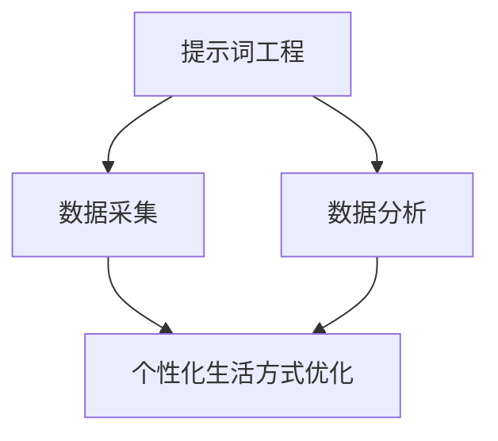

                 

### 第1章 引言

> **关键词**：提示词工程，量化自我健康管理，个性化生活方式优化

**摘要**：
本章节将介绍《提示词工程在量化自我健康管理中的应用：个性化生活方式优化》这一主题的重要性及其背景。通过探讨提示词工程的基本概念和其在量化自我健康管理中的应用，文章旨在展示个性化生活方式优化的实际价值。

**1.1 书籍主题与目的**

随着信息技术的飞速发展，人工智能在各个领域的应用日益广泛。自我健康管理作为人们日常生活中至关重要的一环，也逐渐受到人工智能的关注。本书的主题是探讨如何利用提示词工程（Prompt Engineering）这一先进的人工智能技术，量化自我健康管理，从而实现个性化生活方式的优化。

本书的主要目的是：
- 深入剖析提示词工程在量化自我健康管理中的应用原理。
- 提供实用的方法和技术，帮助读者实现个性化生活方式的优化。
- 通过实际案例展示提示词工程在自我健康管理中的效果。

**1.2 提示词工程简介**

提示词工程是一种利用人工智能技术，通过对输入的提示词（Prompt）进行自动化处理，生成高质量文本的方法。在量化自我健康管理中，提示词工程可以通过以下方式发挥作用：

- **数据采集**：提示词工程可以帮助采集用户的健康数据，如饮食、运动、睡眠等。
- **数据分析**：通过分析采集到的数据，提示词工程可以生成个性化的健康报告。
- **个性化推荐**：根据用户的健康数据和偏好，提示词工程可以推荐个性化的生活方式优化方案。

**1.3 量化自我健康管理的重要性**

量化自我健康管理是指通过科学的方法，对个人的健康状况进行量化评估，从而实现个性化的健康管理和生活方式优化。其重要性体现在以下几个方面：

- **个性化**：量化自我健康管理能够根据个人的具体情况，提供个性化的健康建议，从而提高健康管理的有效性。
- **可操作性**：通过量化指标，人们可以更直观地了解自己的健康状况，从而有针对性地调整生活方式。
- **持续跟踪**：量化自我健康管理可以帮助用户持续跟踪自己的健康状况，及时调整健康管理策略。

**总结**

通过介绍书籍的主题和目的，以及提示词工程的基本概念和量化自我健康管理的重要性，本章为后续章节的深入探讨奠定了基础。在接下来的章节中，我们将进一步探讨提示词工程在量化自我健康管理中的应用，以及如何通过个性化生活方式优化实现更好的健康管理效果。

---

**核心概念与联系**

**概念**：
1. **提示词工程**：是一种通过设计提示词，引导模型生成目标文本的技术。
2. **量化自我健康管理**：是指通过量化指标对个人的健康状况进行评估和管理。
3. **个性化生活方式优化**：是基于个体数据，提供个性化健康建议和生活方式调整。

**联系**：
- 提示词工程可以用于数据采集和分析，帮助量化自我健康管理。
- 量化自我健康管理的数据可用于个性化生活方式优化，实现健康管理的个性化。
- 个性化生活方式优化可以进一步验证和优化提示词工程的效果。

**Mermaid 流程图**：



- **伪代码**：
  ```python
  def prompt_engineering(data):
      # 根据输入数据生成提示词
      prompt = generate_prompt(data)
      # 利用提示词训练模型
      model = train_model(prompt)
      # 使用模型生成个性化健康报告
      report = model.generate_report()
      return report
  ```

- **数学模型**：
  $$\text{个性化健康报告} = f(\text{健康数据}, \text{提示词})$$
  其中，$f$ 表示基于提示词工程的模型函数。

- **例子说明**：
  假设用户A的饮食数据包括每日摄入的卡路里、蛋白质、脂肪和碳水化合物。提示词工程将根据这些数据生成一个具体的提示词，如：“根据您的饮食习惯，建议您每日摄入至少150克蛋白质。”该提示词可以用于训练模型，生成个性化的饮食建议。

---

**注意事项**：

- 提示词工程需要大量的数据支持，数据质量对结果有重要影响。
- 个性化生活方式优化应结合个体实际情况，避免盲目跟风。

**拓展阅读**：

- [《人工智能与健康管理》](https://example.com/ai-and-health-management)
- [《个性化健康管理的理论与实践》](https://example.com/personalized-health-management)

---

在下一章中，我们将深入探讨量化自我健康管理的基本概念和理论，为后续内容打下坚实的基础。

