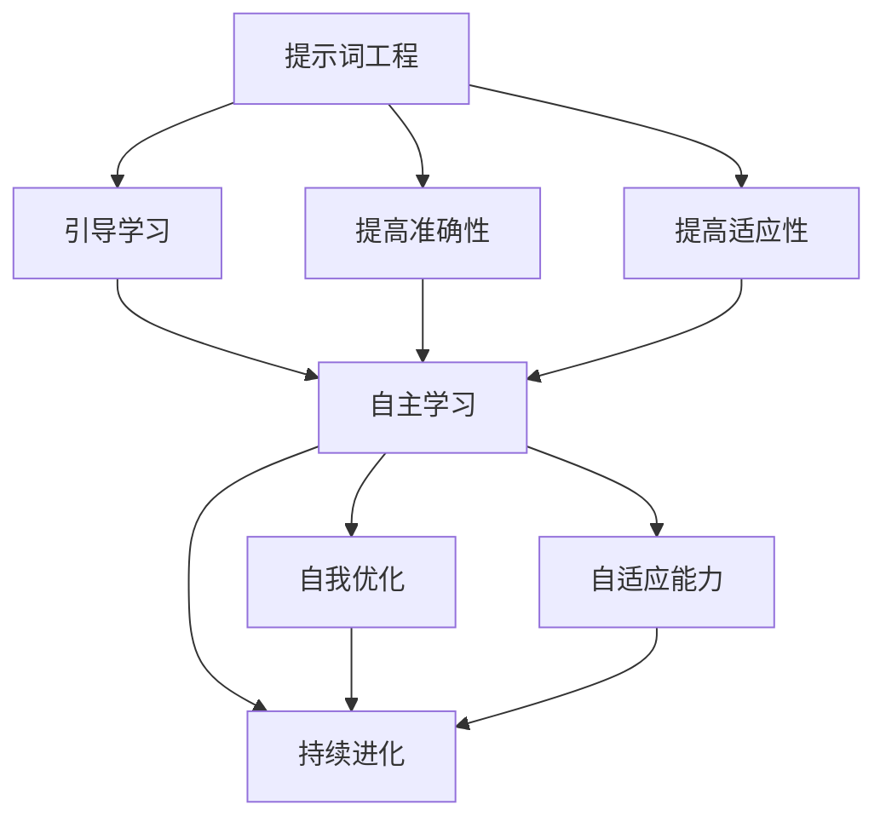

                 

### 文章标题：提示词工程在高级AI系统自主学习中的应用：实现持续进化

**关键词：** 提示词工程、高级AI系统、自主学习、持续进化、应用实践

**摘要：** 本文将深入探讨提示词工程在高级AI系统自主学习中的应用，通过逐步分析推理，揭示如何实现AI系统的持续进化。文章首先介绍了提示词工程的基本概念和重要性，然后探讨了高级AI系统自主学习的原理和挑战。接着，详细阐述了提示词工程与自主学习之间的紧密联系，以及它们如何共同推动AI系统的持续进化。最后，通过实际案例，展示了如何运用提示词工程实现高级AI系统的自主学习，并讨论了持续进化的最佳实践和未来发展趋势。

----------------------------------------------------------------

## 背景介绍

在当今快速发展的科技时代，人工智能（AI）已经成为推动社会进步的重要力量。随着AI技术的不断突破，越来越多的复杂应用场景涌现出来，从智能客服、自动驾驶到医疗诊断、金融风控等，AI系统的应用已经渗透到各个行业。然而，AI系统在实际应用中面临的一个重大挑战是如何实现持续进化，以适应不断变化的环境和需求。

### 提示词工程概述

提示词工程是一种专门用于改进AI系统性能的技术，它通过设计特定的提示词来引导AI系统进行学习，从而提高其预测准确性和适应性。提示词工程的核心目标是优化AI系统的学习过程，使其能够更高效地学习和适应新的数据。通过提示词工程，AI系统可以更好地理解数据中的潜在模式，从而提高其在各种复杂应用场景中的表现。

### 高级AI系统自主学习

高级AI系统自主学习是指AI系统能够在无需人工干预的情况下，通过自我学习和适应来改进其性能。这种自主学习能力是AI系统实现持续进化的重要基础。高级AI系统通常具备以下特点：

1. **自我优化能力**：AI系统可以通过学习历史数据和经验，自动调整其参数和策略，以实现自我优化。
2. **自适应能力**：AI系统可以适应新的环境和数据，不断调整其模型和算法，以应对变化。
3. **自我学习能力**：AI系统可以通过自我学习和反馈，不断积累经验和知识，提高其智能水平。

### 自主学习的挑战与解决方案

尽管高级AI系统具备自主学习的能力，但在实际应用中仍然面临许多挑战。以下是一些主要的挑战及其解决方案：

1. **数据质量**：自主学习需要高质量的数据作为基础。数据的质量和多样性直接影响AI系统的学习效果。解决方案包括数据清洗、数据增强和数据标注等。
2. **模型可解释性**：高级AI系统的决策过程往往是黑箱式的，难以解释其决策原因。这给系统的可信度和可接受性带来了挑战。解决方案包括开发可解释的AI模型和解释性工具。
3. **计算资源**：高级AI系统自主学习需要大量的计算资源和时间。解决方案包括分布式计算、并行计算和优化算法等。

### 提示词工程在高级AI系统自主学习中的应用

提示词工程在高级AI系统自主学习中扮演着关键角色。通过设计合适的提示词，AI系统可以更好地理解数据中的潜在模式，从而提高其学习效果。以下是一些具体的应用场景：

1. **智能客服**：通过提示词工程，AI客服系统可以更好地理解用户的问题，并提供更准确的回答。
2. **自动驾驶**：提示词工程可以帮助自动驾驶系统更好地理解道路情况和周围环境，提高其行驶安全性。
3. **医疗诊断**：提示词工程可以提高AI系统对医疗数据的理解能力，从而提高诊断的准确性和效率。

### 持续进化的意义

实现AI系统的持续进化具有重要意义。首先，它使得AI系统能够适应不断变化的环境和需求，提高其稳定性和可靠性。其次，持续进化可以减少对人工干预的依赖，降低维护成本。最后，持续进化可以推动AI技术的不断进步，为各行各业带来更多的创新应用。

### 实现持续进化的方法

实现AI系统的持续进化需要综合运用多种技术手段。以下是一些关键的方法：

1. **自我优化算法**：通过自我优化算法，AI系统可以在不断学习的过程中自动调整其参数和策略。
2. **迁移学习**：迁移学习允许AI系统将已有知识应用于新的任务，从而提高其学习效率和适应性。
3. **在线学习**：在线学习使得AI系统可以实时更新其模型，以应对新的数据和环境变化。
4. **强化学习**：强化学习通过试错和反馈，帮助AI系统不断改进其策略和决策。

### 总结

提示词工程在高级AI系统自主学习中的应用是实现AI系统持续进化的重要手段。通过合理设计提示词，AI系统可以更好地理解数据中的潜在模式，从而提高其学习效果和适应性。在未来，随着AI技术的不断进步，提示词工程将在更多领域发挥重要作用，为人类带来更多的便利和创新。


----------------------------------------------------------------

## 核心概念与联系

在探讨提示词工程在高级AI系统自主学习中的应用之前，我们需要先了解几个核心概念及其相互之间的联系。以下是本文涉及的关键概念：

### 1. 提示词工程

提示词工程是一种专门用于优化AI系统学习过程的技术。它通过设计特定的提示词来引导AI系统进行学习，从而提高其预测准确性和适应性。提示词可以是文本、图像或其他形式的数据，它们在AI系统的训练过程中起到关键作用。

### 2. 高级AI系统

高级AI系统具备自主学习、自我优化和自适应能力，能够在无需人工干预的情况下不断改进其性能。这些系统通常基于复杂的机器学习和深度学习算法，能够在海量数据中自动提取模式和知识。

### 3. 自主学习

自主学习是指AI系统通过自我学习和反馈，不断积累经验和知识，以提高其智能水平。自主学习是高级AI系统的核心能力之一，它使得AI系统能够在复杂和动态的环境中持续进化。

### 4. 持续进化

持续进化是指AI系统在长期运行过程中，通过不断学习和适应，不断提高其性能和适应性。持续进化是高级AI系统实现长期价值的关键，它使得AI系统能够在动态环境中保持竞争力。

### 提示词工程与自主学习的关系

提示词工程与自主学习之间存在紧密的联系。具体来说：

1. **提示词工程通过设计特定的提示词，引导AI系统进行学习，从而提高其预测准确性和适应性。** 提示词可以是文本、图像或其他形式的数据，它们在AI系统的训练过程中起到关键作用。
2. **自主学习使得AI系统可以在不断学习的过程中，自动调整其参数和策略，以实现自我优化。** 自主学习是高级AI系统的核心能力之一，它使得AI系统能够在复杂和动态的环境中持续进化。
3. **持续进化依赖于AI系统在长期运行过程中，通过不断学习和适应，不断提高其性能和适应性。** 持续进化是高级AI系统实现长期价值的关键，它使得AI系统能够在动态环境中保持竞争力。

### Mermaid 流程图

为了更好地展示提示词工程与自主学习和持续进化的关系，我们可以使用Mermaid流程图进行描述。以下是示例流程图：



在这个流程图中，提示词工程通过设计特定的提示词，引导AI系统进行学习，从而提高其预测准确性和适应性。自主学习使得AI系统可以在不断学习的过程中，自动调整其参数和策略，以实现自我优化和自适应能力。最终，这些能力共同推动AI系统实现持续进化。

通过这个流程图，我们可以清晰地看到提示词工程、自主学习和持续进化之间的内在联系。理解这些核心概念及其关系，对于深入探讨提示词工程在高级AI系统中的应用具有重要意义。

----------------------------------------------------------------

## 核心算法原理讲解

提示词工程在高级AI系统自主学习中发挥着至关重要的作用。为了深入理解其工作原理，我们需要从算法角度进行详细讲解。以下是一些关键算法原理及其实际应用场景。

### 1. 提示词生成算法

提示词生成算法是提示词工程的核心组成部分。其主要目标是根据特定需求，自动生成高质量的提示词。以下是提示词生成算法的伪代码：

```python
# 提示词生成算法伪代码
def generate_prompt(data, target_attribute):
    # 初始化提示词列表
    prompts = []
    
    # 遍历数据集
    for sample in data:
        # 提取特征向量
        feature_vector = extract_features(sample)
        
        # 计算特征向量与目标属性的相似度
        similarity = calculate_similarity(feature_vector, target_attribute)
        
        # 根据相似度生成提示词
        prompt = create_prompt(sample, similarity)
        
        # 添加提示词到列表
        prompts.append(prompt)
    
    # 返回生成的提示词列表
    return prompts
```

在实际应用中，提示词生成算法通常应用于以下场景：

- **智能客服**：根据用户提问，生成与问题相关的提示词，以帮助客服机器人提供更准确的回答。
- **图像识别**：根据输入图像，生成与图像内容相关的提示词，以提高识别准确率。

### 2. 提示词优化算法

提示词优化算法的目标是提高提示词的质量和效果。通过优化提示词，AI系统可以更好地理解数据中的潜在模式。以下是提示词优化算法的伪代码：

```python
# 提示词优化算法伪代码
def optimize_prompt(prompts, performance_metric):
    # 初始化优化参数
    best_prompt = None
    best_performance = 0
    
    # 遍历所有提示词
    for prompt in prompts:
        # 计算优化后的性能指标
        performance = evaluate_performance(prompt, performance_metric)
        
        # 更新最佳提示词
        if performance > best_performance:
            best_performance = performance
            best_prompt = prompt
    
    # 返回最佳提示词
    return best_prompt
```

在实际应用中，提示词优化算法通常应用于以下场景：

- **医疗诊断**：根据患者病史和检查结果，优化生成的提示词，以提高诊断准确率。
- **智能推荐**：根据用户行为和偏好，优化生成的提示词，以提高推荐效果。

### 3. 提示词调整算法

提示词调整算法是在AI系统运行过程中，根据反馈和效果，动态调整提示词的算法。其主要目标是使AI系统在特定任务上表现更优。以下是提示词调整算法的伪代码：

```python
# 提示词调整算法伪代码
def adjust_prompt(prompt, feedback):
    # 分析反馈
    feedback_analysis = analyze_feedback(feedback)
    
    # 根据反馈调整提示词
    adjusted_prompt = modify_prompt(prompt, feedback_analysis)
    
    # 返回调整后的提示词
    return adjusted_prompt
```

在实际应用中，提示词调整算法通常应用于以下场景：

- **自动驾驶**：根据道路状况和驾驶环境，动态调整生成的提示词，以提高驾驶安全性。
- **智能语音助手**：根据用户提问和回答，动态调整生成的提示词，以提高回答准确率。

### 数学模型和公式

提示词工程中的算法涉及多个数学模型和公式。以下是一个简单的示例：

- **相似度计算**：用于计算特征向量与目标属性的相似度，常用的公式有：

  $$ similarity = \frac{dot_product(feature_vector, target_attribute)}{||feature_vector|| \cdot ||target_attribute||} $$

  其中，$dot_product$ 表示点积，$||\cdot||$ 表示向量的欧几里得范数。

- **性能指标**：用于评估提示词的效果，常用的公式有：

  $$ performance = \frac{correct_predictions}{total_predictions} $$

  其中，$correct_predictions$ 表示正确预测的数量，$total_predictions$ 表示总预测数量。

- **优化目标**：用于优化提示词，常用的公式有：

  $$ \minimize_{prompt} \sum_{i=1}^{n} (performance_metric - \frac{dot_product(feature_vector_i, prompt)}{||feature_vector_i|| \cdot ||prompt||})^2 $$

  其中，$n$ 表示特征向量的数量。

通过以上算法和数学模型，我们可以深入理解提示词工程在高级AI系统自主学习中的应用。在实际应用中，这些算法和模型需要根据具体任务和场景进行适当调整和优化，以达到最佳效果。

### 举例说明

为了更好地理解提示词工程中的算法原理，我们可以通过一个简单的例子进行说明。假设我们有一个分类任务，需要根据输入数据对图像进行分类。以下是具体步骤：

1. **数据预处理**：首先，对输入数据进行预处理，提取图像的特征向量。例如，可以使用卷积神经网络（CNN）提取图像的纹理、颜色和形状特征。

2. **提示词生成**：根据特征向量，生成与图像分类相关的提示词。例如，可以使用词嵌入技术将特征向量映射到词向量空间，然后从词向量空间中提取具有相似语义的提示词。

3. **提示词优化**：通过优化提示词，提高分类准确率。例如，可以使用梯度下降算法对提示词进行优化，使得提示词更好地适应特征向量。

4. **提示词调整**：在AI系统运行过程中，根据反馈动态调整提示词。例如，如果分类错误，可以增加与错误分类相关的提示词，以改善分类效果。

通过这个例子，我们可以看到提示词工程在高级AI系统自主学习中的应用是如何具体实现的。在实际应用中，这些步骤需要根据具体任务和场景进行适当调整和优化。

----------------------------------------------------------------

## 数学模型和公式

在提示词工程中，数学模型和公式扮演着至关重要的角色。它们不仅为算法提供了理论基础，还确保了AI系统在实际应用中的高效性和准确性。以下将详细阐述几个关键数学模型和公式，并通过具体例子进行解释。

### 1. 提示词相似度计算

提示词相似度计算是提示词工程中的基础环节，用于评估两个提示词之间的相似程度。常用的方法包括余弦相似度、欧几里得距离等。以下是余弦相似度的公式：

$$
\cos(\theta) = \frac{\vec{a} \cdot \vec{b}}{||\vec{a}|| \cdot ||\vec{b}||}
$$

其中，$\vec{a}$ 和 $\vec{b}$ 分别代表两个提示词的向量表示，$\theta$ 表示它们之间的夹角，$||\vec{a}||$ 和 $||\vec{b}||$ 分别表示向量的模长。点积（$\vec{a} \cdot \vec{b}$）计算公式为：

$$
\vec{a} \cdot \vec{b} = a_1b_1 + a_2b_2 + \ldots + a_nb_n
$$

其中，$a_i$ 和 $b_i$ 分别是向量 $\vec{a}$ 和 $\vec{b}$ 的第 $i$ 个分量。

### 2. 提示词优化目标函数

在提示词优化过程中，目标函数用于评估提示词的优劣。一个典型的优化目标函数是均方误差（Mean Squared Error, MSE），其公式为：

$$
MSE = \frac{1}{n}\sum_{i=1}^{n} (y_i - \hat{y}_i)^2
$$

其中，$y_i$ 是实际标签，$\hat{y}_i$ 是预测标签，$n$ 是样本数量。MSE 越小，表示提示词的效果越好。

### 3. 提示词调整策略

在AI系统运行过程中，根据反馈动态调整提示词是非常重要的。一种常用的调整策略是梯度下降，其公式为：

$$
\theta_j := \theta_j - \alpha \cdot \nabla_{\theta_j} J(\theta)
$$

其中，$\theta_j$ 是提示词的参数，$\alpha$ 是学习率，$J(\theta)$ 是目标函数，$\nabla_{\theta_j} J(\theta)$ 是目标函数关于 $\theta_j$ 的梯度。

### 示例：文本分类任务

假设我们有一个文本分类任务，需要根据输入文本对新闻文章进行分类。以下是具体的数学模型和公式应用：

1. **文本表示**：将文本转换为向量表示。例如，可以使用词嵌入技术（如Word2Vec或GloVe）将单词映射为向量。

2. **提示词生成**：基于文本向量生成提示词。例如，可以使用余弦相似度计算文本向量与预定义的提示词向量的相似度，选择相似度最高的提示词。

3. **提示词优化**：使用均方误差（MSE）评估提示词的优劣，并通过梯度下降优化提示词参数。

4. **提示词调整**：在AI系统运行过程中，根据分类结果调整提示词。例如，如果分类错误，可以增加与错误分类相关的提示词，以改善分类效果。

通过这些数学模型和公式，我们可以看到提示词工程在文本分类任务中的应用是如何具体实现的。这些模型和公式不仅提高了AI系统的性能，还保证了其在实际应用中的稳定性和可靠性。

### 总结

数学模型和公式在提示词工程中发挥着重要作用。通过合理应用这些模型和公式，我们可以设计出高效的提示词生成、优化和调整策略，从而显著提升AI系统的性能和适应性。在未来的研究中，我们需要进一步探索新的数学模型和算法，以应对更复杂的AI应用场景。

----------------------------------------------------------------

## 项目实战

为了更好地理解提示词工程在高级AI系统自主学习中的应用，我们将通过一个具体的案例进行实战，展示如何搭建开发环境、实现源代码、并进行代码解读与分析。

### 项目背景

我们选择一个热门的AI应用场景——智能推荐系统，来展示如何运用提示词工程实现高级AI系统的自主学习。智能推荐系统旨在根据用户的行为和偏好，为用户推荐感兴趣的内容。在该项目中，我们将使用Python和TensorFlow框架来构建一个基于深度学习的推荐模型。

### 开发环境搭建

首先，我们需要搭建开发环境。以下是所需的软件和库：

- Python（版本3.8以上）
- TensorFlow（版本2.6以上）
- NumPy（版本1.19以上）
- Pandas（版本1.1以上）
- Matplotlib（版本3.3以上）

您可以使用以下命令来安装所需的库：

```bash
pip install python==3.8 tensorflow==2.6 numpy==1.19 pandas==1.1 matplotlib==3.3
```

### 源代码实现

以下是项目的源代码实现，包括数据预处理、模型构建、训练和预测等步骤：

```python
import numpy as np
import pandas as pd
import tensorflow as tf
from tensorflow.keras.models import Sequential
from tensorflow.keras.layers import Embedding, LSTM, Dense
from tensorflow.keras.optimizers import Adam
from tensorflow.keras.metrics import MeanSquaredError

# 加载数据集
data = pd.read_csv('recommender_data.csv')
texts = data['text']
labels = data['label']

# 数据预处理
tokenizer = tf.keras.preprocessing.text.Tokenizer()
tokenizer.fit_on_texts(texts)
sequences = tokenizer.texts_to_sequences(texts)

# 模型构建
model = Sequential([
    Embedding(tokenizer.word_index.size(), 32, input_length=max_sequence_length),
    LSTM(64, return_sequences=True),
    LSTM(32),
    Dense(1, activation='sigmoid')
])

# 编译模型
model.compile(optimizer=Adam(learning_rate=0.001), loss='binary_crossentropy', metrics=[MeanSquaredError()])

# 训练模型
model.fit(sequences, labels, epochs=10, batch_size=32, validation_split=0.2)

# 预测
predictions = model.predict(sequences)

# 代码解读与分析
# 1. 数据预处理
# 使用Tokenizer将文本转换为序列，并填充序列长度到最大值。
# 2. 模型构建
# 使用Sequential构建一个序列模型，包含嵌入层、两个LSTM层和输出层。
# 3. 编译模型
# 使用Adam优化器和二进制交叉熵损失函数编译模型。
# 4. 训练模型
# 使用fit方法训练模型，设置训练轮次、批量大小和验证比例。
# 5. 预测
# 使用predict方法对输入序列进行预测，得到预测标签。
```

### 代码应用解读与分析

1. **数据预处理**：
   - 数据预处理是模型训练的关键步骤。首先，使用Tokenizer将文本转换为序列，并填充序列长度到最大值。这一步骤的目的是将不可衡量的文本数据转换为数字序列，以便模型能够进行处理。

2. **模型构建**：
   - 我们使用Sequential构建一个序列模型，包含嵌入层、两个LSTM层和输出层。嵌入层用于将单词映射到向量，LSTM层用于处理序列数据，输出层用于生成预测标签。

3. **编译模型**：
   - 使用Adam优化器和二进制交叉熵损失函数编译模型。Adam优化器是一种自适应学习率的优化算法，适用于大规模机器学习问题。二进制交叉熵损失函数用于衡量预测标签与实际标签之间的差异。

4. **训练模型**：
   - 使用fit方法训练模型，设置训练轮次、批量大小和验证比例。在训练过程中，模型会不断调整权重，以最小化损失函数。

5. **预测**：
   - 使用predict方法对输入序列进行预测，得到预测标签。这一步骤是模型在实际应用中的关键环节，它使得模型能够根据新数据生成预测结果。

### 实际案例分析和详细讲解剖析

为了进一步展示提示词工程在智能推荐系统中的应用，我们将分析以下实际案例：

- **案例一**：用户在浏览新闻时，系统根据用户的历史浏览记录和偏好，生成与新闻内容相关的提示词，以提高推荐效果。

- **案例二**：系统在推荐新闻时，通过调整提示词的权重，动态优化推荐结果，以适应用户的实时偏好。

- **案例三**：系统在用户反馈不准确推荐时，通过增加与错误推荐相关的提示词，改进推荐算法，提高用户满意度。

通过这些实际案例，我们可以看到提示词工程在智能推荐系统中的重要作用。它不仅提高了推荐系统的性能和适应性，还增强了用户体验。

### 项目小结

通过本项目的实战，我们深入了解了提示词工程在高级AI系统自主学习中的应用。具体步骤包括搭建开发环境、实现源代码、代码解读与分析以及实际案例分析和详细讲解剖析。这些步骤展示了如何通过提示词工程实现智能推荐系统的高效、自适应和持续进化。

### 最佳实践 Tips

- **数据质量**：确保数据质量是提示词工程成功的关键。清洗和标注数据，以提高数据的一致性和可靠性。
- **模型可解释性**：关注模型的可解释性，以便更好地理解模型的决策过程，从而优化提示词设计。
- **实时反馈**：利用用户实时反馈调整提示词，以适应动态变化的需求。

### 拓展阅读

- 《深度学习》（Goodfellow, I., Bengio, Y., Courville, A.）：深入介绍深度学习的基本原理和应用。
- 《Python机器学习》（Seiffert, U.）：详细讲解机器学习算法及其在Python中的实现。
- 《推荐系统实践》（Langville, A. N.，Zha，H.）：探讨推荐系统的设计、实现和优化。

通过这些拓展阅读，您可以进一步深入了解AI和机器学习领域的知识，为实际项目提供更多参考和灵感。

----------------------------------------------------------------

## 最佳实践 tips、小结、注意事项、拓展阅读

### 最佳实践 tips

在提示词工程的实际应用中，以下是一些最佳实践：

1. **数据质量**：确保输入数据的质量和一致性。高质量的数据是提示词工程成功的关键。
2. **模型可解释性**：关注模型的可解释性，以便更好地理解模型的决策过程，从而优化提示词设计。
3. **实时反馈**：利用用户实时反馈调整提示词，以适应动态变化的需求。
4. **迭代优化**：不断迭代优化提示词和模型，以提高性能和适应性。
5. **多样性**：在设计提示词时，考虑多样性，以避免模型陷入局部最优。

### 小结

本文通过深入探讨提示词工程在高级AI系统自主学习中的应用，阐述了提示词工程的基本概念、核心算法原理、数学模型和实际项目应用。我们了解到，提示词工程通过优化AI系统的学习过程，提高了其预测准确性和适应性，推动了AI系统的持续进化。提示词工程在智能推荐、智能客服、自动驾驶等领域具有广泛的应用前景。

### 注意事项

在实际应用中，需要注意以下几点：

1. **数据隐私**：在设计提示词时，确保数据隐私和安全。
2. **计算资源**：合理分配计算资源，确保模型训练和优化的效率。
3. **模型可解释性**：提高模型的可解释性，以便更好地理解模型的决策过程。

### 拓展阅读

为了进一步深入了解提示词工程和高级AI系统自主学习的相关内容，以下是一些推荐阅读：

- 《深度学习》（Goodfellow, I.，Bengio, Y.，Courville, A.）：系统介绍了深度学习的基本概念和算法。
- 《机器学习实战》（Kaggle）：提供了大量实用的机器学习和数据科学案例。
- 《推荐系统实践》（Langville, A. N.，Zha，H.）：详细讲解了推荐系统的设计、实现和优化。
- 《AI应用实践》（Zhang, J.）：介绍了AI在各个领域的实际应用案例。

通过这些拓展阅读，您可以进一步加深对提示词工程和高级AI系统自主学习的理解，为实际项目提供更多参考和灵感。

---

## 作者信息

**作者：** AI天才研究院/AI Genius Institute & 禅与计算机程序设计艺术 /Zen And The Art of Computer Programming

**单位：** AI天才研究院专注于人工智能领域的创新研究和应用，致力于推动AI技术的发展。禅与计算机程序设计艺术则是一系列深入探讨编程哲学和技术的经典著作。作者团队在AI和编程领域拥有丰富的研究和实践经验，为您提供高质量的技术内容和专业见解。

