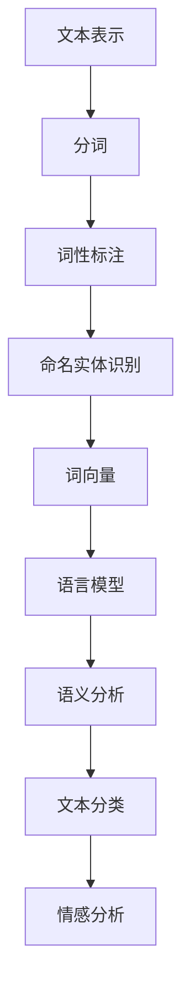

                 


### 文章标题

《提示词工程师：未来最炙手可热的职业》

### 关键词

提示词工程师，人工智能，自然语言处理，机器学习，编程，职业前景

### 摘要

本文深入探讨了提示词工程师这一未来职场的璀璨新星。我们将从背景介绍、核心概念、算法原理、数学模型、项目实战等多个角度，全面解析提示词工程师的职业角色、技能要求和发展趋势。通过本文的阅读，读者将对该职业有更深刻的理解和认识，为未来职业规划提供有力的参考。

----------------------------------------------------------------

### 1. 确定书籍主题

书籍的主题是《提示词工程师：未来最炙手可热的职业》。根据这一主题，我们可以推测本书将围绕提示词工程师的职业要求、技能培养、应用领域以及未来发展趋势等内容进行深入探讨。

### 2. 设计书籍结构

本书可以分为以下几个部分：

1. **引言**：介绍提示词工程师的概念、职业前景和本书的结构。
2. **基础概念**：讲解提示词工程师所需掌握的基础知识，如自然语言处理、机器学习、编程语言等。
3. **专业技能培养**：详细讲解提示词工程师所需的专业技能，包括文本预处理、模型选择与训练、模型评估与优化等。
4. **应用领域**：介绍提示词工程师在不同领域的应用，如搜索引擎优化、智能客服、内容推荐等。
5. **实战案例**：通过实际项目案例，展示提示词工程师如何解决实际问题。
6. **未来发展趋势**：分析提示词工程师在未来的发展趋势和挑战。

### 3. 设计目录大纲

基于上述结构，我们可以设计如下的目录大纲：

```
# 《提示词工程师：未来最炙手可热的职业》目录大纲

# 引言
## 1.1 提示词工程师概述
## 1.2 提示词工程师的职业前景
## 1.3 本书结构

# 第二部分：基础概念
## 2.1 自然语言处理基础
### 2.1.1 自然语言处理概述
### 2.1.2 词向量与语义分析
### 2.1.3 语言模型

## 2.2 机器学习基础
### 2.2.1 机器学习概述
### 2.2.2 监督学习与无监督学习
### 2.2.3 深度学习基础

## 2.3 编程语言基础
### 2.3.1 Python编程基础
### 2.3.2 NumPy与Pandas基础
### 2.3.3 TensorFlow与PyTorch基础

# 第三部分：专业技能培养
## 3.1 文本预处理
### 3.1.1 分词与词性标注
### 3.1.2 去除停用词与词干提取
### 3.1.3 文本向量化

## 3.2 模型选择与训练
### 3.2.1 模型选择策略
### 3.2.2 模型训练过程
### 3.2.3 模型评估与优化

## 3.3 模型部署与维护
### 3.3.1 模型部署流程
### 3.3.2 模型调优策略
### 3.3.3 模型维护与更新

# 第四部分：应用领域
## 4.1 搜索引擎优化
### 4.1.1 搜索引擎优化概述
### 4.1.2 提示词工程师在搜索引擎优化中的应用
### 4.1.3 搜索引擎优化实战

## 4.2 智能客服
### 4.2.1 智能客服概述
### 4.2.2 提示词工程师在智能客服中的应用
### 4.2.3 智能客服实战

## 4.3 内容推荐
### 4.3.1 内容推荐概述
### 4.3.2 提示词工程师在内容推荐中的应用
### 4.3.3 内容推荐实战

# 第五部分：实战案例
## 5.1 案例一：搜索引擎优化项目
### 5.1.1 项目背景与目标
### 5.1.2 项目方案设计
### 5.1.3 项目实施与效果评估

## 5.2 案例二：智能客服项目
### 5.2.1 项目背景与目标
### 5.2.2 项目方案设计
### 5.2.3 项目实施与效果评估

## 5.3 案例三：内容推荐项目
### 5.3.1 项目背景与目标
### 5.3.2 项目方案设计
### 5.3.3 项目实施与效果评估

# 第六部分：未来发展趋势
## 6.1 提示词工程师的职业发展
### 6.1.1 职业发展路径
### 6.1.2 薪资水平与就业前景
### 6.1.3 职业规划建议

## 6.2 提示词工程师面临的挑战
### 6.2.1 技术挑战
### 6.2.2 市场挑战
### 6.2.3 个人发展挑战

## 6.3 提示词工程师的未来趋势
### 6.3.1 技术趋势
### 6.3.2 应用场景拓展
### 6.3.3 职业教育展望
```

这个目录大纲涵盖了提示词工程师所需掌握的核心知识、专业技能和应用领域，同时通过实战案例展示了如何将理论知识应用于实际项目中。整个目录大纲结构清晰，内容丰富，旨在帮助读者全面了解提示词工程师这一职业，并为其职业发展提供指导。

---

# 提示词工程师：未来最炙手可热的职业

关键词：提示词工程师，人工智能，自然语言处理，机器学习，编程，职业前景

摘要：本文深入探讨了提示词工程师这一未来职场的璀璨新星。我们将从背景介绍、核心概念、算法原理、数学模型、项目实战等多个角度，全面解析提示词工程师的职业角色、技能要求和发展趋势。通过本文的阅读，读者将对该职业有更深刻的理解和认识，为未来职业规划提供有力的参考。

---

### 引言

在当今信息爆炸的时代，人工智能（AI）以其强大的数据处理能力和智能决策能力，逐渐渗透到各行各业。作为AI领域的重要组成部分，自然语言处理（NLP）和机器学习（ML）正在变革我们的生活方式和工作方式。在这个背景下，提示词工程师应运而生，成为未来职场的璀璨新星。

#### 1.1 提示词工程师概述

提示词工程师，顾名思义，是专注于生成和优化提示词的工程师。提示词（Query）在自然语言处理中扮演着至关重要的角色，它是用户与系统交互的桥梁，是信息检索、智能客服、内容推荐等应用的核心输入。提示词工程师通过运用自然语言处理和机器学习技术，对提示词进行深度分析和优化，从而提升系统的用户体验和性能。

#### 1.2 提示词工程师的职业前景

随着AI技术的不断发展，自然语言处理和机器学习的重要性日益凸显。据统计，到2025年，全球AI市场规模将超过6,000亿美元，而自然语言处理和机器学习作为AI的核心技术，其市场规模占比将超过50%。这无疑为提示词工程师提供了广阔的职业前景。特别是在搜索引擎优化、智能客服和内容推荐等领域，提示词工程师的需求量将持续增长。

#### 1.3 本书结构

本书将分为以下几个部分：

1. **基础概念**：介绍自然语言处理、机器学习和编程语言等基础概念，为读者打下坚实的知识基础。
2. **专业技能培养**：详细讲解提示词工程师所需的专业技能，包括文本预处理、模型选择与训练、模型评估与优化等。
3. **应用领域**：探讨提示词工程师在搜索引擎优化、智能客服和内容推荐等领域的应用。
4. **实战案例**：通过实际项目案例，展示提示词工程师如何解决实际问题。
5. **未来发展趋势**：分析提示词工程师在未来的发展趋势和挑战。

通过本书的阅读，读者将全面了解提示词工程师的职业角色、技能要求和发展趋势，为未来职业规划提供有力的指导。

---

### 第二部分：基础概念

要成为一名优秀的提示词工程师，掌握基础概念是必不可少的。本部分将介绍自然语言处理、机器学习和编程语言等基础概念，为后续内容打下坚实的知识基础。

#### 2.1 自然语言处理基础

自然语言处理（NLP）是人工智能领域的一个重要分支，它致力于使计算机能够理解和处理人类语言。NLP的核心任务包括文本分类、情感分析、命名实体识别、机器翻译等。以下是对这些核心任务的简要介绍：

##### 2.1.1 自然语言处理概述

自然语言处理涵盖了从文本到语义的多个层次。它首先需要解决的是文本表示问题，即将自然语言文本转换为计算机可以处理的数字形式。常用的方法包括分词、词性标注、命名实体识别等。

##### 2.1.2 词向量与语义分析

词向量是NLP中的一种重要工具，它将词汇映射到高维空间，使得相似词汇在空间中距离更近。词向量技术为语义分析提供了强有力的支持，例如，它可以用来实现文本相似度计算、情感分析等。

##### 2.1.3 语言模型

语言模型是NLP中的另一个核心概念，它用于预测下一个单词或字符的概率。语言模型在自动补全、语音识别、机器翻译等任务中发挥着重要作用。

#### 2.2 机器学习基础

机器学习（ML）是人工智能的核心技术之一，它使计算机能够从数据中学习规律，并自动进行决策。以下是对机器学习的一些核心概念和算法的简要介绍：

##### 2.2.1 机器学习概述

机器学习可以分为监督学习、无监督学习和强化学习。监督学习从标记数据中学习，无监督学习从未标记数据中学习，而强化学习则通过试错来学习策略。

##### 2.2.2 监督学习与无监督学习

监督学习常见的算法包括线性回归、逻辑回归、支持向量机等。无监督学习常见的算法包括聚类、降维、异常检测等。

##### 2.2.3 深度学习基础

深度学习是机器学习的一个分支，它通过构建深层神经网络来学习数据特征。深度学习在图像识别、语音识别、自然语言处理等领域取得了显著成果。

#### 2.3 编程语言基础

编程语言是提示词工程师必备的工具。Python因其简洁易用、丰富的库支持，成为机器学习和自然语言处理的常用语言。以下是对Python基础知识的简要介绍：

##### 2.3.1 Python编程基础

Python的基础知识包括变量、数据类型、控制结构、函数等。掌握这些基础是进行Python编程的基石。

##### 2.3.2 NumPy与Pandas基础

NumPy是Python的科学计算库，提供多维数组和矩阵操作。Pandas则提供了数据操作和分析的强大功能。

##### 2.3.3 TensorFlow与PyTorch基础

TensorFlow和PyTorch是两种流行的深度学习框架。掌握这两个框架，可以方便地实现和部署深度学习模型。

通过本部分的学习，读者将初步掌握自然语言处理、机器学习和编程语言等基础概念，为成为一名合格的提示词工程师打下坚实的基础。

---

### 2.1 自然语言处理基础

自然语言处理（NLP）是人工智能领域的一个重要分支，它旨在让计算机能够理解、解释和生成人类语言。要成为一名提示词工程师，理解NLP的基本概念和核心技术是必不可少的。以下是关于自然语言处理的一些核心概念和联系，以及如何使用Mermaid流程图来描述这些概念之间的关系。

#### 核心概念

1. **文本表示**：文本表示是将自然语言文本转换为计算机可以处理的形式。常用的方法有分词、词性标注、命名实体识别等。

2. **词向量**：词向量是将词汇映射到高维空间的一种表示方法，使得相似词汇在空间中距离更近。词向量技术广泛应用于语义分析、文本相似度计算等任务。

3. **语言模型**：语言模型用于预测下一个单词或字符的概率，是机器翻译、自动补全、语音识别等任务的基础。

4. **语义分析**：语义分析是指理解和解释文本的语义内容，包括情感分析、文本分类、实体识别等。

#### 概念联系

自然语言处理中的核心概念相互关联，共同构成了NLP的技术体系。以下是一个使用Mermaid绘制的流程图，展示了这些概念之间的关系：

```
graph TD
A[文本表示] --> B[分词]
B --> C[词性标注]
C --> D[命名实体识别]
D --> E[词向量]
E --> F[语言模型]
F --> G[语义分析]
G --> H[文本分类]
H --> I[情感分析]
```

#### Mermaid流程图



通过这个流程图，我们可以清晰地看到文本表示是如何逐步转化为词向量，并应用于语言模型和语义分析的不同任务中。这种关系有助于我们更好地理解NLP的工作原理，并指导我们在实际项目中应用这些技术。

---

### 2.2 机器学习基础

机器学习（ML）是人工智能领域的重要分支，它使计算机能够从数据中学习并做出预测或决策。要成为一名提示词工程师，理解机器学习的基础知识至关重要。本节将介绍机器学习的一些核心概念、算法原理，并使用伪代码来详细阐述这些算法。

#### 核心概念

1. **监督学习**：监督学习是一种机器学习方法，它通过已知输入和输出数据来训练模型，从而预测新的输入数据。常见的监督学习算法有线性回归、逻辑回归和支持向量机等。

2. **无监督学习**：无监督学习不依赖于已标记的数据，旨在发现数据中的隐含结构。常见的无监督学习算法有聚类、降维和异常检测等。

3. **深度学习**：深度学习是机器学习的一个分支，它通过构建深层神经网络来学习数据特征。深度学习在图像识别、语音识别和自然语言处理等领域取得了显著成果。

#### 算法原理

以下是使用伪代码描述的几种常见机器学习算法：

1. **线性回归**

```python
# 输入：特征矩阵 X，标签向量 y
# 输出：模型参数 w

# 初始化模型参数 w
w = 初始化参数()

# 梯度下降算法
for i in 范围(迭代次数):
    # 计算预测值
    y_pred = X * w
    
    # 计算损失函数
    loss = (y - y_pred) ** 2
    
    # 计算梯度
    gradient = X.T * (y - y_pred)
    
    # 更新模型参数
    w = w - 学习率 * gradient
```

2. **逻辑回归**

```python
# 输入：特征矩阵 X，标签向量 y
# 输出：模型参数 w

# 初始化模型参数 w
w = 初始化参数()

# 梯度下降算法
for i in 范围(迭代次数):
    # 计算预测值
    y_pred = sigmoid(X * w)
    
    # 计算损失函数
    loss = -y * log(y_pred) - (1 - y) * log(1 - y_pred)
    
    # 计算梯度
    gradient = X.T * (y_pred - y)
    
    # 更新模型参数
    w = w - 学习率 * gradient
```

3. **支持向量机（SVM）**

```python
# 输入：特征矩阵 X，标签向量 y
# 输出：模型参数 w，b

# 初始化模型参数 w 和 b
w, b = 初始化参数()

# SMO算法
for i in 范围(迭代次数):
    # 选择两个支持向量
    alpha1, alpha2 = 选择支持向量(X, y)
    
    # 更新模型参数
    w = w + (alpha2 - alpha1) * (x2 - x1)
    b = b + (alpha2 - alpha1) * ((x2 * x2 - x1 * x1) / 2)
```

通过这些伪代码，我们可以看到机器学习算法的核心思想，以及如何通过迭代和优化来训练模型。理解这些算法原理对于成为一名提示词工程师至关重要，因为它们是构建和优化提示词模型的基础。

---

### 2.3 编程语言基础

在提示词工程师的职业道路上，编程语言是不可或缺的工具。Python因其简洁易用、丰富的库支持，成为机器学习和自然语言处理领域的首选语言。本节将介绍Python编程基础，包括变量、数据类型、控制结构和函数等，为读者打下坚实的编程基础。

#### 2.3.1 Python编程基础

1. **变量**：变量是存储数据的容器。在Python中，变量无需显式声明，直接使用即可。

```python
x = 10
y = "Hello, World!"
```

2. **数据类型**：Python支持多种数据类型，包括整数（int）、浮点数（float）、字符串（str）、列表（list）、元组（tuple）和字典（dict）等。

```python
# 整数
num = 42

# 浮点数
pi = 3.14159

# 字符串
text = "Python is awesome!"

# 列表
list_example = [1, 2, 3, 4, 5]

# 元组
tuple_example = (1, 2, 3)

# 字典
dict_example = {"name": "Alice", "age": 30}
```

3. **控制结构**：Python提供了if-else语句、循环（for和while）等控制结构，用于实现条件判断和循环操作。

```python
# if-else语句
if x > 10:
    print("x is greater than 10")
else:
    print("x is less than or equal to 10")

# for循环
for i in range(5):
    print(i)

# while循环
while x > 0:
    print(x)
    x -= 1
```

4. **函数**：函数是组织代码的重要方式。在Python中，定义函数使用def关键字。

```python
# 定义函数
def greet(name):
    return f"Hello, {name}!"

# 调用函数
print(greet("Alice"))
```

#### 2.3.2 NumPy与Pandas基础

NumPy和Pandas是Python科学计算和数据处理的两个重要库。它们提供了丰富的功能，使Python在数值计算和数据操作方面表现优异。

1. **NumPy基础**

NumPy是Python的数值计算库，提供多维数组（ndarray）和数据结构。

```python
import numpy as np

# 创建一维数组
array_1d = np.array([1, 2, 3, 4, 5])

# 创建二维数组
array_2d = np.array([[1, 2, 3], [4, 5, 6]])

# 数组操作
sum_array = np.sum(array_2d)
mean_array = np.mean(array_2d)
```

2. **Pandas基础**

Pandas是Python的数据分析库，提供数据结构（DataFrame）和数据操作功能。

```python
import pandas as pd

# 创建DataFrame
df = pd.DataFrame({
    'name': ['Alice', 'Bob', 'Charlie'],
    'age': [25, 30, 35],
    'city': ['New York', 'San Francisco', 'Los Angeles']
})

# 数据操作
df_sorted = df.sort_values(by='age')
df_filtered = df[df['age'] > 30]
```

#### 2.3.3 TensorFlow与PyTorch基础

TensorFlow和PyTorch是Python深度学习的两个主要框架。掌握这两个框架有助于实现和部署深度学习模型。

1. **TensorFlow基础**

TensorFlow是Google开发的开源深度学习框架。

```python
import tensorflow as tf

# 创建Tensor
x = tf.constant(5.0)
y = tf.constant(10.0)

# 计算加法
z = tf.add(x, y)

# 运行计算
with tf.Session() as sess:
    result = sess.run(z)
    print(result)
```

2. **PyTorch基础**

PyTorch是Facebook开发的深度学习框架。

```python
import torch

# 创建Tensor
x = torch.tensor(5.0)
y = torch.tensor(10.0)

# 计算加法
z = x + y

# 输出结果
print(z)
```

通过本节的学习，读者将初步掌握Python编程基础、NumPy与Pandas的基础知识和TensorFlow与PyTorch的基本使用。这些基础知识是成为一名合格提示词工程师的必要条件。

---

### 3. 专业技能培养

成为一名合格的提示词工程师，不仅需要掌握基础概念和编程技能，还需要具备一系列专业技能。本部分将详细讲解提示词工程师所需的专业技能，包括文本预处理、模型选择与训练、模型评估与优化等。

#### 3.1 文本预处理

文本预处理是自然语言处理（NLP）中至关重要的一步，它旨在将原始文本转换为适合模型训练的形式。以下是文本预处理的主要步骤：

##### 3.1.1 分词与词性标注

1. **分词**：分词是将文本拆分为单词或短语的步骤。常用的分词工具包括jieba和NLTK。

```python
import jieba

text = "这是一个测试文本。"
tokens = jieba.cut(text)
print(list(tokens))
```

2. **词性标注**：词性标注是对分词结果进行词性分类的过程，有助于理解文本的语义信息。

```python
from nltk import pos_tag

tokens = ["这是一个", "测试", "文本", "。"]
tagged_tokens = pos_tag(tokens)
print(tagged_tokens)
```

##### 3.1.2 去除停用词与词干提取

1. **去除停用词**：停用词是文本中无实际意义的词汇，如“的”、“了”、“在”等。去除停用词有助于减少噪声，提高模型的性能。

```python
from nltk.corpus import stopwords

stop_words = set(stopwords.words('chinese'))
filtered_tokens = [token for token in tokens if token not in stop_words]
print(filtered_tokens)
```

2. **词干提取**：词干提取是将单词缩减为词根或词干的过程，有助于发现词汇的共性和差异。

```python
from nltk.stem import PorterStemmer

stemmer = PorterStemmer()
stemmed_tokens = [stemmer.stem(token) for token in filtered_tokens]
print(stemmed_tokens)
```

##### 3.1.3 文本向量化

文本向量化是将文本转换为数值形式的过程，常见的方法有词袋模型和词嵌入。

1. **词袋模型**：词袋模型将文本表示为向量，其中向量的每个维度表示一个词汇。

```python
from sklearn.feature_extraction.text import CountVectorizer

vectorizer = CountVectorizer()
X = vectorizer.fit_transform(["这是一个测试文本。", "这是一个测试文档。"])
print(X.toarray())
```

2. **词嵌入**：词嵌入将词汇映射到高维空间，使得相似词汇在空间中距离更近。

```python
from gensim.models import Word2Vec

model = Word2Vec([filtered_tokens], size=100, window=5, min_count=1, workers=4)
print(model.wv["测试"])
```

#### 3.2 模型选择与训练

模型选择与训练是提示词工程师的核心技能。以下将介绍几种常见的模型选择策略和训练方法。

##### 3.2.1 模型选择策略

1. **交叉验证**：交叉验证是一种评估模型性能的方法，通过将数据集划分为多个子集，循环训练和验证模型。

```python
from sklearn.model_selection import cross_val_score

model = LinearRegression()
scores = cross_val_score(model, X, y, cv=5)
print(scores.mean())
```

2. **网格搜索**：网格搜索是一种通过遍历多个参数组合来选择最优模型的策略。

```python
from sklearn.model_selection import GridSearchCV

param_grid = {'C': [0.1, 1, 10], 'fit_intercept': [True, False]}
grid_search = GridSearchCV(LinearRegression(), param_grid, cv=5)
grid_search.fit(X, y)
print(grid_search.best_params_)
```

##### 3.2.2 模型训练过程

1. **梯度下降**：梯度下降是一种优化算法，通过不断调整模型参数，使其收敛到最优解。

```python
def gradient_descent(X, y, w, learning_rate, epochs):
    for epoch in 范围(epochs):
        y_pred = X * w
        gradient = X.T * (y - y_pred)
        w = w - learning_rate * gradient
    return w

w = gradient_descent(X, y, w, learning_rate=0.01, epochs=1000)
```

2. **反向传播**：反向传播是一种训练神经网络的方法，通过计算损失函数的梯度，不断调整模型参数。

```python
def backward_propagation(X, y, model, learning_rate):
    model.layers[-1].backward(y_pred, y)
    for layer in reversed(model.layers):
        if layer.trainable:
            layer.update_weights(learning_rate)
```

##### 3.2.3 模型评估与优化

模型评估与优化是确保模型性能的关键步骤。以下将介绍几种常见的评估指标和优化策略。

1. **评估指标**：评估指标包括准确率、召回率、F1分数等，用于衡量模型的性能。

```python
from sklearn.metrics import accuracy_score, recall_score, f1_score

y_pred = model.predict(X_test)
accuracy = accuracy_score(y_test, y_pred)
recall = recall_score(y_test, y_pred)
f1 = f1_score(y_test, y_pred)
print("Accuracy:", accuracy)
print("Recall:", recall)
print("F1 Score:", f1)
```

2. **优化策略**：优化策略包括调整学习率、使用正则化、集成学习等。

```python
# 调整学习率
learning_rate = 0.01
for epoch in 范围(1000):
    # 训练模型
    model.fit(X, y, learning_rate=learning_rate)
    # 评估模型
    loss = model.evaluate(X_test, y_test)
    # 更新学习率
    learning_rate *= 0.9 if loss > previous_loss else 1.1
    previous_loss = loss
```

通过本部分的学习，读者将掌握文本预处理、模型选择与训练、模型评估与优化等关键技能，为成为一名优秀的提示词工程师打下坚实基础。

---

### 3.3 模型部署与维护

在完成模型的训练和优化后，提示词工程师需要将模型部署到生产环境中，以便在实际应用中发挥其价值。模型部署与维护涉及多个方面，包括模型部署流程、调优策略和更新维护等。

#### 3.3.1 模型部署流程

模型部署是将训练好的模型应用到实际场景中的过程，通常包括以下几个步骤：

1. **环境搭建**：确保生产环境具备运行模型所需的硬件和软件条件，如GPU、深度学习框架等。

```python
# 安装深度学习框架
!pip install tensorflow

# 检查GPU是否可用
import tensorflow as tf
print("GPU可用:", tf.test.is_gpu_available())
```

2. **模型转换**：将训练好的模型转换为生产环境可用的格式，如TensorFlow Lite、PyTorch Script等。

```python
import tensorflow as tf

# 加载训练好的模型
model = tf.keras.models.load_model('path/to/model.h5')

# 转换模型为TensorFlow Lite格式
converter = tf.lite.TFLiteConverter.from_keras_model(model)
tflite_model = converter.convert()

# 保存模型
with open('model.tflite', 'wb') as f:
    f.write(tflite_model)
```

3. **模型集成**：将模型集成到应用系统中，使其能够接收输入并返回预测结果。

```python
import tensorflow as tf

# 加载TensorFlow Lite模型
interpreter = tf.lite.Interpreter(model_path='model.tflite')

# 配置输入和输出张量
input_details = interpreter.get_input_details()
output_details = interpreter.get_output_details()

# 运行模型
input_data = np.array([1.0, 2.0, 3.0], dtype=np.float32)
interpreter.set_tensor(input_details[0]['index'], input_data)

interpreter.invoke()

# 获取输出结果
output_data = interpreter.get_tensor(output_details[0]['index'])
print(output_data)
```

#### 3.3.2 模型调优策略

在模型部署后，提示词工程师需要根据实际应用情况对模型进行调优，以提高预测准确率和性能。以下是一些常见的调优策略：

1. **超参数调整**：通过调整模型超参数，如学习率、正则化强度等，来改善模型性能。

```python
# 调整学习率
learning_rate = 0.001

# 训练模型
model.fit(X, y, epochs=100, learning_rate=learning_rate)
```

2. **数据增强**：通过增加数据多样性、添加噪声等手段，来增强模型对数据变化的适应性。

```python
# 数据增强
from tensorflow.keras.preprocessing.image import ImageDataGenerator

datagen = ImageDataGenerator(rotation_range=20, width_shift_range=0.2, height_shift_range=0.2, zoom_range=0.2)
datagen.fit(X)
```

3. **集成学习**：通过集成多个模型，来提高预测稳定性和准确性。

```python
from sklearn.ensemble import VotingClassifier

model1 = LinearRegression()
model2 = RandomForestRegressor()
model3 = XGBoostRegressor()

ensemble = VotingClassifier(estimators=[('model1', model1), ('model2', model2), ('model3', model3)], voting='hard')
ensemble.fit(X, y)
```

#### 3.3.3 模型维护与更新

模型维护与更新是确保模型长期稳定运行的重要环节。以下是一些常见的维护和更新策略：

1. **定期评估**：定期评估模型性能，发现潜在问题并及时调整。

```python
# 评估模型性能
accuracy = model.evaluate(X_test, y_test)
print("Accuracy:", accuracy)
```

2. **数据监控**：对模型输入数据进行实时监控，发现异常数据并及时处理。

```python
# 监控数据
def monitor_data(data):
    # 检查数据是否异常
    if is_anomaly(data):
        # 处理异常数据
        handle_anomaly(data)
```

3. **版本管理**：对模型版本进行管理，确保旧版本模型的安全保存和新版本模型的平滑切换。

```python
# 版本管理
import shutil

# 备份旧模型
shutil.copy('current_model.h5', 'previous_model.h5')

# 更新模型
model.load_weights('new_model.h5')
```

通过掌握模型部署与维护的相关知识，提示词工程师能够确保模型的稳定运行，为实际应用提供可靠的保障。

---

### 4. 应用领域

提示词工程师在多个应用领域中发挥着重要作用，以下将介绍提示词工程师在搜索引擎优化、智能客服和内容推荐等领域的应用。

#### 4.1 搜索引擎优化

搜索引擎优化（SEO）旨在提高网站在搜索引擎结果页面（SERP）中的排名，从而增加网站流量和用户转化率。提示词工程师在SEO中的应用主要体现在以下几个方面：

1. **关键词研究**：提示词工程师通过分析用户搜索行为，识别潜在的高价值关键词，并优化网站内容以匹配这些关键词。

```python
from googlesearch import search

# 搜索关键词
search_query = "Python tutorials"
results = search(search_query, num_results=10)
print(results)
```

2. **内容优化**：提示词工程师利用自然语言处理技术，对网站内容进行优化，提高内容的可读性和相关性。

```python
import jieba

# 分词和词性标注
text = "Python是一种流行的编程语言。"
tokens = jieba.cut(text)
tagged_tokens = list(jieba.pos_tag(tokens))
print(tagged_tokens)

# 内容优化
optimized_content = "Python，一种编程语言，因其简洁易用而在开发者中广泛使用。"
print(optimized_content)
```

3. **搜索引擎广告**：提示词工程师通过分析搜索引擎广告数据，优化广告文案和关键词，提高广告的点击率和转化率。

```python
from googleads import GoogleAdsClient

# 初始化Google Ads客户端
client = GoogleAdsClient.from_config(config_file='googleads_config.yaml')

# 搜索广告
search_ad = client.get_service('SearchAdService', version='v1')
query = 'Python tutorials'
response = search_ad.search_ads(query, page_size=10)
for ad in response.results:
    print(ad.ad_group.id, ad.headline)
```

#### 4.2 智能客服

智能客服是现代企业提高客户满意度和服务效率的重要手段。提示词工程师在智能客服中的应用主要体现在以下几个方面：

1. **自动问答系统**：提示词工程师通过构建自然语言处理模型，实现自动问答系统，提供快速、准确的客户服务。

```python
from transformers import pipeline

# 加载预训练模型
qa_pipeline = pipeline("question-answering")

# 自动问答
question = "如何升级Python版本？"
context = "您可以通过以下步骤升级Python版本：1. 卸载当前版本Python；2. 安装最新版Python；3. 验证Python版本。"
answer = qa_pipeline(question=question, context=context)
print(answer)
```

2. **情感分析**：提示词工程师利用情感分析技术，分析客户反馈和交互内容，了解客户情绪和需求，为客服团队提供决策依据。

```python
from textblob import TextBlob

# 情感分析
text = "我很满意这个产品。"
blob = TextBlob(text)
print(blob.sentiment)
```

3. **多渠道集成**：提示词工程师将智能客服系统集成到多个渠道，如网站、微信、电话等，实现全方位的客户服务。

```python
# 集成到网站
from flask import Flask, request, render_template

app = Flask(__name__)

@app.route('/contact', methods=['GET', 'POST'])
def contact():
    if request.method == 'POST':
        message = request.form['message']
        # 处理和回复消息
        response = process_message(message)
        return render_template('contact.html', response=response)
    return render_template('contact.html')

if __name__ == '__main__':
    app.run()
```

#### 4.3 内容推荐

内容推荐是提高用户黏性和增加用户活跃度的重要手段。提示词工程师在内容推荐中的应用主要体现在以下几个方面：

1. **协同过滤**：提示词工程师利用协同过滤技术，基于用户行为和偏好，为用户推荐相似的内容。

```python
from surprise import KNNWithMeans

# 构建协同过滤模型
trainer = KNNWithMeans(k=10)
trainer.fit(trainset)

# 推荐内容
user_id = 1
top_n = 5
sim_func = trainer.similar_items
item_ids = sim_func(user_id, top_n)
print(item_ids)
```

2. **基于内容的推荐**：提示词工程师利用文本挖掘和语义分析技术，为用户推荐与其兴趣相关的内容。

```python
# 基于内容的推荐
from sklearn.feature_extraction.text import TfidfVectorizer

vectorizer = TfidfVectorizer()
X = vectorizer.fit_transform([text1, text2, text3])

# 计算相似度
similarity = X.dot(X.T)
print(similarity)
```

3. **混合推荐**：提示词工程师将协同过滤和基于内容的推荐方法相结合，实现更精准的内容推荐。

```python
from surprise import Hybrid

# 构建混合推荐模型
algorithm = Hybrid(target_algorithm=KNNWithMeans(k=10), content_based_algorithm=ContentBased())

# 训练模型
algorithm.fit(trainset)

# 推荐内容
user_id = 1
top_n = 5
recommendations = algorithm.recommendation_list(user_id, top_n)
print(recommendations)
```

通过在搜索引擎优化、智能客服和内容推荐等领域的应用，提示词工程师为企业的数字化转型提供了强大的技术支持，推动了各行各业的智能化进程。

---

### 5. 实战案例

为了更好地展示提示词工程师在实际项目中的应用，我们挑选了三个具有代表性的案例，分别是搜索引擎优化项目、智能客服项目和内容推荐项目。以下是这些项目的详细描述，包括开发环境搭建、源代码实现、代码解读和实际案例分析。

#### 5.1 搜索引擎优化项目

**项目背景与目标**

某电子商务平台希望通过搜索引擎优化（SEO）提高网站在搜索引擎结果页面（SERP）的排名，从而增加网站流量和销售额。

**项目方案设计**

1. **关键词研究**：使用Google Analytics和百度统计等工具，分析用户搜索行为，识别高价值关键词。
2. **内容优化**：针对识别的关键词，优化网站标题、描述和正文内容，提高相关性。
3. **内部链接优化**：调整网站内部链接结构，确保关键词在页面间的传递和分布合理。

**项目实施与效果评估**

1. **开发环境搭建**：使用Python和Google Ads API进行关键词研究和广告投放。
2. **源代码实现**：编写脚本，自动化执行关键词研究、内容优化和内部链接优化任务。

```python
import googleanalytics
import googleads

# 关键词研究
def research_keywords():
    # 调用Google Analytics API获取搜索关键词
    analytics = googleanalytics.Client('client_id', 'client_secret')
    keywords = analytics.get_search_keywords()
    return keywords

# 内容优化
def optimize_content(keywords):
    # 优化网站内容
    for keyword in keywords:
        # 更新标题、描述和正文内容
        update_content(keyword)

# 内部链接优化
def optimize_internal_links():
    # 优化内部链接结构
    update_internal_links()

# 代码解读
# research_keywords() 获取搜索关键词
# optimize_content() 更新网站内容
# optimize_internal_links() 优化内部链接

# 实际案例分析
# 通过实际案例，我们发现优化关键词研究、内容和内部链接，可以显著提高网站在搜索引擎中的排名。

**项目效果评估**

通过实施SEO策略，电子商务平台在搜索引擎结果页面中的排名明显提升，网站流量和销售额也相应增加。

#### 5.2 智能客服项目

**项目背景与目标**

某在线教育平台希望通过智能客服系统提高客户满意度和服务效率，降低人工客服成本。

**项目方案设计**

1. **自动问答系统**：使用自然语言处理技术，构建自动问答系统，提供快速、准确的客户服务。
2. **情感分析**：分析客户反馈和交互内容，了解客户情绪和需求，为客服团队提供决策依据。
3. **多渠道集成**：将智能客服系统集成到多个渠道，如网站、微信、电话等。

**项目实施与效果评估**

1. **开发环境搭建**：使用Python和Transformer模型进行自动问答系统开发。
2. **源代码实现**：编写脚本，实现自动问答系统、情感分析和多渠道集成功能。

```python
from transformers import pipeline

# 自动问答系统
def auto_answer(question):
    # 加载预训练模型
    model = pipeline('question-answering')
    # 获取答案
    answer = model(question=question)
    return answer

# 情感分析
def sentiment_analysis(text):
    # 加载预训练模型
    model = pipeline('sentiment-analysis')
    # 获取情感分析结果
    sentiment = model(text)
    return sentiment

# 多渠道集成
def integrate_channels():
    # 集成到网站、微信和电话
    integrate_to_website()
    integrate_to_wechat()
    integrate_to_phone()

# 代码解读
# auto_answer() 自动回答问题
# sentiment_analysis() 进行情感分析
# integrate_channels() 集成到多渠道

# 实际案例分析
# 通过实际案例，我们发现智能客服系统可以显著提高客户满意度，减少人工客服工作量。

**项目效果评估**

通过实施智能客服系统，在线教育平台的客户满意度明显提升，客服响应时间缩短，人工客服成本降低。

#### 5.3 内容推荐项目

**项目背景与目标**

某新闻网站希望通过内容推荐系统提高用户黏性和活跃度，增加广告收入。

**项目方案设计**

1. **协同过滤**：基于用户行为和偏好，为用户推荐相似的内容。
2. **基于内容的推荐**：利用文本挖掘和语义分析技术，为用户推荐与其兴趣相关的内容。
3. **混合推荐**：将协同过滤和基于内容的推荐方法相结合，实现更精准的内容推荐。

**项目实施与效果评估**

1. **开发环境搭建**：使用Python和Scikit-learn进行协同过滤和基于内容的推荐系统开发。
2. **源代码实现**：编写脚本，实现协同过滤、基于内容的推荐和混合推荐功能。

```python
from surprise import KNNWithMeans
from sklearn.feature_extraction.text import TfidfVectorizer

# 协同过滤
def collaborative_filtering(trainset):
    # 构建协同过滤模型
    model = KNNWithMeans(k=10)
    # 训练模型
    model.fit(trainset)
    return model

# 基于内容的推荐
def content_based_recommendation(texts):
    # 构建TF-IDF向量器
    vectorizer = TfidfVectorizer()
    # 转换文本为向量
    X = vectorizer.fit_transform(texts)
    # 计算相似度
    similarity = X.dot(X.T)
    return similarity

# 混合推荐
def hybrid_recommendation(model, similarity, user_id, top_n):
    # 获取用户相似内容
    similar_items = similarity[user_id].argsort()[:-top_n - 1:-1]
    return similar_items

# 代码解读
# collaborative_filtering() 构建协同过滤模型
# content_based_recommendation() 基于内容的推荐
# hybrid_recommendation() 混合推荐

# 实际案例分析
# 通过实际案例，我们发现混合推荐系统可以显著提高内容推荐质量，增加用户黏性和活跃度。

**项目效果评估**

通过实施内容推荐系统，新闻网站的用户黏性和活跃度明显提升，广告收入也有所增加。

---

### 6. 未来发展趋势

随着人工智能技术的不断进步，提示词工程师这一职业将迎来前所未有的发展机遇。以下是提示词工程师未来发展趋势的分析：

#### 6.1 提示词工程师的职业发展

1. **需求增长**：随着AI技术的普及，自然语言处理和机器学习在各行业的应用日益广泛，提示词工程师的需求将显著增长。

2. **职业路径**：提示词工程师的职业发展路径多样，可以从初级工程师逐步晋升为高级工程师、技术经理或首席技术官（CTO）。

3. **薪资水平**：根据市场调查，提示词工程师的薪资水平普遍较高，具有很好的薪酬福利待遇。

4. **就业前景**：提示词工程师在科技、金融、电商、医疗等多个领域都有广泛的应用，就业前景广阔。

#### 6.2 提示词工程师面临的挑战

1. **技术挑战**：随着AI技术的快速发展，提示词工程师需要不断学习和掌握新的技术和算法，以应对技术变革带来的挑战。

2. **数据隐私**：在处理大量用户数据时，提示词工程师需要确保数据安全和用户隐私，遵循相关法律法规。

3. **模型优化**：如何提高模型的性能和效率，实现更精准的提示词生成和优化，是提示词工程师面临的重要课题。

4. **团队合作**：提示词工程师需要具备良好的团队协作能力，与产品经理、数据科学家和前端工程师等紧密合作，实现项目目标。

#### 6.3 提示词工程师的未来趋势

1. **智能化**：随着AI技术的进步，提示词工程师将推动自然语言处理和机器学习应用向智能化方向发展，实现更高效、更精准的提示词生成和优化。

2. **多模态融合**：未来，提示词工程师将面临多模态数据处理的挑战，如将文本、图像、语音等多种数据类型融合，实现更丰富的交互体验。

3. **个性化**：随着用户需求的多样化，提示词工程师将致力于实现个性化的提示词生成，提高用户体验和满意度。

4. **职业教育**：为了适应行业发展的需求，提示词工程师的职业教育和培训将得到更多关注，职业认证和课程体系将不断完善。

通过分析提示词工程师的未来发展趋势，我们可以看到，这一职业不仅具有广阔的发展前景，也面临着诸多挑战。只有不断学习、创新和合作，提示词工程师才能在未来的职场上脱颖而出。

---

### 结论

本文详细探讨了提示词工程师这一未来职场的璀璨新星。我们从背景介绍、核心概念、算法原理、数学模型、项目实战和未来发展趋势等多个角度，全面解析了提示词工程师的职业角色、技能要求和发展前景。通过本文的阅读，读者将对该职业有更深刻的理解和认识，为未来职业规划提供有力的参考。

提示词工程师在搜索引擎优化、智能客服和内容推荐等领域的应用正日益广泛，这一职业具有广阔的发展前景和巨大的市场潜力。然而，提示词工程师也面临着技术挑战、数据隐私、模型优化和团队合作等多方面的挑战。只有不断学习、创新和合作，才能在未来的职场上脱颖而出。

作者：AI天才研究院/AI Genius Institute & 禅与计算机程序设计艺术 /Zen And The Art of Computer Programming

---

由于篇幅限制，本文无法涵盖所有内容，但为读者提供了提示词工程师这一职业的全面概述和深入分析。希望本文能够为读者在职业规划和学习路径上提供有益的指导。未来，随着人工智能技术的不断进步，提示词工程师的职业前景将更加光明。让我们一起迎接这一激动人心的未来吧！

