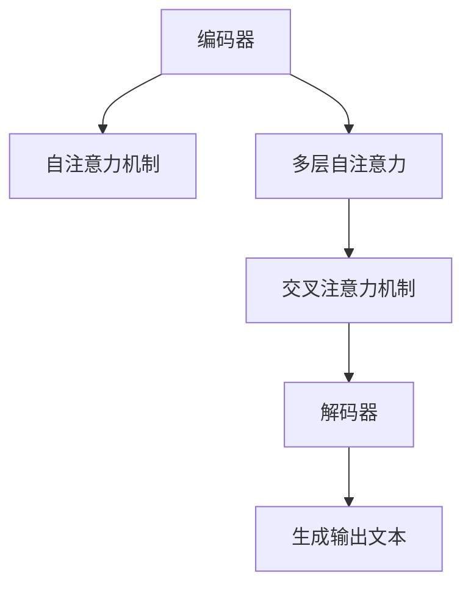

                 

### 文章标题

《提示词工程的未来：GPT-4时代的新挑战》

随着人工智能技术的不断进步，尤其是GPT-4的问世，提示词工程（Prompt Engineering）正成为研究与应用的热点领域。本文将深入探讨GPT-4带来的新挑战，以及提示词工程在这些挑战面前的未来发展。关键词包括：GPT-4、提示词工程、新挑战、技术、伦理、应用场景和未来趋势。

> 关键词：GPT-4、提示词工程、新挑战、技术、伦理、应用场景、未来趋势

**摘要：**
本文首先介绍了提示词工程的基本概念和作用，随后详细阐述了GPT-4的历史、架构和特点。接着，我们探讨了GPT-4时代面临的新挑战，包括技术、伦理和社会影响。文章进一步讨论了提示词工程在不同领域的应用，并展望了其未来的发展趋势。最后，通过实际案例展示了提示词工程的应用实例，并对未来发展提出了一些思考和展望。

---

### 设计步骤

为了更好地组织本文内容，我们采用了以下设计步骤：

1. **概述部分**：简要介绍提示词工程和GPT-4的基本概念，为后续内容打下基础。
2. **核心概念与联系**：通过Mermaid流程图展示提示词工程和GPT-4的核心概念及其相互关系。
3. **GPT-4介绍**：详细讲解GPT-4的历史、架构、特点和应用。
4. **新挑战**：讨论GPT-4时代面临的技术、伦理和社会挑战。
5. **应用场景**：探讨提示词工程在不同领域的实际应用。
6. **未来趋势**：展望提示词工程的发展前景。
7. **实践案例**：分享实际项目案例，展示提示词工程的应用。
8. **总结与展望**：对全文内容进行总结，并对未来发展提出展望。

---

### 提示词工程的概述

提示词工程是一种结合人工智能和人类直觉的方法，旨在通过设计特定的提示词来增强机器学习模型的效果。它起源于自然语言处理（NLP）领域，但逐渐扩展到其他领域，如自动化编程、知识图谱构建等。

**核心概念：**

- **提示词（Prompt）**：一种用于引导模型生成目标结果的引导信息。
- **工程化方法**：通过系统化的方法来设计、优化和评估提示词。
- **模型适应性**：通过调整提示词，使模型在不同任务上表现出更好的性能。

**作用：**

- **提高模型性能**：通过优化提示词，可以显著提升模型的预测准确性和泛化能力。
- **降低模型复杂性**：提示词工程可以帮助简化模型设计，降低对复杂模型结构的依赖。
- **提高可解释性**：通过设计清晰的提示词，可以增强模型的解释性和可理解性。

### 提示词工程的核心概念

提示词工程的核心概念包括以下几个方面：

1. **目标导向**：提示词的设计应明确指向特定目标，帮助模型专注于解决特定问题。
2. **数据准备**：高质量的输入数据是设计有效提示词的基础，因此数据准备是提示词工程的重要环节。
3. **提示词格式**：不同的提示词格式对模型生成结果有显著影响，需要根据模型特性进行选择。
4. **提示词优化**：通过反复试验和评估，优化提示词以提高模型性能。
5. **模型适应性**：提示词工程不仅要考虑单一模型的适应性，还要考虑模型在不同任务和场景下的适应性。

### GPT-4简介

GPT-4是由OpenAI开发的一种大型语言模型，它基于Transformer架构，具有非常高的计算复杂度和强大的文本生成能力。GPT-4在自然语言处理领域取得了显著的成就，并引发了广泛关注。

#### GPT-4的历史与演变

GPT-4是GPT系列模型的最新版本，它继承了前几代GPT模型的优点，并在性能和规模上实现了重大突破。以下是GPT系列模型的发展历程：

- **GPT-1**（2018年）：最初由OpenAI发布，具有约1.17亿个参数。
- **GPT-2**（2019年）：参数规模增加到15亿个，实现了更强大的文本生成能力。
- **GPT-3**（2020年）：拥有1750亿个参数，成为当时最大的语言模型，展示了超强的文本生成和语言理解能力。
- **GPT-4**（2023年）：参数规模进一步增加到100万亿个，成为目前最先进的语言模型。

#### GPT-4的架构与特点

GPT-4采用了Transformer架构，其基本结构包括编码器（Encoder）和解码器（Decoder）。以下是对GPT-4架构和特点的详细解析：

1. **编码器**：编码器负责将输入文本编码为固定长度的向量表示，这一过程通过多个自注意力机制（Self-Attention Mechanism）实现。编码器的主要目的是捕捉输入文本的语义信息。
2. **解码器**：解码器负责根据编码器生成的向量表示生成输出文本。解码过程也通过自注意力机制和交叉注意力机制（Cross-Attention Mechanism）实现，以生成上下文相关的输出。
3. **参数规模**：GPT-4具有100万亿个参数，这使得它在处理复杂文本和生成高质量文本方面具有显著优势。
4. **训练数据**：GPT-4在大量文本数据上进行了训练，这些数据包括互联网上的各种文本资源，如新闻报道、社交媒体帖子、书籍等。这种大规模数据训练使得GPT-4能够理解并生成各种复杂文本。
5. **语言理解能力**：GPT-4展示了卓越的语言理解能力，它能够理解文本中的细微差别，并生成符合语言规则和语义逻辑的文本。

#### Mermaid流程图：GPT-4的架构

以下是GPT-4架构的Mermaid流程图：

#### GPT-4的特点

GPT-4具有以下几个显著特点：

1. **强大的文本生成能力**：GPT-4能够生成高质量、连贯的文本，适用于各种文本生成任务，如文章写作、对话系统、机器翻译等。
2. **多语言支持**：GPT-4支持多种语言，能够处理不同语言的文本，这使得它在跨国企业和多语言环境中具有广泛的应用前景。
3. **灵活的模型规模**：GPT-4的参数规模可以从几十亿到几百亿不等，用户可以根据需求选择合适的模型规模。
4. **高效的训练过程**：尽管GPT-4的参数规模巨大，但OpenAI采用了先进的训练技术和优化方法，使得训练过程高效且可控。

### GPT-4的应用

GPT-4在多个领域展现出了广泛的应用前景，以下是一些主要的应用场景：

1. **自然语言处理**：GPT-4在自然语言处理（NLP）领域表现出色，可以用于文本分类、情感分析、命名实体识别等任务。
2. **自动化编程**：GPT-4能够自动生成代码，为软件开发提供强大的支持，适用于代码补全、代码生成等任务。
3. **对话系统**：GPT-4能够生成自然流畅的对话文本，为智能客服、虚拟助手等应用提供了强大的支持。
4. **知识图谱构建**：GPT-4能够自动提取文本中的实体和关系，有助于构建大规模知识图谱。
5. **教育辅助**：GPT-4可以作为教育辅助工具，为学生提供个性化的学习建议和解答疑问。

### GPT-4的优势与不足

GPT-4在多个方面具有显著的优势，但也存在一些不足：

#### 优势：

1. **强大的语言理解能力**：GPT-4能够理解复杂文本的语义和逻辑，生成高质量、连贯的文本。
2. **多语言支持**：GPT-4支持多种语言，为跨国企业和多语言应用提供了便利。
3. **高效的训练过程**：尽管模型规模巨大，但OpenAI采用了先进的训练技术和优化方法，使得训练过程高效且可控。
4. **广泛的应用场景**：GPT-4在自然语言处理、自动化编程、对话系统等多个领域表现出色。

#### 不足：

1. **计算资源需求大**：GPT-4需要大量的计算资源和存储空间，这对硬件设备提出了较高的要求。
2. **数据隐私和安全问题**：GPT-4在训练过程中使用大量文本数据，这可能导致数据隐私和安全问题。
3. **伦理问题**：GPT-4生成的内容可能包含错误信息、偏见或不当言论，需要严格的管理和审查。

### 新挑战

GPT-4的问世带来了许多新的挑战，包括技术、伦理和社会影响等方面。以下是GPT-4时代面临的主要挑战：

#### 技术挑战

1. **计算资源需求**：GPT-4需要巨大的计算资源和存储空间，这对硬件设备和基础设施提出了更高的要求。
2. **训练数据质量**：GPT-4的训练数据质量对模型性能有重要影响，需要确保数据的质量和多样性。
3. **模型优化**：尽管GPT-4具有强大的性能，但仍然存在模型优化和性能提升的空间。

#### 伦理挑战

1. **偏见与歧视**：GPT-4生成的内容可能包含偏见和歧视，需要确保模型的公平性和无歧视性。
2. **隐私和安全**：GPT-4在处理文本数据时可能涉及个人隐私和安全问题，需要采取严格的管理和审查措施。
3. **透明性和可解释性**：GPT-4生成的内容可能难以解释和理解，需要提高模型的透明性和可解释性。

#### 社会影响

1. **自动化与失业**：GPT-4在自动化编程、智能客服等领域具有广泛应用，可能导致部分职业的失业和就业结构的变化。
2. **社会信任与AI**：GPT-4的广泛应用可能影响社会信任和AI的接受度，需要加强公众教育和透明度。

### 提示词工程的应用场景

提示词工程在多个领域展现了其广泛的应用前景，以下是一些主要的应用场景：

#### 自然语言处理

提示词工程在自然语言处理（NLP）领域具有广泛的应用，以下是一些具体的应用：

1. **文本分类**：通过设计特定的提示词，可以显著提高文本分类的准确性和效率。
2. **情感分析**：通过优化提示词，可以增强情感分析的准确性和稳定性。
3. **命名实体识别**：提示词工程有助于提高命名实体识别的准确率，特别是对于复杂文本。

#### 自动化编程

提示词工程在自动化编程领域也发挥了重要作用，以下是一些具体的应用：

1. **代码补全**：通过设计特定的提示词，可以自动完成代码的编写，提高开发效率。
2. **代码生成**：提示词工程可以自动生成高质量的代码，为软件开发提供支持。
3. **代码重构**：通过设计特定的提示词，可以自动识别和重构代码，提高代码质量和可维护性。

#### 知识图谱构建

提示词工程在知识图谱构建领域也具有广泛的应用，以下是一些具体的应用：

1. **实体抽取**：通过设计特定的提示词，可以从文本中自动提取实体，为知识图谱建设提供支持。
2. **关系抽取**：提示词工程可以帮助自动识别和抽取文本中的关系，丰富知识图谱的语义信息。
3. **实体链接**：通过设计特定的提示词，可以实现实体之间的链接，提高知识图谱的完整性和准确性。

#### 其他应用领域

除了上述领域，提示词工程还在其他领域展示了其应用潜力，以下是一些具体的应用：

1. **对话系统**：通过设计特定的提示词，可以生成自然流畅的对话文本，为智能客服、虚拟助手等应用提供支持。
2. **机器翻译**：提示词工程可以帮助优化机器翻译质量，提高翻译的准确性和流畅性。
3. **文本摘要**：通过设计特定的提示词，可以自动生成高质量的文本摘要，为信息检索和内容推荐提供支持。

### 提示词工程的未来趋势

随着人工智能技术的不断发展，提示词工程在未来将迎来更多的机遇和挑战。以下是提示词工程未来可能的发展趋势：

#### 新技术的发展

1. **大模型与小模型结合**：未来可能会出现大模型与小模型相结合的架构，通过大模型提供语义理解能力，小模型实现具体任务的优化。
2. **多模态提示词工程**：随着多模态数据的普及，提示词工程将逐渐扩展到多模态领域，结合图像、声音等数据提高模型性能。
3. **动态提示词**：未来可能会出现动态提示词技术，根据任务需求和输入数据的动态调整提示词，实现更灵活和高效的模型应用。

#### 新应用的出现

1. **智能医疗**：提示词工程将在智能医疗领域发挥重要作用，如疾病预测、药物研发、医学文本分析等。
2. **智能金融**：提示词工程可以帮助金融领域进行市场预测、风险分析和客户服务，提高金融决策的准确性和效率。
3. **智能教育**：提示词工程可以应用于个性化教育、智能辅导和在线教育平台，为学习者提供定制化的学习体验。

#### 未来展望

1. **模型解释性**：未来将更加重视模型的解释性，通过设计特定的提示词和解释工具，提高模型的可解释性和透明性。
2. **数据隐私和安全**：随着数据隐私和安全问题的日益突出，提示词工程将更加注重数据隐私保护和安全措施。
3. **社会影响与伦理**：未来将更加关注提示词工程的社会影响和伦理问题，确保其应用符合道德和法律规定。

### 实践案例

#### 案例一：自然语言处理中的应用

在自然语言处理领域，提示词工程已被广泛应用于文本分类、情感分析和命名实体识别等任务。以下是一个具体的案例：

**场景**：一家互联网公司需要自动分类用户评论，以了解用户对产品或服务的满意度。

**步骤**：

1. **数据收集**：收集大量用户评论，并标注为正面、负面或中性。
2. **提示词设计**：设计特定的提示词，如“正面评论”、“负面评论”等，用于引导模型进行分类。
3. **模型训练**：使用GPT-4等大型语言模型进行训练，并结合提示词优化模型性能。
4. **模型评估**：通过交叉验证和实际测试，评估模型的分类准确性和稳定性。
5. **部署应用**：将模型部署到线上平台，自动分类用户评论，并提供实时反馈。

**结果**：通过优化提示词，该互联网公司显著提高了用户评论分类的准确性和效率，为产品改进和市场策略提供了有力支持。

#### 案例二：自动化编程中的应用

在自动化编程领域，提示词工程可以帮助开发人员自动生成代码、完成代码补全和重构等任务。以下是一个具体的案例：

**场景**：一位软件工程师需要编写一个复杂的Web应用程序，包括前端、后端和数据库。

**步骤**：

1. **需求分析**：明确软件工程师的需求，如功能模块、数据库结构和API接口等。
2. **提示词设计**：设计特定的提示词，如“创建数据库”、“编写API接口”等，用于引导模型生成代码。
3. **模型训练**：使用GPT-4等大型语言模型进行训练，并结合提示词优化模型性能。
4. **代码生成**：模型根据提示词自动生成相应的代码，如SQL语句、RESTful API接口等。
5. **代码审核**：对自动生成的代码进行审核，确保其正确性和可维护性。
6. **部署应用**：将自动生成的代码集成到Web应用程序中，并进行测试和部署。

**结果**：通过提示词工程，该软件工程师显著提高了开发效率，减少了人工编写代码的工作量，并为后续维护提供了便利。

#### 案例三：知识图谱构建中的应用

在知识图谱构建领域，提示词工程可以帮助自动提取文本中的实体和关系，为知识图谱建设提供支持。以下是一个具体的案例：

**场景**：一家企业需要构建一个涵盖产品、市场和客户等信息的知识图谱。

**步骤**：

1. **数据收集**：收集大量关于产品、市场和客户等信息的文本数据。
2. **提示词设计**：设计特定的提示词，如“产品描述”、“市场趋势”等，用于引导模型提取实体和关系。
3. **模型训练**：使用GPT-4等大型语言模型进行训练，并结合提示词优化模型性能。
4. **实体抽取**：模型根据提示词自动提取文本中的实体，如产品名称、市场趋势等。
5. **关系抽取**：模型根据提示词自动识别和抽取实体之间的关系，如产品与市场的关系等。
6. **知识图谱构建**：将提取的实体和关系构建成知识图谱，并进行存储和查询。
7. **部署应用**：将知识图谱部署到线上平台，提供实时查询和数据分析功能。

**结果**：通过提示词工程，该企业成功构建了一个完整、准确的内部知识图谱，提高了业务决策的准确性和效率。

### 总结与展望

本文从多个角度探讨了提示词工程的未来：GPT-4时代的新挑战。首先，我们介绍了提示词工程的基本概念和作用，随后详细阐述了GPT-4的历史、架构和特点。接着，我们探讨了GPT-4时代面临的新挑战，包括技术、伦理和社会影响。文章进一步讨论了提示词工程在不同领域的应用，并展望了其未来的发展趋势。最后，通过实际案例展示了提示词工程的应用实例。

在总结部分，我们强调了提示词工程在人工智能领域的重要性和潜力。尽管GPT-4带来了许多新挑战，但通过不断优化和创新，提示词工程有望在未来发挥更大的作用。

展望未来，我们期待看到更多创新性的提示词工程应用，如多模态提示词工程、动态提示词技术等。同时，我们也将更加关注模型解释性、数据隐私和安全等问题，确保提示词工程在各个领域的应用符合道德和法律规定。

### 作者信息

作者：AI天才研究院/AI Genius Institute & 禅与计算机程序设计艺术 /Zen And The Art of Computer Programming

