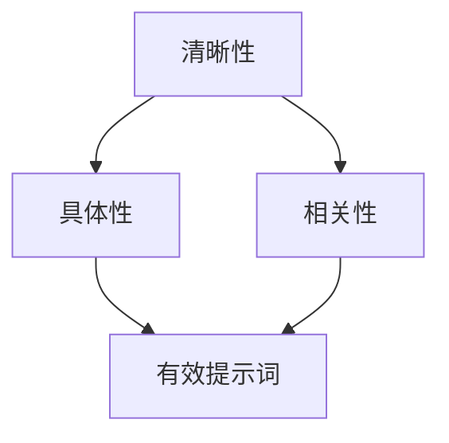

                 

### 第1章：介绍

#### 1.1 书籍目的

《提示词工程的核心原则：清晰、具体、相关》旨在为读者提供关于如何设计、开发和优化提示词的全面指导。通过深入研究提示词工程的核心原则，即清晰性、具体性和相关性，读者将能够更好地理解提示词在自然语言处理和人工智能领域中的重要作用，并掌握有效的提示词设计方法。

#### 1.2 提示词工程的定义与重要性

提示词工程是一种专注于设计、开发和使用提示词的方法论。提示词是一种用于引导用户或系统行为的简短文本。在人工智能和自然语言处理领域，提示词工程具有至关重要的地位，因为它直接影响用户体验和系统性能。

有效的提示词能够提高用户满意度、降低错误率并增强系统的可用性。此外，提示词工程还涉及到用户需求的理解、设计思维的运用、算法的优化以及测试与评估等多个方面。

#### 1.3 本书结构

本书分为三个主要部分：

**第一部分：引言**

- 第1章：介绍
- 第2章：提示词工程的核心原则

**第二部分：实践指南**

- 第3章：需求分析与理解
- 第4章：设计思维在提示词工程中的应用
- 第5章：构建有效的提示词
- 第6章：测试与评估

**第三部分：案例分析**

- 第7章：案例分析
- 第8章：未来趋势与挑战

#### 1.4 目标读者

本书的目标读者包括：

- 自然语言处理和人工智能领域的开发者与研究人员
- 用户体验设计师
- 产品经理
- 人工智能领域的初学者和进阶者

无论您是希望提高自己专业技能的从业者，还是对提示词工程感兴趣的学者，本书都将为您提供宝贵的知识和实用的指导。

---

### 第2章：提示词工程的核心原则

提示词工程的成功离不开三个核心原则：清晰性、具体性和相关性。这些原则不仅指导提示词的设计和开发，还直接影响用户体验和系统性能。在本章中，我们将深入探讨这些原则的含义、重要性以及在实践中的应用。

#### 2.1 清晰性

清晰性是提示词工程的首要原则。一个清晰的提示词能够准确传达其意图，避免歧义和误解。清晰性包括以下几个方面：

1. **简洁性**：提示词应该简洁明了，避免冗长和复杂的句子结构。例如，将“请上传您的个人资料以便我们更好地为您提供服务”简化为“上传资料”。

2. **一致性**：提示词在不同上下文中应保持一致性。例如，如果在一个系统中使用了“下一步”，那么在后续步骤中也应使用相同或类似的术语。

3. **明确性**：提示词应该明确指明用户或系统应采取的行动。例如，使用“请点击‘提交’按钮”而不是模糊的“请继续”。

#### 2.2 具体性

具体性是指提示词应该具体、明确，以便用户能够准确理解和执行。具体性有助于减少用户困惑和错误。以下是一些确保具体性的方法：

1. **具体操作**：提示词应具体说明用户需要执行的操作。例如，“点击屏幕左上角的图标”而不是模糊的“进行操作”。

2. **具体情境**：提示词应适应特定的使用情境。例如，在用户完成注册后，提示词可以是“恭喜您注册成功！请点击‘下一步’继续”。

3. **具体步骤**：对于复杂的任务，提示词应逐步引导用户完成每个步骤。例如，“步骤1：填写姓名。步骤2：选择性别。步骤3：上传头像。”

#### 2.3 相关性

相关性是指提示词应与用户的当前需求、上下文和情境紧密相关。相关性有助于提高用户满意度，减少用户操作的时间和心理负担。以下是一些确保相关性的方法：

1. **即时性**：提示词应即时出现，与用户当前操作同步。例如，当用户在输入框输入内容时，提示词可以实时更新。

2. **上下文相关性**：提示词应基于用户的上下文信息。例如，在购物网站中，当用户将鼠标悬停在某个商品上时，提示词可以是“点击‘添加到购物车’”。

3. **情境适应性**：提示词应根据不同情境调整。例如，在移动应用中，提示词可以是“滑动屏幕以查看下一页”。

#### 2.4 清晰性、具体性和相关性的关系

清晰性、具体性和相关性是相辅相成的。一个清晰的提示词能够传达明确的信息，具体性确保用户能够准确理解，而相关性则确保提示词与用户的当前需求相符。以下是描述这些原则之间关系的Mermaid流程图：

通过遵循这些核心原则，提示词工程能够提高用户满意度、降低错误率并提升系统性能。在实际应用中，设计者需要综合考虑这些原则，以确保最终产品的质量和用户体验。

---

本章我们介绍了提示词工程的核心原则：清晰性、具体性和相关性。这些原则不仅是设计高质量提示词的基础，也是提升用户体验的关键。在下一章中，我们将深入探讨需求分析与理解，这是提示词工程的重要环节，为后续设计工作奠定基础。让我们继续前行，一起探索提示词工程的奥秘。

