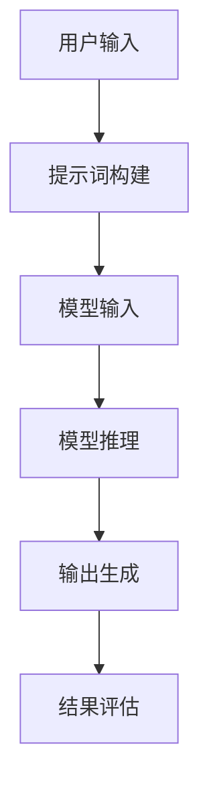
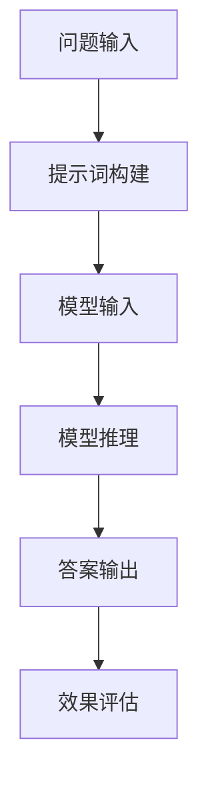

                 

# 提示词工程：提升LLM应用效果的关键

> 关键词：提示词工程，LLM，应用效果，算法原理，数学模型，实战应用

> 摘要：本文深入探讨了提示词工程在提升大型语言模型（LLM）应用效果中的作用。首先，我们介绍了提示词工程的基本概念和重要性，随后分析了LLM的工作原理以及提示词在其中的关键作用。接下来，文章详细讲解了提示词设计原理和优化算法，并使用数学模型和公式阐述了提示词工程的核心数学原理。最后，通过实际应用场景的实战案例，展示了如何有效地将提示词工程应用于文本生成、问答系统和情感分析等领域。

## 第1章: 提示词工程基础

### 1.1 提示词工程概述

#### 1.1.1 提示词工程的重要性

在人工智能领域，尤其是自然语言处理（NLP）方面，大型语言模型（LLM）如GPT、BERT等已经取得了显著的进展。然而，LLM的应用效果并不总是如预期那样理想。研究表明，提示词工程是提升LLM应用效果的关键因素之一。通过精心设计的提示词，可以显著提高模型的预测准确性和生成质量。

#### 1.1.2 提示词工程的定义与目的

提示词工程是指一系列设计、优化和评估用于大型语言模型的提示词的过程。提示词是用户输入给模型的一段文本，用于引导模型生成目标输出。其目的是通过改进提示词的设计和优化，提高模型在特定任务上的表现。

#### 1.1.3 提示词工程的核心挑战

提示词工程面临几个核心挑战：

1. **上下文理解**：提示词需要准确传达用户的意图和上下文信息，这对模型的上下文理解能力提出了高要求。
2. **多样性和泛化性**：提示词应能适应不同场景和任务，具有良好的泛化能力。
3. **优化目标**：如何设计有效的优化目标，以实现提示词的优化，是一个重要挑战。
4. **评估指标**：如何准确评估提示词的有效性，也是一个关键问题。

### 1.2 LLM与提示词工程

#### 1.2.1 LLM概述

大型语言模型（LLM）是基于深度学习的自然语言处理模型，能够对文本进行生成、分类、翻译等操作。LLM的核心思想是通过对大量文本数据进行预训练，使其具备强大的语言理解和生成能力。

#### 1.2.2 LLM的工作原理

LLM的工作原理主要包括以下几个步骤：

1. **文本预处理**：对输入文本进行清洗、分词、标记等预处理操作。
2. **嵌入表示**：将预处理后的文本转换为固定长度的向量表示。
3. **模型推理**：通过神经网络模型对嵌入向量进行处理，生成目标输出。
4. **后处理**：对生成的文本进行必要的后处理，如去除停用词、修正语法错误等。

#### 1.2.3 提示词在LLM应用中的关键作用

提示词在LLM应用中起着关键作用，主要体现在以下几个方面：

1. **引导模型生成**：通过提供上下文信息和用户意图，提示词可以引导模型生成符合预期的输出。
2. **优化生成质量**：好的提示词可以提高生成的文本质量，降低冗余和错误。
3. **提高任务适应性**：通过调整提示词，可以使模型适应不同的任务场景。
4. **增强交互性**：提示词使得用户与模型之间的交互更加自然和高效。

### Mermaid流程图

以下是一个简化的LLM应用流程图，展示了提示词在整个过程中的作用：



## 第2章: 提示词设计与优化算法

### 2.1 提示词设计原理

#### 2.1.1 提示词的构成要素

提示词通常由以下几个要素构成：

1. **问题引导**：用于引导模型理解用户意图。
2. **上下文信息**：提供相关背景知识，帮助模型更好地理解输入。
3. **任务指示**：明确指示模型需要执行的任务。
4. **限制条件**：对生成内容进行约束，确保输出符合要求。

#### 2.1.2 提示词的分类与选择

提示词可以分为以下几类：

1. **直接提示**：直接给出问题的答案或解决方案。
2. **引导式提示**：通过提问引导模型思考。
3. **混合式提示**：结合直接提示和引导式提示。

选择合适的提示词类型取决于任务的性质和用户需求。

#### 2.1.3 提示词的编写技巧

编写有效的提示词需要遵循以下几个原则：

1. **清晰明确**：确保提示词简洁明了，避免模糊不清。
2. **上下文相关**：确保提示词与上下文信息紧密相关。
3. **任务导向**：确保提示词能够引导模型完成特定任务。
4. **多样性**：提供多样化的提示词，以提高模型的泛化能力。

### 2.2 提示词优化算法

#### 2.2.1 提示词优化方法概述

提示词优化算法旨在通过迭代调整提示词，使其在特定任务上取得更好的效果。常见的优化方法包括：

1. **基于规则的优化**：通过规则库对提示词进行调整。
2. **基于机器学习的优化**：使用机器学习算法对提示词进行自动优化。
3. **基于神经网络的优化**：使用神经网络模型对提示词进行优化。

#### 2.2.2 优化算法伪代码

以下是一个简单的基于梯度下降的提示词优化算法的伪代码：

```python
# 提示词优化算法伪代码
def optimize_prompt(prompt, target_output):
    # 初始化优化参数
    alpha = 0.1  # 学习率
    beta = 0.01  # 衰减率

    # 迭代优化过程
    for i in range(num_iterations):
        # 计算损失函数
        loss = calculate_loss(prompt, target_output)

        # 更新提示词
        prompt = update_prompt(prompt, alpha, beta, loss)

    return prompt
```

## 第3章: 提示词工程中的数学模型

### 3.1 损失函数与优化目标

#### 3.1.1 损失函数概述

损失函数是提示词优化算法的核心。它用于衡量提示词与目标输出的差距，指导优化算法调整提示词。

#### 3.1.2 常见损失函数

在提示词工程中，常见的损失函数包括：

1. **交叉熵损失**：用于分类任务。
2. **均方误差损失**：用于回归任务。
3. **对抗损失**：用于对抗性攻击和防御。

#### 3.1.3 损失函数优化算法

常用的损失函数优化算法包括：

1. **梯度下降**：最简单的优化算法。
2. **随机梯度下降**：在梯度下降的基础上，使用随机样本来计算梯度。
3. **Adam优化器**：结合了梯度下降和随机梯度下降的优点。

以下是一个使用交叉熵损失和梯度下降优化器的伪代码示例：

```python
# 损失函数优化算法伪代码
def optimize_loss(prompt, target_output, learning_rate):
    # 计算损失
    loss = calculate_loss(prompt, target_output)

    # 计算梯度
    gradient = calculate_gradient(prompt, target_output)

    # 更新提示词
    prompt = prompt - learning_rate * gradient

    return prompt
```

### 3.2 提示词有效性评估

#### 3.2.1 评估指标

提示词有效性评估通常使用以下指标：

1. **生成质量**：衡量生成的文本是否符合用户预期。
2. **多样性**：衡量生成的文本是否具有多样性。
3. **泛化性**：衡量提示词在不同场景和任务上的适应性。

#### 3.2.2 评估方法

常见的评估方法包括：

1. **人工评估**：通过人工判断生成文本的质量。
2. **自动化评估**：使用自动化工具对生成文本进行评估。

以下是一个使用自动化评估工具的伪代码示例：

```python
# 自动化评估方法伪代码
def evaluate_prompt(prompt, target_output):
    # 生成文本
    generated_text = generate_text(prompt)

    # 计算评估分数
    score = calculate_score(generated_text, target_output)

    return score
```

## 第4章: 提示词工程应用实战

### 4.1 应用场景一：文本生成

#### 4.1.1 应用背景

文本生成是提示词工程的一个重要应用场景。例如，在内容创作、报告生成和聊天机器人等领域，文本生成可以显著提高效率和创作质量。

#### 4.1.2 实践案例

以下是一个文本生成的实践案例：

- **任务**：生成一篇关于“人工智能在未来教育中的应用”的短文。
- **提示词**： “人工智能在未来教育中具有巨大的潜力。它可以帮助教师更好地了解学生的学习情况，提供个性化的学习方案。同时，人工智能还可以用于自动化评估和反馈，减轻教师的工作负担。”

通过优化提示词，可以生成不同风格的文本，如正式、非正式、幽默等。

#### 4.1.3 实现步骤

1. **数据准备**：收集与“人工智能在未来教育中的应用”相关的文本数据。
2. **模型选择**：选择适合文本生成的模型，如GPT或BERT。
3. **提示词设计**：设计有效的提示词，引导模型生成目标文本。
4. **生成文本**：使用模型生成文本，并评估文本质量。
5. **优化提示词**：根据评估结果，调整提示词，提高生成文本的质量。

### 4.2 应用场景二：问答系统

#### 4.2.1 应用背景

问答系统是另一个提示词工程的重要应用场景。例如，在客户支持、智能助手和在线教育等领域，问答系统可以提供高效、准确的回答。

#### 4.2.2 实践案例

以下是一个问答系统的实践案例：

- **任务**：构建一个能够回答关于“计算机编程”问题的问答系统。
- **提示词**： “请回答以下关于计算机编程的问题：什么是面向对象编程？”

通过优化提示词，可以使问答系统更准确地理解问题，并生成高质量的回答。

#### 4.2.3 实现步骤

1. **数据准备**：收集与计算机编程相关的问答数据。
2. **模型选择**：选择适合问答系统的模型，如BERT或GPT。
3. **提示词设计**：设计有效的提示词，引导模型生成回答。
4. **问答交互**：实现用户提问和系统回答的交互流程。
5. **优化提示词**：根据用户反馈和系统表现，调整提示词，提高问答质量。

### 4.3 应用场景三：情感分析

#### 4.3.1 应用背景

情感分析是自然语言处理领域的一个关键任务，用于判断文本的情感倾向。在社交媒体分析、市场研究和客户反馈处理等领域，情感分析具有重要意义。

#### 4.3.2 实践案例

以下是一个情感分析实践案例：

- **任务**：分析一篇关于“新款智能手机”的用户评论，判断其情感倾向。
- **提示词**： “请分析以下用户评论的情感倾向：‘这款智能手机的拍照功能真的很棒，我爱它！’”

通过优化提示词，可以更准确地判断评论的情感倾向。

#### 4.3.3 实现步骤

1. **数据准备**：收集与情感分析相关的文本数据。
2. **模型选择**：选择适合情感分析的模型，如BERT或RoBERTa。
3. **提示词设计**：设计有效的提示词，引导模型进行情感分析。
4. **情感判断**：使用模型对文本进行情感判断。
5. **优化提示词**：根据分析结果和用户反馈，调整提示词，提高情感分析的准确性。

## 第5章: 提示词工程实践总结与展望

### 5.1 实践总结

#### 5.1.1 提示词工程关键经验

通过实践，我们可以总结出以下关键经验：

1. **上下文信息的准确性**：确保提示词包含准确的上下文信息，以提高模型的生成质量。
2. **任务的明确性**：提示词应明确指示模型需要执行的任务，避免模糊不清。
3. **多样性的重要性**：提供多样化的提示词，以提高模型的泛化能力。
4. **评估的重要性**：定期评估提示词的有效性，根据评估结果进行调整。

#### 5.1.2 提示词工程面临的挑战

提示词工程仍面临以下挑战：

1. **上下文理解的复杂性**：模型对上下文信息的理解能力有限，难以处理复杂的上下文。
2. **优化目标的多样化**：不同任务具有不同的优化目标，如何设计通用的优化目标是一个难题。
3. **计算资源的消耗**：提示词优化过程需要大量的计算资源，如何高效地利用资源是一个挑战。

#### 5.1.3 未来发展趋势

未来提示词工程的发展趋势包括：

1. **更强的上下文理解能力**：通过改进模型架构和算法，提高模型对上下文信息的理解能力。
2. **自动化的提示词生成**：开发自动化工具，实现提示词的自动生成和优化。
3. **跨模态的提示词工程**：结合多种模态（如文本、图像、音频）进行提示词设计，实现更丰富的交互体验。

### 5.2 前景展望

提示词工程在人工智能领域的应用前景广阔，有望在以下方面取得突破：

1. **智能客服**：通过优化提示词，提高智能客服系统的响应速度和准确性。
2. **内容创作**：利用提示词工程，实现高效的内容生成和个性化推荐。
3. **教育辅助**：通过提示词工程，为学生提供个性化的学习资源和指导。

附录A: 提示词工程资源汇总

- **工具与库**：NLTK、spaCy、TensorFlow、PyTorch等。
- **论文与报告**：相关的研究论文和行业报告，如“Prompt Engineering for NLP”和“Large-scale Language Modeling”等。
- **在线课程与教程**：相关在线课程和教程，如“自然语言处理导论”和“深度学习与自然语言处理”等。

### Mermaid流程图参考

以下是一个简化的提示词工程流程图：



作者：AI天才研究院/AI Genius Institute & 禅与计算机程序设计艺术 /Zen And The Art of Computer Programming

---

本文深入探讨了提示词工程在提升大型语言模型（LLM）应用效果中的作用。从基本概念、核心算法到实际应用，全面介绍了提示词工程的理论和实践。通过分析提示词设计与优化算法，以及使用数学模型和公式进行解释，本文为读者提供了清晰的理论框架和实践指导。最后，通过实际应用场景的实战案例，展示了提示词工程在文本生成、问答系统和情感分析等领域的应用效果。希望本文能为从事自然语言处理和人工智能开发的读者提供有价值的参考和启示。在未来的发展中，随着技术的不断进步和应用场景的扩大，提示词工程将继续发挥关键作用，推动人工智能领域的创新和发展。

