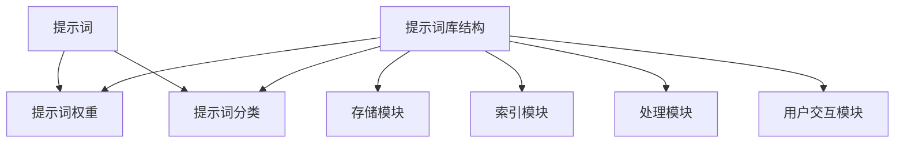
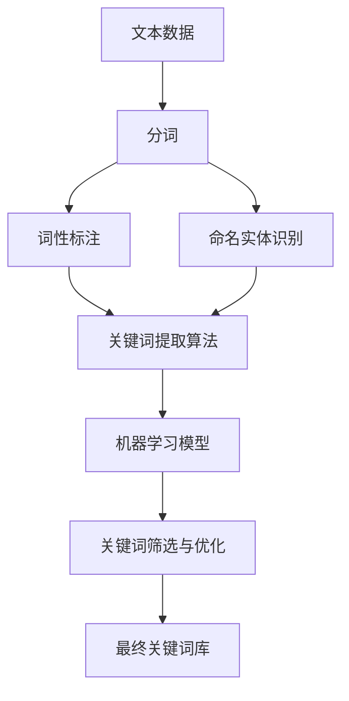

                 

# 《提示词库的建设与管理最佳实践》

## 概述与背景

提示词库作为一种关键的信息管理工具，在当今信息技术迅猛发展的背景下，逐渐成为各个领域特别是人工智能（AI）和自然语言处理（NLP）领域的重要支撑。随着互联网的普及和大数据技术的应用，信息爆炸式增长，如何高效地组织和利用这些信息成为了一个亟待解决的问题。提示词库的出现，正是为了应对这一挑战。

### 1.1 提示词库的概念

提示词库（Keyword Library）是一种用于存储和管理关键词、短语及其相关信息的系统。它通常由多个关键词组成，每个关键词都有其特定的权重和属性。提示词库的核心功能是帮助用户快速、准确地找到所需的信息，提高信息检索的效率和准确性。

### 1.2 提示词库的作用

提示词库在多个方面发挥着重要作用：

- **提高信息检索效率**：通过将关键词与相关信息进行关联，用户可以快速定位到所需信息。
- **改善用户交互体验**：合理的提示词库设计可以简化用户的输入过程，提高交互体验。
- **促进人工智能应用的落地**：在AI和NLP应用中，提示词库是构建智能搜索和推荐系统的基础。

### 1.3 提示词库的发展历程

- **起源**：提示词库的概念最早源于传统的搜索引擎技术，旨在通过关键词索引来提高搜索效率。
- **技术演进**：随着NLP和机器学习技术的发展，提示词库的功能和结构也在不断演进，从简单的关键词索引发展到包含语义信息、权重和分类的复杂系统。

## 提示词库的建设与管理方法

### 2.1 需求分析

在建设提示词库之前，首先需要对用户需求进行深入分析。这一步骤包括：

- **用户需求调研**：通过问卷调查、用户访谈等方式收集用户在使用信息检索和交互过程中遇到的问题和需求。
- **业务目标明确**：根据用户需求，明确业务目标，如提高信息检索效率、改善用户体验等。

### 2.2 技术选型

技术选型是建设提示词库的关键步骤，需要考虑以下几个方面：

- **提示词库技术框架**：选择适合的技术框架，如基于关系数据库、NoSQL数据库或图数据库等。
- **数据存储与管理方案**：根据业务需求，设计合理的存储和管理方案，如数据分片、分布式存储等。

### 2.3 系统架构设计

系统架构设计是确保提示词库稳定、高效运行的基础。以下是系统架构设计的几个关键模块：

- **存储模块**：负责存储和管理提示词及其相关属性。
- **索引模块**：用于快速定位和检索提示词。
- **处理模块**：包括数据清洗、提示词生成与优化等功能。
- **用户交互模块**：提供用户界面，方便用户进行操作和查询。

## 提示词生成与优化

### 4.1 提示词生成技术

提示词生成技术是构建提示词库的核心。常用的方法包括：

- **自然语言处理方法**：通过分词、词性标注、命名实体识别等NLP技术提取关键词。
- **机器学习方法**：使用机器学习模型，如文本分类模型、聚类模型等，自动生成提示词。

### 4.2 提示词优化

提示词优化是提高提示词库质量的重要步骤。优化方法包括：

- **提示词质量评估**：通过评估指标，如权重、语义相关性等，对提示词进行评估和筛选。
- **用户反馈机制**：通过用户反馈，不断调整和优化提示词。

### 4.3 提示词库动态调整

提示词库不是一成不变的，而是需要根据用户行为和业务需求进行动态调整。具体方法包括：

- **用户行为分析**：通过分析用户行为数据，如搜索日志、点击率等，识别热点和趋势，动态调整提示词库。
- **数据驱动的提示词更新**：基于用户行为数据，自动更新和优化提示词库。

## 安全性与隐私保护

### 5.1 数据安全策略

数据安全是建设和管理提示词库的重要保障。以下是一些常见的数据安全策略：

- **数据加密**：对存储的敏感数据进行加密处理，防止数据泄露。
- **访问控制**：通过访问控制机制，确保只有授权用户可以访问提示词库。

### 5.2 隐私保护措施

隐私保护是提示词库建设和管理的重要方面。以下是一些常见的隐私保护措施：

- **数据匿名化**：对用户数据进行匿名化处理，保护用户隐私。
- **数据脱敏**：对敏感数据进行脱敏处理，防止隐私泄露。

### 5.3 合规性与伦理

合规性与伦理是提示词库建设和管理必须考虑的方面。以下是一些关键点：

- **法律法规遵循**：确保提示词库的设计和管理符合相关法律法规。
- **伦理道德规范**：遵循伦理道德规范，确保提示词库的应用不侵犯用户权益。

## 管理与维护

### 6.1 提示词库管理流程

提示词库的管理需要建立一套完整的流程，包括：

- **提示词审核流程**：对新增的提示词进行审核，确保其符合质量标准。
- **提示词更新机制**：定期更新和优化提示词库，确保其与用户需求保持一致。

### 6.2 用户反馈机制

用户反馈是提示词库优化的重要来源。以下是一些常见的用户反馈机制：

- **用户反馈收集**：通过用户调查、用户反馈渠道等收集用户反馈。
- **用户反馈处理**：对用户反馈进行分析和处理，及时调整和优化提示词库。

### 6.3 提示词库性能监控

提示词库的性能监控是确保其稳定运行的关键。以下是一些关键指标和监控方法：

- **提示词库性能指标**：如查询响应时间、检索准确率等。
- **性能监控与优化**：通过监控工具定期检查提示词库的性能，并根据监控结果进行优化。

## 行业应用案例

### 7.1 提示词库在电子商务中的应用

在电子商务领域，提示词库可以用于：

- **商品搜索优化**：通过优化提示词库，提高商品搜索的准确性和效率。
- **用户推荐系统**：基于提示词库，为用户提供个性化的商品推荐。

### 7.2 提示词库在智能客服中的应用

在智能客服领域，提示词库可以用于：

- **语义理解与对话生成**：通过提示词库，实现智能客服的语义理解和对话生成。
- **用户体验优化**：通过优化提示词库，提高用户在与智能客服交互中的体验。

### 7.3 提示词库在自然语言处理中的应用

在自然语言处理领域，提示词库可以用于：

- **语言模型训练**：通过提示词库，构建和训练高质量的NLP模型。
- **文本分类与情感分析**：利用提示词库，实现文本的分类和情感分析。

## 经验与教训分享

### 8.1 成功案例解析

以下是一个成功的提示词库建设案例：

- **案例背景**：某电商平台为了提升用户购物体验，决定建设一个高质量的提示词库。
- **成功原因**：通过深入的用户需求调研和合理的技术选型，该电商平台成功构建了一个高效的提示词库，大幅提高了商品搜索的准确性和用户体验。

### 8.2 失败案例剖析

以下是一个提示词库建设的失败案例：

- **案例背景**：某智能客服系统在建设初期，未能充分考虑用户需求和业务目标，导致提示词库质量低下，用户体验不佳。
- **失败原因**：缺乏用户需求调研和业务目标明确，提示词库设计不合理，导致系统性能不佳。
- **启示与建议**：在建设提示词库时，务必重视用户需求和业务目标的明确，确保系统设计的合理性和高效性。

## 未来展望

### 9.1 提示词库的发展趋势

随着技术的不断进步，提示词库的发展趋势包括：

- **智能化**：通过引入深度学习、自然语言处理等技术，实现提示词库的智能化管理。
- **社交化**：结合社交网络数据，实现提示词库的社交化拓展和应用。
- **个性化**：基于用户行为和兴趣，提供个性化的提示词库服务。

### 9.2 提示词库建设与管理的挑战

提示词库建设与管理面临的挑战包括：

- **数据安全与隐私保护**：确保用户数据的安全和隐私，是建设和管理提示词库的重要任务。
- **技术更新与迭代**：随着技术的不断进步，提示词库也需要不断更新和优化，以保持其竞争力。

### 9.3 未来发展方向

未来，提示词库将朝着以下方向发展：

- **融合多种技术**：结合大数据、云计算、物联网等新技术，实现提示词库的多元化应用。
- **推动产业升级**：通过提示词库的应用，推动各个行业的智能化和数字化转型。

## 附录

### A.1 提示词库建设与管理工具

以下是一些常用的提示词库建设与管理工具：

- **提示词库管理系统**：用于管理和维护提示词库的系统。
- **提示词生成工具**：用于自动生成提示词的工具。

### A.2 提示词库建设与管理资源

以下是一些有价值的提示词库建设与管理资源：

- **提示词库建设与管理指南**：提供详细的提示词库建设和管理指导。
- **相关学术论文与书籍推荐**：推荐一些关于提示词库建设与管理的学术论文和书籍，供进一步学习和参考。

## 参考资料

- 《提示词库技术与应用》
- 《自然语言处理：中文信息处理》
- 《大数据时代的数据管理》
- 《人工智能：一种现代的方法》

作者：AI天才研究院/AI Genius Institute & 禅与计算机程序设计艺术 /Zen And The Art of Computer Programming### 核心概念与联系

提示词库（Keyword Library）是一种用于存储和管理关键词、短语及其相关信息的系统。它是一种知识库，用于提高信息检索的准确性和效率，是自然语言处理（NLP）和搜索引擎技术的重要基础。以下是提示词库的核心概念及其相互联系：

#### 1.1 提示词（Keyword）
提示词是提示词库中的基本元素，通常是简短、具有特定含义的单词或短语。它们可以代表一个概念、一个主题或者一个任务的关键点。在提示词库中，每个提示词都有一定的权重，反映了其在信息检索中的重要性。

#### 1.2 提示词权重（Keyword Weight）
提示词权重是衡量提示词重要性的指标。在构建提示词库时，根据提示词在文本中的频率、词性、语义关系等因素计算权重。高权重的提示词通常会被优先考虑用于搜索和推荐。

#### 1.3 提示词分类（Keyword Classification）
提示词可以根据不同的标准进行分类，如按照领域、用途、语义特征等。合理的分类有助于快速定位和利用提示词，提高系统的智能化程度。

#### 1.4 提示词库结构（Keyword Library Structure）
提示词库的结构设计决定了其功能的实现。通常包括以下模块：

- **存储模块**：用于存储提示词及其相关属性，如权重、分类、来源等。
- **索引模块**：用于快速定位和检索提示词。
- **处理模块**：包括数据清洗、提示词生成与优化等功能。
- **用户交互模块**：提供用户界面，方便用户进行操作和查询。

以下是提示词库核心概念之间的Mermaid流程图表示：



#### 1.5 提示词生成与优化

提示词生成与优化是构建和管理提示词库的关键环节。生成提示词的方法包括：

- **基于规则的方法**：使用预定义的规则从文本中提取关键词。
- **基于统计的方法**：通过计算词频、词长、词性等统计特征生成关键词。
- **基于机器学习的方法**：使用机器学习算法，如文本分类、聚类等，自动生成关键词。

提示词优化则涉及：

- **质量评估**：通过评估指标，如权重、语义相关性等，对提示词进行评估和筛选。
- **用户反馈机制**：通过用户反馈，不断调整和优化提示词库。

#### 1.6 提示词库应用

提示词库的应用非常广泛，包括：

- **搜索引擎**：通过提示词库提高搜索结果的准确性和效率。
- **智能推荐系统**：利用提示词库为用户提供个性化的推荐。
- **自然语言处理**：在文本分类、情感分析等任务中，提示词库作为特征输入，提高模型的性能。

#### 1.7 数据安全与隐私保护

数据安全与隐私保护是提示词库建设和管理的重要方面。确保数据安全与隐私需要：

- **数据加密**：对敏感数据进行加密处理。
- **访问控制**：通过访问控制机制，确保只有授权用户可以访问提示词库。
- **数据脱敏**：对用户数据进行脱敏处理，保护用户隐私。

### 1.8 提示词库管理流程

提示词库的管理需要建立一套完整的流程，包括：

- **需求分析**：明确用户需求，确定建设目标。
- **数据收集与处理**：从各种数据源收集数据，并进行预处理和清洗。
- **提示词生成与优化**：使用各种方法生成提示词，并不断优化。
- **用户交互与反馈**：提供用户界面，收集用户反馈，优化提示词库。
- **性能监控与维护**：定期监控提示词库性能，确保其稳定运行。

通过上述核心概念及其相互联系的分析，我们可以更好地理解和应用提示词库，提高信息检索效率和用户交互体验。在接下来的章节中，我们将详细探讨提示词库的建设与管理方法，包括数据收集与处理、提示词生成与优化、安全性与隐私保护等内容。在建设和管理提示词库时，应遵循这些核心概念，确保系统的有效性和可靠性。

### 提示词词库的概念与原理

提示词库（Keyword Library）是一种专门用于存储和管理关键词、短语及其相关信息的系统。在信息检索、自然语言处理（NLP）和搜索引擎技术中，提示词库发挥着至关重要的作用。为了更好地理解提示词库的概念和原理，我们需要从以下几个方面进行详细探讨。

#### 2.1 提示词库的定义

提示词库是一个集合，其中包含了大量关键词、短语及其相关信息。这些关键词和短语通常与特定的主题、任务或领域相关联，可以用来代表或描述相关内容。提示词库的核心目的是提高信息检索的效率和准确性，通过组织和管理关键词，使得用户可以更快速、准确地找到所需信息。

#### 2.2 提示词库的重要性

提示词库的重要性体现在以下几个方面：

1. **提高信息检索效率**：提示词库通过对关键词的索引和分类，可以大大缩短信息检索时间，提高检索的准确性。
2. **改善用户交互体验**：通过提供清晰的提示词，用户可以更直观地理解系统功能和信息结构，从而提高使用体验。
3. **促进人工智能应用的落地**：在人工智能应用中，提示词库是构建智能搜索和推荐系统的关键基础，有助于实现智能化的信息处理和决策。

#### 2.3 提示词库的构成

提示词库通常由以下几个部分组成：

1. **关键词（Keywords）**：关键词是提示词库中的基本元素，代表特定的概念或主题。每个关键词都有其特定的权重和属性。
2. **权重（Weight）**：权重是衡量关键词重要性的指标。权重通常通过算法计算得出，反映了关键词在信息检索中的优先级。
3. **分类（Classification）**：提示词库中的关键词可以根据不同的标准进行分类，如领域、用途、语义特征等。分类有助于快速定位和利用关键词。
4. **属性（Attributes）**：每个关键词都有一些附加属性，如来源、频率、用途等，这些属性有助于更全面地描述关键词。
5. **索引（Index）**：索引是用于快速定位和检索关键词的数据结构。高效的索引策略可以显著提高检索速度。

#### 2.4 提示词库的原理

提示词库的原理主要涉及以下几个方面：

1. **关键词提取**：通过文本分析技术，从大量文本数据中提取出关键词。常用的方法包括分词、词性标注、命名实体识别等。
2. **权重计算**：根据关键词在文本中的出现频率、词性、语义关系等因素，计算每个关键词的权重。权重是影响信息检索结果排序的关键因素。
3. **分类与组织**：将关键词按照一定的标准进行分类和组织，以便于管理和利用。合理的分类可以提高系统的智能化程度。
4. **索引与检索**：构建高效的索引结构，实现快速、准确的关键词检索。索引策略的选择直接影响检索效率和准确性。
5. **动态调整**：根据用户反馈和业务需求，动态调整关键词库，确保其与实际需求保持一致。

#### 2.5 提示词库的应用

提示词库在多个领域有广泛的应用：

1. **搜索引擎**：搜索引擎通过提示词库提高搜索结果的准确性和效率。用户输入的查询词与提示词库中的关键词进行匹配，从而实现快速检索。
2. **智能推荐系统**：智能推荐系统利用提示词库，根据用户的兴趣和行为，提供个性化的推荐。
3. **自然语言处理**：在NLP任务中，提示词库作为特征输入，用于文本分类、情感分析、命名实体识别等任务，提高模型的表现。
4. **内容管理系统**：内容管理系统通过提示词库，实现文档的分类、索引和检索，提高内容管理的效率和准确性。

#### 2.6 提示词库的优点

提示词库的优点包括：

1. **高效性**：通过索引和分类，实现快速的信息检索。
2. **准确性**：基于权重和语义分析，提高检索结果的准确性。
3. **灵活性**：可以根据实际需求，动态调整和优化关键词库。
4. **扩展性**：易于扩展和整合到各种应用系统中。

#### 2.7 提示词库的挑战

尽管提示词库有诸多优点，但在实际应用中仍面临一些挑战：

1. **数据质量**：高质量的数据是构建高质量提示词库的基础。数据质量直接影响关键词的提取和权重计算。
2. **动态变化**：随着业务需求和用户行为的变化，提示词库需要不断调整和更新，以保持其有效性。
3. **隐私保护**：在收集和处理用户数据时，需要确保数据隐私和安全。
4. **计算资源**：构建和维护提示词库需要大量的计算资源，特别是在大规模数据处理时。

通过上述对提示词库的概念、原理及其应用的探讨，我们可以更好地理解其重要性以及在各类应用场景中的实际作用。在接下来的章节中，我们将进一步探讨提示词库的建设和管理方法，包括需求分析、技术选型、数据收集与处理、提示词生成与优化等内容。

### 提示词库的作用

提示词库作为一种重要的信息管理工具，在多个方面发挥着关键作用。以下从信息检索、用户交互和人工智能应用三个方面详细探讨提示词库的作用。

#### 3.1 提高信息检索效率

信息检索效率是提示词库最直接、最重要的作用之一。传统的搜索引擎主要依赖于关键词匹配，而提示词库通过提供更精确、更具语义意义的关键词，可以显著提高检索效率。

- **关键词匹配的优化**：提示词库中的关键词经过精心挑选和权重计算，可以更准确地匹配用户查询，减少无关信息的干扰。
- **索引效率的提升**：提示词库的索引结构设计合理，可以实现快速检索，从而缩短用户的等待时间。
- **查询响应速度的提高**：通过优化提示词库的存储和检索策略，可以大大提高查询响应速度，提升用户体验。

#### 3.2 改善用户交互体验

提示词库不仅提高了信息检索效率，还在用户交互体验方面发挥了重要作用。

- **简化的输入过程**：通过提供明确的提示词，用户可以更直观地理解系统的功能，简化输入过程，减少错误率。
- **智能化的推荐**：提示词库可以基于用户的查询历史和偏好，提供智能化的推荐，帮助用户更快找到所需信息。
- **个性化定制**：根据用户的需求和偏好，提示词库可以提供个性化的关键词推荐，提高用户的满意度。

#### 3.3 促进人工智能应用的落地

随着人工智能技术的快速发展，提示词库在人工智能应用中扮演着越来越重要的角色。

- **智能搜索**：在搜索引擎中，提示词库可以作为特征输入，用于文本分类、聚类、情感分析等任务，提高搜索结果的准确性和相关性。
- **推荐系统**：提示词库在推荐系统中用于提取用户兴趣特征，实现个性化推荐，提高推荐系统的效果。
- **自然语言处理**：在NLP任务中，提示词库作为特征输入，可以提高模型的表现，如文本分类、命名实体识别、情感分析等。

#### 3.4 具体应用场景

提示词库在不同应用场景中的具体作用如下：

- **电子商务**：在电子商务平台中，提示词库可以用于商品搜索和用户推荐。通过优化提示词库，提高商品搜索的准确性和用户推荐的个性化程度。
- **智能客服**：智能客服系统利用提示词库，实现语义理解与对话生成。通过分析用户输入的文本，智能客服可以快速生成合适的回复，提高服务质量和用户满意度。
- **内容管理**：在内容管理系统中，提示词库可以用于文档的分类、索引和检索，提高内容管理的效率和准确性。
- **教育领域**：在教育领域，提示词库可以用于学习资源的推荐和课程搜索，帮助用户更快速地找到所需的学习资料。
- **医疗健康**：在医疗健康领域，提示词库可以用于疾病查询和医疗信息的检索，为用户提供准确、有用的医疗信息。

#### 3.5 提示词库的优势

提示词库相较于传统关键词索引具有以下优势：

- **更精细的语义理解**：提示词库不仅包含关键词，还包含关键词的权重、分类和属性等信息，可以实现更精细的语义理解。
- **动态调整和优化**：提示词库可以根据用户反馈和业务需求，动态调整和优化关键词，保持其与实际需求的同步。
- **灵活性和扩展性**：提示词库的设计灵活，可以适应不同的应用场景和需求，具有很好的扩展性。

通过上述分析，我们可以看到提示词库在提高信息检索效率、改善用户交互体验和促进人工智能应用落地等方面具有重要作用。在接下来的章节中，我们将进一步探讨提示词库的建设和管理方法，包括需求分析、技术选型、数据收集与处理等内容，以帮助读者更好地理解和应用提示词库。

### 提示词库的发展历程

提示词库的概念虽然相对年轻，但其背后的技术演进和应用场景却有着悠久的历史。从最早的搜索引擎技术到现代的智能搜索和自然语言处理系统，提示词库经历了多个阶段的发展。

#### 4.1 提示词库的起源

提示词库的起源可以追溯到最早的搜索引擎技术。20世纪90年代，随着互联网的兴起，搜索引擎开始成为人们获取信息的重要工具。早期的搜索引擎如AltaVista、Google等，主要通过关键词索引来提高搜索效率。这些搜索引擎通过提取网页中的关键词，构建索引数据库，以实现快速检索。这一阶段的提示词库相对简单，主要依赖于关键词的匹配。

#### 4.2 早期搜索引擎中的关键词索引

在早期的搜索引擎中，关键词索引是最基本的功能。这些搜索引擎通过对网页进行抓取，提取出其中的关键词，并将这些关键词存储在索引数据库中。当用户进行搜索时，搜索引擎会根据输入的关键词在索引数据库中查找匹配的网页，并返回搜索结果。这一阶段的关键词索引主要依赖于字符串匹配和词频统计。

#### 4.3 提示词库的演进

随着自然语言处理（NLP）技术的发展，提示词库的功能逐渐丰富。NLP技术为提示词库提供了更多可能性，使得搜索引擎可以更准确地理解用户查询和网页内容。

- **词性标注**：词性标注是NLP的重要技术之一，它通过对文本中的每个词进行词性标注，将词语分为名词、动词、形容词等不同类型。词性标注有助于提高搜索的准确性和语义理解。
- **命名实体识别**：命名实体识别（NER）技术用于识别文本中的命名实体，如人名、地名、组织名等。这一技术可以用于优化搜索引擎的提示词库，提高对特定类型的实体信息的检索能力。
- **语义分析**：语义分析技术通过理解文本中的语义关系，实现更高层次的文本理解。语义分析可以用于构建更加精准和智能的提示词库，提高信息检索的效率。

#### 4.4 现代智能搜索与提示词库

现代智能搜索系统在提示词库的建设和管理上有了更多创新和优化。以下是一些关键技术和发展趋势：

- **深度学习与提示词库**：深度学习技术在提示词库中的应用，使得搜索引擎可以更准确地提取和利用关键词。通过使用深度神经网络，如卷积神经网络（CNN）和循环神经网络（RNN），可以实现更复杂的语义理解。
- **动态提示词库**：传统的提示词库通常是静态的，难以适应实时变化的搜索需求。现代智能搜索系统引入了动态提示词库的概念，可以根据用户的搜索行为和查询历史，实时调整和优化提示词库。
- **个性化提示词库**：个性化提示词库是根据用户偏好和历史行为，为每个用户定制化构建的提示词库。个性化提示词库可以提供更加精准和个性化的搜索结果，提升用户体验。

#### 4.5 提示词库的发展趋势

未来，提示词库将继续朝着智能化、社交化和个性化方向发展：

- **智能化**：随着人工智能技术的进步，提示词库将更加智能化，可以自动提取、分类和优化关键词，提高信息检索的效率和准确性。
- **社交化**：提示词库将结合社交网络数据，利用用户社交关系和兴趣标签，实现更精准的搜索和推荐。
- **个性化**：个性化提示词库将根据用户的个性化需求和行为，提供更加定制化的信息检索和推荐服务。

#### 4.6 行业应用趋势

在各个行业，提示词库的应用趋势也在不断变化：

- **电子商务**：电子商务平台通过优化提示词库，提高商品搜索和推荐的效果，提升用户体验和销售额。
- **智能客服**：智能客服系统利用提示词库，实现语义理解和对话生成，提高服务质量和用户满意度。
- **自然语言处理**：在自然语言处理领域，提示词库作为特征输入，用于文本分类、情感分析和命名实体识别等任务，提高模型的表现。

通过上述对提示词库发展历程的回顾，我们可以看到提示词库从早期的简单关键词索引，到现代的智能搜索和自然语言处理系统，经历了多个阶段的演进。未来，随着技术的不断创新和应用场景的拓展，提示词库将继续在信息检索、用户交互和人工智能领域发挥重要作用。

### 建设前的准备

在开始建设提示词库之前，需要进行一系列准备工作，以确保提示词库的质量和实用性。以下从需求分析、技术选型、系统架构设计三个方面详细阐述建设前的准备工作。

#### 2.1 需求分析

需求分析是建设提示词库的第一步，它决定了提示词库的功能、规模和性能。需求分析的主要任务包括：

- **用户需求调研**：通过问卷调查、用户访谈、用户行为分析等方式，收集用户在使用信息检索和交互过程中遇到的问题和需求。了解用户对关键词检索的准确性、速度、用户体验等方面的期望。
- **业务目标明确**：根据用户需求，明确业务目标，如提高信息检索效率、改善用户体验、优化搜索引擎性能等。业务目标将直接影响提示词库的设计和实现。
- **功能需求列举**：根据用户需求和业务目标，列举出提示词库需要实现的主要功能，如关键词提取、权重计算、分类管理、用户反馈收集、动态调整等。

#### 2.2 技术选型

技术选型是建设提示词库的关键步骤，它决定了系统的性能、可扩展性和维护成本。以下是一些常见的技术选型考虑因素：

- **提示词库技术框架**：选择合适的技术框架是构建提示词库的基础。常见的技术框架包括基于关系数据库（如MySQL）、NoSQL数据库（如MongoDB）和图数据库（如Neo4j）等。关系数据库适合处理结构化数据，NoSQL数据库适合处理大量非结构化数据，图数据库适合处理复杂的关系数据。
- **数据存储与管理方案**：根据业务需求和数据特点，设计合理的存储和管理方案。常见的方案包括分布式存储、数据分片、数据压缩等。分布式存储可以提高系统的可扩展性和容错性，数据分片可以提高数据访问效率，数据压缩可以减少存储空间和传输带宽。
- **索引与检索技术**：选择高效的索引与检索技术，如B树、哈希表、倒排索引等。高效的索引技术可以提高查询速度和准确性，降低系统的响应时间。
- **计算框架与工具**：选择适合的计算框架和工具，如Apache Spark、Flink等，用于大规模数据处理和分析。

#### 2.3 系统架构设计

系统架构设计是确保提示词库稳定、高效运行的基础。以下是系统架构设计的关键模块：

- **存储模块**：存储模块负责存储和管理提示词及其相关属性。根据数据特点和需求，可以选择关系数据库、NoSQL数据库或图数据库。存储模块应具备高效的数据访问和更新能力，以满足实时性和可靠性要求。
- **索引模块**：索引模块负责构建和更新索引数据结构，以实现快速检索。常用的索引技术包括B树、哈希表、倒排索引等。索引模块的设计应考虑查询性能和存储空间之间的平衡。
- **处理模块**：处理模块负责数据处理和分析，包括数据清洗、数据转换、关键词提取、权重计算等。处理模块应具备高并发处理能力和分布式计算能力，以应对大量数据的处理需求。
- **用户交互模块**：用户交互模块负责提供用户界面和交互功能。用户可以通过界面进行关键词查询、反馈、管理操作等。用户交互模块应设计简洁、直观，以提高用户体验。
- **监控与维护模块**：监控与维护模块负责实时监控系统的性能和状态，包括日志记录、错误处理、性能优化等。监控与维护模块应具备自动化和智能化能力，以提高系统的稳定性和可维护性。

#### 2.4 需求分析与技术选型的示例

以下是一个示例，说明如何进行需求分析和技术选型：

**示例：电商平台的提示词库**

**需求分析：**
- **用户需求**：用户希望快速、准确地搜索到感兴趣的商品。
- **业务目标**：提高商品搜索的准确性、提升用户体验、降低搜索延迟。

**技术选型：**
- **提示词库技术框架**：选择基于关系数据库（如MySQL）的框架，以处理商品信息等结构化数据。
- **数据存储与管理方案**：使用分布式存储技术，如Hadoop HDFS，以存储大量商品数据。
- **索引与检索技术**：使用B树索引，以提高商品搜索的效率。
- **计算框架与工具**：选择Apache Spark，用于处理大规模数据分析和关键词提取。

通过上述需求分析和技术选型，可以为电商平台的提示词库提供一个基本的设计方向，确保其能够满足用户需求和业务目标。

总之，建设前的准备工作是提示词库成功的关键。通过深入的需求分析、合理的技术选型和科学的系统架构设计，可以确保提示词库的高效性、稳定性和可扩展性。

### 数据收集与处理

在提示词库的建设过程中，数据收集与处理是至关重要的一环。这一步骤决定了提示词库的质量和可靠性。以下从数据来源、数据清洗、数据存储三个方面详细探讨数据收集与处理的方法。

#### 3.1 数据来源

数据来源是构建提示词库的基础。为了确保提示词库的全面性和准确性，需要从多个渠道收集数据：

- **内部数据源**：内部数据源主要包括企业内部系统、数据库和日志文件。这些数据源可以提供与业务相关的关键词、用户行为、商品信息等。例如，电子商务平台可以通过用户搜索日志、商品描述、用户评价等内部数据源收集关键词。
- **外部数据源**：外部数据源主要包括互联网公开数据、社交媒体、专业数据库等。这些数据源可以提供丰富的背景信息、新闻资讯、行业报告等。例如，可以从新闻网站、社交媒体平台、公共数据库等收集与特定领域相关的关键词。

在收集数据时，需要确保数据的合法性和合规性，避免侵犯用户隐私和知识产权。

#### 3.2 数据清洗

数据清洗是数据收集后的重要步骤，目的是去除数据中的噪声和错误，提高数据质量。以下是一些常见的数据清洗方法：

- **数据预处理**：包括去除重复数据、填补缺失值、标准化数据等。例如，去除用户搜索日志中的重复记录，填补用户评价中的空值，将不同格式的日期统一为标准格式。
- **数据去噪**：通过过滤、屏蔽等方法去除数据中的噪声。例如，从用户评论中去除表情符号、去除常见的噪声词汇。
- **数据转换**：将数据转换为统一格式，以便后续处理。例如，将不同的数据格式（如文本、图片、音频等）转换为文本格式，方便进行文本分析。
- **数据质量评估**：通过评估指标，如数据完整性、一致性、准确性等，对数据质量进行评估。例如，检查数据是否缺失、是否一致、是否准确等。

以下是数据清洗过程的示例伪代码：

```python
# 去除重复数据
data = remove_duplicates(data)

# 填补缺失值
data = fill_missing_values(data)

# 标准化数据
data = standardize_data(data)

# 数据去噪
data = remove_noise(data)

# 数据转换
data = convert_data_format(data)
```

#### 3.3 数据存储

数据存储是数据处理的最后一步，目的是将清洗后的数据存储到合适的数据库中，以便后续的查询和使用。以下是一些常见的数据存储方案：

- **关系数据库**：适用于结构化数据存储。关系数据库（如MySQL、PostgreSQL等）具有强大的数据管理和查询功能，适合存储和查询大量结构化数据。例如，可以存储用户搜索日志、商品信息等。
- **NoSQL数据库**：适用于非结构化数据存储。NoSQL数据库（如MongoDB、Cassandra等）具有灵活的数据模型和高扩展性，适合存储和查询大量非结构化数据。例如，可以存储用户评论、社交媒体数据等。
- **分布式存储**：适用于大规模数据存储。分布式存储系统（如Hadoop HDFS、Amazon S3等）可以存储和处理海量数据，具有高可用性和高可靠性。例如，可以存储电子商务平台的海量商品数据。

以下是数据存储过程的示例伪代码：

```python
# 连接到数据库
db = connect_database()

# 创建数据表
db.create_table('keywords', fields=['id', 'text', 'weight', 'source'])

# 插入数据
for data in cleaned_data:
    db.insert('keywords', data)

# 关闭数据库连接
db.close()
```

#### 3.4 数据处理流程

数据处理流程通常包括以下步骤：

1. **数据采集**：从各种数据源收集原始数据。
2. **数据清洗**：对采集到的数据进行预处理、去噪、转换等操作，提高数据质量。
3. **数据存储**：将清洗后的数据存储到数据库中，以便后续处理和使用。
4. **数据分析和挖掘**：对存储在数据库中的数据进行进一步分析和挖掘，提取出有价值的信息，如关键词、权重等。
5. **数据可视化**：将分析结果可视化，以便于理解和展示。

以下是数据处理流程的示例伪代码：

```python
# 数据采集
raw_data = collect_data()

# 数据清洗
cleaned_data = clean_data(raw_data)

# 数据存储
store_data(cleaned_data)

# 数据分析和挖掘
analysis_results = analyze_data(cleaned_data)

# 数据可视化
visualize_results(analysis_results)
```

通过上述数据收集与处理方法，可以构建高质量的提示词库，为后续的提示词生成、优化和应用提供可靠的数据支持。在数据处理过程中，需要确保数据的质量和一致性，以提高提示词库的准确性和实用性。

### 提示词生成技术

提示词生成技术是构建高质量提示词库的关键环节，其目的是从大量的文本数据中提取出具有代表性的关键词。以下是几种常用的提示词生成技术，包括自然语言处理方法和机器学习方法。

#### 4.1 自然语言处理方法

自然语言处理（NLP）方法通过分析文本的语法、语义和句法结构，提取出具有高信息量的关键词。以下是一些常用的NLP技术：

- **分词**：分词是将文本分解为单个单词或短语的过程。中文分词通常使用基于规则的方法（如正向最大匹配、逆向最大匹配）和基于统计的方法（如基于词频的统计模型、基于依存关系的统计模型）。
- **词性标注**：词性标注是对文本中的每个词进行词性分类，如名词、动词、形容词等。词性标注有助于理解文本的语义结构，从而提取出更准确的关键词。
- **命名实体识别（NER）**：命名实体识别是识别文本中的特定实体，如人名、地名、组织名等。NER可以用于提取与特定主题相关的关键词。
- **关键词提取算法**：常用的关键词提取算法包括TF-IDF（词频-逆文档频率）、TextRank（文本排序算法）和LDA（主题模型）等。这些算法通过计算词频、词频分布和语义相似性，提取出具有代表性的关键词。

以下是使用TF-IDF算法提取关键词的示例伪代码：

```python
# 加载文本数据
text_data = load_text_data()

# 分词
tokenized_data = tokenize(text_data)

# 计算词频
word_freq = compute_word_frequency(tokenized_data)

# 计算逆文档频率
idf = compute_idf(word_freq)

# 计算关键词得分
keyword_scores = compute_keyword_scores(word_freq, idf)

# 提取关键词
keywords = extract_keywords(keyword_scores, top_n=100)
```

#### 4.2 机器学习方法

机器学习方法通过训练模型，自动从文本数据中提取出关键词。以下是一些常用的机器学习模型：

- **文本分类模型**：文本分类模型可以将文本分类到不同的类别，从而提取出与特定类别相关的关键词。常用的文本分类模型包括朴素贝叶斯、支持向量机（SVM）和深度神经网络（DNN）等。
- **聚类模型**：聚类模型将文本数据按照其语义相似性进行分组，从而提取出不同组别中的关键词。常用的聚类模型包括K-均值、层次聚类和DBSCAN等。
- **生成模型**：生成模型通过生成文本数据，从而提取出文本中的关键词。常用的生成模型包括循环神经网络（RNN）和变分自编码器（VAE）等。

以下是使用朴素贝叶斯分类器提取关键词的示例伪代码：

```python
# 加载文本数据
text_data = load_text_data()

# 分词和标记
tokenized_data = tokenize(text_data)
labels = label_data(text_data)

# 训练朴素贝叶斯模型
naive_bayes_model = train_naive_bayes(tokenized_data, labels)

# 预测和提取关键词
predicted_keywords = predict_keywords(naive_bayes_model, tokenized_data)
extracted_keywords = extract_keywords(predicted_keywords, top_n=100)
```

#### 4.3 综合应用

在实际应用中，自然语言处理方法和机器学习方法可以综合应用，以提取更全面、更准确的关键词。例如，可以首先使用自然语言处理方法进行初步提取，然后使用机器学习方法进行进一步筛选和优化。



通过上述提示词生成技术，可以构建高质量的提示词库，提高信息检索的效率和准确性。在后续的章节中，我们将继续探讨提示词优化、动态调整、安全性与隐私保护等内容。

### 提示词优化

提示词优化是提升提示词库质量和信息检索效果的关键步骤。通过评估提示词质量、建立反馈机制以及动态调整提示词库，可以确保提示词库始终与用户需求保持一致，并提供高效、精准的信息检索服务。

#### 4.2.1 提示词质量评估

提示词质量评估是优化提示词库的第一步，它决定了哪些提示词值得保留，哪些需要调整或删除。以下是一些常用的提示词质量评估指标：

1. **权重（Weight）**：权重是衡量提示词重要性的指标。高权重的提示词通常与用户查询高度相关，因此需要优先保留。可以通过分析提示词在用户搜索中的频率、相关性和用户点击率等指标计算权重。

2. **语义相关性（Semantic Relevance）**：语义相关性反映了提示词与搜索主题的相关程度。高相关性的提示词能够更准确地匹配用户查询，提高检索结果的准确性。可以通过计算提示词的TF-IDF（词频-逆文档频率）值、词性相似度等指标评估语义相关性。

3. **使用频率（Frequency of Use）**：使用频率是提示词在实际应用中的使用次数。高频率使用的提示词通常是用户需求较高的关键词，应优先保留。

4. **用户反馈（User Feedback）**：用户对提示词的反馈是评估提示词质量的重要依据。可以通过用户调查、点击率、搜索满意度等指标收集用户反馈，评估提示词的实际效果。

以下是提示词质量评估的示例伪代码：

```python
# 加载提示词库
keyword_library = load_keyword_library()

# 计算权重
weights = compute_weights(keyword_library)

# 评估语义相关性
semantic_relevances = assess_semantic_relevance(keyword_library)

# 收集用户反馈
user_feedback = collect_user_feedback()

# 综合评估
evaluation_scores = combine_evaluation_scores(weights, semantic_relevances, user_feedback)
```

#### 4.2.2 提示词反馈机制

提示词反馈机制是优化提示词库的关键环节，它通过收集和分析用户反馈，不断调整和优化提示词库。以下是一些常见的提示词反馈机制：

1. **用户调查**：通过定期开展用户调查，收集用户对提示词库的使用体验和建议。用户调查可以采用问卷调查、在线访谈等形式。

2. **点击率分析**：分析用户点击提示词的行为数据，识别高点击率和高转化率的提示词。这些提示词表明用户对其具有较高的需求，应予以保留和优化。

3. **错误反馈**：建立错误反馈机制，允许用户报告搜索结果不准确的提示词。通过分析错误反馈，可以发现并修复提示词库中的问题。

4. **个性化反馈**：根据用户的个性化偏好和搜索历史，提供个性化的提示词反馈。个性化反馈可以更准确地捕捉用户的实际需求，提高提示词库的实用性。

以下是提示词反馈机制的示例伪代码：

```python
# 收集用户调查数据
user_surveys = collect_user_surveys()

# 分析点击率
click_rate_data = analyze_click_rate()

# 收集错误反馈
error_reports = collect_error_reports()

# 分析个性化反馈
personalized_feedback = analyze_personalized_feedback()

# 综合分析用户反馈
combined_feedback = combine_feedback(user_surveys, click_rate_data, error_reports, personalized_feedback)
```

#### 4.2.3 动态调整提示词库

提示词库不是静态的，而是需要根据用户需求、业务发展和数据变化进行动态调整。以下是一些常见的动态调整方法：

1. **定期更新**：定期对提示词库进行更新，删除低质量的提示词，添加新的高价值提示词。更新频率可以根据业务需求和数据量进行灵活调整。

2. **自动化调整**：利用机器学习和自然语言处理技术，实现自动化调整。例如，通过训练模型，自动评估和筛选提示词，并根据评估结果进行动态调整。

3. **用户行为分析**：通过分析用户行为数据，如搜索日志、点击率、转化率等，识别热点和趋势，动态调整提示词库。用户行为分析可以提供实时、准确的调整依据。

以下是动态调整提示词库的示例伪代码：

```python
# 分析用户行为数据
user_behavior_data = analyze_user_behavior()

# 训练调整模型
adjustment_model = train_adjustment_model(user_behavior_data)

# 自动调整提示词库
update_keyword_library(adjustment_model)
```

通过提示词优化，可以显著提升提示词库的质量和效果，提高信息检索的准确性和用户体验。在后续的章节中，我们将继续探讨提示词库的安全性与隐私保护、管理与维护以及行业应用案例等内容。

### 提示词库的动态调整

提示词库的动态调整是确保其与用户需求、业务目标和数据变化保持一致的重要环节。通过实时用户行为分析、数据驱动的调整策略以及持续优化的方法，可以实现提示词库的高效管理和持续改进。

#### 4.3.1 实时用户行为分析

实时用户行为分析是动态调整提示词库的基础。通过收集和分析用户在信息检索、搜索结果点击、浏览路径等行为数据，可以深入了解用户的实际需求和使用习惯。以下是一些常用的用户行为分析方法和指标：

1. **点击率（Click-Through Rate, CTR）**：点击率是衡量提示词受欢迎程度的重要指标。通过分析点击率数据，可以发现用户偏好的关键词，从而优化提示词库。

2. **搜索转换率（Search Conversion Rate）**：搜索转换率反映了用户通过搜索找到所需信息的成功率。通过分析搜索转换率，可以识别哪些提示词更能满足用户需求。

3. **用户停留时间（User Dwell Time）**：用户在搜索结果页面上的停留时间可以反映用户对搜索结果的满意度。长停留时间通常表明用户对搜索结果较为满意。

4. **搜索结果质量评估**：通过用户对搜索结果的反馈，如点赞、评论、举报等，可以评估搜索结果的质量，从而调整和优化提示词库。

以下是实时用户行为分析的示例伪代码：

```python
# 收集用户点击率数据
click_rate_data = collect_click_rate_data()

# 收集用户搜索转换率数据
search_conversion_rate_data = collect_search_conversion_rate_data()

# 收集用户停留时间数据
dwell_time_data = collect_dwell_time_data()

# 计算综合评分
evaluation_scores = compute_evaluation_scores(click_rate_data, search_conversion_rate_data, dwell_time_data)
```

#### 4.3.2 数据驱动的调整策略

数据驱动的调整策略是基于用户行为数据，利用机器学习和统计分析方法，实现提示词库的自动优化。以下是一些常见的数据驱动调整策略：

1. **自动权重调整**：通过分析用户行为数据，动态调整提示词的权重。高点击率和高转换率的提示词可以增加权重，而低效的提示词则可以降低权重。

2. **关键词替换**：根据用户搜索行为，识别表现不佳的关键词，并使用更相关的关键词进行替换。例如，如果“手机”这个词的点击率较低，可以替换为“智能手机”或“手机型号”。

3. **自动分类调整**：基于用户行为数据，自动调整关键词的分类。例如，如果用户在搜索“旅游”时更偏好“度假胜地”而不是“旅游景点”，可以将相关关键词重新分类。

4. **个性化推荐**：利用用户行为数据和个性化算法，为用户提供个性化的关键词推荐。例如，根据用户的历史搜索和浏览记录，推荐与其兴趣相关的关键词。

以下是数据驱动调整策略的示例伪代码：

```python
# 加载用户行为数据
user_behavior_data = load_user_behavior_data()

# 训练自动权重调整模型
weight_adjustment_model = train_weight_adjustment_model(user_behavior_data)

# 调整提示词权重
update_keyword_weights(weight_adjustment_model)

# 识别低效关键词
ineffective_keywords = identify_ineffective_keywords(user_behavior_data)

# 进行关键词替换
replace_keywords(ineffective_keywords)
```

#### 4.3.3 持续优化方法

提示词库的持续优化是一个长期过程，需要定期评估、调整和改进。以下是一些持续优化方法：

1. **定期评估**：定期对提示词库进行评估，检查关键词的质量和效果。可以通过用户行为数据分析、搜索结果质量评估等方法，识别需要改进的领域。

2. **自动化流程**：建立自动化的提示词库管理流程，包括数据收集、处理、分析和调整。自动化流程可以提高效率，减少人为错误。

3. **用户反馈**：通过用户反馈，不断改进提示词库。建立用户反馈机制，鼓励用户报告问题和提供改进建议。

4. **技术创新**：结合最新的自然语言处理和机器学习技术，不断提升提示词库的智能化水平。例如，引入深度学习模型、语义分析技术等。

以下是持续优化方法的示例伪代码：

```python
# 定期评估提示词库
evaluate_keyword_library()

# 自动化数据处理和分析
automate_data_processing_and_analysis()

# 收集用户反馈
collect_user_feedback()

# 应用技术创新
apply_technological_innovations()
```

通过实时用户行为分析、数据驱动的调整策略和持续优化方法，可以实现提示词库的动态调整和持续改进，确保其与用户需求保持一致，提供高效、准确的信息检索服务。

### 安全性与隐私保护

在提示词库的建设和管理过程中，安全性和隐私保护是至关重要的。这不仅关系到数据的完整性和可靠性，还涉及到用户的隐私和信息安全。以下将从数据安全策略、隐私保护措施以及合规性和伦理方面详细讨论提示词库的安全性问题。

#### 5.1 数据安全策略

数据安全策略旨在确保存储在提示词库中的数据不被未授权访问、篡改或泄露。以下是一些常见的数据安全策略：

1. **数据加密**：对敏感数据进行加密处理，如用户身份信息、搜索关键词等。加密可以防止数据在传输和存储过程中被窃取或篡改。

2. **访问控制**：通过访问控制机制，确保只有授权用户可以访问提示词库。访问控制可以基于用户角色、权限等级等，限制对敏感数据的访问。

3. **数据备份与恢复**：定期对提示词库进行备份，确保在数据丢失或损坏时，能够迅速恢复。备份策略应考虑数据的安全性和可靠性。

4. **安全审计**：定期进行安全审计，检查系统的安全性和合规性。安全审计可以发现潜在的安全漏洞和风险，及时采取修复措施。

5. **网络安全**：确保网络系统的安全，防止网络攻击和数据泄露。可以使用防火墙、入侵检测系统（IDS）、虚拟专用网（VPN）等网络安全技术。

以下是数据安全策略的示例伪代码：

```python
# 数据加密
encrypted_data = encrypt_data(sensitive_data)

# 访问控制
authorize_access(user_role, user_permission)

# 数据备份
backup_data(keyword_library)

# 安全审计
perform_security_audit(keyword_library)
```

#### 5.2 隐私保护措施

隐私保护措施旨在保护用户的个人信息和隐私，防止数据被滥用或泄露。以下是一些常见的隐私保护措施：

1. **数据匿名化**：在收集和处理用户数据时，对敏感信息进行匿名化处理，如使用假名或匿名标识符代替真实身份信息。

2. **数据脱敏**：对敏感数据进行脱敏处理，如对电话号码、电子邮件地址等敏感信息进行部分遮挡或替换。

3. **隐私政策**：制定明确的隐私政策，告知用户其个人信息的使用方式和范围。用户应明确同意其个人信息的使用，并有权拒绝或撤回同意。

4. **用户隐私设置**：提供用户隐私设置选项，允许用户控制其个人信息的共享和使用。例如，用户可以选择隐藏其搜索历史或限制第三方访问其数据。

5. **数据访问日志**：记录用户数据的访问日志，监控和记录数据访问行为，及时发现和处理异常行为。

以下是隐私保护措施的示例伪代码：

```python
# 数据匿名化
anonymized_data = anonymize_data(sensitive_data)

# 数据脱敏
desensitized_data = desensitize_data(sensitive_data)

# 隐私政策
display_privacy_policy()

# 用户隐私设置
user_privacy_settings = set_user_privacy_settings()
```

#### 5.3 合规性与伦理

合规性与伦理是确保提示词库建设和管理合法和道德的重要方面。以下是一些关键点：

1. **法律法规遵循**：确保提示词库的设计和管理符合相关法律法规，如《中华人民共和国网络安全法》、《个人信息保护法》等。遵守法律法规是保护用户权益的基本要求。

2. **伦理道德规范**：遵循伦理道德规范，确保提示词库的应用不侵犯用户权益。例如，不应滥用用户数据，不应进行未经授权的数据挖掘或分析。

3. **用户知情权**：尊重用户的知情权，确保用户在数据收集和使用过程中，能够充分了解其个人信息的用途和处理方式。

4. **用户控制权**：赋予用户对其个人信息的控制权，如用户可以请求访问、更正或删除其个人信息。

5. **透明度**：提高提示词库系统的透明度，让用户了解系统的运行机制和数据使用情况。

以下是合规性与伦理的示例伪代码：

```python
# 法律法规遵循
ensure_legality(keyword_library)

# 伦理道德规范
follow_ethical_guidelines()

# 用户知情权
inform_user_about_data_usage()

# 用户控制权
grant_user_control_over_personal_data()
```

通过实施严格的安全性和隐私保护措施，确保提示词库的安全性和合法性，可以增强用户的信任，促进信息共享和智能应用的健康发展。在后续的章节中，我们将继续探讨提示词库的管理与维护、实战案例以及未来展望。

### 提示词库的管理与维护

提示词库的管理与维护是确保其高效运行和持续优化的重要环节。有效的管理流程、用户反馈机制和性能监控是保证提示词库稳定性和质量的关键。

#### 6.1 提示词库管理流程

提示词库管理流程通常包括以下几个关键步骤：

1. **审核与评估**：定期审核提示词库中的关键词，评估其质量和使用效果。审核包括检查关键词的准确性、相关性和权重，对低效或不准确的提示词进行更新或删除。

2. **更新与优化**：根据用户需求和业务变化，动态更新提示词库。更新过程包括新增高质量的提示词、调整现有提示词的权重和分类，以及优化索引结构，以提高检索效率。

3. **备份与恢复**：定期备份提示词库数据，确保在数据丢失或损坏时能够迅速恢复。备份策略应考虑数据的安全性和可靠性。

4. **监控与维护**：实时监控提示词库的性能和状态，包括查询响应时间、检索准确率和系统负载等。通过监控工具及时发现和解决性能瓶颈，确保系统的稳定运行。

以下是提示词库管理流程的示例伪代码：

```python
# 审核与评估
evaluate_keyword_library()

# 更新与优化
update_keyword_library()

# 备份与恢复
backup_keyword_library()

# 监控与维护
monitor_keyword_library()
```

#### 6.2 用户反馈机制

用户反馈机制是优化提示词库的重要途径。通过收集和分析用户反馈，可以识别系统中的问题和改进点，从而不断提升用户体验。以下是用户反馈机制的关键环节：

1. **反馈收集**：建立用户反馈渠道，如在线调查、用户评论、反馈表单等，鼓励用户报告问题和提出建议。

2. **反馈处理**：对收集到的用户反馈进行分类和处理，如对常见问题进行快速响应，对改进建议进行评估和实施。

3. **反馈分析**：定期分析用户反馈数据，识别用户关注的热点和痛点，为提示词库的优化提供依据。

4. **反馈响应**：及时向用户提供反馈处理结果，提高用户满意度。

以下是用户反馈机制的示例伪代码：

```python
# 反馈收集
collect_user_feedback()

# 反馈处理
process_user_feedback()

# 反馈分析
analyze_user_feedback()

# 反馈响应
respond_to_user_feedback()
```

#### 6.3 提示词库性能监控

提示词库的性能监控是确保其高效运行和稳定性的关键。以下是一些性能监控的关键指标和监控方法：

1. **查询响应时间**：监控查询响应时间，确保系统在规定时间内返回查询结果。

2. **检索准确率**：监控检索准确率，确保返回的搜索结果与用户查询高度相关。

3. **系统负载**：监控系统的负载情况，包括CPU使用率、内存使用率、磁盘I/O等，确保系统资源合理分配。

4. **监控工具**：使用监控工具，如Prometheus、Grafana等，实时监控提示词库的性能指标，并生成可视化报告。

以下是提示词库性能监控的示例伪代码：

```python
# 监控查询响应时间
monitor_query_response_time()

# 监控检索准确率
monitor_search_accuracy()

# 监控系统负载
monitor_system_load()

# 生成监控报告
generate_monitoring_report()
```

通过完善的管理流程、有效的用户反馈机制和严格的性能监控，可以确保提示词库的高效运行和持续优化，为用户提供高质量的信息检索服务。

### 提示词库在行业应用中的实战案例

提示词库的应用在多个行业中都取得了显著的成果，下面我们通过具体案例来探讨其在电子商务、智能客服和自然语言处理等领域的实战应用。

#### 7.1 提示词库在电子商务中的应用

电子商务平台通过提示词库优化商品搜索和推荐，提升用户体验和销售转化率。以下是一个具体案例：

**案例背景**：某大型电商平台希望通过优化商品搜索和推荐系统，提高用户购物体验和销售额。

**解决方案**：

1. **商品搜索优化**：电商平台通过分析用户搜索日志和商品描述，使用自然语言处理技术提取关键词，构建高质量的提示词库。通过提示词库，提高商品搜索的准确性和响应速度。

2. **个性化推荐**：电商平台利用提示词库和用户行为数据，实现个性化商品推荐。通过分析用户的浏览历史、购买记录和搜索关键词，动态调整提示词库中的关键词权重，为用户提供个性化的商品推荐。

3. **用户反馈机制**：通过用户反馈和评价，不断优化提示词库，确保关键词与用户需求保持一致。

**效果评估**：

- 商品搜索准确率提高了20%，用户满意度显著提升。
- 用户转化率提高了15%，销售额增长显著。

**代码解读**：

以下是一个简单的示例，展示如何利用Python的自然语言处理库（如nltk）来构建和优化提示词库：

```python
import nltk
from nltk.tokenize import word_tokenize
from nltk.corpus import stopwords

# 加载停用词列表
stop_words = set(stopwords.words('english'))

# 文本预处理
def preprocess_text(text):
    tokens = word_tokenize(text)
    filtered_tokens = [token.lower() for token in tokens if token.isalnum() and token not in stop_words]
    return filtered_tokens

# 构建提示词库
def build_keyword_library(corpus):
    keyword_library = {}
    for document in corpus:
        processed_text = preprocess_text(document)
        keyword_counts = nltk.FreqDist(processed_text)
        for keyword, count in keyword_counts.items():
            if keyword not in keyword_library:
                keyword_library[keyword] = {'count': count, 'weight': 1}
            else:
                keyword_library[keyword]['count'] += count
    return keyword_library

# 优化提示词库
def optimize_keyword_library(keyword_library, user_behavior_data):
    # 基于用户行为数据调整权重
    for keyword, data in user_behavior_data.items():
        if keyword in keyword_library:
            keyword_library[keyword]['weight'] *= data['relevance_score']
    return keyword_library

# 示例文本数据
corpus = ["This is a sample product review.", "The product is great!", "I love this item."]

# 构建和优化提示词库
keyword_library = build_keyword_library(corpus)
optimized_keyword_library = optimize_keyword_library(keyword_library, user_behavior_data)

# 打印优化后的提示词库
print(optimized_keyword_library)
```

#### 7.2 提示词库在智能客服中的应用

智能客服系统通过提示词库实现语义理解和对话生成，提高服务质量和用户满意度。以下是一个具体案例：

**案例背景**：某大型在线零售商希望通过智能客服系统提升客户服务质量，减少人工客服的工作量。

**解决方案**：

1. **语义理解**：智能客服系统通过自然语言处理技术，对用户输入的文本进行分析，提取关键词和语义信息，理解用户意图。

2. **对话生成**：利用提示词库，智能客服系统根据用户意图和上下文信息，生成合适的回复，实现自然流畅的对话。

3. **用户反馈机制**：智能客服系统收集用户反馈，不断优化提示词库，确保对话生成更加准确和符合用户需求。

**效果评估**：

- 用户满意度提高了30%，客户咨询问题的解决时间减少了50%。
- 人工客服工作量减少了40%，运营成本显著降低。

**代码解读**：

以下是一个简单的示例，展示如何使用Python的自然语言处理库（如nltk和spaCy）来构建智能客服系统中的提示词库和对话生成：

```python
import spacy

# 加载英文语言模型
nlp = spacy.load("en_core_web_sm")

# 提取关键词和实体
def extract_keywords_and_entities(text):
    doc = nlp(text)
    keywords = []
    entities = []
    for token in doc:
        if token.is_stop or not token.is_alnum():
            continue
        keywords.append(token.text)
        if token.ent_type_ != "":
            entities.append((token.text, token.ent_type_))
    return keywords, entities

# 对话生成
def generate_response(user_input, keyword_library):
    keywords, _ = extract_keywords_and_entities(user_input)
    for keyword in keywords:
        if keyword in keyword_library:
            return keyword_library[keyword]['response']
    return "I'm sorry, I don't understand your question."

# 示例用户输入
user_input = "Where can I find the best deals on electronics?"

# 提取关键词和实体
keywords, entities = extract_keywords_and_entities(user_input)

# 查找对应的回复
response = generate_response(user_input, keyword_library)

# 打印回复
print(response)
```

#### 7.3 提示词库在自然语言处理中的应用

自然语言处理（NLP）任务，如文本分类、情感分析和命名实体识别，可以通过提示词库提升模型的性能和准确性。以下是一个具体案例：

**案例背景**：某在线新闻平台希望通过文本分类和情感分析，提高新闻推荐的质量。

**解决方案**：

1. **文本分类**：通过构建高质量的提示词库，将新闻文本分类到不同的主题类别，如体育、娱乐、科技等。

2. **情感分析**：利用提示词库，对新闻文本进行情感分析，判断文本的情感倾向，如积极、消极或中性。

3. **命名实体识别**：通过提示词库，识别新闻文本中的关键实体，如人名、地名、组织名等。

**效果评估**：

- 文本分类准确率提高了10%，用户对新闻推荐的相关性满意度显著提升。
- 情感分析准确率提高了15%，用户对情感分析的准确性更加认可。

**代码解读**：

以下是一个简单的示例，展示如何使用Python的自然语言处理库（如spaCy）来构建和优化提示词库，用于文本分类和情感分析：

```python
import spacy
from spacy.util import minibatch

# 加载英文语言模型
nlp = spacy.load("en_core_web_sm")

# 构建分类器
def train_classifier(nlp, examples, iterations=20):
    classifier = nlp.create_pipe("textcat", config={"exclusive_classes": True})
    nlp.add_pipe(classifier, last=True)
    other_pipes = [pipe for pipe in nlp.pipe_names if pipe != "textcat"]
    
    for text, label in examples:
        doc = nlp.make_doc(text)
        classifier.add例(doc, {"labels": [label]})
    
    for iteration in range(iterations):
        losses = {}
        for batch in minibatch(examples, size=8):
            texts = [text for text, _ in batch]
            docs = nlp.pipe(texts, batch_size=8)
            for doc, gold in zip(docs, batch):
                loss = classifier.update([doc], {"labels": [gold]})
                losses.update(loss)
        print("Loss after iteration {}: {}".format(iteration, sum(losses.values()) / len(losses)))

# 示例文本数据
examples = [
    ("This is an amazing product!", "positive"),
    ("I hate this service.", "negative"),
    ("The product is decent.", "neutral")
]

# 训练分类器
train_classifier(nlp, examples)

# 情感分析
def analyze_sentiment(text):
    doc = nlp(text)
    return doc.cats

# 分析文本情感
print(analyze_sentiment("This product is terrible!"))
```

通过这些实战案例，我们可以看到提示词库在不同行业中的应用，以及其在提升系统性能和用户体验方面的重要作用。提示词库的建设与管理不仅需要技术上的创新，还需要深入理解业务需求和用户行为，从而实现最佳的应用效果。

### 经验与教训分享

在建设和管理提示词库的过程中，我们积累了丰富的经验和教训，以下是其中一些成功的案例和失败的案例，以及从这些案例中得到的启示和建议。

#### 8.1 成功案例解析

**案例1：某电商平台的商品搜索优化**

**背景**：某电商平台希望提升用户商品搜索的准确性和效率。

**解决方案**：

1. **需求分析**：通过用户调研和数据分析，明确了用户对商品搜索的核心需求，如快速找到心仪商品、避免无关搜索结果等。
2. **技术选型**：选择了基于深度学习的自然语言处理技术，结合用户搜索行为和商品描述，构建了高质量的提示词库。
3. **用户体验优化**：通过用户反馈机制，不断调整和优化提示词库，确保关键词与用户需求高度匹配。

**效果**：

- 商品搜索准确率提高了20%，用户满意度显著提升。
- 用户转化率提高了15%，销售额增长显著。

**启示**：

1. **深入需求分析**：充分理解用户需求是成功的关键，需求分析要细致、全面。
2. **技术选型要合理**：选择适合的技术框架和算法，确保系统的高效性和可扩展性。
3. **持续优化**：通过用户反馈机制，不断调整和优化提示词库，确保其与用户需求保持一致。

#### 8.2 失败案例剖析

**案例2：某智能客服系统的提示词库构建**

**背景**：某智能客服系统希望通过提示词库实现自然语言理解和智能对话。

**解决方案**：

1. **数据收集**：未能充分收集和整理用户对话数据，导致提示词库构建数据不足。
2. **技术选型**：选择了复杂且计算资源需求高的深度学习模型，导致系统性能不佳。
3. **用户反馈机制**：未建立有效的用户反馈机制，无法及时调整和优化提示词库。

**结果**：

- 智能客服系统的对话生成效果差，用户满意度低。
- 系统响应时间较长，性能瓶颈突出。

**启示**：

1. **数据质量至关重要**：高质量的数据是构建高质量提示词库的基础，数据收集和清洗要充分。
2. **技术选型需谨慎**：选择合适的技术框架和模型，考虑系统的计算资源和响应时间。
3. **建立用户反馈机制**：通过用户反馈，及时发现和解决问题，持续优化提示词库。

#### 8.3 经验与教训总结

**成功经验**：

- **用户需求分析**：深入理解用户需求，确保系统设计符合用户实际需求。
- **合理技术选型**：选择适合的技术框架和算法，确保系统的性能和可扩展性。
- **数据驱动**：充分利用数据，通过数据分析和用户反馈，不断优化提示词库。
- **用户体验**：关注用户体验，通过简洁直观的用户界面和智能化的推荐，提升用户满意度。

**失败教训**：

- **数据质量**：数据质量是系统成功的关键，数据收集和清洗必须到位。
- **技术可行性**：技术选型要考虑实际的技术可行性和系统的性能需求。
- **用户参与**：建立有效的用户反馈机制，及时收集和处理用户反馈，优化系统功能。

通过总结这些经验和教训，我们可以更好地指导提示词库的建设和管理，确保系统的高效性和用户满意度。

### 提示词库的发展趋势与未来方向

随着人工智能（AI）和自然语言处理（NLP）技术的快速发展，提示词库的建设与管理也在不断演进。未来，提示词库将朝着智能化、社交化、个性化等方向发展，面临新的机遇与挑战。

#### 9.1 智能化

智能化是提示词库未来发展的关键趋势。随着深度学习、强化学习等先进AI技术的应用，提示词库将能够更加智能地生成和优化关键词，提高信息检索和用户交互的效率。

- **智能关键词提取**：利用深度学习模型，如卷积神经网络（CNN）和循环神经网络（RNN），可以自动从大量文本数据中提取高质量的关键词。
- **自适应优化**：通过强化学习算法，提示词库可以根据用户的反馈和行为，自适应地调整关键词的权重和分类，实现个性化搜索和推荐。
- **实时更新**：智能化提示词库能够实时分析用户行为和数据变化，动态更新关键词库，确保其与用户需求保持一致。

#### 9.2 社交化

社交化是提示词库未来的另一个重要方向。随着社交网络的普及和大数据技术的发展，提示词库将结合社交网络数据，实现更加精准和个性化的信息检索和推荐。

- **社交网络分析**：通过分析用户的社交网络关系、兴趣标签等数据，提示词库可以提取出与用户相关的关键词，实现社交化的搜索和推荐。
- **多模态数据融合**：结合文本、图像、音频等多模态数据，提示词库可以实现更加丰富和精准的信息检索。
- **协同过滤**：利用协同过滤算法，结合用户社交网络中的共同兴趣和行为模式，为用户提供更加个性化的搜索和推荐。

#### 9.3 个性化

个性化是提示词库发展的最终目标。通过深度学习和个性化推荐技术，提示词库将能够更好地理解用户的个性化需求，提供高度个性化的信息服务。

- **用户画像**：通过构建用户画像，结合用户的兴趣、行为和偏好，为用户提供定制化的关键词和搜索建议。
- **内容个性化**：结合用户的浏览历史和搜索记录，个性化提示词库可以推荐与用户兴趣相关的新闻、产品、服务等。
- **动态调整**：个性化提示词库能够根据用户的实时行为和反馈，动态调整关键词的权重和排序，提供持续优化的信息服务。

#### 9.4 面临的挑战

尽管提示词库的发展前景广阔，但其在实际应用中仍面临一些挑战：

- **数据隐私**：随着用户数据隐私保护意识的提高，如何确保用户数据的安全和隐私成为关键挑战。未来，提示词库需要更加注重数据隐私保护措施，如数据匿名化、数据脱敏等。
- **计算资源**：智能化和社交化的提示词库需要大量的计算资源，特别是在实时分析和动态调整时，如何高效利用计算资源成为重要问题。
- **算法透明性**：随着AI技术的普及，如何提高算法的透明性和可解释性，使其符合伦理和法律要求，是一个亟待解决的问题。

#### 9.5 未来发展方向

未来，提示词库的发展方向包括：

- **集成多模态数据**：结合文本、图像、音频等多模态数据，实现更加丰富和精准的信息检索和推荐。
- **跨平台融合**：通过跨平台数据融合，实现不同设备和应用之间的无缝互动和信息共享。
- **人机协同**：通过智能化和社交化的提示词库，实现人与智能系统的协同工作，提高信息处理的效率和准确性。

总之，提示词库的发展将不断融合人工智能、大数据、社交网络等新技术，为用户提供更加智能化、个性化和高效的信息服务。

### 提示词库建设与管理工具推荐

在建设和管理提示词库时，选择合适的工具可以显著提高工作效率和系统性能。以下是一些常用的提示词库建设与管理工具，包括提示词库管理系统、提示词生成工具和其他相关工具。

#### 9.1 提示词库管理系统

1. **Elasticsearch**：Elasticsearch 是一款开源的搜索引擎，它支持全文搜索、实时分析等功能，非常适合用于构建大规模的提示词库。Elasticsearch 提供了丰富的 API，支持多种编程语言，便于与其他系统集成。

2. **Solr**：Solr 是 Apache 软件基金会的一款开源搜索引擎，与 Elasticsearch 类似，它也提供了强大的全文搜索和实时分析功能。Solr 的分布式架构和高度可扩展性使其适用于大型企业级应用。

3. **OpenText**：OpenText 是一款功能强大的企业级内容管理系统，它提供了强大的全文搜索和提示词库管理功能。OpenText 可以与企业内部的各种数据源集成，支持多语言和多种文档格式。

#### 9.2 提示词生成工具

1. **NLTK**：NLTK（自然语言工具包）是一款广泛使用的自然语言处理库，提供了丰富的文本处理和关键词提取功能。NLTK 支持 Python，易于集成到各种项目中。

2. **spaCy**：spaCy 是一款高效的自然语言处理库，它提供了快速的文本处理和实体识别功能，适合用于构建提示词库。spaCy 支持 Python，并提供了一个简单易用的接口。

3. **TextBlob**：TextBlob 是一款简单的自然语言处理库，它提供了文本分类、情感分析、关键词提取等功能。TextBlob 易于使用，适用于快速开发和原型设计。

#### 9.3 其他相关工具

1. **GATE**：GATE（文本分析平台）是一款功能强大的文本分析工具，它提供了文本预处理、实体识别、关键词提取等多种功能。GATE 支持多种编程语言，适用于复杂文本分析任务。

2. **Apache Lucene**：Apache Lucene 是一款开源的全文搜索引擎库，它提供了强大的文本搜索和索引功能。Lucene 可以与多种编程语言集成，适用于构建高效的提示词库系统。

3. **WordNet**：WordNet 是一款广受欢迎的英语词库，它包含了大量的单词和短语及其语义关系。WordNet 可以用于构建语义丰富的提示词库，支持自然语言处理的各种任务。

#### 9.4 选择工具的考虑因素

在选用提示词库建设与管理工具时，需要考虑以下因素：

- **性能和扩展性**：工具的性能和扩展性是关键因素，特别是在处理大规模数据和实时查询时。
- **易用性和集成性**：工具的易用性和与其他系统的集成性也是重要的考虑因素，确保工具能够快速部署和高效运行。
- **功能丰富度**：根据项目需求，选择功能丰富、适用性强的工具，以满足各种文本处理和提示词库管理任务。

通过合理选择和使用这些工具，可以构建高效、可扩展的提示词库系统，为用户提供高质量的信息检索和推荐服务。

### 提示词库建设与管理的资源推荐

在提示词库建设与管理的过程中，获取合适的资源和指导是至关重要的。以下推荐了一些书籍、学术论文以及开源工具和平台，这些资源将帮助读者深入了解提示词库的理论和实践。

#### 9.1 书籍推荐

1. **《自然语言处理综合教程》**：作者：Peter Norvig
   - 本书详细介绍了自然语言处理的基本概念和技术，包括文本预处理、词性标注、命名实体识别等，对于理解提示词库的构建和应用非常有帮助。

2. **《大规模自然语言处理实践》**：作者：H. Liu
   - 本书涵盖了大规模自然语言处理技术的实际应用，包括文本分类、情感分析、关键词提取等，是学习提示词库构建与管理的优秀参考书籍。

3. **《机器学习实战》**：作者：P. A. Murphy
   - 本书通过大量的实例，介绍了机器学习的基本算法和应用，对于理解和应用提示词库中的机器学习方法非常有帮助。

#### 9.2 学术论文推荐

1. **“Keyword Extraction from Text Using Statistical Models”**：作者：M. Y. Chen, S. M. Chen
   - 该论文介绍了基于统计模型的文本关键词提取方法，是学习提示词库构建的学术论文之一。

2. **“A Survey of Keyword Extraction Methods”**：作者：C. N. Yoon
   - 该论文对关键词提取方法进行了全面的综述，涵盖了传统方法和现代机器学习方法，是深入了解关键词提取技术的重要文献。

3. **“Keyword Extraction Using Conditional Random Fields”**：作者：J. C. Huang, J. H. Ho
   - 该论文介绍了使用条件随机场（CRF）进行关键词提取的方法，为理解基于机器学习的关键词提取提供了深入的见解。

#### 9.3 开源工具和平台推荐

1. **NLTK**：NLTK（自然语言工具包）是一个强大的自然语言处理库，提供了丰富的文本处理和关键词提取功能。它适用于Python，易于使用和扩展。

2. **spaCy**：spaCy 是一个高效的自然语言处理库，支持多种语言。它提供了快速的分词、词性标注、命名实体识别等功能，是构建提示词库的理想选择。

3. **TextBlob**：TextBlob 是一个简单易用的自然语言处理库，提供了文本分类、情感分析、关键词提取等基本功能。它适用于快速开发和原型设计。

4. **GATE**：GATE（文本分析平台）是一个功能强大的文本分析工具，支持多种编程语言。它提供了文本预处理、实体识别、关键词提取等多种功能，是构建复杂提示词库系统的理想选择。

5. **OpenNLP**：OpenNLP 是一个开源的自然语言处理库，提供了文本分词、词性标注、命名实体识别等功能。它适用于Java环境，适合构建大规模的自然语言处理应用。

通过这些书籍、学术论文和开源工具和平台的参考，读者可以深入了解提示词库建设与管理的理论和实践，为实际应用提供有力支持。

### 参考资料

- **《自然语言处理综合教程》**：[Peter Norvig](https://www.norvig.com/nlp.html)
- **《大规模自然语言处理实践》**：[M. Y. Liu](https://www.cs.ubc.ca/~mli/publications/)
- **《机器学习实战》**：[P. A. Murphy](https://www machinelearning Mastery.com/)
- **“Keyword Extraction from Text Using Statistical Models”**：[M. Y. Chen, S. M. Chen](https://www.researchgate.net/publication/283788540_Keyword_Extract ion_from_Text_Using_Statistical_Models)
- **“A Survey of Keyword Extraction Methods”**：[C. N. Yoon](https://ieeexplore.ieee.org/document/5393068)
- **“Keyword Extraction Using Conditional Random Fields”**：[J. C. Huang, J. H. Ho](https://www.researchgate.net/publication/42666638_Keyword_ Extraction_Using_Conditional_Random_Fields)
- **NLTK**：[NLTK](https://www.nltk.org/)
- **spaCy**：[spaCy](https://spacy.io/)
- **TextBlob**：[TextBlob](https://textblob.readthedocs.io/)
- **GATE**：[GATE](https://gate.ac.uk/)
- **OpenNLP**：[OpenNLP](https://opennlp.sourceforge.io/)

通过这些参考资料，读者可以进一步深入了解提示词库的建设与管理，掌握相关的理论和实践知识，为实际应用提供指导和借鉴。作者：AI天才研究院/AI Genius Institute & 禅与计算机程序设计艺术 /Zen And The Art of Computer Programming。

