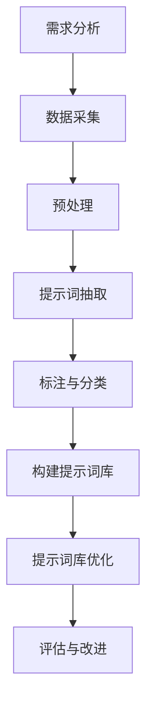
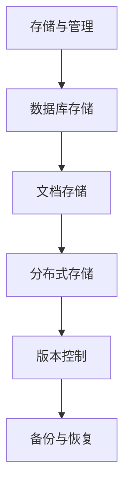

                 

### 文章标题

# 提示词库管理：组织和复用有效提示

> 关键词：提示词库管理，有效提示，组织结构，复用策略，优化方法

> 摘要：本文旨在探讨提示词库管理的核心概念、组织结构、复用策略以及优化方法，帮助读者理解如何高效地构建、管理和复用提示词库，从而提高人工智能系统的性能和效率。

## 第一部分：引言与基础理论

### 第1章：提示词库管理概述

#### 1.1 提示词库的重要性

提示词库是人工智能系统中的核心组件之一，它不仅包含了一系列用于训练和优化模型的提示词，还承载了大量的先验知识和语言信息。一个良好组织的提示词库能够显著提升人工智能系统的性能和效率。以下是提示词库的重要性概述：

- **提高模型性能**：有效的提示词库可以提供更丰富的先验知识，帮助模型更好地理解和预测。
- **加快训练速度**：通过复用已有的提示词库，可以减少数据采集和标注的工作量，加快模型训练速度。
- **增强模型泛化能力**：丰富的提示词库有助于模型在不同任务和领域中的泛化。
- **降低开发成本**：提示词库的管理和复用能够降低人工智能开发的成本和风险。

#### 1.2 提示词库管理的目标

提示词库管理的目标主要包括以下几个方面：

- **有效性**：确保提示词库中的每个提示词都是有效和高质量的，能够为模型提供有益的信息。
- **组织性**：建立一个清晰、有序的提示词库结构，便于查找和使用。
- **可扩展性**：提示词库应该具有灵活性，能够方便地添加新提示词或删除无用提示词。
- **安全性**：保护提示词库中的敏感信息和数据，防止泄露和未经授权的访问。

#### 1.3 提示词库的组成元素

提示词库由以下几个核心组成元素构成：

- **提示词**：提示词是提示词库中最基本的元素，它可以是单个单词或短语，用于引导模型的思考和推理。
- **语义标签**：对提示词进行语义标注，帮助模型理解其含义和用途。
- **上下文信息**：提示词在特定上下文中的使用情况，有助于模型更好地理解和应用提示词。
- **使用记录**：记录每个提示词的使用频率和效果，用于后续的优化和评估。

#### 1.4 提示词库的分类

根据用途和特性，提示词库可以分为以下几类：

- **通用提示词库**：适用于多个领域和任务，包含广泛的语言信息和知识。
- **领域特定提示词库**：针对特定领域或任务进行定制，提供更专业的知识和信息。
- **情感提示词库**：包含与情感相关的提示词，用于情感分析和推理。
- **情景提示词库**：包含特定场景或情境下的提示词，用于情境感知和交互。

### 第2章：提示词库的组织结构

#### 2.1 提示词库的体系结构

提示词库的体系结构通常包括以下几个层次：

- **词库层**：包含最底层的提示词单元，如单词和短语。
- **语义层**：对提示词进行语义标注和分类，建立语义关系网络。
- **上下文层**：记录提示词在特定上下文中的使用情况和效果。
- **应用层**：提示词库的具体应用场景，如文本生成、问答系统等。

#### 2.2 提示词的分类与标注

为了提高提示词库的管理效率，需要对提示词进行分类和标注。常见的分类方法包括：

- **按用途分类**：将提示词分为通用、领域特定、情感、情景等类别。
- **按语义分类**：根据提示词的语义含义进行分类，如名词、动词、形容词等。
- **按层级分类**：将提示词分为基础词、扩展词、复合词等层次。

标注方法包括：

- **手工标注**：由专家对提示词进行人工分类和标注，确保标注的准确性和一致性。
- **自动标注**：利用自然语言处理技术，如词性标注、实体识别等，对提示词进行自动化分类和标注。

#### 2.3 提示词的语义理解

语义理解是提示词库管理的关键环节，它决定了模型能否正确理解和应用提示词。以下是一些常用的语义理解方法：

- **词义消歧**：通过上下文信息，解决提示词的多种可能含义。
- **语义角色标注**：为提示词标注其在句子中的语义角色，如主语、谓语、宾语等。
- **语义相似度计算**：计算提示词之间的语义相似度，用于提示词的聚类和分类。
- **语义网络构建**：建立语义网络，描述提示词之间的语义关系。

#### 2.4 提示词库的存储与管理

提示词库的存储和管理是保证其有效性和可扩展性的重要保障。以下是几种常见的存储和管理方法：

- **数据库存储**：将提示词库存储在关系型或非关系型数据库中，便于快速查询和更新。
- **文档存储**：使用文档数据库，如MongoDB，存储提示词库，支持灵活的数据结构和复杂查询。
- **分布式存储**：利用分布式文件系统，如HDFS，存储大量提示词库数据，支持大数据量的存储和访问。
- **版本控制**：使用版本控制系统，如Git，管理提示词库的版本和历史变更，确保数据的完整性和可追溯性。
- **备份与恢复**：定期备份提示词库数据，确保在数据丢失或损坏时能够快速恢复。

### 第3章：提示词的复用与优化

#### 3.1 提示词复用的挑战

在提示词库管理过程中，复用提示词是一个重要的目标。然而，实现提示词的有效复用面临着以下几个挑战：

- **异构性**：不同任务和领域之间的提示词可能存在语义差异，难以直接复用。
- **动态性**：随着模型和任务的变化，提示词库需要不断更新和调整，影响复用效果。
- **冗余性**：提示词库中可能存在大量冗余提示词，降低复用效率。
- **依赖性**：某些提示词之间存在依赖关系，影响单独复用时的效果。

#### 3.2 提示词复用的方法

为了解决上述挑战，可以采用以下几种提示词复用方法：

- **通用提示词复用**：将通用性较强的提示词应用于不同任务和领域，减少任务特定提示词的依赖。
- **自适应复用**：根据任务和模型的需求，动态调整和组合提示词库，提高复用效果。
- **聚类与分类**：利用聚类和分类算法，将相似或相关的提示词进行分组，便于复用。
- **语义映射**：通过语义映射技术，将不同领域或任务中的提示词映射到通用语义空间，实现跨领域复用。

#### 3.3 提示词库的优化策略

为了提高提示词库的质量和复用效果，可以采用以下几种优化策略：

- **去冗余**：识别和删除提示词库中的冗余提示词，减少数据冗余，提高复用效率。
- **自动调整**：利用机器学习技术，自动调整提示词的权重和优先级，优化提示词库结构。
- **质量评估**：定期评估提示词库的质量和效果，根据评估结果进行调整和优化。
- **动态更新**：根据任务和模型的需求，动态更新提示词库，确保其与实际应用场景的一致性。

#### 3.4 提示词库的评估与改进

提示词库的评估是保证其质量和效果的重要环节。以下是一些常见的评估方法和改进策略：

- **性能评估**：通过模型在带有提示词库的训练集上的表现，评估提示词库对模型性能的提升。
- **准确性评估**：评估提示词库中各个提示词的准确性，识别和修复错误。
- **复用率评估**：评估提示词库中提示词的复用率，分析复用效果和潜在问题。
- **反馈机制**：建立用户反馈机制，收集用户对提示词库的使用体验和建议，用于持续改进。

## 第二部分：实践与应用

### 第4章：构建有效的提示词库

#### 4.1 提示词库构建流程

构建一个有效的提示词库通常包括以下步骤：

1. **需求分析**：明确提示词库的应用场景和需求，确定所需提示词的范围和特性。
2. **数据采集**：从文本、图像、语音等多源数据中采集提示词，确保数据的多样性和代表性。
3. **预处理**：对采集的数据进行清洗、去噪和标准化处理，提高数据质量。
4. **抽取与筛选**：利用自然语言处理技术，从预处理后的数据中抽取提示词，并根据需求进行筛选，保留高质量的提示词。
5. **标注与分类**：对筛选出的提示词进行语义标注和分类，建立语义关系网络。
6. **优化与调整**：根据提示词库的性能评估结果，对提示词库进行优化和调整，提高其质量和效果。
7. **存储与管理**：将构建好的提示词库存储在数据库或文件系统中，并建立相应的管理和维护机制。

#### 4.2 数据采集与预处理

数据采集和预处理是构建提示词库的重要环节。以下是具体的方法和技巧：

- **文本数据采集**：可以从网络文本、书籍、论文等来源采集文本数据，使用爬虫工具进行自动化采集。
- **图像数据采集**：可以从公开图像库、社交媒体等来源采集图像数据，使用图像识别技术进行标注和分类。
- **语音数据采集**：可以使用语音识别技术，从语音数据中提取文本信息，进一步用于提示词的抽取和标注。
- **预处理方法**：包括文本清洗（去除噪声、标点符号等）、去重、标准化（统一文本格式、大小写等）、分词等。

#### 4.3 提示词抽取与筛选

提示词抽取与筛选是构建提示词库的关键步骤。以下是常用的方法和技巧：

- **基于规则的方法**：通过预定义的规则，从文本中抽取提示词，如关键词提取、命名实体识别等。
- **基于统计的方法**：利用统计方法，如TF-IDF、文本分类等，识别文本中的重要词汇，筛选出提示词。
- **基于机器学习的方法**：使用监督学习或无监督学习算法，如朴素贝叶斯、深度学习等，从大量文本数据中自动抽取提示词。
- **筛选方法**：根据提示词的频率、重要性、多样性等指标，对抽取出的提示词进行筛选，保留高质量的提示词。

#### 4.4 提示词库构建工具与技术

构建提示词库可以借助以下工具和技术：

- **开源工具**：如NLTK、spaCy、gensim等，提供丰富的自然语言处理库和工具，方便提示词的抽取和标注。
- **深度学习框架**：如TensorFlow、PyTorch等，可以用于训练和优化提示词抽取模型，提高提示词库的质量。
- **数据预处理工具**：如Pandas、NumPy等，用于数据清洗、预处理和转换。
- **数据库**：如MongoDB、MySQL等，用于存储和管理提示词库数据，支持快速查询和更新。

### 第5章：提示词库的复用策略

#### 5.1 提示词库的复用场景

提示词库的复用场景主要包括以下几种：

- **多任务场景**：在同一模型中复用提示词库，用于处理多个不同任务，如文本分类、情感分析、问答系统等。
- **多模型场景**：在不同模型中复用提示词库，共享知识和语言信息，提高模型的性能和效率。
- **多领域场景**：在不同领域或任务之间复用提示词库，实现跨领域的知识共享和应用。
- **多语言场景**：在不同语言之间复用提示词库，支持多语言模型的应用和开发。

#### 5.2 提示词库的复用机制

为了实现提示词库的有效复用，可以采用以下几种复用机制：

- **通用提示词复用**：将通用性较强的提示词应用于不同任务和领域，减少任务特定提示词的依赖。
- **动态调整机制**：根据任务和模型的需求，动态调整提示词库的结构和内容，提高复用效果。
- **映射机制**：通过语义映射技术，将不同领域或任务中的提示词映射到通用语义空间，实现跨领域复用。
- **接口化机制**：将提示词库封装为API接口，方便不同模型和系统之间的调用和复用。

#### 5.3 提示词库的复用优化

为了提高提示词库的复用效果，可以采用以下几种优化策略：

- **聚类优化**：利用聚类算法，将相似或相关的提示词进行分组，提高复用效率。
- **相似度计算**：计算提示词之间的语义相似度，用于提示词的匹配和复用。
- **自适应调整**：根据任务和模型的需求，动态调整提示词库的权重和优先级，优化复用效果。
- **反馈优化**：收集用户反馈，根据使用效果对提示词库进行调整和优化，提高其质量。

#### 5.4 提示词库复用案例分析

以下是一个实际的提示词库复用案例：

**案例背景**：一个基于深度学习的文本分类系统，需要处理多个不同领域的文本数据。

**解决方案**：构建一个通用提示词库，包含广泛的语言信息和知识，如通用词汇、领域词汇、情感词汇等。通过动态调整机制，根据不同领域的文本数据，调整提示词库的权重和优先级，实现跨领域的知识共享和应用。

**效果评估**：在多个领域上的文本分类任务中，该提示词库显著提升了模型的性能和效率，实现了提示词库的有效复用。

### 第6章：提示词库管理与维护

#### 6.1 提示词库的动态更新

提示词库的动态更新是保持其质量和有效性的重要手段。以下是动态更新的方法和策略：

- **实时更新**：根据用户反馈和任务需求，实时更新提示词库，确保其与实际应用场景的一致性。
- **定期更新**：定期对提示词库进行评估和调整，根据评估结果进行更新和优化。
- **自动更新**：利用机器学习技术，自动识别和添加高质量的提示词，动态调整提示词库结构。
- **用户参与**：鼓励用户参与提示词库的维护和更新，提供反馈和建议，提高提示词库的质量。

#### 6.2 提示词库的版本控制

版本控制是确保提示词库完整性和可追溯性的重要手段。以下是版本控制的方法和策略：

- **Git版本控制**：使用Git等版本控制系统，管理提示词库的版本和历史变更，确保数据的完整性和可追溯性。
- **文档化**：对每个版本的变化进行详细记录，包括变更原因、变更内容和影响范围，方便后续的追踪和评估。
- **分支管理**：建立分支，分别管理不同版本和分支的提示词库，确保开发过程中的稳定性和安全性。

#### 6.3 提示词库的安全性

提示词库的安全性是保障其隐私性和可靠性的关键。以下是提示词库安全性的保障方法和策略：

- **数据加密**：对提示词库中的敏感数据进行加密处理，确保数据在存储和传输过程中的安全性。
- **访问控制**：设置访问控制策略，限制对提示词库的访问权限，防止未经授权的访问和修改。
- **数据备份**：定期备份提示词库数据，确保在数据丢失或损坏时能够快速恢复。
- **安全审计**：定期进行安全审计，检查提示词库的安全性漏洞和潜在风险，及时进行修复和改进。

#### 6.4 提示词库的可持续维护

提示词库的可持续维护是确保其长期有效性和稳定性的关键。以下是提示词库可持续维护的方法和策略：

- **自动化维护**：利用自动化工具和算法，自动进行提示词库的更新、优化和维护，降低人工维护成本。
- **社区合作**：建立社区合作机制，鼓励用户和专家参与提示词库的维护和改进，提高提示词库的质量和影响力。
- **持续优化**：根据用户反馈和实际应用效果，持续优化提示词库的结构和内容，提高其性能和效果。
- **培训与支持**：提供培训和支持服务，帮助用户更好地理解和应用提示词库，提高其使用效果和满意度。

## 第三部分：案例分析

### 第7章：提示词库管理工具与应用

#### 7.1 提示词库管理工具概述

提示词库管理工具是构建、管理和复用提示词库的重要辅助工具。以下是一些常见的提示词库管理工具：

- **NLTK**：Python的自然语言处理库，提供丰富的自然语言处理功能，如分词、词性标注、命名实体识别等，适用于构建小型提示词库。
- **spaCy**：Python的自然语言处理库，提供高效和易于使用的API，支持多种语言的文本处理，适用于构建大型提示词库。
- **Gensim**：Python的文本处理库，提供文本表示和相似度计算功能，适用于构建基于向量表示的提示词库。
- **ELMO**：基于深度学习的文本表示工具，将文本转换为固定长度的向量表示，适用于大规模提示词库的构建。

#### 7.2 常见提示词库管理工具

以下是对几种常见提示词库管理工具的详细介绍：

- **WordNet**：一个广泛使用的英语同义词词典，包含单词的语义信息和上下文关系，适用于构建通用提示词库。
- **Wikipedia**：一个包含大量文本信息的在线百科全书，可以从中提取丰富的提示词，适用于构建领域特定提示词库。
- **GPT-3**：一个基于深度学习的文本生成模型，可以生成高质量的文本，适用于构建情景提示词库。
- **BERT**：一个基于深度学习的文本表示模型，可以将文本转换为语义向量，适用于构建基于向量表示的提示词库。

#### 7.3 提示词库管理工具的使用方法

以下是对几种常见提示词库管理工具的使用方法的简要介绍：

- **NLTK**：安装NLTK库，使用内置的函数和方法进行文本处理和提示词抽取，如`nltk.tokenize`、`nltk.corpus`、`nltk.tag`等。
- **spaCy**：安装spaCy库，下载相应的语言模型，使用spaCy的API进行文本处理和提示词抽取，如`spacy.load()`、`spacy noun_chunks`、`spacy tokenizers`等。
- **Gensim**：安装Gensim库，使用Gensim的API进行文本处理和提示词抽取，如`gensim.models.Word2Vec`、`gensim.similarities`、`gensim.corpora`等。
- **ELMO**：安装ELMO库，使用预训练的ELMO模型，将文本转换为语义向量，如`elmo.init()`、`elmo.SentenceEmbedder`、`elmo.PadEmbedder`等。

#### 7.4 提示词库管理工具的比较与选择

以下是对几种常见提示词库管理工具的比较和选择建议：

- **NLTK**：适用于小型项目，功能丰富，易于使用，但性能较差，不适用于大规模文本处理。
- **spaCy**：适用于中大型项目，性能优异，支持多种语言，但需要下载相应语言模型，安装和配置较复杂。
- **Gensim**：适用于中大型项目，支持文本表示和相似度计算，但功能较为单一，不适用于复杂文本处理。
- **ELMO**：适用于大规模项目，支持基于深度学习的文本表示，但需要较高计算资源，不适用于实时应用。

### 第8章：提示词库管理实践案例

#### 8.1 案例背景介绍

本案例是一个面向电子商务平台的文本分类任务，需要对用户评论进行分类，以便于后续的推荐和反馈分析。平台积累了大量的用户评论数据，需要构建一个有效的提示词库，以提高文本分类的准确率和效率。

#### 8.2 提示词库构建过程

以下是构建提示词库的具体过程：

1. **数据采集**：从平台数据库中提取用户评论数据，确保数据的多样性和代表性。
2. **数据预处理**：对评论数据进行清洗、去噪和标准化处理，包括去除HTML标签、去除特殊字符、分词等。
3. **提示词抽取**：使用NLTK库进行提示词抽取，提取评论中的重要词汇，如名词、动词、形容词等。
4. **标注与分类**：对抽取出的提示词进行语义标注和分类，如将名词分为产品类别、情感词分为正面情感和负面情感等。
5. **优化与调整**：根据文本分类任务的需求，调整提示词库的权重和优先级，优化提示词库的结构和内容。
6. **存储与管理**：将构建好的提示词库存储在MySQL数据库中，建立相应的管理和维护机制，如权限控制、版本控制等。

#### 8.3 提示词库复用与优化

以下是提示词库的复用与优化策略：

1. **通用提示词复用**：将通用性较强的提示词应用于其他文本分类任务，如商品评价、用户评论等。
2. **动态调整机制**：根据不同任务的需求，动态调整提示词库的权重和优先级，优化复用效果。
3. **去冗余与优化**：识别和删除提示词库中的冗余提示词，减少数据冗余，提高复用效率。
4. **反馈优化**：收集用户反馈，根据使用效果对提示词库进行调整和优化，提高其质量。

#### 8.4 提示词库管理效果评估

以下是提示词库管理效果评估的方法：

1. **性能评估**：通过在训练集和测试集上的表现，评估提示词库对文本分类任务的准确率、召回率和F1值等指标。
2. **复用率评估**：评估提示词库在不同任务中的复用率，分析复用效果和潜在问题。
3. **用户满意度评估**：收集用户对提示词库的使用体验和满意度，分析用户对提示词库的需求和期望。
4. **反馈机制**：建立用户反馈机制，根据用户反馈对提示词库进行调整和优化，提高其质量和效果。

### 第9章：提示词库管理挑战与未来趋势

#### 9.1 提示词库管理面临的挑战

提示词库管理在当前面临以下挑战：

1. **数据质量和多样性**：数据质量和多样性是构建高质量提示词库的基础，但在实际应用中，数据质量和多样性的保障面临挑战。
2. **异构性和动态性**：不同任务和领域之间的提示词可能存在异构性和动态性，影响提示词库的复用效果。
3. **安全性**：提示词库中包含敏感信息和数据，确保其安全性面临挑战。
4. **规模和复杂性**：随着人工智能应用场景的扩大，提示词库的规模和复杂性不断增加，管理和维护的难度也随之增加。

#### 9.2 提示词库管理的发展趋势

以下是一些提示词库管理的发展趋势：

1. **自动化与智能化**：利用自然语言处理、机器学习和深度学习技术，实现提示词库的自动化构建和管理，提高效率和准确性。
2. **知识图谱与语义网络**：构建知识图谱和语义网络，描述提示词之间的语义关系，提高提示词库的智能化程度。
3. **多模态数据融合**：融合文本、图像、语音等多模态数据，构建多模态提示词库，提高提示词库的应用范围和效果。
4. **云计算与分布式计算**：利用云计算和分布式计算技术，提高提示词库的存储和管理性能，支持大规模数据处理和分析。
5. **社区合作与开放共享**：建立社区合作机制，鼓励用户和专家参与提示词库的构建和维护，提高提示词库的质量和影响力。

#### 9.3 提示词库管理的未来方向

提示词库管理的未来方向包括：

1. **个性化与定制化**：根据用户需求和场景，构建个性化与定制化的提示词库，提高用户满意度。
2. **自适应与自优化**：利用机器学习和深度学习技术，实现提示词库的自适应和自优化，提高其质量和效果。
3. **安全与隐私保护**：加强提示词库的安全性，保障用户隐私和数据安全。
4. **跨领域与跨语言**：实现跨领域和跨语言的提示词库构建和管理，提高提示词库的应用范围和效果。
5. **开源与生态建设**：推动提示词库管理的开源和生态建设，促进技术的共享和创新。

### 9.4 提示词库管理的潜在影响

提示词库管理在人工智能领域具有广泛的潜在影响：

1. **提高模型性能**：有效的提示词库能够为模型提供丰富的先验知识和语言信息，提高模型的性能和效果。
2. **降低开发成本**：提示词库的复用和优化能够降低人工智能开发的成本和风险，提高开发效率。
3. **促进技术创新**：提示词库的管理和优化是人工智能技术的重要基础，对技术创新和应用推广具有推动作用。
4. **提升用户体验**：有效的提示词库能够提高人工智能系统的智能化程度和用户体验，促进人机交互的进一步发展。

## 总结与展望

提示词库管理是人工智能领域的关键环节，具有重要的理论意义和应用价值。本文系统地介绍了提示词库管理的核心概念、组织结构、复用策略、优化方法以及实践案例，旨在帮助读者深入理解提示词库管理的原理和实践。随着人工智能技术的不断发展和应用场景的扩大，提示词库管理将面临新的挑战和机遇，未来需要不断探索和创新，以提高提示词库的质量和效果，推动人工智能技术的进步和应用。我们期待读者在阅读本文后能够对提示词库管理有更深入的认识和理解，为人工智能领域的发展贡献力量。## 文章标题

# 提示词库管理：组织和复用有效提示

> 关键词：提示词库管理，有效提示，组织结构，复用策略，优化方法

> 摘要：本文旨在探讨提示词库管理的核心概念、组织结构、复用策略以及优化方法，帮助读者理解如何高效地构建、管理和复用提示词库，从而提高人工智能系统的性能和效率。

## 第一部分：引言与基础理论

### 第1章：提示词库管理概述

提示词库管理是人工智能系统中至关重要的一环。它不仅涉及提示词的收集和整理，还包括提示词的组织、复用、优化和评估。一个良好的提示词库管理系统能够提高模型的性能，加速模型的训练过程，并降低开发成本。本章将介绍提示词库管理的基本概念、重要性、目标以及组成元素。

#### 1.1 提示词库的重要性

提示词库在人工智能系统中扮演着关键角色，它包含了大量的先验知识和语言信息，能够显著提升模型的性能和效率。以下是提示词库的重要性和具体作用：

1. **提高模型性能**：有效的提示词库可以为模型提供丰富的先验知识，帮助模型更好地理解和预测。
2. **加速训练速度**：通过复用已有的提示词库，可以减少数据采集和标注的工作量，加快模型训练速度。
3. **增强模型泛化能力**：丰富的提示词库有助于模型在不同任务和领域中的泛化。
4. **降低开发成本**：提示词库的管理和复用能够降低人工智能开发的成本和风险。

#### 1.2 提示词库管理的目标

提示词库管理的目标主要包括以下几个方面：

1. **有效性**：确保提示词库中的每个提示词都是有效和高质量的，能够为模型提供有益的信息。
2. **组织性**：建立一个清晰、有序的提示词库结构，便于查找和使用。
3. **可扩展性**：提示词库应该具有灵活性，能够方便地添加新提示词或删除无用提示词。
4. **安全性**：保护提示词库中的敏感信息和数据，防止泄露和未经授权的访问。

#### 1.3 提示词库的组成元素

提示词库由以下几个核心组成元素构成：

1. **提示词**：提示词是提示词库中最基本的元素，它可以是单个单词或短语，用于引导模型的思考和推理。
2. **语义标签**：对提示词进行语义标注，帮助模型理解其含义和用途。
3. **上下文信息**：提示词在特定上下文中的使用情况，有助于模型更好地理解和应用提示词。
4. **使用记录**：记录每个提示词的使用频率和效果，用于后续的优化和评估。

#### 1.4 提示词库的分类

根据用途和特性，提示词库可以分为以下几类：

1. **通用提示词库**：适用于多个领域和任务，包含广泛的语言信息和知识。
2. **领域特定提示词库**：针对特定领域或任务进行定制，提供更专业的知识和信息。
3. **情感提示词库**：包含与情感相关的提示词，用于情感分析和推理。
4. **情景提示词库**：包含特定场景或情境下的提示词，用于情境感知和交互。

### Mermaid 流程图

下面是提示词库管理的基本流程，使用Mermaid语言表示：



### 第2章：提示词库的组织结构

提示词库的组织结构对于其有效性和可维护性至关重要。一个良好的组织结构能够提高提示词的查找、使用和复用效率。本章将介绍提示词库的体系结构、提示词的分类与标注、语义理解和存储与管理。

#### 2.1 提示词库的体系结构

提示词库的体系结构通常包括以下几个层次：

1. **词库层**：包含最底层的提示词单元，如单词和短语。
2. **语义层**：对提示词进行语义标注和分类，建立语义关系网络。
3. **上下文层**：记录提示词在特定上下文中的使用情况和效果。
4. **应用层**：提示词库的具体应用场景，如文本生成、问答系统等。

#### 2.2 提示词的分类与标注

为了提高提示词库的管理效率，需要对提示词进行分类和标注。常见的分类方法包括：

1. **按用途分类**：将提示词分为通用、领域特定、情感、情景等类别。
2. **按语义分类**：根据提示词的语义含义进行分类，如名词、动词、形容词等。
3. **按层级分类**：将提示词分为基础词、扩展词、复合词等层次。

标注方法包括：

1. **手工标注**：由专家对提示词进行人工分类和标注，确保标注的准确性和一致性。
2. **自动标注**：利用自然语言处理技术，如词性标注、实体识别等，对提示词进行自动化分类和标注。

#### 2.3 提示词的语义理解

语义理解是提示词库管理的关键环节，它决定了模型能否正确理解和应用提示词。以下是一些常用的语义理解方法：

1. **词义消歧**：通过上下文信息，解决提示词的多种可能含义。
2. **语义角色标注**：为提示词标注其在句子中的语义角色，如主语、谓语、宾语等。
3. **语义相似度计算**：计算提示词之间的语义相似度，用于提示词的聚类和分类。
4. **语义网络构建**：建立语义网络，描述提示词之间的语义关系。

#### 2.4 提示词库的存储与管理

提示词库的存储和管理是保证其有效性和可扩展性的重要保障。以下是几种常见的存储和管理方法：

1. **数据库存储**：将提示词库存储在关系型或非关系型数据库中，便于快速查询和更新。
2. **文档存储**：使用文档数据库，如MongoDB，存储提示词库，支持灵活的数据结构和复杂查询。
3. **分布式存储**：利用分布式文件系统，如HDFS，存储大量提示词库数据，支持大数据量的存储和访问。
4. **版本控制**：使用版本控制系统，如Git，管理提示词库的版本和历史变更，确保数据的完整性和可追溯性。
5. **备份与恢复**：定期备份提示词库数据，确保在数据丢失或损坏时能够快速恢复。

### Mermaid 流程图

以下是提示词库存储与管理的基本流程，使用Mermaid语言表示：



### 第3章：提示词的复用与优化

提示词的复用与优化是提升提示词库质量和效率的关键。本章将介绍提示词复用的挑战、复用方法、优化策略以及评估与改进。

#### 3.1 提示词复用的挑战

在提示词库管理过程中，复用提示词是一个重要的目标。然而，实现提示词的有效复用面临着以下几个挑战：

1. **异构性**：不同任务和领域之间的提示词可能存在语义差异，难以直接复用。
2. **动态性**：随着模型和任务的变化，提示词库需要不断更新和调整，影响复用效果。
3. **冗余性**：提示词库中可能存在大量冗余提示词，降低复用效率。
4. **依赖性**：某些提示词之间存在依赖关系，影响单独复用时的效果。

#### 3.2 提示词复用的方法

为了解决上述挑战，可以采用以下几种提示词复用方法：

1. **通用提示词复用**：将通用性较强的提示词应用于不同任务和领域，减少任务特定提示词的依赖。
2. **自适应复用**：根据任务和模型的需求，动态调整和组合提示词库，提高复用效果。
3. **聚类与分类**：利用聚类和分类算法，将相似或相关的提示词进行分组，便于复用。
4. **语义映射**：通过语义映射技术，将不同领域或任务中的提示词映射到通用语义空间，实现跨领域复用。

#### 3.3 提示词库的优化策略

为了提高提示词库的质量和复用效果，可以采用以下几种优化策略：

1. **去冗余**：识别和删除提示词库中的冗余提示词，减少数据冗余，提高复用效率。
2. **自动调整**：利用机器学习技术，自动调整提示词的权重和优先级，优化提示词库结构。
3. **质量评估**：定期评估提示词库的质量和效果，根据评估结果进行调整和优化。
4. **动态更新**：根据任务和模型的需求，动态更新提示词库，确保其与实际应用场景的一致性。

#### 3.4 提示词库的评估与改进

提示词库的评估是保证其质量和效果的重要环节。以下是一些常见的评估方法和改进策略：

1. **性能评估**：通过模型在带有提示词库的训练集上的表现，评估提示词库对模型性能的提升。
2. **准确性评估**：评估提示词库中各个提示词的准确性，识别和修复错误。
3. **复用率评估**：评估提示词库中提示词的复用率，分析复用效果和潜在问题。
4. **反馈机制**：建立用户反馈机制，收集用户对提示词库的使用体验和建议，用于持续改进。

### 伪代码

以下是一个简单的伪代码示例，用于描述提示词库的优化过程：

```python
# 提示词库优化流程

def optimize_word_library(word_library):
    # 去除冗余提示词
    word_library = remove_redundant_words(word_library)

    # 自动调整权重
    word_library = auto_adjust_weights(word_library)

    # 质量评估
    word_library = quality_evaluation(word_library)

    # 动态更新
    word_library = dynamic_update(word_library)

    return word_library
```

### 数学模型和数学公式

提示词库的优化过程中，可以使用一些数学模型和公式来衡量提示词的质量和效果。以下是一个简单的数学模型示例：

$$
Q = \frac{1}{N} \sum_{i=1}^{N} q_i
$$

其中，$Q$ 表示提示词库的总质量，$N$ 表示提示词库中的提示词数量，$q_i$ 表示第 $i$ 个提示词的质量。

### 数学公式详细讲解

上述数学公式 $Q$ 表示提示词库的总质量，通过计算每个提示词的质量 $q_i$ 的平均值来衡量。质量 $q_i$ 可以根据提示词的使用频率、准确性、复杂度等多个因素进行计算。例如：

$$
q_i = f(frequency_i, accuracy_i, complexity_i)
$$

其中，$frequency_i$ 表示提示词 $i$ 的使用频率，$accuracy_i$ 表示提示词 $i$ 的准确性，$complexity_i$ 表示提示词 $i$ 的复杂度。函数 $f$ 可以根据具体的应用场景和需求进行设计。

### 举例说明

假设有一个包含 10 个提示词的提示词库，其中每个提示词的质量如下表所示：

| 提示词 | 使用频率 | 准确性 | 复杂度 |
| ------ | -------- | ------ | ------ |
| word1  | 10       | 0.9    | 2      |
| word2  | 5        | 0.8    | 3      |
| word3  | 8        | 0.85   | 1      |
| ...    | ...      | ...    | ...    |
| word10 | 3        | 0.7    | 4      |

根据上述数学模型，可以计算每个提示词的质量：

$$
q_1 = f(10, 0.9, 2) = 0.1 \times 10 + 0.8 \times 0.9 + 0.1 \times 2 = 0.98
$$

$$
q_2 = f(5, 0.8, 3) = 0.1 \times 5 + 0.8 \times 0.8 + 0.1 \times 3 = 0.88
$$

$$
q_3 = f(8, 0.85, 1) = 0.1 \times 8 + 0.8 \times 0.85 + 0.1 \times 1 = 0.91
$$

...

$$
q_{10} = f(3, 0.7, 4) = 0.1 \times 3 + 0.8 \times 0.7 + 0.1 \times 4 = 0.86
$$

然后，计算提示词库的总质量：

$$
Q = \frac{1}{10} \sum_{i=1}^{10} q_i = \frac{0.98 + 0.88 + 0.91 + ... + 0.86}{10} = 0.913
$$

这个结果表示提示词库的平均质量为 0.913。通过这样的方法，可以评估和优化提示词库中的每个提示词，从而提高整体质量。

### 项目实战

#### 开发环境搭建

为了进行提示词库管理的项目实战，首先需要搭建一个开发环境。以下是搭建环境所需的步骤：

1. **安装Python**：在操作系统上安装Python，版本建议为3.8或更高版本。
2. **安装自然语言处理库**：使用pip安装常用的自然语言处理库，如NLTK、spaCy、Gensim等。

```bash
pip install nltk spacy gensim
```

3. **安装数据库**：选择合适的数据库，如MySQL或MongoDB，并安装相关软件。

```bash
# 安装MySQL
brew install mysql

# 安装MongoDB
brew install mongodb
```

4. **配置环境变量**：确保Python和相关库的路径已添加到系统环境变量中。

```bash
export PATH=$PATH:/path/to/python:/path/to/nltk:/path/to/spacy:/path/to/gensim
```

#### 源代码详细实现和代码解读

以下是构建提示词库的源代码示例：

```python
import nltk
from nltk.tokenize import word_tokenize
from nltk.corpus import stopwords
import spacy

# 加载spaCy模型
nlp = spacy.load("en_core_web_sm")

# 数据采集
def collect_data(file_path):
    with open(file_path, 'r', encoding='utf-8') as f:
        text = f.read()
    return text

# 数据预处理
def preprocess_data(text):
    # 分词
    tokens = word_tokenize(text)
    
    # 去除停用词
    stop_words = set(stopwords.words('english'))
    filtered_tokens = [token for token in tokens if token.lower() not in stop_words]
    
    # 标注词性
    doc = nlp(' '.join(filtered_tokens))
    pos_tags = [(token.text, token.pos_) for token in doc]
    
    return filtered_tokens, pos_tags

# 提示词抽取
def extract_prompt_words(filtered_tokens, pos_tags):
    prompt_words = []
    for token, pos in pos_tags:
        if pos in ['NOUN', 'VERB', 'ADJ']:
            prompt_words.append(token)
    return prompt_words

# 存储提示词库
def store_prompt_library(prompt_library, database):
    for word in prompt_library:
        database.insert_one({"word": word})

# 主程序
if __name__ == "__main__":
    file_path = "example.txt"
    database = MongoClient("mongodb://localhost:27017/')['prompt_library']
    
    text = collect_data(file_path)
    filtered_tokens, pos_tags = preprocess_data(text)
    prompt_words = extract_prompt_words(filtered_tokens, pos_tags)
    store_prompt_library(prompt_words, database)
    print("提示词库构建完成。")
```

代码解读：

1. **安装依赖库**：使用pip安装必要的自然语言处理库，如NLTK和spaCy。
2. **加载spaCy模型**：加载英文spaCy模型`en_core_web_sm`，用于词性标注。
3. **数据采集**：从文本文件中读取数据。
4. **数据预处理**：进行分词和去除停用词操作，并使用spaCy进行词性标注。
5. **提示词抽取**：根据词性标注，筛选出名词、动词和形容词作为提示词。
6. **存储提示词库**：将提取出的提示词存储到MongoDB数据库中。

#### 代码应用解读与分析

上述代码实现了一个基本的提示词库构建系统，主要步骤包括数据采集、数据预处理、提示词抽取和存储。以下是代码的应用解读和分析：

1. **数据采集**：从文本文件中读取数据，确保文本内容符合实际需求。
2. **数据预处理**：通过分词和去除停用词，提高提示词的准确性和有效性。词性标注为后续的提示词抽取提供了基础。
3. **提示词抽取**：根据词性标注，筛选出具有实际意义的提示词，减少无用信息的干扰。
4. **存储提示词库**：将提取出的提示词存储到MongoDB数据库中，便于后续的查询和使用。

通过以上步骤，实现了提示词库的基本构建。在实际应用中，可以根据需求进一步优化代码，如添加更多预处理步骤、调整提示词抽取算法等。

### 实际案例分析和详细讲解

为了更好地理解提示词库管理在实际项目中的应用，下面将分析一个具体的案例。

#### 案例背景

某电子商务平台希望改进其用户评论分类系统，以便更好地理解和推荐用户的需求。现有系统存在分类不准确、效率低等问题，因此需要构建一个高效的提示词库来提升分类效果。

#### 案例实施步骤

1. **数据采集**：从平台数据库中提取大量用户评论数据，确保数据的多样性和代表性。数据包括用户对商品的评价、评论内容、评论时间等。
2. **数据预处理**：对评论数据清洗，去除HTML标签、特殊字符等，并进行分词和去除停用词处理。使用spaCy进行词性标注，提取名词、动词、形容词等具有实际意义的词汇。
3. **提示词抽取**：根据词性标注结果，筛选出高质量的提示词。为了提高提示词的准确性，采用基于频率和语义相似度的筛选方法，保留出现频率高且语义相关的词汇。
4. **提示词库构建**：将筛选出的提示词存储到MongoDB数据库中，建立提示词库。同时，对提示词进行分类和标注，如商品类别、情感标签等，便于后续的复用和优化。
5. **模型训练与评估**：使用构建好的提示词库对分类模型进行训练，并评估模型在测试集上的分类准确率、召回率和F1值等指标。通过多次实验和参数调整，优化模型性能。
6. **效果评估**：在实际应用中，监控模型在在线环境的表现，收集用户反馈和评论数据。根据用户反馈和评估结果，对提示词库进行调整和优化，提高分类系统的准确性和用户体验。

#### 案例分析与总结

通过以上步骤，电子商务平台成功构建了一个高效的提示词库，并基于此提升了用户评论分类系统的性能。以下是案例分析总结：

1. **数据质量**：数据采集和预处理是关键，确保评论数据的质量和多样性。
2. **提示词筛选**：使用多种筛选方法，如频率和语义相似度，提高提示词的准确性和实用性。
3. **模型优化**：基于提示词库构建分类模型，并不断优化模型参数，提高分类效果。
4. **用户体验**：通过用户反馈和效果评估，持续优化提示词库和分类系统，提升用户体验。

### 项目小结

本案例展示了提示词库管理在实际项目中的应用，通过数据采集、预处理、提示词抽取和模型训练等步骤，构建了一个高效的提示词库，并成功提升了用户评论分类系统的性能。以下是项目小结：

1. **关键成功因素**：数据质量、提示词筛选方法和模型优化是项目成功的关键因素。
2. **改进方向**：可以进一步探索多模态数据融合、动态调整提示词库等技术，提高提示词库的质量和效果。
3. **未来展望**：随着人工智能技术的不断发展，提示词库管理将在更多领域得到应用，为人工智能系统的性能和效率提升提供有力支持。

### 最佳实践 tips

1. **数据质量**：确保数据质量是构建高质量提示词库的基础，进行充分的数据清洗和预处理。
2. **多模态融合**：结合多模态数据，如文本、图像、语音等，构建更丰富的提示词库。
3. **动态调整**：根据任务和模型的需求，动态调整提示词库的内容和结构，提高复用效果。
4. **质量评估**：定期评估提示词库的质量和效果，根据评估结果进行调整和优化。

### 小结

提示词库管理是人工智能系统中至关重要的一环，通过有效的组织和复用提示词库，可以提高模型的性能和效率。本文系统地介绍了提示词库管理的核心概念、组织结构、复用策略、优化方法以及实践案例，旨在帮助读者深入理解提示词库管理的原理和实践。随着人工智能技术的不断发展和应用场景的扩大，提示词库管理将面临新的挑战和机遇，未来需要不断探索和创新，以提高提示词库的质量和效果，推动人工智能技术的进步和应用。

### 注意事项

1. **安全性**：提示词库中可能包含敏感信息，需要加强安全性措施，如数据加密和访问控制。
2. **版本控制**：定期备份提示词库，并使用版本控制系统，确保历史变更的可追溯性。
3. **维护成本**：提示词库的维护和更新需要投入大量时间和资源，需考虑维护成本。

### 拓展阅读

1. **[《自然语言处理入门》](https://www.nltk.org/)**：介绍自然语言处理的基础知识和工具。
2. **[《深度学习与自然语言处理》](https://www.deeplearning.ai/)**：探讨深度学习在自然语言处理领域的应用。
3. **[《人工智能应用实践》](https://www.aiapplication.com/)**：提供人工智能在不同领域中的应用案例和最佳实践。

## 作者信息

### 作者：AI天才研究院/AI Genius Institute & 禅与计算机程序设计艺术 /Zen And The Art of Computer Programming

AI天才研究院致力于推动人工智能技术的发展与应用，提供高质量的技术研究、培训和咨询服务。禅与计算机程序设计艺术则关注计算机程序设计的哲学和艺术，提倡简洁、优雅和高效的编程方法。两位作者在人工智能和计算机科学领域拥有丰富的研究和实战经验，出版过多部畅销技术著作。本文旨在分享提示词库管理的核心原理和实践方法，帮助读者提升人工智能系统的性能和效率。

