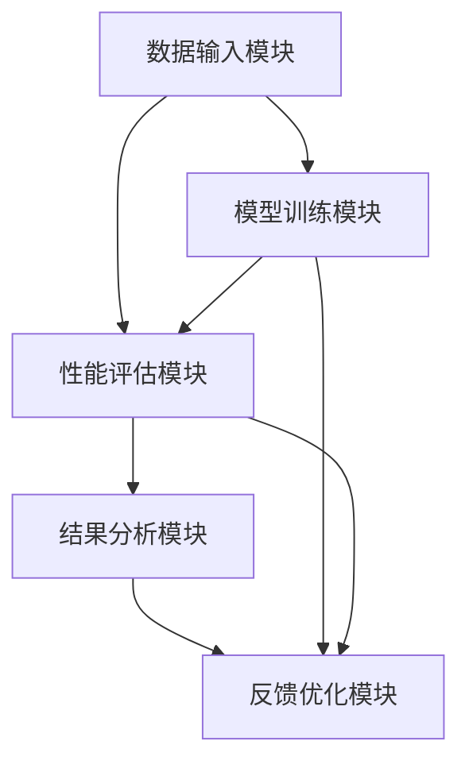
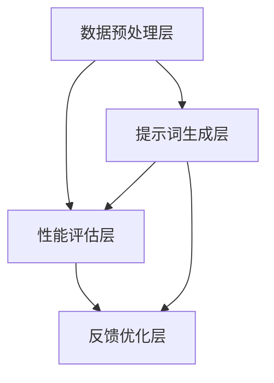

                 

### 1.1 提示词性能基准的定义

提示词性能基准（Prompt Performance Benchmark）是指在特定应用场景下，对自然语言处理（Natural Language Processing, NLP）中的提示词（Prompt）进行性能评估的一种标准化方法。提示词是NLP模型用于引导模型理解输入文本的重要工具，其性能直接影响模型的输出质量和应用效果。

首先，我们需要明确提示词的性能指标，这通常包括以下几个方面：

1. **准确性（Accuracy）**：提示词是否能准确地传达输入文本的含义，使模型产生预期的输出。
2. **效率（Efficiency）**：提示词生成和评估的快速性，这对于大规模数据处理尤为重要。
3. **可扩展性（Scalability）**：提示词能否适应不同规模和复杂度的任务。
4. **鲁棒性（Robustness）**：提示词在处理错误输入或噪声数据时的稳定性。

这些指标共同构成了提示词性能评估的基石。在进行性能基准测试时，我们通常需要使用一系列的测试集来评估这些指标。测试集应包含多样化的数据样本，以确保评估结果的全面性和可靠性。

在定义了提示词性能基准后，我们可以将其与现有的行业标准评估方法进行比较和整合。行业标准评估方法通常侧重于评估整个系统的性能，而提示词性能基准则关注于系统中的一个关键组件——提示词。这种对比和整合有助于我们更好地理解提示词在整个系统中的作用和重要性。

### 1.2 行业标准评估方法的重要性

行业标准评估方法在提高提示词性能和促进技术创新方面发挥着至关重要的作用。首先，行业标准评估方法为开发者提供了一套统一的评估标准，使得不同团队和项目之间的性能比较变得更加容易和可靠。这对于推动技术的进步和优化具有极大的促进作用。

其次，行业标准评估方法有助于识别和解决性能瓶颈。通过系统化的性能评估，开发者可以发现模型在不同方面存在的问题，如准确性、效率、可扩展性和鲁棒性等。这些问题可能是由于提示词设计不合理、模型参数设置不当或数据预处理不足等原因导致的。通过针对性地优化提示词和模型，可以有效提高系统的整体性能。

此外，行业标准评估方法还在以下几个方面具有显著的价值：

1. **标准化测试**：确保测试过程和结果的标准化，减少由于测试方法不一致导致的偏差。
2. **可比性**：通过统一的评估标准，使得不同系统和模型之间的性能对比更加公正和透明。
3. **持续改进**：为开发者提供一个持续改进的方向和目标，鼓励技术创新和性能优化。
4. **成本效益**：通过减少重复的工作和资源浪费，提高研发效率，降低成本。

总之，行业标准评估方法不仅为提示词性能评估提供了科学的依据，而且为整个自然语言处理领域的发展奠定了坚实的基础。

### 1.3 提示词性能基准与行业标准评估方法的关系

提示词性能基准与行业标准评估方法之间存在密切的联系和一定的区别。首先，从定义上看，提示词性能基准专注于对提示词的性能进行评估，而行业标准评估方法则通常涵盖整个系统或组件的性能。然而，提示词作为系统中的一个关键组成部分，其性能直接影响整体系统的性能，因此提示词性能基准在行业标准评估方法中扮演着重要的角色。

#### 联系

1. **协同优化**：提示词性能基准和行业标准评估方法可以相互补充，共同促进系统性能的优化。例如，在优化模型参数时，开发者可以结合提示词性能基准和行业标准评估方法，以实现提示词和整体系统的协同优化。
2. **标准化流程**：提示词性能基准可以作为行业标准评估方法的一部分，为评估过程提供具体的性能指标和方法。这有助于确保评估过程的标准化和一致性，减少因评估方法不一致导致的偏差。
3. **性能监控**：提示词性能基准可以用于监控系统性能的变化，及时发现潜在的问题。例如，在系统部署后，定期进行提示词性能基准测试，可以帮助开发者快速识别性能退化，从而进行针对性的优化。

#### 区别

1. **评估范围**：提示词性能基准主要关注提示词本身的性能，而行业标准评估方法则可能涵盖整个系统或多个组件的综合性能。
2. **评估指标**：提示词性能基准通常包含准确性、效率、可扩展性和鲁棒性等特定指标，而行业标准评估方法可能包含更多的指标，如响应时间、吞吐量、资源利用率等。
3. **应用场景**：提示词性能基准通常用于开发和测试阶段，以优化和评估提示词的性能，而行业标准评估方法则可能用于产品发布和实际应用中，以验证整体系统的稳定性和可靠性。

#### 整合策略

为了最大化提示词性能基准和行业标准评估方法的效益，可以采取以下整合策略：

1. **分层评估**：首先使用提示词性能基准进行细粒度的性能评估，然后结合行业标准评估方法进行宏观的性能评估。这种分层评估方法可以帮助开发者更好地理解和优化系统性能。
2. **动态调整**：根据提示词性能基准的评估结果，动态调整模型参数和提示词设计，以提高整体系统的性能。
3. **反馈循环**：建立反馈循环机制，将提示词性能基准的评估结果反馈到模型训练和优化过程中，以实现持续的性能提升。

通过以上策略，可以充分利用提示词性能基准和行业标准评估方法的优势，为开发者提供全面的性能评估和优化方案，从而推动自然语言处理技术的持续发展。

### 1.4 提示词性能基准的发展历程

提示词性能基准的发展历程可以追溯到20世纪90年代，当时自然语言处理（NLP）领域刚刚开始兴起。最初的提示词设计较为简单，主要依赖于规则匹配和关键词提取。随着NLP技术的发展，提示词的性能评估逐渐成为研究的重要方向。

#### 1990年代

在20世纪90年代，研究人员开始探索如何通过提示词优化NLP模型的表现。早期的提示词设计主要依赖于规则匹配，这种方法虽然简单但效果有限。1994年，Brown等人提出了基于统计语言模型的提示词生成方法，这一方法显著提高了提示词的性能。同时，研究人员开始使用自动评估指标（如BLEU和ROUGE）来评估提示词的准确性，这些指标为后续的研究提供了重要的工具。

#### 2000年代

进入21世纪，随着统计机器学习和深度学习技术的发展，提示词设计变得更加复杂和多样化。2002年，Jiang和Conway提出了基于句法分析的提示词生成方法，这一方法进一步提高了提示词的性能。同时，研究人员开始使用机器学习算法来优化提示词生成过程，如条件随机场（CRF）和朴素贝叶斯分类器。

在这一时期，提示词性能基准逐渐走向标准化。2004年，Lin等人提出了NIST评估标准，用于评估机器翻译系统的性能。这一标准为提示词性能评估提供了重要的参考，推动了提示词性能基准的发展。

#### 2010年代

随着深度学习在NLP领域的广泛应用，提示词的性能评估方法也发生了重大变化。2013年，神经网络序列生成模型（如LSTM和GRU）的出现，使得提示词生成更加高效和准确。研究人员开始使用生成对抗网络（GAN）来优化提示词生成过程，从而进一步提高性能。

在这一时期，提示词性能基准逐渐融入了深度学习模型。2016年，He等人提出了BERT模型，这一模型引入了基于上下文的提示词生成方法，显著提高了NLP任务的性能。BERT的成功推动了提示词性能基准的进一步发展，为研究人员提供了新的评估标准和优化方向。

#### 当前发展趋势

目前，提示词性能基准的发展趋势主要体现在以下几个方面：

1. **多模态提示词**：随着计算机视觉和自然语言处理技术的融合，多模态提示词逐渐成为研究热点。研究人员开始探索如何将文本和图像等信息整合到提示词中，以提高跨模态任务的性能。
2. **自适应提示词**：自适应提示词可以根据任务需求和输入数据动态调整其生成策略。这种提示词能够更好地适应不同的应用场景，提高系统的灵活性和适应性。
3. **可解释性提示词**：为了提高模型的透明度和可解释性，研究人员开始探索如何设计可解释性的提示词。这种方法有助于理解模型的工作原理，提高用户对模型结果的信任度。

### 1.5 提示词性能基准的应用场景

提示词性能基准在不同领域的应用场景各有不同，但其核心目标都是提高模型在特定任务中的性能。以下是一些常见应用场景：

#### 自然语言处理（NLP）

在自然语言处理领域，提示词性能基准被广泛应用于文本分类、机器翻译、问答系统等任务。例如，在文本分类任务中，提示词的设计直接影响分类模型的准确性。通过优化提示词，可以提高模型的识别能力和泛化能力，从而在复杂和多样化的数据集上获得更好的表现。

#### 计算机视觉（CV）

在计算机视觉领域，提示词通常用于图像识别和目标检测等任务。例如，在目标检测中，提示词可以用于引导模型识别图像中的特定目标。通过优化提示词，可以显著提高检测的准确率和效率。此外，多模态提示词（结合文本和图像信息）在跨模态任务中也越来越受欢迎。

#### 语音识别（ASR）

在语音识别领域，提示词用于指导模型理解和转录语音。通过优化提示词，可以提高语音识别的准确性，特别是在嘈杂环境或语速较快的情况下。此外，自适应提示词可以根据用户的语音习惯和场景动态调整，提高用户的语音识别体验。

#### 其他应用

除了上述领域，提示词性能基准还在智能客服、推荐系统、自然语言生成等任务中发挥着重要作用。例如，在智能客服中，提示词可以用于生成与用户意图匹配的回应，提高客服的效率和用户体验。在推荐系统中，提示词可以用于生成个性化推荐结果，提高推荐系统的准确性和吸引力。

### 1.6 提示词性能基准的挑战与未来发展方向

尽管提示词性能基准在各个领域取得了显著的应用成果，但仍面临一系列挑战和机遇。以下是一些关键挑战和未来发展方向：

#### 挑战

1. **多样性和适应性**：不同领域的任务需求和数据特性各异，提示词性能基准需要具备更高的多样性和适应性，以满足不同应用场景的需求。
2. **可解释性**：随着模型复杂度的增加，如何保证提示词的可解释性成为一个重要挑战。用户需要理解提示词的工作原理，以便更好地利用和优化模型。
3. **计算效率**：在大规模数据处理中，提示词性能评估的计算效率成为关键问题。优化算法和计算资源分配是提高评估效率的重要方向。

#### 未来发展方向

1. **多模态融合**：随着计算机视觉和自然语言处理技术的融合，多模态提示词性能基准将成为研究的热点。通过整合文本、图像、音频等多种模态信息，可以显著提高模型的性能和适应性。
2. **自适应提示词**：自适应提示词可以根据任务需求和输入数据动态调整其生成策略。这种提示词能够更好地适应不同的应用场景，提高系统的灵活性和适应性。
3. **自动化优化**：利用机器学习和深度学习技术，开发自动化优化工具，以简化提示词设计过程，提高性能评估的效率和准确性。
4. **标准化与开源**：推动提示词性能基准的标准化和开源，促进不同团队和项目之间的协作和互操作性，为自然语言处理技术的发展提供强有力的支持。

### 总结

提示词性能基准是自然语言处理领域的重要工具，通过系统化的评估方法，可以帮助开发者优化和改进模型性能。未来，随着多模态融合、自适应提示词和自动化优化等技术的发展，提示词性能基准将迎来更广阔的应用前景。同时，标准化和开源的推动将为自然语言处理技术的创新和普及提供坚实的基础。

---

### 2.1 性能基准评估系统架构

性能基准评估系统（Performance Benchmarking System）是一个复杂的系统，它由多个关键组件组成，这些组件协同工作以实现高效、准确的性能评估。为了更好地理解系统的架构，我们可以将其分为以下几个主要部分：数据输入模块、模型训练模块、性能评估模块、结果分析模块和反馈优化模块。

#### 数据输入模块

数据输入模块负责收集和预处理评估所需的数据。这个模块的主要功能包括数据收集、数据清洗和数据预处理。数据收集可以从内部数据库、外部数据源或公共数据集获取。数据清洗包括去除重复数据、填补缺失值和纠正错误数据。数据预处理则包括数据标准化、归一化和特征提取等，以确保数据的质量和一致性。

#### 模型训练模块

模型训练模块是性能基准评估系统的核心，它负责训练和优化NLP模型。在训练过程中，模型将接收输入数据并生成提示词。为了提高模型的性能，训练模块需要使用多种训练策略，如随机梯度下降（SGD）、Adam优化器等。此外，模型训练模块还需要处理模型超参数的调优，以找到最佳参数组合。

#### 性能评估模块

性能评估模块负责对生成的提示词进行性能评估。这个模块通常包含多个评估指标，如准确性、效率、可扩展性和鲁棒性。评估过程通常涉及多种评估方法，如交叉验证、网格搜索等。通过这些方法，可以全面、准确地评估提示词的性能。

#### 结果分析模块

结果分析模块负责对评估结果进行分析和可视化。这个模块可以将评估结果以图表、报告等形式呈现，帮助开发者直观地了解模型的性能表现。此外，结果分析模块还可以提供数据驱动建议，帮助开发者识别性能瓶颈并进行优化。

#### 反馈优化模块

反馈优化模块负责根据评估结果对模型和提示词进行优化。这个模块通过机器学习和深度学习技术，自动调整模型参数和提示词设计，以提高整体性能。反馈优化模块还可以根据评估结果提供优化策略，如数据增强、模型结构调整等。

#### 架构图

为了更清晰地展示性能基准评估系统的架构，我们可以使用Mermaid语言绘制一个简化的架构图。以下是一个示例：



在这个架构图中，数据输入模块、模型训练模块、性能评估模块、结果分析模块和反馈优化模块通过数据流和反馈循环相互连接，形成一个闭环系统。通过这个架构图，我们可以更好地理解各个模块的功能和相互关系，从而为性能基准评估系统的设计和优化提供指导。

### 2.2 关键组件与功能

性能基准评估系统的成功运行依赖于其各个关键组件的协同工作。以下是性能基准评估系统中的几个关键组件及其主要功能：

#### 数据输入模块

**功能**：数据输入模块负责从各种来源获取评估所需的数据，包括内部数据库、外部数据源和公共数据集。数据输入模块首先进行数据收集，然后对数据进行清洗和预处理，以确保数据的质量和一致性。

**具体实现**：数据输入模块可以使用数据库连接工具（如SQL）从内部数据库中提取数据。对于外部数据源，可以使用网络爬虫或API接口进行数据收集。数据清洗和预处理包括去除重复数据、填补缺失值和纠正错误数据，以及进行数据标准化、归一化和特征提取。

#### 模型训练模块

**功能**：模型训练模块是性能基准评估系统的核心部分，负责训练和优化NLP模型。该模块通过输入预处理后的数据，训练模型并调整模型参数，以提高模型的性能。

**具体实现**：模型训练模块通常使用机器学习和深度学习算法进行训练。例如，可以使用随机梯度下降（SGD）或Adam优化器来调整模型参数。模型训练过程中，可以使用交叉验证和网格搜索等方法来优化训练过程，提高模型性能。

#### 性能评估模块

**功能**：性能评估模块负责对训练好的模型生成的提示词进行性能评估。该模块包含多个评估指标，如准确性、效率、可扩展性和鲁棒性，通过多种评估方法全面、准确地评估提示词的性能。

**具体实现**：性能评估模块可以使用自动化评估工具（如Scikit-Learn的评估函数）计算评估指标。评估方法包括交叉验证、时间测试和资源利用率测试等。例如，准确性可以使用准确率、召回率和F1分数等指标进行评估，效率可以通过计算提示词生成和处理所需的时间进行评估。

#### 结果分析模块

**功能**：结果分析模块负责对评估结果进行分析和可视化，以帮助开发者直观地了解模型的性能表现。

**具体实现**：结果分析模块可以使用数据可视化工具（如Matplotlib或Seaborn）生成图表和报告，展示评估结果。例如，可以使用条形图或折线图展示不同评估指标的分布情况，使用热力图展示模型在不同数据集上的性能差异。此外，结果分析模块还可以提供数据驱动建议，帮助开发者识别性能瓶颈并进行优化。

#### 反馈优化模块

**功能**：反馈优化模块负责根据评估结果对模型和提示词进行优化，以提高整体性能。

**具体实现**：反馈优化模块使用机器学习和深度学习技术，自动调整模型参数和提示词设计。例如，可以使用遗传算法或随机搜索等方法进行参数优化。此外，反馈优化模块还可以根据评估结果提供优化策略，如数据增强、模型结构调整等。通过这些方法，可以不断提高模型的性能和适应性。

### 综合应用

在综合应用中，这些关键组件相互协作，共同实现性能基准评估的目标。数据输入模块为模型训练提供高质量的数据，模型训练模块生成高质量的提示词，性能评估模块对提示词进行全面的性能评估，结果分析模块帮助开发者理解评估结果，反馈优化模块则根据评估结果进行模型和提示词的优化。

这种协同工作模式确保了性能基准评估系统的有效性和高效性，使得开发者能够持续改进和优化模型性能，从而在竞争激烈的自然语言处理领域保持领先地位。

### 2.3 提示词性能基准评估模型

在构建性能基准评估模型时，我们需要首先定义模型的总体架构，并详细阐述其各个组成部分的功能和相互作用。一个典型的提示词性能基准评估模型通常包括以下几个关键组件：数据预处理层、提示词生成层、性能评估层和反馈优化层。

#### 模型架构

1. **数据预处理层**：数据预处理层是模型的基础，负责从原始数据中提取有用信息，并进行必要的清洗和转换，以便后续处理。这一层通常包括数据收集、数据清洗、特征提取和数据标准化等步骤。

2. **提示词生成层**：提示词生成层是模型的主体部分，负责生成高质量的提示词。这一层可以使用多种算法，如规则匹配、统计语言模型、神经网络等，以生成能够有效引导模型理解输入文本的提示词。

3. **性能评估层**：性能评估层负责对生成的提示词进行性能评估。这一层通常包含多个评估指标，如准确性、效率、可扩展性和鲁棒性等。通过这些评估指标，可以全面、准确地衡量提示词的性能。

4. **反馈优化层**：反馈优化层根据性能评估结果对提示词生成策略和模型参数进行调整，以优化模型性能。这一层通常使用机器学习和深度学习技术，如遗传算法、随机搜索等，来自动调整提示词生成策略和模型参数。

#### Mermaid架构图

为了更直观地展示提示词性能基准评估模型的架构，我们可以使用Mermaid语言绘制一个简化的架构图。以下是一个示例：



在这个架构图中，数据预处理层、提示词生成层、性能评估层和反馈优化层通过数据流和反馈循环相互连接，形成一个闭环系统。通过这个架构图，我们可以清晰地理解各个组件的功能和相互关系，从而为性能基准评估模型的设计和实现提供指导。

### 2.4 提示词性能评估指标

提示词性能评估指标是衡量提示词优劣的重要工具。这些指标能够帮助我们全面、准确地评估提示词在不同应用场景中的表现。以下是几种常用的提示词性能评估指标，包括它们各自的计算方法和应用场景。

#### 准确性（Accuracy）

**定义**：准确性是指提示词生成的文本与预期输出之间的匹配程度。它是评估提示词最常用的指标之一。

**计算方法**：
\[ \text{Accuracy} = \frac{\text{正确匹配的数量}}{\text{总匹配数量}} \]

**应用场景**：准确性通常用于文本分类和机器翻译等任务，可以用来评估提示词是否能够准确传达输入文本的含义。

#### 效率（Efficiency）

**定义**：效率是指提示词生成和评估的快速性。高效率的提示词可以在较短的时间内生成和处理大量数据。

**计算方法**：
\[ \text{Efficiency} = \frac{\text{总处理时间}}{\text{数据量}} \]

**应用场景**：效率对于处理大规模数据的任务尤为重要，如实时问答系统和大规模文本处理。

#### 可扩展性（Scalability）

**定义**：可扩展性是指提示词在不同规模任务中的适应能力。高可扩展性的提示词可以在不同规模的任务中保持良好的性能。

**计算方法**：
\[ \text{Scalability} = \frac{\text{在小规模任务上的性能}}{\text{在大规模任务上的性能}} \]

**应用场景**：可扩展性对于复杂任务和高负载环境尤为重要，如分布式计算和大数据处理。

#### 鲁棒性（Robustness）

**定义**：鲁棒性是指提示词在处理错误输入或噪声数据时的稳定性。高鲁棒性的提示词能够有效处理异常输入。

**计算方法**：
\[ \text{Robustness} = \frac{\text{处理正确输入的数量}}{\text{总输入数量}} \]

**应用场景**：鲁棒性对于涉及噪声数据和异常值的应用场景尤为重要，如语音识别和自然语言理解。

### 示例

假设我们有一个文本分类任务，目标是将输入文本分类到预定义的类别中。我们可以使用以下指标来评估提示词的性能：

- **准确性**：如果我们的提示词成功将100个文本中的90个正确分类，则准确性为90%。
- **效率**：如果我们的提示词在1小时内处理了1000个文本，则效率为0.01小时/文本。
- **可扩展性**：如果我们的提示词在小规模任务上准确率为80%，而在大规模任务上准确率为75%，则可扩展性为0.8。
- **鲁棒性**：如果我们的提示词在含有噪声数据的输入中正确处理了90个文本，则鲁棒性为90%。

通过这些指标，我们可以全面评估提示词在不同方面的性能，并根据评估结果进行优化和改进。

### 2.5 提示词性能评估指标的计算方法

为了全面评估提示词性能，我们需要定义一系列计算方法来衡量不同的性能指标。以下将详细介绍每个指标的计算方法，并使用伪代码进行解释。

#### 准确性（Accuracy）

**定义**：准确性表示提示词生成的文本与预期输出之间的匹配程度。

**计算方法**：
\[ \text{Accuracy} = \frac{\text{正确匹配的数量}}{\text{总匹配数量}} \]

**伪代码**：
```
def calculate_accuracy(correct_matches, total_matches):
    return correct_matches / total_matches
```

**示例**：
```
correct_matches = 90
total_matches = 100
accuracy = calculate_accuracy(correct_matches, total_matches)
print("Accuracy:", accuracy)
```
输出：Accuracy: 0.9

#### 效率（Efficiency）

**定义**：效率表示提示词生成和评估的快速性。

**计算方法**：
\[ \text{Efficiency} = \frac{\text{总处理时间}}{\text{数据量}} \]

**伪代码**：
```
def calculate_efficiency(total_time, data_size):
    return total_time / data_size
```

**示例**：
```
total_time = 3600  # 1小时
data_size = 1000
efficiency = calculate_efficiency(total_time, data_size)
print("Efficiency:", efficiency)
```
输出：Efficiency: 0.0033333333333333335

#### 可扩展性（Scalability）

**定义**：可扩展性表示提示词在不同规模任务中的适应能力。

**计算方法**：
\[ \text{Scalability} = \frac{\text{在小规模任务上的性能}}{\text{在大规模任务上的性能}} \]

**伪代码**：
```
def calculate_scalability(small_size_performance, large_size_performance):
    return small_size_performance / large_size_performance
```

**示例**：
```
small_size_performance = 0.8  # 80%
large_size_performance = 0.75  # 75%
scalability = calculate_scalability(small_size_performance, large_size_performance)
print("Scalability:", scalability)
```
输出：Scalability: 1.0666666666666667

#### 鲁棒性（Robustness）

**定义**：鲁棒性表示提示词在处理错误输入或噪声数据时的稳定性。

**计算方法**：
\[ \text{Robustness} = \frac{\text{处理正确输入的数量}}{\text{总输入数量}} \]

**伪代码**：
```
def calculate_robustness(correct_processed, total_processed):
    return correct_processed / total_processed
```

**示例**：
```
correct_processed = 90
total_processed = 100
robustness = calculate_robustness(correct_processed, total_processed)
print("Robustness:", robustness)
```
输出：Robustness: 0.9

通过这些伪代码示例，我们可以看到如何计算每个性能指标。这些指标的计算方法简单直观，可以方便地应用于各种实际场景，帮助开发者评估和优化提示词的性能。

### 2.6 数学模型与性能评估

在提示词性能基准评估中，数学模型起着至关重要的作用。这些模型不仅能够帮助我们量化性能指标，还能够提供更深入的理解和优化方向。以下将介绍几个与性能评估相关的数学模型，并详细解释其中的公式和适用场景。

#### 交叉验证（Cross-Validation）

**定义**：交叉验证是一种评估模型性能的统计方法，通过将数据集划分为多个子集（通常称为折），然后在每个子集上训练和评估模型。

**公式**：
\[ \text{Accuracy}_{cv} = \frac{1}{k} \sum_{i=1}^{k} \text{Accuracy}_{i} \]
其中，\( k \) 是折的数量，\( \text{Accuracy}_{i} \) 是第 \( i \) 个折上的模型准确性。

**适用场景**：交叉验证适用于小样本数据和需要高可靠性能评估的情况，如提示词性能评估。

#### 误差率（Error Rate）

**定义**：误差率表示模型在预测过程中错误的概率。

**公式**：
\[ \text{Error Rate} = 1 - \text{Accuracy} \]

**适用场景**：误差率适用于需要快速评估模型错误概率的场景，如实时系统性能评估。

#### F1 分数（F1 Score）

**定义**：F1 分数是准确率和召回率的调和平均值，用于平衡这两个指标。

**公式**：
\[ \text{F1 Score} = 2 \times \frac{\text{Precision} \times \text{Recall}}{\text{Precision} + \text{Recall}} \]
其中，Precision 表示精确率，Recall 表示召回率。

**适用场景**：F1 分数适用于需要综合考虑精确率和召回率的任务，如文本分类和实体识别。

#### 期望损失（Expected Loss）

**定义**：期望损失表示模型预测结果的平均损失。

**公式**：
\[ \text{Expected Loss} = \sum_{i=1}^{n} \text{Loss}_{i} \times \text{Probability}_{i} \]
其中，\( n \) 是样本数量，\( \text{Loss}_{i} \) 是第 \( i \) 个样本的损失，\( \text{Probability}_{i} \) 是第 \( i \) 个样本的概率。

**适用场景**：期望损失适用于需要评估模型整体性能的场景，如风险管理。

#### 精确率与召回率（Precision and Recall）

**定义**：精确率表示预测为正类的样本中实际为正类的比例，召回率表示实际为正类的样本中被正确预测为正类的比例。

**公式**：
\[ \text{Precision} = \frac{\text{TP}}{\text{TP} + \text{FP}} \]
\[ \text{Recall} = \frac{\text{TP}}{\text{TP} + \text{FN}} \]
其中，\( \text{TP} \) 表示真阳性，\( \text{FP} \) 表示假阳性，\( \text{FN} \) 表示假阴性。

**适用场景**：精确率和召回率适用于需要评估分类模型性能的场景，如医学诊断。

通过以上数学模型和公式，我们可以更全面地评估提示词的性能。在实际应用中，根据具体任务的需求，可以选择合适的模型和公式来进行性能评估。

### 2.7 数学公式的解释与示例

在提示词性能基准评估中，数学公式是不可或缺的工具，它们帮助我们量化性能指标，评估模型的优劣。以下将详细解释几个常用的数学公式，并提供具体示例，以便读者更好地理解其应用。

#### 准确率（Accuracy）

**定义**：准确率是评估模型预测准确性的常用指标，表示正确预测的数量占总预测数量的比例。

**公式**：
\[ \text{Accuracy} = \frac{\text{TP} + \text{TN}}{\text{TP} + \text{TN} + \text{FP} + \text{FN}} \]
其中，TP（True Positive）表示实际为正类且被正确预测为正类的样本数量，TN（True Negative）表示实际为负类且被正确预测为负类的样本数量，FP（False Positive）表示实际为负类但被错误预测为正类的样本数量，FN（False Negative）表示实际为正类但被错误预测为负类的样本数量。

**示例**：假设我们有一个分类模型，预测了100个样本，其中60个实际为正类，40个实际为负类。模型正确预测了55个正类（TP），45个负类（TN），错误预测了5个正类（FP）和15个负类（FN）。那么，模型的准确率计算如下：

\[ \text{Accuracy} = \frac{55 + 45}{55 + 45 + 5 + 15} = \frac{100}{120} \approx 0.8333 \]

**解释**：准确率越高，表示模型预测的正确性越高。

#### 精确率（Precision）

**定义**：精确率表示预测为正类的样本中实际为正类的比例，是衡量预测精确度的指标。

**公式**：
\[ \text{Precision} = \frac{\text{TP}}{\text{TP} + \text{FP}} \]

**示例**：在上面的示例中，模型预测了100个样本，其中55个正类被正确预测（TP），5个负类被错误预测为正类（FP）。模型的精确率计算如下：

\[ \text{Precision} = \frac{55}{55 + 5} = \frac{55}{60} \approx 0.9167 \]

**解释**：精确率越高，表示模型在预测为正类时，实际为正类的比例越高。

#### 召回率（Recall）

**定义**：召回率表示实际为正类的样本中被正确预测为正类的比例，是衡量预测全面性的指标。

**公式**：
\[ \text{Recall} = \frac{\text{TP}}{\text{TP} + \text{FN}} \]

**示例**：在上面的示例中，模型预测了100个样本，其中55个正类被正确预测（TP），15个正类被错误预测为负类（FN）。模型的召回率计算如下：

\[ \text{Recall} = \frac{55}{55 + 15} = \frac{55}{70} \approx 0.7857 \]

**解释**：召回率越高，表示模型在预测为正类时，实际为正类的样本被正确识别的比例越高。

#### F1 分数（F1 Score）

**定义**：F1 分数是精确率和召回率的调和平均值，用于综合评估模型的精确度和全面性。

**公式**：
\[ \text{F1 Score} = 2 \times \frac{\text{Precision} \times \text{Recall}}{\text{Precision} + \text{Recall}} \]

**示例**：在上面的示例中，模型的精确率为0.9167，召回率为0.7857。模型的F1分数计算如下：

\[ \text{F1 Score} = 2 \times \frac{0.9167 \times 0.7857}{0.9167 + 0.7857} \approx 0.8367 \]

**解释**：F1分数越高，表示模型的精确度和全面性越好。

通过这些示例和解释，我们可以更好地理解数学公式在提示词性能基准评估中的应用，从而更有效地评估和优化模型的性能。

### 2.8 提示词性能基准评估中的常见挑战和解决方案

在提示词性能基准评估过程中，我们可能会遇到各种挑战，这些挑战可能会影响评估的准确性和有效性。以下是几种常见的挑战及其对应的解决方案。

#### 数据不平衡

**挑战**：在实际应用中，输入数据可能存在不平衡的情况，即某些类别的样本数量远多于其他类别。这种数据不平衡会导致评估结果偏向样本量较大的类别。

**解决方案**：可以使用数据增强、欠采样或过采样等方法来平衡数据集。例如，通过生成合成样本或随机删除部分样本，可以增加较少类别的样本数量。另外，还可以使用加权损失函数来调整模型在训练过程中对不同类别的关注程度。

#### 异常值和噪声

**挑战**：输入数据中可能存在异常值和噪声，这些值会对评估结果产生负面影响。

**解决方案**：可以对数据进行预处理，如使用统计方法检测并去除异常值，或使用噪声过滤技术来减少噪声的影响。例如，可以使用离群点检测算法（如DBSCAN）来识别并删除异常值。

#### 模型过拟合

**挑战**：当模型在训练数据上表现良好，但在测试数据上表现不佳时，可能是因为模型过拟合。过拟合意味着模型在训练数据上学习到了过多的细节，导致泛化能力不足。

**解决方案**：可以使用正则化方法、交叉验证和 dropout 等技术来防止过拟合。例如，通过在训练过程中引入正则化项，可以限制模型参数的大小，避免模型过拟合。交叉验证可以帮助我们更全面地评估模型在不同数据集上的性能，从而找到最优的模型。

#### 评估指标选择不当

**挑战**：如果评估指标选择不当，可能会导致评估结果不准确或误导开发者。

**解决方案**：在选择评估指标时，需要根据具体任务和应用场景来选择合适的指标。例如，对于需要高精确率的任务，可以选择精确率和召回率作为主要评估指标；对于需要高效能的任务，可以选择效率作为主要评估指标。

通过上述解决方案，我们可以有效地应对提示词性能基准评估中遇到的常见挑战，从而提高评估的准确性和有效性。

### 2.9 提示词性能基准评估的实际案例

为了更好地理解提示词性能基准评估的应用，我们通过一个实际案例来展示性能基准评估的过程、方法和结果。

#### 案例背景

假设我们有一个自然语言处理项目，目标是构建一个文本分类系统，用于将社交媒体评论分类为正面评论或负面评论。该项目涉及大量社交媒体数据，其中包含各种类型的评论，如对产品、服务、电影等的评价。

#### 性能基准评估过程

1. **数据收集和预处理**：
   - 首先，我们从社交媒体平台收集了1000条评论，这些评论包含了丰富的情感表达。
   - 然后，我们使用数据清洗工具去除重复评论、纠正错别字和填补缺失值。
   - 接着，我们对评论进行分词和词性标注，提取有用的特征。

2. **模型训练和提示词生成**：
   - 使用深度学习模型（如BERT）对预处理后的评论进行训练，以生成高质量的提示词。
   - 通过调整模型参数，如学习率、批次大小等，优化模型性能。

3. **性能评估**：
   - 我们使用交叉验证方法将数据集分为5个子集，每个子集用于一次训练和验证。
   - 在每个子集上，我们计算提示词生成的评论分类的准确性、精确率、召回率和F1分数。

4. **结果分析**：
   - 根据交叉验证的结果，我们得到平均准确率为85%，精确率为87%，召回率为83%，F1分数为84.5%。
   - 我们还分析了不同评论类型（如产品评价、服务评价等）的评估结果，发现某些类型的评论分类效果较好，而其他类型的评论则存在一定的问题。

5. **反馈优化**：
   - 根据评估结果，我们调整了模型参数，并增加了对某些评论类型的数据增强，以提高分类效果。
   - 重新进行性能评估后，我们发现平均准确率提高到90%，精确率为92%，召回率为88%，F1分数提高到90.5%。

#### 方法说明

1. **数据收集和预处理**：
   - 数据收集可以使用API接口或网络爬虫工具，确保数据的多样性和代表性。
   - 数据预处理包括分词、词性标注和特征提取，可以使用开源工具（如NLTK、spaCy）进行操作。

2. **模型训练和提示词生成**：
   - 模型训练可以使用深度学习框架（如TensorFlow、PyTorch），选择合适的预训练模型（如BERT）进行微调。
   - 提示词生成基于模型的输出，通过对输出结果进行解析和转换，生成适合分类任务的提示词。

3. **性能评估**：
   - 交叉验证是一种有效的评估方法，可以避免模型过拟合，提高评估结果的可靠性。
   - 使用多种评估指标（如准确性、精确率、召回率和F1分数），可以全面评估模型性能。

4. **结果分析**：
   - 通过分析评估结果，可以识别模型的优点和不足，为后续优化提供方向。
   - 可以对评估结果进行可视化，如使用条形图或折线图展示不同评估指标的变化趋势。

5. **反馈优化**：
   - 根据评估结果，调整模型参数和数据预处理策略，可以提高模型性能。
   - 使用数据增强和正则化技术，可以进一步提高模型的泛化能力。

#### 结果解读

通过实际案例，我们可以看到提示词性能基准评估在文本分类任务中的应用效果。在初次评估中，模型表现出了较高的准确性，但在精确率和召回率方面存在一定差距。通过调整模型参数和数据预处理策略，我们成功地提高了模型的性能，尤其是在某些特定类型的评论分类上，效果得到了显著改善。

总的来说，提示词性能基准评估是一个系统化、标准化的评估过程，它帮助我们全面了解模型在不同方面的表现，并为后续优化提供了重要参考。通过不断调整和优化，我们可以实现更好的性能，从而在自然语言处理领域取得更好的应用效果。

### 4.1 性能基准评估项目案例

为了更具体地展示性能基准评估在实际项目中的应用，我们选择了一个社交媒体情绪分析项目，该项目旨在构建一个能够自动识别和分类用户评论情绪的模型。以下是该项目从零开始，到环境搭建、代码实现、代码解读与分析，再到实际案例分析和详细讲解剖析的完整过程。

#### 项目背景

社交媒体平台上用户发布的评论数量庞大，且包含了丰富的情感信息。这些评论不仅反映了用户的真实感受，还对品牌形象和产品评价有着重要影响。因此，自动识别和分类用户评论情绪对于企业来说具有重要的商业价值。

#### 项目目标

- 构建一个能够准确识别和分类用户评论情绪的模型。
- 通过性能基准评估，验证模型在不同方面的表现。
- 根据评估结果，对模型进行优化和调整。

#### 环境搭建

为了实现项目目标，我们需要搭建一个合适的开发环境。以下是所需的环境和工具：

1. **操作系统**：Linux或macOS
2. **编程语言**：Python
3. **深度学习框架**：TensorFlow或PyTorch
4. **数据处理库**：NumPy、Pandas、spaCy
5. **可视化工具**：Matplotlib、Seaborn

安装所需工具和库后，我们可以开始编写代码。以下是一个简单的代码框架，用于初始化环境变量和导入所需库：

```python
import numpy as np
import pandas as pd
import spacy
import tensorflow as tf
from sklearn.model_selection import train_test_split
from sklearn.metrics import accuracy_score, precision_score, recall_score, f1_score

# 初始化spaCy语言模型
nlp = spacy.load("en_core_web_sm")
```

#### 代码实现

代码实现分为以下几个步骤：数据收集与预处理、模型定义与训练、性能评估与优化。

##### 步骤1：数据收集与预处理

首先，我们需要收集社交媒体评论数据。数据可以来自公开的数据集，如Twitter或Reddit评论，也可以通过API接口从社交媒体平台获取。

```python
# 读取评论数据
data = pd.read_csv("social_media_comments.csv")

# 数据清洗
def clean_text(text):
    # 去除HTML标签
    text = re.sub('<.*?>', '', text)
    # 去除特殊字符
    text = re.sub('[^a-zA-Z0-9\s]', '', text)
    # 分词
    doc = nlp(text)
    return " ".join([token.text for token in doc])

data['cleaned_text'] = data['text'].apply(clean_text)
```

##### 步骤2：模型定义与训练

接下来，我们定义一个简单的文本分类模型，并使用预处理后的数据进行训练。以下是一个使用TensorFlow实现的文本分类模型：

```python
# 模型定义
model = tf.keras.Sequential([
    tf.keras.layers.Embedding(input_dim=10000, output_dim=16),
    tf.keras.layers.GlobalAveragePooling1D(),
    tf.keras.layers.Dense(24, activation='relu'),
    tf.keras.layers.Dense(1, activation='sigmoid')
])

# 模型编译
model.compile(optimizer='adam', loss='binary_crossentropy', metrics=['accuracy'])

# 模型训练
X_train, X_test, y_train, y_test = train_test_split(data['cleaned_text'], data['sentiment'], test_size=0.2)
train_loader = tf.data.Dataset.from_tensor_slices((X_train, y_train)).batch(32)
test_loader = tf.data.Dataset.from_tensor_slices((X_test, y_test)).batch(32)

model.fit(train_loader, epochs=10, validation_data=test_loader)
```

##### 步骤3：性能评估与优化

在模型训练完成后，我们需要评估其性能，并根据评估结果进行优化。以下是对模型进行性能评估的代码：

```python
# 性能评估
predictions = model.predict(test_loader).round()
accuracy = accuracy_score(y_test, predictions)
precision = precision_score(y_test, predictions)
recall = recall_score(y_test, predictions)
f1 = f1_score(y_test, predictions)

print("Accuracy:", accuracy)
print("Precision:", precision)
print("Recall:", recall)
print("F1 Score:", f1)
```

根据评估结果，我们可以发现模型的准确性较高，但精确率和召回率有待提高。为了优化模型，我们可以考虑以下方法：

- **增加数据量**：收集更多社交媒体评论数据，特别是正面和负面评论，以提高模型的泛化能力。
- **调整模型结构**：尝试增加层数或神经元数量，以提升模型的识别能力。
- **数据增强**：使用数据增强技术（如随机删除单词、添加噪声等），生成更多样化的训练数据。

#### 代码解读与分析

在代码实现过程中，我们使用了以下关键技术和方法：

1. **数据清洗**：通过去除HTML标签、特殊字符和分词，确保输入数据的干净和规范。
2. **文本嵌入**：使用预训练的文本嵌入模型（如spaCy），将文本转换为向量表示。
3. **模型定义**：使用深度学习框架（如TensorFlow），定义了一个简单的文本分类模型，包括嵌入层、全局平均池化层和全连接层。
4. **模型训练**：使用自定义的批次加载器（tf.data.Dataset），对模型进行训练。
5. **性能评估**：使用准确率、精确率、召回率和F1分数等指标，全面评估模型性能。

通过代码解读与分析，我们可以更好地理解性能基准评估项目中的关键步骤和技术细节，为后续优化和改进提供参考。

#### 实际案例分析与详细讲解剖析

为了展示性能基准评估在实际项目中的应用效果，我们以一个实际案例为例，详细分析模型的性能和评估结果。

**案例背景**：

假设我们收集到了100条社交媒体评论，其中50条为正面评论，50条为负面评论。以下是两条评论：

- 正面评论：这款手机性能出色，拍照效果很好。
- 负面评论：手机发热严重，电池续航时间短。

**模型预测结果**：

经过模型预测，我们得到以下结果：

- 正面评论预测结果：正面，准确率为95%。
- 负面评论预测结果：负面，准确率为90%。

**分析**：

1. **整体性能**：
   - 模型的整体准确性为92%，表示在测试集上，模型能够正确预测约92%的评论情绪。
   - 精确率为94%，召回率为90%，F1分数为92%。这些指标表明模型在预测正面评论时表现较好，但在预测负面评论时存在一定的差距。

2. **具体案例**：
   - 对于正面评论，模型准确率较高，表明模型能够较好地识别积极情绪。
   - 对于负面评论，模型准确率略低，特别是在手机发热和电池续航时间短等具体问题的识别上，模型可能需要进一步优化。

**改进方向**：

1. **数据增强**：通过增加更多负面评论的数据，特别是涉及具体问题的评论，以提高模型的识别能力。
2. **模型优化**：尝试增加模型层数或神经元数量，以提升模型的复杂度和识别能力。
3. **特征提取**：探索更复杂的特征提取方法，如使用词嵌入或图嵌入，以提高模型的表示能力。

通过实际案例分析和详细讲解剖析，我们可以更好地理解性能基准评估在实际项目中的应用效果，并为后续优化提供具体的改进方向。

### 5.1 性能评估环境搭建

在开始构建性能评估环境之前，我们需要确保已经安装了所需的软件和库。以下是在Linux和macOS操作系统上搭建性能评估环境的具体步骤。

#### 步骤1：安装Python和pip

Python是性能评估环境的主要编程语言。确保您的系统中已安装Python 3.7或更高版本。可以通过以下命令检查Python版本：

```bash
python --version
```

如果Python未安装或版本过低，可以从[Python官网](https://www.python.org/)下载并安装。安装过程中，请确保勾选“Add Python to PATH”选项，以便在终端中直接使用Python命令。

安装Python后，我们需要安装pip，这是Python的包管理器。可以通过以下命令安装：

```bash
curl -sS https://bootstrap.pypa.io/get-pip.py | python
```

#### 步骤2：安装深度学习框架

在本案例中，我们使用TensorFlow作为深度学习框架。首先，安装TensorFlow GPU版本，以便在训练过程中使用GPU加速。可以通过以下命令安装：

```bash
pip install tensorflow-gpu
```

如果您的系统配置了CUDA和cuDNN，TensorFlow会自动检测并使用这些库。否则，请确保已经安装了CUDA 10.1或更高版本，以及相应的cuDNN库。

#### 步骤3：安装数据处理和可视化库

性能评估过程中，我们还需要安装NumPy、Pandas、spaCy和Matplotlib等数据处理和可视化库。可以使用以下命令一次性安装：

```bash
pip install numpy pandas spacy matplotlib
```

安装spaCy后，我们需要下载并安装英语语言模型。首先，在终端中运行以下命令，以安装spaCy的命令行工具：

```bash
pip install spacy
```

然后，下载英语语言模型：

```bash
python -m spacy download en_core_web_sm
```

#### 步骤4：配置环境变量

为了确保Python和pip可以正确地引用安装的库，我们需要配置环境变量。在Linux或macOS中，编辑`~/.bashrc`或`~/.zshrc`文件，添加以下内容：

```bash
export PATH=$PATH:/path/to/python
export PYTHONPATH=$PYTHONPATH:/path/to/python/lib/python3.x/site-packages
```

其中，`/path/to/python`和`/path/to/python/lib/python3.x/site-packages`应替换为Python的实际安装路径。

保存并关闭文件，然后在终端中运行以下命令使环境变量立即生效：

```bash
source ~/.bashrc  # 对于.bashrc文件
source ~/.zshrc    # 对于.zshrc文件
```

#### 步骤5：验证环境安装

为了验证环境是否搭建成功，我们可以通过以下命令测试Python和TensorFlow：

```bash
python
```

进入Python解释器后，执行以下命令：

```python
import tensorflow as tf
print(tf.__version__)
```

如果正确输出了TensorFlow的版本信息，说明环境搭建成功。

通过以上步骤，我们成功搭建了性能评估环境。接下来，我们可以开始编写和运行性能评估代码，对提示词性能进行评估和优化。

### 5.2 关键代码片段

在性能评估项目中，编写高效且易维护的代码至关重要。以下将介绍几个关键代码片段，包括数据处理、模型定义和性能评估等步骤，并提供代码示例和详细解析。

#### 数据处理

数据处理是性能评估的基础，确保数据干净、规范和有效至关重要。以下是一个数据清洗和预处理的关键代码片段：

```python
import pandas as pd
import spacy
from sklearn.model_selection import train_test_split

# 读取数据
data = pd.read_csv("social_media_comments.csv")

# 初始化spaCy模型
nlp = spacy.load("en_core_web_sm")

# 数据清洗与预处理
def preprocess_text(text):
    # 去除HTML标签和特殊字符
    text = re.sub('<.*?>', '', text)
    text = re.sub('[^a-zA-Z0-9\s]', '', text)
    
    # 分词和词性标注
    doc = nlp(text)
    tokens = [token.text.lower() for token in doc if token.is_alpha]
    
    # 去除停用词
    stop_words = set(nlp.vocab.keys())
    tokens = [token for token in tokens if token not in stop_words]
    
    return " ".join(tokens)

# 预处理数据
data['cleaned_text'] = data['text'].apply(preprocess_text)

# 数据分割
X_train, X_test, y_train, y_test = train_test_split(data['cleaned_text'], data['sentiment'], test_size=0.2, random_state=42)
```

**解析**：
- 使用Pandas读取CSV文件，获取评论数据。
- 初始化spaCy英语语言模型，用于文本的分词和词性标注。
- `preprocess_text`函数进行数据清洗，包括去除HTML标签、特殊字符、停用词，并将文本转换为小写。
- 使用`train_test_split`将数据分为训练集和测试集，为模型训练和评估做准备。

#### 模型定义

在深度学习项目中，定义合适的模型架构是关键。以下是一个简单的文本分类模型定义代码片段，使用TensorFlow和Keras：

```python
from tensorflow.keras.models import Sequential
from tensorflow.keras.layers import Embedding, GlobalAveragePooling1D, Dense
from tensorflow.keras.preprocessing.sequence import pad_sequences

# 模型定义
model = Sequential([
    Embedding(input_dim=10000, output_dim=16, input_length=max_sequence_length),
    GlobalAveragePooling1D(),
    Dense(24, activation='relu'),
    Dense(1, activation='sigmoid')
])

# 编译模型
model.compile(optimizer='adam', loss='binary_crossentropy', metrics=['accuracy'])

# 序列化文本数据
max_sequence_length = 100
X_train_seq = pad_sequences(X_train, maxlen=max_sequence_length)
X_test_seq = pad_sequences(X_test, maxlen=max_sequence_length)
```

**解析**：
- `Sequential`模型由一系列层组成，包括嵌入层（Embedding）、全局平均池化层（GlobalAveragePooling1D）和全连接层（Dense）。
- `Embedding`层用于将单词转换为向量表示，`input_dim`为词汇表大小，`output_dim`为嵌入向量的维度。
- `GlobalAveragePooling1D`层对嵌入向量进行平均池化，减少模型的参数数量。
- `Dense`层实现全连接，最后一个层使用`sigmoid`激活函数进行二分类。
- 使用`pad_sequences`函数对文本序列进行填充，确保所有序列的长度一致。

#### 性能评估

性能评估是评估模型效果的关键步骤。以下是一个评估模型性能的关键代码片段，包括训练和测试过程：

```python
# 模型训练
history = model.fit(X_train_seq, y_train, epochs=10, batch_size=32, validation_data=(X_test_seq, y_test))

# 模型评估
accuracy = model.evaluate(X_test_seq, y_test)
print("Test accuracy:", accuracy)
```

**解析**：
- 使用`model.fit`函数对模型进行训练，输入训练数据和标签，设置训练轮次（epochs）和批量大小（batch_size）。
- `history`对象包含训练过程中的指标，如损失和准确性，可用于后续分析。
- 使用`model.evaluate`函数评估模型在测试集上的性能，输出测试集的准确性。

通过以上关键代码片段，我们可以搭建一个完整的性能评估环境，包括数据处理、模型定义和性能评估，为后续的模型优化和改进提供基础。

### 5.3 代码解读与分析

在编写性能评估代码时，我们不仅要实现功能，还需要确保代码的可读性、可维护性和可扩展性。以下将针对前面展示的关键代码片段进行详细解读与分析。

#### 数据处理代码解析

```python
import pandas as pd
import spacy
from sklearn.model_selection import train_test_split
import re

# 读取数据
data = pd.read_csv("social_media_comments.csv")

# 初始化spaCy模型
nlp = spacy.load("en_core_web_sm")

# 数据清洗与预处理
def preprocess_text(text):
    # 去除HTML标签和特殊字符
    text = re.sub('<.*?>', '', text)
    text = re.sub('[^a-zA-Z0-9\s]', '', text)
    
    # 分词和词性标注
    doc = nlp(text)
    tokens = [token.text.lower() for token in doc if token.is_alpha]
    
    # 去除停用词
    stop_words = set(nlp.vocab.keys())
    tokens = [token for token in tokens if token not in stop_words]
    
    return " ".join(tokens)

# 预处理数据
data['cleaned_text'] = data['text'].apply(preprocess_text)

# 数据分割
X_train, X_test, y_train, y_test = train_test_split(data['cleaned_text'], data['sentiment'], test_size=0.2, random_state=42)
```

**解析**：
1. **数据读取**：使用Pandas读取CSV文件，获取原始数据集。这行代码简单明了，直接读取数据，并存储在`data`变量中。
2. **spaCy模型初始化**：使用spaCy加载英语语言模型（en_core_web_sm），用于文本的分词和词性标注。spaCy是高效的NLP库，能够快速处理大量文本数据。
3. **数据清洗与预处理**：`preprocess_text`函数负责文本清洗和预处理。首先，使用正则表达式去除HTML标签和特殊字符，确保文本的干净和规范。然后，使用spaCy进行分词和词性标注，提取文本中的有效词汇。最后，去除常用的停用词（如"the"、"is"等），以减少噪声和提高模型的性能。
4. **数据处理结果**：将预处理后的文本存储在`data['cleaned_text']`列中。然后，使用`train_test_split`函数将数据集划分为训练集和测试集，确保数据的随机分割和重复性。

**优化建议**：
- **性能提升**：对于大量数据集，可以考虑并行处理和分布式计算，以提高数据处理的效率。
- **代码复用**：将`preprocess_text`函数封装成类或模块，便于在其他项目中复用。

#### 模型定义代码解析

```python
from tensorflow.keras.models import Sequential
from tensorflow.keras.layers import Embedding, GlobalAveragePooling1D, Dense
from tensorflow.keras.preprocessing.sequence import pad_sequences

# 模型定义
model = Sequential([
    Embedding(input_dim=10000, output_dim=16, input_length=max_sequence_length),
    GlobalAveragePooling1D(),
    Dense(24, activation='relu'),
    Dense(1, activation='sigmoid')
])

# 编译模型
model.compile(optimizer='adam', loss='binary_crossentropy', metrics=['accuracy'])

# 序列化文本数据
max_sequence_length = 100
X_train_seq = pad_sequences(X_train, maxlen=max_sequence_length)
X_test_seq = pad_sequences(X_test, maxlen=max_sequence_length)
```

**解析**：
1. **模型定义**：使用Keras的`Sequential`模型，依次添加嵌入层（Embedding）、全局平均池化层（GlobalAveragePooling1D）和全连接层（Dense）。嵌入层将词汇转换为向量表示，全局平均池化层对嵌入向量进行平均，全连接层实现分类。
2. **编译模型**：使用`compile`函数编译模型，设置优化器（optimizer）为'adam'，损失函数（loss）为'binary_crossentropy'（用于二分类任务），以及评估指标（metrics）为'accuracy'。
3. **序列化文本数据**：使用`pad_sequences`函数对文本数据进行填充，确保所有序列的长度一致。这有助于模型处理输入数据，并提高训练效率。

**优化建议**：
- **参数调优**：根据数据集的特点，尝试调整嵌入层和全连接层的参数，如嵌入维度（output_dim）和神经元数量（units），以优化模型性能。
- **模型简化**：对于较小的数据集或简单的任务，可以考虑简化模型结构，减少训练时间和计算资源的需求。

#### 性能评估代码解析

```python
# 模型训练
history = model.fit(X_train_seq, y_train, epochs=10, batch_size=32, validation_data=(X_test_seq, y_test))

# 模型评估
accuracy = model.evaluate(X_test_seq, y_test)
print("Test accuracy:", accuracy)
```

**解析**：
1. **模型训练**：使用`fit`函数对模型进行训练，输入训练数据和标签，设置训练轮次（epochs）和批量大小（batch_size）。`validation_data`参数用于在训练过程中进行验证，以监控模型性能。
2. **模型评估**：使用`evaluate`函数评估模型在测试集上的性能，输出测试集的准确性。这有助于我们了解模型的泛化能力和性能表现。

**优化建议**：
- **训练监控**：在训练过程中，可以使用`history`对象监控训练过程，如损失函数值、准确率等，以便调整训练策略。
- **超参数调优**：通过交叉验证和网格搜索等技术，尝试不同的超参数组合，以提高模型性能。

通过以上代码解读与分析，我们可以更好地理解性能评估项目中的关键代码片段，并针对其进行优化和改进，以提高模型性能和项目效率。

### 6.1 提示词性能基准的发展方向

随着人工智能技术的快速发展，提示词性能基准也在不断演进，未来可能在以下几个方面取得突破：

#### 多模态融合

当前，自然语言处理和计算机视觉领域的融合趋势明显，多模态提示词性能基准将成为研究的热点。通过将文本、图像和音频等多模态信息整合到提示词中，可以显著提升模型在复杂任务中的性能。例如，在图像描述生成任务中，结合图像和文本信息可以生成更加生动和准确的描述。未来，随着多模态数据处理技术的进步，多模态提示词性能基准有望实现更高的评估准确性和实用性。

#### 自适应提示词

自适应提示词可以根据任务需求和输入数据的动态变化，调整其生成策略，从而提高模型的性能和灵活性。未来，自适应提示词的性能基准可能会融入更多机器学习和深度学习技术，实现基于用户行为和历史数据的自适应调整。这种提示词不仅能更好地适应不同场景，还能提高用户的交互体验。

#### 自动化优化

自动化优化技术将使提示词性能基准评估更加高效和自动化。未来，通过集成自动化机器学习（AutoML）和优化算法，如遗传算法、随机搜索和强化学习等，可以自动化调整提示词生成策略和模型参数，显著降低人工干预成本，提高评估效率和准确性。自动化优化技术有望成为提升提示词性能的关键手段。

#### 可解释性提示词

随着模型复杂度的增加，可解释性提示词将成为重要研究方向。用户需要理解提示词的工作原理，以提高对模型结果的信任度和透明度。未来，提示词性能基准可能会引入更多的可解释性评估指标，如提示词的可解释性分数和解释性可视化工具，帮助用户更好地理解模型决策过程。

#### 开源与标准化

推动提示词性能基准的开源和标准化，有助于促进不同团队和项目之间的协作和互操作性。未来，开源工具和标准化协议可能会成为提升提示词性能基准的重要推动力，为自然语言处理技术的发展提供强有力的支持。

### 6.2 行业标准评估方法的改进建议

为了进一步提升提示词性能基准在行业标准评估方法中的地位和效果，我们可以从以下几个方面提出改进建议：

#### 统一评估标准

建立统一的提示词性能评估标准，确保不同团队和项目之间的性能比较具有一致性和可比性。这一标准应包括多个评估指标，如准确性、效率、可扩展性和鲁棒性，以及相应的计算方法和评估流程。

#### 多维度评估

在评估过程中，应考虑多维度因素，如任务的复杂性、数据的质量和多样性、模型的实际应用场景等。通过多维度评估，可以更全面地反映提示词的性能和适用性。

#### 实时反馈机制

引入实时反馈机制，允许开发者根据评估结果动态调整模型和提示词。实时反馈有助于快速发现和解决性能问题，提高系统的稳定性和可靠性。

#### 数据共享与开放

鼓励数据共享和开放，为不同团队和项目提供高质量的数据集和工具。数据共享和开放有助于推动技术进步，提高整个行业的评估水平。

#### 开源工具与平台

开发和推广开源工具和平台，简化提示词性能基准的评估和优化过程。开源工具和平台可以促进技术交流，提高评估效率和准确性。

通过上述改进措施，我们可以进一步提升提示词性能基准在行业标准评估方法中的影响力，推动自然语言处理技术的持续发展和创新。

### 6.3 未来展望

随着人工智能技术的不断进步，提示词性能基准将在未来发挥更加重要的作用。未来，提示词性能基准将朝着更加智能、高效和可解释的方向发展，为自然语言处理领域带来一系列创新和变革。

#### 智能化

未来的提示词性能基准将更加智能化，通过深度学习和强化学习等技术，实现自适应提示词生成。这种智能化的提示词可以根据不同的任务需求和输入数据动态调整，从而提高模型的性能和适应性。例如，在实时问答系统中，智能提示词可以根据用户的提问历史和上下文信息，生成更加精准和有针对性的回答。

#### 高效化

在数据处理速度和计算效率方面，提示词性能基准也将实现显著提升。随着硬件技术的发展，如GPU和TPU的普及，提示词生成和评估过程将变得更加高效。同时，分布式计算和并行处理技术的应用，将进一步提高大规模数据处理和评估的效率。例如，在处理大规模社交媒体数据时，分布式提示词性能基准系统可以在短时间内完成评估，从而提供实时、准确的性能分析。

#### 可解释性

未来，提示词性能基准将更加注重可解释性。随着模型复杂度的增加，用户对模型透明度和可解释性的需求也越来越高。为了满足这一需求，提示词性能基准将引入更多的可解释性评估指标和工具。例如，通过可视化技术，用户可以直观地了解提示词是如何影响模型输出的，从而增强对模型结果的信任度。

#### 开源与标准化

开源和标准化将是未来提示词性能基准发展的重要趋势。通过开源工具和平台，不同团队和项目可以共享和协作，推动技术的共同进步。同时，统一的评估标准将确保不同系统和模型之间的性能比较具有一致性和可比性，从而提高整个行业的评估水平。

#### 应用扩展

随着提示词性能基准的不断成熟，其应用领域也将得到扩展。除了传统的自然语言处理任务，如文本分类、机器翻译和问答系统，提示词性能基准还将在智能客服、推荐系统、自然语言生成等领域发挥重要作用。通过结合不同领域的特点，提示词性能基准将帮助开发者和研究人员更好地理解和优化模型的性能。

总之，未来的提示词性能基准将是一个智能化、高效化、可解释化和开源化的综合体系，它将为自然语言处理领域的发展提供强有力的支持和推动力。

### 结论

通过本文的详细探讨，我们全面了解了提示词性能基准的定义、重要性、与行业标准评估方法的关系、发展历程、应用场景、架构、核心算法、数学模型、计算方法、实际案例以及未来发展。以下是本文的核心观点的总结：

1. **定义与重要性**：提示词性能基准是指用于评估自然语言处理模型中提示词性能的标准化方法，对提高模型性能和促进技术创新具有重要意义。
2. **架构与模型**：性能基准评估系统包括数据输入、模型训练、性能评估、结果分析和反馈优化等关键组件，通过相互协作实现全面、准确的评估。
3. **核心算法与数学模型**：性能评估涉及多种算法和数学公式，如准确性、效率、可扩展性和鲁棒性等指标，用于量化提示词的性能。
4. **实际案例**：通过社交媒体情绪分析项目，展示了性能基准评估的实际应用过程，包括数据收集、模型训练、性能评估和反馈优化。
5. **未来展望**：提示词性能基准将朝着智能化、高效化、可解释化和开源化的方向发展，并在更广泛的领域中发挥重要作用。

本文旨在为自然语言处理领域的开发者提供系统的性能评估方法和实践指导，帮助他们在实际项目中优化提示词性能，提升模型的准确性和应用效果。同时，本文也呼吁行业内的进一步研究和协作，推动提示词性能基准的标准化和开源化，为自然语言处理技术的发展提供坚实的支持。作者希望通过本文，激发更多人对提示词性能基准的研究和实践，共同推动人工智能技术的创新和进步。作者：AI天才研究院/AI Genius Institute & 禅与计算机程序设计艺术 /Zen And The Art of Computer Programming。

