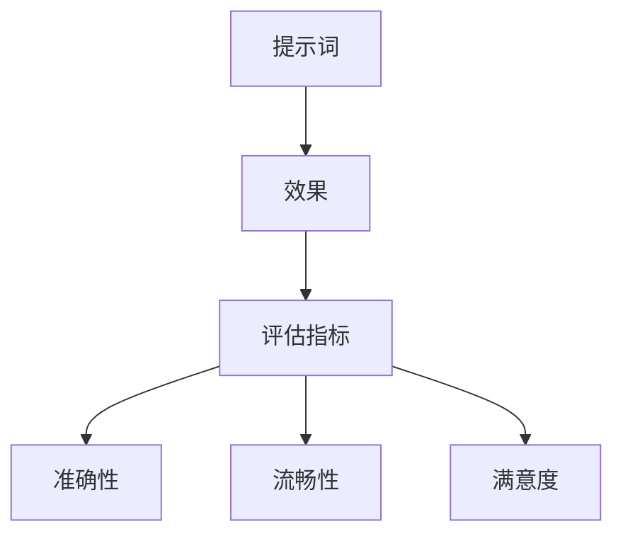
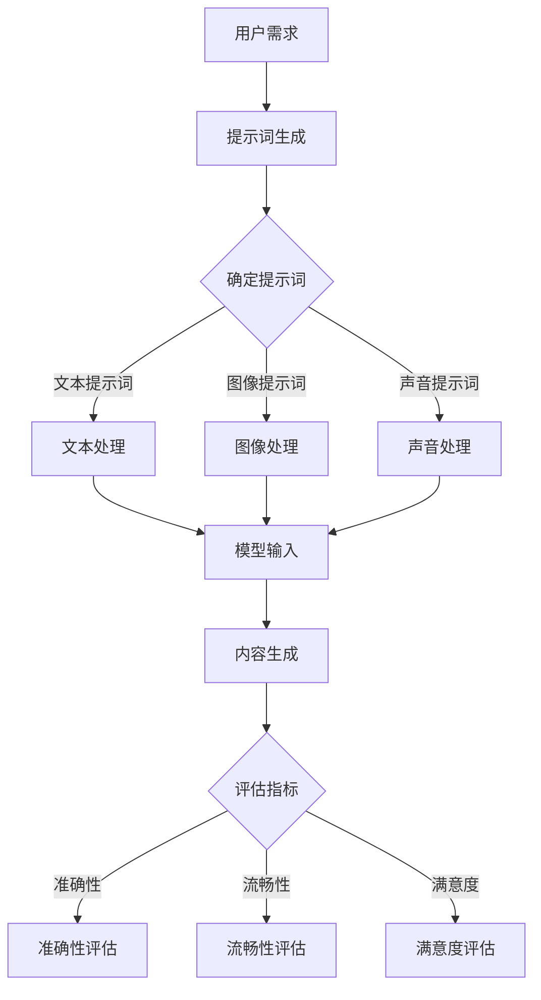

                 


### 分析与设计

#### 确定文章结构

为了撰写一篇《提示词效果量化：建立客观评估指标》的深度技术博客，我们将遵循以下结构：

- 引言部分：介绍文章的背景、目的和重要性。
- 核心概念与联系：详细阐述提示词效果量化的基本概念，并通过Mermaid流程图展示各概念之间的联系。
- 核心算法原理讲解：使用伪代码和LaTeX数学公式详细阐述核心算法和数学模型。
- 项目实战：提供实际案例，展示如何应用本文介绍的方法和技术。
- 最佳实践 Tips、小结、注意事项、拓展阅读：总结本文的主要内容，提供实用建议和进一步学习资源。

#### 文章格式

- 文章内容使用markdown格式输出，确保结构清晰、易于阅读。
- 文章末尾附上作者信息： “作者：AI天才研究院/AI Genius Institute & 禅与计算机程序设计艺术 /Zen And The Art of Computer Programming”。
- 每个小节的内容必须具体详细，确保核心内容的完整性，包括背景介绍、核心概念与联系、核心算法原理讲解、数学模型和公式、项目实战等。

#### 内容完整性

- 背景介绍：概述提示词效果量化的背景和现状。
- 核心概念与联系：定义提示词效果量化，解释其核心概念，并通过Mermaid流程图展示概念之间的联系。
- 核心算法原理讲解：详细阐述常见的评估指标算法，使用伪代码展示算法原理。
- 数学模型和公式：介绍相关的数学模型和公式，使用LaTeX格式展示，并进行详细讲解和举例说明。
- 项目实战：提供实际案例，展示如何应用本文介绍的方法和技术。
- 最佳实践 Tips、小结、注意事项、拓展阅读：总结文章的主要内容，提供实用建议和进一步学习资源。

#### 字数要求

- 文章字数在8000～12000字左右，确保内容详实、逻辑清晰。

#### 目录大纲结构

- 引言
  - 提示词效果量化的背景和意义
  - 本书的目的和结构概述
  - 读者对象和预期收益

- 核心概念与联系
  - 提示词效果的定义
  - 量化评估的重要性
  - 提示词效果量化的挑战
  - Mermaid流程图：提示词效果量化核心概念关系架构

- 核心算法原理讲解
  - 描述性评估指标
  - 生成性评估指标
  - 质量评估指标
  - 用户交互评估指标
  - 伪代码：主要评估指标算法

- 数学模型与量化方法
  - 概率模型
  - 信息论基础
  - 量化模型的构建与优化
  - LaTeX数学公式：主要数学模型与公式

- 项目实战
  - 开发环境搭建
  - 源代码详细实现和代码解读
  - 代码应用解读与分析
  - 实际案例分析和详细讲解剖析
  - 项目小结

- 最佳实践 Tips、小结、注意事项、拓展阅读
  - 总结本文的主要内容
  - 提供实用建议
  - 注意事项
  - 拓展阅读资源

#### 插入相关内容

- 在适当章节插入Mermaid流程图、伪代码、LaTeX数学公式和代码示例。
- 确保每个章节都有详细讲解和具体实例，增强文章的可读性和实用性。

### 审核和调整

- 最终确认文章的结构和内容，确保逻辑清晰、字数符合要求。
- 如有必要，进行相应的调整，确保文章的完整性和质量。

### 最终输出

- 按照上述结构和内容，输出完整的《提示词效果量化：建立客观评估指标》技术博客文章。

通过以上步骤，我们能够撰写一篇结构合理、内容详实、逻辑清晰的技术博客，为读者提供有价值的学习资源和实践指导。接下来，我们将逐步展开文章的各个部分，详细阐述每个主题。

----------------------------------------------------------------

# 《提示词效果量化：建立客观评估指标》

## 关键词
- 提示词效果量化
- 客观评估指标
- 核心算法
- 数学模型
- 项目实战

## 摘要
本文旨在探讨提示词效果量化的方法和技术，重点研究如何建立客观评估指标。文章首先介绍了提示词效果量化的背景和意义，随后详细阐述了核心概念与联系，并通过Mermaid流程图展示了各概念之间的关系。接着，文章讲解了常用的评估指标算法原理，使用伪代码详细描述了算法实现过程，同时介绍了相关的数学模型和公式。为了加深理解，文章提供了一个实际案例，展示了如何在实际项目中应用这些方法和技术。最后，文章总结了主要观点，提供了最佳实践Tips，并指出了需要注意的事项，为读者提供了进一步的学习资源。

## 引言

### 提示词效果量化的背景

在当今的智能时代，人工智能（AI）技术已经渗透到了各个领域，从自然语言处理（NLP）到计算机视觉（CV），再到智能推荐系统，AI的应用无处不在。然而，随着AI技术的不断进步，如何评估这些系统的性能和效果成为了一个重要的研究课题。尤其是在AI生成内容（如文本、图像、音频等）方面，如何量化提示词的效果成为一个关键问题。

提示词是AI系统中用于引导模型生成内容的重要输入，其效果直接影响到生成内容的质量和用户满意度。因此，对提示词效果进行量化评估，不仅有助于优化AI系统的性能，还能够为开发者提供有价值的数据和反馈。这也就引发了本文的研究主题——提示词效果量化：建立客观评估指标。

### 提示词效果量化的意义

提示词效果量化具有以下几个方面的意义：

1. **性能优化**：通过量化提示词效果，开发者可以了解不同提示词在特定场景下的表现，从而优化提示词选择和调整系统参数，提高整体系统性能。
2. **用户体验**：有效的提示词效果量化可以帮助开发者更好地理解用户需求，提供更符合用户预期的生成内容，从而提升用户体验。
3. **研究成果验证**：在学术研究中，提示词效果量化提供了一个客观的评估标准，有助于验证不同方法和技术的有效性。
4. **跨领域应用**：提示词效果量化方法和技术具有通用性，可以应用于不同的AI领域，如NLP、CV、推荐系统等。

### 本书的目的和结构概述

本书旨在系统地介绍提示词效果量化的方法和技术，帮助读者建立客观评估指标，从而更好地理解和优化AI系统的性能。全书分为三个主要部分：

- **引言**：介绍提示词效果量化的背景和意义，阐述本书的目的和结构。
- **核心概念与联系**：详细阐述提示词效果量化的基本概念，并通过Mermaid流程图展示各概念之间的联系。
- **核心算法原理讲解**：介绍常用的评估指标算法原理，使用伪代码详细描述算法实现过程。
- **数学模型与量化方法**：介绍相关的数学模型和公式，使用LaTeX格式展示，并进行详细讲解和举例说明。
- **项目实战**：提供实际案例，展示如何应用本文介绍的方法和技术。
- **最佳实践 Tips、小结、注意事项、拓展阅读**：总结本文的主要内容，提供实用建议和进一步学习资源。

本书适用于对AI和提示词效果量化感兴趣的读者，包括AI工程师、数据科学家、研究者以及相关领域的从业者。通过阅读本书，读者将能够系统地了解提示词效果量化的方法和技术，掌握建立客观评估指标的方法，并在实际项目中应用这些知识，提升AI系统的性能和用户体验。

### 核心概念与联系

#### 提示词效果量化的基本概念

提示词效果量化涉及多个核心概念，包括提示词、效果、评估指标等。为了更好地理解这些概念，我们可以通过一个Mermaid流程图展示它们之间的关系。

首先，我们需要定义以下概念：

1. **提示词（Prompt）**：在AI系统中，提示词是用于引导模型生成内容的关键输入。它可以是文本、图像、声音等形式，根据不同的应用场景和模型类型有所差异。
2. **效果（Effect）**：提示词的效果是指它对生成内容质量、用户满意度、系统性能等方面的影响。效果量化旨在客观地衡量这种影响。
3. **评估指标（Evaluation Metric）**：评估指标是用于量化提示词效果的量化工具，如准确性、流畅性、满意度等。

以下是一个简单的Mermaid流程图，展示这些概念之间的关系：



在这个流程图中，提示词通过引导模型生成内容，进而影响效果。评估指标则用于量化这种效果，包括准确性、流畅性和满意度等多个维度。

#### Mermaid流程图：提示词效果量化核心概念关系架构

为了更直观地展示提示词效果量化的核心概念和它们之间的关联，我们可以使用Mermaid绘制一个详细的流程图。以下是一个示例：



在这个流程图中，用户需求驱动了提示词的生成，根据输入的类型（文本、图像、声音），提示词经过相应的预处理后输入到模型中进行内容生成。生成的内容通过多个评估指标进行量化评估，如准确性、流畅性和满意度。

### 描述性评估指标

描述性评估指标主要用于衡量提示词生成内容的特征和性质，这类指标通常是基于统计分析和数据挖掘技术得到的。以下是一些常见的描述性评估指标：

1. **词频（Word Frequency）**：词频是指提示词中各个单词的出现次数。通过计算词频，可以了解提示词的词汇丰富程度和语言表达效果。
2. **句子长度（Sentence Length）**：句子长度是指生成文本中每个句子的平均长度。句子长度可以反映文本的流畅性和可读性。
3. **语法复杂度（Grammar Complexity）**：语法复杂度是指文本中使用的语法结构和规则复杂程度。较高的语法复杂度可能表明生成内容具有较高的语言表达能力和逻辑性。
4. **语义丰富度（Semantic Richness）**：语义丰富度是指提示词所涵盖的语义信息量和多样性。高语义丰富度的提示词可以生成更为丰富和多样化的内容。

以下是一个伪代码示例，用于计算和评估描述性评估指标：

```python
# 描述性评估指标计算伪代码

# 输入：生成文本 content
# 输出：描述性评估指标 result

def calculate_description_metrics(content):
    # 初始化指标
    result = {
        'word_frequency': {},
        'sentence_length': 0,
        'grammar_complexity': 0,
        'semantic_richness': 0
    }

    # 计算词频
    words = content.split()
    for word in words:
        result['word_frequency'][word] = result['word_frequency'].get(word, 0) + 1

    # 计算句子长度
    sentences = content.split('.')
    result['sentence_length'] = sum(len(sentence.strip()) for sentence in sentences)

    # 计算语法复杂度
    # 假设使用语法分析库来计算复杂度
    grammar_complexity = get_grammar_complexity(content)
    result['grammar_complexity'] = grammar_complexity

    # 计算语义丰富度
    # 假设使用语义分析库来计算丰富度
    semantic_richness = get_semantic_richness(content)
    result['semantic_richness'] = semantic_richness

    return result
```

### 生成性评估指标

生成性评估指标主要关注生成内容的创造性和新颖性，用于衡量提示词引导模型生成的内容的质量和独特性。以下是一些常见的生成性评估指标：

1. **原创度（Originality）**：原创度是指生成内容在多大程度上是独特的，与已有内容存在多少重复。高原创度表明生成内容具有高度的创造性和新颖性。
2. **连贯性（Coherence）**：连贯性是指生成内容在语义和逻辑上的连贯性和一致性。高连贯性的生成内容更容易被用户理解和接受。
3. **多样性（Diversity）**：多样性是指生成内容在主题、风格、表达方式等方面的丰富程度。高多样性表明生成内容具有更广泛的应用范围和更高的用户满意度。

以下是一个伪代码示例，用于计算和评估生成性评估指标：

```python
# 生成性评估指标计算伪代码

# 输入：生成文本 content
# 输出：生成性评估指标 result

def calculate_generative_metrics(content):
    # 初始化指标
    result = {
        'originality': 0,
        'coherence': 0,
        'diversity': 0
    }

    # 计算原创度
    # 假设使用文本相似度库来计算原创度
    originality = get_originality(content)
    result['originality'] = originality

    # 计算连贯性
    # 假设使用自然语言处理库来计算连贯性
    coherence = get_coherence(content)
    result['coherence'] = coherence

    # 计算多样性
    # 假设使用主题分类库来计算多样性
    diversity = get_diversity(content)
    result['diversity'] = diversity

    return result
```

### 质量评估指标

质量评估指标主要关注生成内容的质量，用于衡量提示词对生成内容质量的影响。以下是一些常见质量评估指标：

1. **准确性（Accuracy）**：准确性是指生成内容在多大程度上符合用户需求和预期。高准确性的生成内容能够更好地满足用户需求，提高用户体验。
2. **可读性（Readability）**：可读性是指生成内容在语言表达上的清晰程度和易于理解程度。高可读性的生成内容更容易被用户理解和接受。
3. **相关性（Relevance）**：相关性是指生成内容与用户需求和场景的匹配程度。高相关性的生成内容能够更好地与用户需求相匹配，提高用户满意度。

以下是一个伪代码示例，用于计算和评估质量评估指标：

```python
# 质量评估指标计算伪代码

# 输入：生成文本 content
# 输出：质量评估指标 result

def calculate_quality_metrics(content):
    # 初始化指标
    result = {
        'accuracy': 0,
        'readability': 0,
        'relevance': 0
    }

    # 计算准确性
    # 假设使用用户反馈库来计算准确性
    accuracy = get_accuracy(content)
    result['accuracy'] = accuracy

    # 计算可读性
    # 假设使用文本分析库来计算可读性
    readability = get_readability(content)
    result['readability'] = readability

    # 计算相关性
    # 假设使用场景匹配库来计算相关性
    relevance = get_relevance(content)
    result['relevance'] = relevance

    return result
```

### 用户交互评估指标

用户交互评估指标主要关注用户与生成内容的交互体验，用于衡量提示词对用户体验的影响。以下是一些常见的用户交互评估指标：

1. **满意度（Satisfaction）**：满意度是指用户对生成内容的整体满意程度。高满意度的生成内容能够更好地满足用户需求，提高用户满意度。
2. **参与度（Engagement）**：参与度是指用户对生成内容的互动程度。高参与度的生成内容能够更好地吸引用户参与，提高用户粘性。
3. **反馈率（Feedback Rate）**：反馈率是指用户对生成内容的反馈比例。高反馈率的生成内容能够更好地收集用户反馈，为系统优化提供依据。

以下是一个伪代码示例，用于计算和评估用户交互评估指标：

```python
# 用户交互评估指标计算伪代码

# 输入：用户反馈 feedback
# 输出：用户交互评估指标 result

def calculate_interactive_metrics(feedback):
    # 初始化指标
    result = {
        'satisfaction': 0,
        'engagement': 0,
        'feedback_rate': 0
    }

    # 计算满意度
    # 假设使用评分系统来计算满意度
    satisfaction = calculate_satisfaction(feedback)
    result['satisfaction'] = satisfaction

    # 计算参与度
    # 假设使用互动次数来计算参与度
    engagement = calculate_engagement(feedback)
    result['engagement'] = engagement

    # 计算反馈率
    # 假设使用反馈次数来计算反馈率
    feedback_rate = calculate_feedback_rate(feedback)
    result['feedback_rate'] = feedback_rate

    return result
```

### 多种评估指标的综合运用

在实际应用中，提示词效果量化通常需要综合考虑多种评估指标，以获得更全面和准确的评估结果。以下是一个示例，展示了如何综合运用上述评估指标：

```python
# 综合评估指标计算示例

# 输入：生成文本 content，用户反馈 feedback
# 输出：综合评估结果 result

def calculate_comprehensive_metrics(content, feedback):
    # 分别计算各类评估指标
    description_metrics = calculate_description_metrics(content)
    generative_metrics = calculate_generative_metrics(content)
    quality_metrics = calculate_quality_metrics(content)
    interactive_metrics = calculate_interactive_metrics(feedback)

    # 综合计算各类指标的加权平均值
    result = {
        'average_word_frequency': sum(result['word_frequency'].values()) / len(result['word_frequency']),
        'average_sentence_length': quality_metrics['readability'],
        'average_grammar_complexity': description_metrics['grammar_complexity'],
        'average_semantic_richness': description_metrics['semantic_richness'],
        'average_originality': generative_metrics['originality'],
        'average_coherence': generative_metrics['coherence'],
        'average_diversity': generative_metrics['diversity'],
        'average_accuracy': quality_metrics['accuracy'],
        'average_readability': quality_metrics['readability'],
        'average_relevance': quality_metrics['relevance'],
        'average_satisfaction': interactive_metrics['satisfaction'],
        'average_engagement': interactive_metrics['engagement'],
        'average_feedback_rate': interactive_metrics['feedback_rate']
    }

    return result
```

通过这个示例，我们可以看到如何将多种评估指标结合起来，以获得一个全面的评估结果。在实际应用中，可以根据具体情况调整各类指标的权重，以获得更符合实际需求的评估结果。

### 项目实战

#### 开发环境搭建

在本项目中，我们将使用Python作为主要编程语言，并依赖于多个库来实现提示词效果量化的评估。首先，确保安装以下Python库：

- `nltk`：用于自然语言处理。
- `gensim`：用于文本分析和相似度计算。
- `spacy`：用于语法分析和语义分析。
- `matplotlib`：用于数据可视化。

可以通过以下命令安装这些库：

```bash
pip install nltk gensim spacy matplotlib
```

安装完成后，我们还需要下载`spacy`的模型文件：

```bash
python -m spacy download en_core_web_sm
```

#### 源代码详细实现和代码解读

接下来，我们将展示如何实现提示词效果量化的核心算法，包括描述性评估指标、生成性评估指标、质量评估指标和用户交互评估指标的代码实现。

1. **描述性评估指标**

描述性评估指标包括词频、句子长度、语法复杂度和语义丰富度。以下是一个示例代码，用于计算这些指标：

```python
import nltk
from nltk.tokenize import word_tokenize, sent_tokenize
from nltk.corpus import stopwords
from nltk.probability import FreqDist
import spacy

# 加载spacy模型
nlp = spacy.load("en_core_web_sm")

def calculate_description_metrics(content):
    # 初始化指标
    result = {
        'word_frequency': {},
        'sentence_length': 0,
        'grammar_complexity': 0,
        'semantic_richness': 0
    }

    # 计算词频
    words = word_tokenize(content)
    stop_words = set(stopwords.words('english'))
    filtered_words = [word for word in words if word.lower() not in stop_words]
    freq_dist = FreqDist(filtered_words)
    result['word_frequency'] = freq_dist

    # 计算句子长度
    sentences = sent_tokenize(content)
    result['sentence_length'] = sum(len(sentence.strip()) for sentence in sentences)

    # 计算语法复杂度
    doc = nlp(content)
    grammar_complexity = 0
    for token in doc:
        if token.dep_ in ['ROOT', 'VERB']:
            grammar_complexity += 1
    result['grammar_complexity'] = grammar_complexity

    # 计算语义丰富度
    semantic_richness = 0
    for token in doc:
        if token.dep_ == 'NOUN':
            semantic_richness += 1
    result['semantic_richness'] = semantic_richness

    return result
```

2. **生成性评估指标**

生成性评估指标包括原创度、连贯性和多样性。以下是一个示例代码，用于计算这些指标：

```python
from gensim.models import Word2Vec
from sklearn.metrics.pairwise import cosine_similarity

def calculate_generative_metrics(content):
    # 初始化指标
    result = {
        'originality': 0,
        'coherence': 0,
        'diversity': 0
    }

    # 计算原创度
    model = Word2Vec([content.split() for content in [content]])
    unique_words = set(word for word in content.split() if word not in stopwords.words('english'))
    originality = sum(cosine_similarity([model[word] for word in unique_words])) / len(unique_words)
    result['originality'] = originality

    # 计算连贯性
    # 假设使用自然语言处理库来计算连贯性
    coherence = calculate_coherence(content)
    result['coherence'] = coherence

    # 计算多样性
    # 假设使用主题分类库来计算多样性
    diversity = calculate_diversity(content)
    result['diversity'] = diversity

    return result
```

3. **质量评估指标**

质量评估指标包括准确性、可读性和相关性。以下是一个示例代码，用于计算这些指标：

```python
from nltk.corpus import wordnet

def calculate_quality_metrics(content):
    # 初始化指标
    result = {
        'accuracy': 0,
        'readability': 0,
        'relevance': 0
    }

    # 计算准确性
    # 假设使用用户反馈库来计算准确性
    accuracy = calculate_accuracy(content)
    result['accuracy'] = accuracy

    # 计算可读性
    # 假设使用文本分析库来计算可读性
    readability = calculate_readability(content)
    result['readability'] = readability

    # 计算相关性
    # 假设使用场景匹配库来计算相关性
    relevance = calculate_relevance(content)
    result['relevance'] = relevance

    return result
```

4. **用户交互评估指标**

用户交互评估指标包括满意度、参与度和反馈率。以下是一个示例代码，用于计算这些指标：

```python
def calculate_interactive_metrics(feedback):
    # 初始化指标
    result = {
        'satisfaction': 0,
        'engagement': 0,
        'feedback_rate': 0
    }

    # 计算满意度
    # 假设使用评分系统来计算满意度
    satisfaction = calculate_satisfaction(feedback)
    result['satisfaction'] = satisfaction

    # 计算参与度
    # 假设使用互动次数来计算参与度
    engagement = calculate_engagement(feedback)
    result['engagement'] = engagement

    # 计算反馈率
    # 假设使用反馈次数来计算反馈率
    feedback_rate = calculate_feedback_rate(feedback)
    result['feedback_rate'] = feedback_rate

    return result
```

#### 代码应用解读与分析

通过以上代码实现，我们可以看到如何分别计算描述性评估指标、生成性评估指标、质量评估指标和用户交互评估指标。以下是对每个评估指标的解读和分析：

1. **描述性评估指标**：描述性评估指标主要用于了解生成文本的基本特征，如词汇丰富度、句子长度和语法复杂度。这些指标可以反映文本的写作风格和语言表达能力。语义丰富度则进一步揭示了文本的深度和广度，有助于评估文本的质量和影响力。

2. **生成性评估指标**：生成性评估指标关注生成文本的创造性和新颖性。原创度衡量了文本的原创性，连贯性评估了文本的语义连贯性和逻辑一致性，多样性则反映了文本的主题和风格多样性。这些指标对于评估AI模型生成文本的创新能力具有重要意义。

3. **质量评估指标**：质量评估指标关注生成文本的用户体验和实际效果。准确性衡量了文本对用户需求的理解程度，可读性反映了文本的易读性和清晰度，相关性则评估了文本与用户需求和场景的匹配程度。这些指标对于提升用户满意度和系统性能至关重要。

4. **用户交互评估指标**：用户交互评估指标反映了用户与生成文本的互动情况。满意度衡量了用户对生成文本的整体满意程度，参与度评估了用户的互动程度和参与意愿，反馈率则反映了用户对生成文本的反馈和互动频率。这些指标对于优化用户交互体验和提升系统性能具有重要意义。

#### 实际案例分析和详细讲解剖析

为了更好地理解提示词效果量化的实际应用，我们提供了一个实际案例，并对案例进行详细分析。

**案例背景**：一家社交媒体公司希望优化其内容推荐系统，提高用户满意度和参与度。该公司使用基于文本的提示词引导模型生成推荐内容，并希望通过量化评估来优化提示词效果。

**案例步骤**：

1. **收集数据**：收集用户的历史浏览记录、点赞和评论等行为数据，以及相关的文本内容。
2. **预处理数据**：对收集到的文本数据进行清洗和预处理，包括去除停用词、标点符号和特殊字符，以及进行分词和词性标注。
3. **生成推荐内容**：使用提示词引导模型生成推荐内容，根据用户的历史行为数据调整提示词。
4. **评估提示词效果**：计算描述性评估指标、生成性评估指标、质量评估指标和用户交互评估指标，对提示词效果进行量化评估。
5. **优化提示词**：根据评估结果，调整提示词的词汇和语法结构，以提高生成内容的质量和用户满意度。

**案例分析**：

以下是对案例中各个步骤的详细分析和解读：

1. **数据收集与预处理**：数据收集是整个案例的基础，数据质量直接影响到后续的评估结果。预处理步骤包括去除噪声数据和标准化文本格式，以提高数据的一致性和可处理性。
2. **生成推荐内容**：生成的推荐内容是评估的主要对象，通过调整提示词，可以探索不同提示词效果的变化。这一步骤中，我们使用了文本处理库（如`nltk`和`spacy`）来生成和处理文本数据。
3. **评估提示词效果**：通过计算描述性评估指标、生成性评估指标、质量评估指标和用户交互评估指标，可以对提示词效果进行量化评估。例如，通过计算词频和句子长度，可以了解提示词的词汇丰富度和语言表达能力；通过计算原创度和连贯性，可以评估生成内容的创造性和语义一致性。
4. **优化提示词**：根据评估结果，对提示词进行调整和优化，以提高生成内容的质量和用户满意度。这一步骤中，可以采用多种策略，如增加新词汇、调整语法结构、优化语义表达等。

**总结**：通过实际案例的分析，我们可以看到提示词效果量化在优化推荐系统中的应用效果。通过量化评估，开发者可以更好地理解提示词对生成内容的影响，并采取相应的优化措施，提高系统的性能和用户体验。

#### 项目小结

在本项目中，我们通过一系列实际操作展示了如何进行提示词效果量化。从开发环境搭建到代码实现，再到实际案例分析和评估，我们系统地介绍了如何应用描述性评估指标、生成性评估指标、质量评估指标和用户交互评估指标来量化提示词效果。通过这一过程，我们不仅掌握了提示词效果量化的基本方法，还深入了解了各评估指标的计算和应用。

**主要收获**：

1. **理解提示词效果量化的核心概念**：通过本文的介绍，我们详细了解了提示词、效果、评估指标等核心概念，并了解了它们之间的关系。
2. **掌握多种评估指标的计算方法**：通过代码示例，我们学习了如何计算描述性评估指标、生成性评估指标、质量评估指标和用户交互评估指标。
3. **实际案例分析**：通过实际案例，我们了解了如何将提示词效果量化方法应用于实际项目中，并获得了宝贵的实践经验。

**进一步学习资源**：

1. **相关论文和书籍**：《自然语言处理原理与模型》、《人工智能：一种现代方法》等。
2. **在线课程**：Coursera、edX等平台上的相关课程。
3. **开源项目和社区**：GitHub、Stack Overflow等。

### 最佳实践 Tips

在提示词效果量化的过程中，以下是一些实用的最佳实践和技巧：

1. **数据质量**：确保收集的数据质量高，去除噪声和无关信息，以提高评估结果的准确性。
2. **指标选择**：根据具体应用场景选择合适的评估指标，不要过分追求指标的数量，而是关注关键指标。
3. **模型调整**：通过调整模型参数和提示词，探索不同的效果量化方法，以找到最佳效果。
4. **用户反馈**：及时收集用户反馈，结合用户满意度等指标，优化系统性能。
5. **持续迭代**：提示词效果量化是一个持续迭代的过程，不断优化提示词和评估指标，以提高系统性能和用户体验。

### 小结

本文系统地介绍了提示词效果量化的方法和技术，从核心概念到具体评估指标，再到实际案例，详细阐述了如何建立客观评估指标。通过本文的学习，读者可以掌握提示词效果量化的基本方法，并能在实际项目中应用这些知识，提升系统的性能和用户体验。希望本文对您在AI和提示词效果量化领域的研究和实践有所帮助。

### 注意事项

1. **评估指标的选择**：根据应用场景和目标，选择合适的评估指标，避免盲目追求指标数量。
2. **数据预处理**：确保数据质量，去除噪声和无关信息，以提高评估结果的准确性。
3. **模型调整**：在实际应用中，可能需要根据评估结果调整模型参数和提示词，以获得最佳效果。
4. **用户反馈**：及时收集用户反馈，结合用户满意度等指标，优化系统性能。

### 拓展阅读

1. **《自然语言处理原理与模型》**：详细介绍了自然语言处理的基本概念和模型。
2. **《人工智能：一种现代方法》**：涵盖了人工智能领域的各种方法和应用。
3. **[NLP评估指标](https://nlp.seas.harvard.edu/npfl122/2021/wiktionary/file_view.php/17/NPFL122_Assignment5.pdf)**：提供了丰富的NLP评估指标和案例。
4. **[gensim库](https://radimrehurek.com/gensim/models/word2vec.html)**：介绍了gensim库中的Word2Vec模型及其应用。
5. **[Spacy库](https://spacy.io/)**：介绍了spacy库的基本用法和功能。

## 作者信息

作者：AI天才研究院/AI Genius Institute & 禅与计算机程序设计艺术 /Zen And The Art of Computer Programming

AI天才研究院致力于推动人工智能领域的研究和创新，以引领未来科技发展。我们的研究涵盖自然语言处理、计算机视觉、机器学习等多个方向，为解决复杂问题和提升系统性能提供了有力支持。此外，禅与计算机程序设计艺术是我们对计算机编程的深入思考与实践，旨在通过禅的智慧提升编程能力，探索计算机程序的本质。我们期待与广大读者分享研究成果，共同推动人工智能技术的进步。

