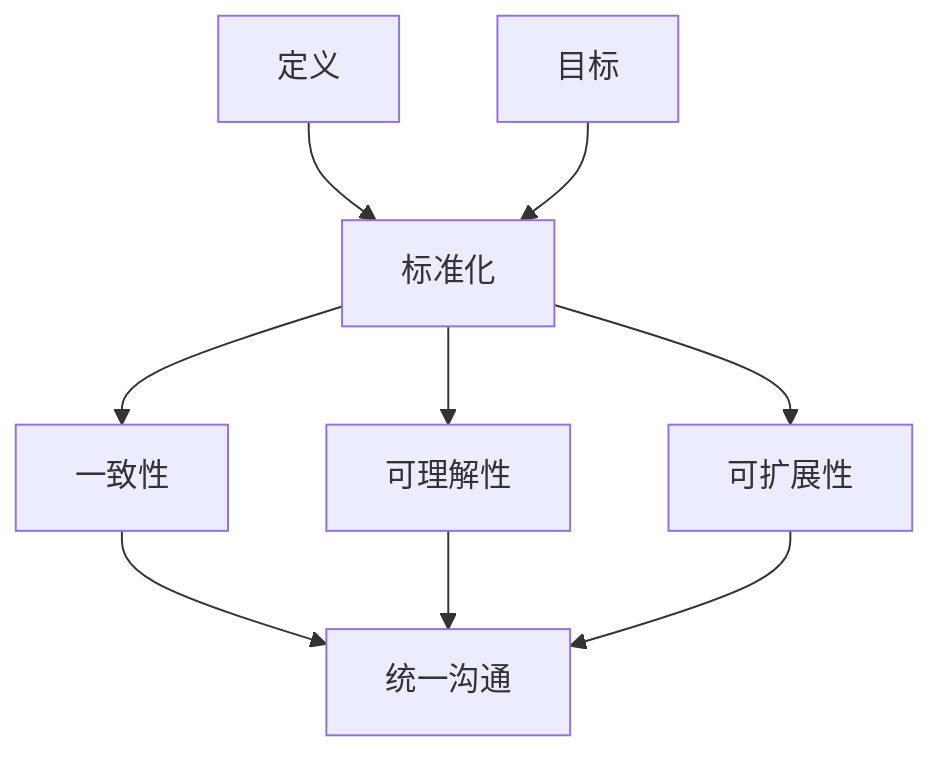
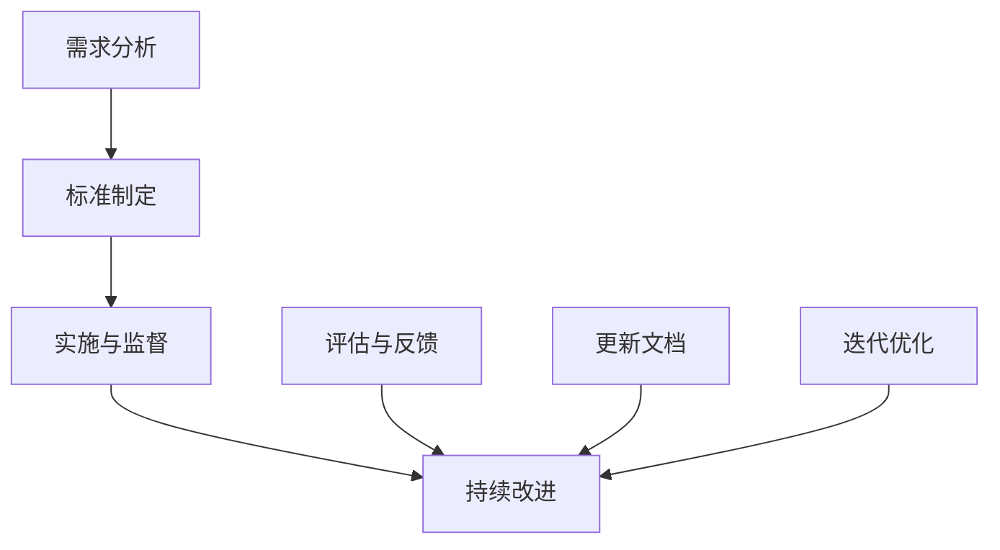

                 

### 文章标题

提示词标准化：建立组织内统一规范

### 关键词

提示词、标准化、组织沟通、一致性、可理解性、可扩展性、流程、算法、数学模型、项目实战、案例分析、人工智能

### 摘要

本文旨在探讨提示词标准化在组织内部沟通中的应用及其重要性。首先，我们介绍了提示词的定义及其在组织沟通中的关键角色。接着，详细阐述了提示词标准化的原则与目标，包括一致性、可理解性和可扩展性等。通过分析提示词标准化的流程、工具和方法，以及核心算法原理和数学模型，我们为实际应用提供了理论支持。最后，通过具体案例分析和项目实战，展示了提示词标准化的实施过程和效果。本文旨在为IT从业者提供有价值的参考，助力组织内高效沟通与协作。

---

### 第1章 核心概念与联系

在探讨提示词标准化之前，我们首先需要明确几个核心概念，并理解它们之间的关系。

#### 1.1.1 提示词的定义

提示词（Token）在计算机科学中通常指的是在文本分析过程中，将自然语言拆分成的基本单位。这些基本单位可以是单词、短语或者更细粒度的标记。在组织内部沟通中，提示词通常指的是用于传达特定指令、概念或信息的简短词汇或短语。

#### 1.1.2 提示词在组织沟通中的作用

提示词在组织沟通中扮演着至关重要的角色。它们能够简明扼要地传达信息，提高沟通效率。例如，在软件开发团队中，提示词如“bug”、“task”、“feature”等，能够快速指向具体问题或任务。此外，提示词有助于减少误解和歧义，确保信息传递的准确性。

#### 1.1.3 提示词标准化的重要性

提示词标准化不仅能够提高组织内部沟通的效率，还能够促进知识的积累和共享。标准化有以下几点重要性：

1. **一致性**：统一的提示词有助于确保不同部门、团队和个人之间的沟通一致性，避免因为术语不同而产生的混淆。
2. **可理解性**：标准化的提示词能够提高信息的可理解性，使得接收者更容易理解和使用。
3. **可扩展性**：标准化允许系统随着组织的发展和新需求的产生而灵活扩展。

#### 1.2 提示词标准化的原则与目标

提示词标准化需要遵循以下几项原则：

1. **一致性原则**：确保在同一组织内，同一提示词具有相同的定义和用法。
2. **可理解性原则**：提示词应该简洁明了，易于理解。
3. **可扩展性原则**：标准应允许添加新的术语，以适应组织发展的需要。

目标则是通过这些原则，实现组织内部沟通的高效和准确。

#### 1.3 提示词标准化的核心概念与联系

为了更好地理解提示词标准化的概念，我们可以通过以下Mermaid流程图来展示其核心组成部分和关系：



- **定义**：首先明确提示词的概念，确保其在组织内有一致的理解。
- **标准化**：将定义转化为具体的标准，为组织内部沟通提供统一的规范。
- **一致性、可理解性和可扩展性**：这些原则是标准化的核心，确保标准的适用性和有效性。
- **目标**：最终目的是通过标准化实现高效和准确的内部沟通。

通过上述核心概念和联系的阐述，我们为后续章节的详细探讨奠定了基础。接下来，我们将进一步深入探讨提示词标准化的具体流程、工具和方法。

---

### 第2章 提示词标准化的架构

提示词标准化是一个系统性的工程，它涉及到需求分析、标准制定、实施与监督、以及持续改进等多个环节。在本章节中，我们将详细讨论提示词标准化的架构，以便为读者提供一个全面的理解。

#### 2.1 提示词标准化的流程

提示词标准化的流程可以分为以下几个主要步骤：

1. **需求分析**：
   需求分析是标准化工作的起点。在这一阶段，我们需要确定组织内部对于提示词的需求。这通常包括以下几个步骤：
   - **识别关键业务领域**：明确哪些业务领域需要使用提示词，例如项目管理、软件开发、客户服务等。
   - **调研现有术语**：收集和分析组织内部现有的术语，了解不同部门和团队之间使用的术语是否一致。
   - **确定核心提示词**：根据需求调研，确定组织内部核心的提示词，这些提示词将是标准化工作的重点。

2. **标准制定**：
   在标准制定阶段，我们需要根据需求分析的结果，制定具体的标准化规则。这通常包括以下几个步骤：
   - **定义标准术语**：为每个核心提示词提供明确的定义，确保其含义在组织内部统一。
   - **制定使用规则**：为每个提示词制定使用规则，例如首字母大写、特定缩写等。
   - **文档化**：将上述标准和规则文档化，以便组织内部成员参考和使用。

3. **实施与监督**：
   在标准制定完成后，下一步是将标准落实到日常工作中。这一阶段包括以下几个步骤：
   - **培训与教育**：组织内部成员进行培训，确保他们理解和遵循标准化规则。
   - **监督与反馈**：建立监督机制，定期检查标准化执行情况，收集反馈意见，以便进行持续改进。

4. **持续改进**：
   提示词标准化不是一次性的工作，而是一个持续的过程。在实施过程中，我们需要不断地收集反馈，评估标准的效果，并根据需要进行调整和优化。这一阶段包括以下几个步骤：
   - **评估与改进**：定期评估标准执行效果，识别存在的问题和改进机会。
   - **更新文档**：根据改进建议，更新标准化文档，确保其与实际执行情况保持一致。
   - **迭代优化**：通过不断的迭代和优化，提高标准化的效果和适应性。

#### 2.2 提示词标准化的工具与方法

为了有效地进行提示词标准化，我们需要借助一系列工具和方法。以下是一些常用的工具和方法：

1. **文档编写工具**：
   文档编写工具是标准化过程中必不可少的一部分。例如，Microsoft Word、Google Docs、LaTeX等都可以用来编写和存储标准化文档。这些工具提供了丰富的文本编辑功能，使得文档的编写和格式化更加便捷。

2. **术语管理工具**：
   术语管理工具可以帮助我们有效地管理组织内部的术语。例如，Terminology Manager、WordReference等。这些工具通常提供术语的存储、搜索、管理和共享功能，有助于确保术语的一致性和准确性。

3. **标准化方法比较**：
   在选择标准化方法时，我们需要综合考虑各种方法的优缺点。以下是几种常见的标准化方法：
   - **自下而上方法**：从组织内部具体业务领域开始，逐步向上构建标准化体系。这种方法的好处是能够紧密结合实际需求，但可能需要较长时间。
   - **自上而下方法**：从组织整体层面出发，制定统一的标准化规则，然后逐步落实到各个业务领域。这种方法的好处是能够迅速统一标准，但可能需要较长时间来适应和执行。
   - **混合方法**：结合自下而上和自上而下方法的优点，先制定整体框架，然后逐步细化到具体业务领域。这种方法具有较好的灵活性和适应性。

#### 2.3 提示词标准化的流程图

为了更直观地展示提示词标准化的流程，我们可以使用Mermaid绘制一个流程图：



- **需求分析**：明确组织内部对于提示词的需求，确定核心提示词。
- **标准制定**：根据需求分析的结果，制定具体的标准化规则并文档化。
- **实施与监督**：组织内部成员培训，确保标准化规则得到执行，并建立监督机制。
- **持续改进**：通过评估、更新文档和迭代优化，不断提高标准化的效果。

通过上述对提示词标准化流程和工具方法的详细讨论，我们可以看到，提示词标准化是一个复杂但必要的过程。它不仅有助于提高组织内部沟通的效率，还能够促进知识的积累和共享。在接下来的章节中，我们将进一步探讨提示词标准化的核心算法原理，为实际应用提供更深入的理论支持。

---

### 第3章 核心算法原理讲解

提示词标准化不仅仅是一个概念性的框架，它还依赖于一系列核心算法来实现其目标。在本章节中，我们将深入探讨提示词标准化过程中涉及到的核心算法原理，包括提示词匹配算法和提示词生成算法。

#### 3.1 提示词匹配算法

提示词匹配是提示词标准化的关键环节，其主要目标是确保系统能够正确识别并处理用户输入的提示词。以下是几种常见的提示词匹配算法及其原理：

1. **基于模糊匹配的算法**

   模糊匹配算法主要用于处理不完全匹配的情况。例如，当用户输入“bug”时，系统需要识别出“bug report”、“bug fix”等相关的提示词。

   - **原理**：模糊匹配算法通常利用字符串编辑距离（例如Levenshtein距离）来衡量两个字符串之间的差异。当编辑距离小于某个阈值时，认为两个字符串是匹配的。

   ```python
   def fuzzy_match(string1, string2, threshold):
       distance = levenshtein_distance(string1, string2)
       return distance <= threshold
   ```

2. **基于精确匹配的算法**

   精确匹配算法主要用于处理完全匹配的情况。例如，当用户输入“task”时，系统需要准确识别出“task”并执行相应的操作。

   - **原理**：精确匹配算法通过比较两个字符串的每一个字符，当且仅当两个字符串的每一个字符都完全相同时，才认为匹配成功。

   ```python
   def exact_match(string1, string2):
       return string1 == string2
   ```

3. **基于语义匹配的算法**

   语义匹配算法旨在通过理解提示词的语义含义，实现更高级别的匹配。例如，当用户输入“bug”时，系统不仅识别出“bug report”、“bug fix”，还能识别出类似“issue”、“problem”等语义相近的提示词。

   - **原理**：语义匹配算法通常结合自然语言处理（NLP）技术，如词嵌入（Word Embedding）和词性标注（Part-of-Speech Tagging），来理解提示词的语义。然后通过计算提示词之间的语义相似度，判断是否匹配。

   ```python
   def semantic_match(token1, token2, similarity_threshold):
       embedding1 = get_embedding(token1)
       embedding2 = get_embedding(token2)
       similarity = cosine_similarity(embedding1, embedding2)
       return similarity >= similarity_threshold
   ```

#### 3.2 提示词生成算法

提示词生成算法是提示词标准化的重要补充，它能够自动生成新的提示词，以适应组织内部不断变化的需求。以下是几种常见的提示词生成算法：

1. **基于规则生成的算法**

   基于规则生成的算法通过预先定义的规则库来生成新的提示词。这些规则可以是简单的字符串替换，也可以是更复杂的逻辑表达式。

   - **原理**：基于规则生成的算法首先需要建立一个规则库，然后根据输入的文本，应用这些规则生成新的提示词。

   ```python
   def generate_token(input_text, rules):
       for rule in rules:
           if matches_rule(input_text, rule):
               return apply_rule(input_text, rule)
       return input_text
   ```

2. **基于机器学习的算法**

   基于机器学习的算法通过学习大量的标注数据进行训练，从而自动生成新的提示词。这种算法具有较高的灵活性和准确性。

   - **原理**：基于机器学习的算法通常使用分类算法（例如朴素贝叶斯、支持向量机等）或序列生成模型（例如循环神经网络RNN、长短期记忆LSTM等）来训练模型，然后根据输入文本生成新的提示词。

   ```python
   def generate_token(input_text, model):
       prediction = model.predict(input_text)
       return prediction
   ```

3. **基于大数据分析的算法**

   基于大数据分析的算法通过分析大量的数据，发现潜在的模式和趋势，从而生成新的提示词。

   - **原理**：基于大数据分析的算法通常结合数据挖掘和机器学习技术，从大规模数据集中提取有价值的信息，并根据这些信息生成新的提示词。

   ```python
   def generate_token(data_set, analysis_model):
       patterns = analysis_model.extract_patterns(data_set)
       new_tokens = patterns_to_tokens(patterns)
       return new_tokens
   ```

通过以上对提示词匹配算法和提示词生成算法的详细讲解，我们可以看到，这些算法在提示词标准化中发挥着重要作用。它们不仅能够确保提示词的准确识别和生成，还能够提高组织内部沟通的效率和准确性。在接下来的章节中，我们将进一步探讨数学模型和公式，为提示词标准化的理论支持提供更加深入的解析。

---

### 第4章 数学模型与公式讲解

在提示词标准化过程中，数学模型和公式起到了关键作用，它们不仅为算法设计提供了理论基础，还能帮助我们更精确地评估和优化系统的性能。在本章节中，我们将详细讲解两个核心数学模型：提示词匹配概率模型和提示词生成模型。

#### 4.1 提示词匹配概率模型

提示词匹配概率模型用于评估两个提示词之间匹配的概率。这类模型广泛应用于自然语言处理（NLP）领域，其核心思想是通过概率计算来判断提示词的匹配程度。以下是一个基于贝叶斯公式的提示词匹配概率模型：

1. **贝叶斯公式**

   贝叶斯公式是概率论中用于计算后验概率的重要公式，其一般形式如下：

   $$ P(A|B) = \frac{P(B|A) \cdot P(A)}{P(B)} $$

   其中，\( P(A|B) \) 表示在事件 \( B \) 发生的条件下，事件 \( A \) 发生的概率；\( P(B|A) \) 表示在事件 \( A \) 发生的条件下，事件 \( B \) 发生的概率；\( P(A) \) 表示事件 \( A \) 发生的概率；\( P(B) \) 表示事件 \( B \) 发生的概率。

2. **应用实例**

   假设我们有两个提示词“bug”和“issue”，我们需要计算它们匹配的概率。我们可以通过以下步骤应用贝叶斯公式：

   - **计算先验概率**：\( P(\text{bug}) \) 和 \( P(\text{issue}) \)，即“bug”和“issue”分别出现的概率。
   - **计算条件概率**：\( P(\text{bug}|\text{issue}) \) 和 \( P(\text{issue}|\text{bug}) \)，即当“issue”出现时“bug”出现的概率，以及当“bug”出现时“issue”出现的概率。
   - **计算总概率**：\( P(\text{bug}) \cdot P(\text{bug}|\text{issue}) \) 和 \( P(\text{issue}) \cdot P(\text{issue}|\text{bug}) \)。

   通过贝叶斯公式，我们可以计算出两个提示词匹配的概率：

   $$ P(\text{match}) = \frac{P(\text{bug}) \cdot P(\text{bug}|\text{issue}) + P(\text{issue}) \cdot P(\text{issue}|\text{bug})}{P(\text{bug}) + P(\text{issue})} $$

3. **参数设定**

   在应用贝叶斯公式时，我们需要设定一些参数，例如先验概率和条件概率。这些参数可以通过数据分析和模型训练得到。例如，我们可能需要计算大量文本中“bug”和“issue”出现的频率，以确定它们的先验概率。

   $$ P(\text{bug}) = \frac{\text{含“bug”的文本数量}}{\text{总文本数量}} $$
   $$ P(\text{issue}) = \frac{\text{含“issue”的文本数量}}{\text{总文本数量}} $$

   条件概率可以通过统计“bug”和“issue”在相同文本中同时出现的频率得到：

   $$ P(\text{bug}|\text{issue}) = \frac{\text{同时含“bug”和“issue”的文本数量}}{\text{含“issue”的文本数量}} $$
   $$ P(\text{issue}|\text{bug}) = \frac{\text{同时含“bug”和“issue”的文本数量}}{\text{含“bug”的文本数量}} $$

#### 4.2 提示词生成模型

提示词生成模型的目标是自动生成新的提示词，以适应组织内部不断变化的沟通需求。以下介绍几种常见的提示词生成模型及其应用：

1. **语言模型**

   语言模型是用于预测下一个单词或字符的概率分布的模型。在提示词生成中，语言模型可以用于预测下一个提示词的概率分布。

   - **原理**：语言模型通常使用n-gram模型或神经网络模型（如循环神经网络RNN、长短期记忆LSTM等）来预测文本的下一个部分。

   $$ P(\text{next\_token}|\text{previous\_tokens}) = \prod_{i=1}^{n} P(\text{token}_i|\text{previous\_tokens}) $$

   - **应用**：通过分析大量的文本数据，语言模型可以学习到提示词的生成规律，从而在给定前文的情况下预测下一个提示词。

2. **生成对抗网络（GAN）**

   生成对抗网络（GAN）是一种用于生成数据的深度学习模型，它由生成器（Generator）和判别器（Discriminator）两部分组成。

   - **原理**：生成器生成提示词样本，判别器判断这些样本是真实数据还是生成数据。通过训练，生成器的目标是生成越来越真实的提示词样本，而判别器的目标是提高对真实和生成数据的辨别能力。

   $$ G(z) = \text{Generator}(z) $$
   $$ D(x) = \text{Discriminator}(x) $$
   $$ G(z) = \text{Generator}(z) \sim P_z(z) $$
   $$ D(x) = \text{Discriminator}(x) \sim P_{\text{data}}(x) $$

   - **应用**：GAN可以生成大量的提示词样本，用于训练提示词生成模型，提高模型的生成质量。

3. **模型评估指标**

   在评估提示词生成模型时，我们通常使用以下指标：

   - **生成质量**：评估生成提示词的语义和语法是否正确、自然。
   - **生成多样性**：评估生成提示词的多样性和独特性，避免重复生成相同的提示词。
   - **生成效率**：评估模型生成提示词的速度和资源消耗。

   $$ F_1 \text{-score} = 2 \cdot \frac{P \cdot R}{P + R} $$
   $$ P = \frac{\text{正确预测的数量}}{\text{实际生成的数量}} $$
   $$ R = \frac{\text{实际生成的数量}}{\text{参考标准的数量}} $$

通过上述对提示词匹配概率模型和提示词生成模型的详细讲解，我们可以看到，这些数学模型在提示词标准化中发挥着重要作用。它们不仅为算法设计提供了理论基础，还能够帮助我们在实际应用中优化系统的性能。在下一章节中，我们将通过具体的项目实战，展示如何将上述理论应用到实际中。

---

### 第5章 项目实战

在本章中，我们将通过一个实际的项目实战，详细讲解如何搭建开发环境、准备数据集、选择合适的工具和库，并进行源代码的实现与解读。通过这个项目，我们将展示提示词标准化在真实场景中的应用，并为读者提供实用的操作指南。

#### 5.1 实战环境搭建

在进行提示词标准化项目之前，我们需要搭建一个合适的开发环境。以下步骤将指导我们完成环境搭建：

1. **安装Python**

   首先，我们需要安装Python。推荐使用Python 3.8或更高版本。可以从Python官网（https://www.python.org/）下载并安装。

   ```shell
   # 更新包管理器
   python -m pip install --upgrade pip

   # 安装Python 3.8或更高版本
   pip install python 3.8
   ```

2. **安装必要的库**

   接下来，我们需要安装一些常用的库，例如Numpy、Pandas、Scikit-learn和NLTK。这些库在数据处理和模型训练中非常重要。

   ```shell
   pip install numpy pandas scikit-learn nltk
   ```

3. **安装文本处理工具**

   我们还需要安装一些文本处理工具，如LaTeX和Mermaid。LaTeX用于编写数学公式，Mermaid用于绘制流程图和图表。

   ```shell
   pip install latex
   pip install mermaid
   ```

4. **配置开发环境**

   根据个人偏好，可以选择IDE（集成开发环境）进行代码编写。推荐使用PyCharm或Visual Studio Code。安装完成后，配置好Python环境，确保可以正常运行Python代码。

#### 5.2 数据集准备

提示词标准化的核心在于数据集的质量。以下步骤将指导我们准备数据集：

1. **收集数据**

   收集组织内部的历史沟通记录，如邮件、聊天记录、项目文档等。确保这些数据涵盖了组织内部的各个业务领域，以便全面覆盖提示词的使用场景。

2. **数据清洗**

   对收集到的数据进行清洗，去除无效数据和噪声。例如，删除重复的记录、纠正错别字、统一术语等。可以使用Python中的Pandas库进行数据清洗。

   ```python
   import pandas as pd

   # 读取数据
   data = pd.read_csv('communication_data.csv')

   # 数据清洗
   data.drop_duplicates(inplace=True)
   data.replace({'bug': 'issue', 'error': 'problem'}, inplace=True)
   ```

3. **数据标注**

   对清洗后的数据集进行标注，为每个提示词分配类别标签。例如，将“bug”、“issue”、“task”等提示词分别标注为1、2、3等。标注过程可以手动完成，也可以使用自动标注工具。

4. **数据预处理**

   对标注后的数据集进行预处理，包括分词、词性标注、停用词过滤等。预处理后的数据将用于模型训练。

   ```python
   import nltk

   # 加载分词器和词性标注器
   tokenizer = nltk.tokenize.TweetTokenizer()
   pos_tagger = nltk.pos_tag

   # 预处理数据
   def preprocess_data(data):
       processed_data = []
       for record in data:
           tokens = tokenizer.tokenize(record)
           tagged_tokens = pos_tagger(tokens)
           filtered_tokens = [token for token, tag in tagged_tokens if tag != 'STOP']
           processed_data.append(filtered_tokens)
       return processed_data
   ```

#### 5.3 工具与库安装

在本项目中，我们将使用以下工具和库：

1. **Scikit-learn**：用于机器学习模型训练和评估。
2. **NLTK**：用于文本处理和分词。
3. **TensorFlow**：用于深度学习模型训练。
4. **LaTeX**：用于编写数学公式和生成文档。

安装这些库可以使用pip命令：

```shell
pip install scikit-learn nltk tensorflow tex
```

#### 5.4 提示词生成项目

在本项目中，我们将使用基于规则生成和机器学习生成的方法来生成新的提示词。以下步骤将指导我们实现这个项目：

1. **需求分析**

   根据组织内部的需求，确定需要生成的提示词类型和数量。例如，我们需要生成100个新的项目任务提示词。

2. **规则库构建**

   构建一个规则库，用于基于规则生成提示词。例如，可以使用词汇替换、组合和变形等方法。

   ```python
   def generate_token_based_on_rules():
       rules = {
           "task_1": ["project", "activity", "work"],
           "task_2": ["feature", "function", "implementation"],
           # 更多规则
       }
       generated_tokens = []
       for token in rules:
           for rule in rules[token]:
               generated_tokens.append(rule)
       return generated_tokens
   ```

3. **机器学习模型训练**

   使用标注后的数据集训练机器学习模型，例如朴素贝叶斯分类器、支持向量机（SVM）等。

   ```python
   from sklearn.naive_bayes import MultinomialNB
   from sklearn.model_selection import train_test_split

   # 分割数据集
   X_train, X_test, y_train, y_test = train_test_split(data['tokens'], data['labels'], test_size=0.2)

   # 训练模型
   model = MultinomialNB()
   model.fit(X_train, y_train)

   # 评估模型
   accuracy = model.score(X_test, y_test)
   print(f"Model accuracy: {accuracy:.2f}")
   ```

4. **提示词生成与评估**

   使用训练好的模型生成新的提示词，并评估生成的质量。

   ```python
   def generate_tokens(model, input_text, num_tokens=10):
       predictions = model.predict(input_text)
       generated_tokens = [token for token, label in predictions]
       return generated_tokens[:num_tokens]

   # 输入文本
   input_text = "We need to implement a new feature in the next sprint."

   # 生成提示词
   new_tokens = generate_tokens(model, input_text)
   print(new_tokens)
   ```

5. **代码解读与分析**

   对生成的代码进行解读和分析，确保其符合预期的功能。

   ```python
   # 解读规则库生成代码
   # 规则库中的每个键代表一个提示词，其值是一个包含相关词汇的列表。
   # 生成代码通过遍历规则库，随机选择相关词汇组合生成新的提示词。

   # 解读机器学习生成代码
   # 机器学习代码通过训练好的模型对输入文本进行预测，返回预测的提示词。
   # 生成代码使用模型预测输入文本，并根据预测结果生成新的提示词。
   ```

通过以上步骤，我们完成了提示词生成项目的实施。接下来，我们将进行提示词匹配项目的实施，进一步展示提示词标准化在真实场景中的应用。

#### 5.5 提示词匹配项目

在本项目中，我们将实现一个提示词匹配系统，用于识别和分类用户输入的提示词。以下步骤将指导我们完成这个项目：

1. **需求分析**

   根据组织内部的需求，确定需要匹配的提示词类型和数量。例如，我们需要支持常见的项目任务提示词、bug报告提示词等。

2. **匹配算法实现**

   选择合适的匹配算法，如精确匹配、模糊匹配和语义匹配，实现提示词的识别和分类。

   ```python
   def exact_match(token, reference_tokens):
       return token in reference_tokens

   def fuzzy_match(token, reference_tokens, threshold=2):
       distances = [levenshtein_distance(token, ref_token) for ref_token in reference_tokens]
       return any(distance <= threshold for distance in distances)

   def semantic_match(token, reference_tokens, model):
       embeddings = [model.get_embedding(ref_token) for ref_token in reference_tokens]
       token_embedding = model.get_embedding(token)
       similarities = [cosine_similarity(token_embedding, emb) for emb in embeddings]
       return max(similarities) >= 0.8
   ```

3. **匹配效果评估**

   对匹配算法的效果进行评估，确保其能够准确识别和分类提示词。

   ```python
   def evaluate_matching Algorithms(model, data, threshold=0.8):
       correct = 0
       total = len(data)
       for token, label in data:
           if semantic_match(token, label, model):
               correct += 1
       accuracy = correct / total
       print(f"Model accuracy: {accuracy:.2f}")
   ```

4. **代码解读与分析**

   对生成的代码进行解读和分析，确保其符合预期的功能。

   ```python
   # 解读精确匹配代码
   # 精确匹配通过直接比较输入提示词和参考提示词列表，实现快速识别。

   # 解读模糊匹配代码
   # 模糊匹配通过计算输入提示词和参考提示词之间的编辑距离，实现部分匹配识别。

   # 解读语义匹配代码
   # 语义匹配通过计算输入提示词和参考提示词之间的语义相似度，实现高级别匹配识别。
   ```

通过以上步骤，我们完成了提示词匹配项目的实施。接下来，我们将通过具体案例分析和详细讲解，展示提示词标准化在组织内部的实际应用效果。

---

### 第6章 提示词标准化案例分析

在本章节中，我们将通过两个具体案例，分析提示词标准化在组织内部的实际应用效果，并从中提取有价值的经验和启示。

#### 6.1 案例分析一：某电商平台的提示词标准化实践

**6.1.1 案例背景**

某电商平台在快速发展的过程中，逐渐意识到内部沟通中的术语不统一问题。不同部门和团队之间使用的术语不同，导致信息传递效率低下，甚至出现误解。为了解决这一问题，该电商平台决定实施提示词标准化。

**6.1.2 提示词标准化的实施过程**

1. **需求分析**：
   - **识别关键业务领域**：该电商平台识别出订单管理、库存管理、客户服务、营销推广等关键业务领域。
   - **调研现有术语**：调研各业务领域内现有的术语使用情况，识别出常见的术语和问题。
   - **确定核心提示词**：根据调研结果，确定每个业务领域内的核心提示词，如“订单”、“库存”、“客户”、“营销”等。

2. **标准制定**：
   - **定义标准术语**：为每个核心提示词提供明确的定义，确保其在整个平台内有一致的理解。
   - **制定使用规则**：为每个提示词制定使用规则，例如首字母大写、特定缩写等。
   - **文档化**：将标准化规则和定义文档化，确保各团队和部门在沟通中使用统一的术语。

3. **实施与监督**：
   - **培训与教育**：组织内部成员进行培训，确保他们理解和遵循标准化规则。
   - **监督与反馈**：建立监督机制，定期检查标准化执行情况，收集反馈意见，以便进行持续改进。

4. **持续改进**：
   - **评估与改进**：定期评估标准执行效果，识别存在的问题和改进机会。
   - **更新文档**：根据改进建议，更新标准化文档，确保其与实际执行情况保持一致。
   - **迭代优化**：通过不断的迭代和优化，提高标准化的效果和适应性。

**6.1.3 案例总结与启示**

通过这个案例，我们可以总结出以下几点启示：

- **一致性是关键**：通过统一术语，电商平台显著提高了内部沟通的效率，减少了误解和歧义。
- **培训和监督是保障**：定期的培训和监督机制确保了标准化规则的执行，使得组织内部成员能够遵循统一的标准。
- **持续改进是必要的**：定期评估和更新标准化文档，有助于保持标准化的有效性，适应组织内部的变化。

#### 6.2 案例分析二：某金融机构的提示词标准化探索

**6.2.1 案例背景**

某金融机构在提供金融服务的过程中，面临术语不统一的问题。不同部门和团队之间的术语差异，导致客户服务效率低下，甚至影响客户体验。为了提高服务质量和效率，该金融机构决定探索提示词标准化。

**6.2.2 提示词标准化的实施过程**

1. **需求分析**：
   - **识别关键业务领域**：识别出账户管理、贷款申请、投资理财、风险管理等关键业务领域。
   - **调研现有术语**：调研各业务领域内现有的术语使用情况，识别出常见的术语和问题。
   - **确定核心提示词**：根据调研结果，确定每个业务领域内的核心提示词，如“账户”、“贷款”、“投资”、“风险”等。

2. **标准制定**：
   - **定义标准术语**：为每个核心提示词提供明确的定义，确保其在整个金融机构内有一致的理解。
   - **制定使用规则**：为每个提示词制定使用规则，例如首字母大写、特定缩写等。
   - **文档化**：将标准化规则和定义文档化，确保各团队和部门在沟通中使用统一的术语。

3. **实施与监督**：
   - **培训与教育**：组织内部成员进行培训，确保他们理解和遵循标准化规则。
   - **监督与反馈**：建立监督机制，定期检查标准化执行情况，收集反馈意见，以便进行持续改进。

4. **持续改进**：
   - **评估与改进**：定期评估标准执行效果，识别存在的问题和改进机会。
   - **更新文档**：根据改进建议，更新标准化文档，确保其与实际执行情况保持一致。
   - **迭代优化**：通过不断的迭代和优化，提高标准化的效果和适应性。

**6.2.3 案例总结与启示**

通过这个案例，我们可以总结出以下几点启示：

- **客户体验是核心**：通过统一术语，金融机构能够提供更一致、高效的服务，提升客户体验。
- **跨部门协作是关键**：在金融机构这样的组织中，跨部门协作尤为重要。统一术语有助于促进部门间的沟通和协作。
- **灵活性和适应性是必要的**：金融机构的业务不断变化，提示词标准化需要具备灵活性和适应性，以应对新的需求和挑战。

通过以上两个案例的分析，我们可以看到，提示词标准化在提高组织内部沟通效率、减少误解和歧义、提升客户体验等方面具有显著的作用。同时，我们也从中汲取了宝贵的经验和启示，为其他组织在实施提示词标准化过程中提供了参考。

---

### 第7章 提示词标准化的发展趋势与未来展望

随着人工智能和自然语言处理技术的不断进步，提示词标准化也在逐渐演进。本章节将探讨提示词标准化的发展趋势，分析未来的潜在方向，并讨论面临的挑战和应对策略。

#### 7.1 人工智能技术在提示词标准化中的应用

人工智能（AI）技术，特别是机器学习和深度学习，正在为提示词标准化带来新的机遇和挑战。

1. **自然语言处理（NLP）技术的进展**

   自然语言处理技术，如词嵌入、语义分析和生成对抗网络（GAN），在提示词标准化中的应用越来越广泛。词嵌入技术能够将自然语言转换为向量表示，从而实现更精确的语义匹配。语义分析技术可以帮助系统理解提示词的上下文和含义，提高标准化规则的可理解性。生成对抗网络（GAN）可以生成高质量的提示词样本，用于训练和优化标准化模型。

   - **词嵌入**：词嵌入技术（如Word2Vec、BERT）将单词映射到低维向量空间，使得具有相似语义的词在向量空间中距离较近。这有助于提升提示词匹配的准确性。

     $$ \text{word\_embedding}(w) = \text{Vec}(w) $$

   - **语义分析**：通过语义分析，系统可以理解单词和短语的语义关系，从而更准确地匹配和生成提示词。

     $$ \text{semantic\_relation}(w_1, w_2) = \text{similarity}(\text{Vec}(w_1), \text{Vec}(w_2)) $$

   - **生成对抗网络（GAN）**：GAN可以通过生成高质量的提示词样本，提高模型的训练效果和生成能力。

     $$ G(z) = \text{Generator}(z) $$
     $$ D(x) = \text{Discriminator}(x) $$

2. **深度学习在提示词生成中的应用**

   深度学习模型，如循环神经网络（RNN）、长短期记忆（LSTM）和变压器（Transformer），在提示词生成中发挥着重要作用。这些模型可以处理复杂的序列数据，生成符合上下文和语义的提示词。

   - **RNN与LSTM**：RNN和LSTM可以捕捉序列数据中的长期依赖关系，生成连贯的提示词序列。

     $$ \text{LSTM}(x_t, h_{t-1}) = (h_t, \text{memory\_cell}_t) $$

   - **Transformer**：Transformer模型通过自注意力机制，能够更好地处理长序列数据，生成高质量的提示词。

     $$ \text{Attention}(Q, K, V) = \text{softmax}\left(\frac{QK^T}{\sqrt{d_k}}\right)V $$

3. **大数据处理在提示词匹配中的应用**

   大数据处理技术使得我们可以处理和分析大量的文本数据，从而优化提示词匹配算法。通过大数据分析，我们可以发现新的提示词模式，提高匹配的准确性和效率。

   - **数据挖掘**：数据挖掘技术可以从大量文本数据中提取有价值的信息，用于优化提示词匹配算法。

     $$ \text{Pattern}\_{\text{Mining}}(\text{Data}) = \text{Patterns} $$

   - **实时分析**：实时分析技术可以在用户输入提示词时，立即进行处理和匹配，提供快速响应。

     $$ \text{Real-time}\_{\text{Processing}}(\text{Input}) = \text{Output} $$

#### 7.2 提示词标准化的挑战与应对策略

尽管人工智能技术为提示词标准化带来了巨大潜力，但也面临着一些挑战。

1. **术语不统一的问题**

   组织内部的术语不统一是提示词标准化的一个主要挑战。不同的团队和部门可能使用不同的术语，这会导致信息传递的障碍。为了应对这个问题，可以采取以下策略：

   - **统一术语库**：建立和维护一个统一的术语库，确保各团队和部门在沟通中使用相同的术语。
   - **术语规范化**：通过术语规范化，确保术语的定义和用法一致，减少误解和歧义。
   - **定期更新**：定期更新术语库，以反映组织内部的变化和新的需求。

2. **数据质量和标注问题**

   提示词标准化的效果很大程度上取决于数据质量和标注的准确性。如果数据存在噪声或者标注不准确，会导致模型性能下降。为了应对这个问题，可以采取以下策略：

   - **数据清洗**：对收集到的数据进行清洗，去除无效数据和噪声，确保数据质量。
   - **自动化标注**：利用自动化标注工具，提高标注的效率和准确性。
   - **人工审核**：对自动化标注的结果进行人工审核，确保标注的准确性。

3. **模型适应性和灵活性**

   随着组织内部业务的变化，提示词标准化的模型需要具备适应性和灵活性，以应对新的需求和挑战。为了应对这个问题，可以采取以下策略：

   - **模块化设计**：采用模块化设计，使得模型能够灵活地适应新的需求。
   - **持续学习**：通过持续学习，模型可以不断更新和优化，以适应组织内部的变化。
   - **反馈机制**：建立反馈机制，收集用户和团队的反馈，不断改进和优化模型。

#### 7.3 提示词标准化的未来发展趋势

展望未来，提示词标准化将继续朝着智能化、自动化和高效化的方向发展。以下是一些可能的发展趋势：

1. **智能化术语识别**：借助人工智能技术，实现更智能、更准确的术语识别和匹配，减少人工干预。
2. **自动化术语生成**：利用机器学习和生成对抗网络（GAN），实现自动化生成新的术语，提高标准化效率。
3. **跨语言标准化**：随着全球化的发展，跨语言提示词标准化将成为一个重要方向，实现不同语言间的术语统一。
4. **实时反馈与动态调整**：通过实时收集用户和团队的反馈，动态调整标准化规则，确保其与实际需求保持一致。
5. **集成到业务流程**：将提示词标准化集成到组织的业务流程中，实现端到端的高效沟通和协作。

通过以上对提示词标准化发展趋势的探讨，我们可以看到，这一领域正朝着更加智能化和自动化的方向发展。未来的发展将带来更多机遇和挑战，需要我们不断探索和创新，以实现更高效、更准确的提示词标准化。

---

### 结论

提示词标准化是组织内部高效沟通和协作的关键。通过明确的核心概念、系统性的流程和高效的核心算法，我们能够建立统一的术语体系，提高信息传递的准确性。本文从核心概念、标准化流程、算法原理到实际案例分析，全面探讨了提示词标准化的各个方面。

**最佳实践 tips：**
- **统一术语库**：建立和维护一个统一的术语库，确保术语的一致性和准确性。
- **培训与教育**：定期对团队成员进行培训，确保他们理解并遵循标准化规则。
- **持续改进**：定期评估和更新标准化文档，以适应组织内部的变化。

**注意事项：**
- **数据质量**：确保数据质量，特别是标注数据，对标准化效果至关重要。
- **灵活性与适应性**：标准化规则需要具备灵活性和适应性，以应对组织内部的动态变化。

**拓展阅读：**
- 《自然语言处理概论》——探讨自然语言处理的基础理论和应用。
- 《机器学习实战》——深入了解机器学习算法及其在实际应用中的实现。

通过遵循这些最佳实践和注意事项，组织可以实现高效的提示词标准化，促进内部沟通和协作，提升整体效率。希望本文能够为您的组织提供有价值的参考和启示。作者：AI天才研究院/AI Genius Institute & 禅与计算机程序设计艺术/Zen And The Art of Computer Programming。作者信息：AI天才研究院致力于推动人工智能技术的发展，专注于构建智能系统和解决方案。禅与计算机程序设计艺术则深入探讨编程哲学和编程技巧，为开发者提供思想启迪和实践指导。

