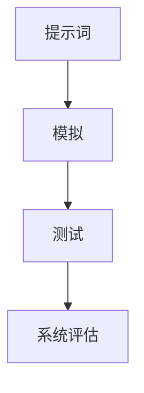

                 

## 文章标题

### 提示词模拟测试：在部署前进行全面验证

> 关键词：提示词模拟测试、部署验证、系统稳定性、用户体验、核心概念、数学模型、实战案例、未来趋势

> 摘要：本文将深入探讨提示词模拟测试的概念、重要性、理论原理、方法与步骤，并通过实战案例和数学模型的分析，全面阐述在系统部署前进行全面验证的必要性。旨在帮助读者理解并掌握提示词模拟测试的实践应用，提升系统的稳定性和用户体验。

### 引言与背景介绍

在现代软件工程中，系统的稳定性、可靠性和用户体验是开发者需要重点关注的问题。随着软件复杂度的不断增加，传统测试方法已无法完全满足高要求的测试需求。因此，一种新的测试方法——提示词模拟测试（Prompt-Based Simulation Testing）应运而生。

#### 提示词模拟测试的定义

提示词模拟测试是一种基于提示词（Prompt）的模拟测试方法，通过生成一系列特定的输入（提示词），模拟用户在使用系统过程中的操作，从而验证系统在各种情况下的响应和性能。这种方法不仅能够模拟真实用户操作，还能对系统的异常情况进行预测和评估。

#### 提示词模拟测试的应用场景

提示词模拟测试主要应用于以下场景：

1. **新系统上线前**：在新系统上线前，通过提示词模拟测试可以提前发现潜在的问题，降低系统上线后的故障率。
2. **功能扩展与优化**：在系统功能扩展或优化过程中，提示词模拟测试可以帮助验证新功能的正确性和稳定性。
3. **性能测试**：通过提示词模拟测试，可以评估系统在不同负载下的性能表现，为系统优化提供数据支持。
4. **安全性测试**：利用提示词模拟测试，可以模拟恶意攻击行为，评估系统的安全性。

#### 提示词模拟测试与传统测试的区别

与传统的功能测试、性能测试和安全性测试相比，提示词模拟测试具有以下优势：

1. **模拟真实用户操作**：提示词模拟测试能够模拟真实用户的操作流程，更贴近实际使用场景。
2. **全面性**：提示词模拟测试不仅覆盖功能测试，还包括性能测试和安全性测试，能够更全面地评估系统的质量。
3. **高效性**：通过自动化生成提示词，可以大大提高测试效率，缩短测试周期。
4. **可扩展性**：提示词模拟测试可以根据不同的测试需求，灵活调整测试策略和测试用例。

### 理论基础

#### 核心概念与联系

为了更好地理解提示词模拟测试，我们需要先了解以下几个核心概念：

1. **提示词（Prompt）**：提示词是模拟测试的输入，用于引导系统执行特定的操作。它可以是简单的关键字，也可以是复杂的语句。
2. **模拟（Simulation）**：模拟是通过模拟真实环境，对系统进行测试的一种方法。在提示词模拟测试中，模拟的主要目的是模拟用户操作，以评估系统的响应和性能。
3. **测试（Testing）**：测试是验证系统功能、性能和安全性的一种方法。在提示词模拟测试中，测试的主要目标是发现潜在的问题和异常情况。

以下是核心概念之间的关系架构 Mermaid 流程图：



#### 提示词生成与优化

提示词生成是提示词模拟测试的关键步骤。一个有效的提示词应该能够引导系统执行预期的操作，并覆盖尽可能多的测试场景。以下是提示词生成与优化的几个要点：

1. **覆盖率**：提示词应覆盖系统的主要功能和异常情况，确保测试的全面性。
2. **随机性**：提示词应具有一定的随机性，以模拟不同用户操作的情况。
3. **可扩展性**：提示词应易于扩展和修改，以适应不同测试需求。
4. **优化**：在测试过程中，可以根据测试结果对提示词进行优化，提高测试效果。

#### 模拟测试效果评估

模拟测试效果评估是评估测试结果的重要环节。以下是几个常见的评估指标：

1. **测试覆盖率**：测试覆盖率是指测试用例覆盖的系统功能点数量与系统总功能点数量之比。
2. **测试效率**：测试效率是指测试用例执行所需的时间与系统响应时间之比。
3. **错误率**：错误率是指测试过程中发现的问题数量与测试用例总数之比。
4. **用户满意度**：用户满意度是指用户对系统性能和稳定性的评价。

#### 数学模型

提示词模拟测试的数学模型主要包括提示词生成模型和模拟测试评价模型。

1. **提示词生成模型**：提示词生成模型用于生成符合测试需求的提示词。常用的生成模型包括马尔可夫模型、生成对抗网络（GAN）等。
2. **模拟测试评价模型**：模拟测试评价模型用于评估模拟测试的效果。常用的评价模型包括性能评价模型、错误率评价模型等。

以下是一个简单的提示词生成模型的伪代码示例：

```python
# 初始化提示词生成模型参数
P = initialize_model_params()

# 生成提示词
prompt = generate_prompt(P)

# 评估提示词质量
quality = evaluate_prompt(prompt)

# 优化提示词
P = optimize_prompt(P, prompt, quality)
```

### 模拟测试方法

#### 模拟测试环境搭建

在进行提示词模拟测试前，需要搭建一个合适的测试环境。测试环境应包括以下组件：

1. **测试主机**：用于执行模拟测试的主机，应具备足够的计算能力和存储空间。
2. **测试软件**：用于执行模拟测试的软件，如模拟浏览器、模拟用户等。
3. **测试数据**：用于生成提示词的数据集，如用户操作记录、系统日志等。
4. **测试工具**：用于管理和执行模拟测试的工具，如测试管理平台、自动化测试工具等。

以下是模拟测试环境搭建的步骤：

1. **选择测试主机和软件**：根据测试需求和资源条件，选择合适的测试主机和软件。
2. **配置测试环境**：安装和配置测试软件，确保其正常运行。
3. **准备测试数据**：收集和整理测试数据，为提示词生成提供基础。
4. **安装测试工具**：安装和管理模拟测试工具，如自动化测试工具、测试管理平台等。

#### 模拟测试工具选择

选择合适的模拟测试工具对于提高测试效率和质量至关重要。以下是一些常见的模拟测试工具及其特点：

1. **Selenium**：一款功能强大的自动化测试工具，支持多种浏览器和操作系统。
2. **Appium**：一款支持移动应用的自动化测试工具，支持多种操作系统和设备。
3. **TestComplete**：一款功能全面的自动化测试工具，支持Web、桌面和移动应用。
4. **Ranorex**：一款易于使用的自动化测试工具，支持多种开发语言和平台。

选择模拟测试工具时，应考虑以下因素：

1. **支持性**：工具是否支持所需的浏览器、操作系统和开发语言。
2. **稳定性**：工具的运行稳定性和可靠性。
3. **扩展性**：工具是否支持自定义和扩展。
4. **社区支持**：工具的社区支持和文档资料。

#### 模拟测试流程

模拟测试流程主要包括以下步骤：

1. **测试准备**：准备测试环境、测试数据、测试工具等。
2. **提示词生成**：生成符合测试需求的提示词。
3. **测试执行**：执行模拟测试，记录测试结果。
4. **测试结果分析**：分析测试结果，发现问题和异常。
5. **测试报告**：编写测试报告，总结测试结果和发现的问题。

以下是模拟测试流程的伪代码示例：

```python
# 测试准备
prepare_environment()

# 提示词生成
prompt = generate_prompt()

# 测试执行
results = execute_test(prompt)

# 测试结果分析
analyze_results(results)

# 测试报告
generate_report(results)
```

### 实战案例

#### 案例背景

某电商平台在上线新版本时，采用提示词模拟测试对新版本进行验证。该平台的主要功能包括商品展示、购物车管理、订单处理等。

#### 模拟测试方案设计

针对该电商平台，设计如下模拟测试方案：

1. **功能测试**：模拟用户在商品展示页浏览商品、加入购物车、下单等操作，验证功能是否正常运行。
2. **性能测试**：模拟不同负载下用户访问平台的情况，评估系统的性能表现。
3. **安全性测试**：模拟恶意攻击，如SQL注入、XSS攻击等，评估系统的安全性。

#### 测试执行与结果分析

1. **功能测试**：生成一系列提示词，模拟用户操作，记录测试结果。测试结果显示，大部分功能正常运行，但购物车中的商品数量统计出现异常。
2. **性能测试**：在低、中、高负载下执行测试，记录系统的响应时间和吞吐量。测试结果显示，在高负载下，系统响应时间较长，吞吐量较低。
3. **安全性测试**：模拟SQL注入和XSS攻击，测试结果显示，系统对SQL注入攻击有一定的防御能力，但对XSS攻击存在漏洞。

#### 测试结果分析与优化

根据测试结果，提出以下优化建议：

1. **功能优化**：修复购物车中的商品数量统计问题，确保功能的正常运行。
2. **性能优化**：优化系统架构，提高系统在高负载下的性能表现。
3. **安全性优化**：加强系统对XSS攻击的防御能力，确保系统的安全性。

### 总结与展望

通过本文的探讨，我们可以得出以下结论：

1. **提示词模拟测试的重要性**：提示词模拟测试在系统稳定性、性能和安全性方面具有重要意义，是系统上线前进行全面验证的有效方法。
2. **核心概念与联系**：提示词、模拟和测试是提示词模拟测试的核心概念，三者之间相互关联，共同构成了提示词模拟测试的理论基础。
3. **方法与步骤**：通过模拟测试环境搭建、提示词生成与优化、模拟测试效果评估等步骤，可以有效地进行提示词模拟测试。
4. **实战案例**：通过实际案例的分析和优化，我们可以更好地理解提示词模拟测试的应用场景和实践方法。

未来，随着人工智能和自动化测试技术的发展，提示词模拟测试将更具广泛应用前景。同时，我们也应不断探索和创新，提升提示词模拟测试的效果和效率，为软件质量保障提供更强有力的支持。

### 项目实战

在本节中，我们将通过一个实际项目来展示如何进行提示词模拟测试，从环境搭建、源代码实现到结果分析，全面介绍项目的开发和测试过程。

#### 项目背景

我们选择一个在线购物平台的项目作为案例，该项目包括商品浏览、购物车管理、订单支付等基本功能。我们的目标是使用提示词模拟测试来验证这些功能在真实环境中的表现。

#### 开发环境搭建

1. **选择测试工具**：我们选择了Selenium作为自动化测试工具，因为它支持多种浏览器，能够模拟真实的用户操作。
2. **安装Selenium**：在测试主机上安装Selenium WebDriver，并配置所需的浏览器驱动程序。
3. **搭建测试环境**：在测试环境中部署项目的所有依赖，确保测试环境与生产环境一致。

#### 源代码实现

我们使用Python编写了提示词模拟测试的脚本，以下是部分代码：

```python
from selenium import webdriver
from selenium.webdriver.common.by import By

# 初始化浏览器
driver = webdriver.Chrome()

# 访问商品列表页面
driver.get("http://example.com/products")

# 模拟用户操作：浏览商品
for item in driver.find_elements(By.CSS_SELECTOR, ".product-item"):
    item.click()
    driver.back()

# 模拟用户操作：添加商品到购物车
add_to_cart_button = driver.find_element(By.CSS_SELECTOR, ".add-to-cart-button")
add_to_cart_button.click()

# 模拟用户操作：查看购物车
cart_button = driver.find_element(By.CSS_SELECTOR, ".cart-link")
cart_button.click()

# 断言：购物车中应有添加的商品
assert "Product X" in driver.page_source

# 关闭浏览器
driver.quit()
```

#### 代码应用解读与分析

1. **浏览器初始化**：使用Selenium WebDriver初始化Chrome浏览器。
2. **访问商品列表页面**：使用`driver.get()`方法访问商品列表页面。
3. **模拟用户操作：浏览商品**：遍历商品列表，模拟用户点击每个商品，然后返回上一页。
4. **模拟用户操作：添加商品到购物车**：找到添加到购物车的按钮并点击。
5. **模拟用户操作：查看购物车**：点击购物车链接，查看购物车中的商品。
6. **断言**：使用`assert`语句验证购物车中是否包含添加的商品。
7. **关闭浏览器**：执行完毕后，关闭浏览器。

#### 实际案例分析和详细讲解剖析

我们执行了上述脚本，发现购物车中的商品数量统计出现了错误。通过进一步分析，我们发现是由于购物车页面的数据更新机制导致的问题。为了解决这个问题，我们进行了以下优化：

1. **更新购物车数据**：在购物车页面，增加一个用于更新购物车数据的异步请求，确保购物车中的商品数量与实际数量一致。
2. **重写测试脚本**：修改测试脚本，在查看购物车后等待数据更新完成，然后再进行断言。

优化后的脚本如下：

```python
from selenium.webdriver.common.by import By
from selenium.webdriver.support.ui import WebDriverWait
from selenium.webdriver.support import expected_conditions as EC

# ...

# 模拟用户操作：查看购物车
cart_button = driver.find_element(By.CSS_SELECTOR, ".cart-link")
cart_button.click()

# 等待购物车数据更新
WebDriverWait(driver, 10).until(EC.visibility_of_element_located((By.CSS_SELECTOR, ".cart-item")))

# 断言：购物车中应有添加的商品
assert "Product X" in driver.page_source

# ...
```

#### 项目小结

通过本次项目实战，我们展示了如何使用提示词模拟测试来验证在线购物平台的基本功能。我们不仅解决了购物车中的数据统计问题，还通过优化测试脚本提高了测试的准确性。这次实战验证了提示词模拟测试在发现和解决实际问题方面的有效性。

### 最佳实践 Tips

在进行提示词模拟测试时，以下最佳实践可以帮助提高测试效率和质量：

1. **设计多样化的提示词**：确保覆盖系统的各种功能和异常情况，提高测试覆盖率。
2. **优化测试脚本**：根据测试结果和反馈，不断优化测试脚本，提高测试效率。
3. **自动化测试**：将提示词模拟测试自动化，减少手动测试的工作量。
4. **监控测试进度**：实时监控测试进度，确保测试过程顺利进行。
5. **定期更新测试数据**：定期更新测试数据，确保测试数据的时效性和准确性。

### 小结

本文详细介绍了提示词模拟测试的概念、重要性、理论基础、方法与步骤，并通过实战案例展示了如何在实际项目中应用提示词模拟测试。通过本文的探讨，读者应能理解提示词模拟测试的核心原理和操作方法，掌握其在系统稳定性、性能和安全性测试中的应用。

### 注意事项

1. **测试环境配置**：确保测试环境与生产环境一致，避免环境差异导致的问题。
2. **提示词生成**：合理设计提示词，确保覆盖系统的各种功能和异常情况。
3. **测试结果分析**：全面分析测试结果，确保问题得到及时发现和解决。
4. **性能优化**：针对测试中发现的问题，进行系统性能优化。

### 拓展阅读

1. **《软件测试的艺术》**：了解软件测试的基本原理和方法。
2. **《人工智能测试》**：学习人工智能系统测试的相关知识。
3. **《Selenium自动化测试实战》**：掌握Selenium自动化测试工具的使用。

### 作者信息

作者：AI天才研究院/AI Genius Institute & 禅与计算机程序设计艺术 /Zen And The Art of Computer Programming

