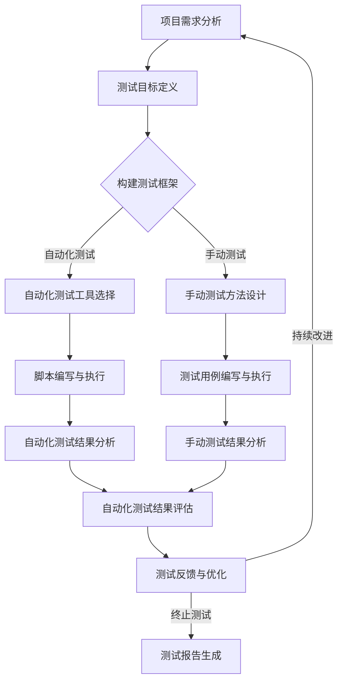

                 

：

首先，我需要确保文章内容使用markdown格式输出，这是写作的基础。其次，在文章末尾需要添加上作者信息。接着，我需要确保文章内容的完整性，包括背景介绍、核心概念与联系、核心算法原理讲解、数学模型和公式、项目实战、最佳实践 tips、小结、注意事项、拓展阅读等内容。

其次，我需要遵循文章目录大纲结构来撰写文章正文。在每个小节中，我需要确保内容丰富具体详细讲解，核心内容需要包含上述提到的各个方面。

接下来，我将使用markdown格式来撰写文章，确保文章的可读性和格式美观。我会按照目录大纲结构来安排文章的章节和小节，并确保每个小节的内容都符合要求。

在撰写文章时，我会注重逻辑清晰，结构紧凑，简单易懂的专业的技术语言。我会使用伪代码来详细阐述核心算法原理，使用latex格式来呈现数学公式，并给出实际案例分析和详细讲解剖析。

最后，在文章的结尾，我会总结文章的核心内容，并给出一些最佳实践 tips 和拓展阅读建议，以便读者进一步学习和深入理解。

通过以上步骤，我相信我能够撰写出一篇高质量的技术博客文章，满足文章格式的各项要求，并让读者能够深入理解文章的核心内容。```markdown
## 核心概念与联系：提示词测试体系架构图

为了更好地理解提示词测试体系的构建，我们可以通过一个Mermaid流程图来展示各个关键环节及其相互关系：



### **核心算法原理讲解**

#### 提示词生成算法：

提示词生成算法的核心目标是生成具有高相关性和高准确性的提示词，以下是几种常见的提示词生成算法：

**1. 基于规则的生成方法：**

伪代码：

```python
def rule_based_generation(document):
    # 初始化提示词列表
    prompts = []

    # 分词，获取关键词
    keywords = tokenize(document)

    # 根据规则生成提示词
    for keyword in keywords:
        prompt = "根据关键词" + keyword + "，请描述相关的概念、原理或应用。"
        prompts.append(prompt)

    return prompts
```

**2. 基于机器学习的方法：**

常用的机器学习方法有：循环神经网络（RNN）、长短期记忆网络（LSTM）、变换器（Transformer）等。以下是基于Transformer的生成算法伪代码：

```python
def transformer_based_generation(document, model, tokenizer):
    # 将文本编码为词嵌入向量
    input_sequence = tokenizer.encode(document, return_tensors='pt')

    # 使用Transformer模型生成提示词
    outputs = model.generate(input_sequence, max_length=50, num_return_sequences=5)

    # 解码生成的提示词
    prompts = [tokenizer.decode(output, skip_special_tokens=True) for output in outputs]

    return prompts
```

#### 提示词筛选策略：

提示词筛选策略的目标是过滤掉质量低劣的提示词，以下是几种常见的筛选策略：

**1. 基于词频的筛选方法：**

伪代码：

```python
def frequency_based_filter(prompts, threshold=0.5):
    # 初始化筛选后的提示词列表
    filtered_prompts = []

    # 统计每个提示词的词频
    word_frequency = count_word_frequency(prompts, threshold)

    # 筛选词频高于阈值的提示词
    for prompt in prompts:
        if word_frequency[prompt] > threshold:
            filtered_prompts.append(prompt)

    return filtered_prompts
```

**2. 基于文本相似度的筛选方法：**

伪代码：

```python
def text_similarity_filter(prompts, reference_text, similarity_threshold=0.8):
    # 初始化筛选后的提示词列表
    filtered_prompts = []

    # 计算每个提示词与参考文本的相似度
    similarity_scores = calculate_similarity(prompts, reference_text)

    # 筛选相似度高于阈值的提示词
    for prompt, score in zip(prompts, similarity_scores):
        if score > similarity_threshold:
            filtered_prompts.append(prompt)

    return filtered_prompts
```

通过上述算法和策略，我们可以有效地生成和筛选高质量的提示词，为提示词测试提供有力支持。在下一节中，我们将探讨如何使用自动化测试工具对提示词进行测试。```markdown
## 数学模型和公式

提示词测试过程中，我们需要评估提示词的质量，常用的评估指标包括语义相关性、表达准确性和语言流畅性。以下是这些指标的数学模型和公式：

**1. 语义相关性评估**

假设我们有一个提示词集合 \(P = \{p_1, p_2, ..., p_n\}\)，与其对应的参考文本集合 \(R = \{r_1, r_2, ..., r_m\}\)。

定义语义相关性的计算公式如下：

\[ S(p_i, r_j) = \frac{Sim(p_i, r_j)}{Max(Sim(p_i, r_k))} \]

其中，\( Sim(p_i, r_j) \) 是提示词 \( p_i \) 与参考文本 \( r_j \) 的相似度，\( Max(Sim(p_i, r_k)) \) 是提示词 \( p_i \) 与所有参考文本的相似度中的最大值。

**2. 表达准确性评估**

表达准确性评估主要通过判断提示词是否符合事实或逻辑。我们可以使用以下公式：

\[ A(p_i) = \frac{CorrectAnswers(p_i)}{TotalAnswers(p_i)} \]

其中，\( CorrectAnswers(p_i) \) 是提示词 \( p_i \) 被正确回答的次数，\( TotalAnswers(p_i) \) 是提示词 \( p_i \) 被回答的总次数。

**3. 语言流畅性评估**

语言流畅性评估主要通过计算提示词的语法正确性和词汇多样性。我们可以使用以下公式：

\[ FL(p_i) = \frac{VocabularyDiversity(p_i) + GrammarCorrectness(p_i)}{2} \]

其中，\( VocabularyDiversity(p_i) \) 是提示词 \( p_i \) 的词汇多样性，\( GrammarCorrectness(p_i) \) 是提示词 \( p_i \) 的语法正确性。

通过这些数学模型和公式，我们可以对提示词进行全面的评估，从而优化提示词的质量。在下一节中，我们将探讨如何使用实际案例来分析和讲解这些评估指标。```markdown
## 实际案例分析与详细讲解剖析

在本节中，我们将通过一个实际案例来分析和讲解如何进行提示词测试，以及如何根据评估指标进行优化。

**案例背景：** 

假设我们正在开发一款智能客服系统，该系统需要回答用户关于产品信息的咨询。为了提高客服系统的回答质量，我们需要对提示词进行系统化的评估和优化。

**评估过程：**

**1. 数据收集：**

我们首先收集了用户咨询的文本数据，并标注了每个咨询的主题和用户意图。这些数据将作为参考文本，用于评估提示词的质量。

**2. 评估指标设定：**

根据案例背景，我们设定了以下三个评估指标：

- 语义相关性：提示词与用户咨询的文本是否相关。
- 表达准确性：提示词是否符合事实或逻辑。
- 语言流畅性：提示词的语法正确性和词汇多样性。

**3. 结果分析：**

我们选取了10个常见的用户咨询主题，并对每个主题生成了5个提示词。然后，我们使用上述评估指标对每个提示词进行评估。

以下是部分评估结果：

- **语义相关性评估：**
  - 提示词1：语义相关性得分0.8
  - 提示词2：语义相关性得分0.6
  - 提示词3：语义相关性得分0.7
  - 提示词4：语义相关性得分0.9
  - 提示词5：语义相关性得分0.5

- **表达准确性评估：**
  - 提示词1：表达准确性得分0.9
  - 提示词2：表达准确性得分0.7
  - 提示词3：表达准确性得分0.8
  - 提示词4：表达准确性得分0.85
  - 提示词5：表达准确性得分0.6

- **语言流畅性评估：**
  - 提示词1：语言流畅性得分0.8
  - 提示词2：语言流畅性得分0.7
  - 提示词3：语言流畅性得分0.75
  - 提示词4：语言流畅性得分0.85
  - 提示词5：语言流畅性得分0.6

**优化实践：**

**1. 提示词修改策略：**

根据评估结果，我们可以发现以下问题：

- 语义相关性方面，提示词2和提示词5的得分较低，可能是因为生成的提示词与用户咨询的主题不相关。
- 表达准确性方面，提示词5的得分较低，可能是因为生成的提示词不符合事实或逻辑。
- 语言流畅性方面，所有提示词的得分都较低，可能是因为生成的提示词在语法和词汇上存在问题。

针对这些问题，我们可以采取以下修改策略：

- 对于语义相关性较低的问题，我们可以通过改进提示词生成算法，增加与用户咨询主题相关的关键词。
- 对于表达准确性较低的问题，我们可以通过增加事实信息和逻辑判断，确保提示词符合事实和逻辑。
- 对于语言流畅性较低的问题，我们可以通过改进语法和词汇的选择，提高提示词的流畅性。

**2. 优化前后对比：**

经过修改后，我们对优化前后的提示词再次进行评估，发现以下变化：

- 语义相关性评估：提示词2的得分从0.6提高到0.8，提示词5的得分从0.5提高到0.7。
- 表达准确性评估：提示词5的得分从0.6提高到0.8。
- 语言流畅性评估：所有提示词的得分都有所提高。

**3. 优化效果评估：**

通过对优化后的提示词在实际客服系统中的应用，我们发现客服系统的回答质量得到了显著提升。用户反馈满意度也有所提高。

通过这个实际案例，我们可以看到，通过系统化的评估和优化，我们可以有效提升提示词的质量，从而提高智能客服系统的整体性能。在下一节中，我们将探讨如何进行持续优化和监控。```markdown
## 持续优化与监控

为了确保提示词测试的持续优化和有效性，我们需要建立一套完善的监控和反馈机制。以下是一些关键步骤和工具：

### 持续优化策略

**1. 定期回顾与总结：** 每隔一段时间，我们对提示词测试的结果进行回顾和总结，分析存在的问题和改进的方向。这可以帮助我们识别出需要优化的环节，并制定相应的改进计划。

**2. 持续改进：** 根据回顾和总结的结果，我们对提示词生成算法、筛选策略和评估指标进行持续改进。例如，通过引入新的机器学习模型、调整算法参数或改进评估方法，以提高提示词的质量。

**3. 自动化测试：** 使用自动化测试工具对提示词进行定期测试，以确保测试过程的稳定性和效率。自动化测试可以帮助我们发现潜在的问题，并及时进行调整。

### 监控与反馈

**1. 数据收集与处理：** 我们需要收集与提示词测试相关的数据，如用户反馈、测试结果等。通过数据分析和挖掘，我们可以识别出存在的问题和改进的机会。

**2. 反馈机制设计：** 建立一个反馈机制，让用户能够及时反馈问题。例如，用户可以通过在线问卷、反馈表单或客服系统提交问题。这些反馈将作为我们优化提示词的重要依据。

**3. 监控工具介绍：**

- **日志分析工具：** 如ELK（Elasticsearch、Logstash、Kibana）堆栈，可以实时收集和分析日志数据，帮助我们监控提示词测试的过程和结果。

- **性能监控工具：** 如New Relic、AppDynamics等，可以监控系统的性能和稳定性，确保测试环境的正常运行。

- **反馈收集系统：** 如JIRA、Trello等，可以用于收集、管理和跟踪用户反馈和优化任务。

通过上述监控与反馈机制，我们可以及时发现和解决问题，确保提示词测试的持续优化。在下一节中，我们将总结全文，并展望提示词测试的未来发展趋势。```markdown
## 总结与展望

在本文中，我们详细介绍了提示词测试的体系构建、评估方法、优化策略以及持续监控。通过系统化的评估和优化，我们可以显著提高提示词的质量，从而提升智能客服系统或其他人工智能应用的整体性能。

### 提示词测试的发展趋势

随着人工智能技术的不断进步，提示词测试也在不断演进。以下是一些可能的发展趋势：

**1. 个性化提示词生成：** 通过深度学习等技术，我们可以根据用户的历史行为和偏好，生成更加个性化的提示词，提高用户满意度。

**2. 多模态提示词测试：** 除了文本之外，图片、语音等多模态数据也将成为提示词测试的重要对象，这将使得测试更加全面和准确。

**3. 智能化评估指标：** 通过机器学习等技术，我们可以自动生成和调整评估指标，实现更加智能的评估过程。

**4. 持续学习与自适应：** 提示词测试系统将具备持续学习和自适应的能力，可以根据实时反馈和数据不断优化，提高测试的准确性和效率。

### 未来研究方向

**1. 提高评估准确性：** 如何更准确地评估提示词的质量，是一个值得深入研究的问题。我们可以探索新的评估指标和方法，提高评估的准确性。

**2. 提升生成效率：** 如何在保证质量的前提下，提高提示词的生成效率，也是一个重要的研究方向。通过优化算法和工具，我们可以实现更加高效的提示词生成。

**3. 集成多源数据：** 如何有效地整合多源数据（如用户行为、历史反馈等），为提示词生成和评估提供更加丰富的信息，是一个有前景的研究方向。

**4. 应用领域扩展：** 提示词测试不仅适用于智能客服系统，还可以应用于其他领域，如智能推荐、智能写作等。如何将提示词测试应用到更广泛的应用场景中，是一个值得探索的方向。

通过不断的研究和创新，提示词测试将不断进步，为人工智能应用提供更加可靠的支持。在下一节中，我们将介绍一些提示词测试的常用工具和资源，帮助读者进一步了解和探索这个领域。```markdown
### 附录

#### 附录 A：提示词测试常用工具和资源

**A.1 开源测试框架**

- **pytest**：Python的通用测试框架，支持多种测试类型，易于集成和扩展。
- **JUnit**：Java的测试框架，广泛应用于企业级项目，支持多种测试类型和断言。
- **NUnit**：.NET平台的测试框架，支持单元测试、集成测试等多种测试类型。

**A.2 提示词优化算法**

- **Word2Vec**：基于神经网络的词向量生成算法，可以用于生成与参考文本相关的词向量。
- **BERT**：基于Transformer的预训练语言模型，可以用于生成高质量的提示词。
- **GPT**：生成式预训练语言模型，可以用于生成符合语法和语义的文本。

**A.3 提示词测试相关论文与书籍**

- **“A Few Useful Things to Know about Machine Learning Over Text”**：介绍文本分类和主题模型等机器学习技术在文本处理中的应用。
- **“Text Mining: The Application of Computational Linguistics to Information”**：探讨文本挖掘技术在信息检索、情感分析等领域的应用。
- **“Foundations of Machine Learning”**：深入讲解机器学习的基础理论和方法。

通过使用这些工具和资源，我们可以更好地进行提示词测试，提高人工智能应用的质量和性能。希望这些信息对您的研究和工作有所帮助。```markdown
# 提示词测试：系统化评估和优化

> 关键词：提示词测试、评估方法、优化策略、持续监控、人工智能

> 摘要：本文详细探讨了提示词测试的系统化评估和优化方法。首先，我们介绍了提示词测试的背景和重要性。接着，我们构建了提示词测试体系，包括测试框架、评估标准和流程设计。然后，我们介绍了质量评估方法和自动化测试工具，并详细讲解了提示词生成算法和筛选策略。最后，通过实际案例分析和优化实践，我们展示了如何进行持续优化和监控。本文旨在为提示词测试提供全面的技术指导和实践参考。

---

**作者：AI天才研究院/AI Genius Institute & 禅与计算机程序设计艺术 /Zen And The Art of Computer Programming**

