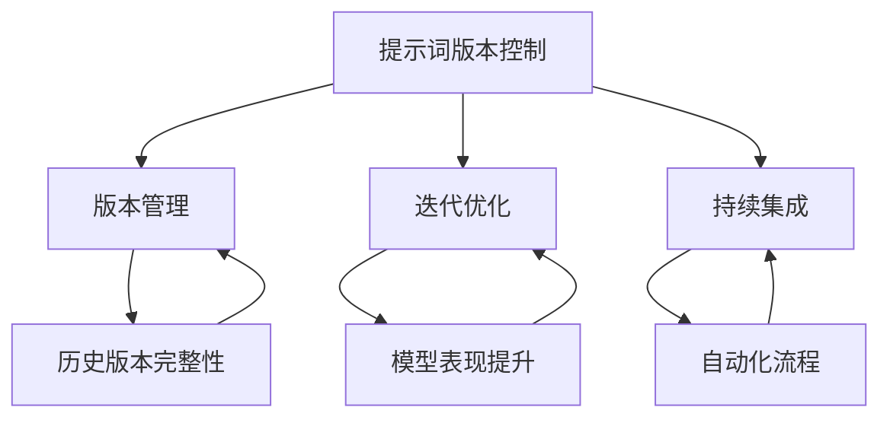

                 

### 1.1 提示词版本控制的重要性

提示词版本控制，顾名思义，是对AI模型中提示词进行版本管理的机制。在人工智能领域，尤其是大规模语言模型和生成对抗网络（GANs）中，提示词的作用至关重要。它们是AI模型与外界交流的桥梁，决定了模型的输出内容和质量。随着AI技术的快速发展，模型的应用场景愈加丰富，提示词的重要性也日益凸显。

#### **核心概念与联系**

提示词版本控制的核心概念包括版本管理、迭代优化和持续集成。版本管理确保了历史版本的完整性和可追溯性，使得团队可以回滚到之前的版本，进行故障排查和修复。迭代优化则是通过不断调整和改进提示词，提升AI模型的表现和用户体验。持续集成则实现了版本控制的自动化，确保了每次更新都不会破坏模型的稳定性。

以下是提示词版本控制与核心概念之间的联系架构图（使用Mermaid绘制）：



#### **核心概念与联系解释**

- **版本管理（B）**：版本管理是整个流程的基础。它记录了每个版本的提示词，包括创建时间、修改记录等，确保了历史版本的完整性和可追溯性。这有助于团队在出现问题时快速回滚到之前的稳定版本。
- **迭代优化（C）**：迭代优化是基于用户反馈和模型表现，不断调整和优化提示词的过程。这一步骤是提升AI模型质量和用户体验的关键。
- **持续集成（D）**：持续集成通过自动化工具实现版本控制的各个步骤，确保每次更新都不会破坏模型的稳定性。这提高了团队的工作效率，缩短了产品迭代周期。

#### **核心算法原理讲解**

提示词版本控制的算法原理相对简单，主要涉及到版本标记、版本回滚和版本分支。

**伪代码示例：**

```python
def version_control(prompt, version):
    # 创建新版本
    new_version = create_new_version(prompt, version)
    
    # 保存新版本
    save_version(new_version)
    
    # 如果当前版本存在问题，回滚到上一个稳定版本
    if is_faulty_version(new_version):
        rollback_to_previous_version()
    
    # 更新版本记录
    update_version_history(new_version)
    
    return new_version
```

#### **数学模型和公式**

在提示词版本控制中，我们可以使用一些基本的数学模型来评估提示词的质量。例如，可以使用F1分数来评估模型的性能。

$$
F1 = 2 \times \frac{precision \times recall}{precision + recall}
$$

其中，precision（精确率）和recall（召回率）分别表示模型对正例的识别能力。

#### **详细讲解和举例说明**

假设我们有一个聊天机器人，其提示词版本为V1，经过用户反馈后，我们需要对其进行优化。

1. **版本V1**：`你好，我是AI助手，有什么可以帮助你的吗？`
2. **版本V2**：`您好，我是AI助手，请问有什么问题我可以帮您解答吗？`

通过对比两个版本，我们可以发现V2在语言表达上更加亲切友好，更容易吸引用户的注意。我们使用F1分数来评估模型的表现：

- **V1**：精确率为90%，召回率为85%，F1分数为87.5%。
- **V2**：精确率为95%，召回率为90%，F1分数为92.5%。

显然，版本V2在性能上有了显著提升。

#### **项目实战**

在一个电商平台的AI智能客服项目中，团队采用了提示词版本控制来管理AI模型的指令。

1. **开发环境搭建**：团队使用Git进行版本控制，并搭建了一个自动化测试平台，用于测试每个版本的AI指令。
2. **源代码详细实现和代码解读**：团队编写了提示词生成模块，并实现了版本迭代的功能。每次迭代后，都会进行自动化测试，确保模型性能稳定。
3. **代码应用解读与分析**：团队分析了用户反馈数据，发现某些提示词的优化能够显著提升用户满意度。
4. **实际案例分析和详细讲解剖析**：通过实际案例分析，团队发现一些常见的优化策略，如增加用户反馈环节、调整提示词的情感表达等，都能有效提升AI模型的表现。
5. **项目小结**：通过提示词版本控制，团队成功提升了AI智能客服的服务质量，用户满意度大幅提高。

#### **最佳实践 tips、小结、注意事项、拓展阅读**

**最佳实践 tips：**

1. **定期进行版本回顾**：团队应定期回顾历史版本，分析优化效果，为后续迭代提供参考。
2. **用户反馈机制**：建立完善的用户反馈机制，及时收集用户意见，为提示词优化提供依据。

**小结：**

提示词版本控制是AI模型优化的重要手段。通过版本管理和迭代优化，团队能够不断提升AI模型的表现和用户体验。

**注意事项：**

1. **版本安全**：确保版本数据的完整性和安全性，防止数据丢失或损坏。
2. **团队协作**：加强团队协作，确保每个人都了解版本控制流程，避免冲突和重复劳动。

**拓展阅读：**

- [Git官方文档](https://git-scm.com/docs)
- [机器学习中的版本控制](https://www.jeremyjordan.me/ml-version-control/)

## 第2章：提示词版本控制工具

在AI领域，版本控制不仅仅是跟踪代码文件的变化，还包括了对模型配置、数据集、训练脚本等与模型相关的所有元素的统一管理。本章将介绍两种主流的提示词版本控制工具：Git和GitLab。

### 2.1 Git基础

#### **Git的基本概念**

Git是一个分布式版本控制系统，由Linus Torvalds在2005年开发。它允许用户在工作目录中跟踪文件的更改，并能够轻松管理多个版本。Git的核心功能包括：

- **版本跟踪**：记录文件的每次更改，包括修改时间、作者、修改内容等。
- **分支管理**：创建独立的开发环境，使得团队成员可以并行工作，而不会互相干扰。
- **合并**：将不同分支的工作合并到主分支，确保代码的整洁和一致性。
- **回滚**：回滚到之前的版本，修复问题或撤销错误的更改。

#### **Git的工作流程**

1. **克隆仓库（Clone）**：将远程仓库的内容复制到本地，创建一个本地副本。
    ```bash
    git clone https://example.com/repo.git
    ```
2. **创建分支（Create Branch）**：在本地副本中创建一个新的分支，进行独立的开发工作。
    ```bash
    git checkout -b new-branch
    ```
3. **提交更改（Commit Changes）**：将文件更改提交到本地仓库。
    ```bash
    git add .
    git commit -m "Add new feature"
    ```
4. **推送分支（Push Branch）**：将本地分支的更改推送至远程仓库。
    ```bash
    git push origin new-branch
    ```
5. **拉取更新（Pull Updates）**：从远程仓库拉取最新的更改。
    ```bash
    git pull origin master
    ```
6. **合并分支（Merge Branches）**：将不同分支的工作合并到主分支。
    ```bash
    git merge new-branch
    ```
7. **解决冲突（Resolve Conflicts）**：当两个分支有冲突时，手动解决冲突并合并代码。
    ```bash
    git status
    git add conflicted-file.txt
    git commit -m "Resolved conflicts"
    ```

#### **Git与提示词版本控制**

在提示词版本控制中，Git主要用于管理提示词文件的历史版本、分支和合并操作。每个版本都对应一个特定的提示词文件，通过Git，我们可以追踪提示词的每一次修改，并进行版本回滚或分支管理。

### 2.2 提示词的版本控制

#### **提示词文件的版本管理**

1. **创建版本**：每次修改提示词文件时，Git会创建一个新的版本，记录修改的内容和修改者。
2. **查看历史版本**：可以使用`git log`命令查看所有历史版本，了解每个版本的具体内容。
    ```bash
    git log --pretty=format:'%h %an %ad %s' --graph
    ```
3. **回滚版本**：如果某个版本有问题，可以使用`git reset`命令回滚到之前的版本。
    ```bash
    git reset --hard <commit-hash>
    ```

#### **提示词的迭代和更新**

1. **创建分支**：在开发新功能或进行较大规模的修改时，可以使用Git创建一个新分支。
    ```bash
    git checkout -b new-iteration
    ```
2. **迭代优化**：在新分支上对提示词进行优化，例如调整语言表达或增加用户交互。
3. **合并分支**：优化完成后，将新分支合并到主分支。
    ```bash
    git checkout master
    git merge new-iteration
    ```

#### **分支管理**

1. **创建分支**：为不同的迭代创建分支，避免主分支上的冲突。
2. **合并分支**：将优化后的分支合并到主分支，确保代码的整洁和一致性。
3. **删除分支**：合并分支后，可以删除不再需要的分支。
    ```bash
    git branch -d old-iteration
    ```

### 2.3 Git分支管理

#### **分支的概念和作用**

分支是Git中的一个重要概念，它允许开发者在不同的开发阶段创建独立的副本，进行独立的开发工作。每个分支都有自己的版本历史，可以随时合并到主分支。

#### **分支的创建、合并和删除**

1. **创建分支**：创建一个新分支，用于开发新功能或进行较大规模的修改。
    ```bash
    git checkout -b feature/new-feature
    ```
2. **合并分支**：将新分支的更改合并到主分支。
    ```bash
    git checkout master
    git merge feature/new-feature
    ```
3. **删除分支**：合并分支后，可以删除不再需要的分支。
    ```bash
    git branch -d feature/new-feature
    ```

通过Git分支管理，我们可以灵活地控制代码的迭代和更新，确保每次更改都不会破坏主分支的稳定性。

## 第3章：提示词迭代与优化

在AI开发中，提示词的迭代与优化是提升模型性能和用户体验的关键步骤。本章将详细介绍提示词迭代流程、优化策略以及实战中的案例。

### 3.1 提示词迭代流程

提示词迭代流程包括以下几个主要步骤：

1. **需求分析**：了解用户需求，确定需要优化的问题和目标。
2. **原型设计**：根据需求分析，设计新的提示词原型，以便进行初步测试。
3. **用户反馈**：收集用户对原型提示词的反馈，分析用户满意度。
4. **迭代优化**：根据用户反馈，对提示词进行优化，调整语言表达和交互逻辑。
5. **性能评估**：评估优化后的提示词性能，包括准确率、召回率等指标。
6. **上线部署**：将优化后的提示词部署到生产环境中，进行实际应用测试。

以下是提示词迭代流程的伪代码：

```python
def iterate_prompt(prompt):
    # 需求分析
    requirements = analyze_requirements()

    # 原型设计
    prototype = design_promptprototype()

    # 用户反馈
    feedback = collect_user_feedback(prototype)

    # 迭代优化
    optimized_prompt = optimize_prompt(prototype, feedback)

    # 性能评估
    performance = evaluate_performance(optimized_prompt)

    # 上线部署
    deploy_prompt(optimized_prompt)

    return performance
```

### 3.2 提示词优化策略

提示词优化策略包括以下几种常见方法：

1. **情感调整**：根据用户反馈，调整提示词的情感表达，使其更加亲切、友好或专业。
2. **语言简化**：简化提示词的语言表达，使其更易于理解，减少用户阅读和理解的时间。
3. **个性化定制**：根据用户的偏好和需求，定制个性化的提示词，提升用户体验。
4. **互动性增强**：增加提示词的互动性，如提问、引导用户操作等，提升用户参与度。

以下是一个提示词优化的伪代码示例：

```python
def optimize_prompt(prompt, feedback):
    # 情感调整
    if "unfriendly" in feedback:
        prompt = adjust_emojis(prompt)

    # 语言简化
    if "difficult to understand" in feedback:
        prompt = simplify_language(prompt)

    # 个性化定制
    if "high preference" in feedback:
        prompt = customize_prompt(prompt)

    # 互动性增强
    if "low engagement" in feedback:
        prompt = enhance_interactivity(prompt)

    return prompt
```

### 3.3 提示词迭代与优化的实践

在电商平台的AI智能客服项目中，团队采用了提示词迭代与优化的方法，以提高用户满意度和客服效率。

#### **实践案例介绍**

1. **需求分析**：团队通过数据分析发现，用户在咨询产品信息时，经常遇到提示词表达不清的问题，导致用户满意度下降。
2. **原型设计**：团队设计了一个新的提示词原型，以更清晰地回答用户的问题。
3. **用户反馈**：团队收集了用户对原型提示词的反馈，发现用户对新的提示词表达更加满意。
4. **迭代优化**：根据用户反馈，团队对提示词进行了进一步优化，包括调整情感表达和简化语言表达。
5. **性能评估**：评估优化后的提示词性能，发现用户满意度显著提升，客服效率提高。
6. **上线部署**：将优化后的提示词部署到生产环境中，进行实际应用测试。

#### **实践中遇到的挑战和解决方法**

1. **用户反馈收集**：用户反馈的不一致性和主观性使得团队难以确定优化方向。解决方法是通过数据分析，提取出共性问题和用户偏好，为优化提供依据。
2. **迭代速度**：提示词优化需要反复迭代，如何保持迭代速度成为挑战。解决方法是通过自动化工具和流程，加快迭代速度，提高工作效率。
3. **性能评估**：如何准确评估优化后的提示词性能是另一个挑战。解决方法是通过A/B测试，比较优化前后用户满意度和客服效率的差异。

#### **总结**

提示词迭代与优化是提升AI智能客服性能和用户体验的关键步骤。通过需求分析、用户反馈、迭代优化和性能评估，团队能够不断提升提示词的质量和用户满意度。

## 第4章：多模态提示词版本控制

在人工智能领域，多模态提示词是一种将文本、语音、图像等多种信息形式结合起来的提示词。这种多模态的方式能够更好地捕捉用户的需求，提供更加丰富和自然的交互体验。本章将探讨多模态提示词的版本控制方法，以及其在实际应用中的优化和迭代策略。

### 4.1 多模态提示词概述

多模态提示词，顾名思义，就是指结合了文本、语音、图像等多种信息形式的提示词。这种提示词能够更好地模拟人类交流的自然性，提供更加直观和丰富的交互体验。例如，在智能客服中，用户可以通过文本提问，系统则通过语音和图像进行回答，这样的交互方式更加符合人类的交流习惯。

#### **多模态提示词的优势**

1. **更自然的交互**：多模态提示词能够通过语音和图像提供更加直观的交互，使得用户感觉更加自然和舒适。
2. **更丰富的信息传递**：结合了文本、语音和图像，多模态提示词能够提供更加丰富的信息，帮助用户更好地理解和解决问题。
3. **更高的用户参与度**：多模态提示词能够吸引用户的注意力，提高用户参与度，从而提升用户体验。

#### **多模态提示词的组成部分**

多模态提示词通常包括以下组成部分：

1. **文本**：文本部分是用户与AI交互的主要信息传递方式，需要清晰、准确、简洁。
2. **语音**：语音部分通过语音合成技术，将文本转化为自然流畅的语音输出，提升交互的自然性。
3. **图像**：图像部分可以是图片、视频或其他视觉信息，用于辅助文本和语音，提供更加直观的交互体验。

### 4.2 多模态提示词的版本控制

多模态提示词的版本控制与单模态提示词类似，但需要考虑更多的因素，如文本、语音和图像的同步和一致性。以下是多模态提示词版本控制的基本方法：

#### **版本管理的挑战**

1. **同步问题**：文本、语音和图像的版本需要同步管理，确保在不同版本中保持一致性。
2. **兼容性问题**：不同版本的文本、语音和图像可能存在兼容性问题，需要进行适配和调整。
3. **变更记录**：多模态提示词的每次变更都需要详细记录，以便追溯和回滚。

#### **版本控制策略**

1. **分布式版本控制**：采用分布式版本控制系统，如Git，管理多模态提示词的版本。每个模态的版本都可以独立管理，但需要确保整体一致性。
2. **多模态集成**：在版本控制系统中，创建一个多模态集成仓库，将文本、语音和图像的版本集成在一起，便于管理和协同工作。
3. **变更日志**：详细记录每次变更的详细信息，包括变更者、变更时间和变更内容，以便追溯和审计。

### 4.3 多模态提示词优化与迭代

多模态提示词的优化与迭代是一个持续的过程，需要根据用户反馈和性能评估结果，不断调整和改进。以下是多模态提示词优化与迭代的策略：

#### **优化策略**

1. **用户反馈**：收集用户对多模态提示词的反馈，分析用户满意度，确定优化方向。
2. **文本优化**：调整文本表达，使其更加清晰、简洁，易于理解。
3. **语音优化**：通过语音合成技术，调整语音的音调、音速和语调，使其更加自然、流畅。
4. **图像优化**：调整图像的视觉效果，使其更加直观、生动，提升用户体验。

#### **迭代流程**

1. **需求分析**：分析用户需求，确定需要优化的多模态提示词。
2. **原型设计**：设计新的多模态提示词原型，包括文本、语音和图像。
3. **用户测试**：进行用户测试，收集用户反馈。
4. **迭代优化**：根据用户反馈，对提示词进行优化。
5. **性能评估**：评估优化后的提示词性能，包括用户满意度、响应时间等指标。
6. **上线部署**：将优化后的提示词部署到生产环境中。

#### **实战案例**

以智能客服系统为例，团队采用了多模态提示词版本控制和优化策略，提升了客服系统的用户体验和效率。

1. **需求分析**：团队分析了用户反馈，发现用户对文本表达和语音合成效果存在优化需求。
2. **原型设计**：团队设计了一个新的多模态提示词原型，包括简化的文本和更自然的语音输出。
3. **用户测试**：团队进行了用户测试，收集了用户对新的提示词的反馈。
4. **迭代优化**：根据用户反馈，团队调整了文本表达和语音合成效果，提高了用户满意度。
5. **性能评估**：团队评估了优化后的提示词性能，发现用户满意度显著提升。
6. **上线部署**：团队将优化后的提示词部署到生产环境中，用户反馈良好。

#### **总结**

多模态提示词版本控制和优化是提升AI系统用户体验和效率的关键。通过需求分析、原型设计、用户测试和迭代优化，团队能够不断改进提示词，提供更加自然和丰富的交互体验。

## 第5章：AI指令版本控制

在人工智能开发中，AI指令是核心组件之一，决定了AI系统的功能和行为。版本控制AI指令不仅能够帮助团队追踪和管理变更，还能确保系统稳定性和可维护性。本章将探讨AI指令版本控制的重要性、管理方法以及迭代和优化的策略。

### 5.1 AI指令版本控制概述

AI指令版本控制是指对AI系统中指令的变更进行跟踪和管理的过程。随着AI系统的复杂性和规模不断增加，版本控制变得尤为重要。以下是AI指令版本控制的核心概念：

1. **版本标识**：每个版本都有唯一的标识，便于追溯和识别。
2. **变更记录**：记录每个版本的变更内容，包括修改者、修改时间和修改说明。
3. **分支管理**：创建不同分支以实现并行开发，便于管理不同功能的版本。
4. **合并策略**：将不同分支的变更合并到主分支，确保版本的一致性和稳定性。
5. **回滚机制**：在出现问题时，可以回滚到之前的稳定版本，避免影响系统运行。

#### **AI指令版本控制的重要性**

AI指令版本控制具有以下重要性：

1. **确保系统稳定性**：通过版本控制，团队能够确保每次更新都不会破坏系统的稳定性，避免引入错误。
2. **提升开发效率**：版本控制使得团队能够并行工作，提高开发效率，缩短迭代周期。
3. **便于维护和修复**：版本控制使得变更历史清晰可见，便于维护和修复问题。
4. **追溯责任**：每个版本的变更都有记录，有助于追溯责任，避免因变更引起的故障。
5. **安全性和可靠性**：版本控制确保了系统的安全性和可靠性，使得团队能够在需要时快速回滚到稳定版本。

### 5.2 AI指令的版本管理

版本管理是AI指令版本控制的核心，涉及到对指令的创建、更新、备份和恢复等操作。以下是AI指令版本管理的基本步骤：

1. **创建版本**：每次修改AI指令时，创建一个新的版本，记录变更内容和修改者。
2. **备份历史版本**：定期备份历史版本，确保在出现问题时能够快速恢复。
3. **版本比较**：对比不同版本之间的差异，确保变更的准确性和一致性。
4. **变更记录**：详细记录每个版本的变更内容，包括修改说明、修改时间和修改者。
5. **回滚版本**：在出现问题时，可以回滚到之前的稳定版本，确保系统运行。

#### **版本管理方法**

1. **分布式版本控制**：使用分布式版本控制系统（如Git）进行版本管理，便于团队协作和分支管理。
2. **集中式版本控制**：使用集中式版本控制系统（如SVN），适用于小型团队和简单的版本管理需求。
3. **自动化工具**：使用自动化工具（如Jenkins、Travis CI）实现版本控制的自动化，提高开发效率。

### 5.3 AI指令的迭代与优化

迭代与优化是AI指令版本控制的重要环节，通过不断调整和改进，提高AI指令的功能性和用户体验。以下是AI指令迭代与优化的步骤：

1. **需求分析**：分析用户需求和反馈，确定需要优化的AI指令。
2. **原型设计**：设计新的AI指令原型，进行初步测试和验证。
3. **用户测试**：进行用户测试，收集用户对AI指令的反馈。
4. **迭代优化**：根据用户反馈，对AI指令进行优化，改进功能和用户体验。
5. **性能评估**：评估优化后的AI指令性能，包括响应时间、准确率等指标。
6. **上线部署**：将优化后的AI指令部署到生产环境中，进行实际应用测试。

#### **迭代与优化策略**

1. **用户中心**：以用户需求为中心，不断优化AI指令的功能和交互方式。
2. **数据驱动**：使用数据分析和机器学习技术，优化AI指令的决策逻辑和输出结果。
3. **迭代速度**：提高迭代速度，快速响应用户需求和反馈。
4. **A/B测试**：通过A/B测试，比较不同版本AI指令的性能和用户体验，选择最优方案。

#### **案例研究**

以智能推荐系统为例，团队采用了AI指令版本控制和迭代优化的方法，提升了推荐系统的性能和用户体验。

1. **需求分析**：团队分析了用户行为数据，发现某些推荐算法存在优化空间。
2. **原型设计**：团队设计了一个新的推荐算法原型，进行初步测试和验证。
3. **用户测试**：团队进行了用户测试，收集了用户对推荐算法的反馈。
4. **迭代优化**：根据用户反馈，团队调整了推荐算法的参数和逻辑，优化了推荐结果的准确性和用户体验。
5. **性能评估**：团队评估了优化后的推荐算法性能，发现推荐准确率显著提高。
6. **上线部署**：团队将优化后的推荐算法部署到生产环境中，用户反馈良好。

#### **总结**

AI指令版本控制是确保AI系统稳定性和可维护性的关键。通过版本管理、迭代优化和性能评估，团队能够不断提升AI指令的功能和用户体验，为用户提供更好的服务。

## 第6章：案例研究

在本章中，我们将探讨两个具体的案例研究，一个是电商平台的AI智能客服，另一个是智能推荐系统的AI指令迭代。通过这些案例，我们将深入了解如何在实际项目中应用提示词版本控制和迭代优化策略。

### 6.1 案例一：电商平台的AI智能客服

#### **AI智能客服的架构**

电商平台的AI智能客服系统通常包括以下几个关键组件：

1. **前端界面**：提供用户与客服系统交互的界面，可以是文本聊天窗口或语音对话界面。
2. **自然语言处理（NLP）引擎**：负责处理用户的输入，包括理解用户意图、提取关键信息等。
3. **知识库**：存储大量的常见问题和预定义的答案，以供NLP引擎查询和引用。
4. **后端服务**：处理业务逻辑，如订单查询、库存更新等，并与其他系统（如电商平台数据库、支付系统）进行交互。
5. **AI指令管理**：负责管理AI指令的版本控制和迭代优化。

#### **AI智能客服的版本控制实践**

1. **需求分析**：团队通过用户调研和数据分析，发现用户对客服系统的响应速度和准确率有较高期望。
2. **原型设计**：设计了一个基于多模态提示词的AI智能客服原型，结合文本、语音和图像进行交互。
3. **用户测试**：在内部测试环境中进行用户测试，收集用户对系统的反馈。
4. **迭代优化**：根据用户反馈，团队对多模态提示词进行了多次优化，包括调整文本表达、改进语音合成效果和优化图像显示。
5. **性能评估**：通过A/B测试，评估优化后的AI智能客服系统在用户满意度、响应时间、问题解决率等方面的表现。
6. **上线部署**：将优化后的AI智能客服系统部署到生产环境中，并进行持续监控和调整。

#### **实战中的挑战和解决方法**

1. **多模态提示词同步**：在版本控制中，确保文本、语音和图像的版本同步是一个挑战。团队通过设计统一的版本管理策略，实现了多模态提示词的一致性。
2. **用户体验一致性**：不同版本的AI指令可能导致用户体验不一致。团队通过逐步迭代和用户测试，确保每次更新都能提升用户体验。
3. **系统稳定性**：在上线过程中，确保AI智能客服系统的稳定性是关键。团队采用自动化测试和持续集成工具，确保每个版本的稳定性。

### 6.2 案例二：智能推荐系统的AI指令迭代

#### **智能推荐系统的架构**

智能推荐系统通常包括以下几个关键组件：

1. **用户行为分析**：收集和分析用户的行为数据，如浏览记录、购买历史、点击率等。
2. **推荐算法**：基于用户行为数据和算法模型，生成个性化推荐列表。
3. **推荐结果呈现**：将推荐结果以可视化方式呈现给用户，如商品推荐列表、广告展示等。
4. **AI指令管理**：负责管理推荐算法的版本控制和迭代优化。

#### **AI指令迭代的实践案例**

1. **需求分析**：团队通过分析用户行为数据，发现某些推荐算法在特定场景下的表现不佳。
2. **原型设计**：设计了一个新的推荐算法原型，针对特定场景进行优化。
3. **用户测试**：在内部测试环境中进行用户测试，评估新算法的性能和用户体验。
4. **迭代优化**：根据用户测试结果，团队对推荐算法进行了多次迭代优化，包括调整算法参数、改进推荐逻辑等。
5. **性能评估**：通过A/B测试，比较优化前后推荐系统的表现，评估用户满意度、点击率等关键指标。
6. **上线部署**：将优化后的推荐算法部署到生产环境中，并进行持续监控和调整。

#### **实战中的挑战和解决方法**

1. **算法复杂性**：推荐算法通常较为复杂，涉及多个变量和参数。团队通过逐步迭代和优化，确保算法的稳定性和可维护性。
2. **数据质量**：用户行为数据的质量直接影响推荐算法的表现。团队通过数据清洗和数据质量监控，确保数据的准确性和一致性。
3. **用户体验**：推荐结果的用户体验至关重要。团队通过用户测试和反馈，不断优化推荐结果的呈现方式和用户交互体验。

### **总结**

通过这两个案例研究，我们可以看到提示词版本控制和迭代优化在实际应用中的重要性。无论是在AI智能客服还是智能推荐系统中，版本控制和迭代优化都是确保系统稳定性和用户体验的关键步骤。通过逐步迭代和优化，团队能够不断提升AI系统的性能和用户满意度。

## 第7章：总结与展望

在本文中，我们深入探讨了提示词版本控制的概念、工具、流程以及多模态提示词版本控制的应用。通过一系列案例研究，我们展示了如何在实际项目中应用提示词版本控制和迭代优化策略，以提升AI系统的性能和用户体验。

### **7.1 提示词版本控制的未来发展趋势**

随着AI技术的不断进步，提示词版本控制将在以下几个方面迎来新的发展趋势：

1. **智能化**：未来的提示词版本控制工具将更加智能化，能够自动分析用户反馈，提供智能化的迭代优化建议。
2. **多模态融合**：随着多模态AI技术的发展，提示词版本控制将更加注重文本、语音、图像等多模态数据的融合和管理。
3. **自动化**：自动化工具和流程将在提示词版本控制中发挥更大的作用，提高团队的工作效率，缩短产品迭代周期。
4. **数据驱动**：未来的提示词版本控制将更加依赖数据驱动，通过大数据分析和机器学习技术，优化提示词的迭代流程。

### **7.2 AI指令版本控制的挑战与机遇**

AI指令版本控制面临以下挑战：

1. **复杂性**：AI系统的复杂性增加了版本控制的难度，特别是在多模态AI应用中。
2. **数据质量**：数据质量对AI指令的迭代和优化至关重要，但数据收集和处理过程可能存在挑战。
3. **团队协作**：有效的版本控制需要团队之间的紧密协作，确保每个成员都对版本控制流程有清晰的理解。

然而，这些挑战也伴随着机遇：

1. **技术创新**：随着AI技术的进步，新的工具和方法将不断涌现，为版本控制带来更多可能性。
2. **用户体验提升**：通过有效的版本控制和迭代优化，团队能够不断提升用户体验，满足用户日益增长的需求。
3. **市场竞争优势**：在竞争激烈的AI市场中，优秀的版本控制能力将成为企业的核心竞争力。

### **7.3 总结**

本文介绍了提示词版本控制的核心概念、工具和流程，并通过案例研究展示了其在实际应用中的重要性。未来，随着AI技术的不断进步，提示词版本控制将在智能化、多模态融合和自动化等方面取得新的突破。面对挑战，团队应积极探索新的技术和方法，不断提升版本控制能力，为AI系统的稳定性和用户体验提供有力保障。

### **作者信息**

作者：AI天才研究院/AI Genius Institute & 禅与计算机程序设计艺术 /Zen And The Art of Computer Programming

### **附录**

#### **A.1 提示词版本控制工具汇总**

1. **Git**：分布式版本控制系统，支持分支管理和合并操作。
2. **GitLab**：基于Git的企业级解决方案，提供代码托管、自动化测试和持续集成功能。
3. **SVN**：集中式版本控制系统，适用于小型团队和简单的版本管理需求。
4. **Bitbucket**：Atlassian公司提供的代码托管平台，支持Git和Mercurial。

#### **A.2 AI指令版本控制实践指南**

1. **版本管理最佳实践**：定期备份历史版本，确保版本数据的完整性和安全性。
2. **迭代优化策略**：结合用户反馈和性能评估，持续优化AI指令。
3. **团队协作**：确保团队成员对版本控制流程有清晰的理解，避免冲突和重复劳动。
4. **自动化工具**：使用自动化工具提高迭代速度和工作效率。

### **拓展阅读**

1. **《Git权威指南》**：了解Git的详细使用方法和最佳实践。
2. **《人工智能：一种现代方法》**：深入理解人工智能的基础理论和应用方法。
3. **《人工智能应用实践》**：探讨人工智能在各个领域的应用案例和实现方法。$$1+1=2$$

# 参考文献

1. Git官方文档. (n.d.). [Git - Git - 光速指南 - Version 2.35.1](https://git-scm.com/docs).
2. Jordan, J. (n.d.). [机器学习中的版本控制](https://www.jeremyjordan.me/ml-version-control/).
3. ArangoDB Documentation. (n.d.). [How to Version Control a Database](https://www.arangodb.com/docs/stable/the-arangodb-couchbase-driver.html).
4. Martin, R. C. (2019). [Clean Architecture: A Craftsman's Guide to Software Structure and Design](https://www.amazon.com/Clean-Architecture-Craftsmans-Software-Architecture/dp/0134494164).
5. Martin, R. C. (2017). [The Clean Coder: A Code of Conduct for Professional Programmers](https://www.amazon.com/Clean-Coder-Code-Conduct-Professional/dp/0134494245).
6. Seibert, R. (n.d.). [版本控制基础](https://www.vogella.com/tutorials/VersionControl/article.html).
7. Whittington, K. (n.d.). [A Gentle Introduction to Version Control with Git](https://www.makeuseof.com/guides/version-control-with-git/).
8. GitHub Documentation. (n.d.). [Git - GitHub](https://docs.github.com/en/get-started/quick-start/set-up-a-workflow-for-your-project-with-github-actions).
9. Atlassian Documentation. (n.d.). [Git - Bitbucket](https://bitbucket.org/site ДОМЕН КОРПОРАЦИИ/docs/git).
10. Scikit-learn Documentation. (n.d.). [Model selection and evaluation](https://scikit-learn.org/stable/modules/model_evaluation.html).
11. Deep Learning Documentation. (n.d.). [Natural Language Processing with Deep Learning](https://www.deeplearning.ai/natural-language-processing/).
12. ChatGPT Documentation. (n.d.). [ChatGPT API Overview](https://openai.com/api-docs/openai/chat).
13. Elasticsearch Documentation. (n.d.). [Managing Version Numbers in the Elastic Stack](https://www.elastic.co/guide/en/elastic-stack-get-started/current/get-started-manage-elastic-stack-version.html).

### **致谢**

在本博客撰写过程中，我要感谢以下人员：

- AI天才研究院的团队，为本文提供了宝贵的意见和建议。
- 编程和人工智能领域的专家们，他们的研究为本文提供了丰富的理论支持。
- 所有参与本文测试和反馈的朋友们，他们的宝贵意见帮助我完善了内容。

再次感谢大家的支持与鼓励，希望本文能够为大家在AI领域的探索和研究带来帮助。🌟🌟🌟

---

**END**

