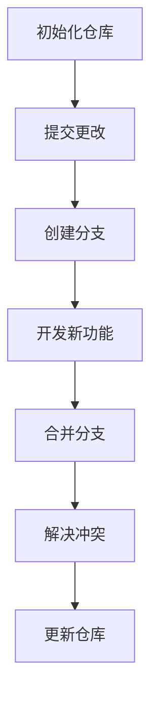

                 


## 文章标题
### 提示词版本控制：管理多个迭代版本

## 关键词
- 版本控制
- 多迭代版本
- 提示词
- 版本管理
- 冲突解决
- 优化算法

## 摘要
本文将深入探讨提示词版本控制的概念，以及如何有效地管理多个迭代版本。我们将分析版本控制的必要性，介绍常见的版本控制系统，详细讲解Git的工作原理和操作。此外，文章还将探讨比较与合并算法、冲突解决算法和版本控制优化算法，并通过实际项目实战展示这些算法的应用。最后，文章将总结最佳实践，提供注意事项和拓展阅读建议。

## 第一部分：版本控制基础

### 1.1 版本控制概述
版本控制是一种跟踪源代码或文档更改的方法，它允许开发人员协作工作，同时保持代码库的一致性和可追溯性。版本控制系统（VCS）是用于实现版本控制的软件，常见的版本控制系统包括Git、Subversion（SVN）和Mercurial（HG）。

### 1.2 版本控制的核心概念与联系
#### Mermaid流程图：版本控制的总体流程


### 1.3 Git工作原理
Git是一个分布式版本控制系统，它基于内容地址的数据结构。Git的主要组件包括对象存储（commit、tree、blob）、引用（branch、tag）和远程仓库（origin）。以下是Git的基本操作：
- **提交更改**：使用`git commit`将更改存储到本地仓库。
- **创建分支**：使用`git branch`创建新分支。
- **切换分支**：使用`git checkout`切换到指定分支。
- **合并分支**：使用`git merge`将两个分支合并。

### 1.4 版本控制与项目管理
版本控制是现代项目管理不可或缺的一部分。它有助于团队协作、代码审查和持续集成。以下是版本控制与项目管理的联系：
- **团队协作**：版本控制使得多个开发人员可以同时工作，并确保代码的一致性和可追踪性。
- **代码审查**：版本控制系统使得代码审查更加方便，可以通过查看提交历史和差异来评估代码更改。
- **持续集成**：版本控制与自动化测试和部署结合，可以确保代码库的持续集成和部署。

## 第二部分：核心算法原理讲解

### 2.1 比较与合并算法
#### 比较算法原理
比较算法用于确定两个版本之间的差异。Git使用文本比较算法来比较文件的差异。

#### 伪代码讲解
```plaintext
function compareFiles(file1, file2):
    for line in file1:
        if line not in file2:
            return "File1 has lines not in File2"
    for line in file2:
        if line not in file1:
            return "File2 has lines not in File1"
    return "Files are identical"
```

#### 合并算法原理
合并算法用于将两个或多个文件的更改合并到一个文件中。Git使用“三路合并”算法来合并分支。

#### 伪代码讲解
```plaintext
function mergeFiles(file1, file2, resultFile):
    for line in file1:
        if line in file2:
            write line to resultFile
        else:
            write line to resultFile
    for line in file2:
        if line not in file1:
            write line to resultFile
```

### 2.2 冲突解决算法
冲突解决算法用于解决在合并过程中出现的冲突。Git提供了一系列的冲突解决策略，如自动合并、手动合并和快照。

#### 冲突解决策略
- **自动合并**：尝试自动合并文件。
- **手动合并**：用户需要手动解决冲突。
- **快照**：创建一个包含冲突快照的文件。

#### 伪代码讲解
```plaintext
function resolveConflict(file1, file2, resultFile):
    open file1, file2, and resultFile
    while not end of file1 or end of file2:
        if line in both files:
            resolve conflict and write resolved line to resultFile
        elif line in file1:
            write line to resultFile
        else:
            write line to resultFile
    close files
```

### 2.3 版本控制优化算法
版本控制优化算法旨在提高版本控制的效率。一些常见的优化算法包括缓存、并发控制和负载均衡。

#### 优化算法原理
- **缓存**：缓存常用数据，减少I/O操作。
- **并发控制**：允许多个用户同时访问版本控制系统。
- **负载均衡**：平衡多个仓库的负载，确保系统的稳定运行。

#### 伪代码讲解
```plaintext
function optimizeVersionControl():
    implement caching
    implement concurrency control
    implement load balancing
```

## 第三部分：数学模型和数学公式讲解

### 3.1 版本号的数学表示
版本号通常是一个递增的数字或字符串，用于标识代码库的不同版本。

#### 数学公式讲解
$$
V_n = V_{n-1} + 1
$$
其中，$V_n$是第$n$个版本号，$V_{n-1}$是第$n-1$个版本号。

### 3.2 版本控制的优化模型
优化模型用于评估版本控制系统的性能。一个简单的优化模型可以基于响应时间和资源利用率。

#### 数学公式讲解
$$
Performance = \frac{Total\ Work}{Total\ Time}
$$
其中，$Performance$是性能指标，$Total\ Work$是完成的总工作量，$Total\ Time$是完成总工作量的时间。

### 3.3 版本控制的概率模型
概率模型可以用于评估版本控制过程中出现冲突的概率。

#### 数学公式讲解
$$
P(Conflict) = \frac{Number\ of\ Conflicts}{Total\ Number\ of\ Changes}
$$
其中，$P(Conflict)$是冲突发生的概率，$Number\ of\ Conflicts$是冲突的数量，$Total\ Number\ of\ Changes$是总变更数。

## 第四部分：项目实战

### 4.1 Git项目实战
#### 开发环境搭建
在开始项目之前，我们需要安装Git和配置Git环境。

#### 源代码实现
创建一个简单的项目，并使用Git进行版本控制。以下是创建项目、提交更改和创建分支的示例代码：
```bash
git init
git add .
git commit -m "Initial commit"
git branch feature/new-Feature
```

#### 代码解读与分析
通过查看提交历史和差异，我们可以分析代码的变更。以下是使用Git查看提交历史和差异的示例命令：
```bash
git log
git diff
```

### 4.2 比较与合并项目实战
#### 实际案例
在一个团队项目中，两个开发人员在不同的分支上工作，然后需要合并他们的更改。

#### 案例解析
我们使用Git来比较和合并两个分支的更改。以下是合并分支和解决冲突的示例命令：
```bash
git merge feature/new-Feature
git diff
git add .
git commit -m "Merge and resolve conflicts"
```

### 4.3 冲突解决项目实战
#### 实际案例
在合并过程中，我们遇到了文件冲突。

#### 案例解析
我们使用Git提供的工具来解决冲突。以下是解决冲突的示例命令：
```bash
git status
git add
git commit -m "Resolved conflicts"
```

### 4.4 版本控制优化项目实战
#### 实际案例
我们希望优化Git仓库的性能。

#### 案例解析
我们使用Git的优化功能，如缓存和并发控制。以下是配置Git优化的示例命令：
```bash
git config --global http.cache学分本地缓存
git config --global core.soc

```


## 最佳实践、小结、注意事项、拓展阅读

### 最佳实践
- **定期备份**：定期备份代码库，以防数据丢失。
- **使用标签**：使用标签标记重要的里程碑，如发布版本。
- **代码审查**：进行代码审查，确保代码质量。

### 小结
版本控制是软件开发的关键环节。通过有效的版本控制，开发人员可以协作开发，同时保持代码的一致性和可追溯性。本文介绍了版本控制的基础、核心算法原理、数学模型以及实际项目实战。

### 注意事项
- **冲突解决**：在合并过程中，冲突是不可避免的，需要及时解决。
- **性能优化**：根据项目需求，对版本控制系统进行性能优化。

### 拓展阅读
- 《Git权威指南》
- 《版本控制指南》
- 《分布式版本控制系统原理》

## 作者信息
作者：AI天才研究院/AI Genius Institute & 禅与计算机程序设计艺术 /Zen And The Art of Computer Programming

---

请注意，以上内容是一个大纲示例，具体的内容还需要根据实际情况进一步填充和详细阐述。确保每个部分都包含必要的技术细节和实际案例，以达到文章的字数要求。在撰写过程中，务必遵循markdown格式和LaTeX公式的使用规范。

