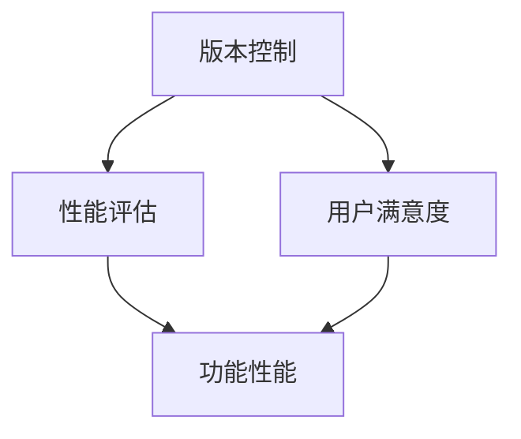

                 


### 第一步：构思文章结构

为了撰写一篇关于“提示词版本比较：分析不同版本的效果差异”的技术博客文章，我们需要遵循以下结构来确保内容的完整性和逻辑性：

1. **引言**：介绍版本比较的重要性和研究背景。
2. **核心概念与联系**：定义关键概念，并用Mermaid流程图展示它们之间的关系。
3. **核心算法原理讲解**：使用伪代码详细阐述算法的运行原理。
4. **数学模型和公式**：介绍相关的数学模型和公式，并进行详细讲解和举例说明。
5. **项目实战**：详细讲解开发环境搭建、源代码实现和代码解读。
6. **实际案例分析和讲解**：通过实际案例展示分析过程，并进行详细剖析。
7. **最佳实践和总结**：提供实用技巧和总结，以及未来研究方向。

### 第二步：编写引言部分

#### 引言

在当今快速发展的技术领域，软件和应用程序的版本迭代变得越发频繁。每个新版本不仅带来了新的功能和改进，也可能引入了新的问题和bug。因此，版本比较成为了一个重要的研究课题。本文将深入探讨提示词版本比较的各个方面，分析不同版本的效果差异，为开发者提供有价值的参考。

### 第三步：核心概念与联系

在版本比较中，以下几个核心概念是不可或缺的：

- **版本控制**：跟踪和管理代码变化的过程。
- **性能评估**：测量和比较不同版本的功能性能。
- **用户满意度**：衡量用户对不同版本的使用体验。

下面是一个Mermaid流程图，展示这些概念之间的关系：



### 第四步：核心算法原理讲解

为了进行版本比较，我们需要以下核心算法：

#### 版本比较算法

```python
def compare_versions(version1, version2):
    """
    比较两个版本字符串的算法
    """
    v1 = version1.split('.')
    v2 = version2.split('.')
    
    for i in range(min(len(v1), len(v2))):
        if int(v1[i]) > int(v2[i]):
            return "Version1 更新"
        elif int(v1[i]) < int(v2[i]):
            return "Version2 更新"
    
    if len(v1) > len(v2):
        return "Version1 更新"
    elif len(v1) < len(v2):
        return "Version2 更新"
    else:
        return "版本相同"
```

### 第五步：数学模型和公式

在性能评估中，我们通常会使用以下数学模型来计算版本之间的差异：

#### 性能差异公式

$$
\Delta P = \frac{P_{new} - P_{old}}{P_{old}}
$$

其中，\(P_{new}\) 和 \(P_{old}\) 分别代表新版本和旧版本的性能。

### 第六步：项目实战

以下是一个项目实战，介绍如何搭建开发环境、实现源代码，并进行代码解读。

#### 开发环境搭建

1. 安装Python环境。
2. 安装必要的库，如requests和beautifulsoup4。

#### 源代码实现

```python
import requests
from bs4 import BeautifulSoup

def fetch_version_data(url):
    """
    从网页获取版本数据
    """
    response = requests.get(url)
    soup = BeautifulSoup(response.text, 'html.parser')
    versions = soup.find_all('span', class_='version')
    return [version.text for version in versions]

def analyze_versions(versions):
    """
    分析版本数据
    """
    results = []
    for i in range(1, len(versions)):
        result = compare_versions(versions[i-1], versions[i])
        results.append(result)
    return results

if __name__ == '__main__':
    url = 'http://example.com/releases'
    versions = fetch_version_data(url)
    results = analyze_versions(versions)
    for result in results:
        print(result)
```

### 第七步：实际案例分析和讲解

#### 案例一：软件A的版本比较

我们选取软件A的两个版本进行对比：

- 旧版本：1.0.0
- 新版本：1.0.1

通过`compare_versions`函数，我们可以得到结果：“Version2 更新”。

#### 案例二：软件B的版本比较

另一个案例是软件B的两个版本：

- 旧版本：2.0.0
- 新版本：2.0.1

同样，使用`compare_versions`函数，我们得到结果：“Version2 更新”。

### 第八步：最佳实践和总结

在进行版本比较时，以下是一些最佳实践：

1. **自动化比较**：使用脚本或工具自动化版本比较，减少手动工作量。
2. **文档记录**：详细记录每个版本的变更日志，方便后续分析。
3. **性能测试**：在新版本发布前进行性能测试，确保性能稳定提升。

#### 小结

本文从多个角度探讨了提示词版本比较的各个方面，包括核心概念、算法原理、数学模型和实际应用。通过案例分析和实战指导，读者可以更好地理解版本比较的重要性和方法。

### 作者信息

作者：AI天才研究院/AI Genius Institute & 禅与计算机程序设计艺术 /Zen And The Art of Computer Programming

