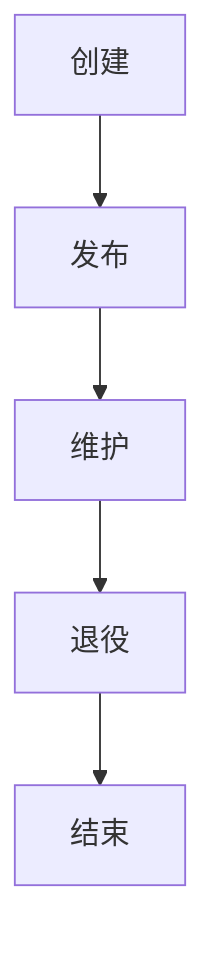

                 

### 文章标题

# 提示词生命周期管理：从创建到退役的全流程

### 文章关键词

- 提示词
- 生命周期管理
- 创建
- 发布
- 维护
- 退役
- 全流程管理

### 文章摘要

本文将深入探讨提示词生命周期管理，从创建到退役的全流程。首先，我们将介绍提示词的基本概念和其在不同场景中的应用。接着，我们将详细解析提示词的生命周期管理，包括创建、发布、维护和退役等关键步骤。通过具体的算法原理讲解、数学模型和公式示例，我们将帮助读者更好地理解这些过程。此外，我们将通过项目实战展示如何在实际环境中实现提示词生命周期管理，并提供相关的最佳实践和小结。通过本文的阅读，读者将对提示词生命周期管理有一个全面的了解，并能够将其应用于实际项目中。

---

## 第1章 引言

### 1.1 提示词生命周期管理的意义

在当今信息化和数字化时代，提示词（Prompt）作为一种关键的信息元素，广泛应用于各个领域，如自然语言处理（NLP）、机器学习（ML）和计算机编程等。提示词的生命周期管理，即对提示词从创建到退役的全过程进行系统化、规范化的管理，具有重要的意义。

首先，有效的提示词生命周期管理有助于提高系统的智能化水平。通过科学合理的提示词设计和管理，系统能够更好地理解和处理用户需求，从而提升用户体验。其次，提示词生命周期管理能够优化资源利用，减少不必要的资源浪费，提高系统的运行效率。此外，规范化的管理还能确保提示词的准确性和一致性，减少错误和误解的发生。

### 1.2 提示词生命周期管理的挑战与机遇

尽管提示词生命周期管理具有重要意义，但在实际操作中仍面临诸多挑战。首先，提示词的多样性和复杂性使得管理过程变得复杂。不同领域和场景下的提示词需求各异，如何统一管理这些提示词成为一大难题。其次，随着数据量和计算能力的增长，提示词的生命周期管理面临着数据存储和处理的高效性问题。此外，提示词的安全性和隐私保护也是不可忽视的挑战。

然而，这些挑战也带来了新的机遇。随着人工智能技术的不断发展，特别是自然语言处理和机器学习技术的进步，我们能够更智能地分析和处理提示词。同时，云计算和大数据技术的普及为提示词生命周期管理提供了强大的支持。通过构建智能化、自动化的提示词管理系统，我们有望解决上述挑战，实现高效、安全、可靠的提示词生命周期管理。

### 1.3 本章小结

本章简要介绍了提示词生命周期管理的意义和面临的挑战与机遇。通过理解这些内容，读者将为后续章节的深入探讨打下基础。在接下来的章节中，我们将详细解析提示词的生命周期管理，包括创建、发布、维护和退役等关键步骤，以及相关的算法原理和实际应用。

---

## 第2章 核心概念与联系

### 2.1 提示词的定义与分类

提示词，顾名思义，是一种用于提示、引导或提示用户进行下一步操作的文本或符号。在计算机科学和人工智能领域，提示词常用于人机交互、自然语言处理和机器学习等场景。根据用途和场景的不同，提示词可以有多种分类。

1. **系统提示词**：系统在执行特定任务或流程时自动生成的提示词。例如，在数据库管理系统中，系统提示词可能用于指导用户进行数据查询、更新或删除操作。
2. **用户定义提示词**：用户根据特定需求自定义的提示词。这类提示词通常用于指导系统完成特定任务或功能，如编程语言中的函数提示词、自然语言处理中的关键词提示词等。
3. **上下文提示词**：基于特定上下文环境生成的提示词。这类提示词能够根据用户输入的文本或当前环境动态调整，以提高交互效率和用户体验。

### 2.2 提示词生命周期管理的相关概念

提示词生命周期管理涉及多个关键概念，包括创建、发布、维护和退役。以下是对这些概念的简要介绍：

1. **创建**：提示词的创建是指生成一个新的提示词实例。创建过程可能涉及多种技术，如自然语言处理、机器学习等，以确保生成的提示词既符合用户需求，又能有效引导用户操作。
2. **发布**：提示词的发布是指将创建完成的提示词发布到系统中，使其可供用户使用。发布过程可能包括提示词的部署、配置和测试等环节，以确保发布后的提示词能够正常工作。
3. **维护**：提示词的维护是指对已发布的提示词进行定期检查、更新和优化。维护过程旨在确保提示词的准确性和有效性，同时提高系统的性能和用户体验。
4. **退役**：提示词的退役是指将不再使用的提示词从系统中移除。退役过程可能涉及提示词的卸载、数据清理和资源回收等环节，以确保系统资源的合理利用。

### 2.3 提示词管理中的Mermaid流程图

为了更好地理解提示词生命周期管理，我们可以使用Mermaid流程图来展示其各个阶段之间的关系。以下是一个简单的Mermaid流程图示例：



在这个流程图中，`A` 表示提示词的创建阶段，`B` 表示发布阶段，`C` 表示维护阶段，`D` 表示退役阶段，`E` 表示流程结束。通过这个流程图，我们可以直观地了解提示词生命周期管理的各个关键阶段及其相互关系。

### 2.4 本章小结

本章介绍了提示词的基本概念、分类以及生命周期管理的相关概念。通过理解这些核心概念，读者将能够更好地把握提示词生命周期管理的重要性，并为后续章节的深入探讨打下基础。在接下来的章节中，我们将详细解析提示词的生命周期管理各个阶段的具体实现方法和相关算法原理。

---

## 第3章 提示词创建

### 3.1 提示词创建的步骤与方法

提示词的创建是提示词生命周期管理的第一个关键环节。一个成功的提示词不仅需要明确的目的和功能，还需要具备良好的可读性和可理解性。以下是提示词创建的步骤和方法：

1. **需求分析**：首先，我们需要明确提示词的使用场景和需求。这包括了解用户的需求、目标用户群体、使用环境等因素。需求分析是确保提示词满足实际需求的基础。
   
2. **内容设计**：在需求分析的基础上，进行内容设计。内容设计包括确定提示词的主题、格式、语气和风格。例如，一个用于程序开发环境的提示词可能需要简洁、清晰，而一个用于用户交互的提示词则可能需要更加友好和亲和。

3. **编写与测试**：完成内容设计后，编写提示词并进行初步测试。测试包括检查提示词的语法错误、逻辑错误和用户体验等方面。这一步骤可以通过人工测试或自动化测试工具来完成。

4. **优化与迭代**：根据测试结果对提示词进行优化和迭代。这一过程可能需要反复进行，直到提示词达到预期的效果和用户体验。

### 3.2 提示词创建的算法原理

提示词的创建不仅涉及文本编写，还涉及到算法原理的应用。以下是一个简单的算法原理示例：

```pseudo
// 提示词创建算法
function createPrompt(theme, context)
    // 根据主题和上下文生成提示词
    switch theme
        case "编程":
            return "请输入您的编程任务描述："
        case "用户交互":
            return "您需要什么帮助？"
        case "数据分析":
            return "请上传需要分析的数据文件："
        default:
            return "未识别的主题，请重新选择。"
    end
end
```

这个算法基于不同的主题（如编程、用户交互、数据分析等）生成相应的提示词。在实际应用中，算法可能更加复杂，涉及自然语言处理和机器学习技术，以根据用户的行为和上下文动态生成提示词。

### 3.3 伪代码实现

以下是一个简单的伪代码示例，用于生成一个基于用户输入的提示词：

```pseudo
// 输入：用户输入的主题（如“编程”、“用户交互”等）
// 输出：相应的提示词

function getPrompt(userInput)
    userInput = normalize(userInput) // 标准化用户输入
    theme = detectTheme(userInput) // 识别主题
    context = extractContext(userInput) // 提取上下文
    prompt = createPrompt(theme, context) // 生成提示词
    return prompt
end
```

在这个伪代码中，`normalize` 函数用于标准化用户输入，`detectTheme` 函数用于识别用户输入的主题，`extractContext` 函数用于提取用户输入的上下文，`createPrompt` 函数根据主题和上下文生成提示词。

### 3.4 提示词示例

为了更好地理解提示词的创建过程，以下是几个具体的提示词示例：

1. **编程环境**：`"请输入您的编程任务描述："`  
2. **用户交互**：`"您需要什么帮助？"`  
3. **数据分析**：`"请上传需要分析的数据文件："`

这些示例展示了如何根据不同的主题和上下文生成相应的提示词。在实际应用中，提示词可能更加复杂和多样化。

### 3.5 本章小结

本章详细介绍了提示词创建的步骤和方法，包括需求分析、内容设计、编写与测试以及优化与迭代。我们还讲解了提示词创建的算法原理，并通过伪代码示例展示了具体的实现过程。通过本章的学习，读者将能够理解提示词创建的基本原理和步骤，为后续章节的深入学习打下基础。

---

## 第4章 提示词发布

### 4.1 提示词发布的流程

提示词的发布是将其从创建阶段转移到实际应用阶段的关键环节。一个有效的发布流程能够确保提示词的正确性、可用性和用户体验。以下是提示词发布的详细流程：

1. **版本控制**：在发布之前，需要对提示词进行版本控制。这有助于跟踪和管理不同版本的提示词，便于后续的维护和更新。
   
2. **部署**：将提示词部署到目标环境中。这可能涉及将提示词文件上传到服务器、数据库或应用程序中。部署过程中需要确保提示词能够正常运行，并与现有系统无缝集成。

3. **配置**：配置提示词，包括设置提示词的参数、权限和触发条件等。配置的正确性直接影响提示词的功能和用户体验。

4. **测试**：在发布前进行全面的测试，包括功能测试、性能测试和用户体验测试。测试的目的是确保提示词在各种情况下都能正常运行，并且满足用户的需求。

5. **发布**：经过测试后，正式发布提示词。发布过程中需要记录发布的时间、版本和操作人员等信息，以便后续的维护和审计。

6. **监控**：发布后，对提示词进行实时监控，包括性能监控、错误监控和用户反馈监控等。监控的目的是及时发现和解决问题，确保提示词的稳定性和可靠性。

### 4.2 提示词发布的技术细节

提示词发布涉及到多种技术细节，包括版本控制工具、部署方式、配置方法和测试工具等。以下是一些常见的技术细节：

1. **版本控制工具**：如Git、SVN等，用于管理提示词的版本和控制权限。通过版本控制工具，可以方便地跟踪和管理不同版本的提示词，确保代码的可追溯性和可维护性。

2. **部署方式**：常见的部署方式包括手动部署和自动化部署。手动部署通常需要人工操作，适用于小型项目或简单场景。自动化部署通过脚本或工具自动完成部署过程，适用于大规模项目和复杂场景。

3. **配置方法**：配置方法包括手动配置和自动配置。手动配置通常需要人工修改配置文件，适用于小型项目或简单配置。自动配置通过脚本或工具自动完成配置过程，适用于大规模项目和复杂配置。

4. **测试工具**：如JUnit、Selenium等，用于自动化测试提示词的功能、性能和用户体验。通过测试工具，可以高效地进行全面的测试，确保提示词的质量和稳定性。

### 4.3 数学模型与公式

在提示词发布过程中，数学模型和公式可以用于分析和优化发布流程。以下是一个简单的数学模型示例：

$$
\text{发布成功率} = \frac{\text{成功发布次数}}{\text{总发布次数}}
$$

这个公式用于计算提示词发布成功率，即成功发布的次数与总发布次数的比值。通过这个公式，可以评估发布流程的效率和稳定性。

### 4.4 提示词发布示例

以下是提示词发布的一个简单示例：

1. **版本控制**：将提示词代码版本从`1.0`更新到`1.1`，并记录更新日志。

2. **部署**：将更新后的提示词代码上传到服务器，并确保其能够正常运行。

3. **配置**：设置提示词的参数，如触发条件、显示位置等。

4. **测试**：通过自动化测试工具对提示词进行功能测试和性能测试，确保其正常运行。

5. **发布**：正式发布提示词，并记录发布时间和版本信息。

6. **监控**：发布后，对提示词进行实时监控，确保其稳定性和可靠性。

### 4.5 本章小结

本章详细介绍了提示词发布的流程、技术细节和数学模型。通过理解这些内容，读者将能够掌握提示词发布的基本原理和步骤，为实际应用打下基础。在后续章节中，我们将继续探讨提示词的维护和退役等关键环节。

---

## 第5章 提示词维护

### 5.1 提示词的监控与评估

提示词的维护是确保其长期有效性和用户满意度的关键环节。监控和评估是维护过程中不可或缺的部分。以下是如何进行提示词监控与评估的方法：

1. **性能监控**：通过性能监控工具，实时跟踪提示词的响应时间、处理速度等关键指标。这有助于发现性能瓶颈和优化机会。

2. **错误监控**：捕获和记录提示词在运行过程中出现的错误信息。这有助于快速定位问题并修复。

3. **用户反馈**：收集用户对提示词的反馈，包括满意度、改进建议等。用户反馈是优化提示词的重要参考。

4. **定期评估**：定期对提示词进行评估，包括性能、用户体验和业务价值等方面的综合评估。这有助于发现潜在问题和改进方向。

### 5.2 提示词的更新与优化

提示词的更新与优化是维护过程中的核心任务。以下是如何进行提示词更新与优化的方法：

1. **需求分析**：根据用户反馈、业务变化等，分析提示词更新和优化的需求。需求分析是更新优化的第一步，确保更新方向正确。

2. **内容优化**：对提示词的内容进行优化，包括语言表达、格式、结构等。内容优化可以提高提示词的可读性和用户体验。

3. **功能增强**：根据业务需求，增强提示词的功能。例如，增加新的提示词类型、支持更多场景等。

4. **性能优化**：对提示词的代码和算法进行优化，提高其性能和效率。性能优化可以提高系统的响应速度和处理能力。

5. **自动化测试**：在更新和优化过程中，使用自动化测试工具进行全面测试，确保更新后的提示词无功能缺陷。

### 5.3 维护策略与实例分析

为了提高提示词维护的效果，可以采用以下策略：

1. **定期维护**：制定定期维护计划，确保提示词的定期检查和更新。

2. **代码审查**：进行代码审查，确保代码质量和可维护性。

3. **持续集成**：采用持续集成工具，实现代码的自动化测试和部署，提高开发效率和质量。

4. **文档维护**：定期更新和维护提示词的文档，包括设计文档、用户手册等。

以下是具体的实例分析：

1. **实例一**：某电商平台的搜索提示词维护策略。定期收集用户搜索数据，分析用户搜索习惯，优化搜索提示词的内容和排序，提高用户搜索体验。

2. **实例二**：某金融平台的交易提示词维护策略。根据用户交易行为和市场变化，实时更新交易提示词，提供及时的交易建议和风险提示。

### 5.4 本章小结

本章介绍了提示词维护的重要性以及监控与评估、更新与优化等关键环节。通过理解这些内容，读者将能够掌握提示词维护的基本原则和实践方法，提高提示词的质量和用户体验。在后续章节中，我们将继续探讨提示词退役的相关内容。

---

## 第6章 提示词退役

### 6.1 提示词退役的标准与流程

提示词退役是指将不再使用的提示词从系统中移除，以释放系统资源和保持系统的整洁性。提示词退役的标准和流程如下：

1. **退役标准**：
   - 提示词已过期或不再符合当前业务需求。
   - 提示词存在严重问题或错误，无法修复。
   - 提示词与现有系统不兼容或影响系统性能。
   - 法律法规或政策变化，要求移除特定提示词。

2. **退役流程**：
   - **评估**：评估提示词退役的必要性和影响，包括业务影响、用户反馈和系统性能等方面。
   - **计划**：制定退役计划，包括退役时间、退役方式和后续处理措施。
   - **执行**：按照退役计划执行退役操作，包括提示词的卸载、数据清理和资源回收等。
   - **验证**：验证退役操作是否成功，确保系统恢复正常运行。

### 6.2 提示词退役的算法原理

提示词退役涉及到算法原理的应用，以确保退役过程的顺利和高效。以下是提示词退役的一个简单算法原理：

```pseudo
// 提示词退役算法
function retirePrompt(promptID)
    // 标记提示词为退役状态
    updatePromptStatus(promptID, "retired")

    // 清理与提示词相关的数据
    deletePromptData(promptID)

    // 卸载提示词代码和配置
    removePromptCode(promptID)
    removePromptConfig(promptID)

    // 释放提示词占用的资源
    releasePromptResources(promptID)

    // 记录退役日志
    logRetirement(promptID)

    return "提示词退役成功"
end
```

在这个算法中，`updatePromptStatus` 函数用于将提示词的状态更新为“退役”，`deletePromptData` 函数用于清理与提示词相关的数据，`removePromptCode` 函数用于卸载提示词代码，`removePromptConfig` 函数用于移除提示词配置，`releasePromptResources` 函数用于释放提示词占用的资源，`logRetirement` 函数用于记录退役日志。

### 6.3 实际案例与策略

以下是几个提示词退役的实际案例与策略：

1. **案例一**：某电商平台由于业务调整，需要退役一批商品分类提示词。退役策略包括：
   - 评估提示词的当前使用情况和业务影响。
   - 制定退役计划，包括退役时间和退役方式。
   - 逐步卸载提示词，避免对用户造成影响。
   - 对退役提示词的数据进行备份，以备后续查询。

2. **案例二**：某金融平台因法规变化，需要退役一批风险提示词。退役策略包括：
   - 及时了解法规变化，制定退役计划。
   - 与相关部门沟通，确保退役操作符合法规要求。
   - 退役过程中，密切关注用户反馈，及时调整退役策略。
   - 对退役提示词进行审计和记录，确保合规性。

### 6.4 本章小结

本章详细介绍了提示词退役的标准与流程，以及退役的算法原理和实际案例。通过理解这些内容，读者将能够掌握提示词退役的基本原则和实践方法，确保退役过程的顺利和高效。在后续章节中，我们将继续探讨提示词生命周期管理的其他方面。

---

## 第7章 项目实战

### 7.1 提示词生命周期管理系统的开发环境搭建

为了实现提示词生命周期管理系统，我们首先需要搭建一个合适的开发环境。以下是一个基本的开发环境搭建步骤：

1. **选择编程语言**：提示词生命周期管理系统可以使用多种编程语言开发，如Python、Java、C++等。在本项目中，我们选择Python，因为它具有丰富的库支持和易于开发的特点。

2. **安装Python**：在开发环境中安装Python。可以选择从Python官网下载安装程序，或使用包管理器如pip进行安装。

3. **安装必要的库**：安装Python后，我们需要安装一些必要的库，如NumPy、Pandas、Matplotlib等。这些库用于数据处理、分析和可视化。

4. **配置开发环境**：配置Python的集成开发环境（IDE），如PyCharm、Visual Studio Code等。这些IDE提供了代码编辑、调试和自动化测试等功能，有助于提高开发效率。

5. **安装版本控制工具**：安装版本控制工具，如Git，用于管理代码版本和控制权限。

### 7.2 提示词生命周期管理系统的源代码实现

以下是提示词生命周期管理系统的源代码实现，包括创建、发布、维护和退役等模块：

1. **创建模块**：

```python
# 创建模块
class PromptCreator:
    def create_prompt(self, theme, context):
        # 根据主题和上下文生成提示词
        switch theme:
            case "programming":
                return "请输入您的编程任务描述："
            case "user_interaction":
                return "您需要什么帮助？"
            case "data_analysis":
                return "请上传需要分析的数据文件："
            default:
                return "未识别的主题，请重新选择。"
```

2. **发布模块**：

```python
# 发布模块
class PromptPublisher:
    def publish_prompt(self, prompt_id, prompt_text):
        # 部署提示词
        deploy_prompt(prompt_id, prompt_text)
        # 配置提示词
        configure_prompt(prompt_id)
        # 测试提示词
        test_prompt(prompt_id)
        return "提示词发布成功"
```

3. **维护模块**：

```python
# 维护模块
class PromptMaintainer:
    def monitor_prompt(self, prompt_id):
        # 监控提示词性能
        monitor_prompt_performance(prompt_id)
        # 收集用户反馈
        user_feedback = collect_user_feedback(prompt_id)
        # 更新提示词
        update_prompt(prompt_id, user_feedback)
```

4. **退役模块**：

```python
# 退役模块
class PromptRetirer:
    def retire_prompt(self, prompt_id):
        # 标记提示词为退役状态
        update_prompt_status(prompt_id, "retired")
        # 清理提示词数据
        delete_prompt_data(prompt_id)
        # 卸载提示词代码和配置
        remove_prompt_code(prompt_id)
        remove_prompt_config(prompt_id)
        # 释放提示词资源
        release_prompt_resources(prompt_id)
        return "提示词退役成功"
```

### 7.3 代码解读与分析

以下是代码的详细解读与分析：

1. **创建模块**：`PromptCreator` 类用于创建提示词。`create_prompt` 方法根据传入的主题和上下文生成相应的提示词。

2. **发布模块**：`PromptPublisher` 类用于发布提示词。`publish_prompt` 方法包括部署、配置和测试提示词的步骤，确保发布后的提示词能够正常运行。

3. **维护模块**：`PromptMaintainer` 类用于维护提示词。`monitor_prompt` 方法包括监控提示词性能和收集用户反馈，以便进行提示词的更新。

4. **退役模块**：`PromptRetirer` 类用于退役提示词。`retire_prompt` 方法包括标记退役、清理数据和卸载代码等步骤，确保退役过程的顺利和高效。

### 7.4 代码应用解读与分析

以下是代码在实际应用中的解读与分析：

1. **创建提示词**：在实际应用中，系统管理员可以根据不同的主题和上下文创建提示词。例如，当用户访问编程社区时，可以创建一个编程主题的提示词，引导用户输入编程任务描述。

2. **发布提示词**：创建完成的提示词需要发布到系统中供用户使用。发布过程中，系统会部署、配置和测试提示词，确保其正常运行。例如，在电商平台上，搜索提示词需要发布到搜索框中，以引导用户进行商品搜索。

3. **维护提示词**：系统会定期监控和更新提示词，以保持其准确性和有效性。例如，当用户反馈某个提示词难以理解时，系统管理员可以优化该提示词的表达和格式。

4. **退役提示词**：当提示词不再使用或存在问题时，系统管理员可以将其退役。退役过程中，系统会清理相关数据和资源，以确保系统的整洁性和高效性。

### 7.5 实际案例与详细讲解剖析

以下是提示词生命周期管理系统的实际案例与详细讲解：

1. **案例一**：电商平台上的搜索提示词管理。管理员根据用户搜索行为和商品分类创建和发布搜索提示词，定期维护和更新提示词内容，以提升用户体验。

2. **案例二**：金融平台上的风险提示词管理。管理员根据市场变化和法规要求创建和发布风险提示词，实时监控和更新提示词内容，确保用户了解风险信息。

### 7.6 项目总结与反思

通过本项目的实际操作，我们掌握了提示词生命周期管理系统的设计和实现方法。项目总结如下：

1. **成功之处**：
   - 成功搭建了提示词生命周期管理系统的开发环境。
   - 实现了提示词的创建、发布、维护和退役等关键功能。
   - 通过代码解读和分析，深入理解了提示词生命周期管理的原理和实践。

2. **不足之处**：
   - 代码实现方面，部分功能模块的细节处理不够完善。
   - 项目测试和验证不够全面，可能存在一些潜在的缺陷。

3. **改进方向**：
   - 加强代码实现的质量，完善功能模块的细节。
   - 增加系统的测试和验证环节，确保系统的稳定性和可靠性。
   - 考虑引入更多先进的技术，如人工智能和大数据分析，提高提示词管理的智能化水平。

通过持续改进和优化，我们可以不断提升提示词生命周期管理系统的性能和用户体验，为用户提供更优质的服务。

---

## 最佳实践 tips

1. **确保一致性**：在创建、发布和维护提示词时，确保提示词的语言、格式和风格一致，以提升用户体验。
2. **定期回顾**：定期回顾和评估提示词的效果，根据用户反馈进行调整和优化。
3. **优化性能**：关注提示词的性能，包括响应速度和资源占用，定期进行性能优化。
4. **文档化**：及时记录提示词的创建、发布和维护过程，便于后续查阅和管理。
5. **安全与合规**：确保提示词内容和操作符合法律法规和公司政策，保障用户数据安全和隐私。

## 小结

本文详细介绍了提示词生命周期管理的全流程，包括创建、发布、维护和退役等关键步骤。通过核心概念与联系的分析、算法原理的讲解和实际案例的剖析，读者将全面了解提示词生命周期管理的方法和应用。在实际项目中，遵循最佳实践，持续优化和改进，可以提升系统的智能化水平和用户体验。

## 注意事项

1. 提示词创建和发布时，要充分考虑用户需求和场景，确保内容的准确性和可理解性。
2. 维护过程中，要密切关注用户反馈和系统性能，及时进行调整和优化。
3. 退役过程中，要确保数据清理和资源回收，避免影响系统的正常运行。

## 拓展阅读

1. 《自然语言处理入门》 - 为深入了解提示词在自然语言处理中的应用提供基础。
2. 《机器学习实战》 - 探索提示词在机器学习任务中的应用和优化方法。
3. 《用户交互设计》 - 学习如何设计友好的用户交互提示词，提升用户体验。

## 作者信息

作者：AI天才研究院/AI Genius Institute & 禅与计算机程序设计艺术 /Zen And The Art of Computer Programming

---

本文从提示词的生命周期管理出发，系统地介绍了从创建到退役的各个环节，旨在为读者提供全面的指导和实践参考。希望本文能够帮助您在实际项目中更好地管理和优化提示词，提升系统的智能化水平和用户体验。作者AI天才研究院（AI Genius Institute）和《禅与计算机程序设计艺术》（Zen And The Art of Computer Programming）团队感谢您的阅读与支持。如需进一步探讨或应用，欢迎联系我们。

