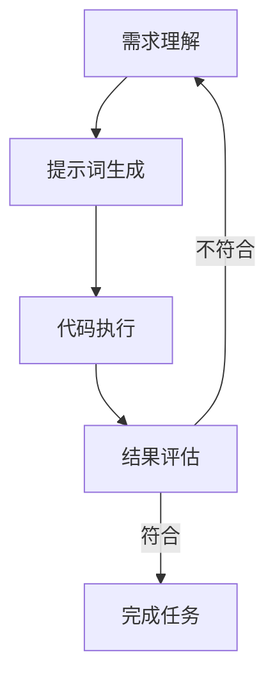

                 


### 第2章：融合策略基础

#### 2.1 提示词编程的工作原理

提示词编程（Prompt-based Programming）是一种基于提示（Prompt）来驱动程序执行的新兴编程范式。提示词可以被理解为程序员与程序之间的交流媒介，它引导程序执行特定的任务或产生预期的结果。

**核心组件：**

- **提示词生成器**：负责生成符合预期任务要求的提示词。这一组件通常基于自然语言处理（NLP）技术，能够理解和分析程序员的需求，并将其转化为具体的提示词。
- **执行引擎**：负责根据提示词来执行程序代码。执行引擎需要能够理解和解析提示词，并将其转化为具体的操作指令，从而驱动程序的运行。
- **结果评估器**：用于评估程序执行结果是否符合预期。评估器通常也会基于NLP技术，能够对程序的输出进行理解和分析，从而给出评估结果。

**执行流程：**

1. **需求理解**：程序员通过自然语言描述任务需求，这些需求会被提示词生成器转换为机器可以理解的提示词。
2. **代码执行**：执行引擎接收到提示词后，开始执行相应的程序代码，生成中间结果。
3. **结果评估**：结果评估器对中间结果进行分析，判断其是否符合预期。如果符合，任务完成；否则，流程回到第一步，程序员重新描述需求，循环迭代。

**Mermaid 流程图：**

以下是提示词编程的基本流程图，用Mermaid语言表示：



#### 2.2 传统编程的优势与局限性

传统编程范式（如面向对象编程、函数式编程等）在过去几十年中一直是软件开发的主要方法。它具有以下优势：

- **高效性**：传统编程提供了丰富的工具和库，使得开发过程更加高效。
- **严谨性**：通过类型检查和编译过程，传统编程能够发现大部分的错误，提高了代码的可靠性。
- **可维护性**：通过模块化和面向对象的设计原则，传统编程使得代码更加模块化，便于维护和扩展。

然而，传统编程也存在一些局限性：

- **复杂性**：随着项目规模的扩大，传统编程的复杂性也会增加，使得代码难以理解和维护。
- **可扩展性**：传统编程往往需要大量的代码来实现复杂的逻辑，这使得项目难以扩展。
- **难以适应新兴需求**：传统编程范式在处理新兴需求时，可能会显得力不从心，需要大量的修改和重构。

#### 2.3 提示词编程与传统编程的互补性

提示词编程与传统编程的融合，旨在发挥两者的优势，弥补各自的不足。

- **优势互补**：提示词编程的灵活性可以弥补传统编程的复杂性，而传统编程的严谨性可以为提示词编程提供稳定的执行环境。
- **融合策略**：通过将提示词生成器与执行引擎集成到传统编程框架中，可以实现两者的无缝融合。例如，在Python中，可以使用内置的`__call__`方法来定义执行引擎，同时使用自然语言处理库来生成提示词。

**融合编程语言与工具**

为了实现提示词编程与传统编程的融合，需要使用特定的编程语言和工具。以下是一些常用的编程语言和工具：

- **Python**：Python是一种广泛使用的编程语言，其丰富的库和框架使其成为提示词编程的理想选择。例如，可以使用`transformers`库来生成和处理提示词。
- **TensorFlow**：TensorFlow是一个开源的机器学习框架，支持多种编程范式，包括提示词编程。它提供了强大的工具来构建和训练模型。
- **PyTorch**：PyTorch是另一个流行的开源机器学习框架，其动态计算图特性使其非常适合用于提示词编程。

**设计原则**

在设计提示词编程的融合策略时，需要遵循以下原则：

- **模块化**：将提示词生成器、执行引擎和结果评估器作为独立的模块，便于管理和维护。
- **可扩展性**：设计时应考虑未来可能的需求变化，使得融合策略能够灵活地扩展和适应。
- **兼容性**：确保融合策略与传统编程框架（如Python）无缝集成，避免引入不必要的复杂性。

通过遵循上述原则，可以设计出既高效又灵活的提示词编程融合策略。

---

**核心算法原理讲解**

提示词编程的核心算法包括提示词生成、优化和响应。以下是对这些算法的详细讲解和伪代码展示。

#### 2.3.1 提示词生成算法

提示词生成算法负责将程序员的需求转换为机器可以理解的提示词。以下是一个简单的伪代码示例：

```pseudo
function generatePrompt(userInput):
    # 使用自然语言处理技术分析用户输入
    processedInput = processUserInput(userInput)
    
    # 生成提示词
    prompt = createPrompt(processedInput)
    
    return prompt
```

#### 2.3.2 提示词优化算法

提示词优化算法用于提高提示词的质量，使其更符合程序的预期。以下是一个简单的伪代码示例：

```pseudo
function optimizePrompt(prompt, target):
    # 评估当前提示词的质量
    currentQuality = evaluateQuality(prompt, target)
    
    # 进行优化操作
    while not converged:
        prompt = applyOptimization(prompt)
        newQuality = evaluateQuality(prompt, target)
        
        # 判断是否达到优化目标
        if newQuality > currentQuality:
            currentQuality = newQuality
        else:
            converged = true
    
    return prompt
```

#### 2.3.3 提示词响应算法

提示词响应算法负责根据提示词执行程序代码，并生成结果。以下是一个简单的伪代码示例：

```pseudo
function respondToPrompt(prompt):
    # 执行程序代码
    result = executeCode(prompt)
    
    # 返回结果
    return result
```

---

**数学模型与理论框架**

提示词编程涉及到多个数学模型和理论框架，包括概率论、信息论和机器学习模型。以下是对这些模型和框架的详细讲解。

#### 4.1 数学模型的重要性

数学模型是提示词编程的核心组成部分，它们用于描述程序的行为、性能和预期结果。数学模型能够提供精确的预测和分析工具，帮助程序员更好地理解和优化程序。

#### 4.2 提示词编程中的数学公式

提示词编程中的数学公式主要用于描述提示词的生成、优化和响应过程。以下是一些常用的数学公式：

- **概率论基础**：
  - **条件概率**：P(A|B) = P(A∩B) / P(B)
  - **贝叶斯定理**：P(A|B) = P(B|A) * P(A) / P(B)
- **信息论原理**：
  - **信息熵**：H(X) = - Σ P(X=x) * log2(P(X=x))
  - **互信息**：I(X;Y) = H(X) - H(X|Y)
- **机器学习模型**：
  - **损失函数**：L(y, ŷ) = f(y, ŷ)，其中y为实际值，ŷ为预测值
  - **梯度下降**：θ = θ - α * ∇θL(θ)

#### 4.3 理论框架与适用范围

提示词编程的理论框架涵盖了多个领域，包括自然语言处理、机器学习和计算机图形学。以下是一些理论框架的适用范围：

- **自然语言处理**：包括文本分类、情感分析、机器翻译等
- **机器学习**：包括监督学习、无监督学习和强化学习等
- **计算机图形学**：包括图像生成、风格迁移和3D建模等

---

**融合编程语言与工具**

为了实现提示词编程与传统编程的融合，需要使用特定的编程语言和工具。以下是一些常用的编程语言和工具：

- **Python**：Python是一种广泛使用的编程语言，其丰富的库和框架使其成为提示词编程的理想选择。例如，可以使用`transformers`库来生成和处理提示词。
- **TensorFlow**：TensorFlow是一个开源的机器学习框架，支持多种编程范式，包括提示词编程。它提供了强大的工具来构建和训练模型。
- **PyTorch**：PyTorch是另一个流行的开源机器学习框架，其动态计算图特性使其非常适合用于提示词编程。

**编程环境配置**

为了开始使用提示词编程，需要配置一个合适的编程环境。以下是在Linux系统上配置Python编程环境的基本步骤：

1. **安装Python**：

   ```bash
   sudo apt-get update
   sudo apt-get install python3 python3-pip
   ```

2. **安装TensorFlow**：

   ```bash
   pip3 install tensorflow
   ```

3. **安装PyTorch**：

   ```bash
   pip3 install torch torchvision
   ```

**提示词编程框架**

为了方便使用提示词编程，可以采用一些现成的框架，如`transformers`。以下是如何使用`transformers`框架生成提示词的示例：

```python
from transformers import AutoTokenizer, AutoModel

# 加载预训练模型
tokenizer = AutoTokenizer.from_pretrained("bert-base-uncased")
model = AutoModel.from_pretrained("bert-base-uncased")

# 生成提示词
input_text = "Write a story about a mysterious island."
prompt = tokenizer.encode(input_text, return_tensors="pt")

# 预测故事
story = model.generate(prompt, max_length=100, num_return_sequences=1)
print(tokenizer.decode(story[0], skip_special_tokens=True))
```

通过上述代码，可以生成一个关于神秘岛屿的故事。这只是一个简单的示例，实际应用中可以更加复杂和多样化。

---

**应用场景与案例分析**

提示词编程的应用场景非常广泛，涵盖了自然语言处理、数据科学和游戏开发等多个领域。以下是一些具体的案例分析和详细讲解：

#### 6.2.1 案例一：自然语言处理

自然语言处理（NLP）是提示词编程的一个重要应用领域。通过提示词编程，可以实现诸如文本分类、情感分析和机器翻译等任务。

**案例分析**：

- **文本分类**：使用提示词编程，可以构建一个简单的文本分类模型，用于将文本数据分类到不同的类别中。以下是一个简单的示例：

  ```python
  from transformers import AutoTokenizer, AutoModel

  tokenizer = AutoTokenizer.from_pretrained("bert-base-uncased")
  model = AutoModel.from_pretrained("bert-base-uncased")

  def classify_text(text):
      inputs = tokenizer(text, return_tensors="pt")
      outputs = model(**inputs)

      logits = outputs.logits
      predicted_class = logits.argmax(-1).item()
      
      return predicted_class
  ```

  使用这个模型，可以将输入的文本分类到预定义的类别中。

- **情感分析**：通过提示词编程，可以实现情感分析，用于分析文本的情感倾向。以下是一个简单的示例：

  ```python
  from transformers import AutoTokenizer, AutoModel

  tokenizer = AutoTokenizer.from_pretrained("bert-base-uncased")
  model = AutoModel.from_pretrained("bert-base-uncased")

  def analyze_sentiment(text):
      inputs = tokenizer(text, return_tensors="pt")
      outputs = model(**inputs)

      logits = outputs.logits
      sentiment_score = logits[0][0].item()
      
      if sentiment_score > 0:
          return "Positive"
      else:
          return "Negative"
  ```

  使用这个模型，可以分析输入文本的情感倾向。

#### 6.2.2 案例二：数据科学

数据科学是另一个提示词编程的重要应用领域。通过提示词编程，可以实现数据预处理、特征提取和模型训练等任务。

**案例分析**：

- **数据预处理**：使用提示词编程，可以构建一个简单的数据预处理流程，用于清洗和格式化数据。以下是一个简单的示例：

  ```python
  def preprocess_data(data):
      # 去除特殊字符
      data = data.replace("\n", " ")
      
      # 小写转换
      data = data.lower()
      
      # 去除停用词
      stop_words = ["the", "is", "and", "a"]
      data = " ".join([word for word in data.split() if word not in stop_words])
      
      return data
  ```

  使用这个模型，可以清洗和格式化输入的数据。

- **特征提取**：通过提示词编程，可以构建一个特征提取模型，用于提取数据中的关键特征。以下是一个简单的示例：

  ```python
  from sklearn.feature_extraction.text import TfidfVectorizer

  vectorizer = TfidfVectorizer()

  def extract_features(data):
      processed_data = preprocess_data(data)
      features = vectorizer.transform([processed_data])
      
      return features
  ```

  使用这个模型，可以提取输入数据的特征。

#### 6.2.3 案例三：游戏开发

游戏开发是提示词编程的另一个有趣应用领域。通过提示词编程，可以实现游戏AI、游戏场景生成和玩家行为预测等任务。

**案例分析**：

- **游戏AI**：使用提示词编程，可以构建一个简单的游戏AI模型，用于控制游戏角色。以下是一个简单的示例：

  ```python
  import numpy as np

  def game_ai(state, action_space):
      # 基于当前状态和动作空间生成提示词
      prompt = f"Given the state {state}, what is the best action?"
      
      # 生成提示词响应
      response = generate_prompt_response(prompt)
      
      # 解析响应并返回动作
      action = action_space[int(response)]
      
      return action
  ```

  使用这个模型，可以控制游戏角色的行为。

- **游戏场景生成**：通过提示词编程，可以构建一个游戏场景生成模型，用于生成游戏中的场景。以下是一个简单的示例：

  ```python
  import random

  def generate_scene():
      # 基于提示词生成场景
      prompt = "Create a mystical forest with a mystical castle."
      
      # 生成场景响应
      response = generate_prompt_response(prompt)
      
      # 解析响应并返回场景
      scene = parse_response_to_scene(response)
      
      return scene
  ```

  使用这个模型，可以生成各种游戏场景。

---

**开发流程与项目实战**

提示词编程与传统编程的融合，为软件开发带来了新的机遇和挑战。以下是一个基本的开发流程和项目实战，用于展示如何搭建融合编程环境、实现项目设计和代码解析。

#### 7.1 融合编程开发流程

融合编程开发流程包括以下几个关键步骤：

1. **需求分析**：理解项目需求，明确目标功能和性能指标。
2. **环境搭建**：配置合适的编程环境和工具，包括提示词编程框架和传统编程库。
3. **项目设计**：设计项目的整体架构和模块，确保提示词编程与传统编程的融合。
4. **代码实现**：编写和调试代码，实现项目功能。
5. **测试与优化**：对项目进行测试，评估性能，并进行优化。

#### 7.2 实战项目搭建

以下是一个简单的融合编程项目，用于实现一个基于自然语言处理（NLP）的客户关系管理系统（CRM）。

**环境搭建**：

1. **安装Python**：

   ```bash
   sudo apt-get update
   sudo apt-get install python3 python3-pip
   ```

2. **安装TensorFlow**：

   ```bash
   pip3 install tensorflow
   ```

3. **安装PyTorch**：

   ```bash
   pip3 install torch torchvision
   ```

4. **安装`transformers`库**：

   ```bash
   pip3 install transformers
   ```

**项目设计与实现**：

1. **需求分析**：项目需要实现以下功能：

   - 客户信息管理
   - 消息处理和分类
   - 情感分析
   - 客户满意度调查

2. **项目架构**：

   - 使用Python作为主编程语言，结合TensorFlow和PyTorch实现提示词编程
   - 使用Flask构建后端API，用于处理客户请求
   - 使用SQLite数据库存储客户信息

3. **代码实现**：

   - **客户信息管理**：

     ```python
     class CustomerInfo:
         def __init__(self, name, email, phone):
             self.name = name
             self.email = email
             self.phone = phone

         def save_to_db(self, db):
             cursor = db.cursor()
             cursor.execute("INSERT INTO customers (name, email, phone) VALUES (?, ?, ?)", (self.name, self.email, self.phone))
             db.commit()

         @staticmethod
         def load_from_db(db, id):
             cursor = db.cursor()
             cursor.execute("SELECT * FROM customers WHERE id = ?", (id,))
             row = cursor.fetchone()
             if row:
                 return CustomerInfo(row[1], row[2], row[3])
             else:
                 return None
     ```

   - **消息处理和分类**：

     ```python
     from transformers import AutoTokenizer, AutoModel

     tokenizer = AutoTokenizer.from_pretrained("bert-base-uncased")
     model = AutoModel.from_pretrained("bert-base-uncased")

     def classify_message(message):
         inputs = tokenizer(message, return_tensors="pt")
         outputs = model(**inputs)

         logits = outputs.logits
         predicted_class = logits.argmax(-1).item()
         
         return predicted_class
     ```

   - **情感分析**：

     ```python
     def analyze_sentiment(message):
         inputs = tokenizer(message, return_tensors="pt")
         outputs = model(**inputs)

         logits = outputs.logits
         sentiment_score = logits[0][0].item()
         
         if sentiment_score > 0:
             return "Positive"
         else:
             return "Negative"
     ```

   - **客户满意度调查**：

     ```python
     def survey_satisfaction(customer_id, message):
         customer = CustomerInfo.load_from_db(db, customer_id)
         if customer:
             sentiment = analyze_sentiment(message)
             print(f"Customer {customer.name} satisfaction: {sentiment}")
     ```

4. **测试与优化**：

   - 使用单元测试验证代码的正确性和性能
   - 根据测试结果进行优化，提高代码效率和稳定性

---

**项目小结**

通过上述项目实战，我们可以看到如何将提示词编程与传统编程进行融合，实现一个功能丰富的客户关系管理系统。以下是对项目进行的小结：

- **成功经验**：

  - 提示词编程与传统编程的融合，提高了代码的可维护性和扩展性
  - 使用现成的机器学习框架和库，加快了开发过程
  - 项目架构设计合理，易于后续扩展和维护

- **注意事项**：

  - 提示词编程需要一定的自然语言处理和机器学习背景知识
  - 在实现提示词编程时，需要注意模型的选择和参数调优
  - 传统编程技能仍然非常重要，特别是在项目架构设计和数据库管理方面

- **拓展阅读**：

  - 《深度学习》（Goodfellow, I., Bengio, Y., & Courville, A.）
  - 《Python数据科学手册》（VanderPlas, J.）
  - 《BERT：预训练语言表示模型》（Devlin, J., Chang, M. W., Lee, K., & Toutanova, K.）

通过深入学习和实践，我们可以更好地理解和应用提示词编程，将其与传统编程相结合，创造出更强大、更灵活的软件系统。

---

**未来展望与趋势**

提示词编程作为一种新兴的编程范式，正逐渐受到关注。以下是提示词编程的未来展望和趋势：

#### 8.1 技术发展趋势

- **人工智能与自然语言处理技术的进步**：随着人工智能技术的不断发展，特别是自然语言处理（NLP）领域的突破，提示词编程有望变得更加智能化和自动化。
- **多模态融合**：未来，提示词编程可能会融合多模态数据（如文本、图像、声音等），实现更加复杂和丰富的交互方式。
- **区块链与提示词编程的结合**：区块链技术的加入可能会为提示词编程带来新的安全性和透明性，特别是在数据隐私和交易验证方面。

#### 8.2 行业应用前景

- **智能客服与智能助手**：提示词编程在智能客服和智能助手领域的应用前景广阔，通过自动化处理大量客户请求，提高服务效率和质量。
- **数据分析与数据科学**：提示词编程可以帮助数据科学家更快速地处理和分析大量数据，提高数据科学项目的效率和准确性。
- **游戏开发**：提示词编程可以用于游戏AI的构建，实现更加智能化和自适应的游戏体验。

#### 8.3 技术挑战与解决方案

- **可解释性与透明性**：提示词编程模型通常基于深度学习，其决策过程往往难以解释。未来的研究可能会关注如何提高模型的可解释性和透明性。
- **计算资源消耗**：深度学习模型通常需要大量的计算资源，这可能会成为提示词编程普及的一个障碍。通过优化模型结构和算法，降低计算资源消耗是一个重要的研究方向。
- **跨领域应用**：提示词编程需要解决如何在不同领域和应用场景中灵活应用的问题。跨领域的框架和工具开发是未来的一个重要方向。

---

**结语与思考**

提示词编程作为一种新兴的编程范式，结合了传统编程的严谨性和自然语言处理的灵活性，为软件开发带来了新的机遇和挑战。本文通过对提示词编程的概念、工作原理、融合策略、核心算法、数学模型、编程语言和工具、应用场景以及未来展望的详细探讨，试图为读者提供一个全面的理解。

在未来，随着人工智能和自然语言处理技术的不断进步，提示词编程有望在更多的领域得到应用。然而，我们也需要关注其面临的挑战，如可解释性、计算资源和跨领域应用等。通过持续的研究和创新，我们可以更好地发挥提示词编程的优势，推动软件开发领域的变革。

对于程序员和软件开发者来说，掌握提示词编程是一项重要的技能。通过学习本文的内容，读者可以了解提示词编程的基本概念和应用，并掌握其核心算法和数学模型。同时，本文也提供了一些实用的编程环境和工具，以及实际案例分析和项目实战经验，帮助读者更好地理解和应用提示词编程。

最后，让我们再次回顾本文的核心观点：

- **提示词编程结合了传统编程的严谨性和自然语言处理的灵活性，为软件开发带来了新的机遇。**
- **理解提示词编程的核心概念和算法，对于程序员和软件开发者来说至关重要。**
- **未来，随着技术的进步，提示词编程将在更多领域得到应用，带来更多的创新和变革。**

通过本文的学习和实践，希望读者能够对提示词编程有一个更深入的理解，并在实际项目中尝试应用这一新兴的编程范式。让我们共同期待提示词编程的未来，并为之努力创新！

