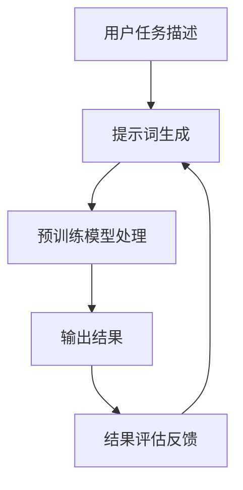

                 

### 文章标题：提示词编程在医疗诊断系统中的应用

提示词编程（Prompt Programming）是一种革命性的AI编程方法，通过向预训练模型提供特定的问题或任务描述（即“提示”），来引导模型生成预期的输出。这种编程方法已经成功地应用于自然语言处理、代码生成和图像识别等多个领域。随着医疗诊断系统的不断发展和优化，提示词编程在医疗诊断中的应用逐渐引起了广泛关注。

医疗诊断系统是利用计算机技术和人工智能算法对医学数据进行处理和分析，以辅助医生进行诊断和治疗的系统。这些系统通常涉及多种类型的数据，包括医学影像、生化检验指标和电子病历等。然而，医疗诊断系统面临着数据多样性、数据质量和算法解释性等一系列挑战。

本文将探讨提示词编程在医疗诊断系统中的应用，旨在为医疗领域的研究者和开发者提供一种新的思路和方法。我们将首先介绍医疗诊断系统与提示词编程的关联性，然后分析医疗诊断中的关键技术与挑战，接着详细讨论提示词编程技术在医疗诊断中的应用场景和实例，最后展望提示词编程在医疗诊断系统中的未来发展。

关键词：提示词编程、医疗诊断系统、人工智能、自然语言处理、医学影像、生化检验、电子病历

### 摘要

本文旨在探讨提示词编程在医疗诊断系统中的应用。首先，我们将介绍医疗诊断系统的基本构成和功能，以及当前的发展趋势。然后，我们简要回顾提示词编程的概念和原理，并分析其与医疗诊断系统的关联性。接着，我们详细探讨医疗诊断中面临的关键技术挑战，如数据多样性、数据质量和算法解释性等。在核心部分，我们将深入探讨提示词编程在医学影像诊断、生化检验指标分析和电子病历诊断等应用场景中的具体实现方法和实例。最后，我们展望提示词编程在医疗诊断系统中的未来发展，探讨其潜在的技术进步和应用拓展。

### 文章标题：提示词编程在医疗诊断系统中的应用

提示词编程（Prompt Programming）作为一种新兴的AI编程范式，正迅速改变着人工智能的应用场景。其核心思想是通过向预训练模型提供具体的问题或任务描述（即“提示”），来引导模型生成用户期望的输出结果。这种方法在自然语言处理（NLP）、代码生成和图像识别等领域已取得了显著成效。随着医疗诊断系统对高效、准确诊断的需求日益增长，提示词编程在医疗诊断中的应用潜力也逐渐显现。

医疗诊断系统是利用计算机技术和人工智能算法对医学数据进行处理和分析，以辅助医生进行诊断和治疗的系统。这些系统通常涉及多种类型的数据，包括医学影像、生化检验指标和电子病历等。然而，医疗诊断系统面临着数据多样性、数据质量和算法解释性等一系列挑战。提示词编程作为一种有效的工具，可以为医疗诊断系统带来以下几方面的优势：

1. **提高诊断准确率**：通过精确的提示词，提示词编程可以帮助模型更好地理解诊断任务，从而提高诊断的准确性和效率。
2. **处理多样化数据**：医疗诊断系统涉及多种类型的数据，如影像、生化指标和文本病历。提示词编程可以有效地整合这些数据，提高系统的诊断能力。
3. **增强算法解释性**：提示词编程可以提供更明确的任务描述，使得模型生成的诊断结果更具解释性，有助于医生理解诊断过程和结果。
4. **降低开发成本**：提示词编程简化了模型的训练和部署过程，降低了医疗诊断系统的开发成本和门槛。

本文将探讨提示词编程在医疗诊断系统中的应用，旨在为医疗领域的研究者和开发者提供一种新的思路和方法。我们将首先介绍医疗诊断系统与提示词编程的关联性，然后分析医疗诊断中的关键技术与挑战，接着详细讨论提示词编程技术在医疗诊断中的应用场景和实例，最后展望提示词编程在医疗诊断系统中的未来发展。

关键词：提示词编程、医疗诊断系统、人工智能、自然语言处理、医学影像、生化检验、电子病历

### 第一部分：概述与背景

#### 第1章：医疗诊断系统与提示词编程

##### 1.1 医疗诊断系统概述

医疗诊断系统是指利用计算机技术和人工智能算法对医学数据进行处理和分析，以辅助医生进行诊断和治疗的系统。这些系统通常涉及多种类型的数据，包括医学影像、生化检验指标和电子病历等。医疗诊断系统的构成与功能主要包括以下几个方面：

1. **医学影像诊断**：利用计算机辅助诊断（CAD）技术，对医学影像（如X光、CT、MRI等）进行自动分析，帮助医生发现病变和疾病。
2. **生化检验指标分析**：通过对患者生化检验指标（如血液、尿液等）的数据分析，发现异常指标，辅助医生诊断疾病。
3. **电子病历诊断**：利用自然语言处理（NLP）技术，对医生书写的电子病历进行解析，提取关键信息，辅助医生进行诊断。

医疗诊断系统的应用现状与发展趋势：

1. **应用现状**：随着医疗诊断技术的不断进步，医疗诊断系统在临床上得到了广泛应用。医学影像诊断系统已经能够自动识别多种病变，生化检验指标分析系统在疾病预测和诊断中发挥着重要作用，电子病历诊断系统则有助于提高诊断的准确性和效率。

2. **发展趋势**：随着人工智能技术的快速发展，医疗诊断系统的性能和精度正在不断提升。深度学习、强化学习等先进算法的应用，使得医疗诊断系统在处理多样化数据、提高诊断准确率和算法解释性方面具有巨大潜力。

##### 1.2 提示词编程概述

提示词编程是一种通过向预训练模型提供具体的问题或任务描述来引导模型生成预期输出的编程方法。其核心思想是将用户的任务需求转化为模型可以理解的提示词，从而引导模型进行相应的任务处理。提示词编程的基本原理如下：

1. **任务描述**：用户根据具体的应用需求，编写一个明确的任务描述。
2. **提示词生成**：根据任务描述，生成一个或多个提示词，用于引导模型理解任务。
3. **模型处理**：将提示词输入到预训练模型中，模型根据提示词生成相应的输出结果。
4. **结果反馈**：用户对输出结果进行评估和反馈，根据反馈调整提示词，进一步优化模型性能。

提示词编程在医疗领域的潜在应用：

1. **医学影像诊断**：通过提示词编程，可以引导模型对医学影像进行自动分析，识别病变和组织结构。
2. **生化检验指标分析**：利用提示词编程，可以指导模型分析患者的生化检验数据，发现潜在的健康问题。
3. **电子病历诊断**：通过提示词编程，可以解析电子病历中的关键信息，辅助医生进行诊断。

##### 1.3 提示词编程与医疗诊断的关联性

提示词编程与医疗诊断系统的关联性主要体现在以下几个方面：

1. **提高诊断准确性**：提示词编程可以帮助模型更好地理解诊断任务，从而提高诊断的准确性和效率。
2. **处理多样化数据**：医疗诊断系统涉及多种类型的数据，如影像、生化指标和文本病历。提示词编程可以有效地整合这些数据，提高系统的诊断能力。
3. **增强算法解释性**：提示词编程可以提供更明确的任务描述，使得模型生成的诊断结果更具解释性，有助于医生理解诊断过程和结果。
4. **降低开发成本**：提示词编程简化了模型的训练和部署过程，降低了医疗诊断系统的开发成本和门槛。

#### Mermaid 流程图

以下是一个描述提示词编程与医疗诊断系统关联性的Mermaid流程图：

在这个流程图中，用户首先进行任务描述，然后生成提示词，将提示词输入到预训练模型中进行处理，得到输出结果，并根据结果进行评估和反馈，最终调整提示词，以优化模型性能。

##### 1.4 提示词编程对医疗诊断的影响

提示词编程对医疗诊断的影响可以从以下几个方面进行探讨：

1. **提高诊断效率**：通过精确的提示词，提示词编程可以帮助模型更快地理解诊断任务，从而提高诊断效率。
2. **降低诊断错误率**：提示词编程可以指导模型专注于特定的诊断任务，减少无关信息的干扰，从而降低诊断错误率。
3. **增强诊断解释性**：提示词编程提供的明确任务描述，使得模型生成的诊断结果更具解释性，有助于医生理解诊断过程和结果。
4. **拓展诊断能力**：提示词编程可以引导模型处理多样化数据，从而提高医疗诊断系统的诊断能力。

#### 1.5 提示词编程在医疗诊断中的优势与挑战

提示词编程在医疗诊断中的优势：

1. **提高诊断准确性**：通过精确的提示词，提示词编程可以帮助模型更好地理解诊断任务，从而提高诊断准确性。
2. **处理多样化数据**：提示词编程可以有效地整合多种类型的数据，提高系统的诊断能力。
3. **增强算法解释性**：提示词编程可以提供更明确的任务描述，使得模型生成的诊断结果更具解释性。
4. **降低开发成本**：提示词编程简化了模型的训练和部署过程，降低了医疗诊断系统的开发成本。

提示词编程在医疗诊断中的挑战：

1. **数据质量与数据隐私**：医疗诊断系统涉及敏感的医学数据，数据质量和数据隐私保护是主要挑战。
2. **算法解释性**：尽管提示词编程可以提供明确的任务描述，但模型的解释性仍然是一个挑战。
3. **模型泛化能力**：提示词编程需要针对不同的诊断任务生成特定的提示词，模型的泛化能力是关键问题。

通过本文的讨论，我们可以看到提示词编程在医疗诊断系统中的应用具有重要的价值和潜力。然而，要充分发挥提示词编程的优势，还需要在数据质量、算法解释性和模型泛化能力等方面进行深入研究。

### 第一部分：概述与背景

#### 第2章：医疗诊断中的关键技术与挑战

##### 2.1 诊断数据的多样性

医疗诊断系统处理的数据类型多种多样，这些数据的多样性带来了巨大的挑战，同时也为提示词编程的应用提供了丰富的可能性。以下是对医疗诊断系统中常见数据类型的分类和特点分析：

1. **医学影像数据**：
   - **特点**：医学影像数据包括X光、CT、MRI等，这些数据通常具有高维度、高分辨率和复杂的图像结构。
   - **处理需求**：医学影像数据需要精细的处理和分析，以便从图像中提取有用的信息，如病灶的位置、形状和大小等。
   - **挑战**：图像数据的多样性和复杂性导致处理算法需要具有高度适应性和鲁棒性。

2. **生化检验数据**：
   - **特点**：生化检验数据包括血液、尿液、组织液等，通常以数值形式表示，如血清酶活性、蛋白质浓度等。
   - **处理需求**：生化检验数据需要通过统计分析和机器学习算法来识别异常指标，从而辅助疾病诊断。
   - **挑战**：生化检验数据的数值范围广泛，且可能存在噪声和异常值，这增加了数据处理的复杂性。

3. **电子病历数据**：
   - **特点**：电子病历数据包括患者的病历记录、诊断记录、治疗记录等，通常以文本形式存在。
   - **处理需求**：电子病历数据需要通过自然语言处理（NLP）技术来提取关键信息，如疾病名称、治疗方案等。
   - **挑战**：电子病历数据存在非结构化、语言表达不标准等问题，使得数据处理和解析变得复杂。

##### 2.2 提示词编程技术的应用场景

提示词编程技术在医疗诊断系统中具有广泛的应用场景，以下是对其在不同场景中的具体应用分析：

1. **病症识别**：
   - **应用**：利用提示词编程，可以指导模型对医学影像和生化检验数据进行处理，识别出特定的病症。
   - **挑战**：病症识别需要对大量病例数据进行训练，且不同病症之间的特征可能存在重叠，增加了识别的难度。
   - **解决方案**：通过优化提示词，提高模型对特定病症的识别精度和泛化能力。

2. **影像诊断**：
   - **应用**：提示词编程可以帮助模型自动分析医学影像，如识别病变、分割组织和检测病变程度等。
   - **挑战**：医学影像数据的多样性和复杂性导致模型需要具备高度适应性和鲁棒性。
   - **解决方案**：通过精确的提示词，引导模型专注于特定任务，提高诊断准确率和效率。

3. **生化指标分析**：
   - **应用**：提示词编程可以指导模型对生化检验数据进行分析，如发现异常指标、预测疾病风险等。
   - **挑战**：生化检验数据的数值范围广泛，且可能存在噪声和异常值，增加了分析的复杂性。
   - **解决方案**：通过调整提示词，提高模型对异常指标的敏感性和准确性。

4. **电子病历诊断**：
   - **应用**：提示词编程可以解析电子病历数据，提取关键信息，辅助医生进行诊断和治疗。
   - **挑战**：电子病历数据的非结构化和语言表达不标准，增加了数据处理和解析的复杂性。
   - **解决方案**：通过自然语言处理技术，优化提示词，提高模型的解析能力和准确性。

##### 2.3 医疗诊断系统中的挑战

尽管提示词编程在医疗诊断系统中具有广泛的应用潜力，但仍面临着一系列挑战，主要包括：

1. **数据质量与数据隐私**：
   - **挑战**：医疗诊断系统处理的数据通常涉及患者的隐私信息，数据质量对诊断结果至关重要。
   - **解决方案**：采用数据加密、去标识化和数据共享协议等措施，确保数据质量和隐私安全。

2. **算法解释性**：
   - **挑战**：提示词编程生成的模型通常是非线性和复杂的，模型的解释性成为一个关键问题。
   - **解决方案**：通过可视化技术、模型压缩和模型解释方法，提高模型的解释性，增强医生的信任和接受度。

3. **模型泛化能力**：
   - **挑战**：提示词编程需要针对不同的诊断任务生成特定的提示词，模型的泛化能力是关键问题。
   - **解决方案**：通过迁移学习、多任务学习和数据增强等技术，提高模型的泛化能力，使其能够应对各种诊断任务。

通过以上分析，我们可以看到医疗诊断系统在处理多样化数据时面临诸多挑战，而提示词编程技术作为一种先进的工具，可以在这些挑战中发挥重要作用。然而，要充分发挥提示词编程的优势，仍需要不断探索和解决相关问题。

#### 第3章：提示词编程基础

提示词编程是一种通过向预训练模型提供具体的问题或任务描述，来引导模型生成预期输出的编程方法。它结合了自然语言处理（NLP）和机器学习的先进技术，能够极大地提高人工智能模型在特定任务中的表现。在本节中，我们将详细探讨提示词编程的核心概念、主要框架以及其应用流程。

##### 3.1 提示词编程的核心概念

提示词编程的核心概念主要包括以下几个方面：

1. **提示词（Prompt）**：
   - **定义**：提示词是指用户提供的用于引导模型理解任务和生成输出的文本或代码片段。
   - **作用**：提示词是提示词编程的关键组成部分，它通过向模型提供任务的具体描述，帮助模型更好地理解任务需求，从而生成更准确和相关的输出结果。
   - **类型**：提示词可以包括问题陈述、任务指令、上下文信息等。例如，在医学影像诊断任务中，一个提示词可以是“请识别以下X光图像中的肺结节”。

2. **模型生成（Model Generation）**：
   - **定义**：模型生成是指模型根据输入的提示词生成相应的输出结果。
   - **过程**：模型生成过程包括模型接收提示词、解码提示词、生成输出结果等步骤。在这个过程中，模型利用其预训练的知识和提示词提供的信息，生成符合任务需求的输出。

3. **优化（Optimization）**：
   - **定义**：优化是指在模型生成过程中，通过调整提示词或模型参数，以提高模型生成结果的准确性和相关性。
   - **方法**：优化方法包括提示词调整、模型参数调优、数据预处理等。优化目标是使模型生成结果更符合用户需求，同时提高模型的性能和鲁棒性。

##### 3.2 提示词编程的主要框架

提示词编程的主要框架包括以下几个常用的预训练模型：

1. **GPT-3（Generative Pre-trained Transformer 3）**：
   - **定义**：GPT-3是由OpenAI开发的一种基于Transformer的预训练模型，具有极高的语言理解和生成能力。
   - **特点**：GPT-3拥有1750亿个参数，支持多种语言和任务，能够生成高质量的文本、代码和图像。
   - **应用**：GPT-3在自然语言处理任务中具有广泛的应用，包括文本生成、机器翻译、文本分类等。

2. **BERT（Bidirectional Encoder Representations from Transformers）**：
   - **定义**：BERT是一种双向Transformer模型，通过预先训练大规模的文本数据，生成上下文敏感的表示。
   - **特点**：BERT能够同时利用文本的前后信息，提高模型的语义理解和生成能力。
   - **应用**：BERT在文本分类、问答系统、命名实体识别等任务中表现出色。

3. **T5（Text-To-Text Transfer Transformer）**：
   - **定义**：T5是一种将所有自然语言处理任务统一为文本到文本转换任务的预训练模型。
   - **特点**：T5通过统一任务形式，简化了模型的训练和部署过程，提高了任务转换的效率。
   - **应用**：T5在问答系统、机器翻译、文本生成等任务中具有广泛应用。

4. **LLaMA（Large Language Model Meta-Training）**：
   - **定义**：LLaMA是一种通过元训练方法来增强大型语言模型性能的框架。
   - **特点**：LLaMA能够通过元训练学习到多种任务，并提高模型的泛化能力和鲁棒性。
   - **应用**：LLaMA在知识图谱、问答系统、文本生成等领域表现出色。

##### 3.3 提示词编程的应用流程

提示词编程的应用流程主要包括以下几个步骤：

1. **任务定义**：
   - **定义任务**：根据具体的应用场景，明确需要完成的任务，如文本生成、图像识别、疾病诊断等。
   - **收集数据**：收集与任务相关的数据集，包括训练数据和测试数据。

2. **生成提示词**：
   - **撰写提示词**：根据任务需求，编写具体的提示词。提示词应当清晰、明确，并包含足够的信息，以帮助模型理解任务。
   - **优化提示词**：通过实验和评估，不断调整和优化提示词，以提高模型生成结果的准确性和相关性。

3. **模型选择**：
   - **选择模型**：根据任务类型和数据规模，选择合适的预训练模型，如GPT-3、BERT、T5等。
   - **模型配置**：配置模型的超参数，如学习率、批次大小等，以优化模型性能。

4. **模型训练**：
   - **数据预处理**：对数据进行预处理，包括数据清洗、归一化、分词等。
   - **训练模型**：使用训练数据和提示词，对模型进行训练。训练过程中，可以使用多种优化方法，如梯度下降、Adam等。

5. **模型评估**：
   - **评估指标**：根据任务类型，选择合适的评估指标，如准确率、召回率、F1分数等。
   - **评估模型**：在测试数据上评估模型性能，并根据评估结果进行模型调整和优化。

6. **应用部署**：
   - **部署模型**：将训练好的模型部署到实际应用环境中，如医疗诊断系统、文本生成平台等。
   - **监控系统**：监控系统运行状态和性能，及时发现问题并进行调整。

通过以上流程，提示词编程可以帮助我们在各种任务中实现高效、准确的模型生成和应用。在实际应用中，提示词编程的灵活性和强大的表达能力，使其成为人工智能领域的重要工具。

### 提示词编程在医学影像诊断中的应用

医学影像诊断是医疗诊断系统中至关重要的一环，通过对医学影像数据的分析，医生可以识别疾病、评估病情和制定治疗方案。随着人工智能技术的发展，提示词编程在医学影像诊断中显示出巨大的应用潜力。本节将详细介绍提示词编程在医学影像诊断中的挑战与机会，以及其实际应用的方法和效果。

#### 4.1 医学影像诊断的挑战与机会

医学影像诊断的挑战主要集中在以下几个方面：

1. **影像数据的多样性**：
   - **挑战**：医学影像数据类型多样，包括X光、CT、MRI等，每种类型的数据都有其独特的结构和特征。
   - **机会**：提示词编程可以处理多样化的数据类型，通过精确的提示词指导模型专注于特定类型的影像数据，从而提高诊断的准确性和效率。

2. **影像诊断的准确性需求**：
   - **挑战**：影像诊断需要高准确性，任何误诊都可能导致严重的医疗后果。
   - **机会**：提示词编程可以优化模型的训练过程，使其更专注于特定任务，从而提高影像诊断的准确性。

3. **影像数据的复杂性**：
   - **挑战**：医学影像数据通常具有高维度和复杂的结构，导致处理和解析变得复杂。
   - **机会**：提示词编程可以简化影像数据的处理流程，通过提供明确的任务描述，帮助模型更有效地理解和处理影像数据。

#### 4.2 提示词编程在医学影像诊断中的实现

提示词编程在医学影像诊断中的应用主要包括以下几个步骤：

1. **提示词生成**：
   - **定义任务**：明确医学影像诊断的具体任务，如肺结节检测、乳腺癌筛查等。
   - **撰写提示词**：根据任务需求，编写具体的提示词。例如，对于肺结节检测任务，提示词可以是“请识别以下X光图像中的肺结节”。
   - **优化提示词**：通过实验和评估，不断调整和优化提示词，以提高模型生成结果的准确性和相关性。

2. **模型选择与训练**：
   - **选择模型**：选择适合医学影像诊断的预训练模型，如基于Transformer的模型（如GPT-3）或卷积神经网络（如VGG16）。
   - **模型配置**：配置模型的超参数，如学习率、批次大小等，以优化模型性能。
   - **训练模型**：使用训练数据和提示词，对模型进行训练。在训练过程中，可以使用梯度下降、Adam等优化方法。

3. **影像数据处理**：
   - **数据预处理**：对医学影像数据进行预处理，包括数据清洗、归一化、分割等。预处理步骤对于提高模型性能至关重要。
   - **数据增强**：通过数据增强技术，如旋转、缩放、裁剪等，增加训练数据的多样性，提高模型的泛化能力。

4. **模型评估与优化**：
   - **评估指标**：选择合适的评估指标，如准确率、召回率、F1分数等，评估模型在测试数据上的性能。
   - **模型优化**：根据评估结果，调整提示词或模型参数，以提高模型性能。例如，通过增加训练数据或调整学习率，优化模型。

5. **应用部署**：
   - **部署模型**：将训练好的模型部署到实际应用环境中，如医疗诊断系统。
   - **监控系统**：监控系统运行状态和性能，及时发现问题并进行调整。

#### 4.3 实例分析：基于提示词编程的肺癌影像诊断系统

以下是一个基于提示词编程的肺癌影像诊断系统的实例：

1. **任务定义**：该系统旨在利用提示词编程技术，自动识别肺癌患者的X光胸片中的肺结节。

2. **数据集准备**：系统收集了数千张X光胸片，并标注了肺结节的坐标和类型。

3. **提示词生成**：编写具体的提示词，例如“请识别以下X光胸片中的肺结节，标注其位置和大小”。

4. **模型选择与训练**：选择基于GPT-3的模型进行训练，配置合适的超参数，如学习率为0.001，批次大小为64。

5. **数据预处理**：对X光胸片进行预处理，包括图像归一化、分割和增强。

6. **模型评估与优化**：在测试数据上评估模型性能，并通过调整提示词或模型参数，优化模型。

7. **应用部署**：将训练好的模型部署到医疗诊断系统中，医生可以通过该系统快速识别肺癌患者胸片中的肺结节。

通过以上实例，我们可以看到提示词编程在医学影像诊断中的应用具有显著的效果。提示词编程不仅可以提高影像诊断的准确性和效率，还能提供更明确的诊断结果，有助于医生制定更有效的治疗方案。

总之，提示词编程在医学影像诊断中的应用为医疗诊断系统带来了新的可能性。通过精确的提示词，提示词编程可以帮助模型更好地理解和处理多样化的医学影像数据，从而提高诊断的准确性和效率。未来，随着提示词编程技术的不断发展和优化，医学影像诊断系统将能够更好地辅助医生进行诊断和治疗。

### 提示词编程在生化检验指标分析中的应用

生化检验是医学诊断的重要组成部分，通过对血液、尿液、组织液等样本的生化指标进行检测，可以及时发现健康问题，指导临床治疗。然而，生化检验数据具有多样性和复杂性，传统的分析方法往往难以应对。提示词编程作为一种新兴的AI编程方法，通过提供具体的任务描述来引导模型生成预期的输出结果，可以显著提高生化检验指标分析的效果。以下将详细探讨提示词编程在生化检验指标分析中的应用。

#### 5.1 生化检验指标分析的重要性

生化检验指标分析在临床诊断中扮演着关键角色，其重要性体现在以下几个方面：

1. **疾病筛查**：通过分析血液、尿液等样本中的生化指标，可以早期发现潜在的健康问题，如糖尿病、高血压等慢性疾病。
2. **疗效监测**：在治疗过程中，通过定期检测生化指标，医生可以评估治疗效果，调整治疗方案，提高治疗效果。
3. **预后评估**：生化检验指标的变化可以反映疾病的严重程度和预后，为医生提供重要的决策依据。
4. **个性化医疗**：通过对生化指标的综合分析，可以为患者制定个性化的治疗方案，提高医疗质量和效果。

#### 5.2 提示词编程在生化检验指标分析中的应用

提示词编程在生化检验指标分析中的应用主要包括以下几个步骤：

1. **任务描述**：
   - **明确任务**：根据具体的分析需求，明确生化检验指标分析的任务，如异常指标检测、指标相关性分析等。
   - **撰写提示词**：根据任务需求，编写具体的提示词。例如，对于异常指标检测任务，提示词可以是“请检测以下数据集中的异常指标”。

2. **数据预处理**：
   - **数据收集**：收集相关的生化检验数据集，包括正常数据和异常数据。
   - **数据清洗**：对数据进行清洗，去除噪声和异常值，保证数据的准确性和完整性。
   - **数据归一化**：对数据进行归一化处理，使其具有相同的量纲和范围，便于模型训练。

3. **模型选择与训练**：
   - **选择模型**：根据任务类型和数据特点，选择合适的预训练模型，如GPT-3、BERT等。
   - **模型配置**：配置模型的超参数，如学习率、批次大小等，以优化模型性能。
   - **训练模型**：使用预处理后的数据和提示词，对模型进行训练。训练过程中，可以使用梯度下降、Adam等优化方法。

4. **模型评估与优化**：
   - **评估指标**：选择合适的评估指标，如准确率、召回率、F1分数等，评估模型在测试数据上的性能。
   - **模型优化**：根据评估结果，调整提示词或模型参数，以提高模型性能。例如，通过增加训练数据或调整学习率，优化模型。

5. **应用部署**：
   - **部署模型**：将训练好的模型部署到实际应用环境中，如生化检验系统。
   - **监控系统**：监控系统运行状态和性能，及时发现问题并进行调整。

#### 5.3 指标异常检测

指标异常检测是生化检验指标分析中的一个关键任务，其主要目标是识别数据集中的异常指标。以下是一个基于提示词编程的指标异常检测实例：

1. **任务定义**：检测某血液样本中的异常指标，包括白细胞计数、红细胞计数、血小板计数等。

2. **数据集准备**：收集包含正常和异常指标的血液样本数据集，并对数据进行预处理。

3. **提示词生成**：编写提示词，如“请检测以下血液样本数据中的异常指标，并标注其名称和值”。

4. **模型训练**：
   - **选择模型**：使用GPT-3模型进行训练。
   - **模型配置**：设置学习率为0.001，批次大小为32。
   - **数据预处理**：对数据集进行归一化处理。

5. **模型评估**：
   - **评估指标**：使用准确率、召回率、F1分数等评估模型性能。
   - **优化提示词**：根据评估结果，调整提示词，以提高模型检测异常指标的能力。

6. **应用部署**：将训练好的模型部署到生化检验系统中，医生可以通过该系统快速检测血液样本中的异常指标。

#### 5.4 指标相关性分析

指标相关性分析是另一个重要的任务，通过分析不同生化检验指标之间的相关性，可以为疾病诊断和治疗提供重要依据。以下是一个基于提示词编程的指标相关性分析实例：

1. **任务定义**：分析某疾病患者的血液样本中不同指标之间的相关性。

2. **数据集准备**：收集包含患者血液样本中多个生化指标的表格数据集，并对数据进行预处理。

3. **提示词生成**：编写提示词，如“请分析以下血液样本数据中各指标之间的相关性，并生成相关性的热力图”。

4. **模型选择与训练**：
   - **选择模型**：使用BERT模型进行训练。
   - **模型配置**：设置学习率为0.001，批次大小为64。

5. **模型评估与优化**：
   - **评估指标**：使用相关系数、平均绝对误差等评估模型性能。
   - **优化提示词**：根据评估结果，调整提示词，以提高模型分析指标相关性的准确性。

6. **应用部署**：将训练好的模型部署到医疗诊断系统中，医生可以通过该系统分析患者生化指标之间的相关性。

通过以上实例，我们可以看到提示词编程在生化检验指标分析中的应用具有显著的效果。提示词编程不仅可以帮助模型更好地理解和处理生化检验数据，提高诊断准确性和效率，还能提供更明确的诊断结果，为医生提供有力的辅助工具。未来，随着提示词编程技术的不断发展和优化，生化检验指标分析将能够更好地支持临床诊断和治疗。

### 提示词编程在电子病历诊断中的应用

电子病历（Electronic Health Record，EHR）是现代医疗系统中不可或缺的一部分，它通过数字化记录和管理患者的健康信息，极大地提高了医疗服务的效率和准确性。然而，电子病历数据的复杂性和非结构化特性使得传统的自然语言处理（NLP）方法在电子病历诊断中的应用面临诸多挑战。提示词编程作为一种创新的AI编程方法，通过提供具体的任务描述来引导模型生成预期的输出，为电子病历诊断提供了一种新的解决方案。以下将详细探讨提示词编程在电子病历诊断中的应用。

#### 6.1 电子病历诊断的现状与问题

当前，电子病历诊断系统主要面临以下几方面的问题：

1. **数据结构化与语义理解**：
   - **问题**：电子病历数据通常以自由文本形式存在，结构化和语义理解是当前NLP技术面临的主要挑战。
   - **现状**：尽管已有一些方法尝试将电子病历数据转化为结构化信息，但效果仍不理想，难以满足实际诊断需求。

2. **诊断准确性与效率**：
   - **问题**：电子病历诊断系统需要具备高准确性和高效率，以支持医生快速做出诊断。
   - **现状**：现有的电子病历诊断系统在诊断准确性和效率方面还有待提高，尤其是在处理复杂病历数据时。

3. **算法解释性**：
   - **问题**：电子病历诊断结果需要具备较高的解释性，以便医生理解诊断过程和结果。
   - **现状**：现有的诊断系统往往缺乏透明性和解释性，医生难以理解模型的决策过程。

#### 6.2 提示词编程在电子病历诊断中的应用

提示词编程在电子病历诊断中的应用主要体现在以下几个方面：

1. **病历文本预处理**：
   - **应用**：通过编写具体的提示词，引导模型对电子病历文本进行预处理，如分词、实体识别、关系抽取等。
   - **效果**：提示词编程可以显著提高文本预处理的准确性和效率，为后续的诊断任务提供高质量的数据输入。

2. **病历诊断辅助**：
   - **应用**：利用提示词编程，可以为医生提供辅助诊断服务，如自动生成诊断建议、分析病情变化等。
   - **效果**：通过精确的提示词，模型可以更好地理解电子病历数据，提高诊断的准确性和效率。

3. **病历诊断结果解释**：
   - **应用**：通过编写解释性的提示词，帮助医生理解模型的诊断过程和结果。
   - **效果**：提示词编程可以提高诊断结果的透明度和解释性，增强医生对诊断系统的信任和依赖。

#### 6.3 提示词编程在电子病历诊断中的实现方法

以下是提示词编程在电子病历诊断中的具体实现方法：

1. **任务描述**：
   - **明确任务**：根据诊断需求，明确电子病历诊断的任务，如疾病诊断、病情变化分析等。
   - **撰写提示词**：编写具体的提示词，如“请根据以下电子病历数据，诊断患者的疾病类型”。

2. **数据集准备**：
   - **数据收集**：收集包含多种疾病的电子病历数据集，并对数据集进行标注。
   - **数据清洗**：对电子病历数据进行清洗，去除无关信息，保证数据的准确性和完整性。

3. **模型选择与训练**：
   - **选择模型**：选择适合电子病历诊断的预训练模型，如BERT、GPT-3等。
   - **模型配置**：配置模型的超参数，如学习率、批次大小等，以优化模型性能。
   - **训练模型**：使用预处理后的数据和提示词，对模型进行训练。训练过程中，可以使用梯度下降、Adam等优化方法。

4. **模型评估与优化**：
   - **评估指标**：选择合适的评估指标，如准确率、召回率、F1分数等，评估模型在测试数据上的性能。
   - **模型优化**：根据评估结果，调整提示词或模型参数，以提高模型性能。例如，通过增加训练数据或调整学习率，优化模型。

5. **应用部署**：
   - **部署模型**：将训练好的模型部署到电子病历诊断系统中，医生可以通过该系统快速进行病历诊断。
   - **监控系统**：监控系统运行状态和性能，及时发现问题并进行调整。

#### 6.4 实例分析：基于提示词编程的电子病历智能诊断系统

以下是一个基于提示词编程的电子病历智能诊断系统的实例：

1. **任务定义**：该系统旨在利用提示词编程技术，自动诊断患者的疾病类型。

2. **数据集准备**：系统收集了数千份电子病历数据，并对数据进行预处理，包括分词、去停用词、词性标注等。

3. **提示词生成**：编写具体的提示词，如“请根据以下电子病历数据，诊断患者的疾病类型”。

4. **模型选择与训练**：
   - **选择模型**：使用BERT模型进行训练。
   - **模型配置**：设置学习率为0.001，批次大小为32。

5. **模型评估与优化**：
   - **评估指标**：使用准确率、召回率、F1分数等评估模型性能。
   - **优化提示词**：根据评估结果，调整提示词，以提高模型诊断准确率。

6. **应用部署**：将训练好的模型部署到电子病历诊断系统中，医生可以通过该系统快速诊断患者疾病。

通过以上实例，我们可以看到提示词编程在电子病历诊断中的应用具有显著的效果。提示词编程不仅可以帮助模型更好地理解和处理电子病历数据，提高诊断准确性和效率，还能提供更明确的诊断结果，为医生提供有力的辅助工具。未来，随着提示词编程技术的不断发展和优化，电子病历诊断系统将能够更好地支持临床诊断和治疗。

### 第7章：医疗诊断系统开发与部署

#### 7.1 开发流程与工具

开发一个高效的医疗诊断系统需要遵循一系列严格的步骤，并使用合适的工具和框架。以下是医疗诊断系统开发的流程与相关工具的详细介绍：

1. **数据采集与预处理**：
   - **数据采集**：首先，需要从各种来源（如医院、实验室、电子病历系统等）收集高质量的医学数据。这些数据包括医学影像、生化检验指标、电子病历文本等。
   - **数据预处理**：收集到的数据需要进行清洗、去噪、格式统一等预处理操作。预处理过程包括数据清洗（去除无效或错误的数据）、数据归一化（统一数据范围和尺度）和数据增强（通过数据扩充提高模型泛化能力）。

2. **模型训练与评估**：
   - **模型训练**：选择合适的机器学习模型（如卷积神经网络、Transformer模型、循环神经网络等）进行训练。训练过程中，需要使用大量的标注数据进行监督学习。此外，还可以采用迁移学习和半监督学习等方法来提高模型的性能。
   - **模型评估**：在训练完成后，使用测试集对模型进行评估。常用的评估指标包括准确率、召回率、F1分数、ROC曲线等。评估结果可以帮助开发者了解模型的性能，并指导进一步的模型优化。

3. **系统集成与部署**：
   - **系统集成**：将训练好的模型集成到医疗诊断系统中。系统集成包括前后端开发、接口定义、数据流管理等。前端界面需要设计简洁直观，便于医生和患者使用；后端需要实现高效的数据处理和模型调用。
   - **部署策略**：部署医疗诊断系统时，需要考虑系统的性能、可靠性和可扩展性。常用的部署策略包括本地部署、云部署和容器化部署。本地部署适用于资源充足的环境；云部署适用于大规模数据和高并发访问的场景；容器化部署（如使用Docker）可以提高系统的部署效率和可移植性。

#### 7.2 部署策略与优化

医疗诊断系统的部署策略和优化对于系统的性能和可靠性至关重要。以下是几个关键方面：

1. **系统性能优化**：
   - **模型压缩**：为了提高系统性能，可以采用模型压缩技术（如量化、剪枝、蒸馏等）来减少模型大小，加速模型推理。
   - **分布式训练与推理**：对于大规模数据集和并发用户，可以采用分布式训练与推理策略，将计算任务分布在多个节点上，提高系统处理速度。
   - **缓存与预加载**：通过缓存常见的数据和模型结果，减少数据读取和模型推理时间。预加载模型和数据可以显著提高系统的响应速度。

2. **数据安全与隐私保护**：
   - **数据加密**：对传输和存储的数据进行加密，防止数据泄露和未授权访问。
   - **隐私保护机制**：采用差分隐私、同态加密等技术，确保在数据处理过程中保护患者隐私。
   - **访问控制**：实现严格的访问控制策略，确保只有授权用户可以访问敏感数据。

3. **监控与维护**：
   - **实时监控**：监控系统性能、资源使用和错误日志，及时发现和处理问题。
   - **自动更新**：实现系统的自动更新机制，确保模型和系统始终保持最新状态。
   - **备份与恢复**：定期备份系统数据和配置文件，确保在故障发生时能够快速恢复系统。

#### 7.3 实例分析：一个完整的医疗诊断系统开发案例

以下是一个完整的医疗诊断系统开发案例，详细描述了系统的开发流程、部署策略和优化措施：

1. **需求分析**：确定系统需要支持的功能，如医学影像诊断、生化指标分析、电子病历诊断等。

2. **数据采集与预处理**：
   - **数据收集**：从医院、实验室和电子病历系统中收集医学影像、生化检验数据和电子病历文本。
   - **数据预处理**：对数据进行清洗、归一化和增强。

3. **模型训练与评估**：
   - **模型选择**：选择适合不同任务的预训练模型，如BERT、GPT-3、VGG16等。
   - **模型训练**：使用预处理后的数据进行模型训练。
   - **模型评估**：使用测试集评估模型性能，根据评估结果调整模型参数。

4. **系统集成与部署**：
   - **前端开发**：使用React或Vue等框架构建用户界面。
   - **后端开发**：使用Flask或Django等框架实现模型调用和数据管理。
   - **部署策略**：采用容器化部署，使用Docker和Kubernetes进行部署和调度。

5. **性能优化与监控**：
   - **模型压缩**：采用模型压缩技术，减少模型大小，提高推理速度。
   - **缓存与预加载**：实现数据缓存和模型预加载，减少响应时间。
   - **监控与维护**：使用Prometheus和Grafana进行实时监控，确保系统稳定运行。

通过以上案例，我们可以看到，一个高效的医疗诊断系统开发需要综合考虑数据质量、模型性能、系统优化和部署策略等多个方面。提示词编程技术的应用进一步提升了系统的诊断准确性和效率，为医疗诊断领域带来了新的可能性。

### 未来趋势与展望

随着人工智能技术的快速发展，提示词编程在医疗诊断系统中的应用前景广阔。以下是对提示词编程在医疗诊断系统中未来发展的趋势和展望。

#### 8.1 提示词编程在医疗诊断中的未来发展

1. **技术进步**：
   - **预训练模型性能提升**：随着预训练模型（如GPT-3、BERT等）的不断优化，提示词编程在处理复杂医疗任务中的表现将得到显著提升。
   - **新型提示词生成算法**：研究人员将开发更多高效的提示词生成算法，使得提示词能够更精准地引导模型完成特定任务。

2. **应用拓展**：
   - **跨领域应用**：提示词编程不仅可以在医学影像、生化检验和电子病历诊断中发挥作用，还可能扩展到药物研发、个性化医疗等领域。
   - **多模态数据处理**：结合多种数据类型（如文本、图像、声音等），实现更全面、准确的医疗诊断。

3. **多语言支持**：
   - **多语言提示词编程**：开发支持多种语言（如中文、英语、西班牙语等）的提示词编程工具，提高国际化医疗诊断系统的可用性。

#### 8.2 提示词编程在医疗诊断中的挑战与解决方案

尽管提示词编程在医疗诊断中具有巨大潜力，但仍面临以下挑战：

1. **数据质量与数据隐私**：
   - **挑战**：医疗数据质量参差不齐，且涉及患者隐私信息。
   - **解决方案**：采用数据清洗、去标识化和加密等技术，确保数据质量和隐私安全。

2. **算法解释性**：
   - **挑战**：提示词编程生成的模型通常较为复杂，解释性不足。
   - **解决方案**：开发可解释性AI技术，如模型可视化、因果推理等，提高模型的透明度和可解释性。

3. **模型泛化能力**：
   - **挑战**：不同医疗任务和数据集之间的差异可能导致模型泛化能力不足。
   - **解决方案**：采用迁移学习、数据增强和混合模型等方法，提高模型的泛化能力。

通过持续的技术创新和优化，提示词编程在医疗诊断系统中的应用将不断拓展，为医疗行业带来更多创新和变革。未来，提示词编程有望成为医疗诊断领域的重要工具，推动医疗诊断的智能化和个性化发展。

### 附录：资源与工具

#### 附录A：提示词编程相关资源

1. **机器学习与深度学习基础教材**：
   - **《深度学习》（Goodfellow, Bengio, Courville著）**：提供深度学习的基础理论和实践指导。
   - **《机器学习》（周志华著）**：涵盖机器学习的基本概念和方法。

2. **提示词编程框架文档**：
   - **Hugging Face Transformers**：包含GPT-3、BERT等预训练模型的开源框架。
   - **TensorFlow**：提供丰富的机器学习和深度学习工具。

3. **医疗诊断相关数据集**：
   - **Kaggle**：提供多个医疗诊断数据集，如心脏病数据集、肺癌影像数据集等。
   - **Physionet**：提供丰富的生理信号和医疗记录数据集。

#### 附录B：提示词编程在医疗诊断系统中的实际应用案例

1. **案例一：基于GPT-3的影像诊断系统**
   - **简介**：利用GPT-3强大的语言生成能力，自动生成医学影像的诊断报告。
   - **应用**：辅助医生快速诊断常见疾病，提高诊断效率。

2. **案例二：基于BERT的生化指标分析系统**
   - **简介**：利用BERT对生化检验数据进行分析，识别潜在的健康风险。
   - **应用**：为医生提供个性化的健康建议，帮助患者预防和管理慢性疾病。

3. **案例三：基于提示词编程的电子病历智能诊断系统**
   - **简介**：利用提示词编程技术，自动分析和解释电子病历数据，辅助医生进行诊断。
   - **应用**：提高电子病历的诊断准确性和效率，降低医疗错误率。

以上资源和实际应用案例为提示词编程在医疗诊断系统中的应用提供了丰富的实践参考。通过不断探索和创新，提示词编程有望为医疗行业带来更多价值。

