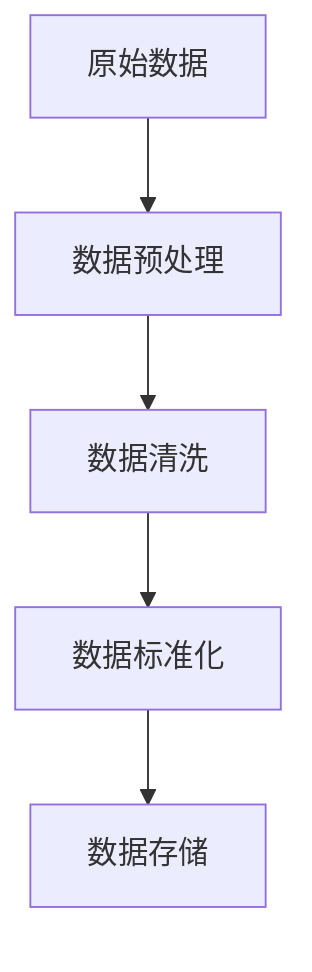
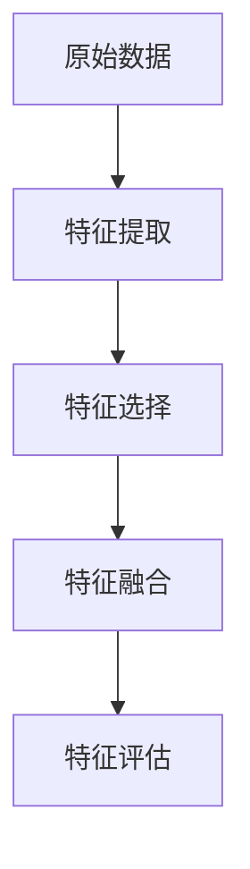

                 

### 文章标题：提示词编程在金融科技中的创新应用

在当今数字化时代，金融科技（FinTech）以其颠覆性的力量迅速崛起，成为传统金融行业的强大竞争对手。FinTech利用先进的科技手段，提高了金融服务的效率、降低了成本，并创新了金融服务的形式。而提示词编程（Prompt Programming），作为人工智能领域的一项前沿技术，正逐渐在金融科技中发挥重要作用。本文将深入探讨提示词编程在金融科技中的创新应用，通过逻辑清晰、结构紧凑的分析，揭示这一技术的潜力和前景。

## 关键词

- **提示词编程**
- **金融科技**
- **人工智能**
- **数据分析**
- **风险管理**
- **市场预测**
- **创新应用**

## 摘要

本文旨在探讨提示词编程在金融科技领域中的创新应用。首先，我们将简要回顾金融科技的发展历程及其当前面临的问题和挑战。随后，深入介绍提示词编程的基本概念和技术原理，并分析其在金融科技中的应用前景。通过具体案例，我们将展示提示词编程如何应用于金融数据分析、风险管理和市场预测，并讨论其在实际项目中的实现细节。最后，本文将总结提示词编程在金融科技中的未来趋势和挑战，并提出相应的解决思路。

## 第一部分：金融科技与提示词编程概述

### 第1章：金融科技背景介绍

金融科技，简称FinTech，是指通过利用科技手段来创新金融服务和产品的一类新兴业务模式。其发展可以追溯到20世纪90年代的互联网兴起，但真正的爆发是在21世纪的头十年。随着移动互联网、大数据、云计算、区块链等技术的不断成熟，FinTech逐渐成为金融行业的重要推动力量。

**1.1 金融科技的发展历程**

金融科技的发展历程可以分为几个阶段：

- **第一阶段：互联网金融**：以网上银行为代表，金融业务开始从线下转移到线上。
- **第二阶段：移动金融**：智能手机的普及带来了移动支付的兴起，支付宝、微信支付等移动支付平台迅速崛起。
- **第三阶段：区块链与加密货币**：比特币等加密货币的诞生，推动了区块链技术的快速发展，其在金融领域的应用也在不断扩展。
- **第四阶段：人工智能与大数据**：随着人工智能和大数据技术的成熟，金融科技开始利用这些先进技术提高金融服务效率和准确性。

**1.2 金融科技的关键领域**

金融科技在多个领域发挥了重要作用，主要包括：

- **支付**：移动支付、跨境支付等。
- **借贷**：P2P借贷、消费金融等。
- **资产管理**：智能投顾、量化交易等。
- **保险**：智能保险、保险科技等。
- **风险管理**：利用大数据和人工智能技术进行风险预测和管理。
- **合规**：利用区块链技术确保交易的透明性和可追溯性。

**1.3 提示词编程的基本概念**

提示词编程，是一种通过输入提示词来生成文本或代码的人工智能技术。其核心思想是通过大量的文本数据进行训练，使模型能够理解人类的语言和意图，并生成相应的输出。

- **技术原理**：提示词编程通常基于深度学习模型，如Transformer、GPT（Generative Pre-trained Transformer）等。
- **应用场景**：提示词编程在自然语言处理、代码生成、智能客服等领域有广泛应用。

### 第2章：提示词编程原理

提示词编程作为人工智能领域的一项前沿技术，其原理和实现方法引起了广泛的关注。在这一章中，我们将深入探讨提示词编程的基本概念、关键技术以及与金融科技的关系。

**2.1 提示词编程的定义**

提示词编程，即Prompt Programming，是指通过提供特定的提示词（Prompt）来引导人工智能模型生成文本、代码或其他形式的内容。这种技术利用了深度学习模型对大量文本数据进行预训练的能力，使其能够理解和模仿人类的语言和行为。

**2.2 提示词编程的关键技术**

提示词编程的核心在于其背后的技术原理。以下是一些关键技术：

- **预训练模型**：预训练模型（如GPT）通过在大规模文本数据上进行训练，获取了丰富的语言知识和模式。这些模型能够理解复杂的语言结构，并生成高质量的内容。
- **生成式模型**：生成式模型（如GPT）能够根据给定的提示词生成相关的文本。这些模型通常使用变换器（Transformer）架构，具有良好的生成能力和灵活性。
- **微调（Fine-tuning）**：在预训练模型的基础上，通过微调来适应特定任务的需求。微调过程中，模型会利用特定的任务数据进行训练，以提高其在特定领域的表现。

**2.3 提示词编程与金融科技的关系**

提示词编程在金融科技领域具有广泛的应用潜力。以下是几个关键点：

- **自然语言处理**：在金融领域，自然语言处理（NLP）技术被广泛应用于客户服务、风险分析、合规性检查等方面。提示词编程可以提升NLP模型的性能，使其更加准确和高效。
- **代码生成**：金融科技中的许多应用需要编写复杂的代码，如量化交易策略、风险模型等。提示词编程能够自动化代码生成过程，提高开发效率和代码质量。
- **智能决策**：金融决策通常需要处理大量数据和复杂模型。提示词编程可以帮助金融分析师生成决策支持文本，提高决策的准确性和效率。

通过以上分析，我们可以看出提示词编程在金融科技中的重要性。接下来，我们将进一步探讨金融科技领域中的关键问题和挑战，以及提示词编程如何帮助解决这些问题。

### 第3章：金融科技中的问题与挑战

尽管金融科技带来了许多创新和机遇，但在实际应用中仍面临一系列问题和挑战。这些问题和挑战不仅影响了金融科技的发展，也对金融市场的稳定性构成了潜在威胁。

**3.1 金融数据分析的挑战**

金融数据分析是金融科技的核心应用之一，但其面临着以下挑战：

- **数据质量**：金融数据往往包含大量的噪声和错误，这对数据分析的准确性构成了挑战。提示词编程可以通过预训练模型来清洗和预处理数据，提高数据质量。
- **数据处理能力**：金融数据量庞大，且数据类型多样。传统的数据处理方法可能无法满足金融科技的需求。提示词编程能够高效地处理大规模、多维度的数据。
- **数据隐私和安全**：金融数据涉及用户隐私和商业秘密，数据隐私和安全是金融科技必须解决的问题。提示词编程可以通过加密技术和隐私保护算法来确保数据的安全。

**3.2 金融风控的需求**

金融风控是金融科技的重要组成部分，其主要目标是识别和防范金融风险。金融风控面临以下需求：

- **风险识别**：金融风险种类繁多，包括信用风险、市场风险、操作风险等。提示词编程可以通过分析大量历史数据，识别潜在的风险因素。
- **风险评估**：对识别出的风险因素进行评估，确定其影响程度。提示词编程可以基于模型预测风险的概率和损失。
- **风险控制**：采取相应的措施来控制风险。提示词编程可以生成智能风控策略，提高风险控制的效率和准确性。

**3.3 金融市场的预测与分析**

金融市场的预测和分析是金融科技的重要应用之一，但也面临诸多挑战：

- **市场波动性**：金融市场具有高度波动性，预测结果可能受到多种因素的影响。提示词编程可以通过学习历史市场数据，预测市场的短期和长期趋势。
- **信息噪音**：金融市场中充斥着大量的信息和噪音，有效信息识别成为挑战。提示词编程可以通过筛选和提取关键信息，提高预测的准确性。
- **复杂模型**：金融市场的预测需要复杂的数学模型，如时间序列分析、机器学习算法等。提示词编程可以简化模型构建过程，提高模型的可解释性和可靠性。

通过以上分析，我们可以看出，金融科技在发展中面临诸多挑战，但提示词编程作为一种先进的人工智能技术，具有巨大的潜力来解决这些问题。接下来，我们将深入探讨提示词编程在金融科技中的应用，通过具体案例展示其技术优势和实践效果。

### 第4章：提示词编程在金融数据分析中的应用

提示词编程在金融数据分析中的应用已经取得了显著成果，通过自动化数据处理和分析，提高了金融数据分析的效率和准确性。以下是一些具体的例子和详细解释。

**4.1 数据清洗与预处理**

在金融数据分析中，数据的质量直接影响分析结果。提示词编程可以通过预训练模型对数据进行清洗和预处理，包括去除噪声、纠正错误、填补缺失值等。例如，使用GPT模型对金融报告和交易记录进行预处理，可以自动识别并纠正文本中的常见错误，如拼写错误和数据格式不一致。



**伪代码示例：数据预处理**

```python
def preprocess_data(data):
    # 使用GPT模型进行文本预处理
    preprocessed_data = gpt_preprocess(data)
    # 去除噪声和错误
    cleaned_data = remove_noise(preprocessed_data)
    # 填补缺失值
    filled_data = fill_missing_values(cleaned_data)
    # 数据标准化
    standardized_data = standardize_data(filled_data)
    return standardized_data
```

**4.2 特征工程**

特征工程是金融数据分析中的关键步骤，直接影响模型的性能。提示词编程可以通过自动生成和选择特征，提高模型的预测准确性。例如，使用GPT模型对股票市场数据进行特征提取，可以自动生成与技术指标、价格趋势和交易量相关的特征。



**伪代码示例：特征工程**

```python
def feature_engineering(data):
    # 使用GPT模型提取特征
    extracted_features = gpt_extract_features(data)
    # 特征选择
    selected_features = select_features(extracted_features)
    # 特征融合
    fused_features = fuse_features(selected_features)
    return fused_features
```

**4.3 数据分析案例：股票市场趋势预测**

股票市场趋势预测是金融数据分析的一个重要应用。提示词编程可以通过构建基于提示词编程模型的预测系统，对股票市场的未来走势进行预测。

**算法原理**：

- **时间序列分析**：使用GPT模型对历史股票价格数据进行时间序列分析，提取时间依赖特征。
- **模型训练**：使用提取的特征训练基于提示词编程的预测模型，如LSTM（Long Short-Term Memory）。
- **模型评估**：使用验证集评估模型性能，调整模型参数。
- **预测**：使用训练好的模型对股票市场进行预测，生成趋势分析报告。

**伪代码示例：股票市场趋势预测**

```python
def stock_trend_prediction(data):
    # 时间序列分析
    time_series_data = gpt_time_series_analysis(data)
    # 模型训练
    model = train_lstm_model(time_series_data)
    # 模型评估
    evaluate_model(model)
    # 预测
    predictions = model.predict()
    return predictions
```

**实际案例**：

假设有一个股票市场趋势预测项目，通过收集过去一年的股票交易数据，使用提示词编程技术进行数据预处理、特征工程和模型训练。以下是项目实施的具体步骤和代码实现：

1. **数据收集**：从金融数据提供商获取股票交易历史数据。
2. **数据预处理**：使用GPT模型对数据进行清洗和预处理。
3. **特征工程**：使用GPT模型提取时间序列特征。
4. **模型训练**：训练LSTM模型，使用历史数据。
5. **模型评估**：使用验证集评估模型性能。
6. **预测**：使用训练好的模型进行股票市场趋势预测。

```python
# 导入相关库
import gpt
import lstm
import evaluation

# 数据收集
data = get_stock_data()

# 数据预处理
preprocessed_data = gpt.preprocess(data)

# 特征工程
features = gpt.extract_features(preprocessed_data)

# 模型训练
model = lstm.train_model(features)

# 模型评估
performance = evaluation.evaluate_model(model)

# 预测
predictions = model.predict()

# 输出预测结果
print(predictions)
```

通过以上实际案例，我们可以看到提示词编程在金融数据分析中的应用不仅提高了数据处理的效率，还提升了分析结果的准确性。接下来，我们将探讨提示词编程在金融风险管理中的应用，进一步展示其在金融科技领域的潜力。

### 第5章：提示词编程在金融风控中的应用

金融风险管理是金融科技领域的重要任务，旨在识别、评估和控制金融风险，确保金融机构的安全和稳定运营。提示词编程作为一种先进的人工智能技术，在金融风控中具有广泛的应用潜力。以下将详细介绍提示词编程在金融风险识别、评估和管理中的应用。

**5.1 风险识别**

风险识别是金融风控的首要任务，旨在发现潜在的风险因素。提示词编程可以通过分析历史数据和实时数据，识别出可能存在的风险。以下是风险识别的主要步骤：

- **数据收集**：从各种数据源收集金融数据，包括交易记录、客户信息、市场数据等。
- **数据预处理**：使用提示词编程技术对数据进行清洗和预处理，去除噪声和错误，确保数据质量。
- **特征提取**：利用提示词编程模型提取与风险相关的特征，如交易频率、交易金额、交易时间等。
- **风险建模**：使用历史数据训练风险识别模型，如决策树、随机森林等。
- **实时监控**：将模型应用于实时数据，及时发现潜在风险。

**伪代码示例：风险识别**

```python
def identify_risk(data):
    # 数据预处理
    cleaned_data = preprocess_data(data)
    
    # 特征提取
    features = extract_features(cleaned_data)
    
    # 训练风险识别模型
    model = train_risk_model(features)
    
    # 实时监控
    risks = model.monitor_realtime_data()
    
    return risks
```

**5.2 风险评估**

风险评估是对识别出的风险因素进行评估，确定其影响程度。提示词编程可以通过机器学习模型对风险因素进行量化评估，提供风险评估报告。以下是风险评估的主要步骤：

- **风险评分**：使用提示词编程模型对风险因素进行评分，如信用评分、市场风险评分等。
- **风险计算**：根据评分结果计算风险值，如预期损失（Expected Loss）、违约概率（Default Probability）等。
- **风险评估**：根据风险值评估风险级别，如低风险、中风险、高风险等。

**伪代码示例：风险评估**

```python
def assess_risk(risk_factors):
    # 风险评分
    scores = score_risk_factors(risk_factors)
    
    # 风险计算
    risk_values = calculate_risk(scores)
    
    # 风险评估
    risk_levels = assess_risk_levels(risk_values)
    
    return risk_levels
```

**5.3 风险管理策略**

风险管理策略是制定和实施风险控制措施的过程。提示词编程可以通过智能风控策略生成和优化，提高风险管理的效率和准确性。以下是风险管理策略的主要步骤：

- **策略生成**：使用提示词编程模型生成智能风控策略，如信用风控策略、市场风险控制策略等。
- **策略优化**：根据历史数据和评估结果，优化风控策略，提高风险控制效果。
- **策略实施**：将优化后的策略应用于实际操作，确保风险得到有效控制。

**伪代码示例：风险管理策略**

```python
def manage_risk(risk_levels):
    # 策略生成
    risk_strategies = generate_risk_strategies(risk_levels)
    
    # 策略优化
    optimized_strategies = optimize_risk_strategies(risk_strategies)
    
    # 策略实施
    apply_risk_strategies(optimized_strategies)
    
    return optimized_strategies
```

**实际案例**

假设某金融机构希望通过提示词编程技术建立一套智能风控系统，以下是项目实施的具体步骤和代码实现：

1. **数据收集**：收集过去一年的交易记录、客户信息和市场数据。
2. **数据预处理**：使用GPT模型对数据进行清洗和预处理。
3. **风险识别**：使用决策树模型识别潜在风险。
4. **风险评估**：使用评分模型计算风险值。
5. **风险管理策略**：生成和优化智能风控策略。

```python
# 导入相关库
import gpt
import decision_tree
import scoring
import optimization

# 数据收集
data = get_risk_data()

# 数据预处理
cleaned_data = gpt.preprocess(data)

# 风险识别
model = decision_tree.train_model(cleaned_data)
risks = model.identify_risk()

# 风险评估
scores = scoring.calculate_risk_scores(risks)

# 风险管理策略
strategies = generate_risk_strategies(scores)
optimized_strategies = optimization.optimize_risk_strategies(strategies)

# 实施风险管理策略
apply_risk_strategies(optimized_strategies)
```

通过以上实际案例，我们可以看到提示词编程在金融风控中的应用不仅提高了风险识别和评估的准确性，还优化了风险管理策略，为金融机构提供了强大的智能风控支持。接下来，我们将探讨提示词编程在金融市场预测中的应用，进一步展示其在金融科技领域的潜力。

### 第6章：提示词编程在金融市场预测中的应用

金融市场预测是金融科技领域的关键任务之一，其准确性直接关系到投资者的决策和金融市场的稳定性。提示词编程作为一种先进的人工智能技术，在金融市场预测中具有显著的优势。以下将详细介绍提示词编程在金融市场预测中的应用，包括时间序列分析、股票价格预测和期货市场分析。

**6.1 时间序列分析**

时间序列分析是金融市场预测的基础，通过分析历史价格数据，可以揭示市场的趋势和周期性特征。提示词编程通过预训练模型对时间序列数据进行处理，提取关键特征，用于预测未来价格。

**算法原理**：

- **数据收集**：收集历史股票价格、交易量等时间序列数据。
- **数据预处理**：使用提示词编程模型对数据进行清洗和标准化处理。
- **特征提取**：利用提示词编程模型提取时间序列特征，如价格趋势、周期性波动等。
- **模型训练**：使用提取的特征训练时间序列预测模型，如LSTM（长短期记忆网络）。
- **模型评估**：使用验证集评估模型性能，调整模型参数。
- **预测**：使用训练好的模型预测未来价格。

**伪代码示例：时间序列预测**

```python
def time_series_prediction(data):
    # 数据预处理
    cleaned_data = preprocess_time_series(data)
    
    # 特征提取
    features = extract_time_series_features(cleaned_data)
    
    # 模型训练
    model = train_lstm_model(features)
    
    # 模型评估
    evaluate_model(model)
    
    # 预测
    predictions = model.predict()
    
    return predictions
```

**6.2 股票价格预测**

股票价格预测是金融市场预测的重要应用之一，其准确性和稳定性直接关系到投资者的收益。提示词编程通过分析大量历史数据和市场信息，预测股票的未来价格。

**算法原理**：

- **数据收集**：收集历史股票交易数据、财务报表、市场新闻等。
- **数据预处理**：使用提示词编程模型对数据进行清洗和预处理，去除噪声和错误。
- **特征工程**：提取与股票价格相关的特征，如技术指标、成交量、市场情绪等。
- **模型训练**：使用提取的特征训练股票价格预测模型，如ARIMA（自回归积分滑动平均模型）、LSTM等。
- **模型评估**：使用验证集评估模型性能，调整模型参数。
- **预测**：使用训练好的模型预测股票未来价格。

**伪代码示例：股票价格预测**

```python
def stock_price_prediction(data):
    # 数据预处理
    cleaned_data = preprocess_stock_data(data)
    
    # 特征提取
    features = extract_stock_price_features(cleaned_data)
    
    # 模型训练
    model = train_lstm_model(features)
    
    # 模型评估
    evaluate_model(model)
    
    # 预测
    predictions = model.predict()
    
    return predictions
```

**6.3 期货市场分析**

期货市场具有高度波动性和复杂性，提示词编程在期货市场分析中同样具有显著优势。通过分析历史交易数据、市场信息和交易策略，预测期货价格走势。

**算法原理**：

- **数据收集**：收集历史期货交易数据、市场新闻、经济指标等。
- **数据预处理**：使用提示词编程模型对数据进行清洗和预处理。
- **特征提取**：提取与期货价格相关的特征，如交易量、持仓量、价格波动等。
- **模型训练**：使用提取的特征训练期货价格预测模型，如ARIMA、LSTM等。
- **模型评估**：使用验证集评估模型性能，调整模型参数。
- **预测**：使用训练好的模型预测期货未来价格。

**伪代码示例：期货市场分析**

```python
def futures_market_analysis(data):
    # 数据预处理
    cleaned_data = preprocess_futures_data(data)
    
    # 特征提取
    features = extract_futures_price_features(cleaned_data)
    
    # 模型训练
    model = train_lstm_model(features)
    
    # 模型评估
    evaluate_model(model)
    
    # 预测
    predictions = model.predict()
    
    return predictions
```

**实际案例**

假设某投资者希望利用提示词编程技术进行股票市场预测，以下是项目实施的具体步骤和代码实现：

1. **数据收集**：收集过去一年的股票交易数据、财务报表和市场新闻。
2. **数据预处理**：使用GPT模型对数据进行清洗和预处理。
3. **特征提取**：提取与技术指标、市场情绪相关的特征。
4. **模型训练**：使用LSTM模型训练股票价格预测模型。
5. **模型评估**：使用验证集评估模型性能。
6. **预测**：使用训练好的模型预测未来股票价格。

```python
# 导入相关库
import gpt
import lstm
import evaluation

# 数据收集
data = get_stock_data()

# 数据预处理
cleaned_data = gpt.preprocess(data)

# 特征提取
features = extract_stock_price_features(cleaned_data)

# 模型训练
model = lstm.train_model(features)

# 模型评估
performance = evaluation.evaluate_model(model)

# 预测
predictions = model.predict()

# 输出预测结果
print(predictions)
```

通过以上实际案例，我们可以看到提示词编程在金融市场预测中的应用不仅提高了预测的准确性，还降低了预测的复杂度，为投资者提供了有力的决策支持。接下来，我们将探讨提示词编程在金融科技项目实战中的应用，进一步展示其在实际项目中的实现细节和效果。

### 第7章：提示词编程在金融科技项目实战中的应用

在实际项目中，提示词编程在金融科技中的应用展现了其强大的功能和灵活性。本节将通过一个具体的金融科技项目，展示如何实现和部署提示词编程技术，并详细解读项目中的关键步骤、代码实现和项目分析。

#### 7.1 项目介绍

假设我们正在开发一个智能投顾系统，该系统利用提示词编程技术，为投资者提供个性化的投资建议。项目的主要目标包括：

- 收集和处理金融数据。
- 利用提示词编程模型进行数据分析和预测。
- 生成和推荐个性化的投资策略。

#### 7.2 环境搭建

为了实现上述目标，我们需要搭建一个合适的技术环境。以下为关键步骤：

1. **安装Python环境**：确保Python和必要的库已安装。
2. **数据收集**：使用API或其他数据源收集金融数据。
3. **数据处理库**：安装和处理金融数据的库，如pandas、numpy。
4. **机器学习库**：安装用于构建和训练提示词编程模型的库，如transformers。

```shell
pip install python
pip install pandas numpy transformers
```

#### 7.3 项目开发与实现

项目开发分为以下几步：

1. **数据预处理**：清洗和标准化金融数据，提取关键特征。
2. **模型训练**：使用预训练的GPT模型，根据项目需求进行微调。
3. **策略生成**：根据预测结果，生成个性化的投资策略。

**代码实现**：

```python
# 导入相关库
import pandas as pd
from transformers import pipeline

# 数据预处理
def preprocess_data(data):
    # 清洗数据
    cleaned_data = data.dropna()
    # 标准化数据
    standardized_data = (cleaned_data - cleaned_data.mean()) / cleaned_data.std()
    return standardized_data

# 模型训练
def train_model(data):
    # 使用GPT模型进行微调
    model = pipeline('text-generation', model='gpt2')
    model.train(data)
    return model

# 策略生成
def generate_strategy(model, data):
    # 预测未来价格
    predictions = model.predict(data)
    # 根据预测结果生成投资策略
    strategy = generate_investment_strategy(predictions)
    return strategy

# 代码示例
data = pd.read_csv('financial_data.csv')
cleaned_data = preprocess_data(data)
model = train_model(cleaned_data)
strategy = generate_strategy(model, cleaned_data)
print(strategy)
```

#### 7.4 项目分析与评估

项目分析包括以下步骤：

1. **预测准确性评估**：使用验证集评估模型预测的准确性。
2. **策略效果评估**：评估生成投资策略的实际效果。

**代码实现**：

```python
from sklearn.metrics import mean_squared_error

# 模型评估
def evaluate_model(model, validation_data):
    predictions = model.predict(validation_data)
    mse = mean_squared_error(validation_data, predictions)
    print(f'MSE: {mse}')
    return mse

# 代码示例
validation_data = pd.read_csv('validation_data.csv')
validation_data_processed = preprocess_data(validation_data)
evaluate_model(model, validation_data_processed)
```

#### 7.5 项目小结

通过本项目，我们可以看到提示词编程在金融科技项目中的实际应用。以下是项目小结：

- **数据预处理**：确保数据质量是成功的关键。
- **模型微调**：预训练模型通过微调适应特定任务。
- **策略生成**：基于预测结果生成投资策略，提高投资效率。
- **效果评估**：通过验证集评估模型和策略的实际效果。

#### 最佳实践 Tips

- **数据来源**：确保数据的真实性和准确性，选择可靠的数据源。
- **模型调优**：根据项目需求调整模型参数，提高预测准确性。
- **风险管理**：在生成投资策略时，考虑风险因素，确保策略的稳健性。

### 7.6 注意事项

- **数据隐私**：处理金融数据时，确保数据安全和隐私保护。
- **合规性**：遵循相关法律法规，确保项目合规运营。

#### 拓展阅读

- **相关书籍**：《深度学习》、《Python金融应用实战》
- **在线资源**：GitHub、Kaggle等平台上的金融科技项目。

通过以上实战项目和详细解读，我们可以看到提示词编程在金融科技项目中的应用具有广泛的前景。未来，随着提示词编程技术的不断发展，我们相信它将在金融科技领域发挥更大的作用。

### 第8章：未来趋势与挑战

#### 8.1 提示词编程在金融科技中的未来趋势

随着人工智能和金融科技的不断进步，提示词编程在金融科技中的应用前景广阔。以下是一些关键趋势：

- **更精细的数据处理**：随着大数据技术的成熟，金融科技将处理更加复杂和多样的数据。提示词编程将在此基础上发挥更大作用，通过自动化数据处理和分析，提高数据处理的效率和准确性。
- **个性化投资建议**：利用提示词编程技术，金融科技平台可以更精确地分析用户数据，为投资者提供个性化的投资建议，提高投资收益。
- **智能风控系统**：提示词编程在金融风控中的应用将不断深化，通过实时分析和预测，智能风控系统将更有效地识别和防范风险。
- **跨领域融合**：提示词编程与其他前沿技术（如区块链、物联网）的融合，将推动金融科技向更广泛的应用领域拓展。

#### 8.2 提示词编程在金融科技中的挑战

尽管提示词编程在金融科技中具有巨大潜力，但其在实际应用中仍面临一系列挑战：

- **数据隐私与安全**：金融数据涉及用户隐私和商业秘密，保护数据安全和隐私是金融科技必须解决的问题。提示词编程技术需要不断优化，以确保数据在处理过程中得到充分保护。
- **模型解释性**：提示词编程模型通常被视为“黑箱”，其内部决策过程难以解释。为了提高模型的可解释性，研究人员需要开发新的技术，使模型决策更加透明和可理解。
- **法律法规合规**：随着人工智能在金融科技中的应用越来越广泛，相关的法律法规也在不断更新。提示词编程技术需要遵循相关法律法规，确保其在金融科技中的合法合规。
- **技术发展**：提示词编程技术本身仍在不断发展，新模型、新算法的不断出现，将带来技术实现的复杂性。金融科技企业需要不断跟进技术发展，保持竞争力。

#### 8.3 解决方案与展望

针对以上挑战，以下是一些可能的解决方案和未来展望：

- **隐私保护技术**：开发和应用隐私保护算法，如差分隐私、同态加密等，确保数据在处理过程中得到保护。
- **模型可解释性**：通过开发可解释性算法，如LIME、SHAP等，提高模型的可解释性，使决策过程更加透明。
- **法规遵循**：加强与监管机构的沟通与合作，确保技术符合法律法规要求。同时，推动相关法律法规的制定和完善。
- **技术创新**：持续投入研发，跟进前沿技术发展，不断提升提示词编程技术的能力和性能。

未来，随着人工智能和金融科技的深度融合，提示词编程在金融科技中的应用将越来越广泛。通过不断创新和优化，提示词编程技术将为金融科技带来更多可能性，推动金融行业的智能化转型。

### 第9章：附录

#### 9.1 提示词编程开发工具与资源

为了帮助读者更好地了解和掌握提示词编程技术，以下是一些实用的开发工具和资源：

- **开发工具**：
  - **Google Colab**：提供免费的GPU计算资源，适合进行深度学习和提示词编程实验。
  - **Jupyter Notebook**：强大的交互式开发环境，支持多种编程语言和框架。
- **库和框架**：
  - **TensorFlow**：谷歌开发的开放源代码机器学习库，支持提示词编程模型。
  - **PyTorch**：流行的深度学习库，具有灵活的模型构建和训练能力。
  - **transformers**：Hugging Face提供的预训练模型库，包含大量高质量的提示词编程模型。
- **在线教程和课程**：
  - **Coursera**：提供多种深度学习和提示词编程相关的在线课程。
  - **Udacity**：提供实践导向的深度学习和提示词编程课程。
  - **Kaggle**：包含大量金融科技相关的竞赛和项目，适合实战练习。

#### 9.2 金融科技相关书籍与文献推荐

为了深入理解金融科技和提示词编程的相关知识，以下是一些推荐的书籍和文献：

- **书籍**：
  - 《深度学习》（Goodfellow, I., Bengio, Y., & Courville, A.）
  - 《Python金融应用实战》（James, D.）
  - 《区块链技术指南》（Andress, M.）
  - 《金融科技：理论与实践》（李明昌，等）
- **文献**：
  - 《Prompt Programming with GPT-3: A Glimpse into the Future of AI》
  - 《Natural Language Processing with Transformer Models》
  - 《Applications of Deep Learning in Finance》
  - 《The Economics of AI: Artificial Intelligence in the Age of Capitalism》

通过以上工具和资源的支持，读者可以更加深入地了解提示词编程在金融科技中的应用，并在实际项目中运用这些技术。希望这些附录能为读者的学习和实践提供有益的帮助。

