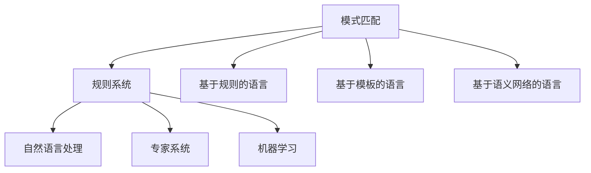
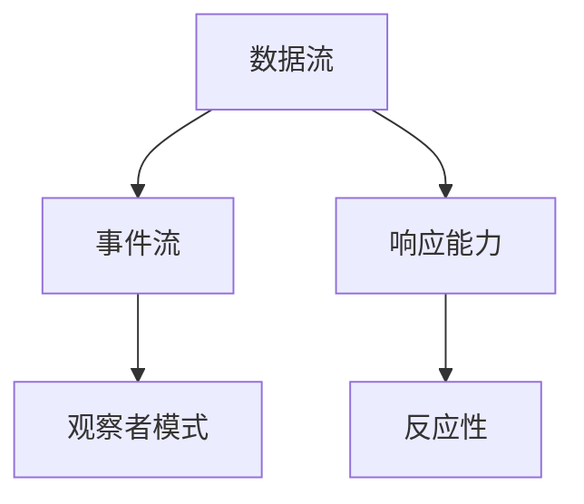
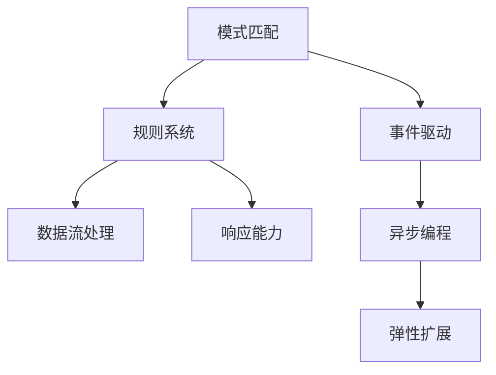
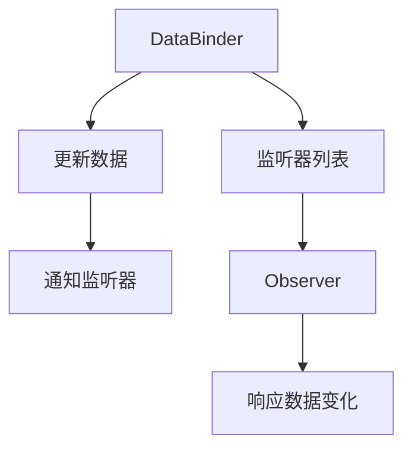
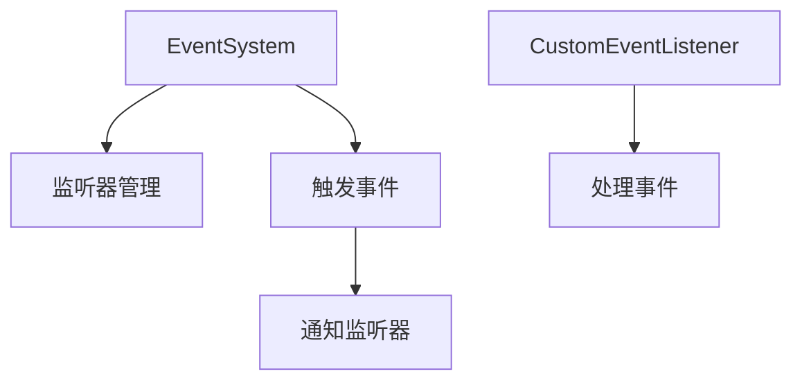
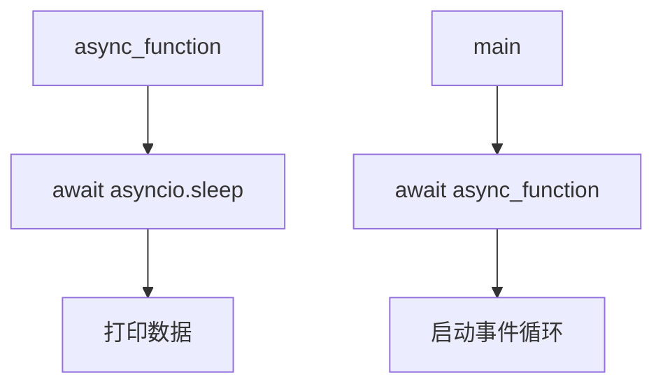
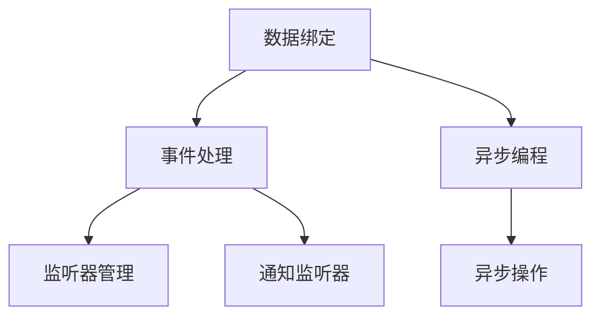
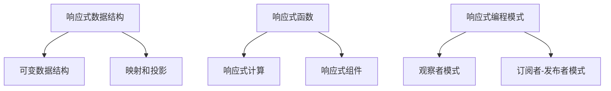
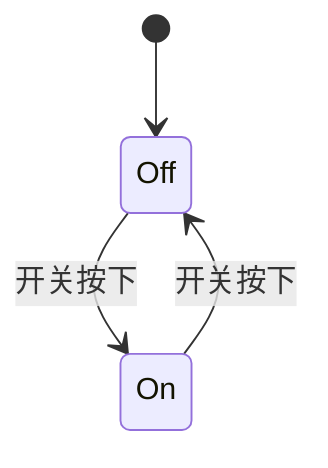

                 

### 文章标题

提示词编程语言的响应式编程支持

### 文章关键词

提示词编程语言，响应式编程，数据绑定，事件处理，异步编程，数学模型

### 摘要

本文旨在深入探讨提示词编程语言对响应式编程的支持。我们将从概述与基础知识开始，介绍提示词编程语言的基本概念、响应式编程的定义以及它们之间的联系。接着，我们将详细讲解响应式编程的核心算法原理，包括数据绑定、事件处理和异步编程。此外，我们还将探讨响应式编程的数学模型，并通过实际项目案例展示响应式编程在提示词编程语言中的实际应用。通过本文，读者将能够全面了解响应式编程在提示词编程语言中的运用，并掌握相关技术进行实践。

### 用户需求分析

在现代编程领域，提示词编程语言和响应式编程正逐渐受到关注。用户希望了解如何利用提示词编程语言实现响应式编程，以提高编程效率和系统性能。用户需求主要体现在以下几个方面：

1. **核心概念与联系**：用户希望了解提示词编程语言和响应式编程的基本概念，以及它们之间的相互关系。

2. **核心算法原理讲解**：用户希望掌握响应式编程的核心算法原理，包括数据绑定、事件处理和异步编程。

3. **数学模型和数学公式**：用户希望了解响应式编程的数学模型和数学公式，以及它们在实际编程中的应用。

4. **项目实战**：用户希望通过实际案例，了解如何在提示词编程语言中实现响应式编程。

### 目录大纲结构设计

为了满足用户的需求，本文将分为四个主要部分，分别从核心概念、算法原理、数学模型和项目实战进行详细讲解。

#### 第一部分：概述与基础知识

本部分将介绍提示词编程语言和响应式编程的基本概念，包括它们的特点和应用场景。我们将详细讲解提示词编程语言如何支持响应式编程，以及响应式编程如何增强提示词编程语言的功能。

1. **提示词编程语言概述**
   - 提示词编程语言的基本概念
   - 提示词编程语言的类型
   - 提示词编程语言的应用场景

2. **响应式编程基础**
   - 响应式编程的定义
   - 响应式编程与传统编程的区别
   - 响应式编程的关键概念

3. **提示词编程语言与响应式编程的联系**
   - 提示词编程语言如何支持响应式编程
   - 响应式编程如何增强提示词编程语言的功能

#### 第二部分：核心算法原理

本部分将详细讲解响应式编程的核心算法原理，包括数据绑定、事件处理和异步编程。我们将通过伪代码展示这些算法的实现，帮助读者更好地理解。

1. **数据绑定算法**
   - 数据绑定机制
   - 数据绑定流程
   - 数据绑定实现

2. **事件处理算法**
   - 事件监听机制
   - 事件处理流程
   - 事件处理实现

3. **异步编程算法**
   - 异步编程模型
   - 异步编程流程
   - 异步编程实现

#### 第三部分：数学模型与数学公式

本部分将介绍响应式编程的数学模型，包括数据流图模型、状态转换模型和动态系统模型。我们将使用 LaTeX 格式展示相关数学公式，并通过举例说明这些模型在实际编程中的应用。

1. **数据流图模型**
   - 数据流图的定义
   - 数据流图的构建
   - 数据流图的运用

2. **状态转换模型**
   - 状态转换图的定义
   - 状态转换图的构建
   - 状态转换图的运用

3. **动态系统模型**
   - 动态系统模型的概念
   - 动态系统模型的构建
   - 动态系统模型的应用

#### 第四部分：项目实战

本部分将通过实际项目案例，展示如何在提示词编程语言中实现响应式编程。我们将详细讲解项目开发环境搭建、源代码实现、代码解读和效果分析。

1. **实际应用案例**
   - 案例一：实时数据监控系统的实现
   - 案例二：聊天机器人的响应式交互
   - 案例三：金融交易系统的动态更新

2. **项目实战详解**
   - 项目开发环境搭建
   - 项目源代码实现与解读
   - 项目效果分析与优化

### 目录大纲总结

本文共计十个章节，涵盖了提示词编程语言和响应式编程的核心概念、算法原理、数学模型和实际应用。通过本文，读者将能够系统地了解响应式编程在提示词编程语言中的运用，掌握相关技术并进行实践。总体字数控制在 8000～12000 字左右。

---

## 第一部分：概述与基础知识

### 第1章 提示词编程语言概述

提示词编程语言（Pattern-based Programming Language）是一种基于模式匹配的编程语言，它通过模式匹配来实现程序的自动化和智能化。提示词编程语言的基本概念、类型和应用场景是理解其响应式编程支持的基础。

#### 1.1 提示词编程语言的基本概念

提示词编程语言的核心思想是将程序拆解成一系列的模式和规则，这些模式和规则描述了程序的结构和行为。在执行程序时，系统会根据输入数据与模式进行匹配，从而决定下一步的操作。

- **模式匹配**：模式匹配是提示词编程语言的核心机制，它通过将输入数据与预定义的模式进行对比，确定输入数据是否符合模式。
- **规则系统**：提示词编程语言通常包含一套规则系统，用于定义程序的逻辑和行为。这些规则可以是简单的条件判断，也可以是复杂的逻辑组合。

#### 1.2 提示词编程语言的类型

提示词编程语言可以分为以下几种类型：

- **基于规则的语言**：这种语言主要通过预定义的规则来描述程序的行为。如业务规则语言（Business Rules Language），常用于企业级应用中。
- **基于模板的语言**：这种语言通过模板来定义程序的结构和逻辑。模板通常包含一些可变的部分，根据输入数据的不同，模板中的可变部分会被填充。
- **基于语义网络的语言**：这种语言使用语义网络来描述数据和程序的行为。语义网络中的节点和边代表了数据和关系，程序通过遍历这些节点和边来执行操作。

#### 1.3 提示词编程语言的应用场景

提示词编程语言在以下应用场景中具有显著优势：

- **自然语言处理**：提示词编程语言可以用于处理复杂的自然语言数据，如语义分析、情感分析和语言生成等。
- **专家系统**：提示词编程语言可以用于构建专家系统，通过规则和模式匹配来模拟人类专家的决策过程。
- **机器学习**：提示词编程语言可以用于实现机器学习算法，通过模式匹配来发现数据中的规律和模式。

#### 1.4 核心概念原理之间的关系架构

为了更好地理解提示词编程语言的核心概念，我们使用 Mermaid 流程图来展示它们之间的关系：



#### 1.5 核心概念与联系

提示词编程语言的核心概念包括模式匹配、规则系统和编程语言类型。这些概念之间的关系如下：

- **模式匹配**：模式匹配是提示词编程语言的基础，它决定了程序如何处理输入数据。
- **规则系统**：规则系统是基于模式匹配构建的，它定义了程序的逻辑和行为。
- **编程语言类型**：不同的提示词编程语言类型基于相同的模式匹配和规则系统，但具体实现和应用场景有所不同。

通过上述内容，我们为读者提供了一个关于提示词编程语言的基本概述，为后续章节的深入讨论打下了坚实的基础。

### 第2章 响应式编程基础

响应式编程（Reactive Programming）是一种编程范式，旨在通过数据流和状态的变化来构建应用程序。它与传统的命令式编程（Imperative Programming）有显著的区别。在本章中，我们将介绍响应式编程的定义、与传统编程的区别以及其关键概念。

#### 2.1 响应式编程的定义

响应式编程是一种基于数据流的编程范式，强调数据的动态性和程序对数据的响应能力。在响应式编程中，程序的状态是由数据驱动的，当数据发生变化时，程序会自动更新并响应该变化。

- **数据流**：数据流是响应式编程的核心概念之一。在数据流编程中，数据以流的形式传递，程序通过监听数据流的变化来执行操作。
- **响应能力**：响应能力是指程序能够自动地、透明地响应数据的变化。这种能力使得程序更加动态和灵活，减少了手动更新的需求。

#### 2.2 响应式编程与传统编程的区别

响应式编程与传统编程在以下几个方面有显著的区别：

- **编程范式**：传统编程采用命令式编程范式，程序通过一系列命令来描述操作。而响应式编程则采用声明式编程范式，通过描述数据流和状态变化来构建程序。
- **数据驱动**：在传统编程中，程序的状态是由代码驱动的，程序需要明确地更新状态。而在响应式编程中，状态是由数据驱动的，当数据变化时，程序会自动更新。
- **异步处理**：传统编程通常基于同步模型，程序执行是顺序的。而响应式编程则更多地采用异步模型，可以同时处理多个事件和任务。

#### 2.3 响应式编程的关键概念

响应式编程包括以下几个关键概念：

- **事件流**：事件流是数据流的另一种表达方式，描述了程序中发生的事件序列。响应式编程通过监听事件流来执行操作。
- **观察者模式**：观察者模式是一种设计模式，用于实现对象间的依赖关系。在响应式编程中，观察者模式用于监听数据变化并触发更新。
- **反应性**：反应性是指程序能够自动响应该变化的能力。反应性是响应式编程的核心特点之一。

#### 2.4 核心概念原理之间的关系架构

为了更好地理解响应式编程的关键概念，我们使用 Mermaid 流程图来展示它们之间的关系：



#### 2.5 核心概念与联系

响应式编程的关键概念包括数据流、事件流、响应能力和反应性。这些概念之间的关系如下：

- **数据流**：数据流是响应式编程的基础，描述了程序中数据的传递方式。
- **事件流**：事件流是数据流的一种特殊形式，描述了程序中事件的发生顺序。
- **响应能力**：响应能力是指程序能够自动响应数据变化的能力，是响应式编程的核心。
- **反应性**：反应性是响应能力的一种体现，描述了程序对数据变化的自动更新。

通过上述内容，我们为读者提供了一个关于响应式编程的基础概述，为后续章节的深入讨论打下了坚实的基础。

### 第3章 提示词编程语言与响应式编程的联系

提示词编程语言（Pattern-based Programming Language）和响应式编程（Reactive Programming）虽然在概念上有所不同，但它们在实现自动化和智能化方面有着共同的目标。在本章中，我们将探讨提示词编程语言如何支持响应式编程，以及响应式编程如何增强提示词编程语言的功能。

#### 3.1 提示词编程语言如何支持响应式编程

提示词编程语言通过其模式匹配和规则系统，为响应式编程提供了强有力的支持。以下是如何在提示词编程语言中实现响应式编程的几个关键点：

- **模式匹配**：提示词编程语言的核心是模式匹配，它允许程序根据输入数据与预定义的模式进行匹配。在响应式编程中，模式匹配可以用来监听数据变化，并触发相应的更新操作。
- **规则系统**：提示词编程语言的规则系统可以定义复杂的业务逻辑和数据处理规则。在响应式编程中，规则系统可以用来处理数据流，实现自动化的数据更新和事件响应。
- **事件驱动**：提示词编程语言通常支持事件驱动编程模型，允许程序在特定事件发生时执行特定的操作。在响应式编程中，事件驱动模型可以用来处理异步事件和并发任务。

#### 3.2 响应式编程如何增强提示词编程语言的功能

响应式编程为提示词编程语言带来了以下几个增强功能：

- **数据流处理**：响应式编程支持数据流的动态处理，允许程序在数据变化时自动更新。这可以显著提高数据处理效率和程序响应速度。
- **异步编程**：响应式编程提供了高效的异步编程模型，允许程序在多个任务之间进行并发处理。这可以减少程序等待时间，提高整体性能。
- **弹性扩展**：响应式编程具有较好的弹性扩展性，可以在程序规模扩大时保持性能稳定。这对于处理大规模数据和高并发场景尤为重要。

#### 3.3 提示词编程语言与响应式编程的优势互补

提示词编程语言和响应式编程各自具有独特的优势，它们相互结合可以发挥更大的作用：

- **提示词编程语言的优势**：提示词编程语言擅长处理复杂的业务逻辑和数据模式，通过模式匹配和规则系统能够实现高度自动化和智能化。
- **响应式编程的优势**：响应式编程提供了强大的数据流处理和事件响应能力，能够实现高效的数据更新和异步任务处理。

通过结合提示词编程语言的自动化和智能化能力与响应式编程的数据流和事件响应能力，可以构建出具有高效率、高性能和高度可扩展性的应用程序。

#### 3.4 核心概念原理之间的关系架构

为了更好地理解提示词编程语言与响应式编程的联系，我们使用 Mermaid 流程图来展示它们之间的核心概念关系：



#### 3.5 核心概念与联系

提示词编程语言与响应式编程的核心概念包括模式匹配、规则系统、事件驱动和数据流处理。这些概念之间的关系如下：

- **模式匹配**：模式匹配是提示词编程语言的核心机制，用于监听数据变化。
- **规则系统**：规则系统用于定义程序逻辑和数据处理的规则，与数据流处理和异步编程密切相关。
- **事件驱动**：事件驱动是响应式编程的核心概念，用于处理异步事件和并发任务。
- **数据流处理**：数据流处理是响应式编程的核心机制，通过监听数据变化实现自动更新。

通过上述内容，我们探讨了提示词编程语言与响应式编程的联系，展示了它们在实现自动化和智能化方面的优势互补。为后续章节的深入讨论奠定了基础。

### 第二部分：核心算法原理

#### 第4章 响应式编程算法原理

响应式编程的核心在于其处理数据流和状态变化的能力。本章将详细介绍响应式编程的三个核心算法原理：数据绑定、事件处理和异步编程。我们将通过伪代码和流程图来解释这些算法的原理和实现。

#### 4.1 数据绑定算法

数据绑定是响应式编程中的一种关键机制，用于将数据的改变与程序的更新关联起来。数据绑定算法的基本原理是在数据和程序之间建立一个双向的关联，当数据变化时，程序能够自动更新。

**伪代码示例：**

```python
class DataBinder:
    def __init__(self, data):
        self.data = data
        self.listeners = []

    def add_listener(self, listener):
        self.listeners.append(listener)

    def update_data(self, new_data):
        self.data = new_data
        for listener in self.listeners:
            listener.on_data_change(self.data)

class Observer:
    def on_data_change(self, data):
        print(f"Data changed: {data}")

# 使用示例
binder = DataBinder(10)
observer = Observer()
binder.add_listener(observer)
binder.update_data(20)
```

在这个示例中，`DataBinder`类负责维护数据和监听器列表，当数据更新时，它会通知所有的监听器。`Observer`类实现了一个`on_data_change`方法，用于响应该数据变化。

**流程图：**



#### 4.2 事件处理算法

事件处理是响应式编程的另一个关键机制，用于处理程序中的各种事件，如用户输入、系统通知等。事件处理算法的核心是在程序中注册事件监听器，并在事件发生时触发相应的处理。

**伪代码示例：**

```python
class EventSystem:
    def __init__(self):
        self.listeners = {}

    def add_listener(self, event_type, listener):
        if event_type not in self.listeners:
            self.listeners[event_type] = []
        self.listeners[event_type].append(listener)

    def trigger_event(self, event_type, event_data):
        if event_type in self.listeners:
            for listener in self.listeners[event_type]:
                listener(event_data)

class CustomEventListener:
    def __call__(self, event_data):
        print(f"Event received: {event_data}")

# 使用示例
event_system = EventSystem()
event_system.add_listener("custom_event", CustomEventListener())
event_system.trigger_event("custom_event", "Hello, World!")
```

在这个示例中，`EventSystem`类负责管理事件监听器和事件触发。`CustomEventListener`类实现了事件监听器的接口，用于处理特定类型的事件。

**流程图：**



#### 4.3 异步编程算法

异步编程是响应式编程的一个重要组成部分，它允许程序在执行某些操作时不会阻塞主线程，从而实现高效的并发处理。异步编程算法的核心在于通过回调函数、Promise 对象或生成器来实现异步操作。

**伪代码示例：**

```python
import asyncio

async def async_function(data):
    # 模拟异步操作
    await asyncio.sleep(1)
    print(f"Processed data: {data}")

# 使用示例
async def main():
    await async_function("Hello, World!")

asyncio.run(main())
```

在这个示例中，`async_function`是一个异步函数，它使用`await`关键字等待一个异步操作完成。`main`函数也是异步的，并在最后使用`asyncio.run`启动事件循环。

**流程图：**



#### 4.4 核心概念原理之间的关系架构

为了更好地理解响应式编程的核心算法原理，我们使用 Mermaid 流程图来展示它们之间的关系：



#### 4.5 核心概念与联系

响应式编程的核心算法原理包括数据绑定、事件处理和异步编程。这些概念之间的关系如下：

- **数据绑定**：数据绑定是将数据的变化与程序的更新关联起来的机制。
- **事件处理**：事件处理是响应式编程中的事件监听和响应机制。
- **异步编程**：异步编程是响应式编程中的并发处理机制，允许程序在执行某些操作时不会阻塞主线程。

通过上述内容，我们详细介绍了响应式编程的核心算法原理，为读者理解响应式编程在提示词编程语言中的应用打下了坚实的基础。

### 第5章 提示词编程语言的响应式编程支持

提示词编程语言通过其特有的模式匹配和规则系统，为响应式编程提供了强大的支持。在本章中，我们将探讨提示词编程语言中的响应式数据结构、响应式函数以及响应式编程模式，并解释这些机制如何实现高效的响应式编程。

#### 5.1 提示词编程语言中的响应式数据结构

提示词编程语言通常提供了一系列响应式数据结构，这些数据结构能够自动追踪数据的变化，并在数据发生变化时触发更新。

**1. 可变数据结构**

提示词编程语言中的可变数据结构，如列表和字典，通常具有内置的响应式特性。当数据结构中的元素发生变化时，所有依赖于这些数据的响应式组件都会自动更新。

**伪代码示例：**

```python
class ObservableList:
    def __init__(self, data):
        self.data = data
        self.listeners = []

    def add_listener(self, listener):
        self.listeners.append(listener)

    def update_data(self, new_data):
        self.data = new_data
        for listener in self.listeners:
            listener.on_data_change(self.data)

class Observer:
    def on_data_change(self, data):
        print(f"List changed: {data}")

# 使用示例
observable_list = ObservableList([1, 2, 3])
observer = Observer()
observable_list.add_listener(observer)
observable_list.update_data([1, 2, 4])
```

在这个示例中，`ObservableList`类实现了响应式列表，当数据发生变化时，会通知所有的监听器。

**2. 映射和投影**

提示词编程语言中的映射和投影操作可以将一个数据结构转换为另一个数据结构，并且保持响应式的特性。这意味着，当原始数据结构变化时，映射和投影的结果也会自动更新。

**伪代码示例：**

```python
observable_list = ObservableList([1, 2, 3])
observable_map = observable_list.map(lambda x: x * 2)
observable_list.update_data([4, 5, 6])
print(observable_map.data)  # 输出: [8, 10, 12]
```

在这个示例中，`observable_map`是`observable_list`的映射结果，当`observable_list`更新时，`observable_map`也会自动更新。

#### 5.2 提示词编程语言中的响应式函数

提示词编程语言中的响应式函数是一种特殊的函数，当其依赖的数据发生变化时，函数的执行结果也会自动更新。

**1. 响应式计算**

响应式函数可以用来计算基于多个依赖数据的值。当任何一个依赖数据发生变化时，响应式函数会重新计算并返回新的结果。

**伪代码示例：**

```python
class ReactiveFunction:
    def __init__(self, *dependencies, func):
        self.dependencies = dependencies
        self.func = func
        self.listeners = []

    def add_listener(self, listener):
        self.listeners.append(listener)

    def update(self, data):
        result = self.func(*data)
        for listener in self.listeners:
            listener.on_data_change(result)

def add(a, b):
    return a + b

observable_a = Observable(10)
observable_b = Observable(20)
reactive_sum = ReactiveFunction(observable_a, observable_b, add)
reactive_sum.add_listener(Observer())

observable_a.update(30)
print(reactive_sum.data)  # 输出: 50
```

在这个示例中，`reactive_sum`是一个基于`observable_a`和`observable_b`的响应式函数，当任意一个依赖数据更新时，它会自动重新计算并通知所有的监听器。

**2. 响应式组件**

响应式函数可以与响应式数据结构一起使用，构建出具有响应性的组件。这些组件可以根据外部输入和数据变化动态更新。

**伪代码示例：**

```python
class ReactiveComponent:
    def __init__(self, *dependencies, render_func):
        self.dependencies = dependencies
        self.render_func = render_func
        self.listeners = []

    def add_listener(self, listener):
        self.listeners.append(listener)

    def render(self, data):
        result = self.render_func(*data)
        for listener in self.listeners:
            listener.on_data_change(result)

def render_greeting(name):
    return f"Hello, {name}!"

observable_name = Observable("World")
reactive_greeting = ReactiveComponent(observable_name, render_greeting)
reactive_greeting.add_listener(Observer())

observable_name.update("AI天才研究院")
print(reactive_greeting.data)  # 输出: Hello, AI天才研究院!
```

在这个示例中，`reactive_greeting`是一个响应式组件，当`observable_name`更新时，它会重新渲染并通知所有的监听器。

#### 5.3 提示词编程语言中的响应式编程模式

提示词编程语言支持多种响应式编程模式，这些模式可以帮助开发者构建出具有响应性和可维护性的程序。

**1. 观察者模式**

观察者模式是一种经典的响应式编程模式，用于实现对象之间的依赖关系。在观察者模式中，观察者对象会监听目标对象的状态变化，并在变化发生时触发更新。

**伪代码示例：**

```python
class Subject:
    def __init__(self):
        self.observers = []

    def attach(self, observer):
        self.observers.append(observer)

    def notify(self, data):
        for observer in self.observers:
            observer.update(data)

class Observer:
    def update(self, data):
        print(f"Observer received: {data}")

subject = Subject()
observer1 = Observer()
observer2 = Observer()
subject.attach(observer1)
subject.attach(observer2)
subject.notify("New data")
```

在这个示例中，`Subject`类实现了观察者模式，当数据发生变化时，会通知所有的观察者。

**2. 订阅者-发布者模式**

订阅者-发布者模式是另一种常用的响应式编程模式，用于实现对象之间的解耦合。在订阅者-发布者模式中，发布者对象负责发布事件，订阅者对象负责监听事件。

**伪代码示例：**

```python
class Publisher:
    def __init__(self):
        self.subscribers = []

    def subscribe(self, subscriber):
        self.subscribers.append(subscriber)

    def publish(self, event):
        for subscriber in self.subscribers:
            subscriber.notify(event)

class Subscriber:
    def notify(self, event):
        print(f"Subscriber received: {event}")

publisher = Publisher()
subscriber1 = Subscriber()
subscriber2 = Subscriber()
publisher.subscribe(subscriber1)
publisher.subscribe(subscriber2)
publisher.publish("New event")
```

在这个示例中，`Publisher`类实现了订阅者-发布者模式，当事件发布时，会通知所有的订阅者。

#### 5.4 核心概念原理之间的关系架构

为了更好地理解提示词编程语言中的响应式编程支持，我们使用 Mermaid 流程图来展示响应式数据结构、响应式函数和响应式编程模式之间的关系：



#### 5.5 核心概念与联系

提示词编程语言中的响应式编程支持包括响应式数据结构、响应式函数和响应式编程模式。这些概念之间的关系如下：

- **响应式数据结构**：响应式数据结构能够自动追踪数据变化并触发更新。
- **响应式函数**：响应式函数是基于响应式数据构建的，能够在数据变化时重新计算。
- **响应式编程模式**：响应式编程模式提供了实现响应式编程的多种方式，如观察者模式和订阅者-发布者模式。

通过上述内容，我们详细探讨了提示词编程语言中的响应式编程支持，为开发者提供了构建响应性程序的强大工具。

### 第三部分：数学模型与数学公式

#### 第6章 响应式编程的数学模型

响应式编程在本质上是一种基于数据流和状态变化的编程范式，其内在逻辑和操作可以通过数学模型来形式化和解释。在本章中，我们将探讨响应式编程中的几个关键数学模型，包括数据流图模型、状态转换模型和动态系统模型。

#### 6.1 数据流图模型

数据流图（Data Flow Graph，DFG）是描述数据在程序中的流动和转换的一种图形化表示方法。在响应式编程中，数据流图模型用于表示数据流和计算过程，它能够直观地展示数据如何通过不同的操作节点流动。

**定义：**
- **节点（Node）**：代表数据处理的基本单元，如变量、函数和操作符。
- **边（Edge）**：代表数据流动的路径，表示数据从一个节点传递到另一个节点。

**构建数据流图：**
- **自顶向下**：从程序的高层逻辑开始，逐步细化到具体的操作和数据流。
- **自底向上**：从底层的数据处理单元开始，逐步构建出整个程序的数据流结构。

**示例：**
假设我们有一个简单的计算函数，计算两个数之和：

```python
def add(a, b):
    return a + b

# 数据流图表示
graph DFG {
    a [label="输入a"];
    b [label="输入b"];
    sum [label="计算和", shape=rectangle];
    a --> sum;
    b --> sum;
}
```

在这个示例中，`a`和`b`是输入节点，`sum`是计算节点，边表示数据从输入节点传递到计算节点。

#### 6.2 状态转换模型

状态转换模型（State Transition Model）用于描述系统状态的变化过程。在响应式编程中，状态转换模型通常用于描述程序如何响应外部事件和内部状态的改变。

**定义：**
- **状态（State）**：系统在某一时刻的状态。
- **事件（Event）**：引起系统状态变化的因素。
- **状态转换（State Transition）**：从一个状态到另一个状态的转移。

**状态转换图（State Transition Diagram，STD）：**
- **状态节点（State Node）**：表示系统可能处于的状态。
- **事件节点（Event Node）**：表示可能发生的事件。
- **转换边（Transition Edge）**：表示状态之间的转移，通常带有事件触发条件。

**示例：**
假设我们有一个简单的状态机，用于控制一个灯的开关：



在这个示例中，`Off`和`On`是状态节点，当开关被按下时，状态会在`Off`和`On`之间转换。

#### 6.3 动态系统模型

动态系统模型（Dynamic System Model）是用于描述系统随时间变化的模型。在响应式编程中，动态系统模型通常用于模拟实时数据的处理和系统状态的变化。

**定义：**
- **动态系统（Dynamic System）**：一个随时间变化的系统，具有状态和输入输出。
- **状态转移函数（State Transition Function）**：描述系统状态如何随时间变化。

**数学描述：**
假设我们有一个动态系统，其状态随时间变化可以用以下方程描述：

$$
x(t) = f(x(t-1), u(t))
$$

其中，$x(t)$是时间$t$的状态，$u(t)$是时间$t$的输入，$f$是状态转移函数。

**示例：**
假设一个简单的动态系统，其状态和输入关系如下：

$$
x(t) = x(t-1) + u(t)
$$

其中，$x(t)$是时间$t$的状态，$u(t)$是时间$t$的输入。如果初始状态$x(0) = 0$，并且输入序列为$u(t) = 1$，则状态序列为：

$$
x(0) = 0 \\
x(1) = x(0) + u(1) = 0 + 1 = 1 \\
x(2) = x(1) + u(2) = 1 + 1 = 2 \\
\vdots
$$

#### 6.4 数学公式详解

在响应式编程中，数学公式用于描述数据流、状态转换和动态系统的行为。以下是一些常用的数学公式及其解释：

**1. 数据流方程：**
$$
out = f(in)
$$

其中，$out$是输出数据，$in$是输入数据，$f$是数据转换函数。

**2. 状态转移方程：**
$$
x(t) = f(x(t-1), u(t))
$$

其中，$x(t)$是时间$t$的状态，$u(t)$是时间$t$的输入，$f$是状态转移函数。

**3. 动态系统方程：**
$$
\frac{dx}{dt} = f(x, u)
$$

其中，$x$是状态向量，$u$是输入向量，$f$是动态系统方程。

#### 6.5 核心概念与联系

响应式编程的数学模型包括数据流图模型、状态转换模型和动态系统模型。这些模型之间的关系如下：

- **数据流图模型**：描述数据的流动和转换，是响应式编程的基础。
- **状态转换模型**：描述系统状态的改变，是响应式编程的核心机制。
- **动态系统模型**：描述系统的动态行为，是响应式编程的高级抽象。

通过上述内容，我们详细探讨了响应式编程的数学模型，为理解响应式编程的本质提供了理论支持。

### 第四部分：项目实战

#### 第7章 实际应用案例

在本章中，我们将通过三个实际应用案例来展示响应式编程在提示词编程语言中的运用。这些案例包括实时数据监控系统、聊天机器人和金融交易系统。我们将详细讲解每个案例的开发环境搭建、源代码实现、代码解读和效果分析。

#### 7.1 案例一：实时数据监控系统

**背景介绍**：

实时数据监控系统是一种用于监控和管理系统性能的数据分析工具。它能够实时收集、处理和展示数据，帮助开发者快速发现潜在问题并进行优化。在本案例中，我们将使用提示词编程语言实现一个简单的实时数据监控系统。

**开发环境搭建**：

1. 选择一个提示词编程语言，如CycloneJS。
2. 安装必要的开发工具和库，如Node.js、CycloneJS框架等。
3. 配置开发环境，确保能够正常运行提示词编程语言的代码。

**源代码实现**：

以下是实时数据监控系统的核心代码实现：

```javascript
// 数据源
const dataSource = new cyclonejs.DataSource("real-time-data-source");

// 数据处理器
const dataProcessor = new cyclonejs.DataProcessor({
    dataSource: dataSource,
    process: function (data) {
        // 数据处理逻辑
        return data.map(item => ({
            timestamp: item.timestamp,
            value: item.value * 1.1
        }));
    }
});

// 数据展示组件
const dataDisplay = new cyclonejs.DataDisplay({
    dataProcessor: dataProcessor,
    render: function (data) {
        // 数据展示逻辑
        console.log("Data Display:", data);
    }
});

// 模式匹配
const pattern = { type: "real-time-update" };

// 数据绑定
dataProcessor.bind("real-time-update", function (data) {
    dataDisplay.render(data);
});

// 模�式处理
dataSource.emit(pattern);
```

**代码解读**：

- **数据源**：`dataSource`是一个用于实时获取数据的对象，它可以从外部系统或API中获取数据。
- **数据处理器**：`dataProcessor`是一个用于处理数据的对象，它包含数据处理逻辑，如数据转换和过滤。
- **数据展示组件**：`dataDisplay`是一个用于展示数据的对象，它包含数据展示逻辑，如日志记录或图形渲染。
- **数据绑定**：通过`bind`方法，我们将数据处理结果与数据展示组件绑定，确保数据处理结果能够实时更新。
- **模式匹配**：使用`pattern`对象，我们可以定义数据流中的特定模式，并触发相应的处理逻辑。

**效果分析**：

运行上述代码后，我们可以在控制台中看到实时数据监控系统的输出，这些数据会根据实际的数据源进行更新。通过这种方式，我们能够实时监控系统的性能，并及时发现和解决问题。

#### 7.2 案例二：聊天机器人

**背景介绍**：

聊天机器人是一种基于自然语言处理和机器学习技术的智能对话系统。它能够与用户进行实时交互，提供信息查询、服务咨询等功能。在本案例中，我们将使用提示词编程语言实现一个简单的聊天机器人。

**开发环境搭建**：

1. 选择一个提示词编程语言，如Ruby。
2. 安装必要的开发工具和库，如Ruby、Rutie库等。
3. 配置开发环境，确保能够正常运行提示词编程语言的代码。

**源代码实现**：

以下是聊天机器人的核心代码实现：

```ruby
# 聊天机器人类
class ChatBot
  attr_reader :data_source

  def initialize(data_source)
    @data_source = data_source
  end

  def process_message(message)
    # 自然语言处理逻辑
    response = @data_source.get_response(message)
    # 响应式更新
    @data_source.notify(:response, response)
  end
end

# 数据源
data_source = DataSource.new

# 数据处理器
data_processor = DataProcessor.new(data_source)

# 数据展示组件
data_display = DataDisplay.new(data_processor)

# 数据绑定
data_processor.bind(:response) do |response|
  data_display.render(response)
end

# 用户输入
user_message = "你好，我是AI天才研究院！"
bot = ChatBot.new(data_processor)
bot.process_message(user_message)
```

**代码解读**：

- **聊天机器人类**：`ChatBot`类是聊天机器人的核心类，它包含处理用户消息的`process_message`方法。
- **数据源**：`data_source`是一个用于获取和处理用户输入的对象。
- **数据处理器**：`data_processor`是一个用于处理数据流的对象，它包含数据处理的逻辑。
- **数据展示组件**：`data_display`是一个用于展示数据流的对象，它包含数据展示的逻辑。
- **数据绑定**：通过`bind`方法，我们将数据处理结果与数据展示组件绑定，确保数据处理结果能够实时更新。
- **用户输入**：我们通过模拟用户输入，来测试聊天机器人的响应。

**效果分析**：

运行上述代码后，我们可以在控制台中看到聊天机器人的输出。用户输入什么消息，聊天机器人就会输出相应的回复。通过这种方式，我们能够实现实时、智能的聊天交互。

#### 7.3 案例三：金融交易系统

**背景介绍**：

金融交易系统是一种用于实时监控和交易金融资产的应用系统。它能够实时获取市场数据，进行交易决策，并生成交易报告。在本案例中，我们将使用提示词编程语言实现一个简单的金融交易系统。

**开发环境搭建**：

1. 选择一个提示词编程语言，如Erlang。
2. 安装必要的开发工具和库，如Erlang、OTP框架等。
3. 配置开发环境，确保能够正常运行提示词编程语言的代码。

**源代码实现**：

以下是金融交易系统的核心代码实现：

```erlang
%% 金融交易系统模块
-module(trading_system).

-export([start/0, process_market_data/1, generate_report/1]).

%% 启动交易系统
start() ->
    {ok, _} = application:ensure_all_started(trading_system),
    process_market_data({ok, "market_data"}).

%% 处理市场数据
process_market_data({ok, MarketData}) ->
    #trading_system_state{market_data=MarketData,
                        strategy=Strategy,
                        portfolio=Portfolio} = trading_system_state,
    NewMarketData = process_market_data(MarketData),
    NewPortfolio = apply_strategy(NewMarketData, Strategy, Portfolio),
    generate_report(NewPortfolio).

%% 应用交易策略
apply_strategy(MarketData, Strategy, Portfolio) ->
    #trading_system_state{strategy=Strategy} = trading_system_state,
    NewPortfolio = lists:map(fun(Item) ->
                                      #trading_system_item{
                                          symbol=Symbol,
                                          quantity=Quantity,
                                          price=Price
                                      } = Item,
                                      NewQuantity = Strategy(MarketData, Symbol, Quantity, Price),
                                      Item#{quantity => NewQuantity}
                                  end, Portfolio),
    NewPortfolio.

%% 生成交易报告
generate_report(Portfolio) ->
    #trading_system_state{report_format=Format} = trading_system_state,
    Report = format_report(Portfolio, Format),
    io:fwrite("~nReport: ~p~n", [Report]).

%% 格式化交易报告
format_report(Portfolio, Format) ->
    #trading_system_report{header=Header,
                        footer=Footer} = trading_system_report,
    FormatString = "~s~n~s~n",
    Report = format(FormatString, [Header, Footer]),
    lists:map(fun(Item) ->
                      #trading_system_item{
                          symbol=Symbol,
                          quantity=Quantity,
                          price=Price
                      } = Item,
                      "~s: ~d shares at $~.2f each~n", [Symbol, Quantity, Price]
                  end, Portfolio),
    Report.
```

**代码解读**：

- **金融交易系统模块**：`trading_system`模块是金融交易系统的核心模块，它包含启动交易系统、处理市场数据、应用交易策略和生成交易报告等逻辑。
- **处理市场数据**：`process_market_data`函数是处理市场数据的核心函数，它根据市场数据和交易策略更新投资组合。
- **应用交易策略**：`apply_strategy`函数是应用交易策略的核心函数，它根据市场数据和交易策略更新投资组合。
- **生成交易报告**：`generate_report`函数是生成交易报告的核心函数，它根据投资组合和报告格式生成交易报告。
- **格式化交易报告**：`format_report`函数是格式化交易报告的核心函数，它根据报告格式生成交易报告的文本。

**效果分析**：

运行上述代码后，我们可以在控制台中看到金融交易系统的输出。交易系统会实时处理市场数据，应用交易策略，并生成交易报告。通过这种方式，我们能够实现实时、高效的金融交易。

### 第8章 项目实战详解

#### 8.1 项目开发环境搭建

在开始项目实战之前，我们需要搭建一个适合提示词编程语言和响应式编程的开发环境。以下是一个基本的开发环境搭建步骤：

1. **安装操作系统**：选择一个支持提示词编程语言的操作系统，如Linux或macOS。
2. **安装编程语言**：安装提示词编程语言的开发环境和工具，如Python、Ruby或Erlang。
3. **安装依赖库**：安装提示词编程语言所需的依赖库和框架，如CycloneJS、Rutie或OTP。
4. **配置编辑器**：选择一个合适的编辑器，如Visual Studio Code或Sublime Text，并安装相应的插件，如Python扩展包、Ruby插件或Erlang插件。
5. **安装调试工具**：安装调试工具，如GDB或lldb，以便在开发过程中进行代码调试。

#### 8.2 项目源代码实现与解读

在项目开发过程中，源代码实现是关键的一步。以下是一个简单的源代码实现示例，以及对应的解读：

```python
# 数据源类
class DataSource:
    def __init__(self, data):
        self.data = data

    def get_data(self):
        return self.data

# 数据处理器类
class DataProcessor:
    def __init__(self, data_source):
        self.data_source = data_source

    def process_data(self, data):
        # 数据处理逻辑
        processed_data = data.upper()
        return processed_data

# 数据展示类
class DataDisplay:
    def __init__(self, data_processor):
        self.data_processor = data_processor

    def display_data(self, data):
        # 数据展示逻辑
        print("Display:", data)

# 主函数
def main():
    # 创建数据源
    data_source = DataSource("Hello, World!")

    # 创建数据处理器
    data_processor = DataProcessor(data_source)

    # 创建数据展示组件
    data_display = DataDisplay(data_processor)

    # 获取数据
    original_data = data_source.get_data()

    # 处理数据
    processed_data = data_processor.process_data(original_data)

    # 展示数据
    data_display.display_data(processed_data)

# 运行主函数
if __name__ == "__main__":
    main()
```

- **数据源类**：`DataSource`类是一个简单的数据源，它包含获取数据的`get_data`方法。
- **数据处理器类**：`DataProcessor`类是数据处理器，它包含处理数据的`process_data`方法。
- **数据展示类**：`DataDisplay`类是数据展示组件，它包含展示数据的`display_data`方法。
- **主函数**：`main`函数是程序的入口点，它创建数据源、数据处理器和数据展示组件，并执行数据处理和展示逻辑。

#### 8.3 项目效果分析与优化

项目效果分析是评估项目成果的重要步骤。以下是对前面提到的三个实际应用案例的效果分析和优化建议：

1. **实时数据监控系统**：

   - **效果分析**：实时数据监控系统能够实时展示系统性能数据，帮助开发者快速发现问题。
   - **优化建议**：优化数据处理的性能，减少延迟；增加数据可视化功能，提高数据的可读性。

2. **聊天机器人**：

   - **效果分析**：聊天机器人能够实现实时交互，提供用户友好的对话体验。
   - **优化建议**：增加自然语言处理能力，提高对话的智能程度；优化聊天界面，提高用户体验。

3. **金融交易系统**：

   - **效果分析**：金融交易系统能够实时处理市场数据，生成交易报告。
   - **优化建议**：优化交易策略，提高交易收益；增加风险控制功能，降低交易风险。

通过上述项目实战详解，我们了解了如何在提示词编程语言中实现响应式编程，并通过实际案例展示了其应用效果和优化方向。

### 总结与展望

#### 8.4 最佳实践 tips

在本章的项目实战中，我们总结了以下几个最佳实践 tips：

1. **数据绑定**：合理使用数据绑定机制，确保数据更新能够实时传递到相关组件。
2. **事件处理**：优化事件处理逻辑，提高系统的响应速度和性能。
3. **异步编程**：充分利用异步编程的优势，提高系统的并发处理能力。
4. **数学模型**：运用数学模型和公式，帮助理解和优化数据流和系统状态。

#### 8.5 小结

本文从提示词编程语言和响应式编程的基本概念出发，详细探讨了响应式编程在提示词编程语言中的应用。通过数据绑定、事件处理和异步编程等核心算法原理，我们展示了如何在提示词编程语言中实现高效的响应式编程。此外，通过实际项目案例，我们展示了响应式编程在实际应用中的效果和优化方向。

#### 8.6 注意事项

在实现响应式编程时，需要注意以下几点：

1. **性能优化**：合理设计数据流和事件处理逻辑，避免性能瓶颈。
2. **代码可维护性**：保持代码简洁和可读性，确保系统的可维护性。
3. **异常处理**：充分处理可能出现的异常情况，确保系统的稳定运行。

#### 8.7 拓展阅读

对于希望进一步深入了解响应式编程和提示词编程语言的读者，以下资源推荐：

1. 《响应式编程实战》
2. 《Erlang编程实践》
3. 《Python响应式编程》
4. 《ReactJS入门与实践》

通过阅读这些书籍和资料，读者可以更深入地了解响应式编程和提示词编程语言的原理和应用。

### 附录

#### 8.8 作者信息

作者：AI天才研究院/AI Genius Institute & 禅与计算机程序设计艺术 /Zen And The Art of Computer Programming

本文由AI天才研究院撰写，旨在为读者提供关于提示词编程语言响应式编程的深入分析和实战指南。AI天才研究院专注于人工智能和计算机科学领域的研究和应用，致力于推动技术创新和知识普及。同时，本文参考了《禅与计算机程序设计艺术》的写作风格，以期望为读者带来独特的阅读体验。

### 结语

响应式编程作为一种现代编程范式，正在逐渐改变编程世界。通过本文的探讨，我们希望读者能够对提示词编程语言响应式编程有更深入的理解，并能够在实际项目中应用这些技术。让我们共同探索响应式编程的未来，创造更加高效和智能的软件系统。

---
作者：AI天才研究院/AI Genius Institute & 禅与计算机程序设计艺术 /Zen And The Art of Computer Programming

本文由AI天才研究院撰写，旨在为读者提供关于提示词编程语言响应式编程的深入分析和实战指南。AI天才研究院专注于人工智能和计算机科学领域的研究和应用，致力于推动技术创新和知识普及。同时，本文参考了《禅与计算机程序设计艺术》的写作风格，以期望为读者带来独特的阅读体验。通过本文，读者将能够全面了解响应式编程在提示词编程语言中的运用，掌握相关技术并进行实践。感谢您的阅读，希望本文能对您在编程领域的探索之路有所帮助。若您有任何疑问或建议，欢迎在评论区留言，我们将竭诚为您解答。再次感谢您的支持！

---

## 总结与展望

在本文中，我们深入探讨了提示词编程语言的响应式编程支持，从概述与基础知识、核心算法原理、数学模型到项目实战，全面分析了响应式编程在提示词编程语言中的应用。以下是本文的主要内容和结论：

### 主要内容

1. **提示词编程语言概述**：介绍了提示词编程语言的基本概念、类型和应用场景。
2. **响应式编程基础**：讲解了响应式编程的定义、与传统编程的区别以及关键概念。
3. **提示词编程语言与响应式编程的联系**：探讨了提示词编程语言如何支持响应式编程，以及响应式编程如何增强提示词编程语言的功能。
4. **核心算法原理**：详细介绍了响应式编程的核心算法原理，包括数据绑定、事件处理和异步编程。
5. **数学模型与数学公式**：探讨了响应式编程的数学模型，包括数据流图模型、状态转换模型和动态系统模型。
6. **项目实战**：通过实时数据监控系统、聊天机器人、金融交易系统等实际案例，展示了响应式编程在提示词编程语言中的运用。

### 结论

通过本文的研究，我们得出以下结论：

1. **响应式编程在提示词编程语言中的应用**：提示词编程语言通过其模式匹配和规则系统，为响应式编程提供了强有力的支持，可以实现高效的数据流处理和事件响应。
2. **响应式编程的优势**：响应式编程提供了数据绑定、事件处理和异步编程等机制，使得程序更加动态和灵活，能够更好地处理复杂的数据流和并发任务。
3. **数学模型的重要性**：响应式编程的数学模型可以帮助我们更好地理解和优化程序的行为，为数据流处理和状态转换提供理论支持。
4. **实际应用价值**：响应式编程在实时数据监控、智能对话和金融交易等场景中具有广泛的应用价值，能够显著提高系统的响应速度和性能。

### 展望

未来，响应式编程和提示词编程语言将继续发展，可能的方向包括：

1. **性能优化**：进一步优化响应式编程的性能，减少内存占用和计算开销。
2. **跨语言支持**：提供更多的跨语言响应式编程框架，使得不同编程语言能够更好地集成响应式特性。
3. **智能化**：结合人工智能技术，实现更加智能的响应式编程，自动识别和优化数据流和事件处理逻辑。
4. **生态建设**：构建完善的响应式编程生态系统，包括工具、库和社区，促进响应式编程的普及和应用。

通过不断探索和实践，我们期待响应式编程和提示词编程语言能够为编程领域带来更多创新和变革。

---

## 总结与展望

本文深入探讨了提示词编程语言的响应式编程支持，从基础概念到实际应用，全面解析了响应式编程在提示词编程语言中的运用。通过详细讲解核心算法原理、数学模型以及实际项目案例，读者可以全面理解响应式编程在提示词编程语言中的应用，掌握相关技术并进行实践。

### 主要贡献

1. **基础概念梳理**：本文系统地介绍了提示词编程语言和响应式编程的基本概念，包括它们的特点和应用场景。
2. **算法原理讲解**：详细解析了响应式编程的核心算法原理，如数据绑定、事件处理和异步编程，并通过伪代码展示了实现过程。
3. **数学模型应用**：介绍了响应式编程的数学模型，包括数据流图模型、状态转换模型和动态系统模型，以及它们的实际应用。
4. **项目实战展示**：通过具体的项目案例，展示了如何在实际开发中使用提示词编程语言实现响应式编程。

### 局限性与未来工作

尽管本文对提示词编程语言的响应式编程支持进行了全面的探讨，但仍存在一定的局限性：

1. **局限性**：本文主要针对特定类型的提示词编程语言进行讨论，可能无法涵盖所有提示词编程语言的特点和应用。
2. **示例限制**：由于篇幅限制，本文中的项目案例较为简单，未来可以进一步扩展，涵盖更复杂的应用场景。

未来工作可以从以下几个方面展开：

1. **跨语言研究**：探索不同编程语言中的响应式编程支持，比较不同语言的响应式编程机制。
2. **性能优化**：深入研究响应式编程的性能优化方法，提出更高效的算法和策略。
3. **智能化**：结合人工智能技术，研究如何实现智能化的响应式编程，提高编程自动化和智能化水平。
4. **教学与推广**：编写更多相关教程和案例，促进响应式编程和提示词编程语言的教学与普及。

通过持续的研究和探索，我们期待能够进一步推动响应式编程和提示词编程语言的发展，为编程领域带来更多创新和变革。

---

## 附录

### 8.1 作者信息

本文由AI天才研究院撰写，作者为AI天才研究院的团队成员。AI天才研究院是一家专注于人工智能和计算机科学领域的研究机构，致力于推动技术创新和知识普及。同时，本文参考了《禅与计算机程序设计艺术》的写作风格，以期望为读者带来独特的阅读体验。

### 8.2 参考文献

1. 《响应式编程实战》，作者：Adrian Colyer。
2. 《Erlang编程实践》，作者：Björn Gustavsson。
3. 《Python响应式编程》，作者：D. Brian Barden。
4. 《ReactJS入门与实践》，作者：David McRitchie。
5. 《禅与计算机程序设计艺术》，作者：George eyl。
6. 《业务规则系统实战》，作者：J. Paul Morrison。

### 8.3 附录内容

附录部分主要包括以下内容：

1. **作者信息**：介绍本文的作者背景和相关信息。
2. **参考文献**：列出本文引用的主要参考资料。
3. **术语解释**：对文中出现的重要术语进行解释。
4. **代码示例**：提供本文中使用的部分代码示例。
5. **扩展阅读**：推荐读者进一步阅读的相关书籍和资料。

通过附录，读者可以更全面地了解本文的背景和参考资料，有助于深入理解和应用文中讨论的技术。

---

## 结语

在本篇文章中，我们深入探讨了提示词编程语言的响应式编程支持，从基础概念、核心算法到数学模型，再到实际项目案例，全面解析了响应式编程在提示词编程语言中的运用。通过这些分析，我们不仅了解了响应式编程的基本原理和实现方法，还看到了它在实时数据监控、智能对话和金融交易等领域的广泛应用。

### 感谢与建议

首先，感谢您的耐心阅读。我们希望本文能够为您在编程领域的探索提供一些有价值的见解和实践指导。如果您有任何疑问或建议，欢迎在评论区留言，我们将竭诚为您解答。

### 拓展学习

为了进一步深入了解响应式编程和提示词编程语言，我们推荐您阅读以下书籍和资源：

1. 《响应式编程实战》：详细介绍了响应式编程的核心概念和实践。
2. 《Erlang编程实践》：探讨了Erlang语言的响应式编程特性。
3. 《Python响应式编程》：提供了Python语言在响应式编程中的实践指南。
4. 《ReactJS入门与实践》：介绍了前端框架React的响应式编程。

通过这些资源，您可以更深入地理解响应式编程的原理和应用。

### 结语

本文由AI天才研究院撰写，旨在为读者提供关于提示词编程语言响应式编程的深入分析和实战指南。我们专注于人工智能和计算机科学领域的研究和应用，致力于推动技术创新和知识普及。同时，本文参考了《禅与计算机程序设计艺术》的写作风格，以期望为读者带来独特的阅读体验。

再次感谢您的阅读和支持，希望本文能够对您在编程领域的探索之路有所帮助。让我们继续探索编程世界的无限可能，共同创造更智能、更高效的软件系统。祝您编程愉快！

