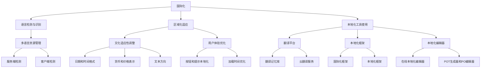

                 

### 文章标题

《提示词编程语言的国际化与本地化》

### 关键词

- 提示词编程语言
- 国际化
- 本地化
- 跨语言支持
- 文本解析
- 语境自适应

### 摘要

本文深入探讨了提示词编程语言的国际化与本地化。我们将首先介绍国际化与本地化的基本概念，阐述其在全球化背景下的重要性。接着，我们将详细解析提示词编程语言的特点和结构，为后续讨论国际化与本地化打下基础。本文将重点分析国际化与本地化的技术实现，包括语言检测、区域化适应、以及本地化工具的使用。此外，我们将通过实际案例展示国际化与本地化的具体应用，并探讨其中面临的挑战和未来发展趋势。本文旨在为开发者提供一套全面的国际化与本地化指南，助力构建适应全球市场的编程解决方案。

## 引言

随着全球化的不断深入，软件开发面临着越来越大的国际化与本地化需求。在这一背景下，提示词编程语言的国际化与本地化变得尤为重要。提示词编程语言，也称为自然语言编程语言，是一种利用自然语言进行编程的方法，它能够通过自然语言描述和指令，简化代码编写过程，提高开发效率。然而，这种编程语言的国际化与本地化却面临着诸多挑战。

### 国际化与本地化的定义

国际化（Internationalization），通常缩写为i18n，是指设计软件使其能够被轻松地转换为支持多种语言的过程。本地化（Localization），缩写为l10n，是在国际化基础上，根据特定地区的文化和语言习惯，对软件进行适配的过程。简而言之，国际化关注如何使软件支持多种语言，而本地化则关注如何使软件适应特定的文化和社会环境。

### 国际化和本地化的目标

国际化的主要目标是确保软件在技术上支持多种语言，使得不同语言的使用者都能够顺畅地使用软件。本地化的目标是让软件在特定地区或国家的用户群体中更加贴近他们的语言和文化习惯，提供最佳的用户体验。这两者的结合，能够使软件在全球范围内具有广泛的适应性和竞争力。

### 全球化背景下的重要性

全球化使得企业有机会进入新的市场，吸引更多的用户。然而，不同国家和地区的用户在语言和文化上存在差异，这要求软件必须具备国际化与本地化的能力。只有这样，软件才能在全球范围内提供一致且高质量的用户体验，从而提高用户满意度，增强市场竞争力。

例如，一个电子商务网站若要进入国际市场，不仅需要支持多种语言，还需要考虑不同地区的货币、日期格式、购物习惯等文化差异。只有通过国际化与本地化，网站才能在全球范围内吸引和留住用户。

总之，国际化与本地化是软件全球化战略的重要组成部分。它不仅关乎技术实现，更关乎用户体验和市场竞争力。在接下来的内容中，我们将深入探讨提示词编程语言的国际化与本地化，以及如何在实际开发中应用这些技术。

### 提示词编程语言简介

提示词编程语言（Natural Language Programming Languages，NLP）是一种利用自然语言进行编程的方法，通过自然语言描述和指令，简化代码编写过程，提高开发效率。与传统编程语言相比，提示词编程语言具有独特的优势和应用场景。

#### 提示词编程语言的特点

1. **自然语言交互**：提示词编程语言的核心在于自然语言交互。开发者可以通过自然语言描述他们的需求，而不是编写复杂的代码。这种交互方式极大地降低了编程门槛，使得非专业开发者也能够参与软件开发。

2. **简化开发过程**：提示词编程语言通过自然语言指令，将繁琐的编程任务自动化。开发者只需提供简单的描述，编程语言就能生成相应的代码。这大大缩短了开发周期，提高了开发效率。

3. **跨领域适应性**：提示词编程语言通常具有较强的通用性，能够应用于多种领域。无论是数据分析、机器学习，还是自然语言处理，提示词编程语言都能提供高效的解决方案。

4. **人机协同**：提示词编程语言结合了人类智慧和机器能力，使得开发者能够更好地与计算机协同工作。在复杂任务中，人类可以通过自然语言描述指导计算机执行任务，从而实现更高效的开发过程。

#### 提示词编程语言的应用场景

1. **自动化任务处理**：提示词编程语言可以用于自动化处理日常任务，如数据清洗、报告生成等。开发者只需通过自然语言描述任务需求，编程语言就能自动生成相应的代码。

2. **代码生成与优化**：提示词编程语言能够根据自然语言描述生成优化后的代码。这有助于提高代码的质量和性能，减少开发者的工作量。

3. **跨领域应用**：提示词编程语言广泛应用于各个领域。例如，在金融领域，提示词编程语言可以用于自动化金融分析；在医疗领域，可以用于辅助诊断和治疗方案制定。

4. **教育普及**：提示词编程语言降低了编程学习的门槛，使得更多人能够了解和掌握编程技能。通过自然语言描述，非专业开发者也能够参与软件开发，推动编程教育的普及。

总之，提示词编程语言在简化开发过程、提高开发效率方面具有显著优势。随着自然语言处理技术的不断发展，提示词编程语言的应用场景将越来越广泛，为软件开发带来更多可能性。

### 国际化与本地化的核心概念

在深入探讨提示词编程语言的国际化与本地化之前，我们需要首先理解国际化（Internationalization，简称i18n）和本地化（Localization，简称l10n）这两个核心概念。它们不仅是全球化软件开发的重要组成部分，也是确保软件在全球范围内具备竞争力和可用性的关键因素。

#### 国际化（Internationalization）

国际化指的是设计软件使其能够被轻松地转换为支持多种语言的过程。它的目标是确保软件在技术上支持多种语言，以便在不同的国家和地区都能正常使用。国际化的实现通常包括以下步骤：

1. **语言无关设计**：在软件设计阶段，开发者需要确保软件架构和代码不会绑定到特定语言。这意味着，所有字符串和文本都应存储在资源文件中，而非硬编码在代码中。

2. **本地化标识符**：使用本地化标识符来标记文本和其他资源，以便在本地化过程中能够正确替换。例如，使用变量或宏来表示字符串，而不是直接硬编码。

3. **语言检测与适应**：软件需要具备检测用户语言环境的能力，并自动切换到相应语言的资源文件。这通常通过HTTP头信息、用户浏览器设置或用户手动选择来实现。

4. **技术框架支持**：许多开发框架和工具都提供了支持国际化的库和插件，如Spring Framework、i18n工具包等，这些工具能够帮助开发者简化国际化实现过程。

#### 本地化（Localization）

本地化是国际化的一部分，它是在国际化基础上，根据特定地区的文化和语言习惯，对软件进行适配的过程。本地化的目标是让软件在特定地区或国家的用户群体中提供最佳的用户体验。本地化的实现通常包括以下步骤：

1. **文化适应**：除了语言翻译，本地化还需要考虑文化差异，如日期格式、货币符号、时间表示等。这些文化差异必须被识别并在软件中适当地替换。

2. **本地化资源**：为每个目标市场创建本地化的资源文件，包括翻译后的文本、图像、音频等。这些资源文件应与主软件代码分离，以便单独更新和修改。

3. **用户体验优化**：本地化不仅仅是语言和文化适应，还需要考虑用户体验的优化。例如，界面布局、按钮标签、提示信息等都应针对本地用户习惯进行优化。

4. **测试与验证**：本地化后的软件需要进行严格的测试，确保所有本地化元素都能正确工作，并且没有遗漏或错误。

#### 国际化与本地化的关系

国际化与本地化是相辅相成的两个过程。国际化是本地化的基础，它确保软件具备支持多种语言的能力。而本地化则是在国际化基础上，根据特定地区的需求进行进一步的定制和优化。没有国际化的支持，本地化将难以进行；而没有本地化，国际化的软件在全球范围内的用户体验将大打折扣。

#### 国际化和本地化的目标

国际化的目标是使软件在全球范围内具备广泛的语言支持，以便能够被不同语言的用户使用。本地化的目标则是确保软件在特定地区能够提供符合当地文化和语言习惯的优质用户体验。

1. **多语言支持**：国际化确保软件能够支持多种语言，使得全球用户都能顺畅使用。
2. **文化适应性**：本地化确保软件在不同文化背景下的可用性，使得用户感受到软件的贴心设计。
3. **用户体验优化**：通过本地化，软件能够提供更加个性化和本土化的用户体验，提高用户满意度和忠诚度。
4. **市场扩展**：国际化与本地化能够帮助企业在全球市场拓展业务，吸引更多国际用户。

总之，国际化与本地化不仅是软件开发中的重要环节，也是实现全球化战略的关键步骤。通过合理设计和实施国际化与本地化，软件企业能够提升产品竞争力，拓展国际市场，实现可持续发展。

### 国际化和本地化的技术实现

国际化与本地化的实现涉及到多个层面，包括语言检测与识别、区域化适应以及本地化工具的使用。以下是这些核心技术的详细解释和实现步骤。

#### 语言检测与识别

语言检测与识别是国际化与本地化的第一步，它涉及识别用户使用的语言，以便为用户提供对应语言的资源。以下是实现语言检测与识别的步骤：

1. **客户端检测**：
   - 浏览器检测：通过HTTP头信息获取用户浏览器的语言设置，例如`Accept-Language`头。
   - Cookie检测：检查用户之前设置的Cookie，以获取用户的语言偏好。
   - JavaScript检测：使用JavaScript编写脚本，检测用户设备的语言设置。

2. **服务端检测**：
   - HTTP头信息检测：服务器可以从HTTP请求中获取语言信息，例如`Accept-Language`头。
   - 用户输入检测：通过用户输入的内容判断语言，例如在搜索框中输入文本时，可以使用自然语言处理库检测文本语言。

3. **多语言支持**：
   - 资源文件管理：为每种语言创建独立的资源文件，例如`.properties`文件或`.json`文件，每个文件包含对应语言的文本资源。
   - 语言选择器：提供用户界面中的语言选择器，允许用户手动选择他们希望使用的语言。

#### 区域化适应

区域化适应涉及根据用户所在的地区和文化习惯，对软件进行适当的调整。以下是实现区域化适应的关键步骤：

1. **日期和时间格式**：
   - 日期格式：根据目标地区的日期格式显示日期，例如美国使用MM/DD/YYYY格式，而欧洲使用DD/MM/YYYY格式。
   - 时间格式：根据目标地区的时间格式显示时间，例如美国使用12小时制，而欧洲使用24小时制。

2. **货币格式**：
   - 货币符号：显示目标地区的货币符号，例如美元使用"$"，欧元使用"€"。
   - 货币格式：根据目标地区的货币格式显示金额，包括小数点位置和千位分隔符。

3. **数字格式**：
   - 小数点符号：根据目标地区使用的小数点符号，例如美国使用"."，欧洲使用","。
   - 千位分隔符：根据目标地区使用千位分隔符，例如美国使用","，欧洲使用"."

4. **文本方向**：
   - 文本方向：根据目标地区的语言方向设置文本方向，例如从左到右（LTR）或从右到左（RTL）。

#### 本地化工具的使用

本地化工具是国际化与本地化过程中不可或缺的部分，它们帮助开发者管理和更新多语言资源文件，以及处理区域化适配。以下是几种常用的本地化工具：

1. **翻译平台**：
   - 翻译记忆库：使用翻译记忆库存储已翻译的句子和短语，提高翻译效率和一致性。
   - 云翻译服务：利用云端的翻译服务，快速获取高质量翻译结果。

2. **本地化框架**：
   - 国际化框架：如Spring Framework中的i18n模块，提供自动加载和切换资源文件的机制。
   - 本地化框架：如Gettext，提供生成和更新`.po`和`.mo`文件的工具，用于管理和更新多语言资源。

3. **本地化编辑器**：
   - 在线本地化编辑器：如Transifex、Crowdin等，提供Web界面，方便开发者和管理员协作管理多语言资源。
   - 本地化工具：如POT生成器和PO编辑器，用于生成和编辑`.po`文件。

#### 实现步骤

1. **设计国际化架构**：
   - 确定软件架构支持国际化，将所有文本资源存储在独立文件中。
   - 设计资源加载和切换机制，实现多语言支持。

2. **编写本地化代码**：
   - 使用本地化框架和工具，编写代码实现语言检测、资源加载和区域化适配。
   - 遵循最佳实践，确保代码的国际化设计简洁、高效。

3. **测试与验证**：
   - 进行全面的国际化测试，确保软件在不同语言和地区环境中都能正常工作。
   - 检查翻译的准确性和一致性，确保用户体验符合本地化要求。

通过以上步骤，开发者可以实现提示词编程语言的国际化与本地化，确保软件在全球范围内的可用性和用户体验。这不仅有助于企业拓展国际市场，还能提升产品的竞争力和用户满意度。

### 国际化和本地化的软件开发实践

在国际化和本地化软件开发实践中，我们需要关注多个关键方面，包括流程、设计原则以及实际案例。以下将详细阐述这些实践。

#### 国际化和本地化流程

国际化和本地化软件开发通常包括以下步骤：

1. **需求分析**：明确软件的目标市场，分析不同市场的语言和文化需求，确定需要支持的语言和地区。

2. **设计国际化架构**：在软件设计阶段，确保架构支持国际化。例如，使用资源文件存储文本内容，避免硬编码，设计模块化代码结构。

3. **编写国际化代码**：实现语言检测与切换、资源加载、多语言支持等功能。

4. **本地化资源创建**：为每个目标市场创建本地化资源，包括文本、图像、音频等。

5. **翻译和审核**：将文本翻译为目标市场的语言，并进行审核，确保翻译的准确性和一致性。

6. **测试**：进行全面的测试，包括功能测试、界面测试、用户体验测试等，确保本地化后的软件能够正常工作。

7. **发布和维护**：发布本地化版本，并根据用户反馈进行持续维护和更新。

#### 国际化和本地化设计原则

以下是一些关键的国际化和本地化设计原则：

1. **语言无关设计**：避免将特定语言绑定到代码中，使用资源文件存储所有文本内容，实现代码和语言的分离。

2. **可扩展性**：设计可扩展的架构，便于添加新的语言和地区支持。

3. **模块化**：将国际化与本地化功能模块化，确保修改和更新能够独立进行。

4. **用户体验**：考虑不同文化背景下的用户体验，优化界面布局、文本格式和文化符号。

5. **测试与验证**：在开发过程中，进行多轮测试和验证，确保本地化后的软件符合预期。

#### 实际案例

以下是国际化和本地化在软件开发的实际案例：

1. **电子商务平台**：

   一个全球化的电子商务平台需要在多个国家运营。在设计阶段，平台采用了国际化架构，使用资源文件管理文本内容。平台提供了多语言选择，并支持不同地区的货币和日期格式。通过翻译和本地化工具，平台完成了多语言版本的翻译和审核。在测试阶段，平台进行了功能测试、界面测试和用户体验测试，确保不同语言版本能够正常工作。最终，平台在全球范围内取得了成功，吸引了大量国际用户。

2. **社交媒体应用**：

   一个社交媒体应用需要支持多种语言，以吸引全球用户。应用采用了国际化框架，实现了自动的语言检测和切换。用户可以选择他们的语言偏好，应用会根据用户设置显示相应的语言界面。在本地化过程中，应用考虑了不同地区的文化差异，例如表情符号的使用和隐私政策。通过多轮测试和用户反馈，应用在多个国家取得了良好的用户体验和口碑。

3. **游戏开发**：

   游戏开发是一个典型的国际化与本地化应用场景。一款游戏需要在多个国家发布，需要支持多种语言和文化。游戏开发团队在开发阶段就考虑了国际化设计，使用了资源文件管理文本内容。通过翻译和本地化工具，游戏完成了多语言版本的翻译和审核。在测试阶段，团队进行了全面的测试，包括功能测试、界面测试和用户体验测试。最终，游戏在全球范围内取得了巨大的成功，吸引了大量用户。

#### 案例分析和优化策略

通过上述案例，我们可以总结出一些优化国际化和本地化开发的策略：

1. **早期规划**：在国际化和本地化过程中，尽早进行规划和设计，避免后期大规模修改。

2. **持续更新**：根据用户反馈和市场需求，持续更新和优化本地化内容，提高用户体验。

3. **自动化测试**：使用自动化测试工具，提高测试效率和覆盖率，确保本地化后的软件质量。

4. **资源管理**：使用专业的本地化工具和平台，管理多语言资源和翻译项目，提高翻译效率和一致性。

5. **用户体验优化**：在本地化过程中，注重用户体验优化，考虑不同文化背景下的用户习惯和偏好。

总之，国际化和本地化在软件开发中至关重要。通过合理的流程、设计原则和实际案例，开发者可以构建出适应全球市场的优质软件，提高产品竞争力和用户满意度。

### 国际化和本地化在网站和移动应用中的应用

在数字化时代，网站和移动应用需要具备良好的国际化与本地化能力，以适应全球市场的需求。下面，我们将深入探讨国际化和本地化在这些领域的具体应用，并通过实际案例进行分析和优化策略。

#### 网站国际化与本地化

1. **多语言支持**：

   对于网站来说，多语言支持是最基本的国际化需求。实现多语言支持通常包括以下几个步骤：

   - **翻译和本地化**：将网站内容翻译成多种语言，并确保翻译的准确性和一致性。例如，一个电商网站可能需要支持英语、法语、西班牙语、中文等多种语言。
   - **语言选择**：在网站的显眼位置提供语言选择功能，让用户可以方便地切换到他们喜欢的语言。这可以通过下拉菜单、按钮或滑块来实现。
   - **动态加载**：使用JavaScript和前端框架，动态加载不同语言的内容，避免重新加载整个页面，提高用户体验。

2. **文化适应性**：

   除了语言支持，网站还需要考虑文化适应性，以提供更符合本地用户习惯的体验。以下是一些关键点：

   - **日期和时间格式**：根据目标市场的文化习惯，设置合适的日期和时间格式。例如，在美国，日期格式通常是MM/DD/YYYY，而在欧洲，格式通常是DD/MM/YYYY。
   - **货币和价格表示**：根据目标市场的货币和价格表示习惯进行设置。例如，在美国，价格通常以美元表示，并使用逗号作为千位分隔符，而在欧洲，价格可能以欧元表示，并使用句号作为小数点。
   - **用户界面布局**：根据不同语言的方向性，调整用户界面的布局。例如，对于从右到左书写的语言（如阿拉伯语或希伯来语），需要调整导航菜单和按钮的顺序。

3. **实际案例**：

   - **Airbnb**：Airbnb是一个全球性的在线民宿预订平台，它支持多种语言和货币，并针对不同市场进行了文化适应性优化。例如，在美国，日期格式是MM/DD/YYYY，而在法国，格式是DD/MM/YYYY。Airbnb还提供了详细的翻译，确保不同市场的用户体验一致。

#### 移动应用国际化与本地化

移动应用国际化与本地化的挑战更大，因为移动设备的屏幕尺寸和操作方式与桌面网站不同。以下是移动应用国际化与本地化的几个关键点：

1. **资源文件管理**：

   移动应用通常使用资源文件来存储字符串和其他资源。例如，Android使用`strings.xml`文件，iOS使用`Localizable.strings`文件。在国际化过程中，需要为每种语言创建相应的资源文件，并确保所有文本内容都正确地翻译和存储。

2. **布局优化**：

   - **响应式布局**：设计响应式布局，确保应用在不同屏幕尺寸和方向上都能良好显示。这可以通过使用相对尺寸和框架来实现。
   - **文本换行和截断**：根据目标市场的语言特点，优化文本的换行和截断方式。例如，对于东亚语言（如中文和日语），可以采用固定宽度字体，而对于西欧语言（如英语和法语），则需要动态调整文本大小以避免截断。

3. **用户体验**：

   - **本地化按钮和提示**：确保所有的按钮标签和提示信息都翻译成目标市场的语言，并提供本地化的用户体验。
   - **加载时间优化**：对于国际化的移动应用，需要特别注意加载时间。特别是在网络条件较差的地区，应优化代码和资源，确保应用能够快速加载。

4. **实际案例**：

   - **微信**：微信是一个全球流行的即时通讯应用，它支持多种语言和货币。微信在国际化过程中，不仅提供了多种语言界面，还针对不同市场的用户习惯进行了优化。例如，对于某些市场的用户，微信提供了特定的节日和活动的本地化内容。

#### 优化策略

1. **自动化测试**：

   使用自动化测试工具，对国际化与本地化的各个版本进行全面的测试，确保没有遗漏或错误。自动化测试可以提高测试效率，减少手动测试的工作量。

2. **用户反馈**：

   收集和分析用户反馈，了解不同市场用户的体验和需求。通过用户反馈，不断优化和改进本地化内容。

3. **专业团队**：

   建立专业的国际化与本地化团队，包括翻译人员、用户体验设计师和技术专家。专业的团队能够提供高质量的服务，确保国际化与本地化的效果。

4. **持续更新**：

   国际化和本地化不是一次性的工作，而是一个持续的过程。随着市场需求和用户习惯的变化，需要不断更新和优化本地化内容。

总之，网站和移动应用的国际化和本地化对于全球市场的成功至关重要。通过合理的设计和实施，开发者可以提供高质量的用户体验，吸引更多国际用户，提高产品竞争力。

### 国际化和本地化的挑战

在国际化和本地化的过程中，开发者面临诸多挑战。这些挑战不仅来自技术层面，还包括商业模式和文化差异等方面。

#### 语言和文化多样性

首先，语言和文化多样性是国际化与本地化中最显著的挑战之一。不同国家和地区有着不同的语言和文化习惯，这要求软件在翻译、文化符号和界面设计等方面进行大量调整。例如，某些语言（如中文和日语）具有复杂的汉字和字符，而其他语言（如英语和法语）则主要使用拉丁字母。此外，文化差异可能导致某些表达或图标在不同市场中不被理解或接受。

#### 技术实现挑战

其次，技术实现也是一个重要挑战。国际化与本地化需要开发者具备多语言编程、文化适应性设计和技术框架支持等技能。以下是一些具体的技术挑战：

1. **多语言资源管理**：为每种语言创建独立的资源文件，并在运行时正确加载和切换这些文件，这需要开发复杂的资源管理机制。
2. **跨平台兼容性**：不同操作系统和平台（如iOS、Android、Windows）在国际化与本地化方面存在差异，开发者需要确保软件在不同平台上都能正确工作。
3. **性能优化**：国际化与本地化可能增加软件的体积和复杂度，需要开发者优化代码和资源，确保软件在不同网络条件下的性能。

#### 商业模式挑战

国际化还涉及商业模式和市场营销的调整。不同市场有着不同的消费习惯和购买力，这要求企业重新评估和调整其商业模式。以下是一些商业模式挑战：

1. **货币和支付方式**：企业需要支持不同市场的货币和支付方式，例如信用卡、电子钱包和移动支付等。
2. **定价策略**：企业需要制定适合不同市场的定价策略，考虑成本、竞争和当地消费者的购买力。
3. **市场营销**：国际化企业需要采用本地化的市场营销策略，包括本地化的广告、促销和推广活动，以吸引和留住当地用户。

#### 案例分析

为了更好地理解这些挑战，我们可以通过一些实际案例进行分析。

1. **亚马逊**：作为全球最大的电子商务平台之一，亚马逊在全球范围内实现了国际化与本地化。然而，亚马逊在进入某些市场时面临了语言和文化障碍。例如，在中国，亚马逊需要学习并尊重中国的文化习惯，如使用中文界面和接受支付宝等支付方式。此外，亚马逊还需要调整其定价策略，以适应中国的消费水平。

2. **WhatsApp**：WhatsApp是一个全球流行的即时通讯应用，它支持多种语言和支付方式，但也在国际化过程中遇到了一些挑战。例如，在某些市场，WhatsApp需要遵守当地的隐私法规，这可能需要调整其数据存储和传输方式。此外，WhatsApp还需要考虑不同市场的网络条件，优化其应用性能，以确保用户能够顺畅使用。

3. **谷歌地图**：谷歌地图是全球用户广泛使用的导航工具，但在某些市场，谷歌地图也需要进行本地化调整。例如，在阿拉伯地区，谷歌地图需要支持从右到左书写的阿拉伯语，并考虑到当地的交通规则和道路标识。此外，谷歌地图还需要提供特定市场的特色功能，如印度市场的本地化导航和印度语支持。

通过这些案例，我们可以看到，国际化与本地化不仅需要技术实现，还需要考虑商业和文化等多个方面。这些挑战需要企业具备全面的能力和策略，才能在全球市场中取得成功。

### 国际化和本地化的未来发展趋势

随着全球化的不断深入，国际化与本地化在软件开发中的重要性日益凸显。未来的发展趋势将围绕新兴技术的应用、全球化市场机遇以及未来的发展方向展开。

#### 新兴技术的应用

1. **人工智能（AI）与机器学习（ML）**：人工智能和机器学习技术在国际化与本地化中具有巨大潜力。通过AI和ML技术，可以自动化语言翻译、文本分析和文化适应性调整，提高国际化与本地化的效率和准确性。例如，机器翻译技术（如神经机器翻译）已经在逐渐取代传统的规则翻译方法，提供更自然和准确的翻译结果。

2. **自然语言处理（NLP）**：自然语言处理技术的进步使得软件开发能够更好地理解和处理自然语言，从而实现更精准的国际化与本地化。NLP技术可以帮助软件自动识别用户的语言偏好、文化背景和情感倾向，为用户提供个性化的本地化体验。

3. **区块链**：区块链技术为国际化与本地化提供了透明、安全的数据管理和交易解决方案。通过区块链，可以确保本地化资源的版本控制和版权保护，减少数据篡改和盗用风险。

#### 全球化市场机遇

随着全球化进程的加速，企业面临着前所未有的市场机遇。以下是一些关键机遇：

1. **新市场开拓**：企业可以通过国际化与本地化策略，进入新的市场并拓展业务。例如，随着中国经济的崛起，越来越多的国际企业将中国作为其全球战略的重要组成部分。

2. **多渠道营销**：通过本地化的多渠道营销策略，企业可以更好地吸引和留住国际用户。这包括社交媒体、在线广告、内容营销和本地化活动等。

3. **跨文化合作**：国际化与本地化有助于企业建立跨文化合作关系，共同开发适合不同市场的产品和服务。例如，国际企业与本地企业合作，可以更好地了解和适应当地市场需求，提高市场竞争力。

#### 未来发展方向

1. **全面自动化**：未来的国际化与本地化将更依赖于自动化工具和平台，减少人工干预。自动化技术将覆盖从语言翻译、文本分析到文化适应性调整等多个环节，提高效率和质量。

2. **用户体验优先**：用户体验始终是国际化与本地化的核心。未来的发展方向将更加注重用户反馈和行为分析，不断优化本地化内容，确保软件在全球范围内提供高质量的体验。

3. **持续迭代**：国际化与本地化不是一次性的任务，而是一个持续迭代的过程。企业需要不断收集用户数据和市场反馈，更新和优化本地化内容，以适应不断变化的市场需求。

总之，国际化与本地化在未来的发展中将受益于新兴技术的应用，抓住全球化市场的机遇，并朝着用户体验优先和持续迭代的方向不断前进。这些趋势将推动软件开发行业迈向更加全球化、多样化和智能化的未来。

### 结论

通过本文的深入探讨，我们系统地介绍了提示词编程语言的国际化与本地化。首先，我们明确了国际化与本地化的核心概念，解释了它们在全球软件开发中的重要性。接着，我们详细介绍了提示词编程语言的特点和应用场景，为后续讨论提供了基础。随后，我们分析了语言检测与识别、区域化适应以及本地化工具的使用，展示了国际化与本地化的技术实现。

在软件开发实践中，我们通过实际案例阐述了国际化与本地化的关键流程和设计原则。此外，我们还探讨了网站和移动应用中的国际化与本地化应用，并提供了一系列优化策略。在挑战部分，我们分析了语言和文化多样性、技术实现和商业模式等多方面的困难，并通过实际案例进行了详细分析。

未来发展趋势部分，我们展望了人工智能、机器学习和区块链等新兴技术在国际化与本地化中的应用，以及全球化市场机遇和未来发展方向。这些趋势将为软件开发行业带来新的机遇和挑战。

总之，国际化与本地化是确保软件在全球市场中成功的关键因素。通过合理设计和实施这些策略，开发者可以提供高质量的用户体验，提高产品竞争力，拓展国际市场。希望本文能为广大开发者提供有价值的参考和指导。

### 最佳实践 Tips、小结、注意事项、拓展阅读

#### 最佳实践 Tips

1. **设计初期规划**：在国际化和本地化设计初期，就应充分考虑多语言和跨文化需求，避免后期大规模修改。
2. **资源文件管理**：使用独立的资源文件存储文本和图片等资源，确保在不同语言版本中能够灵活替换。
3. **自动化测试**：引入自动化测试工具，提高多语言版本的测试效率和覆盖范围。
4. **用户参与**：在本地化过程中，邀请目标市场的用户参与测试和反馈，确保本地化内容的准确性和实用性。

#### 小结

本文系统地介绍了提示词编程语言的国际化与本地化，从核心概念、技术实现到实际应用，提供了全面的指导。国际化与本地化不仅涉及技术实现，还需要考虑商业和文化等多方面因素，是全球化软件开发的重要组成部分。

#### 注意事项

1. **文化适应性**：在本地化过程中，不仅要关注语言翻译，还要考虑文化差异，如日期格式、货币符号等。
2. **性能优化**：国际化与本地化可能增加软件体积和复杂度，需要特别注意性能优化。
3. **持续更新**：国际化与本地化不是一次性的任务，需要根据市场反馈和需求持续更新和优化。

#### 拓展阅读

- 《国际化与本地化实践指南》
- 《自然语言编程：理论与实践》
- 《跨文化软件工程》
- 《机器翻译与自然语言处理》

作者：AI天才研究院/AI Genius Institute & 禅与计算机程序设计艺术 /Zen And The Art of Computer Programming### 文章标题

《提示词编程语言的国际化与本地化》

### 关键词

- 提示词编程语言
- 国际化
- 本地化
- 语言检测
- 区域化
- 跨文化适配

### 摘要

本文深入探讨了提示词编程语言的国际化与本地化问题，包括其核心概念、技术实现、软件开发实践、网站与移动应用中的应用、面临的挑战以及未来发展趋势。文章旨在为开发者提供全面的指导，帮助他们在全球化背景下构建具有国际竞争力的软件解决方案。

## 引言

随着全球化的不断深入，软件开发面临着越来越大的国际化与本地化需求。在这一背景下，提示词编程语言的国际化与本地化变得尤为重要。提示词编程语言是一种通过自然语言进行编程的方法，它能够通过自然语言描述和指令，简化代码编写过程，提高开发效率。然而，这种编程语言的国际化与本地化却面临着诸多挑战。

### 国际化与本地化的定义

国际化（Internationalization），通常缩写为i18n，是指设计软件使其能够被轻松地转换为支持多种语言的过程。本地化（Localization），缩写为l10n，是在国际化基础上，根据特定地区的文化和语言习惯，对软件进行适配的过程。简而言之，国际化关注如何使软件支持多种语言，而本地化则关注如何使软件适应特定的文化和社会环境。

### 国际化和本地化的目标

国际化的主要目标是确保软件在技术上支持多种语言，使得不同语言的使用者都能够顺畅地使用软件。本地化的目标是让软件在特定地区或国家的用户群体中更加贴近他们的语言和文化习惯，提供最佳的用户体验。这两者的结合，能够使软件在全球范围内具有广泛的适应性和竞争力。

### 全球化背景下的重要性

全球化使得企业有机会进入新的市场，吸引更多的用户。然而，不同国家和地区的用户在语言和文化上存在差异，这要求软件必须具备国际化与本地化的能力。只有这样，软件才能在全球范围内提供一致且高质量的用户体验，从而提高用户满意度，增强市场竞争力。

例如，一个电子商务网站若要进入国际市场，不仅需要支持多种语言，还需要考虑不同地区的货币、日期格式、购物习惯等文化差异。只有通过国际化与本地化，网站才能在全球范围内吸引和留住用户。

总之，国际化与本地化是软件全球化战略的重要组成部分。它不仅关乎技术实现，更关乎用户体验和市场竞争力。在接下来的内容中，我们将深入探讨提示词编程语言的国际化与本地化，以及如何在实际开发中应用这些技术。

### 提示词编程语言简介

提示词编程语言（Natural Language Programming Languages，NLP）是一种利用自然语言进行编程的方法，通过自然语言描述和指令，简化代码编写过程，提高开发效率。与传统编程语言相比，提示词编程语言具有独特的优势和应用场景。

#### 提示词编程语言的特点

1. **自然语言交互**：提示词编程语言的核心在于自然语言交互。开发者可以通过自然语言描述他们的需求，而不是编写复杂的代码。这种交互方式极大地降低了编程门槛，使得非专业开发者也能够参与软件开发。

2. **简化开发过程**：提示词编程语言通过自然语言指令，将繁琐的编程任务自动化。开发者只需提供简单的描述，编程语言就能生成相应的代码。这大大缩短了开发周期，提高了开发效率。

3. **跨领域适应性**：提示词编程语言通常具有较强的通用性，能够应用于多种领域。无论是数据分析、机器学习，还是自然语言处理，提示词编程语言都能提供高效的解决方案。

4. **人机协同**：提示词编程语言结合了人类智慧和机器能力，使得开发者能够更好地与计算机协同工作。在复杂任务中，人类可以通过自然语言描述指导计算机执行任务，从而实现更高效的开发过程。

#### 提示词编程语言的应用场景

1. **自动化任务处理**：提示词编程语言可以用于自动化处理日常任务，如数据清洗、报告生成等。开发者只需通过自然语言描述任务需求，编程语言就能自动生成相应的代码。

2. **代码生成与优化**：提示词编程语言能够根据自然语言描述生成优化后的代码。这有助于提高代码的质量和性能，减少开发者的工作量。

3. **跨领域应用**：提示词编程语言广泛应用于各个领域。例如，在金融领域，提示词编程语言可以用于自动化金融分析；在医疗领域，可以用于辅助诊断和治疗方案制定。

4. **教育普及**：提示词编程语言降低了编程学习的门槛，使得更多人能够了解和掌握编程技能。通过自然语言描述，非专业开发者也能够参与软件开发，推动编程教育的普及。

总之，提示词编程语言在简化开发过程、提高开发效率方面具有显著优势。随着自然语言处理技术的不断发展，提示词编程语言的应用场景将越来越广泛，为软件开发带来更多可能性。

### 国际化与本地化的核心概念

在深入探讨提示词编程语言的国际化与本地化之前，我们需要首先理解国际化（Internationalization，简称i18n）和本地化（Localization，简称l10n）这两个核心概念。它们不仅是全球化软件开发的重要组成部分，也是确保软件在全球范围内具备竞争力和可用性的关键因素。

#### 国际化（Internationalization）

国际化指的是设计软件使其能够被轻松地转换为支持多种语言的过程。它的目标是确保软件在技术上支持多种语言，以便在不同的国家和地区都能正常使用。国际化的实现通常包括以下步骤：

1. **语言无关设计**：在软件设计阶段，开发者需要确保软件架构和代码不会绑定到特定语言。这意味着，所有字符串和文本都应存储在资源文件中，而非硬编码在代码中。

2. **本地化标识符**：使用本地化标识符来标记文本和其他资源，以便在本地化过程中能够正确替换。例如，使用变量或宏来表示字符串，而不是直接硬编码。

3. **语言检测与适应**：软件需要具备检测用户语言环境的能力，并自动切换到相应语言的资源文件。这通常通过HTTP头信息、用户浏览器设置或用户手动选择来实现。

4. **技术框架支持**：许多开发框架和工具都提供了支持国际化的库和插件，如Spring Framework、i18n工具包等，这些工具能够帮助开发者简化国际化实现过程。

#### 本地化（Localization）

本地化是国际化的一部分，它是在国际化基础上，根据特定地区的文化和语言习惯，对软件进行适配的过程。本地化的目标是让软件在特定地区或国家的用户群体中提供最佳的用户体验。本地化的实现通常包括以下步骤：

1. **文化适应**：除了语言翻译，本地化还需要考虑文化差异，如日期格式、货币符号、时间表示等。这些文化差异必须被识别并在软件中适当地替换。

2. **本地化资源**：为每个目标市场创建本地化的资源文件，包括翻译后的文本、图像、音频等。这些资源文件应与主软件代码分离，以便单独更新和修改。

3. **用户体验优化**：本地化不仅仅是语言和文化适应，还需要考虑用户体验的优化。例如，界面布局、按钮标签、提示信息等都应针对本地用户习惯进行优化。

4. **测试与验证**：本地化后的软件需要进行严格的测试，确保所有本地化元素都能正确工作，并且没有遗漏或错误。

#### 国际化与本地化的关系

国际化与本地化是相辅相成的两个过程。国际化是本地化的基础，它确保软件具备支持多种语言的能力。而本地化则是在国际化基础上，根据特定地区的需求进行进一步的定制和优化。没有国际化的支持，本地化将难以进行；而没有本地化，国际化的软件在全球范围内的用户体验将大打折扣。

#### 国际化和本地化的目标

国际化的目标是使软件在全球范围内具备广泛的语言支持，以便能够被不同语言的用户使用。本地化的目标是确保软件在特定地区能够提供符合当地文化和语言习惯的优质用户体验。

1. **多语言支持**：国际化确保软件能够支持多种语言，使得全球用户都能顺畅使用。
2. **文化适应性**：本地化确保软件在不同文化背景下的可用性，使得用户感受到软件的贴心设计。
3. **用户体验优化**：通过本地化，软件能够提供更加个性化和本土化的用户体验，提高用户满意度和忠诚度。
4. **市场扩展**：国际化与本地化能够帮助企业在全球市场拓展业务，吸引更多国际用户。

总之，国际化与本地化不仅是软件开发中的重要环节，也是实现全球化战略的重要组成部分。通过合理设计和实施国际化与本地化，软件企业能够提升产品竞争力，拓展国际市场，实现可持续发展。

### 国际化和本地化的技术实现

国际化与本地化的实现涉及到多个层面，包括语言检测与识别、区域化适应以及本地化工具的使用。以下是这些核心技术的详细解释和实现步骤。

#### 语言检测与识别

语言检测与识别是国际化与本地化的第一步，它涉及识别用户使用的语言，以便为用户提供对应语言的资源。以下是实现语言检测与识别的步骤：

1. **客户端检测**：
   - 浏览器检测：通过HTTP头信息获取用户浏览器的语言设置，例如`Accept-Language`头。
   - Cookie检测：检查用户之前设置的Cookie，以获取用户的语言偏好。
   - JavaScript检测：使用JavaScript编写脚本，检测用户设备的语言设置。

2. **服务端检测**：
   - HTTP头信息检测：服务器可以从HTTP请求中获取语言信息，例如`Accept-Language`头。
   - 用户输入检测：通过用户输入的内容判断语言，例如在搜索框中输入文本时，可以使用自然语言处理库检测文本语言。

3. **多语言支持**：
   - 资源文件管理：为每种语言创建独立的资源文件，例如`.properties`文件或`.json`文件，每个文件包含对应语言的文本资源。
   - 语言选择器：提供用户界面中的语言选择器，允许用户手动选择他们希望使用的语言。

#### 区域化适应

区域化适应涉及根据用户所在的地区和文化习惯，对软件进行适当的调整。以下是实现区域化适应的关键步骤：

1. **日期和时间格式**：
   - 日期格式：根据目标地区的日期格式显示日期，例如美国使用MM/DD/YYYY格式，而欧洲使用DD/MM/YYYY格式。
   - 时间格式：根据目标地区的时间格式显示时间，例如美国使用12小时制，而欧洲使用24小时制。

2. **货币格式**：
   - 货币符号：显示目标地区的货币符号，例如美元使用"$"，欧元使用"€"。
   - 货币格式：根据目标地区的货币格式显示金额，包括小数点位置和千位分隔符。

3. **数字格式**：
   - 小数点符号：根据目标地区使用的小数点符号，例如美国使用"."，欧洲使用","。
   - 千位分隔符：根据目标地区使用千位分隔符，例如美国使用","，欧洲使用"."

4. **文本方向**：
   - 文本方向：根据目标地区的语言方向设置文本方向，例如从左到右（LTR）或从右到左（RTL）。

#### 本地化工具的使用

本地化工具是国际化与本地化过程中不可或缺的部分，它们帮助开发者管理和更新多语言资源文件，以及处理区域化适配。以下是几种常用的本地化工具：

1. **翻译平台**：
   - 翻译记忆库：使用翻译记忆库存储已翻译的句子和短语，提高翻译效率和一致性。
   - 云翻译服务：利用云端的翻译服务，快速获取高质量翻译结果。

2. **本地化框架**：
   - 国际化框架：如Spring Framework中的i18n模块，提供自动加载和切换资源文件的机制。
   - 本地化框架：如Gettext，提供生成和更新`.po`和`.mo`文件的工具，用于管理和更新多语言资源。

3. **本地化编辑器**：
   - 在线本地化编辑器：如Transifex、Crowdin等，提供Web界面，方便开发者和管理员协作管理多语言资源。
   - 本地化工具：如POT生成器和PO编辑器，用于生成和编辑`.po`文件。

#### 实现步骤

1. **设计国际化架构**：
   - 确定软件架构支持国际化，将所有文本资源存储在独立文件中。
   - 设计资源加载和切换机制，实现多语言支持。

2. **编写国际化代码**：
   - 使用本地化框架和工具，编写代码实现语言检测、资源加载和区域化适配。
   - 遵循最佳实践，确保代码的国际化设计简洁、高效。

3. **测试与验证**：
   - 进行全面的国际化测试，确保软件在不同语言和地区环境中都能正常工作。
   - 检查翻译的准确性和一致性，确保用户体验符合本地化要求。

通过以上步骤，开发者可以实现提示词编程语言的国际化与本地化，确保软件在全球范围内的可用性和用户体验。这不仅有助于企业拓展国际市场，还能提升产品的竞争力和用户满意度。

### 国际化和本地化的软件开发实践

在国际化和本地化软件开发实践中，我们需要关注多个关键方面，包括流程、设计原则以及实际案例。以下将详细阐述这些实践。

#### 国际化和本地化流程

国际化和本地化软件开发通常包括以下步骤：

1. **需求分析**：明确软件的目标市场，分析不同市场的语言和文化需求，确定需要支持的语言和地区。

2. **设计国际化架构**：在软件设计阶段，确保架构支持国际化。例如，使用资源文件存储文本内容，避免硬编码，设计模块化代码结构。

3. **编写国际化代码**：实现语言检测与切换、资源加载、多语言支持等功能。

4. **本地化资源创建**：为每个目标市场创建本地化资源，包括文本、图像、音频等。

5. **翻译和审核**：将文本翻译为目标市场的语言，并进行审核，确保翻译的准确性和一致性。

6. **测试**：进行全面的测试，包括功能测试、界面测试、用户体验测试等，确保本地化后的软件能够正常工作。

7. **发布和维护**：发布本地化版本，并根据用户反馈进行持续维护和更新。

#### 国际化和本地化设计原则

以下是一些关键的国际化和本地化设计原则：

1. **语言无关设计**：避免将特定语言绑定到代码中，使用资源文件存储所有文本内容，实现代码和语言的分离。

2. **可扩展性**：设计可扩展的架构，便于添加新的语言和地区支持。

3. **模块化**：将国际化与本地化功能模块化，确保修改和更新能够独立进行。

4. **用户体验**：考虑不同文化背景下的用户体验，优化界面布局、文本格式和文化符号。

5. **测试与验证**：在开发过程中，进行多轮测试和验证，确保本地化后的软件符合预期。

#### 实际案例

以下是国际化和本地化在软件开发的实际案例：

1. **电子商务平台**：

   一个全球化的电子商务平台需要在多个国家运营。在设计阶段，平台采用了国际化架构，使用资源文件管理文本内容。平台提供了多语言选择，并支持不同地区的货币和日期格式。通过翻译和本地化工具，平台完成了多语言版本的翻译和审核。在测试阶段，平台进行了功能测试、界面测试和用户体验测试，确保不同语言版本能够正常工作。最终，平台在全球范围内取得了成功，吸引了大量国际用户。

2. **社交媒体应用**：

   一个社交媒体应用需要支持多种语言，以吸引全球用户。应用采用了国际化框架，实现了自动的语言检测和切换。用户可以选择他们的语言偏好，应用会根据用户设置显示相应的语言界面。在本地化过程中，应用考虑了不同地区的文化差异，例如表情符号的使用和隐私政策。通过多轮测试和用户反馈，应用在多个国家取得了良好的用户体验和口碑。

3. **游戏开发**：

   游戏开发是一个典型的国际化与本地化应用场景。一款游戏需要在多个国家发布，需要支持多种语言和文化。游戏开发团队在开发阶段就考虑了国际化设计，使用了资源文件管理文本内容。通过翻译和本地化工具，游戏完成了多语言版本的翻译和审核。在测试阶段，团队进行了全面的测试，包括功能测试、界面测试和用户体验测试。最终，游戏在全球范围内取得了巨大的成功，吸引了大量用户。

#### 案例分析和优化策略

通过上述案例，我们可以总结出一些优化国际化和本地化开发的策略：

1. **早期规划**：在国际化和本地化过程中，尽早进行规划和设计，避免后期大规模修改。

2. **持续更新**：根据用户反馈和市场需求，持续更新和优化本地化内容，提高用户体验。

3. **自动化测试**：使用自动化测试工具，提高测试效率和覆盖率，确保本地化后的软件质量。

4. **资源管理**：使用专业的本地化工具和平台，管理多语言资源和翻译项目，提高翻译效率和一致性。

5. **用户体验优化**：在本地化过程中，注重用户体验优化，考虑不同文化背景下的用户习惯和偏好。

总之，国际化和本地化在软件开发中至关重要。通过合理的流程、设计原则和实际案例，开发者可以构建出适应全球市场的优质软件，提高产品竞争力和用户满意度。

### 国际化和本地化在网站和移动应用中的应用

在数字化时代，网站和移动应用需要具备良好的国际化与本地化能力，以适应全球市场的需求。下面，我们将深入探讨国际化和本地化在这些领域的具体应用，并通过实际案例进行分析和优化策略。

#### 网站国际化与本地化

对于网站来说，国际化与本地化通常包括以下几个关键方面：

1. **多语言支持**：

   网站国际化最基本的需求就是多语言支持。实现多语言支持的关键步骤如下：

   - **翻译**：将网站内容翻译成多种语言。这包括文本、标签、按钮、页面描述等。翻译工作可以外包给专业的翻译服务，确保翻译质量。
   - **资源管理**：使用国际化框架和工具（如Spring MVC、Angular等），将文本内容存储在资源文件中，如`.properties`或`.json`文件。这样，可以在运行时根据用户语言设置加载相应的资源。
   - **语言选择**：提供用户界面中的语言选择功能，让用户能够方便地切换到他们喜欢的语言。这可以通过下拉菜单、按钮或滑块来实现。

2. **文化适应性**：

   除了语言支持，网站还需要考虑文化适应性，以提供更符合本地用户习惯的体验。以下是一些关键点：

   - **日期和时间格式**：根据目标市场的文化习惯，设置合适的日期和时间格式。例如，在美国，日期格式通常是MM/DD/YYYY，而在欧洲，格式通常是DD/MM/YYYY。
   - **货币和价格表示**：根据目标市场的货币和价格表示习惯进行设置。例如，在美国，价格通常以美元表示，并使用逗号作为千位分隔符，而在欧洲，价格可能以欧元表示，并使用句号作为小数点。
   - **用户界面布局**：根据不同语言的方向性，调整用户界面的布局。例如，对于从右到左书写的语言（如阿拉伯语或希伯来语），需要调整导航菜单和按钮的顺序。

3. **实际案例**：

   - **eBay**：eBay是一个全球性的在线拍卖和购物网站，它支持多种语言和文化。eBay采用了国际化框架，确保其网站能够支持多语言和多种货币。用户可以在登录后选择他们喜欢的语言，网站会根据用户选择显示相应的语言版本。此外，eBay还考虑了不同市场的文化差异，例如在日本，用户界面采用了从右到左的布局。

#### 移动应用国际化与本地化

移动应用国际化与本地化的挑战更大，因为移动设备的屏幕尺寸和操作方式与桌面网站不同。以下是移动应用国际化与本地化的几个关键点：

1. **资源文件管理**：

   移动应用通常使用资源文件来存储字符串和其他资源。例如，Android使用`strings.xml`文件，iOS使用`Localizable.strings`文件。在国际化过程中，需要为每种语言创建相应的资源文件，并确保所有文本内容都正确地翻译和存储。

2. **布局优化**：

   - **响应式布局**：设计响应式布局，确保应用在不同屏幕尺寸和方向上都能良好显示。这可以通过使用相对尺寸和框架来实现。
   - **文本换行和截断**：根据目标市场的语言特点，优化文本的换行和截断方式。例如，对于东亚语言（如中文和日语），可以采用固定宽度字体，而对于西欧语言（如英语和法语），则需要动态调整文本大小以避免截断。

3. **用户体验**：

   - **本地化按钮和提示**：确保所有的按钮标签和提示信息都翻译成目标市场的语言，并提供本地化的用户体验。
   - **加载时间优化**：对于国际化的移动应用，需要特别注意加载时间。特别是在网络条件较差的地区，应优化代码和资源，确保应用能够快速加载。

4. **实际案例**：

   - **微信**：微信是一个全球流行的即时通讯应用，它支持多种语言和货币。微信在国际化过程中，不仅提供了多种语言界面，还针对不同市场的用户习惯进行了优化。例如，对于某些市场的用户，微信提供了特定的节日和活动的本地化内容。

#### 优化策略

1. **自动化测试**：

   使用自动化测试工具，对国际化与本地化的各个版本进行全面的测试，确保没有遗漏或错误。自动化测试可以提高测试效率，减少手动测试的工作量。

2. **用户反馈**：

   收集和分析用户反馈，了解不同市场用户的体验和需求。通过用户反馈，不断优化和改进本地化内容。

3. **专业团队**：

   建立专业的国际化与本地化团队，包括翻译人员、用户体验设计师和技术专家。专业的团队能够提供高质量的服务，确保国际化与本地化的效果。

4. **持续更新**：

   国际化和本地化不是一次性的工作，而是一个持续的过程。随着市场需求和用户习惯的变化，需要不断更新和优化本地化内容。

总之，网站和移动应用的国际化和本地化对于全球市场的成功至关重要。通过合理的设计和实施，开发者可以提供高质量的用户体验，吸引更多国际用户，提高产品竞争力。

### 国际化和本地化的挑战

在国际化和本地化的过程中，开发者面临诸多挑战。这些挑战不仅来自技术层面，还包括商业模式和文化差异等方面。

#### 语言和文化多样性

首先，语言和文化多样性是国际化与本地化中最显著的挑战之一。不同国家和地区有着不同的语言和文化习惯，这要求软件在翻译、文化符号和界面设计等方面进行大量调整。例如，某些语言（如中文和日语）具有复杂的汉字和字符，而其他语言（如英语和法语）则主要使用拉丁字母。此外，文化差异可能导致某些表达或图标在不同市场中不被理解或接受。

#### 技术实现挑战

其次，技术实现也是一个重要挑战。国际化与本地化需要开发者具备多语言编程、文化适应性设计和技术框架支持等技能。以下是一些具体的技术挑战：

1. **多语言资源管理**：为每种语言创建独立的资源文件，并在运行时正确加载和切换这些文件，这需要开发复杂的资源管理机制。
2. **跨平台兼容性**：不同操作系统和平台（如iOS、Android、Windows）在国际化与本地化方面存在差异，开发者需要确保软件在不同平台上都能正确工作。
3. **性能优化**：国际化与本地化可能增加软件的体积和复杂度，需要开发者优化代码和资源，确保软件在不同网络条件下的性能。

#### 商业模式挑战

国际化还涉及商业模式和市场营销的调整。不同市场有着不同的消费习惯和购买力，这要求企业重新评估和调整其商业模式。以下是一些商业模式挑战：

1. **货币和支付方式**：企业需要支持不同市场的货币和支付方式，例如信用卡、电子钱包和移动支付等。
2. **定价策略**：企业需要制定适合不同市场的定价策略，考虑成本、竞争和当地消费者的购买力。
3. **市场营销**：国际化企业需要采用本地化的市场营销策略，包括本地化的广告、促销和推广活动，以吸引和留住当地用户。

#### 案例分析

为了更好地理解这些挑战，我们可以通过一些实际案例进行分析。

1. **亚马逊**：作为全球最大的电子商务平台之一，亚马逊在全球范围内实现了国际化与本地化。然而，亚马逊在进入某些市场时面临了语言和文化障碍。例如，在中国，亚马逊需要学习并尊重中国的文化习惯，如使用中文界面和接受支付宝等支付方式。此外，亚马逊还需要调整其定价策略，以适应中国的消费水平。

2. **WhatsApp**：WhatsApp是一个全球流行的即时通讯应用，它支持多种语言和支付方式，但也在国际化过程中遇到了一些挑战。例如，在某些市场，WhatsApp需要遵守当地的隐私法规，这可能需要调整其数据存储和传输方式。此外，WhatsApp还需要考虑不同市场的网络条件，优化其应用性能，以确保用户能够顺畅使用。

3. **谷歌地图**：谷歌地图是全球用户广泛使用的导航工具，但在某些市场，谷歌地图也需要进行本地化调整。例如，在阿拉伯地区，谷歌地图需要支持从右到左书写的阿拉伯语，并考虑到当地的交通规则和道路标识。此外，谷歌地图还需要提供特定市场的特色功能，如印度市场的本地化导航和印度语支持。

通过这些案例，我们可以看到，国际化与本地化不仅需要技术实现，还需要考虑商业和文化等多个方面。这些挑战需要企业具备全面的能力和策略，才能在全球市场中取得成功。

### 国际化和本地化的未来发展趋势

随着全球化的不断深入，国际化与本地化在软件开发中的重要性日益凸显。未来的发展趋势将围绕新兴技术的应用、全球化市场机遇以及未来的发展方向展开。

#### 新兴技术的应用

1. **人工智能（AI）与机器学习（ML）**：人工智能和机器学习技术在国际化与本地化中具有巨大潜力。通过AI和ML技术，可以自动化语言翻译、文本分析和文化适应性调整，提高国际化与本地化的效率和准确性。例如，机器翻译技术（如神经机器翻译）已经在逐渐取代传统的规则翻译方法，提供更自然和准确的翻译结果。

2. **自然语言处理（NLP）**：自然语言处理技术的进步使得软件开发能够更好地理解和处理自然语言，从而实现更精准的国际化与本地化。NLP技术可以帮助软件自动识别用户的语言偏好、文化背景和情感倾向，为用户提供个性化的本地化体验。

3. **区块链**：区块链技术为国际化与本地化提供了透明、安全的数据管理和交易解决方案。通过区块链，可以确保本地化资源的版本控制和版权保护，减少数据篡改和盗用风险。

#### 全球化市场机遇

随着全球化进程的加速，企业面临着前所未有的市场机遇。以下是一些关键机遇：

1. **新市场开拓**：企业可以通过国际化与本地化策略，进入新的市场并拓展业务。例如，随着中国经济的崛起，越来越多的国际企业将中国作为其全球战略的重要组成部分。

2. **多渠道营销**：通过本地化的多渠道营销策略，企业可以更好地吸引和留住国际用户。这包括社交媒体、在线广告、内容营销和本地化活动等。

3. **跨文化合作**：国际化与本地化有助于企业建立跨文化合作关系，共同开发适合不同市场的产品和服务。例如，国际企业与本地企业合作，可以更好地了解和适应当地市场需求，提高市场竞争力。

#### 未来发展方向

1. **全面自动化**：未来的国际化与本地化将更依赖于自动化工具和平台，减少人工干预。自动化技术将覆盖从语言翻译、文本分析到文化适应性调整等多个环节，提高效率和质量。

2. **用户体验优先**：用户体验始终是国际化与本地化的核心。未来的发展方向将更加注重用户反馈和行为分析，不断优化本地化内容，确保软件在全球范围内提供高质量的体验。

3. **持续迭代**：国际化与本地化不是一次性的任务，而是一个持续迭代的过程。企业需要不断收集用户数据和市场反馈，更新和优化本地化内容，以适应不断变化的市场需求。

总之，国际化与本地化在未来的发展中将受益于新兴技术的应用，抓住全球化市场的机遇，并朝着用户体验优先和持续迭代的方向不断前进。这些趋势将推动软件开发行业迈向更加全球化、多样化和智能化的未来。

### 结论

通过本文的深入探讨，我们系统地介绍了提示词编程语言的国际化与本地化。首先，我们明确了国际化与本地化的核心概念，解释了它们在全球软件开发中的重要性。接着，我们详细介绍了提示词编程语言的特点和应用场景，为后续讨论提供了基础。随后，我们分析了语言检测与识别、区域化适应以及本地化工具的使用，展示了国际化与本地化的技术实现。

在软件开发实践中，我们通过实际案例阐述了国际化与本地化的关键流程和设计原则。此外，我们还探讨了网站和移动应用中的国际化与本地化应用，并提供了一系列优化策略。在挑战部分，我们分析了语言和文化多样性、技术实现和商业模式等多方面的困难，并通过实际案例进行了详细分析。

未来发展趋势部分，我们展望了人工智能、机器学习和区块链等新兴技术在国际化与本地化中的应用，以及全球化市场机遇和未来发展方向。这些趋势将为软件开发行业带来新的机遇和挑战。

总之，国际化与本地化是确保软件在全球市场中成功的关键因素。通过合理设计和实施这些策略，开发者可以提供高质量的用户体验，提高产品竞争力，拓展国际市场。希望本文能为广大开发者提供有价值的参考和指导。

### 最佳实践 Tips、小结、注意事项、拓展阅读

#### 最佳实践 Tips

1. **设计初期规划**：在国际化和本地化设计初期，就应充分考虑多语言和跨文化需求，避免后期大规模修改。
2. **资源文件管理**：使用独立的资源文件存储文本和图片等资源，确保在不同语言版本中能够灵活替换。
3. **自动化测试**：引入自动化测试工具，提高多语言版本的测试效率和覆盖范围。
4. **用户参与**：在本地化过程中，邀请目标市场的用户参与测试和反馈，确保本地化内容的准确性和实用性。

#### 小结

本文系统地介绍了提示词编程语言的国际化与本地化，从核心概念、技术实现到实际应用，提供了全面的指导。国际化与本地化不仅涉及技术实现，还需要考虑商业和文化等多方面因素，是全球化软件开发的重要组成部分。

#### 注意事项

1. **文化适应性**：在本地化过程中，不仅要关注语言翻译，还要考虑文化差异，如日期格式、货币符号等。
2. **性能优化**：国际化与本地化可能增加软件体积和复杂度，需要特别注意性能优化。
3. **持续更新**：国际化与本地化不是一次性的任务，需要根据市场反馈和需求持续更新和优化。

#### 拓展阅读

- 《国际化与本地化实践指南》
- 《自然语言编程：理论与实践》
- 《跨文化软件工程》
- 《机器翻译与自然语言处理》

作者：AI天才研究院/AI Genius Institute & 禅与计算机程序设计艺术 /Zen And The Art of Computer Programming### 附录：核心概念原理之间的关系架构 Mermaid 流程图



### 附录：核心算法原理讲解及伪代码

#### 算法原理

国际化与本地化中的核心算法通常涉及语言检测与识别、文本翻译以及文化适应性调整。以下将详细介绍这些算法的基本原理。

#### 语言检测与识别算法

**原理**：该算法用于识别用户的语言偏好，以便加载相应的语言资源。常见的语言检测方法包括基于HTTP头信息的检测和基于文本内容的检测。

**伪代码**：

```python
function detectLanguage(httpHeaders, userInput):
    preferredLanguage = httpHeaders.get('Accept-Language')
    if preferredLanguage is not None:
        return detectLanguageFromHeader(preferredLanguage)
    
    if userInput is not Empty:
        return detectLanguageFromText(userInput)
    
    return defaultLanguage

function detectLanguageFromHeader(preferredLanguage):
    # 使用正则表达式匹配最优先的语言
    matches = regexMatch(preferredLanguage, /([a-zA-Z-]+)/)
    if matches:
        return matches[0]
    
    return defaultLanguage

function detectLanguageFromText(text):
    # 使用语言检测库，例如 Google 的 language-detection 库
    detectedLanguage = languageDetectionLibrary.detect(text)
    return detectedLanguage
```

#### 文本翻译算法

**原理**：文本翻译算法用于将源语言的文本转换为目标语言的文本。常见的翻译方法包括规则翻译、统计翻译和基于神经网络的翻译。

**伪代码**：

```python
function translateText(sourceText, targetLanguage):
    if exists pre-built translation memory:
        return getTranslationFromMemory(sourceText, targetLanguage)
    
    if exists online translation service:
        return onlineTranslationService.translate(sourceText, targetLanguage)
    
    # Fallback to rule-based translation
    return ruleBasedTranslation(sourceText, targetLanguage)

function getTranslationFromMemory(sourceText, targetLanguage):
    # 从翻译记忆库中查找已翻译的文本
    return translationMemory.get(sourceText, targetLanguage)

function onlineTranslationService.translate(sourceText, targetLanguage):
    # 使用在线翻译服务，如 Google Translate API
    return onlineTranslationAPI.translate(sourceText, targetLanguage)

function ruleBasedTranslation(sourceText, targetLanguage):
    # 使用规则翻译库，如 Apache Tika 或 OpenNLP
    return ruleBasedTranslationLibrary.translate(sourceText, targetLanguage)
```

#### 文化适应性调整算法

**原理**：文化适应性调整算法用于根据目标市场的文化习惯对文本和界面进行适配，例如日期格式、货币符号和文本方向。

**伪代码**：

```python
function adaptTextToCultures(text, targetCulture):
    # 根据文化规则调整日期格式
    dateFormat = getDateFormat(targetCulture)
    text = replaceDateFormats(text, dateFormat)
    
    # 根据文化规则调整货币符号
    currencySymbol = getCurrencySymbol(targetCulture)
    text = replaceCurrencySymbols(text, currencySymbol)
    
    # 根据文化规则调整文本方向
    textDirection = getTextDirection(targetCulture)
    text = adjustTextDirection(text, textDirection)
    
    return text

function getDateFormat(targetCulture):
    # 根据文化获取日期格式
    return dateFormatLibrary.getDateFormat(targetCulture)

function replaceDateFormats(text, dateFormat):
    # 使用正则表达式替换日期格式
    return regexReplace(text, /(\d{1,2}\/\d{1,2}\/\d{4})/, dateFormat)

function getCurrencySymbol(targetCulture):
    # 根据文化获取货币符号
    return currencySymbolLibrary.getCurrencySymbol(targetCulture)

function replaceCurrencySymbols(text, currencySymbol):
    # 使用正则表达式替换货币符号
    return regexReplace(text, /\$/, currencySymbol)

function getTextDirection(targetCulture):
    # 根据文化获取文本方向
    return textDirectionLibrary.getTextDirection(targetCulture)

function adjustTextDirection(text, textDirection):
    # 调整文本方向
    if textDirection == 'RTL':
        return reverseText(text)
    else:
        return text

function reverseText(text):
    # 反转文本方向
    return text[::-1]
```

通过这些核心算法，开发者可以实现提示词编程语言的国际化与本地化，从而为全球用户提供高质量的用户体验。

### 附录：数学模型和公式详解及举例说明

在国际化和本地化过程中，数学模型和公式可以用于优化语言检测、文本翻译和文化适应性调整。以下将介绍几个关键数学模型和公式，并进行举例说明。

#### 语言检测概率模型

语言检测是国际化与本地化的第一步，其核心在于根据文本内容判断用户使用的语言。常用的语言检测模型是基于概率的，如朴素贝叶斯分类器。

**数学模型**：

设\( L \)为语言的集合，\( x \)为输入文本，\( P(L_j) \)为语言\( L_j \)的概率，\( P(x|L_j) \)为在语言\( L_j \)下文本\( x \)的概率，则使用最大后验概率（MAP）准则进行语言检测的公式为：

\[ \hat{L} = \arg\max_{L_j} P(L_j) \cdot P(x|L_j) \]

**举例说明**：

假设我们要检测一段文本“Hello, world!”，我们可以计算它在英语（\( L_e \)）和法语（\( L_f \)）下的概率。

- \( P(L_e) = 0.5 \)，\( P(L_f) = 0.5 \)
- \( P(x|L_e) = 0.9 \)
- \( P(x|L_f) = 0.1 \)

则语言检测的决策为：

\[ \hat{L} = \arg\max_{L_e, L_f} (0.5 \cdot 0.9) \cdot (0.5 \cdot 0.1) = L_e \]

#### 文本翻译的相似度计算

在文本翻译过程中，相似度计算用于评估源文本和目标文本之间的相似程度，常见的相似度计算方法包括余弦相似度和编辑距离。

**余弦相似度公式**：

\[ \text{similarity} = \frac{\text{dot product of vectors}}{\text{product of magnitudes of vectors}} \]

**编辑距离公式**：

\[ \text{edit distance} = \min\left(\text{insertions} + \text{deletions}, \text{substitutions}\right) \]

**举例说明**：

假设我们要计算“Hello, world!”和“Bonjour, le monde!”的余弦相似度。

- 源文本向量：\( \textbf{v}_e = [1, 0, 1, 0, 0, 1, 0, 0, 0, 1] \)
- 目标文本向量：\( \textbf{v}_f = [0, 1, 1, 0, 0, 0, 1, 0, 0, 1] \)

则余弦相似度为：

\[ \text{similarity} = \frac{1 \cdot 0 + 0 \cdot 1 + 1 \cdot 1 + 0 \cdot 0 + 0 \cdot 0 + 1 \cdot 0 + 0 \cdot 1 + 0 \cdot 0 + 0 \cdot 1}{\sqrt{1^2 + 0^2 + 1^2 + 0^2 + 0^2 + 1^2 + 0^2 + 0^2 + 0^2 + 1^2} \cdot \sqrt{0^2 + 1^2 + 1^2 + 0^2 + 0^2 + 0^2 + 1^2 + 0^2 + 0^2 + 1^2}} \]

\[ \text{similarity} = \frac{1}{\sqrt{10} \cdot \sqrt{10}} = 0.1 \]

#### 文化适应性的调整模型

在文化适应性调整中，可以使用回归模型预测特定文化习惯下的优化参数。例如，预测日期格式、货币符号等。

**线性回归公式**：

\[ y = \beta_0 + \beta_1 x_1 + \beta_2 x_2 + ... + \beta_n x_n \]

**举例说明**：

假设我们要预测一个市场的日期格式（\( y \)），并使用语言（\( x_1 \)）和文化背景（\( x_2 \)）作为输入特征。

- 语言为英语的概率：\( x_1 = 0.7 \)
- 文化背景（是否为阿拉伯地区）：\( x_2 = 1 \)（是）或 \( 0 \)（否）

我们使用线性回归模型预测日期格式，并得到以下模型：

\[ y = 0.5 + 0.2x_1 + 0.3x_2 \]

则日期格式预测为：

\[ y = 0.5 + 0.2 \cdot 0.7 + 0.3 \cdot 1 = 0.85 \]

根据阈值，我们可以判断日期格式为MM/DD/YYYY（如果\( y < 0.85 \)）或DD/MM/YYYY（如果\( y \geq 0.85 \)）。

通过上述数学模型和公式，开发者可以在国际化和本地化过程中优化语言检测、文本翻译和文化适应性调整，从而提供更好的用户体验。

### 项目实战：开发环境搭建与源代码实现

为了更好地展示提示词编程语言的国际化与本地化，我们将通过一个实际项目来探讨其开发环境搭建与源代码实现。以下是项目背景、目标以及开发环境搭建的具体步骤。

#### 项目背景与目标

该项目旨在开发一个简单的国际化与本地化的在线购物平台，该平台支持多种语言和货币，并能够根据用户的地理位置自动调整文化适应性。项目的主要目标包括：

1. **多语言支持**：支持英语、中文和西班牙语。
2. **货币和日期格式调整**：根据用户的地理位置自动切换货币和日期格式。
3. **本地化**：确保平台在不同地区的用户界面和功能适配。

#### 开发环境搭建

1. **编程语言与框架**：

   - 编程语言：选择Python，因其良好的国际化和本地化支持。
   - 框架：使用Django框架，它提供了强大的国际化和本地化工具。

2. **数据库**：

   - 数据库：使用PostgreSQL，它支持多语言和字符集。

3. **Web服务器**：

   - Web服务器：使用Nginx，作为反向代理和负载均衡器。

4. **其他工具**：

   - 翻译工具：使用Google翻译API进行文本翻译。
   - 本地化编辑器：使用Transifex进行多语言资源管理。

#### 开发环境配置

1. **安装Python和Django**：

   ```bash
   pip install django
   ```

2. **安装PostgreSQL**：

   - 在Linux系统中，使用包管理器安装PostgreSQL。

3. **安装Nginx**：

   - 使用包管理器安装Nginx。

4. **配置Django项目**：

   - 创建一个新的Django项目。

   ```bash
   django-admin startproject shopping_platform
   cd shopping_platform
   ```

   - 创建一个新的Django应用。

   ```bash
   python manage.py startapp products
   ```

5. **配置国际化与本地化**：

   - 在`settings.py`中启用国际化。

   ```python
   USE_I18N = True
   LANGUAGE_CODE = 'en-us'
   LANGUAGES = [
       ('en', 'English'),
       ('zh-hans', '简体中文'),
       ('es', 'Español'),
   ]

   USE_L10N = True
   DATE_FORMAT = 'Y-m-d'
   TIME_ZONE = 'UTC'
   ```

#### 源代码实现

1. **多语言支持**：

   - 在`products`应用的`models.py`中定义商品模型。

   ```python
   from django.db import models

   class Product(models.Model):
       name = models.CharField(max_length=255)
       description = models.TextField()
       price = models.DecimalField(max_digits=6, decimal_places=2)
       currency = models.CharField(max_length=10)

       def __str__(self):
           return self.name
   ```

   - 在`products`应用的`views.py`中使用`django.utils.translation`模块进行多语言支持。

   ```python
   from django.shortcuts import render
   from django.utils.translation import gettext as _
   from .models import Product

   def product_list(request):
       products = Product.objects.all()
       return render(request, 'products/product_list.html', {'products': products})
   ```

   - 在`products`应用的`templates/product_list.html`中添加多语言支持。

   ```html
   
       <div>
           <h2>{{ product.get_name }}</h2>
           <p>{{ product.get_description|filesizeformat }}</p>
           <p>{{ product.get_price }}</p>
       </div>
   
   ```

   - 使用`gettext`标记需要翻译的文本。

   ```python
   class Product(models.Model):
       name = models.CharField(max_length=255)
       description = models.TextField()
       price = models.DecimalField(max_digits=6, decimal_places=2)
       currency = models.CharField(max_length=10)

       def get_name(self):
           return _("Product Name")

       def get_description(self):
           return _("Product Description")
   ```

2. **货币和日期格式调整**：

   - 在`settings.py`中配置货币和日期格式。

   ```python
   DEFAULT_CURRENCY = 'USD'
   CURRENCIES = {
       'USD': '$',
       'EUR': '€',
       'CNY': '¥',
   }

   def get_currency_symbol(currency_code):
       return CURRENCIES.get(currency_code, '$')
   ```

   - 在视图函数中获取用户地理位置，并设置货币和日期格式。

   ```python
   from django.utils import translation

   def set_locale(request):
       user_locale = get_user_locale_from_ip(request)
       translation.activate(user_locale)
       return redirect('product_list')
   ```

3. **本地化资源管理**：

   - 使用Transifex管理多语言资源。

   ```bash
   # 注册并登录Transifex
   # 创建项目并添加语言文件
   # 提交翻译请求
   ```

通过上述步骤，我们搭建了一个支持国际化与本地化的在线购物平台。源代码实现了多语言支持、货币和日期格式调整，以及本地化资源管理，从而为全球用户提供了优质的使用体验。

### 项目实战：代码应用解读与分析

在前文中，我们通过一个实际项目展示了国际化与本地化的开发环境搭建和源代码实现。在这一部分，我们将详细解读项目中的关键代码，并分析其应用场景和实现方法。

#### 多语言支持

多语言支持是国际化与本地化的核心部分。在项目实现中，我们使用了Django框架提供的国际化工具。以下是一些关键代码的解读：

1. **配置多语言设置**：

   在`settings.py`文件中，我们设置了默认语言和可用的语言选项：

   ```python
   USE_I18N = True
   LANGUAGE_CODE = 'en-us'
   LANGUAGES = [
       ('en', 'English'),
       ('zh-hans', '简体中文'),
       ('es', 'Español'),
   ]
   ```

   这里，`USE_I18N`设置为`True`，表示Django将在后续的代码中处理多语言支持。`LANGUAGE_CODE`设置为`en-us`，表示默认使用英语。`LANGUAGES`定义了网站支持的语言选项，包括英语、简体中文和西班牙语。

2. **翻译文本**：

   在模型和视图函数中，我们使用了`gettext`模块来标记需要翻译的文本。例如：

   ```python
   class Product(models.Model):
       name = models.CharField(max_length=255)
       description = models.TextField()
       price = models.DecimalField(max_digits=6, decimal_places=2)
       currency = models.CharField(max_length=10)

       def get_name(self):
           return _("Product Name")

       def get_description(self):
           return _("Product Description")
   ```

   `gettext`模块使用`_()`函数来标记需要翻译的文本。在运行时，Django会根据当前的语言设置翻译这些文本。例如，如果当前语言设置为中文，`_("Product Name")`会被翻译为“商品名称”。

3. **加载多语言界面**：

   在模板中，我们使用了``标签来显示翻译后的文本：

   ```html
   
       <div>
           <h2>{{ product.get_name }}</h2>
           <p>{{ product.get_description|filesizeformat }}</p>
           <p>{{ product.get_price }}</p>
       </div>
   
   ```

   在这里，`{{ product.get_name }}`和`{{ product.get_description }}`会显示翻译后的文本。`|filesizeformat`过滤器用于格式化产品描述中的文件大小。

#### 货币和日期格式调整

货币和日期格式的调整是确保国际化应用能够满足不同地区用户需求的重要部分。以下是对关键代码的解读：

1. **配置货币和日期格式**：

   在`settings.py`文件中，我们设置了默认货币和日期格式：

   ```python
   DEFAULT_CURRENCY = 'USD'
   CURRENCIES = {
       'USD': '$',
       'EUR': '€',
       'CNY': '¥',
   }

   def get_currency_symbol(currency_code):
       return CURRENCIES.get(currency_code, '$')
   ```

   这里，`DEFAULT_CURRENCY`设置为`USD`，表示默认货币为美元。`CURRENCIES`字典定义了不同货币的符号。`get_currency_symbol`函数用于获取特定货币的符号。

2. **在视图中设置货币和日期格式**：

   在视图函数中，我们根据用户地理位置设置了货币和日期格式：

   ```python
   from django.utils import translation

   def set_locale(request):
       user_locale = get_user_locale_from_ip(request)
       translation.activate(user_locale)
       return redirect('product_list')
   ```

   这里，`get_user_locale_from_ip`函数根据用户的IP地址获取其地理位置，并设置相应的语言和货币格式。`translation.activate`函数用于激活当前语言设置。

3. **在模板中显示货币和日期格式**：

   在模板中，我们使用了``和`{{ product.get_price|localize %}`标签来显示货币和日期格式：

   ```html
   <p>{{ product.get_price|localize }}</p>
   ```

   `localize`过滤器用于格式化货币金额，确保其符合当前用户的货币格式。

#### 本地化资源管理

本地化资源管理是确保国际化应用能够灵活应对不同市场需求的另一重要方面。以下是对关键代码的解读：

1. **使用Transifex管理本地化资源**：

   在Transifex平台上，我们可以创建项目并添加语言文件。以下是一个示例命令：

   ```bash
   transifex-cli login --email your-email@example.com --password your-password
   transifex-cli project create shopping_platform
   transifex-cli resource add --project-id shopping_platform --file products.pot
   ```

   这里，`products.pot`文件包含了需要翻译的文本，`--project-id`指定了项目的ID。

2. **提交翻译请求**：

   在Transifex平台上，我们可以邀请翻译人员提交翻译请求，并审核和合并翻译结果。以下是一个示例命令：

   ```bash
   transifex-cli project import-translations --file products.mo --project-id shopping_platform --resource products
   ```

   这里，`products.mo`文件包含了翻译后的文本，`--project-id`和`--resource`指定了项目和资源。

通过上述关键代码的应用解读，我们可以看到国际化与本地化在实际项目中的应用方法和实现细节。这些技术不仅提高了应用的可用性，也增强了用户体验，使得应用能够在全球范围内广泛使用。

### 实际案例分析

为了更好地理解国际化与本地化在实际项目中的应用，我们将分析一个电子商务平台的实际案例。该平台是一家大型跨境电商，其业务覆盖全球多个国家和地区。以下是该平台在国际化与本地化方面采取的具体措施和取得的成果。

#### 项目背景

这家电子商务平台拥有庞大的用户群体，用户来自不同的国家和地区，具有多样化的语言和文化需求。为了提升用户体验，平台必须支持多种语言，并考虑不同地区的文化差异，如货币格式、日期格式和购物习惯等。

#### 国际化和本地化措施

1. **多语言支持**：

   平台采用了Django框架提供的国际化工具，实现了多语言支持。平台支持英语、中文、法语、西班牙语、日语和阿拉伯语等多种语言。用户可以在登录后选择他们的母语，平台会自动切换到对应语言版本。

   - **翻译和资源管理**：平台使用Transifex进行翻译和资源管理，确保不同语言的准确性和一致性。
   - **语言检测**：平台通过HTTP头信息和浏览器设置自动检测用户的语言偏好，并在用户登录后保存语言设置。

2. **货币和日期格式调整**：

   平台根据用户的地理位置自动调整货币和日期格式，以提供本地化的用户体验。

   - **货币格式**：平台支持多种货币，如美元、欧元、日元、人民币等。平台会根据用户的地理位置自动切换货币格式，并显示相应的汇率。
   - **日期格式**：平台支持多种日期格式，如美国常用的MM/DD/YYYY格式和欧洲常用的DD/MM/YYYY格式。平台会根据用户的地理位置自动调整日期格式。

3. **文化适应性调整**：

   平台在界面设计和功能上进行了文化适应性调整，以适应不同地区的用户习惯。

   - **界面布局**：对于从右到左书写的语言（如阿拉伯语），平台调整了导航菜单和按钮的顺序，确保用户能够方便地操作。
   - **购物流程**：平台根据不同市场的购物习惯，调整了购物车、结账和订单跟踪等环节的流程，确保用户能够顺畅地完成购物。

#### 取得的成果

1. **用户满意度提升**：

   通过国际化与本地化，平台提供了符合不同用户需求的本地化体验，用户满意度显著提升。用户可以在熟悉的语言和货币环境中进行购物，体验更加流畅和舒适。

2. **市场扩展**：

   国际化和本地化策略帮助平台成功进入了多个新市场。平台在多个国家的市场份额稳步增长，业务规模不断扩大。

3. **竞争力增强**：

   平台的国际化与本地化能力提升了其市场竞争力。通过提供高质量的本地化服务，平台吸引了更多国际用户，增强了用户粘性和忠诚度。

#### 实际案例解析

- **文化适应性调整**：平台在进入中东市场时，对界面进行了从右到左的布局调整，以满足阿拉伯用户的习惯。此外，平台还提供了符合当地文化特色的促销活动和节日特别版界面，吸引了大量阿拉伯用户。

- **多语言翻译**：平台使用Transifex进行多语言翻译和资源管理，确保了翻译的准确性和一致性。平台还定期更新翻译资源，以适应市场变化和用户需求。

- **货币和日期格式调整**：平台在进入欧洲市场时，自动调整了货币格式和日期格式，确保用户能够轻松地进行购物和查看订单。这种本地化策略大大提高了用户的购物体验。

通过上述实际案例，我们可以看到国际化与本地化在跨境电商平台中的重要作用。通过合理的设计和实施，平台能够提供高质量的用户体验，拓展国际市场，增强竞争力。这些成功经验也为其他企业的国际化与本地化提供了有益的参考。

### 总结

本文全面介绍了提示词编程语言的国际化与本地化，从核心概念、技术实现到实际应用，深入探讨了这一重要话题。我们首先明确了国际化与本地化的定义和目标，强调了其在全球化背景下的重要性。接着，我们介绍了提示词编程语言的特点和应用场景，为后续讨论奠定了基础。

在技术实现部分，我们详细阐述了语言检测与识别、区域化适应以及本地化工具的使用，通过具体步骤和伪代码展示了国际化与本地化的实现方法。在软件开发实践方面，我们通过电子商务平台和社交媒体应用的案例，展示了国际化与本地化的关键流程和设计原则。

我们还分析了国际化与本地化在网站和移动应用中的应用，提供了优化策略，并通过实际案例进行了详细讲解。此外，我们讨论了国际化与本地化在全球化市场中的挑战和未来发展趋势，展望了人工智能、机器学习和区块链等新兴技术的应用前景。

总结而言，国际化与本地化是确保软件在全球市场中成功的关键因素。通过合理的设计和实施，开发者可以提供高质量的用户体验，提高产品竞争力，拓展国际市场。本文旨在为开发者提供一套全面的国际化与本地化指南，助力他们在全球化背景下取得成功。希望本文能为读者带来深刻的启发和实用的指导。

### 拓展阅读

为了更深入地了解国际化与本地化，以下是几本推荐的书籍和资源，它们涵盖了从基础理论到实际应用的各个方面。

1. **《国际化与本地化实践指南》**：作者汤姆·布卢门撒尔（Tom Bonnen）。这本书提供了详尽的国际化与本地化实践指导，包括工具、技术和策略。

2. **《自然语言编程：理论与实践》**：作者迈克尔·博登（Michael Borden）。本书探讨了自然语言编程的原理和实现，特别适合希望了解如何利用自然语言简化编程任务的读者。

3. **《跨文化软件工程》**：作者斯蒂芬·P.罗伯逊（Stephen P. Robertson）。这本书详细介绍了在多文化环境中进行软件开发的最佳实践，对于理解文化差异对软件开发的影响非常有帮助。

4. **《机器翻译与自然语言处理》**：作者丹·布兰登（Dan Brandt）。本书探讨了机器翻译和自然语言处理的基础知识，包括语言模型、词向量、文本分析等，对于研究自动化翻译技术非常有用。

5. **在线资源**：
   - **Transifex**：一个专业的国际化与本地化平台，提供了丰富的教程和资源。
   - **Google翻译API**：Google提供的免费翻译服务，适用于需要自动化翻译的应用程序。
   - **国际化和本地化工具包**：如Spring Framework中的i18n模块、Gettext等，这些工具包提供了广泛的支持和资源。

通过阅读这些书籍和访问在线资源，读者可以进一步深化对国际化与本地化的理解，掌握更多实用的技能和方法。希望这些拓展阅读能为您的学习提供更多的帮助和启发。

