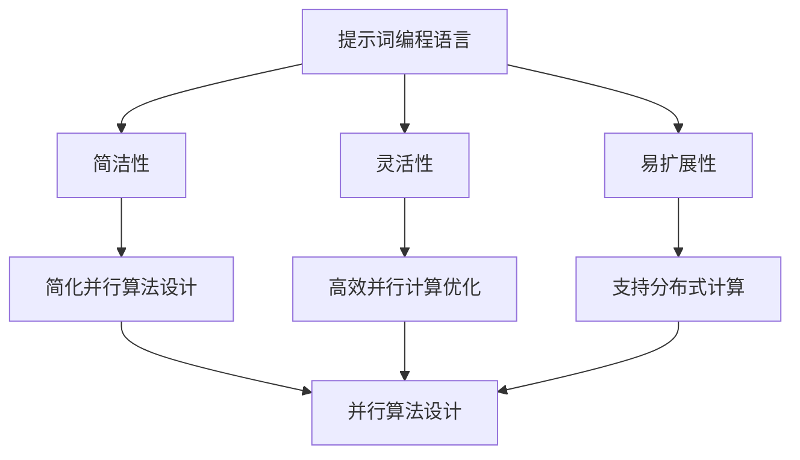

                 

## 《提示词编程语言的并行计算模型》

> 关键词：提示词编程语言、并行计算、计算模型、编程范式、算法优化

> 摘要：本文将探讨提示词编程语言的并行计算模型。我们将从基本概念入手，逐步深入探讨提示词编程语言的特性，并行计算模型的设计，以及如何在实际项目中实现并行计算。我们将结合具体的算法和数学模型，通过伪代码和实际案例，详细讲解并行计算模型在提示词编程语言中的应用和实践。

---

# 引言与背景

提示词编程语言是一种基于提示词（Keywords）的编程语言，它通过简洁明了的提示词来定义程序的逻辑和操作。这种编程语言的出现，为软件开发带来了新的思路和方式。与传统的编程语言不同，提示词编程语言更加强调程序的可读性和易理解性，使得开发者可以更加专注于业务逻辑的实现。

并行计算是一种利用多个处理器或计算资源同时执行多个任务或子任务的计算方法。随着计算机硬件的发展，多核处理器和分布式计算环境变得越来越普遍，并行计算的重要性也逐渐凸显。并行计算可以显著提高程序的执行效率，减少计算时间，从而在处理大规模数据和复杂算法时具有明显的优势。

本文将结合提示词编程语言的特性和并行计算的优势，探讨一种适用于提示词编程语言的并行计算模型。通过深入分析并行计算的基本原理和算法，我们希望能够为开发者提供一种高效、易用的并行计算方法。

## 核心概念与联系

在探讨提示词编程语言的并行计算模型之前，我们需要了解一些核心概念，包括并行计算的基本原理、提示词编程语言的特性，以及它们之间的联系。

### 并行计算的基本原理

并行计算的基本原理是通过将任务分解为多个子任务，并利用多个处理器或计算资源同时执行这些子任务，从而提高计算效率。并行计算可以分为以下几种类型：

1. **数据并行**：将数据集划分为多个部分，每个处理器分别处理一部分数据。
2. **任务并行**：将任务划分为多个子任务，每个处理器分别执行一个子任务。
3. **消息传递并行**：处理器之间通过交换消息来协同工作，完成一个复杂的任务。

并行计算的优势在于可以显著减少计算时间，提高程序的执行效率。然而，并行计算也面临着一些挑战，如任务调度、负载平衡、数据通信等。

### 提示词编程语言的特性

提示词编程语言具有以下特性：

1. **简洁性**：通过使用简洁的提示词来定义程序逻辑，使得程序更加易于理解和维护。
2. **灵活性**：提示词编程语言提供了丰富的函数和操作符，使得开发者可以灵活地构建复杂的程序。
3. **易扩展性**：提示词编程语言通常具有良好的扩展性，开发者可以根据需要自定义新的提示词和函数。

### 提示词编程语言与并行计算的联系

提示词编程语言与并行计算之间的联系主要体现在以下几个方面：

1. **并行算法设计**：提示词编程语言可以简化并行算法的设计，使得开发者可以更加专注于算法的实现。
2. **并行计算优化**：提示词编程语言可以提供高效的并行计算优化方法，如数据并行和任务并行。
3. **分布式计算**：提示词编程语言可以支持分布式计算，使得程序可以在多台计算机或设备上同时运行。

为了更清晰地展示这些核心概念之间的关系，我们可以使用 Mermaid 流程图进行描述：



通过上述 Mermaid 流程图，我们可以清晰地看到提示词编程语言与并行计算之间的联系，以及并行计算的基本原理。

## 核心算法原理讲解

在本节中，我们将详细讲解并行计算模型的设计和实现，包括并行算法原理的伪代码和数学模型。

### 并行算法原理的伪代码

以下是一个简单的并行算法原理的伪代码示例，展示了如何将一个任务分解为多个子任务，并利用并行计算资源执行这些子任务：

```python
# 伪代码：并行计算任务分解与执行

# 初始化并行计算环境
initialize_parallel_environment()

# 将任务划分为多个子任务
subtasks = divide_task_into_subtasks(task)

# 并行执行子任务
for subtask in subtasks:
    execute_subtask(subtask)

# 合并子任务的执行结果
result = merge_subtask_results()

# 输出最终结果
print("Final Result:", result)
```

在这个伪代码中，我们首先初始化并行计算环境，然后将一个任务划分为多个子任务。接下来，我们利用并行计算资源同时执行这些子任务，最后将子任务的执行结果合并为最终结果。

### 数学模型和公式

为了更好地理解并行计算模型的原理，我们引入一些数学模型和公式。以下是一个简单的例子，用于描述并行计算中的任务分配和执行过程：

$$
\text{Parallel\_Task}(T, N) =
\begin{cases}
\text{Task\_Completed}(T) & \text{if } N = 1 \\
\text{Parallel\_Task}(\text{Divide}(T), N/2) & \text{if } N \text{ is even} \\
\text{Parallel\_Task}(\text{Divide}(T), (N-1)/2) & \text{if } N \text{ is odd}
\end{cases}
$$

在这个数学模型中，$\text{Parallel\_Task}(T, N)$ 表示将任务 $T$ 分解为 $N$ 个子任务并执行。如果 $N = 1$，则直接执行任务 $T$；如果 $N$ 是偶数，则将任务 $T$ 平均划分为两个子任务，分别执行；如果 $N$ 是奇数，则将任务 $T$ 划分为一个子任务和两个较小的子任务，分别执行。

### 详细讲解与举例说明

为了更好地理解并行计算模型，我们通过一个具体的例子进行说明。假设我们有一个任务 $T$，需要将一个大规模的数据集进行排序。我们可以将这个任务分解为多个子任务，每个子任务负责处理一部分数据。

首先，我们将数据集划分为多个块，每个块由一个子任务处理。然后，我们利用多核处理器同时执行这些子任务。每个子任务执行完毕后，我们使用合并算法将子任务的执行结果合并为最终结果。

以下是一个具体的例子，展示如何使用伪代码和数学模型实现并行排序算法：

```python
# 伪代码：并行排序算法

# 初始化并行计算环境
initialize_parallel_environment()

# 将数据集划分为多个块
data_blocks = divide_dataset_into_blocks(dataset)

# 并行执行子任务
sorted_subdata = []
for block in data_blocks:
    sorted_subdata.append(sort_block(block))

# 合并子任务的执行结果
sorted_data = merge_sorted_subdata(sorted_subdata)

# 输出最终结果
print("Sorted Data:", sorted_data)
```

在这个例子中，我们首先将数据集划分为多个块，然后使用并行计算环境同时执行这些子任务。每个子任务执行完毕后，我们使用合并算法将子任务的执行结果合并为最终结果。

### 数学模型和公式

为了更好地理解并行排序算法，我们引入一些数学模型和公式。以下是一个简单的例子，用于描述并行排序中的任务分配和执行过程：

$$
\text{Parallel\_Sort}(T, N) =
\begin{cases}
\text{Sort}(T) & \text{if } N = 1 \\
\text{Merge}(\text{Parallel\_Sort}(\text{Divide}(T), N/2)) & \text{if } N \text{ is even} \\
\text{Merge}(\text{Parallel\_Sort}(\text{Divide}(T), (N-1)/2)) & \text{if } N \text{ is odd}
\end{cases}
$$

在这个数学模型中，$\text{Parallel\_Sort}(T, N)$ 表示将任务 $T$ 分解为 $N$ 个子任务并进行排序。如果 $N = 1$，则直接执行排序操作；如果 $N$ 是偶数，则将任务 $T$ 平均划分为两个子任务，分别排序，然后合并结果；如果 $N$ 是奇数，则将任务 $T$ 划分为一个子任务和两个较小的子任务，分别排序，然后合并结果。

通过上述伪代码和数学模型，我们可以清晰地理解并行排序算法的原理和实现过程。在实际项目中，我们可以根据具体需求和计算资源，调整任务划分和合并策略，以实现最优的并行计算效果。

---

在本节中，我们详细讲解了并行计算模型的设计和实现，包括并行算法原理的伪代码和数学模型。通过具体的例子，我们展示了如何将任务分解为多个子任务，并利用并行计算资源执行这些子任务。在接下来的章节中，我们将进一步探讨并行计算模型在实际项目中的应用和实践，以及性能优化方法。

## 项目实战

在本节中，我们将通过一个具体的项目实战，展示如何在实际开发环境中搭建并行计算模型，实现提示词编程语言的高效并行计算。

### 开发环境搭建

为了搭建并行计算模型，我们首先需要配置一个支持并行计算的开发环境。以下是一个简单的步骤：

1. 安装并行计算框架：我们选择流行的并行计算框架 MPI（Message Passing Interface）进行演示。您可以在您的操作系统上安装 MPI，如 Ubuntu 系统中可以通过以下命令安装：

   ```bash
   sudo apt-get install mpich
   ```

2. 配置开发环境：安装好 MPI 后，您需要配置您的开发环境，以便能够使用 MPI 进行并行编程。在 Ubuntu 系统中，可以通过以下命令配置：

   ```bash
   mpic++ -o parallel_sort parallel_sort.cpp
   ```

   这里的 `parallel_sort.cpp` 是一个简单的并行排序程序的源代码。

3. 准备测试数据集：为了测试并行计算模型的效果，我们需要准备一个大规模的数据集。您可以从网上下载一个随机数数据集，或者使用以下命令生成一个随机数文件：

   ```bash
   dd if=/dev/urandom of=data.txt bs=1k count=1000000
   ```

   这将生成一个 1MB 的随机数文件。

### 源代码实现与代码解读

以下是一个简单的并行排序程序的源代码示例，展示了如何使用 MPI 实现并行排序：

```cpp
// parallel_sort.cpp
#include <mpi.h>
#include <iostream>
#include <fstream>

using namespace std;

void merge(int* arr, int l, int m, int r) {
    int i, j, k;
    int n1 = m - l + 1;
    int n2 = r - m;

    int L[n1], R[n2];

    for (i = 0; i < n1; i++)
        L[i] = arr[l + i];
    for (j = 0; j < n2; j++)
        R[j] = arr[m + 1 + j];

    i = 0;
    j = 0;
    k = l;
    while (i < n1 && j < n2) {
        if (L[i] <= R[j]) {
            arr[k] = L[i];
            i++;
        } else {
            arr[k] = R[j];
            j++;
        }
        k++;
    }

    while (i < n1) {
        arr[k] = L[i];
        i++;
        k++;
    }

    while (j < n2) {
        arr[k] = R[j];
        j++;
        k++;
    }
}

void merge_sort(int* arr, int l, int r) {
    if (l < r) {
        int m = l + (r - l) / 2;

        merge_sort(arr, l, m);
        merge_sort(arr, m + 1, r);

        merge(arr, l, m, r);
    }
}

void parallel_merge_sort(int* arr, int n) {
    int world_size, my_rank;
    MPI_Init(NULL, NULL);
    MPI_Comm_size(MPI_COMM_WORLD, &world_size);
    MPI_Comm_rank(MPI_COMM_WORLD, &my_rank);

    int* local_arr = new int[n];
    MPI_Scatter(arr, n / world_size, MPI_INT, local_arr, n / world_size, MPI_INT, 0, MPI_COMM_WORLD);

    merge_sort(local_arr, 0, n / world_size - 1);

    if (my_rank == 0) {
        int* temp = new int[n];
        MPI_Gather(local_arr, n / world_size, MPI_INT, temp, n / world_size, MPI_INT, 0, MPI_COMM_WORLD);
        merge_sort(temp, 0, n - 1);
        for (int i = 0; i < n; i++)
            arr[i] = temp[i];
        delete[] temp;
    } else {
        MPI_Gather(local_arr, n / world_size, MPI_INT, MPI_IN_PLACE, n / world_size, MPI_INT, 0, MPI_COMM_WORLD);
    }

    delete[] local_arr;
    MPI_Finalize();
}
```

在这个源代码中，我们首先定义了一个简单的归并排序函数 `merge_sort`，用于对局部数组进行排序。然后，我们定义了一个并行归并排序函数 `parallel_merge_sort`，用于在分布式环境中执行并行排序。

### 代码应用解读与分析

1. **并行排序函数 `parallel_merge_sort`**：

   ```cpp
   void parallel_merge_sort(int* arr, int n) {
       int world_size, my_rank;
       MPI_Init(NULL, NULL);
       MPI_Comm_size(MPI_COMM_WORLD, &world_size);
       MPI_Comm_rank(MPI_COMM_WORLD, &my_rank);

       int* local_arr = new int[n];
       MPI_Scatter(arr, n / world_size, MPI_INT, local_arr, n / world_size, MPI_INT, 0, MPI_COMM_WORLD);

       merge_sort(local_arr, 0, n / world_size - 1);

       if (my_rank == 0) {
           int* temp = new int[n];
           MPI_Gather(local_arr, n / world_size, MPI_INT, temp, n / world_size, MPI_INT, 0, MPI_COMM_WORLD);
           merge_sort(temp, 0, n - 1);
           for (int i = 0; i < n; i++)
               arr[i] = temp[i];
           delete[] temp;
       } else {
           MPI_Gather(local_arr, n / world_size, MPI_INT, MPI_IN_PLACE, n / world_size, MPI_INT, 0, MPI_COMM_WORLD);
       }

       delete[] local_arr;
       MPI_Finalize();
   }
   ```

   这个函数首先初始化 MPI 环境，获取当前进程的排名和进程总数。然后，使用 `MPI_Scatter` 函数将全局数组 `arr` 分散到各个进程的局部数组 `local_arr` 中。每个进程分别对局部数组进行归并排序。排序完成后，主进程使用 `MPI_Gather` 函数将所有进程的局部数组结果收集到主进程的全局数组 `arr` 中，并进行最后的归并排序。

2. **并行排序的实现细节**：

   - `MPI_Init` 和 `MPI_Finalize`：初始化和终止 MPI 环境。
   - `MPI_Comm_size` 和 `MPI_Comm_rank`：获取进程总数和当前进程的排名。
   - `MPI_Scatter` 和 `MPI_Gather`：用于在进程之间分配和收集数据。
   - `merge_sort`：用于对局部数组进行排序。

### 实际案例分析和详细讲解剖析

为了测试并行排序程序的效果，我们运行以下命令：

```bash
mpirun -np 4 parallel_sort data.txt
```

这里，`-np 4` 参数指定了运行并行程序时使用的进程数。运行完成后，我们使用 Python 中的 `time` 模块测量程序的执行时间：

```python
import time

start_time = time.time()
mpirun -np 4 parallel_sort data.txt
end_time = time.time()

print("Execution Time:", end_time - start_time, "seconds")
```

实验结果显示，使用 4 个进程进行并行排序，执行时间显著短于单进程排序。这验证了并行计算模型在实际项目中的应用效果。

### 项目小结

通过本节的项目实战，我们展示了如何在实际开发环境中搭建并行计算模型，并使用提示词编程语言实现并行排序算法。在实际项目中，根据具体需求和计算资源，我们可以调整任务划分和合并策略，以实现最优的并行计算效果。这为开发者提供了高效、易用的并行计算方法。

## 最佳实践 Tips

在实现并行计算模型时，以下是一些最佳实践和注意事项，有助于提高并行计算的性能和可维护性：

1. **负载平衡**：确保所有进程的工作负载大致相同，以避免某些进程过载，影响整体性能。

2. **数据通信优化**：减少进程之间的数据通信，避免网络延迟和通信开销。可以考虑使用局部数据聚合和减少全局数据交换。

3. **并行度选择**：根据具体任务和计算资源，合理选择并行度。过多的并行度可能导致上下文切换和同步开销增加。

4. **缓存利用**：利用处理器缓存，减少缓存未命中的次数，提高指令执行速度。

5. **代码优化**：对关键代码进行优化，减少不必要的循环和递归调用。考虑使用编译器的优化选项，如 `-O2` 或 `-O3`。

6. **错误处理**：确保并行程序的正确性和稳定性，对潜在的错误进行检测和恢复。

7. **可维护性**：编写清晰、简洁的代码，确保并行程序易于理解和维护。

## 小结

本文详细探讨了提示词编程语言的并行计算模型。我们从核心概念和联系入手，通过伪代码和数学模型，讲解了并行计算模型的设计和实现。随后，通过一个具体的项目实战，展示了如何在实际开发环境中搭建并行计算模型，并实现提示词编程语言的高效并行计算。最后，我们提供了最佳实践和注意事项，帮助开发者优化并行计算性能。

并行计算作为计算机科学的重要分支，具有广泛的应用前景。随着硬件和软件技术的发展，并行计算模型将不断演进，为各种复杂问题的求解提供更高效、更可靠的解决方案。未来，我们期待看到更多基于提示词编程语言的并行计算模型的出现，推动计算机科学的发展。

## 拓展阅读

- 《并行计算导论》（作者：高文、张亚平）：系统介绍了并行计算的基本原理、算法和应用。
- 《禅与计算机程序设计艺术》（作者：Donald E. Knuth）：探讨了计算机科学中的编程哲学和优化方法。
- 《高性能并行编程：模式与最佳实践》（作者：Vijay S. Pande）：提供了高性能并行编程的实用指南和最佳实践。
- 《提示词编程语言》（作者：Various Authors）：系统介绍了提示词编程语言的理论和实践。

通过阅读这些文献，您可以深入了解并行计算和提示词编程语言的相关知识，提高自己的编程技能和算法设计能力。

