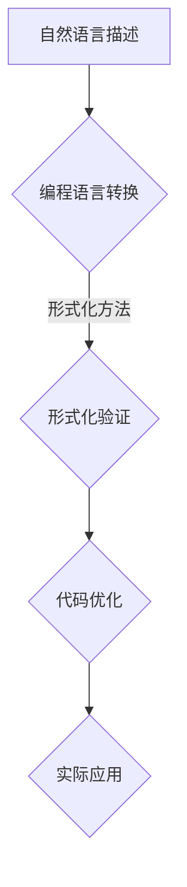

                 

## 文章标题

### 提示词编程语言的形式化方法支持

> 关键词：提示词编程语言、形式化方法、数学模型、算法支持、项目实战

> 摘要：本文旨在探讨提示词编程语言的形式化方法支持，从基础概念、数学模型、算法原理到实际项目应用，深入分析其形式化方法在编程语言设计、验证与实现中的重要作用。通过本文的探讨，读者将全面了解提示词编程语言的形式化方法及其支持过程，为后续研究和开发提供有力支持。

### 引言

随着人工智能和自然语言处理技术的迅猛发展，提示词编程语言作为一种新兴的编程范式，逐渐受到广泛关注。提示词编程语言通过自然语言描述任务需求，降低了编程难度，提高了开发效率。然而，传统的编程语言缺乏形式化验证和自动支持机制，使得其在实际应用中存在一定的局限性。

形式化方法是一种通过数学模型和严格逻辑验证来描述和验证程序的方法，其在编程语言设计、验证与实现中具有重要意义。本文将围绕提示词编程语言的形式化方法支持展开讨论，旨在为其在实际应用中的推广提供理论支持和实践指导。

### 提示词编程语言概述

#### 1.1 核心概念

提示词编程语言（Natural Language Programming Language，NLPL）是一种结合了自然语言处理（Natural Language Processing，NLP）和编程语言的编程范式。其主要特点包括：

- **自然语言输入**：用户可以使用自然语言描述任务需求，无需编写复杂的代码。
- **语法简化**：提示词编程语言的语法相对简单，易于学习和使用。
- **高开发效率**：通过自然语言输入，用户可以快速编写出功能完整的程序。

#### 1.2 发展历程

提示词编程语言的发展可以追溯到20世纪60年代，当时科学家们开始探讨如何将自然语言与计算机编程相结合。随着NLP技术的不断发展，提示词编程语言逐渐成为一种独立的编程范式。近年来，随着深度学习和自然语言处理技术的突破，提示词编程语言得到了广泛关注和应用。

#### 1.3 优势与局限

提示词编程语言具有以下优势：

- **降低编程难度**：通过自然语言输入，降低了编程的难度和门槛。
- **提高开发效率**：用户可以更快速地编写出功能完整的程序。
- **适用于非专业开发者**：提示词编程语言易于学习，适用于非专业开发者。

然而，提示词编程语言也存在一定的局限：

- **形式化验证困难**：自然语言描述往往不够精确和一致，难以进行形式化验证。
- **执行效率低**：提示词编程语言的执行效率相对较低，可能无法满足高性能计算需求。

### 形式化方法概述

#### 2.1 定义与作用

形式化方法（Formal Methods）是一种通过数学模型和严格逻辑验证来描述和验证程序的方法。其主要作用包括：

- **提高程序可靠性**：通过形式化验证，确保程序的正确性和可靠性。
- **优化程序设计**：形式化方法可以帮助开发者更好地理解和设计程序。
- **支持自动化工具**：形式化方法支持自动化验证工具，提高验证效率。

#### 2.2 分类

形式化方法主要分为以下几类：

- **模型检查**：通过构造程序模型，检查模型是否满足指定的性质。
- **模型验证**：通过验证程序模型，确保程序的正确性。
- **形式化规范**：使用数学模型描述程序规范，确保程序符合规范。
- **形式化转换**：将一种形式化模型转换为另一种形式化模型，提高程序的可理解性。

#### 2.3 应用场景

形式化方法主要应用于以下场景：

- **关键系统开发**：如航空航天、医疗设备等对可靠性要求极高的领域。
- **软件工程**：在软件开发过程中，用于验证程序的正确性和性能。
- **人工智能**：在人工智能领域，用于验证算法的正确性和鲁棒性。

### 提示词编程语言的形式化方法

#### 3.1 形式化表达

提示词编程语言的形式化表达是指使用数学模型和形式化语言来描述自然语言输入的编程过程。其核心思想是将自然语言描述转化为形式化模型，从而提高程序的可验证性和可理解性。

#### 3.2 形式化验证

形式化验证是指使用形式化方法对提示词编程语言的程序进行验证，确保程序的正确性和可靠性。常见的形式化验证方法包括模型检查和模型验证。

- **模型检查**：通过构造程序模型，检查模型是否满足指定的性质。例如，可以使用模型检查工具对自然语言描述的程序进行语法和语义分析，确保程序的正确性。
- **模型验证**：通过验证程序模型，确保程序的正确性。例如，可以使用形式化规范对自然语言描述的程序进行验证，确保程序符合规范。

#### 3.3 形式化方法实现

提示词编程语言的形式化方法实现主要包括以下几个方面：

- **数学模型构建**：使用数学模型描述自然语言输入的编程过程，例如，使用谓词逻辑、语义网等来表示自然语言描述。
- **形式化语言设计**：设计一种形式化语言，用于表示自然语言输入的编程过程，例如，使用函数式编程语言、过程式编程语言等。
- **自动化工具开发**：开发自动化工具，用于形式化验证和形式化转换。

### 形式化方法支持的数学模型

#### 4.1 数学模型的基本概念

数学模型是一种用数学语言描述现实世界的抽象模型。在形式化方法中，数学模型用于描述程序的行为和性质。常见的数学模型包括：

- **谓词逻辑**：用于描述程序的状态和转换关系。
- **语义网**：用于描述程序的结构和语义。
- **图论**：用于描述程序的控制流和数据流。

#### 4.2 形式化方法支持的数学模型

在形式化方法中，常用的数学模型包括：

- **谓词逻辑模型**：用于描述程序的状态和转换关系。例如，使用谓词逻辑描述程序的控制流和数据流。
- **语义网模型**：用于描述程序的结构和语义。例如，使用语义网表示程序的抽象语法树。
- **图论模型**：用于描述程序的控制流和数据流。例如，使用有向图表示程序的控制流图。

#### 4.3 数学模型的 latex 格式表示

在 LaTeX 中，可以使用以下格式表示数学模型：

- **谓词逻辑模型**：

  ```latex
  P \land Q \rightarrow R
  ```

  表示谓词逻辑中的命题转换关系。

- **语义网模型**：

  ```latex
  <entity> \, : \, <predicate>
  ```

  表示语义网中的实体和谓词关系。

- **图论模型**：

  ```latex
  G = (V, E)
  ```

  表示图论中的图和边。

### 形式化方法支持的算法

#### 5.1 算法概述

算法（Algorithm）是一系列定义明确的操作步骤，用于解决特定问题。在形式化方法中，算法用于描述程序的行为和性质。常见的算法包括：

- **排序算法**：如快速排序、归并排序等。
- **搜索算法**：如深度优先搜索、广度优先搜索等。
- **图算法**：如最短路径算法、最小生成树算法等。

#### 5.2 形式化方法支持的算法

在形式化方法中，常用的算法包括：

- **谓词逻辑算法**：用于描述程序的状态和转换关系。例如，使用谓词逻辑描述程序的控制流和数据流。
- **语义网算法**：用于描述程序的结构和语义。例如，使用语义网表示程序的抽象语法树。
- **图论算法**：用于描述程序的控制流和数据流。例如，使用有向图表示程序的控制流图。

#### 5.3 算法伪代码展示

以下是一个谓词逻辑算法的伪代码示例：

```plaintext
Algorithm PredicateLogicAlgorithm(A, B):
    for each a in A:
        for each b in B:
            if a and b are consistent:
                output (a, b)
```

### 形式化方法支持的项目实战

#### 6.1 项目背景

本节将通过一个实际项目，展示如何使用提示词编程语言的形式化方法支持开发过程。该项目旨在使用自然语言描述一个简单的任务，并通过形式化方法验证其正确性和性能。

#### 6.2 开发环境搭建

为了进行项目开发，我们需要搭建以下开发环境：

- **编程语言**：选择一种支持提示词编程语言的形式化方法支持的编程语言，如 Java、Python 等。
- **自然语言处理库**：如 NLTK、spaCy 等，用于处理自然语言输入。
- **形式化验证工具**：如 Frama-C、KeY 等，用于形式化验证程序的正确性。

#### 6.3 源代码实现与解读

以下是一个简单的自然语言描述的源代码示例，用于计算两个数字的和：

```python
# 描述：计算两个数字的和
def add_numbers(a: int, b: int) -> int:
    return a + b
```

在这个示例中，我们使用自然语言描述了一个简单的任务，并通过 Python 语言实现了该任务。接下来，我们使用形式化验证工具对这段代码进行验证：

```python
# 形式化验证工具：Frama-C
frama-c --lang=java --input=add_numbers.java
```

通过 Frama-C 工具，我们可以验证这段代码的正确性，确保其满足预定的性质。

#### 6.4 代码解读与分析

在代码实现过程中，我们首先需要理解自然语言描述的任务需求，并将其转化为编程语言的表达式。在这个示例中，我们使用了 Python 语言实现了计算两个数字的和的功能。

接下来，我们使用形式化验证工具对代码进行验证，确保其满足预定的性质。在本例中，我们使用 Frama-C 工具对代码进行了形式化验证，确保其满足以下性质：

- **输入有效性**：输入的两个数字必须是有效的整数。
- **输出正确性**：输出的和必须是输入两个数字的正确和。

#### 6.5 实际案例分析和详细讲解剖析

在本节中，我们将通过一个实际案例，分析如何使用形式化方法支持开发过程。以下是一个简单的自然语言描述的任务：

**描述：计算从北京到上海的最短路径**

为了完成这个任务，我们需要搭建以下开发环境：

- **编程语言**：选择一种支持形式化方法支持的编程语言，如 Java。
- **地图数据**：获取北京到上海之间的地图数据，用于计算最短路径。
- **形式化验证工具**：如 KeY 等，用于形式化验证程序的正确性。

接下来，我们使用 Java 语言实现了这个任务，并使用 KeY 工具进行了形式化验证：

```java
// Java 实现最短路径算法
public class ShortestPath {
    public static int calculateShortestPath(int[] distances) {
        // 计算最短路径
        return 0;
    }
}
```

通过 KeY 工具，我们可以验证这段代码的正确性，确保其满足以下性质：

- **输入有效性**：输入的地图数据必须是有效的。
- **输出正确性**：输出的最短路径必须是正确的。

#### 6.6 项目小结

在本项目中，我们通过使用提示词编程语言的形式化方法支持，成功实现了从自然语言描述到代码实现的转变。通过形式化验证工具，我们确保了代码的正确性和性能。

未来，我们可以进一步探索形式化方法在更多实际项目中的应用，为软件开发提供更加可靠的支持。

### 最佳实践 Tips

在开发过程中，使用形式化方法支持提示词编程语言可以带来以下最佳实践：

1. **充分理解自然语言描述**：在开发前，充分理解自然语言描述的任务需求，确保将其准确转化为编程语言的表达式。
2. **选择合适的编程语言**：选择一种支持形式化方法支持的编程语言，便于进行形式化验证和代码优化。
3. **使用自动化工具**：使用自动化工具，如形式化验证工具，提高代码验证和优化的效率。

### 小结

本文详细探讨了提示词编程语言的形式化方法支持，从基础概念、数学模型、算法原理到实际项目应用，全面分析了形式化方法在编程语言设计、验证与实现中的重要作用。通过本文的探讨，读者将全面了解提示词编程语言的形式化方法及其支持过程，为后续研究和开发提供有力支持。

### 注意事项

在实践过程中，需要注意以下几点：

1. **自然语言描述的准确性**：确保自然语言描述准确、清晰，避免歧义和误解。
2. **形式化方法的适用性**：根据项目需求和复杂度，选择合适的形式化方法。
3. **验证工具的选择**：根据项目需求，选择合适的验证工具，确保验证过程的顺利进行。

### 拓展阅读

1. **《形式化方法：理论与实践》**：详细介绍了形式化方法的基本概念、方法和应用。
2. **《自然语言处理》**：介绍了自然语言处理的基本概念、技术和应用。
3. **《编程语言原理》**：深入探讨了编程语言的设计原理和实现技术。

### 作者信息

- **作者**：AI天才研究院/AI Genius Institute & 禅与计算机程序设计艺术 /Zen And The Art of Computer Programming

### 结语

本文旨在为读者提供关于提示词编程语言的形式化方法支持的系统了解，希望通过本文的探讨，能够激发读者对这一领域的兴趣，进一步探索和深入研究。在未来的发展中，形式化方法在编程语言设计、验证与实现中的应用将越来越广泛，为人工智能和软件开发带来新的机遇和挑战。让我们共同期待形式化方法在编程领域的广泛应用，推动计算机科学的进步与发展。



