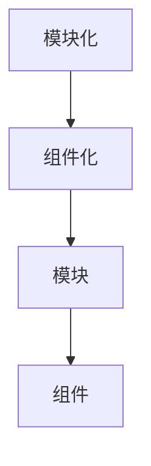
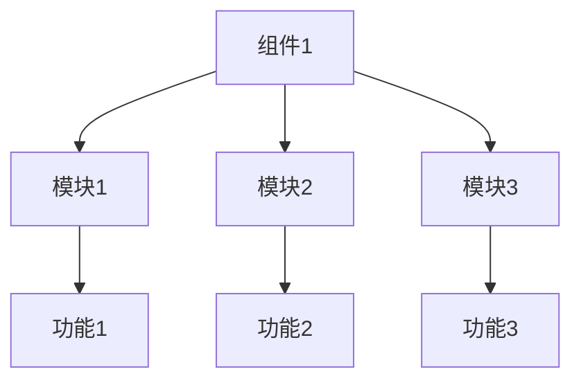

                 

### 引言

在当前快速发展的信息技术时代，编程语言作为实现软件开发的工具，其设计理念的不断演进对软件工程产生了深远的影响。模块化和组件化作为现代编程语言的核心设计理念，正在逐步改变传统的编程模式。本文将围绕“提示词编程语言的模块化与组件化”这一主题，展开深入探讨。

**模块化**指的是将复杂的系统拆分成若干独立的、功能明确的模块，使得每个模块都能独立开发、测试和维护。模块化能够提高代码的可复用性、降低系统的耦合度，并促进团队协作开发。**组件化**则是在模块化的基础上，进一步将模块组合成更高级别的功能单元——组件。组件是具有特定功能的代码块，可以在不同的项目中复用，提高开发效率。

**提示词编程语言**是一种以自然语言处理技术为基础的编程语言，其特点是通过输入自然语言提示词来生成相应的代码。这种编程方式不仅降低了编程门槛，还使得开发者能够更加关注业务逻辑而非底层代码实现。模块化和组件化在提示词编程语言中的应用，不仅有助于简化开发过程，还能提升代码质量和系统可维护性。

本文将从以下几个方面展开讨论：

1. **模块化与组件化的基本概念**：介绍模块化与组件化的定义、特点及其在编程语言中的应用。
2. **提示词编程语言的模块化应用**：探讨如何在提示词编程语言中实现模块化，以及模块化的具体实现方法和优势。
3. **提示词编程语言的组件化应用**：介绍如何在提示词编程语言中实现组件化，并分析组件化的优点和应用场景。
4. **案例研究**：通过具体案例，展示模块化和组件化在实际项目中的应用效果。
5. **总结与展望**：总结模块化与组件化在提示词编程语言中的价值，并对未来的发展趋势进行展望。

### 确定核心概念与联系

为了深入理解模块化和组件化在提示词编程语言中的应用，首先需要明确这些核心概念的定义及其相互联系。

**模块化（Modularization）** 是一种软件开发方法，其核心思想是将系统分解为独立的、功能明确的模块。每个模块都负责完成特定的任务，模块之间通过接口进行通信和数据交换。模块化的优点包括提高代码的可复用性、降低系统的复杂度、便于分工协作等。

**组件化（Componentization）** 是在模块化的基础上，将多个模块组合成具有特定功能的组件。组件是更高层次的抽象，可以独立开发、测试、部署和复用。组件化的目标是通过将功能单元组合成更大的功能块，进一步提高开发效率和系统可维护性。

在提示词编程语言中，模块化和组件化具有以下联系：

1. **模块与组件的关系**：模块是组件的基本组成部分。在组件化过程中，多个模块通过组合和封装形成组件，组件具有更高的抽象层次，能够实现特定的功能。
2. **模块化的基础**：模块化是实现组件化的基础。只有将系统分解为独立的模块，才能在此基础上进行组件化。
3. **开发与部署**：模块化与组件化在开发与部署过程中各司其职。模块化关注如何将系统分解为模块，组件化则关注如何将模块组合成组件，并实现组件的独立部署。

为了更好地理解这些核心概念，我们可以使用Mermaid绘制一个简单的结构图：



在这个结构图中，模块化（A）是组件化（B）的基础，模块（C）是组件（D）的基本组成部分。通过这种结构图，我们可以直观地看到模块化与组件化之间的关系和层次结构。

### 模块化与组件化的基本原理

在深入探讨模块化和组件化在提示词编程语言中的应用之前，我们需要了解这两个概念的基本原理和特点。

#### 模块化的基本原理

模块化是一种将复杂系统分解为若干独立模块的方法。每个模块都有明确的职责，可以独立开发、测试和维护。模块化的基本原理包括以下几个方面：

1. **职责分离**：将系统的功能分解为若干独立的部分，每个模块负责完成特定的任务。这样不仅降低了系统的复杂度，还提高了模块的可复用性。
2. **接口定义**：模块之间通过接口进行通信和数据交换。接口定义了模块之间的交互方式和规则，保证了模块的独立性。
3. **模块独立性**：模块应该具有高度的独立性，即每个模块都可以独立运行，不依赖于其他模块的具体实现。

模块化的优点包括：

- **提高代码复用性**：通过将系统分解为模块，可以更容易地复用模块中的代码，减少重复开发。
- **降低系统复杂度**：模块化将复杂系统分解为若干独立的部分，降低了系统的整体复杂度，使得系统更容易理解和维护。
- **便于分工协作**：模块化使得团队可以分别开发不同的模块，提高了协作效率。

在编程语言中，模块化可以通过不同的方式实现，例如：

- **面向对象编程**：通过类和对象实现模块化，将系统的功能划分为不同的类，每个类负责完成特定的任务。
- **模块文件**：将系统的功能划分为不同的文件，每个文件包含一个模块，通过文件包含和导出实现模块化。

#### 组件化的基本原理

组件化是在模块化的基础上，将多个模块组合成具有特定功能的组件。组件是更高层次的抽象，可以独立开发、测试、部署和复用。组件化的基本原理包括以下几个方面：

1. **组件定义**：组件是一个具有特定功能的代码块，通常包含一个或多个模块。组件的定义需要明确其功能、接口和依赖关系。
2. **组件组合**：通过将多个组件组合在一起，可以形成具有更复杂功能的应用系统。组件组合的过程包括组件之间的接口匹配、依赖注入等。
3. **组件独立性**：组件应该具有高度的独立性，即每个组件都可以独立运行，不依赖于其他组件的具体实现。

组件化的优点包括：

- **提高开发效率**：通过组件化，可以将复杂的系统分解为若干独立的组件，每个组件可以独立开发、测试和部署，提高了开发效率。
- **促进复用**：组件是更高层次的抽象，可以跨项目、跨平台复用，提高了代码的复用性。
- **降低维护成本**：组件化使得系统具有更好的模块化结构，降低了维护成本。

在编程语言中，组件化可以通过不同的方式实现，例如：

- **框架支持**：许多编程语言和框架提供了组件化开发的支持，例如Spring框架支持组件化开发。
- **依赖管理**：通过依赖管理工具，可以实现组件的自动装配和依赖注入，简化组件组合的过程。

通过理解模块化和组件化的基本原理，我们可以更好地应用这些概念于提示词编程语言中，提高开发效率和质量。

### 提示词编程语言中的模块化应用

在提示词编程语言中，模块化是实现代码组织和复用的有效手段。模块化能够将复杂的编程任务分解为若干独立的模块，每个模块专注于特定的功能。这不仅降低了系统的复杂度，还提高了代码的可维护性和可复用性。以下将从模块化编程模型、模块化编程实践和模块化编程案例分析三个方面，详细探讨模块化在提示词编程语言中的应用。

#### 模块化编程模型

模块化编程模型是提示词编程语言实现模块化的基础。该模型包括以下几个关键要素：

1. **模块定义**：模块是具有特定功能的代码块，通常由函数、类或对象组成。模块的定义需要明确其功能和职责，以便其他模块能够方便地调用和使用。
2. **模块接口**：模块接口是模块对外提供服务的入口。接口定义了模块的功能和调用方式，保证了模块的独立性。在提示词编程语言中，模块接口通常通过函数签名或类定义来实现。
3. **模块依赖**：模块之间可能存在依赖关系，即一个模块需要依赖于另一个模块提供的功能或资源。模块依赖需要通过适当的机制进行管理和传递，以确保模块的正确运行。

以下是一个简单的模块化编程模型示例：


在这个示例中，主模块A依赖于模块1、模块2和模块3，每个模块都实现了特定的功能。模块之间通过接口进行通信和数据交换。

#### 模块化编程实践

在实际编程过程中，模块化的实现涉及到模块的划分、接口的设计和模块之间的通信。以下将介绍一些具体的模块化编程实践方法：

1. **模块划分**：模块划分是模块化编程的关键步骤。合理的模块划分能够提高代码的可维护性和可复用性。一般来说，模块的划分可以根据功能、数据、层次结构等因素进行。

    - **按功能划分**：根据系统的功能模块进行划分，每个模块实现特定的功能。例如，在Web应用中，可以划分为用户管理模块、订单管理模块、商品管理模块等。
    - **按数据划分**：根据系统的数据结构进行划分，每个模块负责处理特定的数据。例如，在数据库管理系统中，可以划分为数据库连接模块、数据查询模块、数据更新模块等。
    - **按层次结构划分**：根据系统的层次结构进行划分，每个模块负责不同的层次任务。例如，在分层架构中，可以划分为表示层模块、业务逻辑层模块、数据访问层模块等。

2. **接口设计**：接口设计是模块化编程的核心。良好的接口设计能够提高模块的独立性，确保模块之间的高效通信。在提示词编程语言中，接口设计可以通过函数签名或类定义来实现。

    - **函数签名**：在函数编程语言中，函数签名定义了函数的输入参数和返回值，以及函数的功能描述。良好的函数签名能够明确模块的功能和职责，便于其他模块调用。
    - **类定义**：在面向对象编程语言中，类定义了对象的属性和方法，以及类的功能描述。良好的类定义能够实现模块的封装和抽象，提高模块的可复用性。

3. **模块通信**：模块之间的通信是通过接口进行的。在提示词编程语言中，模块通信可以通过消息传递、共享内存等方式实现。

    - **消息传递**：模块之间通过消息传递进行通信，每个模块可以发送和接收消息。消息传递机制需要实现消息的传递、接收和响应，确保模块之间的数据交换。
    - **共享内存**：模块之间通过共享内存进行通信，每个模块可以直接访问共享内存中的数据。共享内存机制需要实现内存的分配、管理和同步，确保模块之间的数据一致性。

以下是一个简单的模块化编程实践示例：

```python
# 模块1：用户管理模块
def register_user(username, password):
    # 实现用户注册功能
    pass

def login_user(username, password):
    # 实现用户登录功能
    pass

# 模块2：订单管理模块
def create_order(user_id, product_id):
    # 实现创建订单功能
    pass

def cancel_order(order_id):
    # 实现取消订单功能
    pass

# 主模块
def main():
    # 实现主程序功能
    user = register_user("john_doe", "password123")
    order = create_order(user.id, 1)
    cancel_order(order.id)

if __name__ == "__main__":
    main()
```

在这个示例中，主模块依赖于用户管理模块和订单管理模块，每个模块都实现了特定的功能。模块之间通过函数调用进行通信，实现了模块化编程。

#### 模块化编程案例分析

在实际项目中，模块化的应用能够显著提高开发效率和质量。以下通过一个具体案例，展示模块化在提示词编程语言中的应用效果。

**案例背景**：假设开发一个在线购物平台，需要实现用户注册、登录、订单管理等功能。项目需求复杂，涉及多个模块和功能。

**模块划分**：根据项目需求，可以将系统划分为以下模块：

- 用户管理模块：负责用户注册、登录等功能。
- 订单管理模块：负责订单创建、取消等功能。
- 商品管理模块：负责商品展示、库存管理等功能。
- 支付模块：负责订单支付、退款等功能。

**接口设计**：为每个模块设计相应的接口，明确模块的功能和职责。以下是一个简单的接口设计示例：

- 用户管理模块接口：
  - `register_user(username, password)`: 用户注册接口。
  - `login_user(username, password)`: 用户登录接口。
- 订单管理模块接口：
  - `create_order(user_id, product_id)`: 创建订单接口。
  - `cancel_order(order_id)`: 取消订单接口。
- 商品管理模块接口：
  - `get_product_list()`: 获取商品列表接口。
  - `update_product_stock(product_id, stock)`: 更新商品库存接口。
- 支付模块接口：
  - `pay_order(order_id)`: 支付订单接口。
  - `refund_order(order_id)`: 退款订单接口。

**模块通信**：模块之间通过接口进行通信，实现数据交换和功能调用。以下是一个简单的模块通信示例：

```python
# 用户管理模块
def register_user(username, password):
    # 实现用户注册功能
    pass

def login_user(username, password):
    # 实现用户登录功能
    pass

# 订单管理模块
def create_order(user_id, product_id):
    # 实现创建订单功能
    pass

def cancel_order(order_id):
    # 实现取消订单功能
    pass

# 主模块
def main():
    # 实现主程序功能
    user = register_user("john_doe", "password123")
    order = create_order(user.id, 1)
    cancel_order(order.id)

if __name__ == "__main__":
    main()
```

在这个案例中，用户管理模块、订单管理模块等通过接口进行通信，实现了模块化编程。模块化使得系统具有更好的可维护性和可扩展性，提高了开发效率和质量。

### 提示词编程语言中的组件化应用

在提示词编程语言中，组件化是实现模块化之上的更高层次抽象和复用手段。组件化通过将功能相关的模块组合成独立的、可复用的组件，提高了系统的开发效率和维护性。以下将从组件化编程模型、组件化编程实践和组件化编程案例分析三个方面，详细探讨组件化在提示词编程语言中的应用。

#### 组件化编程模型

组件化编程模型是提示词编程语言实现组件化的基础。该模型包括以下几个关键要素：

1. **组件定义**：组件是具有特定功能的代码块，通常包含多个模块。组件的定义需要明确其功能、接口和依赖关系。在提示词编程语言中，组件定义可以通过类定义或函数定义来实现。

2. **组件接口**：组件接口是组件对外提供服务的入口。接口定义了组件的功能和调用方式，保证了组件的独立性。组件接口可以通过函数签名或类定义来实现。

3. **组件依赖**：组件之间可能存在依赖关系，即一个组件需要依赖于另一个组件提供的功能或资源。组件依赖需要通过适当的机制进行管理和传递，以确保组件的正确运行。在提示词编程语言中，组件依赖通常通过依赖注入或框架支持来实现。

以下是一个简单的组件化编程模型示例：



在这个示例中，组件1依赖于模块1、模块2和模块3，每个模块都实现了特定的功能。组件1通过接口提供功能，实现了组件化编程。

#### 组件化编程实践

在实际编程过程中，组件化的实现涉及到组件的划分、接口的设计和组件之间的通信。以下将介绍一些具体的组件化编程实践方法：

1. **组件划分**：组件划分是组件化编程的关键步骤。合理的组件划分能够提高代码的可维护性和可复用性。一般来说，组件的划分可以根据功能、业务领域或系统层次结构进行。

    - **按功能划分**：根据系统的功能模块进行划分，每个组件实现特定的功能。例如，在Web应用中，可以划分为用户管理组件、订单管理组件、商品管理组件等。
    - **按业务领域划分**：根据系统的业务领域进行划分，每个组件负责不同的业务领域。例如，在电子商务系统中，可以划分为订单处理组件、支付组件、物流组件等。
    - **按系统层次结构划分**：根据系统的层次结构进行划分，每个组件负责不同的层次任务。例如，在分层架构中，可以划分为表示层组件、业务逻辑层组件、数据访问层组件等。

2. **接口设计**：接口设计是组件化编程的核心。良好的接口设计能够提高组件的独立性，确保组件之间的高效通信。在提示词编程语言中，接口设计可以通过函数签名或类定义来实现。

    - **函数签名**：在函数编程语言中，函数签名定义了函数的输入参数和返回值，以及函数的功能描述。良好的函数签名能够明确组件的功能和职责，便于其他组件调用。
    - **类定义**：在面向对象编程语言中，类定义了对象的属性和方法，以及类的功能描述。良好的类定义能够实现组件的封装和抽象，提高组件的可复用性。

3. **组件通信**：组件之间的通信是通过接口进行的。在提示词编程语言中，组件通信可以通过消息传递、共享内存等方式实现。

    - **消息传递**：组件之间通过消息传递进行通信，每个组件可以发送和接收消息。消息传递机制需要实现消息的传递、接收和响应，确保组件之间的数据交换。
    - **共享内存**：组件之间通过共享内存进行通信，每个组件可以直接访问共享内存中的数据。共享内存机制需要实现内存的分配、管理和同步，确保组件之间的数据一致性。

以下是一个简单的组件化编程实践示例：

```python
# 组件1：用户管理组件
class UserManager:
    def register_user(self, username, password):
        # 实现用户注册功能
        pass
    
    def login_user(self, username, password):
        # 实现用户登录功能
        pass

# 组件2：订单管理组件
class OrderManager:
    def create_order(self, user_id, product_id):
        # 实现创建订单功能
        pass
    
    def cancel_order(self, order_id):
        # 实现取消订单功能
        pass

# 主模块
def main():
    # 实现主程序功能
    user_manager = UserManager()
    order_manager = OrderManager()
    user = user_manager.register_user("john_doe", "password123")
    order = order_manager.create_order(user.id, 1)
    order_manager.cancel_order(order.id)

if __name__ == "__main__":
    main()
```

在这个示例中，用户管理组件和订单管理组件通过接口进行通信，实现了组件化编程。

#### 组件化编程案例分析

在实际项目中，组件化的应用能够显著提高开发效率和质量。以下通过一个具体案例，展示组件化在提示词编程语言中的应用效果。

**案例背景**：假设开发一个电子商务平台，需要实现用户管理、订单管理、支付管理、商品管理等功能。

**组件划分**：根据项目需求，可以将系统划分为以下组件：

- 用户管理组件：负责用户注册、登录等功能。
- 订单管理组件：负责订单创建、取消等功能。
- 支付管理组件：负责订单支付、退款等功能。
- 商品管理组件：负责商品展示、库存管理等功能。

**组件接口设计**：为每个组件设计相应的接口，明确组件的功能和职责。以下是一个简单的接口设计示例：

- 用户管理组件接口：
  - `register_user(username, password)`: 用户注册接口。
  - `login_user(username, password)`: 用户登录接口。
- 订单管理组件接口：
  - `create_order(user_id, product_id)`: 创建订单接口。
  - `cancel_order(order_id)`: 取消订单接口。
- 支付管理组件接口：
  - `pay_order(order_id)`: 支付订单接口。
  - `refund_order(order_id)`: 退款订单接口。
- 商品管理组件接口：
  - `get_product_list()`: 获取商品列表接口。
  - `update_product_stock(product_id, stock)`: 更新商品库存接口。

**组件通信**：组件之间通过接口进行通信，实现数据交换和功能调用。以下是一个简单的组件通信示例：

```python
# 用户管理组件
class UserManager:
    def register_user(self, username, password):
        # 实现用户注册功能
        pass
    
    def login_user(self, username, password):
        # 实现用户登录功能
        pass

# 订单管理组件
class OrderManager:
    def create_order(self, user_id, product_id):
        # 实现创建订单功能
        pass
    
    def cancel_order(self, order_id):
        # 实现取消订单功能
        pass

# 支付管理组件
class PaymentManager:
    def pay_order(self, order_id):
        # 实现支付订单功能
        pass
    
    def refund_order(self, order_id):
        # 实现退款订单功能
        pass

# 商品管理组件
class ProductManager:
    def get_product_list(self):
        # 实现获取商品列表功能
        pass
    
    def update_product_stock(self, product_id, stock):
        # 实现更新商品库存功能
        pass

# 主模块
def main():
    # 实现主程序功能
    user_manager = UserManager()
    order_manager = OrderManager()
    payment_manager = PaymentManager()
    product_manager = ProductManager()
    
    user = user_manager.register_user("john_doe", "password123")
    order = order_manager.create_order(user.id, 1)
    payment_manager.pay_order(order.id)
    product_manager.update_product_stock(1, 10)

if __name__ == "__main__":
    main()
```

在这个案例中，用户管理组件、订单管理组件等通过接口进行通信，实现了组件化编程。组件化使得系统具有更好的可维护性和可扩展性，提高了开发效率和质量。

### 模块化与组件化在自然语言处理中的应用

在自然语言处理（NLP）领域，模块化和组件化被认为是提高系统开发效率、可维护性和可扩展性的关键。通过合理地应用模块化和组件化，NLP系统可以更好地应对复杂性和多样化的需求。以下将讨论模块化与组件化在NLP中的应用，并分析其优缺点。

#### 模块化在NLP中的应用

模块化在NLP中的应用主要体现在以下几个方面：

1. **数据处理模块**：在NLP任务中，数据预处理是一个关键步骤，包括分词、去停用词、词性标注等。将这些数据处理任务拆分为独立的模块，可以提高代码的可复用性和可维护性。
   
   ```python
   def tokenize(text):
       # 分词实现
       pass
   
   def remove_stopwords(tokens):
       # 去停用词实现
       pass
   ```

2. **特征提取模块**：在NLP中，特征提取是实现各种NLP任务（如文本分类、情感分析等）的重要步骤。通过模块化，可以将特征提取过程拆分为独立的模块，每个模块负责提取特定的特征。

   ```python
   def extract_bow(tokens):
       # 布尔词袋特征提取
       pass
   
   def extract_embeddings(tokens):
       # 词嵌入特征提取
       pass
   ```

3. **模型训练模块**：在NLP中，模型训练通常涉及到多个步骤，如数据加载、模型初始化、训练、评估等。将这些步骤拆分为独立的模块，有助于提高开发效率和维护性。

   ```python
   def load_data(data_path):
       # 数据加载实现
       pass
   
   def train_model(model, train_data, val_data):
       # 模型训练实现
       pass
   ```

#### 组件化在NLP中的应用

组件化在NLP中的应用主要体现在以下几个方面：

1. **任务组件**：将NLP任务（如文本分类、命名实体识别等）封装为独立的组件。每个组件实现特定的功能，可以独立开发、测试和部署。

   ```python
   class TextClassifierComponent:
       def train(self, train_data):
           # 训练实现
           pass
   
       def predict(self, text):
           # 预测实现
           pass
   ```

2. **工具组件**：将常用的NLP工具（如分词器、词性标注器等）封装为独立的组件。这些组件可以方便地集成到不同的NLP任务中。

   ```python
   class TokenizerComponent:
       def tokenize(self, text):
           # 分词实现
           pass
   
   class POSComponent:
       def pos_tag(self, tokens):
           # 词性标注实现
           pass
   ```

3. **API组件**：为NLP系统提供统一的API接口，使外部系统能够方便地调用NLP功能。

   ```python
   class NLPAPIComponent:
       def classify_text(self, text):
           # 文本分类实现
           pass
   
       def extract_entities(self, text):
           # 命名实体识别实现
           pass
   ```

#### 优缺点分析

模块化和组件化在NLP中的应用各有优缺点：

**模块化优点**：

- **提高代码复用性**：将NLP任务拆分为独立的模块，可以方便地复用模块中的代码。
- **降低系统复杂度**：模块化将复杂任务分解为若干独立模块，降低了系统的整体复杂度。
- **便于团队协作**：模块化使得团队成员可以分别开发不同的模块，提高了协作效率。

**模块化缺点**：

- **模块间耦合度高**：模块化可能导致模块之间的依赖关系增加，使得系统复杂度上升。
- **维护成本增加**：随着模块数量增加，系统的维护成本也会增加。

**组件化优点**：

- **提高开发效率**：组件化将功能封装为独立的组件，可以独立开发、测试和部署，提高了开发效率。
- **促进复用**：组件是更高层次的抽象，可以跨项目、跨平台复用，提高了代码的复用性。
- **降低维护成本**：组件化使得系统具有更好的模块化结构，降低了维护成本。

**组件化缺点**：

- **设计难度增加**：组件化要求对系统有更深入的设计和规划，设计难度增加。
- **调试难度增加**：组件化可能导致调试过程变得更加复杂，调试难度增加。

在实际应用中，模块化和组件化可以结合使用。例如，在NLP系统中，可以将数据处理和特征提取模块化为独立的模块，同时将模型训练和任务封装为独立的组件。这样，既能发挥模块化的优势，又能利用组件化的高效复用性。

### 模块化与组件化在其他编程语言中的应用

除了提示词编程语言，模块化和组件化在其他编程语言中也有着广泛的应用。不同的编程语言和框架在模块化和组件化的实现上各有特色，以下将分别探讨Python、JavaScript和Java中的模块化与组件化应用。

#### Python中的模块化与组件化

Python以其简洁明了的语法和强大的第三方库，成为模块化和组件化应用的热门选择。在Python中，模块化和组件化主要依赖于包（package）和模块（module）的概念。

1. **模块化**：Python通过`.py`文件实现模块化。每个`.py`文件都是一个模块，可以包含函数、类和变量等。模块通过`import`语句导入，实现功能复用。

    ```python
    # module1.py
    def add(a, b):
        return a + b

    # module2.py
    import module1
    print(module1.add(2, 3))
    ```

2. **组件化**：Python中的组件化可以通过第三方库如`Flask`、`Django`等实现。这些框架提供了组件化的开发模式，使得开发者可以轻松构建大型、可复用的应用。

    ```python
    # app.py
    from flask import Flask
    app = Flask(__name__)

    @app.route('/')
    def hello():
        return 'Hello, World!'

    if __name__ == '__main__':
        app.run()
    ```

#### JavaScript中的模块化与组件化

JavaScript作为前端开发的主要语言，模块化和组件化同样具有重要意义。随着ES6的引入，JavaScript提供了更简洁、强大的模块化解决方案。

1. **模块化**：ES6通过`import`和`export`语句实现模块化。开发者可以使用这些语句轻松引入和导出模块。

    ```javascript
    // module1.js
    export function add(a, b) {
        return a + b;
    }

    // module2.js
    import { add } from './module1';
    console.log(add(2, 3));
    ```

2. **组件化**：JavaScript中的组件化可以通过`React`、`Vue`等前端框架实现。这些框架提供了组件化的开发模式，使得开发者可以构建灵活、可复用的UI组件。

    ```javascript
    // App.js
    import React from 'react';

    function App() {
        return (
            <div>
                <h1>Hello, World!</h1>
            </div>
        );
    }

    export default App;
    ```

#### Java中的模块化与组件化

Java以其强大的生态系统和框架，为模块化和组件化提供了丰富的实现方式。Java的模块化主要通过`Java Platform Module System (JPMS)`实现，而组件化则依赖于框架如`Spring`、`Spring Boot`等。

1. **模块化**：JPMS是Java 9引入的一项重要特性，用于实现模块化。开发者可以将代码划分为不同的模块，并使用`module-info.java`文件定义模块依赖。

    ```java
    // module1.java
    public class Calculator {
        public int add(int a, int b) {
            return a + b;
        }
    }

    // module2.java
    import module1.Calculator;

    public class Test {
        public static void main(String[] args) {
            Calculator calculator = new Calculator();
            System.out.println(calculator.add(2, 3));
        }
    }
    ```

2. **组件化**：Java中的组件化主要通过Spring框架实现。Spring提供了组件化的开发模式，使得开发者可以轻松创建和管理可复用的组件。

    ```java
    // Component.java
    @Component
    public class Calculator {
        public int add(int a, int b) {
            return a + b;
        }
    }

    // Application.java
    @SpringBootApplication
    public class Application {
        public static void main(String[] args) {
            SpringApplication.run(Application.class, args);
        }
    }
    ```

通过以上讨论，可以看出不同编程语言和框架在模块化和组件化方面有着各自的特点和优势。开发者可以根据项目需求选择合适的实现方式，以实现高效的开发和维护。

### 总结与展望

模块化与组件化作为现代编程语言的核心设计理念，已经在各种编程语言和框架中得到了广泛应用。它们通过将复杂系统分解为独立的模块或组件，提高了代码的可复用性、可维护性和开发效率。在提示词编程语言中，模块化和组件化同样发挥着重要作用，通过合理地应用这些理念，开发者可以更加高效地实现复杂功能，降低开发难度。

**模块化的优点**包括：

1. **提高代码复用性**：通过将功能拆分为独立的模块，可以方便地复用模块中的代码，减少重复开发。
2. **降低系统复杂度**：模块化将复杂系统分解为若干独立的部分，降低了系统的整体复杂度，使得系统更容易理解和维护。
3. **便于分工协作**：模块化使得团队成员可以分别开发不同的模块，提高了协作效率。

**模块化的缺点**则体现在：

1. **模块间耦合度高**：模块化可能导致模块之间的依赖关系增加，使得系统复杂度上升。
2. **维护成本增加**：随着模块数量增加，系统的维护成本也会增加。

**组件化的优点**包括：

1. **提高开发效率**：组件化将功能封装为独立的组件，可以独立开发、测试和部署，提高了开发效率。
2. **促进复用**：组件是更高层次的抽象，可以跨项目、跨平台复用，提高了代码的复用性。
3. **降低维护成本**：组件化使得系统具有更好的模块化结构，降低了维护成本。

**组件化的缺点**则体现在：

1. **设计难度增加**：组件化要求对系统有更深入的设计和规划，设计难度增加。
2. **调试难度增加**：组件化可能导致调试过程变得更加复杂，调试难度增加。

在未来的发展中，模块化与组件化将继续在编程语言和框架中得到深化和优化。例如，随着新兴编程语言（如TypeScript、Kotlin等）的不断演进，模块化和组件化的实现将更加简洁和高效。同时，智能编程工具和自动化工具的发展也将进一步提升模块化和组件化的开发效率。

**最佳实践建议**：

1. **合理划分模块**：在设计系统时，应充分考虑功能、数据、层次结构等因素，合理划分模块，确保模块的独立性。
2. **明确接口定义**：模块之间的通信应通过明确的接口进行，确保模块的独立性。
3. **使用框架支持**：利用现有的模块化与组件化框架，如Spring、React等，可以简化开发过程，提高开发效率。
4. **持续优化架构**：随着项目的发展，应持续优化系统的模块化和组件化架构，确保系统具有良好的扩展性和可维护性。

通过遵循这些最佳实践，开发者可以更好地利用模块化与组件化的优势，构建高效、可维护的软件系统。

### 作者信息

作者：AI天才研究院/AI Genius Institute & 禅与计算机程序设计艺术 /Zen And The Art of Computer Programming

