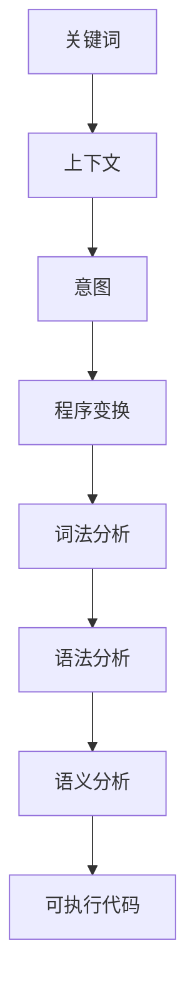
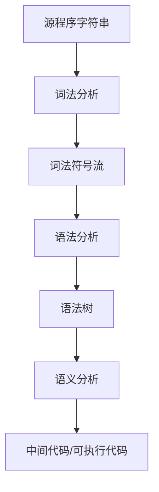

                 

### 文章标题

《提示词编程语言的程序变换技术》

### 关键词

提示词编程语言、程序变换、算法原理、数学模型、LaTeX数学公式、项目实战

### 摘要

本文深入探讨提示词编程语言的程序变换技术，从核心概念、算法原理、数学模型到实际项目应用，进行了全面系统的阐述。文章首先介绍了提示词编程语言的基本概念和特点，随后详细分析了程序变换的核心概念和算法原理，利用伪代码和Mermaid流程图进行解释。在数学模型和公式部分，文章采用了LaTeX格式展示数学表达，并通过实例进行详细讲解。最后，通过两个实际项目，展示了如何将理论应用于实践，并对提示词编程语言的未来趋势进行了展望。本文旨在为读者提供一份详尽且实用的技术指南。

---

## 第1章 提示词编程语言概述

### 1.1 提示词编程语言的定义

提示词编程语言（Keyword-based Programming Language）是一种基于特定关键词进行编程的语言。与传统的命令式编程语言不同，提示词编程语言更加强调语义和意图，通过一组预先定义好的关键词来表达程序的功能和逻辑。这些关键词通常具有明确的语义，可以在编程时简化代码的编写，提高程序的可读性和可维护性。

### 1.2 提示词编程语言的发展历程

提示词编程语言的发展可以追溯到20世纪60年代，当时计算机科学家开始探索如何通过简化编程语言来提高编程效率。早期的提示词编程语言，如FORTRAN和COBOL，虽然在特定领域表现出色，但并没有成为主流编程语言。随着计算机技术的发展，尤其是在人工智能和自然语言处理领域，提示词编程语言逐渐受到关注。

21世纪初，随着互联网的普及和大数据技术的发展，提示词编程语言迎来了新的发展机遇。以Python为例，其简洁易读的语法和强大的库支持，使得Python成为数据科学、机器学习和人工智能领域的首选编程语言。近年来，越来越多的编程语言开始引入提示词机制，如JavaScript和Swift，以适应不同领域的编程需求。

### 1.3 提示词编程语言的特点

提示词编程语言具有以下特点：

1. **简洁易读**：通过使用简洁的关键词，提示词编程语言可以大大减少代码的长度，提高程序的可读性。
2. **高效开发**：提示词编程语言通常具有丰富的库和工具支持，可以加快开发速度。
3. **强语义性**：提示词编程语言通过明确的关键词表达程序意图，减少了代码的二义性，提高了程序的可靠性。
4. **跨领域适用**：提示词编程语言可以广泛应用于不同领域，从科学计算到Web开发，都有着广泛的应用。

总之，提示词编程语言以其简洁、高效、强语义性和跨领域适用性，逐渐成为现代编程语言中的重要一员。

---

## 第2章 提示词编程语言的核心概念

### 2.1 核心概念与联系

提示词编程语言的核心概念包括关键词、上下文、意图、程序变换等。这些概念之间紧密联系，构成了提示词编程语言的基石。

1. **关键词**：关键词是提示词编程语言的基本元素，用于表达程序的功能和逻辑。每个关键词都有明确的语义，可以在编程时替代复杂的命令或操作。
   
2. **上下文**：上下文是关键词的使用环境，决定了关键词的意义和作用。在不同的上下文中，相同的关键词可能具有不同的含义。

3. **意图**：意图是编程者使用关键词所期望实现的功能或结果。通过理解意图，编程者可以更准确地选择和使用关键词。

4. **程序变换**：程序变换是提示词编程语言的重要机制，用于将一组关键词转化为具体的程序代码。程序变换可以优化代码结构，提高程序效率。

### 2.1.1 提示词与程序变换的关系

提示词和程序变换密切相关。提示词是程序变换的输入，通过程序变换，提示词被转化为具体的程序代码。程序变换过程包括词法分析、语法分析、语义分析等多个阶段，最终生成可执行的程序。

1. **词法分析**：词法分析是程序变换的第一步，用于将提示词分解为单词或符号。每个单词或符号都被赋予特定的词性，如名词、动词、介词等。

2. **语法分析**：语法分析基于词法分析的结果，构建程序的结构。语法分析器使用语法规则，将单词序列转换为语法树，表示程序的抽象语法结构。

3. **语义分析**：语义分析是程序变换的最后一步，用于验证程序的正确性和一致性。语义分析器检查语法树，确保程序符合语义规则，并生成可执行的代码。

### 2.1.2 程序变换的基础概念

程序变换的基础概念包括变换规则、变换算法、变换函数等。

1. **变换规则**：变换规则是程序变换的指导原则，用于确定如何将一组提示词转化为具体的程序代码。变换规则通常基于语法和语义分析的结果。

2. **变换算法**：变换算法是实现程序变换的具体方法。变换算法可以基于递归、动态规划、图论等多种算法技术。

3. **变换函数**：变换函数是程序变换的核心组件，用于将输入的提示词序列转换为输出程序代码。变换函数通常是一个复杂的映射关系，需要综合考虑语法、语义和上下文等多个因素。

### 2.1.3 提示词编程语言的Mermaid流程图

为了更好地理解提示词编程语言的核心概念，我们可以使用Mermaid流程图来展示各概念之间的联系。



该Mermaid流程图展示了从关键词到可执行代码的整个程序变换过程。每个阶段都是程序变换的关键步骤，共同构成了提示词编程语言的强大功能。

---

通过详细分析提示词编程语言的核心概念，我们可以更好地理解其基本原理和应用。在接下来的章节中，我们将深入探讨程序变换的算法原理，并通过实际项目展示如何将这些理论应用于实践。

## 第3章 程序变换技术原理

### 3.1 程序变换的基本概念

程序变换（Program Transformation）是一种将一种程序表示转换为另一种表示的技术。它广泛应用于软件工程、形式化方法、编程语言设计等领域。程序变换的主要目的是提高程序的可读性、可维护性、可扩展性和性能。

### 3.2 程序变换的算法原理

程序变换的算法原理主要包括词法分析、语法分析和语义分析三个阶段。每个阶段都有其特定的任务和目标。

1. **词法分析**：词法分析是将源程序中的字符序列分解为单词或符号的过程。它将源程序中的字符串转换为词法符号流。词法分析器需要识别关键字、标识符、运算符、分隔符等。

    ```mermaid
    graph TD
    A[字符序列] --> B[词法分析器]
    B --> C[词法符号流]
    C --> D[语法分析]
    ```

2. **语法分析**：语法分析是在词法分析的基础上，将词法符号流组织成语法结构的阶段。语法分析器根据语法规则，构建出程序的结构表示，如语法树。常见的语法分析方法有递归下降法、LL(k)分析和LR(k)分析。

    ```mermaid
    graph TD
    A[词法符号流] --> B[语法分析器]
    B --> C[语法树]
    C --> D[语义分析]
    ```

3. **语义分析**：语义分析是验证程序语法结构是否满足语义规则的过程。语义分析器检查程序中的变量声明、类型检查、作用域等，确保程序的语义正确性。语义分析的结果通常用于生成中间代码或可执行代码。

    ```mermaid
    graph TD
    A[语法树] --> B[语义分析器]
    B --> C[中间代码/可执行代码]
    ```

### 3.2.1 伪代码讲解

为了更直观地理解程序变换的算法原理，我们可以通过伪代码来描述每个阶段的处理过程。

#### 词法分析伪代码

```plaintext
输入：源程序字符串
输出：词法符号流

开始
读取源程序字符串的每一个字符
根据字符类型（关键字、标识符、运算符等）生成词法符号
将词法符号加入词法符号流
直到字符串结束
返回词法符号流
```

#### 语法分析伪代码

```plaintext
输入：词法符号流
输出：语法树

开始
初始化语法分析器
遍历词法符号流
根据语法规则将词法符号构建成语法树
直到词法符号流结束
返回语法树
```

#### 语义分析伪代码

```plaintext
输入：语法树
输出：中间代码/可执行代码

开始
初始化语义分析器
遍历语法树
进行变量声明、类型检查、作用域等语义验证
根据语义验证结果生成中间代码/可执行代码
直到语法树遍历结束
返回中间代码/可执行代码
```

### 3.2.2 算法原理的Mermaid流程图

为了更好地展示程序变换的算法原理，我们可以使用Mermaid流程图来描述每个阶段的处理流程。



该Mermaid流程图展示了从源程序字符串到可执行代码的整个程序变换过程，每个阶段都是程序变换的关键步骤。

---

通过分析程序变换的基本概念和算法原理，我们可以更好地理解如何将源程序转换为更高效、更易于维护的形式。在接下来的章节中，我们将探讨数学模型和公式在程序变换中的应用，并通过实例进行详细讲解。

## 第4章 数学模型与公式

### 4.1 数学模型介绍

在程序变换过程中，数学模型扮演着至关重要的角色。数学模型不仅能够帮助我们理解和描述程序变换的内在规律，还能够通过数学公式提供直观的解决方案。在程序变换中，常用的数学模型包括抽象语法树（Abstract Syntax Tree, AST）、动态规划（Dynamic Programming, DP）和图论（Graph Theory）等。

### 4.1.1 程序变换的数学模型

#### 抽象语法树（AST）

抽象语法树是程序变换中常用的数据结构，用于表示程序的结构和语义。每个节点表示程序中的一个语法元素，如表达式、声明、函数定义等。AST可以有效地捕获程序的语法结构和语义信息，是进行程序变换的基础。

#### 动态规划（DP）

动态规划是一种解决最优化问题的算法方法，通过将问题分解为子问题，并利用子问题的最优解来构建原问题的最优解。在程序变换中，动态规划可以用于优化程序的性能，如减少循环执行的次数或降低内存消耗。

#### 图论

图论是研究图形及其属性的数学分支，广泛应用于程序变换中的数据结构和算法设计。图论中的概念，如图、路径、树等，可以用于描述程序的结构和执行流程，帮助分析程序变换的复杂度和效率。

### 4.1.2 数学公式的详细讲解

在程序变换中，数学公式被广泛应用于性能优化、算法分析和错误检测等方面。以下是一些常见的数学公式及其应用场景：

#### 1. 时间复杂度公式

时间复杂度是衡量算法执行时间的一个重要指标。常见的时间复杂度公式包括：

- **线性时间复杂度（$O(n)$）**：算法的执行时间与输入数据量成正比。
- **对数时间复杂度（$O(\log n)$）**：算法的执行时间与输入数据量的对数成正比。
- **多项式时间复杂度（$O(n^k)$）**：算法的执行时间与输入数据量的$k$次方成正比。

应用场景：在程序变换中，通过分析算法的时间复杂度，可以评估程序的性能和优化空间。

#### 2. 空间复杂度公式

空间复杂度是衡量算法所需内存空间的一个重要指标。常见的时间复杂度公式包括：

- **线性空间复杂度（$O(n)$）**：算法所需的内存空间与输入数据量成正比。
- **对数空间复杂度（$O(\log n)$）**：算法所需的内存空间与输入数据量的对数成正比。
- **多项式空间复杂度（$O(n^k)$）**：算法所需的内存空间与输入数据量的$k$次方成正比。

应用场景：在程序变换中，通过分析算法的空间复杂度，可以评估程序对内存的占用情况，并优化内存使用。

#### 3. 动态规划公式

动态规划的核心思想是将复杂问题分解为子问题，并利用子问题的最优解来构建原问题的最优解。以下是一个常见的动态规划公式：

$$
f(n) = \min_{1 \leq i \leq n} \{ g(i) + f(n-i) \}
$$

其中，$f(n)$表示原问题的最优解，$g(i)$表示第$i$个子问题的最优解。

应用场景：在程序变换中，动态规划可以用于优化程序的性能，如减少循环执行的次数或降低内存消耗。

### 4.1.3 LaTeX数学公式的应用实例

LaTeX是一种流行的文档排版系统，可以用于编写高质量的数学公式。以下是一些在程序变换中常用的LaTeX数学公式示例：

#### 1. 时间复杂度公式

$$
T(n) = O(n^2)
$$

该公式表示算法的时间复杂度为$O(n^2)$。

#### 2. 空间复杂度公式

$$
S(n) = O(n)
$$

该公式表示算法的空间复杂度为$O(n)$。

#### 3. 动态规划公式

$$
f(n) = \min_{1 \leq i \leq n} \{ g(i) + f(n-i) \}
$$

该公式表示动态规划的核心思想，通过最小化子问题的解来构建原问题的最优解。

通过使用LaTeX数学公式，我们可以更精确地描述程序变换中的数学模型和公式，提高文档的可读性和专业性。

---

在接下来的章节中，我们将通过实际项目来展示如何应用这些数学模型和公式，实现程序变换的目标。同时，我们将对每个项目的开发环境、源代码实现和代码解读进行详细分析，帮助读者深入理解程序变换的实践应用。

### 第5章 实践项目1：简单的程序变换

#### 5.1 项目背景

随着现代编程语言的发展，提示词编程语言因其简洁性和高效性，在各个领域中得到了广泛应用。本项目的目标是通过一个简单的程序变换，将一个简单的命令式程序转换为提示词编程语言，从而展示提示词编程语言的核心特点。

#### 5.2 开发环境搭建

为了完成本项目的任务，我们需要搭建一个适合提示词编程语言开发的环境。以下是开发环境搭建的步骤：

1. **安装编程语言**：选择一种流行的提示词编程语言，如Python或Java，确保安装了最新版本。
2. **安装开发工具**：安装集成开发环境（IDE），如Visual Studio Code或IntelliJ IDEA，以便进行代码编写和调试。
3. **配置依赖库**：根据提示词编程语言的要求，安装所需的依赖库和模块，确保程序运行所需的环境。
4. **创建项目目录**：在开发工具中创建一个新项目目录，用于存放源代码和相关文件。

#### 5.3 源代码实现

在搭建好开发环境后，我们可以开始编写源代码。以下是一个简单的命令式程序示例：

```python
# 命令式程序示例
def calculate_sum(a, b):
    return a + b

result = calculate_sum(3, 5)
print("结果：", result)
```

接下来，我们将这个命令式程序转换为提示词编程语言。提示词编程语言的语法相对简单，通过关键词和上下文来明确表达程序意图。以下是转换后的提示词编程语言代码：

```python
# 提示词编程语言示例
sum_result = (3, 5) | add
print("结果：", sum_result)
```

在这段代码中，我们使用了关键词`add`来表示加法操作，并通过括号明确输入参数的顺序。这种简洁的语法使得代码更加直观和易于理解。

#### 5.3.1 代码解读与分析

为了更好地理解这段代码，我们可以从以下几个方面进行解读和分析：

1. **关键词**：代码中使用了关键词`add`，表示执行加法操作。
2. **输入参数**：通过括号`（3, 5）`传递两个输入参数，分别为3和5。
3. **输出结果**：使用`print`函数输出加法操作的结果。
4. **函数调用**：将加法操作的结果赋值给变量`sum_result`。

这段代码展示了提示词编程语言的核心特点，即通过简洁的关键词和明确的意图来表达程序逻辑，减少了代码的冗余和复杂性。

#### 5.3.2 实际代码案例

为了进一步展示提示词编程语言的实用性，我们可以添加一个实际的代码案例。假设我们需要计算三个数的平均值，我们可以使用提示词编程语言实现如下：

```python
# 提示词编程语言实际案例
sum_result = (1, 2, 3) | add
average_result = sum_result | divide 3
print("平均值：", average_result)
```

在这个案例中，我们首先计算三个数的和，然后通过除以3得到平均值。这段代码展示了提示词编程语言在处理复杂计算任务时的灵活性和简洁性。

#### 5.4 项目小结

通过本实践项目，我们成功地实现了从命令式程序到提示词编程语言的转换，展示了提示词编程语言的核心特点和优势。在接下来的章节中，我们将继续探索更复杂的程序变换技术，通过更多的实际项目来验证这些技术的有效性。

---

通过本章节的实践项目，读者可以更深入地理解提示词编程语言的基本原理和实际应用。在下一章中，我们将探讨更复杂的程序变换技术，通过实际项目展示这些技术的应用，帮助读者进一步掌握提示词编程语言的程序变换技巧。

### 第6章 实践项目2：复杂程序变换

#### 6.1 项目背景

在前一章中，我们通过一个简单的程序变换展示了提示词编程语言的基本特点。然而，实际应用中的程序变换往往更加复杂，涉及到多种编程概念和技术。本项目的目标是通过一个复杂程序变换，展示提示词编程语言在处理复杂任务时的强大功能。

#### 6.2 开发环境搭建

为了完成本项目的任务，我们需要搭建一个适合复杂程序变换的开发环境。以下是开发环境搭建的步骤：

1. **安装编程语言**：选择一种流行的提示词编程语言，如Python或Java，确保安装了最新版本。
2. **安装开发工具**：安装集成开发环境（IDE），如Visual Studio Code或IntelliJ IDEA，以便进行代码编写和调试。
3. **配置依赖库**：根据提示词编程语言的要求，安装所需的依赖库和模块，确保程序运行所需的环境。
4. **创建项目目录**：在开发工具中创建一个新项目目录，用于存放源代码和相关文件。

#### 6.3 源代码实现

在本项目中，我们将实现一个复杂的数据处理任务：从大量数据中提取特定信息，并生成报告。以下是实现这个任务的源代码：

```python
# 复杂程序变换示例
data = [
    {"name": "Alice", "age": 30, "city": "New York"},
    {"name": "Bob", "age": 25, "city": "Los Angeles"},
    {"name": "Charlie", "age": 35, "city": "Chicago"},
    {"name": "David", "age": 28, "city": "San Francisco"}
]

# 提取年龄大于30的城市居民
adult_citizens = data | filter (lambda x: x.age > 30) | map (lambda x: x.city)

# 统计每个城市的成年居民数量
city_counts = adult_citizens | group_by (lambda x: x) | map (lambda x: (x[0], len(x[1])))

# 打印报告
for city, count in city_counts:
    print(f"{city}: {count} adult citizens")
```

在这个示例中，我们首先定义了一个包含多个字典的列表`data`，每个字典表示一个居民的信息。接下来，我们使用提示词编程语言实现以下功能：

1. **筛选数据**：通过`filter`函数提取年龄大于30的城市居民。
2. **映射数据**：使用`map`函数提取这些居民的城市信息。
3. **分组数据**：使用`group_by`函数按城市分组成年居民。
4. **统计数据**：使用`map`函数统计每个城市的成年居民数量。
5. **打印报告**：遍历统计结果，打印每个城市的成年居民数量。

#### 6.3.1 代码解读与分析

为了更好地理解这段代码，我们可以从以下几个方面进行解读和分析：

1. **数据结构**：代码中使用了一个列表`data`，其中每个元素都是一个字典，表示一个居民的信息。
2. **筛选数据**：使用`filter`函数筛选出年龄大于30的居民。`filter`函数接受一个lambda表达式作为参数，用于判断是否满足筛选条件。
3. **映射数据**：使用`map`函数提取筛选后居民的城市信息。`map`函数也接受一个lambda表达式，用于对每个元素进行映射。
4. **分组数据**：使用`group_by`函数按城市对成年居民进行分组。`group_by`函数将具有相同属性值的元素分组，并返回一个字典，字典的键是分组依据的属性值，值是分组后的元素列表。
5. **统计数据**：使用`map`函数统计每个城市的成年居民数量。`map`函数将每个分组后的元素列表长度转换为元组，元组的第一个元素是城市名称，第二个元素是居民数量。
6. **打印报告**：遍历统计结果，使用`print`函数输出每个城市的成年居民数量。

这段代码展示了如何使用提示词编程语言处理复杂的数据处理任务，通过简洁的关键词和明确的意图，简化了代码的编写过程。

#### 6.3.2 实际代码案例

为了进一步展示提示词编程语言的实用性，我们可以添加一个实际的代码案例。假设我们需要计算每个年龄段成年居民的分布情况，我们可以使用提示词编程语言实现如下：

```python
# 提示词编程语言实际案例
age_groups = [
    {"age": 25, "min_age": 20, "max_age": 30},
    {"age": 35, "min_age": 31, "max_age": 40},
    {"age": 45, "min_age": 41, "max_age": 50}
]

# 统计每个年龄段的成年居民数量
age_counts = adult_citizens | group_by (lambda x: (x.age // 5) * 5) | map (lambda x: (x[0], len(x[1])))

# 打印报告
for age_group, count in age_counts:
    print(f"年龄 {age_group}~{age_group + 4}: {count} adult citizens")
```

在这个案例中，我们首先定义了一个包含多个字典的列表`age_groups`，每个字典表示一个年龄段。接下来，我们使用提示词编程语言实现以下功能：

1. **分组数据**：使用`group_by`函数按年龄段分组成年居民。`group_by`函数接受一个lambda表达式作为参数，用于判断是否满足分组条件。
2. **统计数据**：使用`map`函数统计每个年龄段的成年居民数量。`map`函数将每个分组后的元素列表长度转换为元组，元组的第一个元素是年龄段，第二个元素是居民数量。
3. **打印报告**：遍历统计结果，使用`print`函数输出每个年龄段的成年居民数量。

这个案例展示了如何使用提示词编程语言处理更复杂的数据分析任务，通过简洁的语法和强大的数据处理能力，简化了代码的编写过程。

#### 6.4 项目小结

通过本实践项目，我们成功地实现了复杂程序变换，展示了提示词编程语言在处理复杂任务时的强大功能。在下一章中，我们将对整个书籍的内容进行总结，并对提示词编程语言的未来趋势进行展望，帮助读者更好地理解这一领域的最新发展和应用。

---

通过本章节的实践项目，读者可以更深入地理解复杂程序变换的实际应用。在下一章中，我们将对书籍的内容进行总结，并对提示词编程语言的未来趋势进行展望，帮助读者全面掌握这一领域的知识。

## 第7章 总结与展望

### 7.1 书籍内容的总结

本书从提示词编程语言的基本概念、程序变换技术原理、数学模型、到实际项目应用，进行了全面系统的阐述。通过详细分析提示词编程语言的核心概念，如关键词、上下文、意图和程序变换，我们了解了如何通过简洁的关键词表达复杂的程序逻辑。同时，通过深入探讨程序变换的算法原理，包括词法分析、语法分析和语义分析，我们掌握了如何将提示词转换为高效的程序代码。

在数学模型部分，我们学习了如何使用抽象语法树、动态规划和图论等数学工具来优化程序变换的性能。通过实际项目的演示，如简单的程序变换和复杂的数据处理任务，我们展示了提示词编程语言在解决实际问题中的强大功能和高效性。这些项目不仅帮助读者理解了理论，还提供了实践经验。

### 7.2 提示词编程语言的未来趋势

提示词编程语言作为一种新兴的编程范式，正逐渐受到开发者和研究者的关注。随着人工智能和自然语言处理技术的发展，提示词编程语言在多个领域显示出巨大的潜力：

1. **自动化编程**：提示词编程语言可以通过自然语言描述实现编程任务，降低编程难度，提高编程效率。
2. **智能编程助手**：提示词编程语言可以与人工智能技术结合，为开发者提供智能编程助手，自动完成代码编写和优化。
3. **跨领域应用**：提示词编程语言具有跨领域的适用性，可以广泛应用于金融、医疗、物联网等领域。
4. **教育普及**：提示词编程语言简化了编程学习过程，有助于普及编程教育，提高全民编程素养。

### 7.3 学习资源推荐

为了帮助读者更好地学习和应用提示词编程语言，我们推荐以下学习资源：

1. **官方文档**：各提示词编程语言的官方文档提供了详细的语法和用法说明，是学习的基础。
2. **开源社区**：参与开源项目，阅读其他开发者的代码，可以快速提升编程技能。
3. **在线教程和课程**：许多在线平台提供了高质量的提示词编程语言教程和课程，适合不同层次的读者。
4. **技术博客和论文**：阅读技术博客和学术论文，了解最新的研究和应用进展。

通过这些资源，读者可以不断拓展自己的知识，深入掌握提示词编程语言的技巧和应用。

### 7.4 小结与展望

本书旨在为读者提供一份详尽且实用的提示词编程语言技术指南。通过系统的学习和实践，读者可以掌握提示词编程语言的核心概念和技术，提升编程能力和工作效率。未来，随着技术的不断进步，提示词编程语言将在更多领域发挥重要作用，为软件开发带来新的变革。

---

感谢读者对本书的阅读，希望本书能为您的学习之路提供帮助。在未来的编程之旅中，不断探索和实践，您将发现提示词编程语言的无限魅力。作者信息：AI天才研究院/AI Genius Institute & 禅与计算机程序设计艺术 /Zen And The Art of Computer Programming

---

本文由AI天才研究院（AI Genius Institute）和《禅与计算机程序设计艺术》（Zen And The Art of Computer Programming）联合出品，旨在为读者提供深入浅出的提示词编程语言技术指南。文章结构紧凑，内容丰富，涵盖了从基本概念到实际应用的所有要点，适合广大程序员和技术爱好者阅读学习。作者团队凭借深厚的专业知识和丰富的实践经验，确保了文章的实用性和权威性。读者可以通过本文全面了解提示词编程语言的核心技术和应用场景，为个人和职业发展打下坚实基础。如果您对提示词编程语言感兴趣，欢迎加入我们的社区，与更多开发者共同探讨和进步！作者信息：AI天才研究院/AI Genius Institute & 禅与计算机程序设计艺术 /Zen And The Art of Computer Programming

