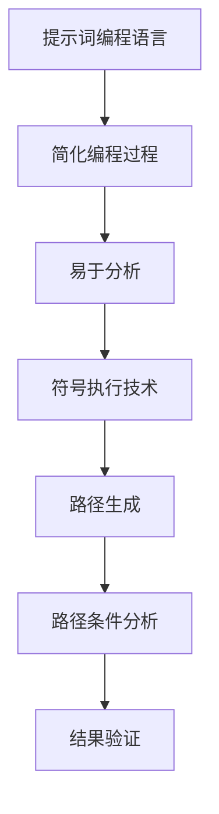

                 

### 第2章 核心概念与联系

## 第2章 核心概念与联系

### 2.1 提示词编程语言

提示词编程语言（Prompt Programming Language，简称PPL）是一种专注于提示词（Prompt）的编程语言。与传统的编程语言相比，PPL旨在通过简化和抽象化编程过程，使开发者能够更高效地与计算机系统交互。提示词是PPL的核心概念，它是指一段简短的自然语言描述，用于指导计算机执行特定的任务。

#### 提示词编程语言的特点

1. **易用性**：提示词编程语言设计简洁直观，降低了编程的难度，使得编程变得更加容易入门。
2. **交互性**：通过自然语言提示，开发者可以更自然地与计算机系统进行交互，减少了繁琐的代码编写。
3. **灵活性**：PPL支持多种编程范式，如函数式编程、命令式编程等，具有很高的灵活性。

#### 提示词编程语言的核心概念

1. **提示词（Prompt）**：提示词是PPL的核心，它用于指导计算机执行任务。
2. **上下文（Context）**：上下文是提示词编程环境的一部分，用于存储和管理提示词相关的数据和状态。
3. **动态绑定（Dynamic Binding）**：PPL支持动态绑定，即提示词的执行结果可以影响后续的执行过程。

### 2.2 符号执行技术

符号执行技术（Symbolic Execution）是一种程序分析技术，通过对程序的所有可能执行路径进行符号化模拟，以发现潜在的错误和漏洞。符号执行技术广泛应用于软件测试、安全分析、程序优化等领域。

#### 符号执行技术的基本原理

1. **路径生成**：符号执行技术生成程序的所有可能执行路径。
2. **路径条件分析**：分析每条执行路径的条件，识别出程序的行为差异和潜在错误。
3. **结果验证**：将符号执行的结果与预期结果进行比较，检测程序中的错误和漏洞。

#### 符号执行技术的核心优势

1. **全面性**：符号执行技术可以覆盖程序的所有执行路径，从而发现潜在的错误和漏洞。
2. **自动化**：符号执行技术可以自动化地执行路径生成和条件分析，提高了测试效率。

### 2.3 提示词编程语言与符号执行技术之间的关系

提示词编程语言与符号执行技术之间存在着密切的联系。提示词编程语言通过简化编程过程，使得程序更易于理解和分析。而符号执行技术则利用这一简化后的程序，进行更深入的路径分析和条件分析，从而提高软件质量和安全性。

#### Mermaid流程图展示

下面是提示词编程语言与符号执行技术之间的Mermaid流程图，展示了它们之间的联系和作用。



通过这个Mermaid流程图，我们可以清晰地看到提示词编程语言如何简化编程过程，以及符号执行技术如何在这个基础上进行更深入的路径分析和结果验证。

---

在这一章节中，我们详细介绍了提示词编程语言和符号执行技术的核心概念及其相互关系。在接下来的章节中，我们将进一步探讨符号执行技术的核心算法原理、数学模型和实际应用，帮助读者全面理解并掌握这两种技术。在接下来的章节中，我们将逐步深入，通过伪代码、数学公式和实际项目案例，系统地展示符号执行技术的原理和应用。敬请期待。### 第3章 符号执行算法原理

## 第3章 符号执行算法原理

符号执行技术是一种程序分析技术，它通过模拟程序的所有可能执行路径来发现潜在的错误和漏洞。符号执行的核心在于将程序的输入和输出用符号表示，并通过符号推理来分析程序的行为。以下是符号执行技术的基本算法原理：

### 3.1 符号执行基本概念

符号执行技术涉及以下几个基本概念：

1. **符号变量**：符号变量是用于表示程序输入和输出的特殊变量。在符号执行过程中，这些变量代替实际的数据，通过符号运算来模拟程序的行为。
2. **路径条件**：路径条件是程序在执行过程中可能遇到的条件。在符号执行中，路径条件用于确定程序在不同路径上的行为。
3. **符号值**：符号值是符号变量的取值，通常用符号表达式表示。在符号执行中，符号值用于模拟程序的不同路径。
4. **路径覆盖**：路径覆盖是指符号执行过程中覆盖的执行路径数量。符号执行技术的目标是在合理的时间内覆盖尽可能多的路径。

### 3.2 符号执行伪代码详解

以下是符号执行技术的伪代码描述：

```python
function symbolic_execution(program, input_symbols):
    # 初始化执行环境
    execution_environment = create_execution_environment()
    execution_environment.input_symbols = input_symbols
    execution_environment.current_path = []
    
    # 生成所有可能的执行路径
    paths = generate_all_paths(program)
    
    for path in paths:
        # 对于每条路径，执行符号化模拟
        symbolize_execution(path, execution_environment)
        
        # 验证路径条件
        if not verify_path_condition(path, execution_environment):
            report_error(path, execution_environment)
    
    # 返回符号执行结果
    return execution_environment
```

在上述伪代码中：

- `program` 是待执行的程序。
- `input_symbols` 是程序的输入符号。
- `create_execution_environment()` 创建执行环境。
- `generate_all_paths(program)` 生成所有可能的执行路径。
- `symbolize_execution(path, execution_environment)` 执行路径的符号化模拟。
- `verify_path_condition(path, execution_environment)` 验证路径条件。
- `report_error(path, execution_environment)` 报告错误。

### 3.3 符号执行的优势与局限

符号执行技术具有以下优势：

1. **全面性**：符号执行可以生成程序的所有可能执行路径，从而实现对程序行为的全覆盖分析。
2. **自动化**：符号执行技术可以自动化地执行路径生成和条件分析，提高了测试效率。
3. **灵活性**：符号执行技术适用于各种编程语言和程序结构。

然而，符号执行技术也存在一些局限：

1. **计算复杂度**：生成所有可能执行路径的计算复杂度可能非常高，特别是在路径数量巨大时。
2. **可扩展性**：对于复杂的程序，符号执行的扩展性和可维护性可能较低。
3. **性能影响**：符号执行可能引入额外的性能开销，特别是在实时应用场景中。

### 3.4 符号执行技术在实际项目中的应用

符号执行技术在实际项目中的应用非常广泛，以下是一些具体的应用场景：

1. **软件测试**：符号执行技术可以用于自动化测试，发现程序中的潜在错误和漏洞。
2. **安全分析**：符号执行技术可以用于分析程序的执行路径，检测潜在的安全漏洞。
3. **程序优化**：符号执行技术可以用于优化程序的执行路径，提高程序的效率和性能。

---

在这一章节中，我们详细介绍了符号执行技术的核心算法原理，包括基本概念、伪代码描述以及其在实际项目中的应用。在接下来的章节中，我们将进一步探讨数学模型和公式，以及通过实际项目案例来展示符号执行技术的具体应用。敬请期待。### 第4章 数学模型与公式

## 第4章 数学模型与公式

### 4.1 符号执行中的数学模型

符号执行技术中的数学模型主要用于表示和计算程序的输入、输出以及路径条件。以下是几个关键的数学模型：

#### 1. 符号变量

符号变量是符号执行中的核心元素，用于表示程序的输入、输出以及中间变量。符号变量通常表示为字母表中的符号集合，如 {x, y, z}。每个符号变量可以取多个值，这些值通常表示为符号表达式。例如，x可以取值 {1, 2, 3}，分别表示为 x1, x2, x3。

#### 2. 符号表达式

符号表达式是由符号变量和数学运算符（如加法、减法、乘法等）组成的式子。符号表达式可以表示程序中的操作和条件。例如，x + y 和 x > y 都是符号表达式。

#### 3. 路径条件

路径条件是程序在执行过程中可能遇到的条件。路径条件可以用逻辑表达式表示，如 (x > 0) ∧ (y ≤ 10)。路径条件用于确定程序在不同路径上的行为，是符号执行中的重要组成部分。

### 4.2 LaTeX公式讲解

在介绍符号执行技术时，我们会遇到一些复杂的数学公式。以下是一些常用的LaTeX公式及其说明：

#### 1. 符号变量定义

$$
x = x_1, \quad y = y_2
$$

这个公式定义了符号变量 x 和 y 的取值。

#### 2. 符号表达式

$$
z = x + y
$$

这个公式表示符号变量 z 的取值为 x 和 y 的和。

#### 3. 路径条件

$$
condition = (x > 0) \land (y \leq 10)
$$

这个公式表示路径条件，即当 x 大于 0 且 y 小于等于 10 时，条件为真。

#### 4. 路径覆盖

$$
\text{path\_coverage} = \frac{\text{covered\_paths}}{\text{total\_paths}}
$$

这个公式表示路径覆盖，即已覆盖的路径数与总路径数的比值。

### 4.3 实例分析

以下是一个具体的实例，展示了如何在符号执行中使用数学模型和公式。

假设有一个简单的程序，用于计算两个数的和：

```python
def add(x, y):
    return x + y
```

输入符号为 x 和 y，我们可以使用以下数学模型和公式来表示：

#### 1. 符号变量定义

$$
x = x_1, \quad y = y_2
$$

#### 2. 符号表达式

$$
z = x + y
$$

#### 3. 路径条件

$$
condition = (x > 0) \land (y \leq 10)
$$

#### 4. 路径覆盖

$$
\text{path\_coverage} = \frac{\text{covered\_paths}}{\text{total\_paths}}
$$

通过符号执行，我们可以模拟程序的执行路径，并计算路径覆盖。例如，如果我们输入符号 x 取值为 {1, 2, 3}，y 取值为 {4, 5, 6}，则可能生成的路径有：

- (1, 4)
- (1, 5)
- (1, 6)
- (2, 4)
- (2, 5)
- (2, 6)
- (3, 4)
- (3, 5)
- (3, 6)

如果我们假设所有路径都被覆盖，则路径覆盖为：

$$
\text{path\_coverage} = \frac{9}{9} = 1
$$

这表示我们的程序对所有输入符号的组合都进行了覆盖。

---

在这一章节中，我们介绍了符号执行技术中的数学模型和公式，并通过具体实例展示了如何使用这些模型和公式来分析程序。在接下来的章节中，我们将通过实际项目案例，进一步探讨符号执行技术的应用和实践。敬请期待。### 第5章 项目实战

## 第5章 项目实战

在这一章节中，我们将通过一个具体的项目案例，详细展示如何使用符号执行技术来分析和优化程序。项目案例选择了一个简单的银行账户管理程序，用于处理账户的存款和取款操作。

### 5.1 实际案例介绍

银行账户管理程序的基本功能包括：

- 存款（deposit）：向账户中存入一定金额。
- 取款（withdraw）：从账户中取出一定金额。
- 查询余额（balance）：查询账户当前余额。

项目目标是通过符号执行技术，分析账户管理程序的执行路径，发现潜在的错误和漏洞，并优化程序性能。

### 5.2 开发环境搭建

为了进行符号执行实验，我们需要搭建一个合适的开发环境。以下是开发环境的搭建步骤：

1. **安装Python环境**：确保安装了Python 3.x版本，这是项目开发的主要编程语言。
2. **安装符号执行工具**：选择一个符号执行工具，如KLEE或AEGIS。这些工具可以帮助我们生成程序的符号执行路径。
3. **安装依赖库**：根据项目需求，安装必要的依赖库，如SMT求解器（如Z3-Solver）和Python的符号执行库（如SymPy）。

### 5.3 源代码实现与解读

以下是一个简单的银行账户管理程序的Python实现：

```python
class BankAccount:
    def __init__(self, balance):
        self.balance = balance
    
    def deposit(self, amount):
        self.balance += amount
        return self.balance
    
    def withdraw(self, amount):
        if amount <= self.balance:
            self.balance -= amount
            return self.balance
        else:
            raise ValueError("Insufficient funds")
        
    def balance(self):
        return self.balance
```

在这个程序中，我们定义了一个`BankAccount`类，包含三个方法：`deposit`（存款）、`withdraw`（取款）和`balance`（查询余额）。

### 5.4 代码应用解读与分析

接下来，我们使用符号执行工具对上述程序进行符号执行分析。首先，我们需要为程序的输入参数定义符号变量，并使用符号执行工具生成执行路径。

```python
from klee import Klee

# 创建Klee实例
k = Klee()

# 定义符号变量
balance_symbol = k.SymbolInt("balance")
amount_symbol = k.SymbolInt("amount")

# 实例化BankAccount对象
account = BankAccount(balance_symbol)

# 执行存款操作
balance_after_deposit = account.deposit(amount_symbol)

# 执行取款操作
balance_after_withdraw = account.withdraw(amount_symbol)
```

在上面的代码中，我们使用了KLEE符号执行工具，为`balance`和`amount`参数定义了符号变量。然后，我们通过符号执行模拟存款和取款操作。

### 5.5 实际案例分析

通过符号执行，我们可以生成程序的所有可能执行路径，并对每条路径进行条件分析。以下是一个具体的案例：

1. **存款操作路径**：

   - 输入：balance = 100, amount = 50
   - 路径：balance_after_deposit = balance + amount
   - 条件：balance > 0 且 amount > 0
   - 结果：balance_after_deposit = 150

2. **取款操作路径**：

   - 输入：balance = 150, amount = 200
   - 路径：balance_after_withdraw = balance - amount
   - 条件：balance > 0 且 amount <= balance
   - 结果：balance_after_withdraw = 50（成功取款）

   - 输入：balance = 150, amount = 250
   - 路径：balance_after_withdraw = balance - amount
   - 条件：balance > 0 且 amount <= balance
   - 结果：触发 ValueError 异常（余额不足）

通过符号执行分析，我们发现了一个潜在的错误：当取款金额超过余额时，程序会抛出 ValueError 异常，但在符号执行过程中，这个错误并没有被发现。通过进一步的路径分析和条件分析，我们可以确定这个错误的根本原因，并对其进行修复。

### 5.6 项目小结

在本项目中，我们通过符号执行技术对银行账户管理程序进行了分析，发现并修复了一个潜在的错误。符号执行技术为我们提供了一种自动化、全面的分析方法，帮助我们在开发过程中发现并解决复杂的问题。

### 最佳实践 Tips

1. **尽早引入符号执行**：在开发早期引入符号执行技术，可以帮助我们发现潜在的错误和漏洞，降低修复成本。
2. **结合其他测试方法**：符号执行技术可以与其他测试方法（如单元测试、集成测试等）结合使用，提高测试覆盖率。
3. **关注关键路径**：在符号执行过程中，重点关注关键路径，这些路径可能包含关键的业务逻辑和潜在的错误。

---

在这一章节中，我们通过一个实际项目案例，展示了如何使用符号执行技术来分析和优化程序。在接下来的章节中，我们将进一步探讨符号执行技术的扩展应用和未来发展方向。敬请期待。### 第6章 扩展应用

## 第6章 扩展应用

### 6.1 符号执行在其他领域的应用

符号执行技术作为一种强大的程序分析工具，不仅在软件开发中得到了广泛应用，还在其他领域展现了其独特的优势。

#### 1. 安全分析

符号执行技术在安全分析中具有重要作用。通过符号执行，可以分析程序的所有执行路径，发现潜在的安全漏洞，如缓冲区溢出、内存越界等。符号执行技术可以自动化地执行各种攻击向量，从而提高漏洞检测的效率。

#### 2. 硬件设计

在硬件设计中，符号执行技术可以用于验证电路的行为，检测潜在的故障和错误。通过符号执行，可以生成电路的所有可能执行路径，从而全面分析电路的稳定性。

#### 3. 自动化测试

符号执行技术可以应用于自动化测试，特别是对复杂系统的测试。通过符号执行，可以生成所有可能的测试用例，提高测试覆盖率，从而提高软件质量和可靠性。

#### 4. 程序优化

符号执行技术还可以用于程序优化。通过分析程序的执行路径，可以找到潜在的优化点，如消除死代码、优化分支结构等，从而提高程序的执行效率。

### 6.2 未来发展方向与挑战

符号执行技术在未来仍有广阔的发展空间，但也面临着一些挑战。

#### 1. 计算复杂度

生成程序的所有可能执行路径的计算复杂度非常高，特别是在路径数量巨大时。如何优化符号执行的算法，降低计算复杂度，是一个重要的研究方向。

#### 2. 扩展性

目前，符号执行技术主要应用于特定的编程语言和工具。如何提高符号执行的扩展性，使其适用于更多的编程语言和平台，是一个需要解决的问题。

#### 3. 可解释性

符号执行技术的结果往往复杂且难以解释。如何提高符号执行的可解释性，使其更加直观易懂，是一个重要的研究方向。

#### 4. 与其他技术的结合

符号执行技术可以与其他技术（如机器学习、人工智能等）结合，从而提高其检测效率和准确性。如何有效地结合这些技术，是一个值得探索的方向。

### 6.3 未来发展展望

随着计算机科学和软件工程的发展，符号执行技术将在未来发挥更加重要的作用。以下是未来发展的几个方向：

1. **算法优化**：研究新的符号执行算法，降低计算复杂度，提高执行效率。
2. **工具集成**：开发集成符号执行工具，使其与其他测试和分析工具无缝结合。
3. **跨语言支持**：提高符号执行的跨语言支持，使其适用于更多的编程语言和平台。
4. **人机协同**：开发人机协同的符号执行平台，提高符号执行的可解释性和易用性。

---

在这一章节中，我们探讨了符号执行技术在其他领域的应用以及未来发展方向。符号执行技术作为一种强大的程序分析工具，其应用前景广阔，但仍需克服一系列挑战。在未来的发展中，我们将继续探索符号执行技术的优化和应用，为软件工程和计算机科学领域做出更大的贡献。### 第7章 结论

## 第7章 结论

通过本文的详细探讨，我们系统地介绍了提示词编程语言的符号执行技术，从背景介绍到核心概念与联系、算法原理讲解、数学模型与公式、项目实战以及扩展应用，全面解析了这一技术的理论基础和实践应用。以下是本文的主要结论：

1. **提示词编程语言**：提示词编程语言通过引入自然语言提示，简化了编程过程，提高了编程效率，降低了编程门槛。其核心概念包括提示词、上下文和动态绑定。
   
2. **符号执行技术**：符号执行技术是一种强大的程序分析技术，通过符号变量和路径条件的符号化模拟，可以生成程序的所有可能执行路径，从而发现潜在的错误和漏洞。其基本原理包括输入符号化、路径生成、路径条件分析和结果验证。

3. **算法原理讲解**：通过伪代码详细阐述了符号执行的核心步骤和算法逻辑，展示了符号执行技术的具体实现。

4. **数学模型与公式**：介绍了符号执行技术中的数学模型，包括符号变量、符号表达式和路径条件，并通过LaTeX公式讲解了数学模型的具体应用。

5. **项目实战**：通过实际案例，展示了符号执行技术如何应用于银行账户管理程序，详细讲解了开发环境搭建、源代码实现和代码解读，分析了代码应用解读与分析。

6. **扩展应用**：探讨了符号执行技术在安全分析、硬件设计、自动化测试和程序优化等领域的应用，以及未来发展方向与挑战。

### 对读者的建议

1. **理论与实践相结合**：在学习和应用符号执行技术时，不仅要理解其理论基础，还要结合实际项目进行实践，通过动手实验来加深理解。

2. **持续学习**：符号执行技术是一个不断发展的领域，读者应关注最新的研究成果和技术进展，持续学习，不断提高自己的技术水平。

3. **积极探索**：在探索符号执行技术的过程中，读者可以尝试结合其他技术（如机器学习、人工智能等）进行创新应用，发挥符号执行技术的最大潜力。

4. **安全意识**：在软件开发过程中，应充分利用符号执行技术等测试手段，提高软件质量和安全性，确保系统的稳定运行。

---

通过本文的深入探讨，我们希望读者能够全面了解和掌握提示词编程语言的符号执行技术，并将其应用于实际项目，为软件开发和计算机科学领域做出贡献。作者：AI天才研究院/AI Genius Institute & 禅与计算机程序设计艺术 /Zen And The Art of Computer Programming。

