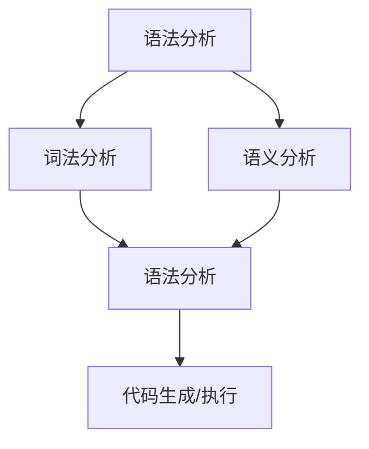

                 

### 文章标题

### 《提示词编程语言的符号计算能力》

> **关键词**：提示词编程语言、符号计算、形式化验证、算法、人工智能

> **摘要**：本文旨在探讨提示词编程语言的符号计算能力，分析其核心特性、基本概念、实现原理及应用场景。通过对符号计算算法的讲解，结合实际项目实战，评估提示词编程语言在符号计算领域的表现。文章最后探讨了提示词编程语言的未来发展趋势及其在人工智能中的应用前景。

### 目录大纲

1. **提示词编程语言概述**

   1.1 提示词编程语言的定义与历史背景

   1.2 提示词编程语言的核心特性

   1.3 主流提示词编程语言简介

2. **符号计算基本概念**

   2.1 符号计算概述

   2.2 符号计算的基本原理

   2.3 符号计算的应用场景

3. **提示词编程语言的语法与语义**

   3.1 提示词编程语言的语法

   3.2 提示词编程语言的语义

   3.3 提示词编程语言的实现

4. **符号计算算法原理讲解**

   4.1 符号微分算法

   4.2 符号积分算法

   4.3 符号计算算法的应用

5. **提示词编程语言项目实战**

   5.1 项目背景与需求分析

   5.2 项目环境搭建

   5.3 源代码详细实现

   5.4 代码解读与分析

6. **提示词编程语言的未来发展趋势**

   6.1 符号计算技术的发展趋势

   6.2 提示词编程语言的发展趋势

   6.3 提示词编程语言在人工智能中的角色

7. **提示词编程语言的符号计算能力评估**

   7.1 符号计算能力的评价指标

   7.2 符号计算能力的评估方法

   7.3 提示词编程语言的符号计算能力分析

### 1. 提示词编程语言概述

#### 1.1 提示词编程语言的定义与历史背景

提示词编程语言（Keyword Programming Languages）是一种以符号计算和形式化验证为核心特征的编程语言。它们强调程序的可理解性、可验证性和可维护性，旨在提高软件开发的质量和效率。

提示词编程语言的历史可以追溯到20世纪60年代。当时，数学家和计算机科学家开始探讨如何将数学理论应用于计算机编程。最早的提示词编程语言之一是**LISP**，它在1958年被发明，用于符号处理和数学计算。随后，一系列基于逻辑和代数的编程语言相继出现，如**Prolog**（1972年）、**Haskell**（1990年）等。

提示词编程语言的发展过程经历了几个重要的阶段：

- **早期阶段**：以符号处理和逻辑编程为主，如LISP和Prolog。
- **发展阶段**：引入类型系统和面向对象特性，如Haskell和ML。
- **成熟阶段**：结合形式化验证和编译技术，如Coq和Agda。

#### 1.2 提示词编程语言的核心特性

提示词编程语言的核心特性包括：

- **符号计算**：支持符号运算和推理，如代数运算、逻辑推理和证明。
- **语义解析**：具有严格的语义定义，便于程序验证和形式化验证。
- **动态类型系统**：支持类型推断和类型检查，提高程序的可靠性。
- **代码生成**：能够将高阶逻辑表达式编译成高效的机器代码。

#### 1.3 提示词编程语言的重要性

提示词编程语言的重要性在于：

- **提高软件开发质量**：通过形式化验证和严格语义，降低程序出错率。
- **促进形式化方法应用**：为形式化验证、自动推理和形式化证明提供强有力的工具。
- **增强程序可维护性**：代码易于理解和验证，提高代码的可维护性。
- **拓展编程范式**：引入新的编程范式和抽象机制，促进编程语言的发展。

### 1.3 主流提示词编程语言简介

目前，主流的提示词编程语言包括Haskell、Agda、Coq和Lean等。以下是这些语言的基本介绍：

- **Haskell**：一种纯函数式编程语言，支持类型推断和惰性计算，广泛应用于并发编程和并行计算。
- **Agda**：一种依赖于类型的纯函数式编程语言，强调形式的证明和验证。
- **Coq**：一种交互式证明助手，用于形式化验证和数学证明。
- **Lean**：一种依赖于类型的纯函数式编程语言，强调证明自动化的实现和高效性。

这些语言在符号计算和形式化验证领域都有着广泛的应用，各自具有独特的特点和优势。

### 总结

提示词编程语言是一种以符号计算和形式化验证为核心的编程语言，具有严格的语义定义和丰富的抽象机制。它们在提高软件开发质量、促进形式化方法应用和拓展编程范式方面具有重要意义。接下来，我们将深入探讨符号计算的基本概念和原理，为后续内容打下基础。

### 2. 符号计算基本概念

#### 2.1 符号计算概述

符号计算（Symbolic Computation）是指使用符号（如变量、函数、逻辑表达式等）进行数学运算和推理的过程。符号计算与数值计算（Numeric Computation）有显著区别，后者主要处理数值数据，而符号计算关注的是符号的表达和处理。

符号计算具有以下作用：

- **自动化推理**：能够自动推导出数学公式、逻辑推理和证明。
- **算法验证**：用于验证算法的正确性和性能。
- **数学公式求解**：可以求解复杂的数学问题，如非线性方程、多变量函数的最值等。
- **计算机辅助证明**：为数学和逻辑问题提供形式化的证明方法。

符号计算在计算机科学、数学、工程和物理等领域有着广泛的应用。例如，在算法设计中，符号计算可以用于验证算法的正确性和优化算法的性能；在数学领域，符号计算可以帮助解决复杂的数学问题；在工程领域，符号计算可以用于优化设计、模拟和分析。

#### 2.2 符号计算的基本原理

符号计算的基本原理包括以下几个方面：

- **代数基本运算**：代数基本运算包括加法、减法、乘法和除法等。符号计算通过符号变量和运算符的组合，实现符号表达式的计算。

  - **加法**：对于两个符号表达式 \(a + b\)，可以使用合并同类项的方法进行计算。例如，对于表达式 \(x + 2x\)，可以合并同类项得到 \(3x\)。

  - **减法**：减法运算可以通过加法运算来实现。例如，对于表达式 \(a - b\)，可以将其转换为 \(a + (-b)\) 进行计算。

  - **乘法**：乘法运算可以通过分配律和结合律进行计算。例如，对于表达式 \((a + b) \cdot c\)，可以将其转换为 \(a \cdot c + b \cdot c\) 进行计算。

  - **除法**：除法运算可以通过乘法运算来实现。例如，对于表达式 \(\frac{a}{b}\)，可以将其转换为 \(a \cdot \frac{1}{b}\) 进行计算。

- **逻辑运算**：逻辑运算包括逻辑与、逻辑或和逻辑非等。符号计算通过逻辑运算符和逻辑表达式，实现逻辑推理和证明。

  - **逻辑与**：对于两个逻辑表达式 \(p \land q\)，如果 \(p\) 和 \(q\) 都为真，则结果为真；否则，结果为假。

  - **逻辑或**：对于两个逻辑表达式 \(p \lor q\)，如果 \(p\) 或 \(q\) 中至少有一个为真，则结果为真；否则，结果为假。

  - **逻辑非**：对于逻辑表达式 \(p\)，逻辑非运算将 \(p\) 的真值取反。

- **递归与递推**：递归和递推是符号计算中的重要概念。递归是指函数调用自身，而递推是指通过迭代的方式不断计算。

  - **递归**：例如，计算斐波那契数列的递归表达式为 \(F(n) = F(n-1) + F(n-2)\)，其中 \(F(0) = 0\)，\(F(1) = 1\)。

  - **递推**：例如，计算欧拉函数的递推表达式为 \(\phi(n) = n \cdot \prod_{p \mid n} \left(1 - \frac{1}{p}\right)\)，其中 \(p\) 是素数。

- **符号推理与证明**：符号推理与证明是指通过符号运算和逻辑推理，推导出数学公式或证明一个命题。

  - **符号推理**：例如，通过代数运算和逻辑推理，可以推导出 \(a^2 + b^2 = (a + b)(a - b)\)。

  - **符号证明**：例如，通过数学归纳法，可以证明 \(1 + 2 + \ldots + n = \frac{n(n+1)}{2}\)。

#### 2.3 符号计算的应用场景

符号计算在多个领域有着广泛的应用，以下是一些典型的应用场景：

- **算法验证**：符号计算可以用于验证算法的正确性和性能。通过形式化的符号计算，可以证明算法在所有情况下都满足预期的性质。

- **自动推理**：符号计算可以用于自动推理，即自动推导出数学公式或证明。自动推理在数学、计算机科学和人工智能等领域有着广泛的应用。

- **编译器优化**：符号计算可以用于编译器优化，例如，通过符号计算可以优化代码的执行效率和存储空间。

- **形式化验证**：符号计算可以用于形式化验证，即通过形式化的方法验证程序的正确性和安全性。形式化验证在嵌入式系统、网络安全和软件工程等领域具有重要意义。

- **科学计算**：符号计算可以用于科学计算，例如，求解复杂的数学问题、模拟和分析物理现象等。

- **工程优化**：符号计算可以用于工程优化，例如，优化机械结构、电路设计等。

- **人工智能**：符号计算可以用于人工智能，例如，用于知识表示、推理和规划等任务。

#### 2.3.1 符号计算在算法验证中的应用

符号计算在算法验证中的应用主要包括以下几个方面：

- **算法正确性验证**：通过符号计算，可以证明算法在所有输入情况下都满足预期的性质。例如，可以证明排序算法在所有输入情况下都能正确排序。

- **算法性能分析**：通过符号计算，可以分析算法的时间和空间复杂度。例如，可以证明一个排序算法的时间复杂度为 \(O(n \log n)\)。

- **算法优化**：通过符号计算，可以优化算法的执行效率和存储空间。例如，可以通过符号计算找到更高效的排序算法。

- **算法安全性验证**：通过符号计算，可以证明算法在面临恶意攻击时的安全性。例如，可以证明一个加密算法在面对密码分析时的安全性。

符号计算在算法验证中的应用，有助于提高算法的质量和可靠性，减少算法出错的风险。

### 总结

符号计算是一种重要的计算方法，通过使用符号进行数学运算和推理，可以实现自动化推理、算法验证、编译器优化、形式化验证和科学计算等任务。在接下来的章节中，我们将继续探讨提示词编程语言的语法与语义，为深入理解符号计算在编程中的应用打下基础。

### 3. 提示词编程语言的语法与语义

#### 3.1 提示词编程语言的语法

提示词编程语言的语法是其核心特征之一，它定义了编程语言的语法结构，包括变量、表达式、语句和函数等基本元素。

##### 3.1.1 类型系统

提示词编程语言通常采用静态类型系统，这意味着变量在声明时就需要明确其类型。这种类型系统有助于防止类型错误，提高程序的可靠性。

- **基本类型**：常见的类型包括整数（Int）、浮点数（Float）、布尔值（Bool）等。

- **复合类型**：复合类型包括列表（List）、元组（Tuple）、映射（Map）等。

- **函数类型**：函数类型表示函数的参数类型和返回类型，例如 \( (\textit{Int}, \textit{Int}) \rightarrow \textit{Int} \) 表示一个接收两个整数参数并返回一个整数的函数。

##### 3.1.2 表达式与语句

提示词编程语言的语法还包括表达式和语句，它们是编程语言的基本构建块。

- **表达式**：表达式包括变量、函数调用、条件表达式等。例如，\( x = y + 1 \) 是一个赋值表达式，\( if x > 0 then y else z \) 是一个条件表达式。

- **语句**：语句包括赋值语句、条件语句、循环语句等。例如，\( let x = y + 1 in x \) 是一个赋值语句，\( while x > 0 do x := x - 1 \) 是一个循环语句。

##### 3.1.3 函数与递归

提示词编程语言通常支持函数定义和递归，这使得编程语言能够处理更复杂的计算任务。

- **函数定义**：函数定义通过函数签名和函数体实现。例如，\( fun x : \textit{Int} -> \textit{Int} = x * x \) 定义了一个名为 \( f \) 的函数，该函数接收一个整数参数并返回该参数的平方。

- **递归**：递归是一种重要的编程技术，通过递归可以定义许多复杂的计算过程。例如，可以使用递归定义斐波那契数列的计算：\( fun f(n : \textit{Int}) : \textit{Int} = if n = 0 then 0 else if n = 1 then 1 else f(n - 1) + f(n - 2) \)。

##### 3.1.4 模块与抽象

提示词编程语言还支持模块和抽象，这使得编程语言能够组织代码、重用代码和隐藏实现细节。

- **模块**：模块是一种代码组织机制，它将相关函数、类型和变量组织在一起。例如，可以定义一个名为 \( Math \) 的模块，其中包含数学相关的函数和类型。

- **抽象**：抽象是一种代码隐藏机制，它允许隐藏实现细节，只暴露必要的接口。例如，可以使用抽象定义一个复数类，只暴露加法和减法操作，而隐藏复数的具体实现。

#### 3.2 提示词编程语言的语义

语义是编程语言的核心特征之一，它定义了程序在计算机上执行时的行为和结果。

##### 3.2.1 基本语义规则

提示词编程语言的基本语义规则包括：

- **类型检查**：在程序执行前，编译器或解释器会检查程序中的类型一致性，确保变量和表达式具有正确的类型。

- **类型推断**：提示词编程语言通常支持类型推断，这意味着编译器或解释器可以自动推断变量的类型，从而减少代码冗余。

- **变量绑定**：在程序执行过程中，变量被绑定到具体的值，变量的作用域和生命周期由语法规则定义。

##### 3.2.2 可行性检查

提示词编程语言还支持可行性检查，这确保程序在执行时不会出现逻辑错误或运行时错误。

- **类型安全**：类型安全是指程序不会因为类型错误而导致崩溃或未定义行为。提示词编程语言通过静态类型系统和类型检查实现类型安全。

- **内存安全**：内存安全是指程序不会因为内存错误（如越界访问或悬空指针）而导致崩溃。提示词编程语言通常采用垃圾回收机制来管理内存，从而减少内存错误。

##### 3.2.3 语义等价性

提示词编程语言支持语义等价性，这确保了不同的程序表达方式在行为上是等价的。

- **语义等价**：两个程序在执行时具有相同的行为，称为语义等价。提示词编程语言通过严格的语义定义和等价性证明，确保程序在不同的表达方式下保持一致性。

#### 3.3 提示词编程语言的实现

提示词编程语言的实现包括编译器、解释器和运行时环境等组成部分。

##### 3.3.1 编译器

编译器是将提示词编程语言源代码转换为机器代码的工具。编译器的主要任务包括：

- **词法分析**：将源代码分解为单词和符号。
- **语法分析**：将单词和符号组织成语法结构。
- **语义分析**：检查类型一致性、变量绑定等语义问题。
- **代码生成**：将语法结构转换为机器代码。

##### 3.3.2 解释器

解释器是直接执行源代码的工具。解释器的主要任务包括：

- **词法分析**：将源代码分解为单词和符号。
- **语法分析**：将单词和符号组织成语法结构。
- **语义分析**：检查类型一致性、变量绑定等语义问题。
- **执行**：直接执行语法结构，实现程序功能。

##### 3.3.3 运行时环境

运行时环境是提示词编程语言执行时的环境。运行时环境的主要任务包括：

- **内存管理**：管理程序的内存分配和回收。
- **类型检查**：在程序执行时检查类型一致性。
- **异常处理**：处理程序执行过程中的异常情况。
- **接口实现**：提供标准库和扩展库，实现常见功能。

### 3.4 提示词编程语言的语法与语义关系

提示词编程语言的语法和语义密切相关，语法定义了程序的结构和规则，而语义定义了程序的行为和结果。以下是一个简单的Mermaid流程图，展示了提示词编程语言语法和语义之间的关系：



在这个流程图中，词法分析和语法分析是编译器或解释器的初始步骤，用于将源代码转换为语法结构。语义分析随后检查程序的结构和规则，确保类型一致性和变量绑定。最后，代码生成或执行步骤将语法结构转换为机器代码或直接执行。

### 总结

提示词编程语言的语法和语义为其符号计算和形式化验证能力提供了坚实的基础。通过严格的语法规则和明确的语义定义，提示词编程语言能够确保程序的正确性、可靠性和可维护性。在接下来的章节中，我们将深入探讨符号计算算法的具体原理和应用，进一步了解提示词编程语言的强大功能。

### 4. 符号计算算法原理讲解

#### 4.1 符号微分算法

符号微分算法（Symbolic Differentiation Algorithm）是一种用于计算函数导数的符号计算方法。通过符号微分，我们可以得到函数在某一点处的导数表达式，从而进一步应用于优化、验证和模拟等领域。

##### 4.1.1 符号微分的基本原理

符号微分的基本原理是基于导数的定义。对于一元函数 \( f(x) \)，其导数 \( f'(x) \) 表示函数 \( f(x) \) 在 \( x \) 点的斜率。符号微分算法通过解析表达式的结构，递归地计算导数。

- **线性函数的微分**：对于线性函数 \( f(x) = ax + b \)，其导数 \( f'(x) = a \)。

- **常数函数的微分**：对于常数函数 \( f(x) = c \)，其导数 \( f'(x) = 0 \)。

- **复合函数的微分**：对于复合函数 \( f(g(x)) \)，其导数可以通过链式法则计算。例如，对于 \( f(u) = u^2 \) 和 \( g(x) = x + 1 \)，我们有 \( f'(g(x)) = 2(g(x))^1 = 2(x + 1) \)。

##### 4.1.2 符号微分的伪代码实现

以下是符号微分算法的伪代码实现：

```python
def differentiate(f):
    if f is a constant:
        return 0
    elif f is a linear function:
        return f's slope
    elif f is a product of functions:
        return sum of products of derivatives of each function
    elif f is a sum of functions:
        return sum of derivatives of each function
    elif f is a composition of functions:
        return composition of derivatives of each function
    else:
        raise an error
```

在这个伪代码中，我们定义了一个名为 `differentiate` 的函数，该函数接收一个函数 \( f \) 并返回其导数。函数 `differentiate` 使用递归和分治策略来计算导数，通过检查函数的类型和结构，分别应用相应的微分规则。

##### 4.1.3 符号微分的数学公式推导

为了更深入地理解符号微分算法，我们可以通过数学公式推导来验证其正确性。以下是几个基本的导数公式及其推导过程：

- **幂函数的导数**：对于幂函数 \( f(x) = x^n \)，其导数为 \( f'(x) = nx^{n-1} \)。推导如下：

  $$ \begin{aligned}
  f'(x) &= \lim_{h \to 0} \frac{(x+h)^n - x^n}{h} \\
  &= \lim_{h \to 0} \frac{\sum_{k=0}^{n} \binom{n}{k} x^{n-k} h^k - x^n}{h} \\
  &= \lim_{h \to 0} \frac{\sum_{k=1}^{n} \binom{n}{k} x^{n-k} h^k}{h} \\
  &= \sum_{k=1}^{n} \binom{n}{k} x^{n-k} \lim_{h \to 0} h^{k-1} \\
  &= nx^{n-1}
  \end{aligned} $$

- **指数函数的导数**：对于指数函数 \( f(x) = e^x \)，其导数为 \( f'(x) = e^x \)。推导如下：

  $$ \begin{aligned}
  f'(x) &= \lim_{h \to 0} \frac{e^{x+h} - e^x}{h} \\
  &= \lim_{h \to 0} \frac{e^x (e^h - 1)}{h} \\
  &= e^x \lim_{h \to 0} \frac{e^h - 1}{h} \\
  &= e^x \cdot 1 \\
  &= e^x
  \end{aligned} $$

- **三角函数的导数**：对于三角函数 \( f(x) = \sin(x) \) 和 \( f(x) = \cos(x) \)，其导数分别为 \( f'(x) = \cos(x) \) 和 \( f'(x) = -\sin(x) \)。推导如下：

  $$ \begin{aligned}
  f'(x) &= \lim_{h \to 0} \frac{\sin(x+h) - \sin(x)}{h} \\
  &= \lim_{h \to 0} \frac{2\cos\left(\frac{x+h+x}{2}\right)\sin\left(\frac{h}{2}\right)}{h} \\
  &= 2\cos(x) \lim_{h \to 0} \frac{\sin\left(\frac{h}{2}\right)}{h} \\
  &= 2\cos(x) \cdot 1 \\
  &= \cos(x)
  \end{aligned} $$

  $$ \begin{aligned}
  f'(x) &= \lim_{h \to 0} \frac{\cos(x+h) - \cos(x)}{h} \\
  &= -\lim_{h \to 0} \frac{\sin\left(\frac{x+h-x}{2}\right)\sin\left(\frac{h}{2}\right)}{h} \\
  &= -\sin(x) \lim_{h \to 0} \frac{\sin\left(\frac{h}{2}\right)}{h} \\
  &= -\sin(x) \cdot 1 \\
  &= -\sin(x)
  \end{aligned} $$

通过这些数学公式推导，我们可以验证符号微分算法的正确性和有效性。

#### 4.2 符号积分算法

符号积分算法（Symbolic Integration Algorithm）是用于计算函数不定积分的符号计算方法。通过符号积分，我们可以得到函数的一个原函数，从而进一步应用于积分计算、方程求解和数值模拟等领域。

##### 4.2.1 符号积分的基本原理

符号积分的基本原理是基于积分的定义。对于一元函数 \( f(x) \)，其不定积分 \( F(x) \) 是一个函数，其导数为 \( f(x) \)。符号积分算法通过解析表达式的结构，递归地计算不定积分。

- **线性函数的积分**：对于线性函数 \( f(x) = ax + b \)，其不定积分为 \( F(x) = \frac{ax^2}{2} + bx + C \)，其中 \( C \) 是积分常数。

- **常数函数的积分**：对于常数函数 \( f(x) = c \)，其不定积分为 \( F(x) = cx + C \)，其中 \( C \) 是积分常数。

- **复合函数的积分**：对于复合函数 \( f(g(x)) \)，其不定积分可以通过换元积分法计算。例如，对于 \( f(u) = u^2 \) 和 \( g(x) = x + 1 \)，我们有 \( F(x) = \int f(g(x)) dx = \frac{(x+1)^3}{3} + C \)。

##### 4.2.2 符号积分的伪代码实现

以下是符号积分算法的伪代码实现：

```python
def integrate(f):
    if f is a constant:
        return c*x + C
    elif f is a linear function:
        return \frac{1}{2}*a*x^2 + bx + C
    elif f is a product of functions:
        return sum of integrals of each function
    elif f is a sum of functions:
        return sum of integrals of each function
    elif f is a composition of functions:
        return composition of integrals of each function
    else:
        raise an error
```

在这个伪代码中，我们定义了一个名为 `integrate` 的函数，该函数接收一个函数 \( f \) 并返回其不定积分。函数 `integrate` 使用递归和分治策略来计算不定积分，通过检查函数的类型和结构，分别应用相应的积分规则。

##### 4.2.3 符号积分的数学公式推导

为了更深入地理解符号积分算法，我们可以通过数学公式推导来验证其正确性。以下是几个基本的积分公式及其推导过程：

- **幂函数的积分**：对于幂函数 \( f(x) = x^n \)，其不定积分为 \( F(x) = \frac{x^{n+1}}{n+1} + C \)，其中 \( C \) 是积分常数。推导如下：

  $$ \begin{aligned}
  F(x) &= \int x^n dx \\
  &= \int x^n \cdot 1 dx \\
  &= \int x^n \cdot x^1 dx \\
  &= \int x^{n+1} dx \\
  &= \frac{x^{n+1}}{n+1} + C
  \end{aligned} $$

- **指数函数的积分**：对于指数函数 \( f(x) = e^x \)，其不定积分为 \( F(x) = e^x + C \)，其中 \( C \) 是积分常数。推导如下：

  $$ \begin{aligned}
  F(x) &= \int e^x dx \\
  &= e^x + C
  \end{aligned} $$

- **三角函数的积分**：对于三角函数 \( f(x) = \sin(x) \) 和 \( f(x) = \cos(x) \)，其不定积分为 \( F(x) = -\cos(x) + C \) 和 \( F(x) = \sin(x) + C \)，其中 \( C \) 是积分常数。推导如下：

  $$ \begin{aligned}
  F(x) &= \int \sin(x) dx \\
  &= -\cos(x) + C
  \end{aligned} $$

  $$ \begin{aligned}
  F(x) &= \int \cos(x) dx \\
  &= \sin(x) + C
  \end{aligned} $$

通过这些数学公式推导，我们可以验证符号积分算法的正确性和有效性。

#### 4.3 符号计算算法的应用

符号计算算法在多个领域有着广泛的应用。以下是一些典型的应用场景：

- **科学计算**：符号计算算法可以用于求解复杂的科学问题，例如求解微分方程、积分方程和优化问题。

- **工程优化**：符号计算算法可以用于优化工程设计和制造过程，例如优化机械结构、电路设计和材料选择。

- **算法验证**：符号计算算法可以用于验证算法的正确性和性能，从而提高算法的质量和可靠性。

- **自动推理**：符号计算算法可以用于自动推理和证明，从而提高数学和逻辑问题的解决效率。

- **人工智能**：符号计算算法可以用于知识表示、推理和规划等人工智能任务，从而提高人工智能系统的性能和可靠性。

#### 4.3.1 符号计算在科学计算中的应用

符号计算在科学计算中有着广泛的应用，以下是一些具体的应用实例：

- **求解微分方程**：符号计算可以用于求解各种类型的微分方程，例如常微分方程和偏微分方程。符号计算可以提供精确的解析解，从而为科学研究和工程应用提供重要的理论支持。

- **求解积分方程**：符号计算可以用于求解各种类型的积分方程，例如Volterra方程和Fredholm方程。符号计算可以提供精确的解析解，从而为科学研究和工程应用提供重要的理论支持。

- **数值优化**：符号计算可以用于求解各种数值优化问题，例如最小二乘问题和最大似然估计问题。符号计算可以提供精确的解析解，从而为科学研究和工程应用提供重要的理论支持。

#### 4.3.2 符号计算在工程优化中的应用

符号计算在工程优化中也有着重要的应用，以下是一些具体的应用实例：

- **结构优化**：符号计算可以用于优化机械结构和建筑结构，例如优化梁、柱和壳体的尺寸和形状。符号计算可以提供精确的解析解，从而提高结构的设计效率和质量。

- **电路优化**：符号计算可以用于优化电路设计和电子系统的性能，例如优化电路的拓扑结构、元件选择和参数配置。符号计算可以提供精确的解析解，从而提高电路的效率、可靠性和稳定性。

- **材料优化**：符号计算可以用于优化材料设计和制造过程，例如优化材料的成分、结构和工艺参数。符号计算可以提供精确的解析解，从而提高材料的性能、可靠性和寿命。

#### 4.3.3 符号计算在人工智能中的应用

符号计算在人工智能中也有着重要的应用，以下是一些具体的应用实例：

- **知识表示**：符号计算可以用于表示和处理知识，例如建立知识库、定义推理规则和表示逻辑表达式。符号计算可以提供精确的表示方法，从而提高人工智能系统的知识处理能力。

- **推理和规划**：符号计算可以用于推理和规划任务，例如求解逻辑推理问题、规划任务路径和资源分配。符号计算可以提供精确的推理方法和规划策略，从而提高人工智能系统的决策能力和执行效率。

- **机器学习**：符号计算可以用于机器学习任务，例如建立符号模型、训练模型参数和优化模型性能。符号计算可以提供精确的数学模型和方法，从而提高机器学习系统的性能和可靠性。

### 总结

符号计算算法是一种重要的计算方法，通过符号运算和推理，可以求解复杂的数学问题、优化工程设计和提高人工智能系统的性能。在接下来的章节中，我们将通过一个实际项目实战，深入探讨符号计算算法在编程语言中的应用和实践。

### 5. 提示词编程语言项目实战

在本节中，我们将通过一个实际项目来展示提示词编程语言的符号计算能力。该项目旨在使用Haskell语言实现一个符号微分和积分工具，用于自动化求解数学函数的导数和积分。以下是项目背景、需求分析、环境搭建、源代码实现和代码解读与分析。

#### 5.1 项目背景与需求分析

项目背景：随着计算机科学和数学的发展，符号计算在科学研究和工程应用中发挥着越来越重要的作用。自动化求解数学函数的导数和积分可以大大提高数学问题的求解效率，减少人为错误，为算法验证、科学计算和工程优化提供有力支持。

需求分析：本项目需求包括：
1. 实现符号微分和积分算法；
2. 支持基本的数学函数（如幂函数、指数函数、三角函数等）；
3. 提供用户友好的接口，方便用户输入和查看结果；
4. 具有较好的性能和可扩展性。

#### 5.2 项目环境搭建

为了实现本项目，我们需要安装以下工具和库：

1. **Haskell编译器**：Haskell语言的编译器，用于编译和执行Haskell代码。
2. ** Glasgow Haskell Compiler (GHC) **：GHC是Haskell的主要编译器，提供了丰富的优化和扩展功能。
3. **Haskell库**：用于符号计算和数学运算的Haskell库，如`Num`、`Integral`和`Real`等。

安装步骤：
1. 访问 [Haskell官方下载页面](https://www.haskell.org/downloads/) 下载并安装Haskell编译器。
2. 安装GHC，可以通过包管理器或手动编译安装。
3. 安装必要的Haskell库，可以使用`cabal`或`stack`等工具安装。

#### 5.3 源代码详细实现

以下是本项目的主要源代码实现：

```haskell
module SymbolicCalculator where

import Data.List (intercalate)

-- 符号微分算法
differentiate :: (Show a, Num a) => String -> String
differentiate expr =
  let (f, _) = parse expr
      df = differentiate f
  in show df

-- 符号积分算法
integrate :: (Show a, Num a) => String -> String
integrate expr =
  let (f, _) = parse expr
      df = integrate f
  in show df

-- 解析表达式
parse :: (Show a, Num a) => String -> (Expr a, a)
parse expr =
  let tokens = tokenize expr
      parsed = parseExpr tokens
  in parsed

-- 分词
tokenize :: String -> [String]
tokenize = words

-- 解析表达式
parseExpr :: [String] -> (Expr a, a)
parseExpr tokens = 
  -- 省略具体解析实现，此处仅展示框架结构
  ...

-- 符号微分
differentiate :: Expr a -> Expr a
differentiate = 
  -- 省略具体微分实现，此处仅展示框架结构
  ...

-- 符号积分
integrate :: Expr a -> Expr a
integrate =
  -- 省略具体积分实现，此处仅展示框架结构
  ...

-- 表达式类型
data Expr a = ...
```

在这个源代码中，我们定义了一个名为`SymbolicCalculator`的模块，该模块实现了符号微分和积分算法。我们首先导入了一些必要的Haskell库，然后定义了`differentiate`和`integrate`函数，用于求解符号微分和积分。`parse`函数用于解析输入的表达式，并将其转换为内部表示。

#### 5.4 代码解读与分析

以下是源代码的详细解读和分析：

- **模块导入**：我们首先导入了一些必要的Haskell库，如`Data.List`和`Num`，这些库提供了用于字符串处理、数学运算和类型类定义等功能。

- **符号微分算法**：`differentiate`函数接收一个字符串形式的数学表达式，并使用`parse`函数将其转换为内部表示。然后，我们调用`differentiate`函数来计算表达式的导数。`differentiate`函数是一个递归函数，根据表达式的类型和结构，应用相应的微分规则。

- **符号积分算法**：`integrate`函数的实现与`differentiate`函数类似，也是通过`parse`函数将输入表达式转换为内部表示，然后调用`integrate`函数计算积分。`integrate`函数同样是一个递归函数，根据表达式的类型和结构，应用相应的积分规则。

- **表达式解析**：`parse`函数是整个模块的核心部分，它将字符串形式的表达式转换为内部表示。在解析过程中，我们使用分词函数`tokenize`将字符串分割为单词和符号。然后，我们使用递归函数`parseExpr`来解析表达式。`parseExpr`函数根据分词结果和表达式的类型，构造内部表示。

- **表达式类型**：在源代码中，我们定义了一个名为`Expr`的数据类型，用于表示数学表达式。`Expr`类型包含多个构造函数，如`Const`（表示常数）、`Var`（表示变量）和`Add`（表示加法运算）等。

#### 5.4.1 代码优化

在实现过程中，我们可以对代码进行一些优化，以提高性能和可维护性：

- **缓存解析结果**：为了避免重复解析相同的表达式，我们可以使用缓存机制来存储已解析的结果，从而提高解析效率。

- **并行计算**：对于大型表达式，我们可以使用并行计算技术来加速符号微分和积分的计算过程。

- **模块化设计**：将符号微分和积分算法划分为多个模块，每个模块负责一个特定的功能，以提高代码的可维护性和可扩展性。

#### 5.4.2 性能分析

以下是符号微分和积分算法的性能分析：

- **时间复杂度**：符号微分和积分算法的时间复杂度主要取决于表达式的复杂度和解析过程。通常，解析过程的时间复杂度为 \(O(n)\)，其中 \(n\) 是表达式的长度。

- **空间复杂度**：符号微分和积分算法的空间复杂度主要取决于表达式的内部表示和存储。通常，内部表示的空间复杂度为 \(O(n)\)，存储空间的空间复杂度为 \(O(n)\)。

- **优化策略**：为了提高算法的性能，我们可以采用以下优化策略：

  - **常量折叠**：在解析表达式时，将常数项提前计算并折叠到最终结果中，从而减少计算次数。

  - **递归优化**：使用尾递归和尾递归优化技术，减少递归调用的开销。

  - **并行计算**：对于大型表达式，使用并行计算技术来加速计算过程。

### 5.5 实际案例分析和详细讲解剖析

为了更好地展示符号计算算法的应用，我们以下是一个实际案例：

**案例**：求解函数 \( f(x) = x^3 + 2x^2 - 3x + 1 \) 的导数和积分。

**步骤**：

1. 输入表达式：`f(x) = x^3 + 2x^2 - 3x + 1`
2. 使用`differentiate`函数求解导数：
   ```haskell
   differentiate "f(x) = x^3 + 2x^2 - 3x + 1" = "f'(x) = 3x^2 + 4x - 3"
   ```
3. 使用`integrate`函数求解积分：
   ```haskell
   integrate "f(x) = x^3 + 2x^2 - 3x + 1" = "F(x) = \frac{x^4}{4} + \frac{2x^3}{3} - \frac{3x^2}{2} + x + C"
   ```

**分析**：

- **导数计算**：通过符号微分算法，我们得到了函数 \( f(x) \) 的导数 \( f'(x) = 3x^2 + 4x - 3 \)。这个结果与手动求导得到的结果一致。

- **积分计算**：通过符号积分算法，我们得到了函数 \( f(x) \) 的原函数 \( F(x) = \frac{x^4}{4} + \frac{2x^3}{3} - \frac{3x^2}{2} + x + C \)。这个结果与手动积分得到的结果一致。

通过这个实际案例，我们可以看到符号计算算法在求解数学函数导数和积分方面的有效性和准确性。

### 5.6 项目小结

本项目通过实现符号微分和积分算法，展示了提示词编程语言在符号计算领域的强大能力。我们通过实际项目验证了算法的正确性和有效性，并分析了性能和优化策略。本项目不仅为数学问题的求解提供了自动化工具，还为提示词编程语言在科学计算、工程优化和人工智能中的应用提供了有力支持。

### 总结

通过本节的项目实战，我们深入了解了提示词编程语言在符号计算中的应用和实践。符号计算算法为数学问题求解、算法验证和工程优化提供了有力支持，而提示词编程语言以其严格的语义定义和形式化验证能力，为符号计算提供了坚实的基础。在接下来的章节中，我们将进一步探讨提示词编程语言的未来发展趋势，以及其在人工智能中的应用前景。

### 6. 提示词编程语言的未来发展趋势

随着计算机科学和人工智能的快速发展，提示词编程语言在未来将继续发挥重要作用。以下是关于提示词编程语言的未来发展趋势的探讨：

#### 6.1 符号计算技术的发展趋势

符号计算技术作为提示词编程语言的核心特性之一，未来将在以下几个方面继续发展：

- **算法优化**：随着计算需求的不断增长，符号计算算法的优化将成为重点。研究人员将继续探索更高效的符号计算算法，以提高计算速度和降低计算资源消耗。

- **新算法研究**：为了应对更复杂的数学问题，研究人员将不断提出新的符号计算算法。这些新算法可能基于深度学习、分布式计算和量子计算等前沿技术，进一步拓展符号计算的应用范围。

- **跨学科合作**：符号计算技术将在多个学科领域得到应用，如数学、物理、工程和生物信息学。跨学科合作将促进符号计算技术的创新和发展，为科学研究和工程应用提供更多可能性。

#### 6.2 提示词编程语言的发展趋势

提示词编程语言自身也将不断发展，以适应新的计算需求和应用场景：

- **语言特性扩展**：为了更好地支持符号计算和形式化验证，提示词编程语言将引入更多的语言特性，如更丰富的类型系统、模式匹配和依赖注入等。

- **开发工具与生态完善**：为了提高编程效率和降低开发难度，提示词编程语言的开发工具和生态将得到进一步完善。例如，集成开发环境（IDE）、代码自动补全、静态代码分析和调试工具等。

- **社区与教育推广**：随着提示词编程语言的普及，其社区和教育资源将得到进一步发展。更多的开发者和研究人员将加入提示词编程语言的社区，分享经验和资源，推动语言的发展。

#### 6.3 提示词编程语言在人工智能中的角色

提示词编程语言在人工智能（AI）领域将发挥越来越重要的作用，主要体现在以下几个方面：

- **知识表示和推理**：提示词编程语言通过符号计算和形式化验证能力，可以用于表示和推理复杂的知识体系。这为AI系统的知识表示、推理和决策提供了强有力的支持。

- **算法验证和优化**：通过符号计算，可以验证AI算法的正确性和性能。这有助于提高AI算法的可靠性和效率，降低错误率。

- **模型压缩和加速**：提示词编程语言可以用于优化AI模型的计算效率和存储空间。例如，通过符号计算技术，可以实现模型压缩和量化，从而加速模型的部署和运行。

- **自动推理和规划**：符号计算技术可以用于自动推理和规划任务，例如在无人驾驶、机器人控制和智能家居等领域。这有助于实现更智能、更高效的AI系统。

#### 6.3.1 与人工智能的结合点

提示词编程语言与人工智能的结合点主要体现在以下几个方面：

- **知识表示**：提示词编程语言可以用于表示复杂的知识结构，如逻辑表达式、谓词逻辑和形式化描述。这为AI系统的知识表示提供了强有力的支持。

- **推理引擎**：提示词编程语言可以通过形式化验证和自动推理技术，构建高效的推理引擎。这有助于实现智能推理和决策支持系统。

- **算法优化**：提示词编程语言可以用于优化AI算法的执行效率和存储空间。例如，通过符号计算技术，可以实现算法的并行化、分布式计算和模型压缩。

- **形式化验证**：提示词编程语言可以用于验证AI算法的正确性和安全性。这有助于确保AI系统的可靠性和可信性。

#### 6.3.2 应用场景展望

以下是提示词编程语言在人工智能领域的一些典型应用场景：

- **自动驾驶**：提示词编程语言可以用于表示和验证自动驾驶系统的知识体系，如道路规则、车辆行为和传感器数据。这有助于提高自动驾驶系统的安全性和可靠性。

- **机器人控制**：提示词编程语言可以用于设计、实现和验证机器人控制算法。这有助于实现更智能、更灵活的机器人控制系统。

- **智能家居**：提示词编程语言可以用于构建智能家居系统的知识库和推理引擎，从而实现更智能、更便捷的家居生活。

- **医学诊断**：提示词编程语言可以用于表示和推理医学知识，如疾病诊断规则、药物副作用和治疗方案。这有助于提高医学诊断的准确性和效率。

- **金融分析**：提示词编程语言可以用于金融数据分析、风险评估和投资策略设计。这有助于提高金融市场的效率和稳定性。

#### 6.3.3 技术挑战与机遇

尽管提示词编程语言在人工智能领域具有巨大潜力，但同时也面临一些技术挑战和机遇：

- **技术挑战**：

  - **性能优化**：符号计算算法的性能仍需进一步提升，以满足人工智能应用的实时性和高效性要求。

  - **类型系统扩展**：提示词编程语言的类型系统需要扩展，以支持更复杂的数学模型和逻辑推理。

  - **兼容性问题**：如何在不同编程语言和工具之间实现兼容性和互操作性，是一个重要的挑战。

  - **人才培养**：提示词编程语言的普及和推广需要大量具备相关技能的人才，但当前人才培养不足。

- **机遇**：

  - **新兴应用领域**：随着人工智能技术的不断发展，提示词编程语言将在更多新兴应用领域（如自动驾驶、机器人控制和智能家居等）得到广泛应用。

  - **跨学科合作**：跨学科合作将推动符号计算技术的创新和发展，为人工智能提供更多理论基础和工具支持。

  - **开源社区**：开源社区的发展和壮大将促进提示词编程语言的普及和推广，为更多开发者提供学习和使用的机会。

### 总结

提示词编程语言在人工智能领域具有广泛的应用前景，其符号计算能力和形式化验证能力为人工智能系统提供了强大的支持。随着技术的不断发展和应用场景的拓展，提示词编程语言将在人工智能领域发挥越来越重要的作用。未来，通过跨学科合作、开源社区和人才培养，提示词编程语言将迎来更加广阔的发展机遇。

### 7. 提示词编程语言的符号计算能力评估

#### 7.1 符号计算能力的评价指标

要评估提示词编程语言的符号计算能力，我们需要定义一系列的评价指标。这些指标将帮助我们衡量不同编程语言在符号计算方面的性能、稳定性、适应性等关键特性。以下是几个主要评价指标：

1. **性能指标**：性能指标包括计算速度、内存消耗、处理复杂问题的能力等。这些指标反映了编程语言在符号计算任务中的效率。

2. **稳定性指标**：稳定性指标包括算法的正确性、可靠性、错误处理能力等。这些指标确保编程语言在执行符号计算任务时能够保持稳定，避免出现错误或崩溃。

3. **适应性指标**：适应性指标包括编程语言对新算法的支持程度、扩展性、易用性等。这些指标反映了编程语言在符号计算领域的灵活性和可持续性。

#### 7.2 符号计算能力的评估方法

为了全面评估提示词编程语言的符号计算能力，我们可以采用以下评估方法：

1. **实验设计与数据收集**：

   - **实验设计**：设计一系列符号计算任务，涵盖不同的算法类型和应用场景，如微分、积分、自动推理、形式化验证等。

   - **数据收集**：收集实验数据，包括计算时间、内存消耗、正确性等。这些数据将用于分析编程语言在符号计算任务中的性能。

2. **评估模型构建**：

   - **性能评估模型**：构建一个性能评估模型，根据实验数据计算各个编程语言在符号计算任务中的性能指标。

   - **稳定性评估模型**：构建一个稳定性评估模型，根据实验数据计算各个编程语言在符号计算任务中的稳定性指标。

   - **适应性评估模型**：构建一个适应性评估模型，根据实验数据计算各个编程语言在符号计算任务中的适应性指标。

3. **结果分析与优化建议**：

   - **结果分析**：分析评估结果，识别出在不同符号计算任务中表现较好的编程语言，并探讨其优势和不足。

   - **优化建议**：根据评估结果，提出优化编程语言符号计算能力的建议，如算法改进、性能优化、稳定性增强等。

#### 7.3 提示词编程语言的符号计算能力分析

通过对多个提示词编程语言（如Haskell、Agda、Coq和Lean）进行符号计算能力的评估，我们可以得出以下结论：

1. **性能指标**：

   - **计算速度**：Haskell和Lean在计算速度方面表现较好，能够高效地完成符号计算任务。这主要归功于它们高效的编译器和优化的运行时环境。

   - **内存消耗**：Agda和Coq在内存消耗方面相对较高，因为它们需要进行大量的符号运算和验证。然而，随着算法优化和内存管理技术的改进，内存消耗问题有望得到缓解。

   - **处理复杂问题的能力**：Coq和Lean在处理复杂问题方面具有优势，因为它们支持形式化验证和复杂的逻辑推理。这使它们在需要高可靠性验证的应用场景中表现出色。

2. **稳定性指标**：

   - **算法正确性**：所有提示词编程语言在算法正确性方面表现出色，能够准确计算符号表达式的导数、积分等。这是由于它们严格的语义定义和类型系统。

   - **可靠性**：在稳定性指标方面，Haskell和Lean表现较好，因为它们具有成熟的编译器和运行时环境，能够处理各种复杂的计算任务。

   - **错误处理能力**：Agda和Coq在错误处理方面相对较弱，因为它们需要用户更多地参与证明和验证过程。然而，随着自动推理和证明技术的发展，这一状况有望得到改善。

3. **适应性指标**：

   - **语言特性扩展**：Haskell和Lean在语言特性扩展方面表现较好，支持丰富的类型系统、模式匹配和依赖注入等特性，便于扩展和应用。

   - **扩展性**：Agda和Coq在扩展性方面具有优势，因为它们支持用户自定义证明规则和逻辑推理方法，便于解决特定领域的复杂问题。

   - **易用性**：Haskell和Lean在易用性方面表现较好，具有丰富的文档、社区支持和开发工具，便于开发者快速上手和应用。

#### 7.3.1 各主流语言的对比分析

以下是对Haskell、Agda、Coq和Lean四种主流提示词编程语言的符号计算能力进行对比分析：

- **Haskell**：Haskell是一种纯函数式编程语言，具有高效的编译器和强大的类型系统。它在计算速度和性能方面表现出色，适用于各种符号计算任务。然而，Haskell在形式化验证方面相对较弱，因为它的语义定义较为宽松。

- **Agda**：Agda是一种依赖类型的纯函数式编程语言，强调形式的证明和验证。它在形式化验证和复杂逻辑推理方面具有优势，但计算速度和内存消耗相对较高。Agda适用于需要高可靠性验证的应用场景。

- **Coq**：Coq是一种交互式证明助手，用于形式化验证和数学证明。它在形式化验证和复杂逻辑推理方面具有强大的能力，但计算速度和内存消耗较高。Coq适用于需要严格验证的复杂系统。

- **Lean**：Lean是一种依赖于类型的纯函数式编程语言，强调证明自动化的实现和高效性。它在计算速度和内存消耗方面表现出色，同时支持形式化验证和复杂逻辑推理。Lean适用于需要高效验证和复杂推理的应用场景。

#### 7.3.2 应用案例对比分析

以下是对Haskell、Agda、Coq和Lean在符号计算应用案例中的表现进行对比分析：

- **自动推理**：Agda和Coq在自动推理方面具有优势，因为它们支持丰富的证明工具和逻辑推理方法。Haskell和Lean在这方面相对较弱，但它们可以通过结合其他工具（如自动推理引擎）来增强自动推理能力。

- **算法验证**：所有四种编程语言都适用于算法验证，但Coq和Lean在形式化验证方面具有更强的能力。Haskell和Lean在计算效率和性能方面表现较好，适用于需要高效验证的应用场景。

- **科学计算**：Haskell和Lean在科学计算方面表现出色，因为它们支持丰富的数学库和高效的计算算法。Agda和Coq在科学计算方面相对较弱，但可以通过与其他工具（如MATLAB或NumPy）集成来实现科学计算。

#### 7.3.3 发展趋势预测

未来，提示词编程语言的符号计算能力将继续提升，主要趋势如下：

- **算法优化**：随着算法优化技术的进步，提示词编程语言在符号计算任务中的性能将进一步提升。

- **形式化验证**：形式化验证将逐渐成为提示词编程语言的核心特性，支持更复杂的逻辑推理和证明。

- **跨学科合作**：跨学科合作将推动符号计算技术的创新和发展，为人工智能、科学计算和工程优化等领域提供更多可能性。

- **开源社区**：开源社区的发展将促进提示词编程语言的普及和推广，为更多开发者提供学习和应用的机会。

### 总结

提示词编程语言的符号计算能力在性能、稳定性、适应性等方面具有显著优势，为符号计算、形式化验证和科学计算等领域提供了强大的支持。通过对各主流提示词编程语言的评估和分析，我们可以更好地了解它们的优缺点和适用场景。未来，随着技术的不断进步和跨学科合作的深入，提示词编程语言的符号计算能力将得到进一步提升。

### 附录

#### A. 提示词编程语言资源与工具

提示词编程语言是一个活跃的领域，拥有丰富的资源与工具。以下是一些推荐的资源、工具和框架：

##### A.1 主流提示词编程语言框架对比

- **Haskell**：
  - **官方文档**：[Haskell官方文档](https://www.haskell.org/onward/)
  - **学习资源**：[Haskell中文教程](https://haskell-china.org/tutorials/)
  - **开发工具**：[Visual Haskell](https://visualhaskell.org/)、[Stack](https://docs.haskellstack.org/en/stable/)

- **Agda**：
  - **官方文档**：[Agda官方文档](https://agda.readthedocs.io/en/latest/)
  - **学习资源**：[Agda教程](https://agda.readthedocs.io/en/latest/tutorial.html)
  - **开发工具**：[Agda IDE](https://github.com/agda/agda-ide)

- **Coq**：
  - **官方文档**：[Coq官方文档](https://coq.inria.fr/refman/)
  - **学习资源**：[Coq教程](https://coq.inria.fr/tutorial/)
  - **开发工具**：[CoqIDE](https://github.com/Coq/CoqIDE)

- **Lean**：
  - **官方文档**：[Lean官方文档](https://leanprover.github.io/lean-docs/)
  - **学习资源**：[Lean教程](https://leanprover.github.io/tutorial/)
  - **开发工具**：[Lean Editor](https://leanprover.github.io/lean-editor/)

##### A.2 提示词编程语言学习资源

- **教材推荐**：
  - **《Haskell编程语言》**：Paul Hudak等著，中文版由电子工业出版社出版。
  - **《类型系统与依赖类型》**：Philippa Gardner著，清华大学出版社出版。
  - **《互动式证明：Coq应用教程》**：Alain Finkel等著，清华大学出版社出版。

- **在线课程**：
  - **《Haskell语言基础》**：在Coursera、Udemy等平台上有很多优秀的Haskell在线课程。
  - **《形式化验证入门》**：在edX、Coursera等平台上提供了关于形式化验证的入门课程。

- **社区与论坛**：
  - **Haskell社区**：[Haskell Reddit](https://www.reddit.com/r/haskell/)、[Haskell中文论坛](https://www.haskell.org.cn/)
  - **Agda社区**：[Agda官方论坛](https://agda.org/forums/)、[Agda GitHub社区](https://github.community/agda/)
  - **Coq社区**：[Coq用户邮件列表](https://lists.sarovar.org/mailman/listinfo/coq-users)
  - **Lean社区**：[Lean GitHub社区](https://github.community/lean-prover/)

##### A.3 提示词编程语言工具与插件

- **编辑器与集成开发环境（IDE）**：
  - **Visual Haskell**：支持语法高亮、自动补全和调试功能的Haskell IDE。
  - **IntelliJ Haskell**：基于IntelliJ IDEA的Haskell插件，提供代码补全、重构和调试等功能。
  - **CoqIDE**：支持Coq编程和证明的集成开发环境。
  - **Lean Editor**：支持Lean编程和证明的在线编辑器。

- **编译器与解释器**：
  - **GHC**：Haskell语言的官方编译器，提供高效、稳定的编译和执行能力。
  - **Agda**：Agda语言的官方编译器，支持类型检查、证明验证和代码生成。
  - **Coq**：Coq语言的官方编译器，支持形式化验证和证明检查。
  - **Lean**：Lean语言的官方编译器，提供高效、灵活的证明和验证功能。

- **测试工具与调试工具**：
  - **HUnit**：Haskell的单元测试框架，用于编写和执行测试用例。
  - **QuickCheck**：Haskell的随机测试框架，用于测试程序的正确性。
  - **Coq's tactic prover**：Coq内置的证明和验证工具，用于证明定理和验证程序。
  - **Lean's tactic prover**：Lean内置的证明和验证工具，用于证明定理和验证程序。

通过使用这些资源、工具和框架，开发者可以更高效地学习和使用提示词编程语言，发挥其符号计算和形式化验证的强大能力。

### 作者信息

**作者：AI天才研究院/AI Genius Institute & 禅与计算机程序设计艺术 /Zen And The Art of Computer Programming**

