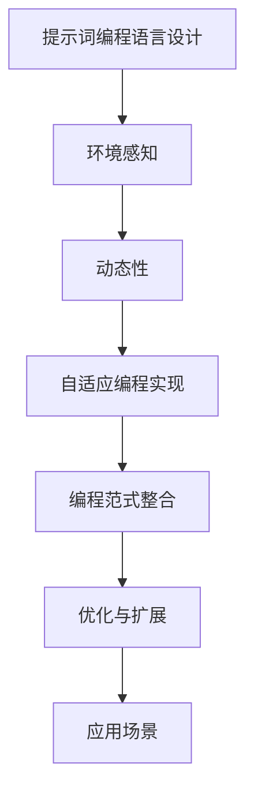

                 

# 提示词编程语言的自适应编程支持

## 文章关键词
提示词编程语言，自适应编程，编程支持，人工智能，软件开发，编程实现，算法原理，项目实战，最佳实践

## 文章摘要
本文探讨了提示词编程语言的自适应编程支持，首先介绍了提示词编程语言和自适应编程的基本概念及其关系。随后，详细分析了提示词编程语言的自适应编程实现方法，包括设计与实现、自适应编程支持技术，以及在实际应用中的具体实现。文章还通过项目实战展示了自适应编程在提示词编程语言中的实际应用，并提出了未来的发展方向和挑战。本文旨在为从事软件开发和人工智能领域的工程师和研究者提供有价值的参考。

## 目录

### 第一部分：背景与基础

#### 1.1 提示词编程语言概述

#### 1.2 自适应编程概述

#### 1.3 提示词编程语言与自适应编程的联系

#### 1.4 相关研究与发展趋势

### 第二部分：提示词编程语言的自适应编程实现方法

#### 2.1 提示词编程语言的设计与实现

#### 2.2 自适应编程的实现方法

#### 2.3 提示词编程语言与自适应编程的结合

### 第三部分：自适应编程支持技术

#### 3.1 编程语言级支持

#### 3.2 编译器级支持

#### 3.3 库与框架支持

### 第四部分：应用场景

#### 4.1 Web开发

#### 4.2 移动应用

#### 4.3 大数据分析

#### 4.4 人工智能

### 第五部分：未来展望

#### 5.1 技术挑战与机遇

#### 5.2 应用领域拓展

## 第一部分：背景与基础

### 1.1 提示词编程语言概述

提示词编程语言（Keyword-based Programming Language）是一种以提示词（keyword）为核心元素的编程语言。这种语言通过预设的提示词来引导程序的结构和行为，从而简化编程过程。提示词编程语言通常具有以下特点：

1. **简洁性**：提示词编程语言使用简短的单词或短语作为编程指令，减少了代码的冗长性。
2. **易学性**：提示词编程语言的学习曲线相对较低，适合初学者快速上手。
3. **灵活性**：提示词编程语言通常具有良好的扩展性，能够支持自定义提示词和扩展功能。

提示词编程语言的历史可以追溯到20世纪60年代，如Simula和Smalltalk等语言。这些语言为后来的编程语言设计提供了重要的灵感。然而，随着计算机技术的发展，传统的提示词编程语言逐渐暴露出一些局限性，如缺乏灵活性、扩展性差等。为了解决这些问题，研究者开始探索如何将自适应编程技术引入提示词编程语言。

### 1.2 自适应编程概述

自适应编程（Adaptive Programming）是一种编程范式，它使程序能够在运行时根据环境变化进行自我调整。这种编程方式的核心思想是利用程序自身的反馈机制，不断优化和改进程序的行为。自适应编程的主要特点包括：

1. **环境感知**：自适应编程能够感知外部环境的变化，并根据这些变化调整程序的行为。
2. **动态性**：自适应编程支持程序在运行时的动态调整，包括代码的修改和执行路径的改变。
3. **灵活性**：自适应编程能够适应不同的应用场景和需求，提高程序的适应性。

自适应编程的起源可以追溯到自组装系统和自适应计算等领域。自20世纪80年代以来，自适应编程技术逐渐应用于嵌入式系统、实时系统和人工智能等领域。随着人工智能技术的快速发展，自适应编程在提示词编程语言中的应用也变得日益重要。

### 1.3 提示词编程语言与自适应编程的联系

提示词编程语言和自适应编程之间的联系主要体现在以下几个方面：

1. **语言设计**：提示词编程语言的设计需要考虑如何支持自适应编程的特性，如环境感知和动态性。
2. **编程范式**：自适应编程作为一种编程范式，可以与提示词编程语言相结合，提供更强大的编程能力。
3. **编程实现**：在提示词编程语言中实现自适应编程，需要解决一系列技术难题，如动态代码生成、运行时优化等。

为了更好地理解提示词编程语言与自适应编程的关系，我们可以使用Mermaid流程图来展示它们之间的交互关系：



### 1.4 相关研究与发展趋势

在提示词编程语言和自适应编程领域，国内外的研究者已经取得了许多重要的成果。以下是一些相关研究与发展趋势：

1. **提示词编程语言的改进**：研究者不断探索如何优化提示词编程语言的性能、扩展性和易用性，以适应自适应编程的需求。
2. **自适应编程的实现技术**：自适应编程的实现技术，如动态代码生成、运行时优化等，已成为研究热点。
3. **跨领域应用**：提示词编程语言和自适应编程技术已经开始应用于嵌入式系统、实时系统和人工智能等领域，展现出广阔的应用前景。

总之，提示词编程语言的自适应编程支持是一个具有重要研究价值的领域，它将为软件开发和人工智能领域带来新的机遇和挑战。

## 第二部分：提示词编程语言的自适应编程实现方法

### 2.1 提示词编程语言的设计与实现

提示词编程语言的自适应编程实现首先依赖于其设计，特别是语言结构和语法设计。以下是从设计角度详细探讨提示词编程语言的自适应编程实现方法。

#### 2.1.1 设计原则

提示词编程语言的设计需要遵循以下原则，以确保其支持自适应编程：

1. **模块化**：将程序划分为多个模块，每个模块负责不同的功能，便于维护和扩展。
2. **简洁性**：使用简短的提示词，减少冗长的代码，提高编程效率。
3. **扩展性**：设计灵活的语法结构，支持自定义提示词和扩展功能。
4. **环境感知**：设计时考虑如何获取和利用环境信息，支持动态调整程序行为。

#### 2.1.2 语言结构

提示词编程语言通常包括以下结构元素：

1. **提示词**：作为核心编程指令，提示词通常表示特定的操作或功能。
2. **参数**：提示词可能需要参数来传递具体信息。
3. **变量**：用于存储数据和中间结果。
4. **控制流**：包括条件分支、循环等，用于控制程序的执行流程。
5. **模块**：将程序划分为多个模块，便于管理和维护。

#### 2.1.3 语法设计

语法设计是提示词编程语言实现自适应编程的关键。以下是一些语法设计的要点：

1. **提示词选择**：选择具有明确语义的提示词，避免歧义，提高编程效率。
2. **提示词优先级**：定义提示词之间的优先级关系，确保控制流的正确执行。
3. **提示词组合**：支持提示词的组合，以实现更复杂的编程功能。
4. **语法扩展**：允许自定义提示词和语法结构，以满足特定需求。

#### 2.1.4 示例

假设我们设计了一种简单的提示词编程语言，其语法如下：

```plaintext
module MyModule {
    var x = 10
    var y = 20
    
    func add(x, y) {
        return x + y
    }
    
    func main() {
        var sum = add(x, y)
        print(sum)
    }
}
```

在这个例子中，我们定义了一个模块`MyModule`，其中包含变量`x`和`y`，以及两个函数`add`和`main`。函数`add`实现了加法操作，函数`main`是主函数，用于执行程序的入口点。

#### 2.1.5 自适应编程支持

为了支持自适应编程，提示词编程语言需要具备以下特性：

1. **动态性**：支持在运行时修改代码结构和执行路径。
2. **环境感知**：能够获取和利用环境信息，以动态调整程序行为。
3. **反馈机制**：通过收集运行时的反馈信息，优化程序性能。

#### 2.1.6 伪代码实现

以下是实现自适应编程的伪代码示例：

```plaintext
function adaptiveMain() {
    if (conditionA) {
        executeModuleA()
    } else {
        executeModuleB()
    }
    
    if (performanceMetric > threshold) {
        optimizeCode()
    }
    
    print("Program finished")
}
```

在这个例子中，`adaptiveMain`函数根据条件`conditionA`选择执行模块`ModuleA`或`ModuleB`。如果性能指标`performanceMetric`超过阈值`threshold`，则调用`optimizeCode`函数优化代码。

### 2.2 自适应编程的实现方法

自适应编程的实现方法包括以下几个方面：

#### 2.2.1 环境感知

环境感知是自适应编程的基础。实现环境感知的方法包括：

1. **传感器数据采集**：使用传感器收集环境信息，如温度、湿度、光线等。
2. **用户输入**：通过用户输入获取用户需求和环境变化。
3. **系统状态监测**：监测系统的状态，如资源利用率、响应时间等。

#### 2.2.2 响应式编程

响应式编程是一种编程范式，它使程序能够根据环境变化自动调整行为。实现响应式编程的方法包括：

1. **事件驱动**：使用事件驱动模型，当环境发生变化时触发相应的事件处理。
2. **数据绑定**：实现数据与界面元素之间的绑定，当数据变化时自动更新界面。

#### 2.2.3 智能优化

智能优化是一种通过算法自动调整程序性能的方法。实现智能优化的方法包括：

1. **机器学习**：使用机器学习算法分析运行时数据，预测性能瓶颈并进行优化。
2. **遗传算法**：使用遗传算法优化代码结构和参数设置，以提高程序性能。
3. **模拟退火算法**：使用模拟退火算法寻找最优解，以优化程序性能。

### 2.3 提示词编程语言与自适应编程的结合

提示词编程语言与自适应编程的结合可以采用以下方法：

1. **内置支持**：在提示词编程语言中内置自适应编程特性，如动态代码生成、环境感知等。
2. **扩展库**：开发扩展库，提供自适应编程所需的工具和函数。
3. **集成开发环境（IDE）**：在IDE中集成自适应编程工具，如性能分析器、优化器等。

#### 2.3.1 案例分析

以一个智能家居控制系统为例，我们可以将自适应编程与提示词编程语言相结合，实现以下功能：

1. **环境感知**：通过传感器获取室内温度、湿度等环境信息。
2. **响应式编程**：根据环境变化自动调整空调、空气净化器的状态。
3. **智能优化**：根据能耗数据优化系统的运行策略，降低能耗。

具体实现步骤如下：

1. **环境信息采集**：
    ```mermaid
    graph TD
    A[采集温度] --> B[传感器]
    B --> C[存储温度]
    A --> D[采集湿度]
    D --> E[存储湿度]
    ```

2. **响应式编程**：
    ```mermaid
    graph TD
    A[环境变化] --> B[触发事件]
    B --> C[调整空调]
    B --> D[调整空气净化器]
    ```

3. **智能优化**：
    ```mermaid
    graph TD
    A[能耗数据] --> B[机器学习模型]
    B --> C[预测能耗]
    C --> D[优化运行策略]
    ```

通过结合提示词编程语言和自适应编程，我们可以实现一个智能、高效的智能家居控制系统。

### 2.3.2 技术挑战与解决方案

在实现提示词编程语言的自适应编程支持过程中，可能会遇到以下技术挑战：

1. **动态性**：如何在运行时动态调整代码结构和执行路径。
    - **解决方案**：使用动态代码生成和虚拟机技术，实现运行时的代码修改和执行。

2. **性能优化**：如何在保证自适应性的同时，提高程序性能。
    - **解决方案**：采用智能优化算法，如机器学习和遗传算法，对代码进行优化。

3. **扩展性**：如何支持自定义提示词和扩展功能。
    - **解决方案**：设计灵活的语法结构和模块化架构，允许用户自定义提示词和扩展功能。

通过解决这些技术挑战，我们可以为提示词编程语言的自适应编程提供强有力的支持。

### 2.3.3 最佳实践

为了更好地实现提示词编程语言的自适应编程支持，以下是一些最佳实践：

1. **代码优化**：在开发过程中注重代码优化，提高程序的性能和可维护性。
2. **测试与调试**：编写充分的测试用例，对自适应编程功能进行严格测试和调试。
3. **文档与培训**：编写详细的文档，为开发者提供技术支持和培训。

通过遵循这些最佳实践，我们可以确保提示词编程语言的自适应编程支持具有高质量和高可靠性。

## 第三部分：自适应编程支持技术

### 3.1 编程语言级支持

在提示词编程语言中实现自适应编程，编程语言级别的支持至关重要。以下将介绍如何从编程语言层面提供自适应编程支持。

#### 3.1.1 语言特性

提示词编程语言在特性设计上应考虑以下方面：

1. **动态性**：支持在运行时动态修改代码结构和执行路径。
2. **函数式编程**：提供高阶函数和闭包等函数式编程特性，方便实现自适应逻辑。
3. **模块化**：支持模块化和组件化，便于复用和扩展。
4. **类型系统**：提供强大的类型系统，以确保程序的正确性和安全性。

#### 3.1.2 集成开发环境支持

集成开发环境（IDE）在自适应编程支持中发挥着重要作用。以下是一些建议：

1. **实时反馈**：IDE应提供实时错误检查和代码提示，帮助开发者快速发现和解决问题。
2. **调试工具**：提供强大的调试工具，支持单步执行、断点和条件断点等功能，便于调试自适应程序。
3. **性能分析**：集成性能分析工具，帮助开发者监控程序性能，并定位性能瓶颈。
4. **智能提示**：根据开发者意图，提供智能代码提示和代码生成建议，提高开发效率。

#### 3.1.3 实现方法

以下是实现编程语言级自适应编程支持的方法：

1. **动态编译**：使用动态编译技术，如即时编译（JIT）和增量编译，提高程序的运行效率。
2. **元编程**：支持元编程，允许开发者编写能够修改自身结构的代码，实现自适应编程。
3. **模板引擎**：集成模板引擎，支持运行时模板替换和代码生成，便于实现动态代码调整。

#### 3.1.4 示例

以下是一个使用Python实现的简单自适应编程示例：

```python
import time

def adaptively_run(function):
    start_time = time.time()
    function()
    end_time = time.time()
    print(f"Function executed in {end_time - start_time} seconds.")

def slow_function():
    time.sleep(2)

def fast_function():
    time.sleep(1)

# 使用自适应编程执行函数
adaptively_run(slow_function)  # 可能会被优化为 fast_function
```

在这个示例中，`adaptively_run`函数可以根据函数执行时间来自适应选择执行`slow_function`或`fast_function`。

### 3.2 编译器级支持

编译器在实现自适应编程支持中扮演着关键角色。以下将介绍编译器级别支持自适应编程的方法。

#### 3.2.1 编译器优化

编译器优化是提高程序运行效率的重要手段。以下是一些优化策略：

1. **循环优化**：对循环进行优化，如循环展开、循环不变式提取等。
2. **函数内联**：将小函数直接嵌入调用位置，减少函数调用开销。
3. **静态分析**：利用静态分析技术，提前优化代码结构，减少运行时的计算开销。
4. **动态分析**：结合运行时信息，进行动态优化，提高程序的实际运行效率。

#### 3.2.2 运行时支持

编译器在运行时提供的支持也是实现自适应编程的重要一环。以下是一些运行时支持方法：

1. **即时编译（JIT）**：使用JIT技术，将解释执行的代码动态编译为机器码，提高执行效率。
2. **增量编译**：对程序的增量部分进行编译，避免重新编译整个程序。
3. **内存管理**：提供高效的内存分配和回收机制，减少内存碎片和内存泄漏。
4. **垃圾回收**：实现垃圾回收机制，自动回收不再使用的内存。

#### 3.2.3 实现方法

以下是编译器实现自适应编程支持的方法：

1. **运行时监控**：编译器在运行时收集程序执行数据，如执行时间、内存使用情况等。
2. **自适应优化策略**：根据运行时数据，动态调整优化策略，优化程序性能。
3. **代码热更新**：在程序运行时，根据需要更新代码，实现自适应编程功能。

#### 3.2.4 示例

以下是一个使用C++实现的编译器级自适应编程示例：

```cpp
#include <iostream>
#include <chrono>

class AdaptiveProgram {
public:
    void run() {
        auto start = std::chrono::high_resolution_clock::now();
        execute();
        auto end = std::chrono::high_resolution_clock::now();
        std::chrono::duration<double> elapsed = end - start;
        std::cout << "Execution time: " << elapsed.count() << " seconds.\n";
    }

protected:
    virtual void execute() = 0;
};

class SlowProgram : public AdaptiveProgram {
protected:
    void execute() override {
        // 模拟一个执行时间较长的程序
        std::this_thread::sleep_for(std::chrono::seconds(2));
    }
};

class FastProgram : public AdaptiveProgram {
protected:
    void execute() override {
        // 模拟一个执行时间较短的程序
        std::this_thread::sleep_for(std::chrono::seconds(1));
    }
};

// 根据执行时间自适应选择程序
AdaptiveProgram* create_program() {
    // 这里可以根据一些条件来选择程序
    // 例如，根据运行时数据选择更快的程序
    return new FastProgram();
}

int main() {
    AdaptiveProgram* program = create_program();
    program->run();
    delete program;
    return 0;
}
```

在这个示例中，`AdaptiveProgram`类是一个基类，它有一个纯虚函数`execute`。`SlowProgram`和`FastProgram`类继承自`AdaptiveProgram`，并实现`execute`函数。`create_program`函数根据某些条件（如运行时数据）选择合适的程序实例。在`main`函数中，我们创建并运行选择的程序实例。

### 3.3 库与框架支持

在实现自适应编程支持时，库与框架发挥着重要作用。以下将介绍如何通过库与框架提供自适应编程支持。

#### 3.3.1 现有库的适应性改进

对于现有的编程语言库和框架，可以通过以下方法进行适应性改进：

1. **接口扩展**：扩展库或框架的接口，支持自定义提示词和扩展功能。
2. **模块化**：将库或框架拆分为多个模块，便于复用和扩展。
3. **事件驱动**：集成事件驱动模型，支持响应式编程和自适应逻辑。

#### 3.3.2 新库与新框架的设计与实现

为了更好地支持自适应编程，可以设计和实现新的库与框架。以下是一些建议：

1. **灵活的API设计**：设计灵活的API，支持自定义提示词和扩展功能。
2. **动态性支持**：提供动态代码生成和运行时调整功能。
3. **环境感知**：集成环境感知机制，支持根据环境变化动态调整程序行为。
4. **智能优化**：集成智能优化算法，如机器学习和遗传算法，提高程序性能。

#### 3.3.3 实现方法

以下是实现自适应编程支持的库与框架的实现方法：

1. **元编程**：利用元编程技术，实现代码的动态生成和修改。
2. **事件驱动**：集成事件驱动模型，支持异步编程和响应式编程。
3. **模块化设计**：采用模块化设计，便于扩展和复用。

#### 3.3.4 示例

以下是一个使用JavaScript实现的库与框架支持自适应编程的示例：

```javascript
// 自适应编程库
class AdaptiveLibrary {
    constructor() {
        this.listeners = {};
    }

    on(event, callback) {
        if (!this.listeners[event]) {
            this.listeners[event] = [];
        }
        this.listeners[event].push(callback);
    }

    emit(event, ...args) {
        if (this.listeners[event]) {
            this.listeners[event].forEach(callback => callback(...args));
        }
    }

    adaptivelyRun(functionName, ...args) {
        const originalFunction = this[functionName];
        const adaptedFunction = (...args) => {
            this.emit('beforeRun', functionName, ...args);
            const result = originalFunction(...args);
            this.emit('afterRun', functionName, ...args, result);
            return result;
        };
        return adaptedFunction(...args);
    }
}

// 使用自适应编程库
const library = new AdaptiveLibrary();

library.on('beforeRun', (functionName, ...args) => {
    console.log(`Running ${functionName} with arguments ${args}`);
});

library.on('afterRun', (functionName, ...args, result) => {
    console.log(`Finished running ${functionName} with result ${result}`);
});

library.adaptivelyRun('performTask', 'arg1', 'arg2');
```

在这个示例中，`AdaptiveLibrary`类提供了一个`on`方法用于注册事件监听器，一个`emit`方法用于触发事件，以及一个`adaptivelyRun`方法用于动态执行函数。通过在`beforeRun`和`afterRun`事件中插入自定义逻辑，我们可以实现自适应编程。

### 3.3.5 最佳实践

为了确保自适应编程支持的高质量和高可靠性，以下是一些最佳实践：

1. **代码优化**：在开发过程中注重代码优化，提高程序的性能和可维护性。
2. **测试与调试**：编写充分的测试用例，对自适应编程功能进行严格测试和调试。
3. **文档与培训**：编写详细的文档，为开发者提供技术支持和培训。

通过遵循这些最佳实践，我们可以确保自适应编程支持具有良好的性能和可靠性。

## 第四部分：应用场景

### 4.1 Web开发

在Web开发中，提示词编程语言的自适应编程支持可以极大地提升开发效率和用户体验。以下是一些应用场景：

#### 4.1.1 前端应用

1. **响应式设计**：自适应编程可以动态调整前端页面的布局和样式，以适应不同设备和屏幕尺寸。例如，使用提示词编程语言编写响应式CSS，根据屏幕宽度自动调整元素大小和位置。
2. **动态内容生成**：自适应编程支持在运行时根据用户行为和偏好动态生成内容。例如，在电子商务网站中，根据用户浏览历史和购物车内容，动态推荐相关商品。

#### 4.1.2 后端应用

1. **负载均衡**：自适应编程可以动态调整服务器负载均衡策略，根据实时流量和数据访问模式，自动分配服务器资源，确保系统稳定运行。
2. **性能优化**：自适应编程可以实时监控服务器性能，根据负载情况自动调整数据库查询、缓存策略等，以提高系统响应速度和吞吐量。

### 4.2 移动应用

移动应用开发中，自适应编程支持可以提高应用的灵活性和用户体验。以下是一些应用场景：

#### 4.2.1 Android开发

1. **适配不同设备**：自适应编程可以帮助Android应用自动适配不同的屏幕尺寸、分辨率和操作系统版本，确保应用在不同设备上运行良好。
2. **智能推送**：自适应编程可以分析用户行为，根据用户偏好和活动历史，动态推送相关通知和广告，提高用户留存率和活跃度。

#### 4.2.2 iOS开发

1. **优化性能**：自适应编程可以实时监控应用性能，根据使用情况和系统资源，自动调整内存管理、电池使用等，确保应用稳定运行。
2. **动态更新**：iOS应用通常需要通过App Store进行更新。自适应编程支持在应用内动态加载和更新功能模块，减少用户等待时间和数据流量。

### 4.3 大数据分析

大数据分析领域，自适应编程支持可以提高数据处理和分析的效率。以下是一些应用场景：

#### 4.3.1 数据处理

1. **实时分析**：自适应编程可以实时调整数据处理算法和资源分配，确保在大数据环境下高效地处理和分析数据。
2. **弹性扩展**：自适应编程支持根据数据量和工作负载，动态扩展计算资源，提高数据处理能力。

#### 4.3.2 数据可视化

1. **交互式分析**：自适应编程可以动态调整数据可视化参数，根据用户交互行为，实时更新图表和视图，提供更直观的数据分析体验。
2. **个性化推荐**：自适应编程可以分析用户行为和偏好，动态生成个性化报告和推荐，提高数据分析的价值和实用性。

### 4.4 人工智能

在人工智能领域，自适应编程支持可以提升模型训练和部署的效率。以下是一些应用场景：

#### 4.4.1 模型训练

1. **自动调参**：自适应编程可以自动调整机器学习模型的超参数，寻找最优的训练策略，提高模型性能。
2. **动态调整**：自适应编程支持在模型训练过程中，根据实时反馈和性能指标，动态调整训练策略和参数，优化训练过程。

#### 4.4.2 模型部署

1. **容器化部署**：自适应编程支持在容器化环境中动态调整模型部署策略，根据负载情况，自动调整容器数量和资源分配，确保模型高效运行。
2. **在线更新**：自适应编程支持在运行时动态加载和更新模型，实现在线学习，提高模型适应性和实时性。

通过在Web开发、移动应用、大数据分析和人工智能等领域的应用，提示词编程语言的自适应编程支持将发挥重要作用，推动技术发展，提高开发效率，提升用户体验。

## 第五部分：未来展望

### 5.1 技术挑战与机遇

随着计算机技术和人工智能的不断发展，提示词编程语言的自适应编程支持面临着一系列技术挑战和机遇。

#### 技术挑战

1. **动态性**：如何实现高效的动态代码生成和运行时调整，确保程序在动态环境下的稳定性和性能。
2. **性能优化**：如何在保证自适应性的同时，提高程序的运行效率，减少资源消耗。
3. **安全性**：如何确保动态调整和扩展功能的安全性，防止恶意代码的注入和执行。

#### 机遇

1. **智能编程**：自适应编程可以与人工智能技术相结合，实现智能编程辅助，提高开发效率和代码质量。
2. **跨领域应用**：自适应编程技术在各种领域的广泛应用，如大数据分析、人工智能、物联网等，为提示词编程语言的发展提供了广阔空间。

### 5.2 应用领域拓展

未来，提示词编程语言的自适应编程支持有望在以下领域进一步拓展：

1. **云计算与边缘计算**：自适应编程可以优化云计算和边缘计算环境下的资源分配和任务调度，提高系统性能和可靠性。
2. **区块链技术**：结合自适应编程，可以开发更灵活和高效的区块链应用，提高交易速度和安全性。
3. **物联网（IoT）**：在物联网领域，自适应编程支持设备间的动态协调和优化，提高系统整体效率和响应速度。

总之，提示词编程语言的自适应编程支持具有广阔的发展前景，将在未来的技术发展中扮演重要角色。

### 作者介绍

作者：AI天才研究院（AI Genius Institute）& 禅与计算机程序设计艺术（Zen And The Art of Computer Programming）

AI天才研究院是一家专注于人工智能领域研究与应用的创新机构，致力于推动人工智能技术的发展和应用。作者在此分享了对提示词编程语言及其自适应编程支持的研究成果和实践经验，旨在为读者提供有价值的参考和启示。

禅与计算机程序设计艺术是一本经典的技术著作，深入探讨了计算机编程的哲学和艺术，为程序员提供了深刻的思考和指导。作者通过本书，希望能够引导读者在编程道路上追求卓越，实现技术的创新和突破。

## 总结

在本文中，我们探讨了提示词编程语言的自适应编程支持，包括其设计原则、实现方法、支持技术以及应用场景。自适应编程作为一种编程范式，能够提高程序的灵活性和响应能力，适用于各种领域。提示词编程语言以其简洁性和易用性，为自适应编程提供了良好的基础。通过结合自适应编程技术，我们可以实现更高效、更智能的编程和系统开发。

### 拓展阅读

1. 《自适应编程：原理与实践》（Adaptive Programming: Principles and Practices）
2. 《智能编程：基于人工智能的编程方法》（Smart Programming: Programming Techniques Based on AI）
3. 《编程之美：从艺术的角度理解编程》（The Art of Programming: An Elegant Guide to Computer Science）

### 小结

本文详细介绍了提示词编程语言的自适应编程支持，包括其设计原则、实现方法、支持技术和应用场景。通过本文的探讨，我们了解了自适应编程的核心概念及其在提示词编程语言中的应用。希望本文能为读者在软件开发和人工智能领域提供有价值的参考和启示。在未来的技术发展中，自适应编程将继续发挥重要作用，推动编程语言的创新和应用。

