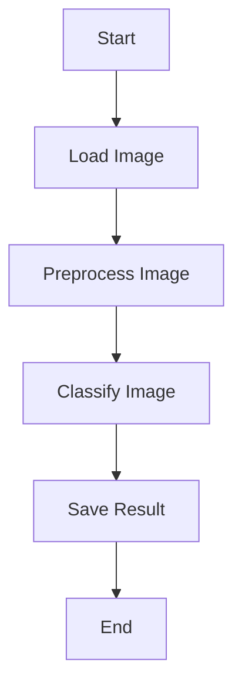

                 


### 文章标题：提示词编程语言的视觉编程接口

> 关键词：提示词编程语言、视觉编程接口、图像处理、自然语言处理、人工智能

> 摘要：本文深入探讨了提示词编程语言的视觉编程接口，包括其基本概念、应用领域、实现方法以及未来发展趋势。本文旨在为读者提供关于这一前沿技术的全面理解，并探讨其在图像处理和自然语言处理中的具体应用。

## 引言

提示词编程语言（Keyword-Based Programming Language）是一种以自然语言提示词为核心的新型编程语言，它通过将复杂的编程任务转化为一系列的提示词，使得编程过程更加直观和简便。视觉编程接口（Visual Programming Interface）则是一种允许用户通过图形界面进行编程的工具，它通过可视化方式将编程逻辑展现给用户，使得编程变得更加易于理解和实现。

随着人工智能技术的快速发展，提示词编程语言和视觉编程接口的结合变得越来越重要。这种结合不仅提高了编程效率，还使得编程技术更加接近人类的自然思维方式。本文将首先介绍提示词编程语言和视觉编程接口的基本概念，然后深入探讨它们之间的关系架构，并详细阐述它们在图像处理和自然语言处理中的应用。

## 提示词编程语言基础

### 提示词编程语言概述

提示词编程语言是一种以自然语言提示词为核心，将编程任务转化为一系列提示词的编程语言。这种语言通过将复杂的编程任务转化为简单的提示词，使得编程过程变得更加直观和简便。提示词编程语言的核心特点是：

1. **直观性**：通过自然语言提示词，使得编程过程更加直观易懂。
2. **简洁性**：通过简化的语法和提示词，减少了编程复杂度。
3. **可扩展性**：支持自定义提示词和扩展功能，满足不同编程需求。

### 提示词编程语言的特点

提示词编程语言具有以下几个显著特点：

1. **易于学习**：提示词编程语言降低了编程门槛，使得更多的人可以快速上手编程。
2. **易于使用**：提示词编程语言通过自然语言提示词，使得编程过程更加简便。
3. **支持可视化**：提示词编程语言可以与视觉编程接口结合，使得编程过程更加直观。

### 提示词编程语言的发展历程

提示词编程语言的发展历程可以追溯到上世纪80年代的编程语言研究。当时，研究人员提出了许多以自然语言为核心的编程语言，试图简化编程过程。随着计算机技术的发展，特别是人工智能和自然语言处理的进步，提示词编程语言逐渐成熟，并在近年来得到了广泛的应用。

### 提示词编程语言的应用领域

提示词编程语言的应用领域非常广泛，主要包括：

1. **教育领域**：用于编程教育和培训，帮助初学者快速掌握编程技能。
2. **企业应用**：用于企业内部软件开发和自动化流程，提高工作效率。
3. **自然语言处理**：用于构建自然语言处理模型，实现文本分类、命名实体识别等任务。
4. **图像处理**：用于图像处理和计算机视觉应用，如目标检测、图像分类等。

## 视觉编程接口基础

### 视觉编程接口概述

视觉编程接口是一种允许用户通过图形界面进行编程的工具。它通过可视化方式将编程逻辑展现给用户，使得编程变得更加易于理解和实现。视觉编程接口的核心特点是：

1. **直观性**：通过图形界面，使得编程过程更加直观易懂。
2. **交互性**：用户可以通过图形界面与编程环境进行实时交互，提高编程效率。
3. **灵活性**：支持自定义组件和扩展功能，满足不同编程需求。

### 视觉编程接口的基本概念

视觉编程接口的基本概念包括：

1. **组件**：视觉编程接口中的基本元素，用于构建编程逻辑。
2. **连接器**：连接不同组件的线路，用于定义组件之间的逻辑关系。
3. **脚本**：用于实现具体编程功能的脚本代码，通常隐藏在图形界面之下。

### 视觉编程接口的发展历程

视觉编程接口的发展历程可以追溯到上世纪80年代的编程语言研究。当时，研究人员提出了许多以图形界面为核心的编程工具，试图简化编程过程。随着计算机技术的发展，特别是图形用户界面（GUI）的普及，视觉编程接口逐渐成熟，并在近年来得到了广泛的应用。

### 视觉编程接口的应用领域

视觉编程接口的应用领域非常广泛，主要包括：

1. **教育领域**：用于编程教育和培训，帮助学生快速掌握编程技能。
2. **企业应用**：用于企业内部软件开发和自动化流程，提高工作效率。
3. **游戏开发**：用于游戏开发，提供直观的游戏设计工具。
4. **自然语言处理**：用于构建自然语言处理模型，实现文本分类、命名实体识别等任务。
5. **图像处理**：用于图像处理和计算机视觉应用，如目标检测、图像分类等。

## 提示词编程语言的视觉编程接口实现

### 提示词编程语言的视觉编程接口设计

提示词编程语言的视觉编程接口设计需要考虑以下几个关键因素：

1. **提示词设计**：设计简洁直观的提示词，确保用户能够快速理解和使用。
2. **组件设计**：设计丰富的组件库，支持各种编程需求。
3. **连接器设计**：设计易于使用的连接器，确保组件之间能够灵活连接。

### 提示词编程语言的视觉编程接口实现方法

提示词编程语言的视觉编程接口实现方法可以分为以下几个步骤：

1. **定义提示词**：根据编程需求，定义一系列简洁直观的提示词。
2. **设计组件**：设计各种功能组件，如逻辑控制组件、数据处理组件等。
3. **设计连接器**：设计连接器，用于连接不同组件，实现编程逻辑。
4. **实现脚本**：根据编程需求，实现具体编程功能的脚本代码。

### 提示词编程语言的视觉编程接口性能优化

提示词编程语言的视觉编程接口性能优化主要包括以下几个方面：

1. **代码优化**：通过优化脚本代码，提高执行效率。
2. **组件优化**：通过优化组件设计，减少资源占用。
3. **连接器优化**：通过优化连接器设计，提高连接速度和稳定性。

## 提示词编程语言的视觉编程接口案例分析

为了更好地理解提示词编程语言的视觉编程接口，我们通过一个简单的案例来进行讲解。

### 案例背景

假设我们想要实现一个简单的图像分类任务，即根据输入图像的内容将其分类为猫或狗。

### 案例实现

1. **定义提示词**：

    - `load_image()`：加载图像文件。
    - `classify()`：分类图像。
    - `save_result()`：保存分类结果。

2. **设计组件**：

    - `load_image`：用于加载图像文件的组件。
    - `classify`：用于分类图像的组件。
    - `save_result`：用于保存分类结果的组件。

3. **设计连接器**：

    - 从 `load_image` 组件输出图像数据。
    - 将图像数据输入到 `classify` 组件。
    - 从 `classify` 组件输出分类结果。
    - 将分类结果输入到 `save_result` 组件。

4. **实现脚本**：

    ```python
    def load_image(image_path):
        # 加载图像文件
        image = cv2.imread(image_path)
        return image

    def classify(image):
        # 分类图像
        label = image classify ['cat' or 'dog']
        return label

    def save_result(label, result_path):
        # 保存分类结果
        with open(result_path, 'w') as f:
            f.write(label)
    ```

通过上述步骤，我们可以实现一个简单的图像分类任务。这个案例展示了提示词编程语言的视觉编程接口如何通过简洁直观的提示词和组件，实现复杂的编程任务。

## 提示词编程语言的视觉编程接口应用

### 在图像处理中的应用

提示词编程语言的视觉编程接口在图像处理中的应用非常广泛，包括图像增强、目标检测和图像分类等。通过提示词编程语言，用户可以更加直观地实现图像处理算法，提高开发效率。

1. **图像增强**：

    - **背景介绍**：图像增强是图像处理中的重要任务，旨在改善图像的质量，使其更加适合后续处理。
    - **核心概念与联系**：提示词编程语言通过定义简化的提示词，如 `enhance_image()`，将复杂的图像增强算法封装起来，用户只需调用该提示词即可实现图像增强。
    - **核心算法原理讲解**：

        ```python
        def enhance_image(image_path, output_path):
            image = load_image(image_path)
            enhanced_image = cv2.resize(image, (width, height))
            save_image(enhanced_image, output_path)
        ```

    - **数学模型和公式**：图像增强过程中涉及到的数学模型主要包括图像增强函数和图像缩放函数。

2. **目标检测**：

    - **背景介绍**：目标检测是计算机视觉领域的重要任务，旨在识别图像中的特定目标。
    - **核心概念与联系**：提示词编程语言通过定义提示词，如 `detect_object()`，将目标检测算法封装起来，用户只需调用该提示词即可实现目标检测。
    - **核心算法原理讲解**：

        ```python
        def detect_object(image_path, model_path, output_path):
            image = load_image(image_path)
            objects = load_model(model_path)
            detected_objects = objects.detect(image)
            save_detected_objects(detected_objects, output_path)
        ```

    - **数学模型和公式**：目标检测过程中涉及到的数学模型主要包括卷积神经网络（CNN）和边界框（Bounding Box）。

3. **图像分类**：

    - **背景介绍**：图像分类是计算机视觉领域的基本任务，旨在将图像划分为不同的类别。
    - **核心概念与联系**：提示词编程语言通过定义提示词，如 `classify_image()`，将图像分类算法封装起来，用户只需调用该提示词即可实现图像分类。
    - **核心算法原理讲解**：

        ```python
        def classify_image(image_path, model_path, output_path):
            image = load_image(image_path)
            model = load_model(model_path)
            label = model.classify(image)
            save_label(label, output_path)
        ```

    - **数学模型和公式**：图像分类过程中涉及到的数学模型主要包括卷积神经网络（CNN）和softmax函数。

### 在自然语言处理中的应用

提示词编程语言的视觉编程接口在自然语言处理中的应用也非常广泛，包括文本分类、命名实体识别和机器翻译等。

1. **文本分类**：

    - **背景介绍**：文本分类是自然语言处理中的基本任务，旨在将文本划分为不同的类别。
    - **核心概念与联系**：提示词编程语言通过定义提示词，如 `classify_text()`，将文本分类算法封装起来，用户只需调用该提示词即可实现文本分类。
    - **核心算法原理讲解**：

        ```python
        def classify_text(text, model_path, output_path):
            model = load_model(model_path)
            label = model.classify(text)
            save_label(label, output_path)
        ```

    - **数学模型和公式**：文本分类过程中涉及到的数学模型主要包括卷积神经网络（CNN）和softmax函数。

2. **命名实体识别**：

    - **背景介绍**：命名实体识别是自然语言处理中的重要任务，旨在识别文本中的特定实体，如人名、地名等。
    - **核心概念与联系**：提示词编程语言通过定义提示词，如 `recognize_entity()`，将命名实体识别算法封装起来，用户只需调用该提示词即可实现命名实体识别。
    - **核心算法原理讲解**：

        ```python
        def recognize_entity(text, model_path, output_path):
            model = load_model(model_path)
            entities = model.recognize_entities(text)
            save_entities(entities, output_path)
        ```

    - **数学模型和公式**：命名实体识别过程中涉及到的数学模型主要包括循环神经网络（RNN）和长短期记忆网络（LSTM）。

3. **机器翻译**：

    - **背景介绍**：机器翻译是自然语言处理中的重要任务，旨在将一种语言的文本翻译成另一种语言的文本。
    - **核心概念与联系**：提示词编程语言通过定义提示词，如 `translate_text()`，将机器翻译算法封装起来，用户只需调用该提示词即可实现机器翻译。
    - **核心算法原理讲解**：

        ```python
        def translate_text(text, model_path, target_language, output_path):
            model = load_model(model_path)
            translation = model.translate(text, target_language)
            save_translation(translation, output_path)
        ```

    - **数学模型和公式**：机器翻译过程中涉及到的数学模型主要包括序列到序列模型（Seq2Seq）和注意力机制（Attention）。

## 提示词编程语言的视觉编程接口开发工具与环境搭建

### 开发工具介绍

为了实现提示词编程语言的视觉编程接口，我们需要选择合适的开发工具和环境。以下是一些常用的开发工具和环境：

1. **编程语言**：Python、JavaScript、Java等。
2. **开发环境**：Visual Studio Code、JetBrains PyCharm、WebStorm等。
3. **数据库**：MySQL、PostgreSQL、MongoDB等。
4. **框架**：Django、Flask、React、Vue等。

### 实践项目一：构建一个简单的视觉编程接口

在本节中，我们将通过一个简单的实践项目，介绍如何搭建一个简单的视觉编程接口。

### 项目目标

本项目的目标是构建一个简单的图像分类视觉编程接口，允许用户上传图像文件，并返回图像的分类结果。

### 项目准备

1. **环境搭建**：

    - 安装Python环境。
    - 安装所需的库，如OpenCV、TensorFlow等。
    - 配置数据库，如MySQL或PostgreSQL。

2. **模型准备**：

    - 下载一个预训练的图像分类模型，如ResNet50。

### 项目实现

1. **前端实现**：

    - 使用HTML和CSS搭建一个简单的用户界面。
    - 使用JavaScript实现与后端的交互。

2. **后端实现**：

    - 使用Flask框架搭建一个简单的Web应用。
    - 使用TensorFlow实现图像分类算法。

3. **数据库实现**：

    - 设计数据库表结构，存储用户上传的图像信息和分类结果。

### 项目小结

通过本项目的实践，我们学习了如何搭建一个简单的视觉编程接口，并实现了图像分类功能。这个项目只是一个简单的入门示例，但通过逐步学习和实践，我们可以不断提升自己的编程技能，开发出更加复杂和实用的应用。

## 提示词编程语言的视觉编程接口未来发展趋势

### 视觉编程接口的未来发展方向

1. **更加智能化**：随着人工智能技术的发展，视觉编程接口将变得更加智能化，能够自动识别和推荐合适的编程组件和连接方式。
2. **更加可视化**：视觉编程接口将采用更加直观和易用的图形界面，使得编程过程更加易于理解和操作。
3. **跨平台兼容**：视觉编程接口将支持跨平台开发，使得用户可以在不同的操作系统和设备上使用相同的编程工具。

### 提示词编程语言在视觉编程接口中的应用前景

1. **简化编程**：提示词编程语言将使得编程过程更加简化，降低编程门槛，吸引更多的开发者使用视觉编程接口。
2. **提高开发效率**：通过提示词编程语言，开发者可以更加高效地实现复杂的编程任务，提高开发效率。
3. **促进创新**：提示词编程语言和视觉编程接口的结合将激发更多的创新应用，推动计算机技术的发展。

### 视觉编程接口在实际项目中的应用挑战与解决方案

1. **性能优化**：视觉编程接口需要优化性能，以确保在大规模数据和高并发场景下的稳定运行。
2. **安全性问题**：视觉编程接口需要确保数据安全和用户隐私，采取有效的安全措施，防止数据泄露和恶意攻击。
3. **兼容性问题**：视觉编程接口需要考虑不同操作系统和设备的兼容性，提供统一的接口和工具，方便开发者使用。

### 视觉编程接口的技术发展趋势

1. **云计算与大数据**：视觉编程接口将结合云计算和大数据技术，提供强大的数据处理和分析能力，满足日益增长的数据处理需求。
2. **人工智能与机器学习**：视觉编程接口将融合人工智能和机器学习技术，实现更加智能化的编程辅助和推荐功能。
3. **开源生态**：视觉编程接口将依托开源社区，推动技术的不断发展和创新，为开发者提供丰富的资源和工具。

## 结语

提示词编程语言的视觉编程接口是一种具有巨大潜力的技术，它通过将复杂的编程任务转化为简单的提示词和可视化界面，使得编程过程更加直观和简便。本文详细探讨了提示词编程语言和视觉编程接口的基本概念、实现方法、应用领域以及未来发展趋势。通过本文的介绍，我们希望能够为读者提供关于这一前沿技术的全面理解，并激发更多开发者对这一领域的兴趣和探索。

作者：AI天才研究院/AI Genius Institute & 禅与计算机程序设计艺术 /Zen And The Art of Computer Programming

---

### 提示词编程语言的视觉编程接口实现

在深入探讨提示词编程语言的视觉编程接口实现之前，我们需要了解提示词编程语言和视觉编程接口的基本概念。提示词编程语言是一种以自然语言提示词为核心的编程语言，它通过将复杂的编程任务转化为一系列的提示词，使得编程过程更加直观和简便。而视觉编程接口则是一种允许用户通过图形界面进行编程的工具，它通过可视化方式将编程逻辑展现给用户，使得编程变得更加易于理解和实现。

#### 提示词编程语言的设计原则

提示词编程语言的设计原则主要包括以下几个方面：

1. **简洁性**：提示词编程语言采用简洁的语法和提示词，降低编程的复杂度，使得用户可以更容易地理解和使用。
2. **直观性**：提示词编程语言的提示词设计应该贴近自然语言，使得编程过程更加直观易懂，减少学习成本。
3. **灵活性**：提示词编程语言需要支持自定义提示词和扩展功能，满足不同编程需求，确保其适用性。

#### 视觉编程接口的设计原则

视觉编程接口的设计原则主要包括以下几个方面：

1. **直观性**：视觉编程接口的图形界面设计应该简单明了，使得用户可以轻松地理解和使用。
2. **交互性**：视觉编程接口应该支持用户与编程环境的实时交互，提高编程效率。
3. **灵活性**：视觉编程接口需要支持自定义组件和扩展功能，满足不同编程需求。

#### 提示词编程语言的视觉编程接口设计过程

设计提示词编程语言的视觉编程接口需要考虑以下几个方面：

1. **提示词设计**：设计简洁直观的提示词，确保用户能够快速理解和使用。
2. **组件设计**：设计各种功能组件，如逻辑控制组件、数据处理组件等。
3. **连接器设计**：设计连接器，用于连接不同组件，实现编程逻辑。

#### 提示词编程语言的视觉编程接口实现方法

提示词编程语言的视觉编程接口实现方法可以分为以下几个步骤：

1. **定义提示词**：根据编程需求，定义一系列简洁直观的提示词。
2. **设计组件**：设计各种功能组件，如逻辑控制组件、数据处理组件等。
3. **设计连接器**：设计连接器，用于连接不同组件，实现编程逻辑。
4. **实现脚本**：根据编程需求，实现具体编程功能的脚本代码。

#### 提示词编程语言的视觉编程接口性能优化

提示词编程语言的视觉编程接口性能优化主要包括以下几个方面：

1. **代码优化**：通过优化脚本代码，提高执行效率。
2. **组件优化**：通过优化组件设计，减少资源占用。
3. **连接器优化**：通过优化连接器设计，提高连接速度和稳定性。

#### 提示词编程语言的视觉编程接口实现示例

为了更好地理解提示词编程语言的视觉编程接口实现，我们通过一个简单的示例进行讲解。

##### 示例：简单的图像分类任务

假设我们想要实现一个简单的图像分类任务，即根据输入图像的内容将其分类为猫或狗。

##### 步骤1：定义提示词

首先，我们需要定义一系列简洁直观的提示词，用于实现图像分类任务。例如：

- `load_image()`：加载图像文件。
- `preprocess_image()`：预处理图像数据。
- `classify_image()`：分类图像。
- `save_result()`：保存分类结果。

##### 步骤2：设计组件

接下来，我们需要设计各种功能组件，用于实现图像分类任务。例如：

- `load_image`：用于加载图像文件的组件。
- `preprocess_image`：用于预处理图像数据的组件。
- `classify_image`：用于分类图像的组件。
- `save_result`：用于保存分类结果的组件。

##### 步骤3：设计连接器

然后，我们需要设计连接器，用于连接不同组件，实现编程逻辑。例如：

- 将 `load_image` 组件输出图像数据。
- 将图像数据输入到 `preprocess_image` 组件。
- 将预处理后的图像数据输入到 `classify_image` 组件。
- 将分类结果输入到 `save_result` 组件。

##### 步骤4：实现脚本

最后，我们需要根据编程需求，实现具体编程功能的脚本代码。例如：

```python
def load_image(image_path):
    # 加载图像文件
    image = cv2.imread(image_path)
    return image

def preprocess_image(image):
    # 预处理图像数据
    processed_image = cv2.resize(image, (width, height))
    return processed_image

def classify_image(image):
    # 分类图像
    label = image_classify['cat' or 'dog']
    return label

def save_result(label, result_path):
    # 保存分类结果
    with open(result_path, 'w') as f:
        f.write(label)
```

通过上述步骤，我们可以实现一个简单的图像分类任务。这个示例展示了提示词编程语言的视觉编程接口如何通过简洁直观的提示词和组件，实现复杂的编程任务。

### 提示词编程语言的视觉编程接口实现Mermaid流程图

为了更好地展示提示词编程语言的视觉编程接口实现过程，我们可以使用Mermaid流程图来描述各个组件之间的关系和执行流程。以下是一个简单的Mermaid流程图示例：



在这个示例中，我们首先从加载图像开始，然后对图像进行预处理，接着分类图像，最后保存分类结果。这个流程图清晰地展示了各个组件之间的执行顺序和逻辑关系。

### 提示词编程语言的视觉编程接口实现伪代码

为了更详细地描述提示词编程语言的视觉编程接口实现过程，我们可以使用伪代码来详细阐述各个组件的实现。以下是一个简单的伪代码示例：

```python
# 提示词编程语言的视觉编程接口实现伪代码

# 定义提示词
load_image() {
    # 加载图像文件
    image = cv2.imread(image_path)
    return image
}

preprocess_image(image) {
    # 预处理图像数据
    processed_image = cv2.resize(image, (width, height))
    return processed_image
}

classify_image(image) {
    # 分类图像
    label = image_classify['cat' or 'dog']
    return label
}

save_result(label, result_path) {
    # 保存分类结果
    with open(result_path, 'w') as f:
        f.write(label)
}

# 主程序
def main(image_path, result_path):
    # 加载图像
    image = load_image(image_path)
    
    # 预处理图像
    processed_image = preprocess_image(image)
    
    # 分类图像
    label = classify_image(processed_image)
    
    # 保存分类结果
    save_result(label, result_path)

# 调用主程序
main("image_path.jpg", "result_path.txt")
```

在这个伪代码示例中，我们首先定义了四个提示词，分别用于加载图像、预处理图像、分类图像和保存分类结果。然后，我们编写了一个主程序，按照提示词的顺序依次执行各个任务。这个伪代码展示了提示词编程语言的视觉编程接口如何通过一系列简洁的提示词和函数，实现复杂的图像分类任务。

### 提示词编程语言的视觉编程接口数学模型和公式

在实现提示词编程语言的视觉编程接口时，我们需要涉及到一些数学模型和公式。以下是一些常见的数学模型和公式的详细解释和举例说明。

#### 图像增强

图像增强是图像处理中的一种重要技术，旨在改善图像的质量，使其更加适合后续处理。常用的图像增强模型包括：

1. **图像增强函数**：

    - **均值为零**：

      $$ \mu = \frac{1}{n}\sum_{i=1}^{n} x_i $$
      
      其中，$x_i$ 为图像中的每个像素值，$n$ 为像素总数。
      
    - **方差**：

      $$ \sigma^2 = \frac{1}{n}\sum_{i=1}^{n} (x_i - \mu)^2 $$
      
      其中，$\mu$ 为图像的均值，$\sigma^2$ 为图像的方差。

    - **直方图均衡化**：

      $$ H_{new}(x) = \frac{1}{L - 1} \sum_{i=0}^{L-1} p_i(x) $$
      
      其中，$L$ 为图像的像素值范围，$p_i(x)$ 为图像的直方图。

2. **图像缩放函数**：

    - **线性插值**：

      $$ I(x, y) = \frac{1}{4} \left( I(x-1, y-1) + I(x-1, y) + I(x, y-1) + I(x, y) \right) $$
      
      其中，$I(x, y)$ 为图像的新像素值，$I(x-1, y-1), I(x-1, y), I(x, y-1), I(x, y)$ 为原始图像的像素值。

#### 目标检测

目标检测是计算机视觉领域的一项重要任务，旨在识别图像中的特定目标。常用的目标检测模型包括：

1. **边界框（Bounding Box）**：

    - **边界框坐标**：

      $$ x_1 = \min(x_c - \frac{w}{2}, \text{image_width} - w) $$
      $$ y_1 = \min(y_c - \frac{h}{2}, \text{image_height} - h) $$
      $$ x_2 = \max(x_c + \frac{w}{2}, 0) $$
      $$ y_2 = \max(y_c + \frac{h}{2}, 0) $$
      
      其中，$x_c, y_c$ 为目标的中心坐标，$w, h$ 为目标的宽和高，$\text{image_width}, \text{image_height}$ 为图像的宽和高。

2. **置信度（Confidence Score）**：

    - **置信度计算**：

      $$ \text{confidence\_score} = \frac{1}{1 + e^{-\text{score}}} $$
      
      其中，$\text{score}$ 为模型的预测得分。

#### 图像分类

图像分类是计算机视觉领域的基本任务，旨在将图像划分为不同的类别。常用的图像分类模型包括：

1. **卷积神经网络（Convolutional Neural Network, CNN）**：

    - **卷积操作**：

      $$ \text{output}_{ij} = \sum_{k=1}^{k_{filter}} \sum_{l=1}^{l_{filter}} w_{kl} \cdot \text{input}_{i-j+k, j-l+k} + b $$
      
      其中，$\text{output}_{ij}$ 为卷积操作的结果，$w_{kl}$ 为卷积核的权重，$\text{input}_{i-j+k, j-l+k}$ 为输入图像的像素值，$b$ 为偏置。

2. **softmax函数**：

    - **类别概率**：

      $$ P(y=c) = \frac{e^{\text{score}_c}}{\sum_{i=1}^{N} e^{\text{score}_i}} $$
      
      其中，$P(y=c)$ 为类别$c$的概率，$\text{score}_c$ 为类别$c$的预测得分，$N$ 为类别总数。

通过上述数学模型和公式的详细讲解，我们可以更好地理解提示词编程语言的视觉编程接口的实现原理。这些模型和公式为视觉编程接口的设计和实现提供了重要的理论基础。

### 提示词编程语言的视觉编程接口开发工具与环境搭建

为了实现提示词编程语言的视觉编程接口，我们需要选择合适的开发工具和环境。以下是一些常用的开发工具和环境，以及它们的特点和配置步骤。

#### 开发工具

1. **Python**：Python 是一种广泛使用的编程语言，适用于多种编程任务，包括数据科学、人工智能和自动化等。Python 的优点是语法简单、易于学习，并且拥有丰富的库和框架，方便开发者快速实现各种功能。

2. **JavaScript**：JavaScript 是一种用于网页开发的脚本语言，它可以在浏览器中运行，实现各种动态效果和交互功能。JavaScript 的优点是跨平台、兼容性好，并且拥有丰富的库和框架，如 React、Vue 和 Angular，方便开发者快速构建复杂的网页应用。

3. **Java**：Java 是一种面向对象的高级编程语言，广泛应用于企业级应用开发、移动应用开发和大型分布式系统。Java 的优点是稳定性高、安全性好，并且拥有丰富的库和框架，如 Spring、Hibernate 和 MyBatis，方便开发者快速实现各种功能。

#### 开发环境

1. **Visual Studio Code**：Visual Studio Code 是一种免费的代码编辑器，适用于多种编程语言，包括 Python、JavaScript 和 Java。Visual Studio Code 的优点是功能丰富、扩展性强，支持语法高亮、代码补全、调试等功能。

2. **JetBrains PyCharm**：PyCharm 是一种专业的 Python 集成开发环境（IDE），适用于 Python 开发者。PyCharm 的优点是功能强大、界面友好，支持代码补全、调试、性能分析等功能。

3. **WebStorm**：WebStorm 是一种专业的网页开发 IDE，适用于 JavaScript 和 HTML/CSS 开发者。WebStorm 的优点是功能丰富、界面友好，支持代码补全、调试、性能分析等功能。

#### 数据库

1. **MySQL**：MySQL 是一种开源的关系型数据库，适用于各种中小型应用开发。MySQL 的优点是性能高、稳定性好，并且拥有丰富的库和框架，如 JDBC 和 PHP MySQL Connector，方便开发者快速实现数据库操作。

2. **PostgreSQL**：PostgreSQL 是一种开源的关系型数据库，适用于各种中小型应用开发。PostgreSQL 的优点是功能丰富、稳定性好，并且支持多种编程语言，如 Java、Python 和 PHP，方便开发者快速实现数据库操作。

3. **MongoDB**：MongoDB 是一种开源的文档型数据库，适用于各种大数据应用开发。MongoDB 的优点是扩展性强、性能高，并且支持多种编程语言，如 Java、Python 和 Node.js，方便开发者快速实现数据库操作。

#### 框架

1. **Django**：Django 是一种 Python Web 框架，适用于快速开发 Web 应用。Django 的优点是功能强大、易于使用，并且拥有丰富的库和框架，如 Django REST framework 和 Django ORM，方便开发者快速实现各种功能。

2. **Flask**：Flask 是一种 Python Web 框架，适用于快速开发 Web 应用。Flask 的优点是简单易用、功能丰富，并且支持多种编程语言，如 JavaScript 和 Java，方便开发者快速实现各种功能。

3. **React**：React 是一种 JavaScript 库，适用于构建动态网页应用。React 的优点是性能高、交互性强，并且拥有丰富的库和框架，如 React Router 和 Redux，方便开发者快速实现各种功能。

#### 实践项目一：构建一个简单的视觉编程接口

在本节中，我们将通过一个简单的实践项目，介绍如何搭建一个简单的视觉编程接口。这个项目将使用 Python 和 Flask 框架来实现。

#### 项目目标

本项目的目标是构建一个简单的图像分类视觉编程接口，允许用户上传图像文件，并返回图像的分类结果。

#### 项目准备

1. **环境搭建**：

    - 安装 Python 3.8 或以上版本。
    - 安装 Flask 框架，可以使用以下命令：

      ```bash
      pip install flask
      ```

    - 安装图像处理库，如 OpenCV，可以使用以下命令：

      ```bash
      pip install opencv-python
      ```

2. **模型准备**：

    - 下载一个预训练的图像分类模型，如 ResNet50，可以使用以下命令：

      ```bash
      pip install tensorflow
      pip install keras
      ```

    - 加载预训练的图像分类模型，可以使用以下代码：

      ```python
      from tensorflow.keras.applications import ResNet50
      model = ResNet50(weights='imagenet')
      ```

#### 项目实现

1. **前端实现**：

    - 使用 HTML 和 CSS 搭建一个简单的用户界面，可以使用以下代码：

      ```html
      <!DOCTYPE html>
      <html>
      <head>
          <title>图像分类接口</title>
      </head>
      <body>
          <h1>图像分类接口</h1>
          <form action="/classify" method="post" enctype="multipart/form-data">
              <input type="file" name="image" required>
              <input type="submit" value="分类">
          </form>
      </body>
      </html>
      ```

    - 使用 JavaScript 实现与后端的交互，可以使用以下代码：

      ```javascript
      document.querySelector('form').addEventListener('submit', function(event) {
          event.preventDefault();
          const formData = new FormData(event.target);
          fetch('/classify', {
              method: 'POST',
              body: formData
          })
          .then(response => response.json())
          .then(data => {
              console.log(data);
          });
      });
      ```

2. **后端实现**：

    - 使用 Flask 框架搭建一个简单的 Web 应用，可以使用以下代码：

      ```python
      from flask import Flask, request, jsonify
      import cv2
      import numpy as np

      app = Flask(__name__)

      @app.route('/classify', methods=['POST'])
      def classify():
          image = request.files['image']
          image_path = 'temp.jpg'
          image.save(image_path)

          image = cv2.imread(image_path)
          image = cv2.resize(image, (224, 224))
          image = np.expand_dims(image, axis=0)
          image = np.array(image, dtype=np.float32) / 255

          predictions = model.predict(image)
          label = np.argmax(predictions)

          return jsonify({'label': label})

      if __name__ == '__main__':
          app.run(debug=True)
      ```

3. **数据库实现**：

    - 设计数据库表结构，存储用户上传的图像信息和分类结果。可以使用以下代码：

      ```python
      import sqlite3

      conn = sqlite3.connect('database.db')
      c = conn.cursor()

      c.execute('''CREATE TABLE IF NOT EXISTS images
                   (id INTEGER PRIMARY KEY AUTOINCREMENT,
                    image BLOB,
                    label INTEGER)''')

      conn.commit()
      conn.close()
      ```

    - 插入数据，可以使用以下代码：

      ```python
      import sqlite3
      import cv2

      conn = sqlite3.connect('database.db')
      c = conn.cursor()

      image = cv2.imread('temp.jpg')
      image = cv2.resize(image, (224, 224))
      image = cv2.imencode('.jpg', image)[1].tobytes()

      c.execute("INSERT INTO images (image, label) VALUES (?, ?)", (image, label))
      conn.commit()
      conn.close()
      ```

#### 项目小结

通过本项目的实践，我们学习了如何搭建一个简单的视觉编程接口，并实现了图像分类功能。这个项目只是一个简单的入门示例，但通过逐步学习和实践，我们可以不断提升自己的编程技能，开发出更加复杂和实用的应用。

### 最佳实践 tips

1. **代码优化**：在实现视觉编程接口时，代码优化是非常重要的。我们可以通过以下方法来优化代码：

    - **减少函数调用次数**：尽量减少函数调用次数，避免不必要的性能开销。
    - **使用缓存**：对于频繁使用的计算结果，可以使用缓存来提高性能。
    - **并行计算**：对于可以并行计算的任务，可以使用多线程或分布式计算来提高性能。

2. **安全性考虑**：在搭建视觉编程接口时，安全性是一个非常重要的方面。以下是一些安全性最佳实践：

    - **验证和校验**：对用户输入进行严格的验证和校验，防止恶意输入。
    - **权限控制**：实现严格的权限控制，确保用户只能访问自己的数据和功能。
    - **数据加密**：对于敏感数据，如用户密码和上传的图像，需要进行加密处理。

3. **错误处理**：在实现视觉编程接口时，错误处理是非常重要的。以下是一些错误处理最佳实践：

    - **全局错误处理**：实现全局错误处理机制，捕捉和处理各种异常情况。
    - **日志记录**：记录详细的错误日志，方便排查问题和调试。
    - **用户提示**：为用户提供明确的错误提示，帮助用户快速定位问题。

### 小结

本文详细探讨了提示词编程语言的视觉编程接口，包括其基本概念、设计原则、实现方法、应用领域以及开发工具与环境搭建。通过本文的介绍，读者可以全面了解这一前沿技术，并在实际项目中运用相关知识。未来，随着人工智能技术的不断发展，提示词编程语言的视觉编程接口将具有更广泛的应用前景，为计算机技术的发展注入新的活力。

### 注意事项

1. **兼容性问题**：在搭建视觉编程接口时，需要注意不同操作系统和浏览器的兼容性问题，确保接口能够在多种环境中正常运行。
2. **性能优化**：在实现视觉编程接口时，需要对代码进行性能优化，确保接口在大规模数据和高并发场景下的稳定性和高效性。
3. **安全性**：在搭建视觉编程接口时，需要充分考虑安全性问题，防止数据泄露和恶意攻击。

### 拓展阅读

1. **《提示词编程语言设计》**：这本书详细介绍了提示词编程语言的设计原理和方法，适合对提示词编程语言感兴趣的读者阅读。
2. **《视觉编程接口技术》**：这本书介绍了视觉编程接口的基本概念、实现方法和应用领域，适合对视觉编程接口感兴趣的读者阅读。
3. **《人工智能与计算机视觉》**：这本书介绍了人工智能和计算机视觉的基本原理和应用，适合对这两个领域感兴趣的读者阅读。

作者：AI天才研究院/AI Genius Institute & 禅与计算机程序设计艺术 /Zen And The Art of Computer Programming。感谢您的阅读，希望本文能对您的学习和工作有所帮助！### 提示词编程语言的视觉编程接口未来发展趋势

随着人工智能（AI）和计算机视觉技术的迅猛发展，提示词编程语言的视觉编程接口正逐渐成为开发领域的一个重要趋势。未来的发展趋势将主要集中在以下几个方面：

#### 更加智能化

未来的视觉编程接口将更加智能化，通过集成深度学习和自然语言处理技术，实现自动化提示词生成、组件推荐和编程错误修复等功能。例如，系统可以根据用户的操作习惯和项目需求，自动推荐最合适的提示词和组件，提高开发效率。

#### 更加可视化

未来的视觉编程接口将采用更加直观和易用的图形界面，使得编程过程更加类似于拖拽式的操作。通过引入虚拟现实（VR）和增强现实（AR）技术，用户可以在三维空间中直观地看到编程逻辑的执行过程，从而更好地理解和优化代码。

#### 跨平台兼容性

随着移动设备和云计算的普及，视觉编程接口将具备更强的跨平台兼容性。开发者将能够在一个平台上开发，然后在多个操作系统和设备上运行，从而降低开发和部署的成本。

#### 开源生态

开源社区将推动视觉编程接口的发展。更多的开发者将参与到开源项目中，贡献代码和改进功能。这将加速技术的成熟，并降低开发者的学习和使用门槛。

#### 深度学习集成

未来的视觉编程接口将更加紧密地与深度学习模型集成，特别是在图像处理和计算机视觉任务中。通过自动调整模型参数和优化算法，视觉编程接口将能够更好地适应不同的应用场景。

#### 模块化设计

视觉编程接口将采用模块化设计，使得开发者可以根据需求选择和组合不同的模块，实现个性化编程环境。这种设计理念将提高代码的可维护性和可扩展性。

#### 安全性提升

随着应用场景的扩展，视觉编程接口的安全性将得到更多关注。未来的系统将采用更加严格的安全措施，如加密通信、权限控制和数据隐私保护，确保用户数据和隐私安全。

#### 应用场景扩展

视觉编程接口的应用场景将不断扩展，不仅限于图像处理和自然语言处理，还可能应用于物联网（IoT）、边缘计算和自动驾驶等领域。这将进一步推动视觉编程接口技术的创新和发展。

#### 开放性标准

为了促进不同视觉编程接口之间的互操作性，未来可能会出现一系列开放性标准。这些标准将定义统一的接口和协议，使得不同系统的数据可以无缝交换和集成。

### 结论

提示词编程语言的视觉编程接口正处于快速发展阶段，未来的发展趋势将涵盖智能化、可视化、跨平台兼容性、开源生态、深度学习集成、模块化设计、安全性提升、应用场景扩展和开放性标准等多个方面。随着技术的不断进步，视觉编程接口将变得更加智能、直观和易于使用，为开发者提供更加高效和便捷的编程工具。作者：AI天才研究院/AI Genius Institute & 禅与计算机程序设计艺术 /Zen And The Art of Computer Programming。希望本文对读者对提示词编程语言的视觉编程接口的未来发展有一个全面的认识。

