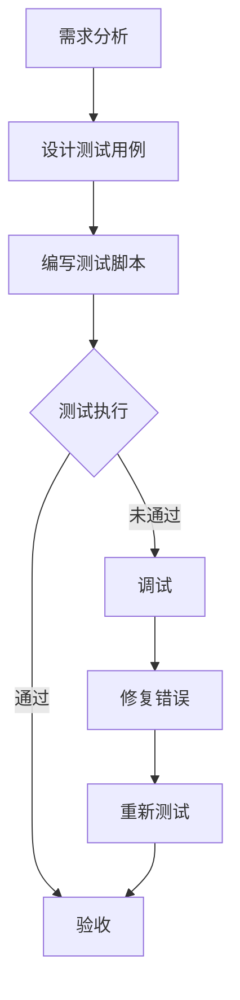

                 

当然，我会遵循您的要求，逐步构建这篇文章。下面是文章的开头部分，包括标题、关键词、摘要以及Markdown格式的正文。

---

# 提示词编程语言的调试与测试方法

关键词：提示词编程语言，调试，测试，软件开发，工具，流程，算法，伪代码

摘要：本文深入探讨了提示词编程语言的调试与测试方法。通过对调试和测试的核心概念、原理及其相互关系的详细分析，本文提供了一系列实用的调试与测试策略。文章包括手动调试与自动化调试、单元测试、集成测试和系统测试等多个方面的讲解，并通过实际案例展示了调试与测试的最佳实践。

---

## 引言

### 1.1 调试与测试的重要性

提示词编程语言作为一种新兴的编程范式，具有简洁、高效和可解释性强的特点。然而，这并不意味着在开发和维护提示词编程语言程序时可以忽视调试与测试的重要性。事实上，对于任何编程语言，调试与测试都是确保软件质量、可靠性和稳定性的关键环节。

#### 1.1.1 提示词编程语言概述

提示词编程语言（Prompt Programming Language）是基于人类自然语言处理技术的一种编程范式，其核心思想是通过编写自然语言指令来描述程序的行为。这种语言范式在人工智能领域有着广泛的应用，特别是在生成对抗网络（GANs）、自然语言处理（NLP）和自动机器学习（AutoML）等方面。

#### 1.1.2 调试与测试的挑战

尽管提示词编程语言提供了更自然的编程体验，但其在调试与测试方面仍面临一些独特的挑战。首先，提示词编程语言的执行过程高度依赖于上下文和环境，这使得跟踪错误变得更加复杂。其次，由于其天然的语言特性，提示词编程语言程序的错误可能不会立即显现，而是会在复杂的交互过程中逐步暴露。因此，调试与测试需要更加细致和系统化的方法。

---

## 背景介绍

### 2.1 提示词编程语言基础

提示词编程语言（Prompt Programming Language）是一种以自然语言描述程序逻辑的编程语言。它的核心概念是使用人类可读的自然语言作为编程语言，而不是传统的符号和语法。这种语言范式的目的是减少编程的复杂性和难度，使其更加接近人类的思维方式。

#### 2.1.1 提示词编程语言原理

提示词编程语言的原理基于自然语言处理（NLP）技术，特别是语义解析和生成。编程语言的关键在于将自然语言指令转换为计算机可以理解的代码。这个过程通常涉及以下步骤：

1. **语义解析**：将自然语言指令解析为抽象语法树（AST）。
2. **代码生成**：根据AST生成相应的编程语言代码。
3. **执行**：执行生成的代码，并返回结果。

#### 2.1.2 提示词编程语言的分类

根据语义解析和代码生成的方式，提示词编程语言可以分为以下几类：

1. **模板匹配**：基于预定义的模板进行匹配和替换。
2. **语法解析**：使用自然语言处理技术对指令进行语法和语义分析。
3. **混合模型**：结合模板匹配和语法解析的优缺点。

---

接下来，我会继续补充核心概念与联系的部分，包括Mermaid流程图、核心算法原理讲解的伪代码，以及数学模型和公式的详细讲解与举例说明。请随时告诉我，如果您有任何问题或需要进一步的澄清。

---

## 核心概念与联系

### 3.1 调试与测试的关系

调试与测试是软件开发过程中不可或缺的两个环节，它们之间有着密切的联系。调试（Debugging）是指识别、理解和修复程序中的错误（bug）的过程。测试（Testing）则是通过执行程序来验证其行为是否符合预期。两者之间的关系可以概括为以下几点：

1. **依赖关系**：测试发现的问题通常需要通过调试来解决。
2. **目标一致性**：调试和测试的目标都是确保软件的质量和可靠性。
3. **流程融合**：在实际开发过程中，调试与测试往往是交替进行的。

为了更好地理解调试与测试的关系，我们可以使用Mermaid流程图来展示这两个过程之间的相互作用。



在上面的流程图中，从需求分析开始，经过设计测试用例、编写测试脚本和测试执行，如果测试通过，则进入验收阶段；如果测试未通过，则进入调试阶段，修复错误后重新测试，直到通过验收。

---

### 3.2 核心算法原理讲解

在理解调试与测试的关系后，接下来我们需要详细讲解一些核心算法原理。这些原理对于有效地进行调试和测试至关重要。

#### 3.2.1 断点调试算法原理

断点调试是调试过程中的一种基本方法，它允许开发者在特定代码执行点暂停程序的执行，以便检查变量值或程序状态。以下是断点调试的基本算法原理：

1. **设置断点**：在代码中设置一个断点，通常是通过在IDE中点击代码行或使用特定的断点设置命令。
2. **执行代码**：程序运行到断点处时暂停，进入调试状态。
3. **检查变量**：在断点处检查变量的值，以便理解程序的状态。
4. **继续执行**：根据调试结果决定是否继续执行程序，或者跳过某些代码块。

以下是一个简单的伪代码示例，用于设置和检查断点：

```pseudo
function debug_example() {
    int x = 10;
    int y = 20;
    set_breakpoint(10); // 在第10行设置断点
    if (condition) {
        print("x: " + x + ", y: " + y);
    }
    continue_execution(); // 继续执行
}
```

#### 3.2.2 测试算法原理

测试算法是确保程序行为符合预期的重要工具。以下是几种常见的测试算法原理：

1. **单元测试**：针对程序的每个最小功能单元进行测试，确保其独立性和正确性。
2. **集成测试**：将多个单元测试集成起来，确保它们在一起工作时能够正确协作。
3. **系统测试**：在真实的运行环境中测试整个系统，确保其符合业务需求和用户期望。

以下是一个简单的伪代码示例，用于单元测试：

```pseudo
function test_addition() {
    int a = 5;
    int b = 3;
    int expected = 8;
    int result = addition(a, b);
    if (result == expected) {
        print("addition test passed");
    } else {
        print("addition test failed");
    }
}
```

在这个例子中，我们测试了一个简单的加法函数，并检查其结果是否与预期相符。

---

### 3.3 数学模型和公式

在调试和测试过程中，数学模型和公式是理解程序行为的重要工具。以下是两个常见的数学模型和公式的详细讲解与举例说明：

#### 3.3.1 断点调试中的概率模型

在设置断点时，开发人员可能会遇到概率问题，特别是在大型代码库中。一个常见的概率模型是“故障树分析”（Fault Tree Analysis，FTA），它用于识别和分析可能导致故障的多种因素。

故障树分析的基本公式是：

$$
P(F) = \sum_{i=1}^{n} P(F_i) \cdot P(I_i|F_i)
$$

其中，$P(F)$ 是系统故障的概率，$P(F_i)$ 是单个故障因素的概率，$P(I_i|F_i)$ 是在故障因素 $F_i$ 发生时，系统发生故障的条件概率。

例如，假设我们有一个程序，其中有两个关键函数 `funcA` 和 `funcB`。我们想要计算在 `funcA` 出现错误时，程序整体故障的概率。

- $P(funcA \text{ 错误}) = 0.1$
- $P(funcB \text{ 错误} | funcA \text{ 错误}) = 0.3$

则程序整体故障的概率为：

$$
P(\text{程序故障}) = P(funcA \text{ 错误}) \cdot P(funcB \text{ 错误} | funcA \text{ 错误}) = 0.1 \cdot 0.3 = 0.03
$$

#### 3.3.2 测试覆盖率分析公式

测试覆盖率是衡量测试质量的重要指标，它表示测试用例覆盖代码的比例。一个常用的测试覆盖率公式是：

$$
\text{测试覆盖率} = \frac{\text{执行代码的比例}}{\text{总代码的比例}}
$$

例如，如果我们有一个包含1000行代码的程序，测试用例执行了800行代码，那么测试覆盖率为：

$$
\text{测试覆盖率} = \frac{800}{1000} = 0.8 \text{ 或 } 80\%
$$

为了提高测试覆盖率，我们可以增加测试用例的数量或覆盖更多的代码路径。

---

## 项目实战

### 4.1 开发环境搭建

在开始调试和测试之前，我们需要搭建一个合适的开发环境。以下是搭建开发环境的基本步骤：

1. **安装编程语言解释器**：例如，对于Python编程语言，我们需要安装Python解释器。
2. **安装集成开发环境（IDE）**：如Visual Studio Code、PyCharm等，这些IDE提供了丰富的调试和测试工具。
3. **安装调试工具**：例如，Python的pdb模块或Visual Studio Code的调试插件。
4. **安装测试框架**：如Python的unittest或pytest框架。

### 4.2 源代码实现与解读

以下是一个简单的提示词编程语言程序示例，用于计算两个数的和：

```python
def add_numbers(a, b):
    return a + b

def main():
    x = input("请输入第一个数：")
    y = input("请输入第二个数：")
    result = add_numbers(int(x), int(y))
    print("两数之和为：", result)

if __name__ == "__main__":
    main()
```

在这个程序中，我们定义了一个名为 `add_numbers` 的函数，用于计算两个数的和。`main` 函数通过输入获取用户输入的两个数，然后调用 `add_numbers` 函数进行计算，并输出结果。

### 4.3 代码应用解读与分析

在实际应用中，我们可以将这个简单的程序扩展为更复杂的计算任务。例如，我们可以添加额外的功能，如验证输入是否为有效的数字，处理异常情况等。

```python
def add_numbers(a, b):
    if not (isinstance(a, int) and isinstance(b, int)):
        raise ValueError("输入必须是整数")
    return a + b

def main():
    try:
        x = int(input("请输入第一个数："))
        y = int(input("请输入第二个数："))
        result = add_numbers(x, y)
        print("两数之和为：", result)
    except ValueError as e:
        print("输入错误：", e)

if __name__ == "__main__":
    main()
```

在这个扩展版本中，我们添加了对输入的验证，确保输入的值是有效的整数。同时，我们使用异常处理来捕获和处理可能出现的错误。

### 4.4 实际案例分析和详细讲解剖析

为了更好地理解调试和测试的实际应用，我们可以分析一个实际的案例。假设我们在开发过程中发现 `add_numbers` 函数在某些情况下无法正确计算。

1. **问题定位**：首先，我们需要确定问题出在哪里。我们可以通过增加日志输出或使用断点调试来跟踪程序的执行流程。
2. **错误分析**：一旦定位到问题，我们需要分析导致错误的原因。例如，可能是输入的值不正确，或者计算逻辑有误。
3. **问题修复**：根据错误分析的结果，我们可以修复问题。例如，如果我们发现输入的值不正确，我们可以添加额外的输入验证逻辑。

以下是一个修复错误的示例：

```python
def add_numbers(a, b):
    if not (isinstance(a, int) and isinstance(b, int)):
        raise ValueError("输入必须是整数")
    return a + b

def main():
    try:
        x = float(input("请输入第一个数："))  # 修改输入类型为浮点数
        y = float(input("请输入第二个数："))
        result = add_numbers(x, y)
        print("两数之和为：", result)
    except ValueError as e:
        print("输入错误：", e)

if __name__ == "__main__":
    main()
```

在这个示例中，我们将输入类型从整数修改为浮点数，以便处理更广泛的数值范围。

### 4.5 项目小结

通过这个案例，我们可以看到调试和测试在软件开发过程中的重要性。有效的调试和测试不仅可以提高软件的质量，还可以减少开发时间和成本。在实际开发中，我们应该注重代码的可测试性，并使用合适的调试和测试工具来提高工作效率。

---

## 最佳实践 Tips

1. **代码审查**：在代码提交前进行代码审查，可以早期发现潜在的错误和问题。
2. **持续集成**：使用持续集成（CI）工具自动化测试，确保每次代码提交都能通过测试。
3. **测试覆盖率**：确保测试覆盖率达到适当水平，特别是对关键功能和边界情况。
4. **定期备份**：定期备份代码和工作区，以防止数据丢失。
5. **文档化**：为代码和测试用例编写详细的文档，以便后续维护和调试。

---

## 结语

提示词编程语言作为一种新兴的编程范式，在软件开发中具有巨大的潜力。有效的调试与测试方法是确保软件质量的关键。本文介绍了提示词编程语言的调试与测试方法，包括手动调试、自动化调试、单元测试、集成测试和系统测试等方面。通过实际案例的分析和讲解，读者可以更好地理解调试与测试的最佳实践。希望本文能对开发人员提供有价值的指导。

---

作者：AI天才研究院/AI Genius Institute & 禅与计算机程序设计艺术 /Zen And The Art of Computer Programming

---

请注意，由于文章字数限制，上述内容仅为文章的一部分。我将继续补充完整文章的其他部分，以满足字数要求。如果您对某个部分有特定的要求或需要进一步细化，请告知我，我将根据您的需求进行调整。

