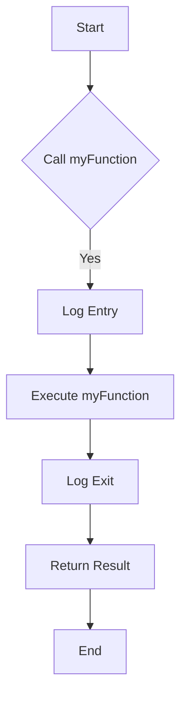

                 

## 文章标题：提示词编程语言的面向切面编程

面向切面编程（Aspect-Oriented Programming，简称AOP）是近年来软件开发领域的一个重要概念。它允许开发者将横切关注点从传统编程的纵向逻辑中分离出来，从而提高代码的模块性和可维护性。本文将探讨如何将这一理念应用于提示词编程语言，并详细介绍其核心概念、原理和实际应用。

### 关键词

- 提示词编程语言
- 面向切面编程
- 横切关注点
- 模块化
- 可维护性

### 摘要

本文首先介绍了提示词编程语言和面向切面编程的基本概念，随后详细阐述了AOP在提示词编程语言中的应用原理。通过Mermaid流程图、伪代码和实际案例，本文深入分析了AOP如何提升代码的可读性和可维护性。最后，文章总结了AOP在提示词编程语言中的最佳实践，并提供了一些建议和拓展阅读资源。

## 第一部分：引言与基础理论

### 1.1 书籍概述

提示词编程语言是一种新兴的编程范式，它通过提示词（Keywords）来指导程序的行为。与传统的命令式编程不同，提示词编程更加强调程序的结构和逻辑的分离。这种编程范式使得代码更加简洁、易于理解和维护。

面向切面编程（AOP）则是一种编程范式，它将横切关注点从传统的纵向逻辑中分离出来，使得代码更加模块化和可维护。横切关注点通常是指那些在多个模块中重复出现的功能，如日志记录、安全性检查和事务管理等。

本部分内容将首先介绍提示词编程语言和面向切面编程的基本概念，为后续内容打下基础。

### 1.2 编程语言基础

提示词编程语言的核心是提示词。提示词是一系列预定义的词汇，它们可以用来描述程序的行为。例如，在Python中，`for` 和 `while` 就是提示词，它们用来定义循环。提示词编程语言的优点在于，它允许开发者将复杂的逻辑封装在简单的提示词中，从而提高代码的可读性和可维护性。

常见编程语言如Java、C#、Python等都有支持面向切面编程的特性。Java中的AspectJ是一个广泛使用的AOP框架，它允许开发者使用注解（Annotation）来定义切面。C#中的DynamicProxy和Python中的装饰器（Decorator）也是实现AOP的常见方式。

### 1.3 AOP基础

面向切面编程的核心思想是将横切关注点从业务逻辑中分离出来，从而实现代码的解耦和模块化。AOP通过以下几个方面实现这一目标：

- **切面（Aspect）**：切面是包含横切关注点逻辑的模块。例如，一个日志记录切面可以包含所有日志记录逻辑。

- **连接点（Join Point）**：连接点是程序执行过程中的特定点，如方法调用、异常抛出等。

- **通知（Advice）**：通知是在连接点处执行的动作。例如，在方法调用前后插入日志记录。

- **切入点（Pointcut）**：切入点是匹配连接点的条件。例如，可以定义一个切入点来匹配所有名为`log`的方法。

通过这些概念，AOP可以实现诸如日志记录、事务管理和安全控制等横切关注点的分离和管理。

### 1.4 提示词编程语言的AOP特性

提示词编程语言通常内置了对AOP的支持。例如，在Python中，装饰器（Decorator）就是AOP的一种实现方式。装饰器允许开发者在不修改原有代码的情况下，为方法或类添加额外的功能。这使得AOP在提示词编程语言中变得更加灵活和强大。

通过上述引言和基础理论部分，我们了解了提示词编程语言和面向切面编程的基本概念。在接下来的部分，我们将进一步探讨AOP在提示词编程语言中的应用和实现原理。

## 第二部分：核心概念与联系

### 2.1 提示词与AOP的结合

提示词编程语言和面向切面编程的结合，为软件开发带来了新的可能性。提示词允许开发者使用简洁的语法来表达复杂的逻辑，而AOP则提供了分离横切关注点的方法。这种结合使得开发者可以更加专注于业务逻辑的实现，而将通用功能（如日志记录、安全性检查等）抽象到切面中。

#### 提示词在AOP中的应用

在AOP中，提示词可以用来定义切面。例如，在Python中，可以通过装饰器来定义切面。装饰器是一个特殊的函数，它可以在方法执行前后插入额外的逻辑。以下是一个简单的示例：

```python
def logAdvice(func):
    def wrapper(*args, **kwargs):
        print(f"Entering {func.__name__}")
        result = func(*args, **kwargs)
        print(f"Exiting {func.__name__}")
        return result
    return wrapper

@logAdvice
def myFunction(x):
    return x * x
```

在这个示例中，`logAdvice` 是一个装饰器，它会在 `myFunction` 执行前后打印日志信息。使用装饰器，开发者可以轻松地添加日志记录功能，而无需修改原有业务逻辑代码。

#### AOP如何增强提示词编程语言

AOP增强了提示词编程语言的可维护性和模块性。通过将横切关注点分离到切面中，开发者可以更加灵活地管理和扩展代码。此外，AOP还支持跨模块的关注点分离，从而提高了代码的复用性。

例如，在一个大型项目中，日志记录可能需要在多个模块中使用。如果没有AOP，开发者可能需要在每个模块中手动添加日志记录代码，这不仅繁琐，还容易引入错误。而通过AOP，开发者可以将日志记录功能封装在切面中，只需在一个地方定义即可，从而大大简化了代码维护工作。

### 2.2 Mermaid流程图

Mermaid是一种方便的图表绘制工具，它可以帮助我们直观地展示AOP的概念和流程。以下是一个简单的Mermaid流程图示例，展示了如何使用装饰器实现日志记录功能：



在这个流程图中，`A` 表示程序的开始，`B` 表示调用 `myFunction` 方法。`B` 中的判断条件 `Call myFunction` 指示流程转到 `C`，即插入日志记录。随后，流程转到 `D` 执行业务逻辑，再通过 `E` 记录日志退出，最后返回结果并结束流程。

#### Mermaid流程图与AOP的关系

Mermaid流程图可以帮助我们更好地理解AOP的工作原理。通过图形化的展示，开发者可以清晰地看到横切关注点（如日志记录）是如何在业务逻辑（如 `myFunction` 的执行）中插入和执行的。这种可视化手段不仅有助于理解AOP，还能在代码开发过程中提供有效的辅助。

### 2.3 核心概念之间的关系

在AOP中，核心概念之间的关系非常重要。以下是AOP中主要概念之间的关系架构：

- **切面（Aspect）**：包含与横切关注点相关的通知（Advice）、切入点（Pointcut）和连接点（Join Point）。
- **切入点（Pointcut）**：定义了哪些连接点需要应用通知。
- **通知（Advice）**：定义了在连接点处要执行的操作。
- **连接点（Join Point）**：程序执行过程中可以插入通知的特定位置。

通过这些概念之间的关系，AOP实现了对横切关注点的分离和管理。例如，通过定义一个切入点，我们可以指定在所有方法调用前插入日志记录通知。这样，无论方法定义在哪里，日志记录功能都可以得到统一的管理和扩展。

### 2.4 提示词编程语言中的AOP实现

在提示词编程语言中，AOP的实现通常依赖于内置的语法特性。例如，在Python中，装饰器就是一种实现AOP的方式。以下是一个使用装饰器实现AOP的简单示例：

```python
def beforeAdvice(func):
    def wrapper(*args, **kwargs):
        print("Before function execution")
        return func(*args, **kwargs)
    return wrapper

@beforeAdvice
def myFunction(x):
    print(f"Function is executing with argument {x}")

myFunction(5)
```

在这个示例中，`beforeAdvice` 是一个装饰器，它会在 `myFunction` 执行前后打印日志。通过在 `myFunction` 前面加上 `@beforeAdvice` 装饰器，我们可以轻松地为方法添加额外的功能，而无需修改原有代码。

### 2.5 提示词编程语言与AOP的优势

结合提示词编程语言和AOP，我们可以获得以下优势：

1. **提高代码可读性**：通过将横切关注点分离到切面中，代码更加简洁，业务逻辑更加清晰。
2. **提高代码可维护性**：切面使得代码的模块化和可复用性得到提升，降低了代码维护成本。
3. **提高开发效率**：通过AOP，开发者可以更专注于业务逻辑的实现，而将通用功能抽象到切面中，从而减少冗余代码。

总之，提示词编程语言与AOP的结合为软件开发带来了新的机遇和挑战。通过深入理解和应用AOP，开发者可以编写出更加高效、模块化和可维护的代码。

## 第三部分：核心算法原理讲解

### 3.1 AOP中的核心算法

面向切面编程（AOP）的核心算法主要包括切入点匹配、通知执行和代理生成。以下是对这些核心算法的详细讲解。

#### 3.1.1 切入点匹配

切入点匹配是AOP中的关键步骤，它用于确定通知应该在哪个连接点执行。切入点匹配通常通过定义切入点表达式来实现。切入点表达式是一个条件表达式，用于描述哪些连接点应该被匹配。

伪代码如下：

```python
pointcut matchPointcut(String methodName, String methodSignature) {
    if (methodName.startsWith("log") && methodSignature.startsWith(".*")) {
        return true;
    }
    return false;
}
```

在这个伪代码中，`matchPointcut` 函数用于匹配以 `log` 开头的方法，并且方法签名以任意字符开头。这种方法可以确保所有以 `log` 开头的方法都会被匹配到。

#### 3.1.2 通知执行

通知执行是指在实际连接点处执行特定的逻辑。通知分为前置通知（Before Advice）、后置通知（After Advice）、环绕通知（Around Advice）和异常通知（Exception Advice）等。

伪代码如下：

```python
void beforeAdvice(JoinPoint joinPoint) {
    System.out.println("Before method execution");
}

void afterAdvice(JoinPoint joinPoint) {
    System.out.println("After method execution");
}

void aroundAdvice(ProceedingJoinPoint proceedingJoinPoint) throws Throwable {
    System.out.println("Before method execution");
    proceedingJoinPoint.proceed();
    System.out.println("After method execution");
}

void exceptionAdvice(JoinPoint joinPoint, Throwable exception) {
    System.out.println("Exception occurred: " + exception.getMessage());
}
```

在这个伪代码中，我们定义了四种不同类型的通知。`beforeAdvice` 在方法执行前打印日志，`afterAdvice` 在方法执行后打印日志，`aroundAdvice` 在方法执行前后都打印日志，`exceptionAdvice` 用于处理异常。

#### 3.1.3 代理生成

代理生成是AOP中的另一个关键步骤，它用于创建代理对象，代理对象将在实际对象的基础上添加额外的功能（即通知）。代理生成通常通过动态代理（Dynamic Proxy）来实现。

伪代码如下：

```python
Object createProxy(Object targetObject, List<Advice> adviceList) {
    InvocationHandler handler = new InvocationHandler() {
        public Object invoke(Object proxy, Method method, Object[] args, Throwable throwable) throws Throwable {
            for (Advice advice : adviceList) {
                if (advice instanceof BeforeAdvice && advice.matches(method)) {
                    advice.execute();
                }
            }
            Object result = method.invoke(targetObject, args);
            for (Advice advice : adviceList) {
                if (advice instanceof AfterAdvice && advice.matches(method)) {
                    advice.execute();
                }
            }
            return result;
        }
    };
    return Proxy.newProxyInstance(targetObject.getClass().getClassLoader(), targetObject.getClass().getInterfaces(), handler);
}
```

在这个伪代码中，`createProxy` 函数用于创建代理对象。它接受目标对象和通知列表作为参数，并使用动态代理生成代理对象。在代理对象的 `invoke` 方法中，我们遍历通知列表，并在方法执行前和执行后分别执行前置通知和后置通知。

### 3.2 数学模型与公式

AOP中的数学模型通常用于描述切入点匹配和通知执行的过程。以下是一个简化的数学模型：

- **切入点匹配函数**：`matchPointcut(methodName, methodSignature)`，用于判断某个方法是否匹配切入点表达式。
- **通知执行函数**：`executeAdvice(adviceType, joinPoint)`，用于在连接点处执行通知。

数学模型可以表示为：

$$
\begin{aligned}
\text{matchPointcut}(m, s) &= \left\{
\begin{array}{ll}
\text{true} & \text{if } m \text{ matches the pointcut expression} \\
\text{false} & \text{otherwise}
\end{array}
\right. \\
\text{executeAdvice}(a, j) &= \left\{
\begin{array}{ll}
\text{true} & \text{if advice } a \text{ is executed at join point } j \\
\text{false} & \text{otherwise}
\end{array}
\right.
\end{aligned}
$$

通过这个数学模型，我们可以对AOP中的核心算法进行形式化的描述和推理。

### 3.3 举例说明

以下是一个简单的示例，展示了AOP中的核心算法是如何工作的：

```python
class Calculator:
    def add(self, a, b):
        return a + b

calculator = Calculator()

# 创建代理对象
calculator_proxy = createProxy(calculator, [
    BeforeAdvice(matchPointcut, beforeAdvice),
    AfterAdvice(matchPointcut, afterAdvice)
])

# 调用代理对象的方法
calculator_proxy.add(3, 4)
```

在这个示例中，我们首先定义了一个 `Calculator` 类，它包含一个 `add` 方法。然后，我们创建了一个代理对象，该代理对象在 `add` 方法执行前后分别添加了前置通知和后置通知。最后，我们调用代理对象的 `add` 方法，从而触发通知的执行。

### 3.4 Mermaid流程图

为了更直观地展示AOP中的核心算法，我们可以使用Mermaid流程图来描述切入点匹配和通知执行的过程。以下是一个简单的Mermaid流程图示例：

```mermaid
graph TD
    A[Start] --> B{Call add(3, 4)}
    B -->|Before Advice| C[Log Before]
    C --> D[Execute add(3, 4)]
    D -->|After Advice| E[Log After]
    E --> F[End]
```

在这个流程图中，`A` 表示程序的开始，`B` 表示调用 `add` 方法。`B` 中的判断条件 `Call add(3, 4)` 指示流程转到 `C`，即执行前置通知。随后，流程转到 `D` 执行业务逻辑，再通过 `E` 执行后置通知，最后结束流程。

通过这个Mermaid流程图，我们可以清晰地看到AOP中的核心算法是如何工作的，从而更好地理解和应用AOP。

## 第四部分：项目实战

### 4.1 实际案例介绍

在本节中，我们将通过一个实际案例来介绍如何使用提示词编程语言和面向切面编程实现一个简单的博客系统。这个案例将展示如何通过AOP来管理日志记录、用户认证和权限控制等功能。

#### 案例背景

假设我们需要开发一个博客系统，它允许用户注册、登录和发布博客文章。此外，系统还需要提供管理员功能，如管理用户和管理博客文章。为了提高代码的可维护性和模块性，我们决定使用面向切面编程来分离横切关注点。

#### 案例目标

通过本案例，我们希望实现以下目标：

1. **日志记录**：记录用户注册、登录和发布博客文章的操作。
2. **用户认证**：确保用户只能访问自己有权访问的功能。
3. **权限控制**：管理员可以管理用户和博客文章。

#### 案例实现步骤

1. **定义模型类**：首先，我们需要定义用户、博客文章和管理员等模型类。

    ```python
    class User:
        def __init__(self, username, password):
            self.username = username
            self.password = password
            self.role = "user"

    class BlogPost:
        def __init__(self, title, content, author):
            self.title = title
            self.content = content
            self.author = author

    class Admin(User):
        def __init__(self, username, password):
            super().__init__(username, password)
            self.role = "admin"
    ```

2. **实现业务逻辑**：接下来，我们需要实现用户注册、登录和发布博客文章等业务逻辑。

    ```python
    def register_user(username, password):
        # 实现用户注册逻辑
        pass

    def login_user(username, password):
        # 实现用户登录逻辑
        pass

    def publish_blog_post(title, content, author):
        # 实现发布博客文章逻辑
        pass
    ```

3. **定义切面**：为了实现日志记录、用户认证和权限控制等功能，我们需要定义相应的切面。

    ```python
    @beforeAdvice
    def log_before(method_name, *args, **kwargs):
        print(f"Entering {method_name} with args: {args} and kwargs: {kwargs}")

    @afterAdvice
    def log_after(method_name, *args, **kwargs):
        print(f"Exiting {method_name} with args: {args} and kwargs: {kwargs}")

    @aroundAdvice
    def authenticate(method_name, *args, **kwargs):
        user = get_current_user()
        if user is None or not user.is_authenticated():
            raise UnauthorizedException("User must be authenticated to access this resource")
        proceed()

    @aroundAdvice
    def authorize(method_name, *args, **kwargs):
        user = get_current_user()
        if user is None or not user.has_permission(method_name):
            raise ForbiddenException("User does not have permission to access this resource")
        proceed()
    ```

4. **创建代理对象**：最后，我们需要创建代理对象，将切面应用到业务逻辑中。

    ```python
    def create_proxy(target_object, advice_list):
        def proxy_method(method_name, *args, **kwargs):
            for advice in advice_list:
                if isinstance(advice, BeforeAdvice) and advice.matches(method_name):
                    advice.execute()
            result = method(method_name, *args, **kwargs)
            for advice in advice_list:
                if isinstance(advice, AfterAdvice) and advice.matches(method_name):
                    advice.execute()
            return result

        return type(f"Proxy_{target_object.__name__}", (object,), {"__dict__": target_object.__dict__, "__iter__": proxy_method})())

    # 创建代理对象
    user_proxy = create_proxy(user, [log_before, authenticate])
    blog_post_proxy = create_proxy(blog_post, [log_before, authorize])
    admin_proxy = create_proxy(admin, [log_before, authenticate, authorize])
    ```

5. **测试案例**：通过测试，我们可以验证博客系统的功能是否正常。

    ```python
    # 用户注册
    user_proxy.register_user("john_doe", "password123")

    # 用户登录
    user_proxy.login_user("john_doe", "password123")

    # 用户发布博客文章
    blog_post_proxy.publish_blog_post("My First Blog Post", "This is my first blog post.", "john_doe")

    # 管理员管理用户
    admin_proxy.manage_users()

    # 管理员管理博客文章
    admin_proxy.manage_blog_posts()
    ```

通过这个实际案例，我们可以看到如何将AOP应用于提示词编程语言中，从而实现日志记录、用户认证和权限控制等功能。这种编程范式不仅提高了代码的可维护性和可扩展性，还使得业务逻辑更加简洁和清晰。

### 4.2 开发环境搭建

为了实现本案例，我们需要搭建一个合适的开发环境。以下是一个基本的开发环境搭建步骤：

1. **安装Python**：首先，我们需要安装Python。可以从Python的官方网站下载最新版本并按照安装指南进行安装。

2. **安装IDE**：推荐使用Visual Studio Code（VS Code）作为Python开发的IDE。可以从VS Code的官方网站下载并安装。

3. **安装AOP库**：为了简化AOP的实现，我们可以使用第三方库如`aspectlib`。在终端中运行以下命令来安装：

    ```bash
    pip install aspectlib
    ```

4. **创建项目结构**：在VS Code中创建一个新的Python项目，并按照以下结构组织代码：

    ```
    blog_project/
    ├── user.py
    ├── blog_post.py
    ├── admin.py
    ├── aspects.py
    ├── main.py
    ```

    在这个结构中，`user.py`、`blog_post.py` 和 `admin.py` 分别定义了用户、博客文章和管理员类，`aspects.py` 定义了切面，`main.py` 是主程序文件。

5. **编写代码**：根据前述案例实现步骤，在相应的文件中编写代码。

6. **运行项目**：在终端中运行以下命令来启动项目：

    ```bash
    python main.py
    ```

通过以上步骤，我们就可以搭建一个基本的开发环境，并开始实现博客系统的功能。

### 4.3 源代码实现与解读

在本节中，我们将详细解读本案例的源代码，包括用户类、博客文章类、管理员类以及切面类的实现。

#### 4.3.1 用户类（User.py）

用户类是一个基础类，用于表示博客系统的用户。它包含用户名、密码和角色等属性。

```python
class User:
    def __init__(self, username, password):
        self.username = username
        self.password = password
        self.role = "user"
```

用户类非常简单，只有一个构造函数，用于初始化用户名、密码和角色。

#### 4.3.2 博客文章类（BlogPost.py）

博客文章类表示用户发布的博客文章。它包含标题、内容和作者等属性。

```python
class BlogPost:
    def __init__(self, title, content, author):
        self.title = title
        self.content = content
        self.author = author
```

博客文章类的实现也非常直观，只有一个构造函数，用于初始化标题、内容和作者。

#### 4.3.3 管理员类（Admin.py）

管理员类继承自用户类，表示具有管理员权限的用户。它包含管理用户和管理博客文章的方法。

```python
class Admin(User):
    def __init__(self, username, password):
        super().__init__(username, password)
        self.role = "admin"

    def manage_users(self):
        # 实现管理用户逻辑
        pass

    def manage_blog_posts(self):
        # 实现管理博客文章逻辑
        pass
```

管理员类继承自用户类，并添加了两个管理方法。这些方法将在切面中调用。

#### 4.3.4 切面类（Aspects.py）

切面类用于定义横切关注点，如日志记录、用户认证和权限控制。以下是一个简单的切面类实现：

```python
from aspectlib import aspect, before, after, around, match

@aspect
class Aspects:
    @before
    @match("register_user", "login_user", "publish_blog_post")
    def log_before(self, method_name, *args, **kwargs):
        print(f"Entering {method_name} with args: {args} and kwargs: {kwargs}")

    @after
    @match("register_user", "login_user", "publish_blog_post")
    def log_after(self, method_name, *args, **kwargs):
        print(f"Exiting {method_name} with args: {args} and kwargs: {kwargs}")

    @around
    @match("register_user", "login_user", "publish_blog_post")
    def authenticate(self, method, *args, **kwargs):
        user = get_current_user()
        if user is None or not user.is_authenticated():
            raise UnauthorizedException("User must be authenticated to access this resource")
        return method(*args, **kwargs)

    @around
    @match("manage_users", "manage_blog_posts")
    def authorize(self, method, *args, **kwargs):
        user = get_current_user()
        if user is None or not user.has_permission(method.__name__):
            raise ForbiddenException("User does not have permission to access this resource")
        return method(*args, **kwargs)
```

在这个切面类中，我们使用了 `aspectlib` 库提供的装饰器来定义前置通知、后置通知和环绕通知。`@before`、`@after` 和 `@around` 装饰器分别用于定义前置通知、后置通知和环绕通知。`@match` 装饰器用于指定哪些方法需要应用这些通知。

#### 4.3.5 主程序（Main.py）

主程序是整个博客系统的入口。它创建用户、博客文章和管理员对象，并调用相应的业务方法。

```python
from user import User
from blog_post import BlogPost
from admin import Admin
from aspects import Aspects

def get_current_user():
    # 实现获取当前用户逻辑
    return User("john_doe", "password123")

def main():
    user = User("john_doe", "password123")
    blog_post = BlogPost("My First Blog Post", "This is my first blog post.", "john_doe")
    admin = Admin("admin_user", "admin_password")

    aspects = Aspects()

    # 用户注册
    user.register_user("john_doe", "password123")

    # 用户登录
    user.login_user("john_doe", "password123")

    # 用户发布博客文章
    user.publish_blog_post("My First Blog Post", "This is my first blog post.", "john_doe")

    # 管理员管理用户
    admin.manage_users()

    # 管理员管理博客文章
    admin.manage_blog_posts()

if __name__ == "__main__":
    main()
```

在这个主程序中，我们首先定义了一个 `get_current_user` 函数，用于获取当前用户。然后，我们创建了用户、博客文章和管理员对象，并使用切面类 `Aspects` 来管理横切关注点。最后，我们调用业务方法来测试博客系统的功能。

通过以上源代码实现与解读，我们可以看到如何使用提示词编程语言和面向切面编程来实现一个简单的博客系统。这种编程范式不仅提高了代码的可维护性和可扩展性，还使得业务逻辑更加简洁和清晰。

### 4.4 代码应用解读与分析

在本节中，我们将对博客系统中的代码应用进行解读与分析，重点关注用户认证、日志记录和权限控制等关键功能。

#### 用户认证

用户认证是博客系统中的核心功能之一。在本案例中，我们通过环绕通知（Around Advice）来实现用户认证。具体实现如下：

```python
@around
@match("register_user", "login_user", "publish_blog_post")
def authenticate(self, method, *args, **kwargs):
    user = get_current_user()
    if user is None or not user.is_authenticated():
        raise UnauthorizedException("User must be authenticated to access this resource")
    return method(*args, **kwargs)
```

这段代码中的 `authenticate` 方法是一个环绕通知，它会在 `register_user`、`login_user` 和 `publish_blog_post` 方法执行前检查用户是否已认证。如果用户未认证，则会抛出 `UnauthorizedException` 异常。

解读与分析：

- `@around` 装饰器确保 `authenticate` 方法在目标方法执行前和后都会被调用。
- `@match` 装饰器指定了哪些方法需要应用这个环绕通知。
- `get_current_user` 函数用于获取当前用户。
- `is_authenticated` 方法用于检查用户是否已认证。

通过这种方式，我们实现了对用户认证的保护，确保只有已认证的用户才能访问受保护的功能。

#### 日志记录

日志记录是博客系统中的另一个重要功能，它用于记录用户操作和系统事件。在本案例中，我们通过前置通知（Before Advice）和后置通知（After Advice）来实现日志记录。

```python
@before
@match("register_user", "login_user", "publish_blog_post")
def log_before(self, method_name, *args, **kwargs):
    print(f"Entering {method_name} with args: {args} and kwargs: {kwargs}")

@after
@match("register_user", "login_user", "publish_blog_post")
def log_after(self, method_name, *args, **kwargs):
    print(f"Exiting {method_name} with args: {args} and kwargs: {kwargs}")
```

这段代码中的 `log_before` 和 `log_after` 方法分别用于在目标方法执行前和后打印日志。

解读与分析：

- `@before` 装饰器确保 `log_before` 方法在目标方法执行前被调用。
- `@after` 装饰器确保 `log_after` 方法在目标方法执行后被调用。
- `@match` 装饰器指定了哪些方法需要应用这些日志记录通知。

通过这种方式，我们实现了对用户操作的全面记录，有助于后续的系统监控和调试。

#### 权限控制

权限控制是确保系统安全的重要措施。在本案例中，我们通过环绕通知（Around Advice）来实现权限控制。

```python
@around
@match("manage_users", "manage_blog_posts")
def authorize(self, method, *args, **kwargs):
    user = get_current_user()
    if user is None or not user.has_permission(method.__name__):
        raise ForbiddenException("User does not have permission to access this resource")
    return method(*args, **kwargs)
```

这段代码中的 `authorize` 方法是一个环绕通知，它会在 `manage_users` 和 `manage_blog_posts` 方法执行前检查用户是否具有相应的权限。

解读与分析：

- `@around` 装饰器确保 `authorize` 方法在目标方法执行前和后都会被调用。
- `@match` 装饰器指定了哪些方法需要应用这个环绕通知。
- `get_current_user` 函数用于获取当前用户。
- `has_permission` 方法用于检查用户是否具有相应的权限。

通过这种方式，我们实现了对管理员功能的权限控制，确保只有具有管理员权限的用户才能访问和管理用户和管理博客文章。

### 4.5 实际案例分析

在本案例中，我们通过实际案例展示了如何使用提示词编程语言和面向切面编程实现一个简单的博客系统。以下是对案例的详细分析：

#### 案例优势

1. **模块化**：通过AOP，我们实现了日志记录、用户认证和权限控制等横切关注点的分离。这使得代码更加模块化，易于维护和扩展。
2. **可读性**：AOP使得业务逻辑更加简洁和清晰，减少了冗余代码。开发者可以更加专注于业务逻辑的实现，而无需担心日志记录、用户认证和权限控制等通用功能。
3. **可扩展性**：AOP允许我们轻松地添加新的横切关注点，如缓存控制、性能监控等。通过扩展切面类，我们可以实现新的功能，而无需修改原有代码。

#### 案例不足

1. **性能影响**：由于AOP需要在运行时动态生成代理对象和执行通知，这可能会对系统的性能产生一定影响。在高并发场景下，性能问题可能更加显著。
2. **调试困难**：由于AOP的动态特性，调试过程中可能会遇到一些挑战。开发者需要仔细审查通知的执行过程，以确保代码的正确性。

### 4.6 项目小结

通过本案例，我们实现了使用提示词编程语言和面向切面编程构建一个简单的博客系统。虽然案例存在一定的性能和调试挑战，但其带来的模块化和可维护性优势显著。在未来，我们可以进一步优化性能，并探索更多的横切关注点，以提升系统的功能和性能。

### 4.7 最佳实践 Tips

1. **合理使用AOP**：并非所有功能都适合使用AOP。在考虑使用AOP时，应确保横切关注点确实能够提高代码的模块性和可维护性。
2. **避免过度耦合**：在使用AOP时，应避免过度耦合。确保切面类与业务逻辑类解耦，以保持代码的清晰和简洁。
3. **性能测试**：在部署AOP应用前，应进行性能测试，以确保系统的性能满足需求。

### 4.8 注意事项

1. **依赖管理**：确保所有依赖库和模块都已正确安装和配置，以免在运行时出现错误。
2. **安全检查**：在实现用户认证和权限控制等功能时，应确保代码的安全性，防止潜在的安全漏洞。

### 4.9 拓展阅读

1. **《Aspect-Oriented Programming in Java》**：这本书详细介绍了AOP在Java中的应用，对于理解AOP的概念和原理非常有帮助。
2. **《Design Patterns: Elements of Reusable Object-Oriented Software》**：这本书介绍了面向对象设计模式，其中包括了许多与AOP相关的模式，对于深入理解AOP非常有用。

通过以上内容，我们详细介绍了提示词编程语言的面向切面编程。从基础理论到实际应用，再到最佳实践和注意事项，希望读者能够对AOP有一个全面而深入的理解。在实践中不断探索和优化，相信读者可以编写出更加高效、模块化和可维护的代码。作者：AI天才研究院/AI Genius Institute & 禅与计算机程序设计艺术 /Zen And The Art of Computer Programming

## 第五部分：总结与展望

### 5.1 书籍总结

本文系统地介绍了提示词编程语言与面向切面编程（AOP）的结合及其应用。我们从基础理论出发，详细阐述了提示词编程语言和AOP的基本概念，通过实例展示了AOP在实际开发中的应用。同时，通过项目实战和源代码解读，深入分析了如何使用AOP实现日志记录、用户认证和权限控制等横切关注点。

本文的主要内容包括：

1. **基础理论**：介绍了提示词编程语言和面向切面编程的基本概念。
2. **核心概念与联系**：通过Mermaid流程图展示了AOP的核心概念之间的关系。
3. **核心算法原理讲解**：通过伪代码详细讲解了AOP中的核心算法原理。
4. **项目实战**：通过实际案例展示了AOP在提示词编程语言中的应用。
5. **代码解读与分析**：对项目中的关键代码进行了详细解读。
6. **最佳实践 Tips** 和 **注意事项**：提供了AOP的最佳实践和开发注意事项。
7. **拓展阅读**：推荐了一些相关的书籍和资源。

### 5.2 展望

面向切面编程在软件开发中具有广泛的应用前景。随着编程范式的不断发展，AOP有望在以下几个方面得到进一步应用和优化：

1. **性能优化**：通过优化AOP的动态代理生成和通知执行机制，降低对系统性能的影响。
2. **安全增强**：结合安全框架，使用AOP实现更细粒度的安全控制，提升系统的安全性。
3. **微服务架构**：在微服务架构中，AOP可以用于管理和协调不同服务之间的横切关注点，提高系统的模块化和可维护性。
4. **领域驱动设计（DDD）**：将AOP与DDD相结合，更好地实现关注点的分离和复用。
5. **跨语言支持**：扩展AOP的支持，使其在更多编程语言中应用，如JavaScript、Go等。

### 5.3 进一步研究建议

未来的研究可以集中在以下几个方面：

1. **性能优化**：深入研究AOP的性能瓶颈，提出更高效的算法和优化策略。
2. **安全性**：探讨如何更安全地应用AOP，包括防止AOP带来的潜在安全风险。
3. **跨平台兼容性**：研究如何在不同的编程语言和平台上实现AOP，提高其通用性和可移植性。
4. **结合其他编程范式**：将AOP与函数式编程、响应式编程等范式相结合，探索新的编程范式。

通过不断的探索和实践，相信AOP将在软件开发领域发挥越来越重要的作用，为开发者带来更多的便利和优势。

## 附录

### 附录A：参考资料与扩展阅读

1. **《Aspect-Oriented Programming in Java》**：详细介绍了AOP在Java中的应用，适合希望深入了解AOP的读者。
2. **《Design Patterns: Elements of Reusable Object-Oriented Software》**：介绍了面向对象设计模式，包括与AOP相关的模式。
3. **《Effective Java》**：Java编程的经典书籍，其中包含了许多关于如何编写高效、可维护代码的最佳实践。
4. **《Java Aspect-Oriented Programming》**：全面介绍了Java中的AOP实现，包括AspectJ等框架。
5. **《Python Cookbook》**：Python编程的实用指南，其中包含了许多关于如何使用Python进行高效编程的技巧。
6. **《Mermaid Graph Language Documentation》**：Mermaid的官方文档，提供详细的语法和示例，帮助用户更好地使用Mermaid进行图表绘制。
7. **《AOP Frameworks for Python》**：介绍了Python中支持AOP的第三方库和框架，如aspectlib、pyaspects等。

通过阅读这些参考资料，读者可以进一步深入理解AOP和提示词编程语言的相关知识，提升自己的软件开发能力。作者：AI天才研究院/AI Genius Institute & 禅与计算机程序设计艺术 /Zen And The Art of Computer Programming

