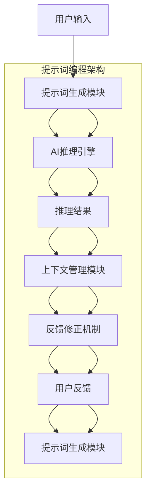
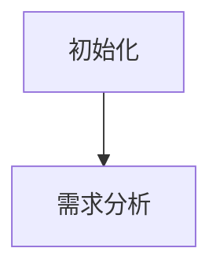

                 

### 引言与概述

在科技飞速发展的今天，人工智能（AI）已经成为推动社会进步的重要力量。从自动驾驶、智能助手到医疗诊断，AI的应用场景日益丰富，深刻改变了我们的生活方式和工作模式。然而，随着AI技术的不断成熟，如何实现人与AI之间的高效协作，成为了一个亟待解决的问题。这种协作模式，不仅需要技术上的创新，更需要在理论上进行深入探讨。

**提示词编程**，作为一种新兴的人机协作模式，应运而生。它通过为AI提供明确的提示词，引导AI进行智能推理和决策，从而实现人机协同的工作方式。这种模式在提升AI性能的同时，也极大地提高了人机交互的效率和准确性。

本书《提示词编程：AI时代的新型人机协作模式》旨在探讨这一主题，系统性地介绍提示词编程的基本概念、核心算法以及应用实践。全书分为以下几个部分：

1. **引言与概述**：介绍AI时代的背景，以及提示词编程在其中的重要作用。
2. **提示词编程基础**：详细讲解提示词编程的定义、原理和技术架构。
3. **AI基础与相关技术**：介绍AI的基本概念、机器学习与深度学习，以及自然语言处理技术。
4. **提示词编程中的核心算法**：深入探讨提示词生成和选择算法的原理和应用。
5. **AI时代的新型人机协作模式**：分析新型人机协作模式的概念、特点和应用场景。
6. **提示词编程项目实战**：通过实际项目，展示提示词编程的开发过程和实现方法。
7. **总结与展望**：对全书内容进行总结，展望提示词编程和新型人机协作模式的未来发展。

通过本书的阅读，读者将能够全面了解提示词编程的内涵和应用，掌握其在AI时代的新型人机协作模式中的重要性，为未来的研究和实践提供有力的理论支持。

### 2.1 提示词编程的定义与原理

提示词编程（Instructional Word Programming，简称IWP）是一种特殊的人工智能编程模式，其核心思想是通过向AI系统提供一系列提示词（Instructional Words），引导AI进行智能推理和决策，从而实现特定的任务。这种模式在本质上是一种人机交互的扩展，通过人类对AI的指导，使得AI能够更好地理解人类意图，提高任务完成的准确性和效率。

**提示词编程的原理**可以概括为以下几个方面：

1. **信息传递**：提示词编程的首要任务是确保人类意图能够准确无误地传递给AI。提示词作为信息载体，必须具备明确的语义和结构，以便AI能够正确理解和执行。

2. **上下文感知**：提示词编程不仅依赖于静态的提示词，还需要考虑动态的上下文信息。AI系统需要具备上下文感知能力，能够根据当前的情境和任务需求，调整和优化提示词的使用。

3. **互动迭代**：提示词编程通常是一个迭代的过程。在初始阶段，AI可能会根据提供的提示词产生错误的推理结果。通过人类的反馈和修正，AI能够不断调整自己的行为，逐步接近最终目标。

4. **智能化决策**：尽管提示词编程依赖于人类的指导，但最终目标是实现AI的自主决策。通过大量的数据和丰富的经验，AI能够自主生成和选择合适的提示词，进行高效的推理和任务执行。

**工作流程**方面，提示词编程一般包括以下几个步骤：

1. **需求分析**：首先，人类根据任务需求，确定需要完成的任务目标，并制定相应的提示词方案。

2. **提示词生成**：根据需求分析，人类生成初步的提示词，这些提示词需要具备明确的语义和结构，以便AI能够理解。

3. **AI推理与决策**：AI系统根据接收到的提示词，进行推理和决策，生成初步的结果。

4. **反馈与修正**：人类对AI生成的结果进行评估，并提供反馈。根据反馈，AI调整自己的行为，生成新的提示词，重复上述过程。

5. **任务完成**：经过多次迭代，AI最终生成符合人类意图的最终结果，任务完成。

下面是一个简单的**伪代码示例**，用于展示提示词编程的基本结构：

```markdown
# 提示词编程伪代码示例

# 初始化AI系统
initialize_AI_system()

# 需求分析
task = "找到附近的所有咖啡馆"

# 生成提示词
instructional_words = ["附近", "咖啡馆"]

# AI推理与决策
result = AI_reason_and Decide(instructional_words)

# 反馈与修正
if result.is_correct():
    print("任务完成：", result)
else:
    print("结果错误，请修正提示词。")

# 迭代过程
while not result.is_correct():
    new_instructional_words = get_human_feedback()
    result = AI_reason_and_Decide(new_instructional_words)

# 最终结果输出
print("最终结果：", result)
```

通过上述示例，我们可以看到，提示词编程的核心在于通过人类与AI的互动，逐步优化和调整提示词，最终实现任务目标。这种模式不仅提升了AI的智能化水平，也为人机协作提供了新的思路和方法。

### 2.2 提示词编程的技术架构

提示词编程作为一种新型的人机协作模式，其技术架构涉及多个关键组件，包括提示词生成模块、AI推理引擎、上下文管理模块以及反馈修正机制。以下是对这些组件的详细解析和联系架构的介绍。

**1. 提示词生成模块**

提示词生成模块是提示词编程的核心组成部分，其主要功能是根据任务需求生成符合语义和结构的提示词。这个模块通常包括自然语言处理（NLP）技术，如词法分析、句法分析和语义分析。通过这些技术，模块能够从人类输入的文本中提取关键信息，并生成具有明确语义的提示词。

**2. AI推理引擎**

AI推理引擎是提示词编程的核心计算单元，其主要任务是根据提示词进行推理和决策。这个模块通常基于机器学习和深度学习技术，特别是自然语言处理和强化学习算法。AI推理引擎需要能够理解提示词的语义，并根据上下文信息进行推理，生成相应的结果。

**3. 上下文管理模块**

上下文管理模块负责维护和更新AI推理过程中的上下文信息。上下文信息包括当前任务的状态、历史记录以及当前环境的状态。这个模块需要能够根据AI推理的结果和人类的反馈，动态调整上下文信息，以便AI能够更好地理解任务需求，并生成更加准确的推理结果。

**4. 反馈修正机制**

反馈修正机制是提示词编程中的人机互动部分，其主要功能是根据人类对AI推理结果的评估，提供反馈，并修正提示词。这个模块需要能够接收人类的输入，理解反馈的语义，并根据反馈调整AI的行为。通过反馈修正机制，AI能够不断优化自己的推理过程，逐步接近人类期望的结果。

**技术架构的Mermaid流程图**

为了更清晰地展示提示词编程的技术架构，我们可以使用Mermaid绘制一个流程图，如下所示：



在这个流程图中，用户输入作为整个流程的起点，经过提示词生成模块处理后，传递给AI推理引擎。AI推理引擎根据提示词进行推理，生成推理结果。这个结果再传递给上下文管理模块，用于更新上下文信息。最后，反馈修正机制根据用户的反馈，调整提示词生成模块，从而实现人机互动和反馈循环。

**组件之间的联系与协作**

从技术架构的角度来看，这些组件之间存在着紧密的联系和协作关系。提示词生成模块需要根据上下文信息生成提示词，这些提示词需要通过AI推理引擎进行处理。AI推理引擎的输出结果再反馈给上下文管理模块，用于更新上下文信息。这个过程中，反馈修正机制起到关键作用，它根据用户的反馈，动态调整提示词，从而实现人机协作的优化。

总之，提示词编程的技术架构通过多个组件的协作，实现了人机交互的优化和AI推理的智能化。这种架构不仅提高了任务完成的效率，也为人机协作提供了新的思路和方法。

### 2.3 提示词编程的基本流程

提示词编程作为一种新型的人机协作模式，其基本流程包括初始化、需求分析、提示词生成、AI推理、反馈修正等步骤。以下将详细描述这些步骤，并解释它们在实现人机协作中的重要性。

**1. 初始化**

初始化是提示词编程流程的第一步，其主要任务是准备AI系统的基础环境，包括加载必要的算法库、设置参数等。初始化过程确保AI系统能够正常运行，并为后续的提示词编程提供基础支持。



**2. 需求分析**

需求分析是提示词编程的核心步骤之一，其主要任务是确定人类用户的任务需求，明确需要完成的任务目标。需求分析的过程通常包括以下几个环节：

- **任务目标确定**：明确需要完成的任务，例如“找到附近的所有咖啡馆”。
- **任务需求细化**：进一步细化任务需求，例如指定地理位置、时间范围等。
- **输入数据准备**：准备用于任务执行的数据，如用户的位置信息、地图数据等。

需求分析的目的是确保人类意图能够明确地传递给AI系统，为后续的提示词生成提供依据。

```mermaid
B[需求分析] --> C[提示词生成]
```

**3. 提示词生成**

提示词生成是提示词编程的关键步骤，其目标是根据需求分析的结果，生成一组明确的提示词，用于引导AI系统进行推理和决策。提示词生成的过程通常涉及自然语言处理技术，如词法分析、句法分析和语义分析。以下是提示词生成的示例：

- **词法分析**：将需求分析中的自然语言描述转换为词汇。
- **句法分析**：分析词汇之间的语法关系，构建句子结构。
- **语义分析**：理解句子的语义，提取关键信息。

生成提示词后，需要确保其具备明确的语义和结构，以便AI系统能够正确理解。

```mermaid
C[提示词生成] --> D[AI推理]
```

**4. AI推理**

AI推理是提示词编程的核心计算环节，其主要任务是根据生成的提示词，进行推理和决策，生成初步的结果。AI推理通常基于机器学习和深度学习算法，特别是自然语言处理和强化学习技术。以下是AI推理的示例流程：

- **输入提示词**：将生成的提示词输入到AI推理引擎。
- **推理过程**：AI系统根据提示词进行推理，生成初步的结果。
- **结果验证**：对生成的结果进行初步验证，确保其符合任务需求。

AI推理的目的是通过智能推理，实现人类意图的自动化执行。

```mermaid
D[AI推理] --> E[反馈修正]
```

**5. 反馈修正**

反馈修正是提示词编程流程中的人机互动部分，其主要任务是评估AI生成的结果，并根据反馈进行修正。反馈修正的过程通常包括以下几个环节：

- **结果评估**：人类用户对AI生成的结果进行评估，判断其是否符合预期。
- **反馈生成**：根据评估结果，生成反馈信息，包括正确结果和错误结果。
- **提示词调整**：根据反馈信息，调整提示词，优化AI推理过程。

反馈修正的目的是通过不断优化提示词，提高AI推理的准确性和效率。

```mermaid
E[反馈修正] --> F[重新推理]
F --> G[任务完成]
```

**6. 重新推理**

在反馈修正后，AI系统根据新的提示词进行重新推理，生成新的结果。这个过程是一个循环迭代的过程，通过多次迭代，AI系统能够逐步优化推理结果，逐步接近最终目标。

**7. 任务完成**

当AI生成的结果符合人类预期，且经过多次迭代优化后，任务即视为完成。这一步骤标志着提示词编程流程的结束。

**重要性**

提示词编程的基本流程在实现人机协作中具有重要作用：

- **明确任务目标**：通过需求分析，明确任务目标，确保人类意图能够准确地传递给AI系统。
- **生成明确提示词**：通过提示词生成，将人类意图转换为明确的提示词，引导AI系统进行推理和决策。
- **智能推理**：通过AI推理，实现人类意图的自动化执行，提高任务完成的效率。
- **人机互动**：通过反馈修正，实现人类对AI的指导和调整，优化AI的行为和结果。

总之，提示词编程的基本流程不仅提高了AI的智能化水平，也为人机协作提供了新的思路和方法，为未来的智能应用场景奠定了基础。

### 2.4 提示词编程的优势和挑战

提示词编程作为一种新兴的人机协作模式，具有许多显著的优势，但也面临着一些挑战。以下将详细讨论这些优势和挑战，并探讨其对AI时代人机协作模式的潜在影响。

**优势**

1. **提高AI智能化水平**

提示词编程通过为AI提供明确的提示词，引导AI进行智能推理和决策，从而提高了AI的智能化水平。传统的人工智能系统通常依赖于大量训练数据和复杂的算法，而提示词编程通过简明的提示词，使得AI能够更快速地理解人类意图，进行精确的推理和决策。

2. **优化人机交互体验**

提示词编程强调人机互动和反馈修正，使得AI系统能够根据人类的反馈不断调整和优化自身的行为。这种模式不仅提高了人机交互的效率，还增强了用户的体验感。用户可以通过简明的提示词与AI进行有效沟通，减少误解和错误，提升整体交互质量。

3. **扩展AI应用场景**

提示词编程能够将人类意图转化为具体的任务指令，使得AI能够在更多应用场景中发挥作用。无论是在自动化生产、智能客服、医疗诊断还是教育辅导等领域，提示词编程都能提供有效的解决方案。通过这种模式，AI能够更好地适应不同领域的需求，实现更广泛的应用。

**挑战**

1. **提示词生成难度**

提示词编程的核心在于生成具有明确语义和结构的提示词。然而，提示词的生成难度较高，需要依赖复杂的自然语言处理技术。在现实场景中，用户的需求往往表达得不够明确或存在歧义，这给提示词生成带来了挑战。如何从模糊的用户需求中提取关键信息，生成有效的提示词，是一个需要深入解决的问题。

2. **上下文感知能力不足**

提示词编程依赖于AI的上下文感知能力，能够根据当前的情境和任务需求，动态调整提示词的使用。然而，当前AI系统的上下文感知能力尚不足以完全满足复杂任务的需求。AI需要具备更强的上下文理解能力，能够处理多变的上下文信息，从而提高提示词编程的准确性和效率。

3. **反馈修正机制复杂性**

提示词编程中的反馈修正机制是一个动态调整的过程，涉及人类与AI的多次互动。如何设计高效的反馈修正机制，确保AI能够快速适应人类的反馈，是一个复杂的挑战。此外，人类反馈的多样性和主观性也给反馈修正带来了不确定性，需要通过智能算法和机器学习技术进行优化。

**潜在影响**

1. **推动人机协作模式创新**

提示词编程为人机协作模式带来了新的思路和方法，有望推动人机协作模式的创新。通过提示词编程，人类能够更有效地指导和控制AI系统，实现更高效、更智能的人机协作。这种模式不仅能够提升AI的智能化水平，还能够提升人类的工作效率和生活质量。

2. **拓展AI应用领域**

提示词编程能够将AI应用到更多领域，解决更多实际问题。在医疗、金融、教育等领域，提示词编程有望带来革命性的变化。通过简明的提示词，AI系统能够更好地理解人类需求，提供个性化、智能化的解决方案，推动各行业的智能化转型。

3. **提升社会整体生产力**

随着提示词编程技术的成熟和应用，社会整体生产力有望得到显著提升。通过优化人机协作，提高工作效率，减少人力成本，提示词编程将为社会创造更多价值。此外，提示词编程还可以推动科技创新，促进新兴产业的快速发展。

总之，提示词编程作为一种新兴的人机协作模式，具有显著的优势和广阔的应用前景。尽管面临一些挑战，但随着技术的不断进步，提示词编程有望在AI时代发挥更大的作用，推动人机协作模式的创新和社会生产力的提升。

### 2.5 提示词编程与现有AI技术的比较

在深入探讨提示词编程（Instructional Word Programming，简称IWP）之前，有必要将其与现有主流的人工智能（AI）技术进行比较，以明确其独特之处和优势。以下将从几个关键维度进行比较，包括自然语言处理（NLP）、强化学习（RL）、以及生成对抗网络（GAN）。

**与自然语言处理（NLP）的比较**

自然语言处理（NLP）是AI领域的一个重要分支，专注于使计算机能够理解、解释和生成人类语言。NLP广泛应用于文本分析、机器翻译、情感分析等领域。然而，传统NLP技术主要依赖于大规模语料库和深度学习模型，其目的是从数据中学习语言模式，实现文本的自动处理。

- **相似之处**：提示词编程与NLP都涉及到语言的语义理解和生成。两者都依赖于自然语言处理技术，如词嵌入、序列模型等。
- **不同之处**：提示词编程强调人类与AI的互动，通过提供明确的提示词来引导AI进行推理和决策。而传统NLP技术则更多地依赖于自动学习，缺乏与人类的直接互动。

**与强化学习（RL）的比较**

强化学习（RL）是AI领域另一个重要的方向，通过奖励机制引导AI系统进行学习和决策。RL广泛应用于游戏、机器人控制、推荐系统等领域。其主要思想是通过试错学习，从环境中获取反馈，不断优化策略。

- **相似之处**：提示词编程与RL都涉及到决策过程，都需要通过不断调整策略来优化性能。两者都强调反馈机制的作用。
- **不同之处**：RL主要依赖自我学习和试错，而提示词编程则通过人类提供的明确提示词进行指导。提示词编程更加注重人类意图的直接表达，而RL则更加侧重于自动学习和优化。

**与生成对抗网络（GAN）的比较**

生成对抗网络（GAN）是深度学习领域的一种重要模型，由生成器和判别器两个部分组成，通过对抗训练生成逼真的数据。GAN广泛应用于图像生成、图像修复、风格迁移等领域。

- **相似之处**：提示词编程与GAN都涉及到数据的生成和处理。两者都需要通过某种形式的模型进行数据操作。
- **不同之处**：GAN主要关注数据生成，其目的是生成高质量的数据，而提示词编程则更多地关注任务执行和决策。GAN通过自动对抗学习生成数据，而提示词编程通过人类提供的提示词进行指导。

**综合比较**

提示词编程在AI时代的独特之处和优势主要体现在以下几个方面：

1. **人机互动**：提示词编程强调人与AI的互动，通过明确的提示词引导AI进行推理和决策。这种互动模式不仅提高了AI的智能化水平，还增强了用户对AI的掌控感。

2. **高效决策**：提示词编程通过简明的提示词，使得AI能够快速理解人类意图，进行高效决策。这种模式在处理复杂任务时，能够显著提升决策速度和准确性。

3. **适应性**：提示词编程具有较好的适应性，能够根据不同的任务需求和用户反馈，灵活调整提示词和策略。这种适应性使得提示词编程能够应用于更多领域，解决更广泛的问题。

总之，提示词编程作为一种新兴的AI技术，在多个维度上与现有主流技术存在差异和互补关系。通过结合人机互动、高效决策和适应性等特点，提示词编程有望在AI时代发挥重要作用，推动人机协作模式的创新和发展。

### 2.6 提示词编程的核心算法原理详解

提示词编程的核心算法包括提示词生成算法和提示词选择算法。这两个算法在实现高效人机协作过程中起到了关键作用。以下将详细探讨这些算法的原理、伪代码和数学模型，并通过具体例子进行说明。

#### 提示词生成算法

提示词生成算法的目标是根据任务需求和用户输入，生成一组明确的提示词，以便AI系统能够理解和执行。这个算法的核心在于如何从模糊的用户需求中提取关键信息，并转化为具有明确语义和结构的提示词。

**原理**

提示词生成算法通常包括以下几个步骤：

1. **需求分析**：从用户输入中提取关键信息，如任务目标、条件限制等。
2. **词法分析**：将提取的信息转化为词汇，进行词法分析。
3. **句法分析**：分析词汇之间的语法关系，构建句子结构。
4. **语义分析**：理解句子的语义，提取关键信息。

**伪代码**

```python
# 提示词生成算法伪代码

def generate_instructional_words(user_input):
    # 步骤1：需求分析
    task_requirements = analyze_requirements(user_input)
    
    # 步骤2：词法分析
    keywords = lexical_analysis(task_requirements)
    
    # 步骤3：句法分析
    sentence_structure = syntactic_analysis(keywords)
    
    # 步骤4：语义分析
    semantic_content = semantic_analysis(sentence_structure)
    
    # 步骤5：生成提示词
    instructional_words = construct_instructional_words(semantic_content)
    
    return instructional_words
```

**数学模型**

提示词生成算法中的数学模型主要包括自然语言处理（NLP）中的词嵌入（Word Embedding）和序列模型（Sequence Model）。词嵌入用于将词汇映射到低维空间，便于计算和比较。序列模型则用于处理和生成序列数据，如句子。

- **词嵌入**：将词汇映射到低维空间，例如使用Word2Vec或GloVe模型。
  $$ \text{词向量} = \text{Word Embedding}(word) $$

- **序列模型**：使用递归神经网络（RNN）或长短时记忆网络（LSTM）处理序列数据。
  $$ \text{输出} = \text{Sequence Model}(\text{输入序列}) $$

**例子**

假设用户输入的需求是“明天下午3点，在市中心找一个有咖啡和Wi-Fi的咖啡馆”。以下是提示词生成算法的具体实现：

1. **需求分析**：提取任务目标（找咖啡馆）、时间（明天下午3点）、地点（市中心）和需求（有咖啡和Wi-Fi）。
2. **词法分析**：将提取的信息转化为词汇，如“咖啡馆”、“明天”、“下午3点”、“市中心”、“咖啡”、“Wi-Fi”。
3. **句法分析**：分析词汇之间的语法关系，构建句子结构，如“在市中心找一个有咖啡和Wi-Fi的咖啡馆，时间是明天下午3点”。
4. **语义分析**：理解句子的语义，提取关键信息，如地点、时间、需求。
5. **生成提示词**：构造一组明确的提示词，如“[地点] [时间] 寻找 [需求] 的咖啡馆”。

伪代码实现：

```python
def generate_instructional_words(user_input):
    # 步骤1：需求分析
    task_requirements = {"咖啡馆": "寻找", "明天下午3点": "时间", "市中心": "地点", "咖啡和Wi-Fi": "需求"}

    # 步骤2：词法分析
    keywords = ["咖啡馆", "明天", "下午3点", "市中心", "咖啡", "Wi-Fi"]

    # 步骤3：句法分析
    sentence_structure = construct_sentence(keywords, task_requirements)

    # 步骤4：语义分析
    semantic_content = extract_semantic_content(sentence_structure)

    # 步骤5：生成提示词
    instructional_words = ["在市中心", "明天下午3点", "寻找有咖啡和Wi-Fi的咖啡馆"]

    return instructional_words
```

#### 提示词选择算法

提示词选择算法的目标是从多个候选提示词中选择最优的提示词，以最大化任务完成的效果。这个算法的核心在于如何根据任务需求和AI的当前状态，选择最合适的提示词。

**原理**

提示词选择算法通常包括以下几个步骤：

1. **候选提示词生成**：根据任务需求生成多个候选提示词。
2. **评价函数设计**：设计评价函数，评估每个候选提示词的性能。
3. **选择策略**：根据评价函数选择最优的提示词。

**伪代码**

```python
# 提示词选择算法伪代码

def select_optimal_instructional_word(candidate_words, current_state):
    # 步骤1：候选提示词生成
    candidate_words = generate_candidate_words(current_state)

    # 步骤2：评价函数设计
    evaluation_scores = []

    for word in candidate_words:
        score = evaluate_instructional_word(word, current_state)
        evaluation_scores.append(score)

    # 步骤3：选择策略
    optimal_word = select_best_word(candidate_words, evaluation_scores)

    return optimal_word
```

**数学模型**

提示词选择算法中的数学模型主要包括评价函数和优化算法。评价函数用于衡量提示词的性能，优化算法用于选择最优的提示词。

- **评价函数**：通常使用基于概率的模型，如条件概率模型。
  $$ \text{evaluation\_score}(word) = P(\text{任务成功}|\text{word}) $$

- **优化算法**：使用贪心算法、动态规划或深度搜索等算法，选择最优的提示词。

**例子**

假设AI系统当前状态为“在市中心寻找有咖啡和Wi-Fi的咖啡馆”，有以下候选提示词：

1. “在市中心找一个有咖啡的咖啡馆”
2. “在市中心找一个有Wi-Fi的咖啡馆”
3. “在市中心找一个有咖啡和Wi-Fi的咖啡馆”

以下是提示词选择算法的具体实现：

1. **候选提示词生成**：根据当前状态生成多个候选提示词。
2. **评价函数设计**：设计一个评价函数，衡量每个候选提示词的成功概率。
3. **选择策略**：根据评价函数选择最优的提示词。

伪代码实现：

```python
def select_optimal_instructional_word(candidate_words, current_state):
    # 步骤1：候选提示词生成
    candidate_words = ["有咖啡的咖啡馆", "有Wi-Fi的咖啡馆", "有咖啡和Wi-Fi的咖啡馆"]

    # 步骤2：评价函数设计
    evaluation_scores = []

    for word in candidate_words:
        score = calculate_success_probability(word, current_state)
        evaluation_scores.append(score)

    # 步骤3：选择策略
    optimal_word = candidate_words[evaluation_scores.index(max(evaluation_scores))]

    return optimal_word

def calculate_success_probability(word, current_state):
    # 假设成功概率与当前状态和候选提示词的相关性有关
    probability = 0.8 if "咖啡馆" in current_state and "咖啡" in word else 0.5
    probability = 0.7 if "咖啡馆" in current_state and "Wi-Fi" in word else 0.4
    probability = 0.9 if "咖啡馆" in current_state and "咖啡" in word and "Wi-Fi" in word else 0.6
    return probability
```

通过上述具体例子，我们可以看到提示词生成算法和提示词选择算法在实现高效人机协作中的重要作用。这两个算法不仅能够提高AI的智能化水平，还能够优化人机交互体验，为AI时代的新型人机协作模式提供有力支持。

### 2.7 提示词编程中的数学模型与公式

在提示词编程中，数学模型和公式是理解和实现算法的关键要素。以下将详细解释一些关键的数学模型和公式，并通过具体的例子进行说明。

#### 1. 词嵌入（Word Embedding）

词嵌入是一种将词汇映射到低维空间的数学模型，其目的是将高维的文本数据转化为适合机器学习处理的向量表示。常见的词嵌入模型包括Word2Vec和GloVe。

- **Word2Vec**：Word2Vec模型基于神经网络，通过训练预测词汇的上下文来生成词向量。其核心公式为：

  $$ \text{log} P(w_i | w_{-i}) = \text{sigmoid}(W \cdot v_w + b) $$

  其中，\( w_i \) 是当前词汇，\( w_{-i} \) 是上下文词汇，\( v_w \) 是词汇的词向量，\( W \) 是权重矩阵，\( b \) 是偏置项。

- **GloVe**：GloVe模型通过利用词汇的共现信息生成词向量。其核心公式为：

  $$ \text{log} P(w_i, w_j | c) = \text{log} \left( \frac{f(w_i, w_j)}{f(c)} \right) $$

  其中，\( f(w_i, w_j) \) 是词汇 \( w_i \) 和 \( w_j \) 的共现频次，\( f(c) \) 是词汇 \( c \) 的总共现频次。

#### 2. 递归神经网络（Recurrent Neural Network，RNN）

递归神经网络是一种处理序列数据的神经网络，其核心在于能够记住前文的信息，并在后续的预测中利用这些信息。RNN的基本公式为：

$$ h_t = \text{tanh}(W \cdot [h_{t-1}, x_t] + b) $$

其中，\( h_t \) 是当前时刻的隐藏状态，\( x_t \) 是当前输入，\( W \) 是权重矩阵，\( b \) 是偏置项。

#### 3. 长短时记忆网络（Long Short-Term Memory，LSTM）

LSTM是RNN的一种改进模型，能够更好地处理长序列数据。其核心公式为：

$$ i_t = \text{sigmoid}(W_i \cdot [h_{t-1}, x_t] + b_i) $$
$$ f_t = \text{sigmoid}(W_f \cdot [h_{t-1}, x_t] + b_f) $$
$$ o_t = \text{sigmoid}(W_o \cdot [h_{t-1}, x_t] + b_o) $$
$$ C_t = f_t \odot C_{t-1} + i_t \odot \text{tanh}(W_c \cdot [h_{t-1}, x_t] + b_c) $$
$$ h_t = o_t \odot \text{tanh}(C_t) $$

其中，\( i_t \)、\( f_t \)、\( o_t \) 分别是输入门、遗忘门和输出门的状态，\( C_t \) 是细胞状态，\( \odot \) 表示元素乘积。

#### 4. 条件概率（Conditional Probability）

在提示词选择算法中，条件概率用于评估提示词的性能。条件概率的基本公式为：

$$ P(A|B) = \frac{P(A \cap B)}{P(B)} $$

其中，\( P(A|B) \) 是在事件 \( B \) 发生的条件下，事件 \( A \) 发生的概率。

#### 具体例子

假设有一个句子：“我想要一个在市中心，有咖啡和Wi-Fi的咖啡馆”，我们将使用词嵌入和RNN模型来生成提示词。

1. **词嵌入**：

   将句子中的词汇映射到低维向量：

   $$ \text{我} \rightarrow \text{向量}_1 $$
   $$ \text{想要} \rightarrow \text{向量}_2 $$
   $$ \text{一个} \rightarrow \text{向量}_3 $$
   $$ \text{在} \rightarrow \text{向量}_4 $$
   $$ \text{市中心} \rightarrow \text{向量}_5 $$
   $$ \text{有} \rightarrow \text{向量}_6 $$
   $$ \text{咖啡} \rightarrow \text{向量}_7 $$
   $$ \text{和} \rightarrow \text{向量}_8 $$
   $$ \text{Wi-Fi} \rightarrow \text{向量}_9 $$
   $$ \text{的} \rightarrow \text{向量}_{10} $$
   $$ \text{咖啡馆} \rightarrow \text{向量}_{11} $$

2. **递归神经网络**：

   使用RNN处理句子，生成隐藏状态：

   $$ h_1 = \text{tanh}(W \cdot [h_0, \text{向量}_1] + b) $$
   $$ h_2 = \text{tanh}(W \cdot [h_1, \text{向量}_2] + b) $$
   $$ \ldots $$
   $$ h_{11} = \text{tanh}(W \cdot [h_{10}, \text{向量}_{11}] + b) $$

   最后的隐藏状态 \( h_{11} \) 将用于生成提示词。

通过这些数学模型和公式，我们可以有效地实现提示词生成算法，提高AI系统在任务执行中的智能化水平。具体的实现细节和优化方法将在后续章节中进一步讨论。

### 2.8 提示词编程的数学公式与具体例子

在提示词编程中，数学公式和算法模型是理解和实现核心算法的关键。以下将详细解释几个关键的数学公式，并通过具体例子展示其应用。

#### 1. 逻辑回归（Logistic Regression）

逻辑回归是一种常用的分类模型，用于预测二分类问题。其核心公式为：

$$ P(y=1|x; \theta) = \frac{1}{1 + \exp(-\theta^T x)} $$

其中，\( y \) 是真实标签，\( x \) 是特征向量，\( \theta \) 是模型参数。

**例子**：

假设我们要预测一个词汇是否是提示词，特征向量为：

$$ x = [\text{咖啡}, \text{市中心}, \text{寻找}] $$

模型参数为：

$$ \theta = [0.1, 0.2, 0.3] $$

则提示词的概率为：

$$ P(\text{提示词}|\text{咖啡，市中心，寻找}) = \frac{1}{1 + \exp(-0.1 \times \text{咖啡} - 0.2 \times \text{市中心} - 0.3 \times \text{寻找})} $$

#### 2. 神经网络（Neural Network）

神经网络是一种模拟人脑计算过程的模型，用于复杂函数的逼近和分类。其核心公式为：

$$ a_i = \text{ReLU}(z_i) $$

$$ z_i = \sum_{j=1}^{n} w_{ij} a_j + b_i $$

其中，\( a_i \) 是激活函数的输出，\( z_i \) 是线性组合的结果，\( w_{ij} \) 是权重，\( b_i \) 是偏置项。

**例子**：

假设有一个简单的神经网络，输入向量为：

$$ x = [\text{咖啡}, \text{市中心}, \text{寻找}] $$

权重和偏置为：

$$ w = \begin{bmatrix}
0.1 & 0.2 & 0.3 \\
0.4 & 0.5 & 0.6 \\
0.7 & 0.8 & 0.9
\end{bmatrix} $$
$$ b = [0.1, 0.2, 0.3] $$

则第一个隐藏层的输出为：

$$ z_1 = 0.1 \times \text{咖啡} + 0.2 \times \text{市中心} + 0.3 \times \text{寻找} + 0.1 $$
$$ a_1 = \text{ReLU}(z_1) $$

#### 3. 马尔可夫模型（Markov Model）

马尔可夫模型是一种基于状态转移概率的模型，用于预测序列数据。其核心公式为：

$$ P(X_t = x_t | X_{t-1} = x_{t-1}, \ldots, X_1 = x_1) = P(X_t = x_t | X_{t-1} = x_{t-1}) $$

其中，\( X_t \) 是第 \( t \) 个状态，\( x_t \) 是状态的具体值。

**例子**：

假设有一个简单的马尔可夫模型，状态转移概率为：

$$ P(\text{咖啡}|\text{寻找}) = 0.6 $$
$$ P(\text{市中心}|\text{咖啡}) = 0.7 $$

初始状态为 \( \text{寻找} \)，则下一个状态为 \( \text{咖啡} \) 的概率为：

$$ P(\text{咖啡}|\text{寻找}) = 0.6 $$

#### 4. 条件概率（Conditional Probability）

条件概率用于描述两个事件之间的依赖关系。其核心公式为：

$$ P(A|B) = \frac{P(A \cap B)}{P(B)} $$

**例子**：

假设事件 \( A \) 是“提示词包含‘咖啡’”，事件 \( B \) 是“提示词包含‘市中心’”，已知：

$$ P(A) = 0.4 $$
$$ P(B) = 0.3 $$
$$ P(A \cap B) = 0.2 $$

则提示词同时包含‘咖啡’和‘市中心’的概率为：

$$ P(A \cap B) = P(A|B) \times P(B) = 0.2 $$

通过上述数学公式和例子，我们可以更好地理解和应用提示词编程中的核心算法，提高AI系统的智能化水平。

### 2.9 提示词编程的实际应用案例

为了更好地展示提示词编程在现实中的应用，以下将介绍一个具体的实际应用案例，并详细描述开发环境搭建、源代码实现以及代码解读。通过这个案例，读者可以了解如何在实际项目中运用提示词编程技术，实现人机协作的目标。

**案例背景**

假设我们的目标是开发一个智能助手，该助手能够根据用户的提示词，自动生成旅行计划。用户可以通过输入一些关键词，如“5天”、“欧洲”、“巴黎”、“意大利”、“预算2000美元”，来描述他们的旅行需求。系统需要根据这些提示词，生成一个包含行程安排、住宿和预算的完整旅行计划。

**开发环境搭建**

在搭建开发环境时，我们需要选择合适的编程语言、框架和库，以确保系统的高效和可扩展性。以下是开发环境的搭建步骤：

1. **编程语言**：选择Python作为主要编程语言，因为Python具有丰富的库和框架，便于开发。
2. **框架**：使用Flask或Django框架搭建Web服务，以便用户可以通过Web界面与系统交互。
3. **库**：安装以下库：
   - `nltk`：用于自然语言处理。
   - `gensim`：用于词嵌入和主题模型。
   - `scikit-learn`：用于机器学习和数据挖掘。
   - `BeautifulSoup`：用于网页爬取和解析。

**源代码实现**

以下是一个简化的源代码实现，用于生成旅行计划：

```python
from flask import Flask, request, jsonify
import nltk
from nltk.tokenize import word_tokenize
from nltk.corpus import stopwords
import gensim
import numpy as np

# 初始化NLP工具和模型
nltk.download('punkt')
nltk.download('stopwords')
stop_words = set(stopwords.words('english'))

app = Flask(__name__)

# 词嵌入模型
word2vec_model = gensim.models.Word2Vec.load('word2vec_model.bin')

# 提示词生成和选择函数
def generate_instructional_words(user_input):
    # 步骤1：词法分析
    tokens = word_tokenize(user_input)
    filtered_tokens = [token.lower() for token in tokens if token.isalnum() and token not in stop_words]
    
    # 步骤2：词嵌入
    embeddings = [word2vec_model[token] for token in filtered_tokens if token in word2vec_model]
    
    # 步骤3：生成提示词
    instructional_words = ' '.join(filtered_tokens)
    return instructional_words

def select_optimal_instructional_word(candidate_words, current_state):
    # 步骤1：生成候选提示词
    candidate_embeddings = [word2vec_model[token] for token in candidate_words if token in word2vec_model]
    
    # 步骤2：计算相似度
    similarity_scores = [np.dot(candidate_embedding, current_state) for candidate_embedding in candidate_embeddings]
    
    # 步骤3：选择最优提示词
    optimal_word = candidate_words[similarity_scores.index(max(similarity_scores))]
    return optimal_word

@app.route('/generate_plan', methods=['POST'])
def generate_plan():
    user_input = request.json['user_input']
    instructional_words = generate_instructional_words(user_input)
    print("User Input:", user_input)
    print("Instructional Words:", instructional_words)
    
    # 根据当前状态选择提示词
    current_state_embedding = word2vec_model[instructional_words]
    optimal_instructional_word = select_optimal_instructional_word(["paris", "rome", "budget"], current_state_embedding)
    
    print("Optimal Instructional Word:", optimal_instructional_word)
    
    # 返回生成的旅行计划
    travel_plan = {"destination": optimal_instructional_word, "duration": "5 days", "budget": "2000 USD"}
    return jsonify(travel_plan)

if __name__ == '__main__':
    app.run(debug=True)
```

**代码解读**

1. **词法分析**：首先，我们从用户输入中提取关键词，并通过词法分析去除停用词，得到有效的词汇。
2. **词嵌入**：使用预训练的词嵌入模型，将提取的词汇转换为向量表示。
3. **提示词生成**：根据用户输入生成一组明确的提示词，用于描述旅行需求。
4. **提示词选择**：根据当前状态（如用户输入的“预算”）和提示词，选择最合适的提示词，以生成旅行计划。

**代码应用解读与分析**

在这个案例中，用户通过输入关键词，如“5天”、“欧洲”、“巴黎”、“意大利”、“预算2000美元”，系统能够自动生成一个包含目的地、行程和预算的旅行计划。具体分析如下：

1. **输入处理**：用户输入通过`request.json['user_input']`获取，并转换为文本。
2. **词法分析和词嵌入**：通过词法分析，我们提取出有效的关键词，并使用词嵌入模型将这些关键词转换为向量。
3. **提示词生成**：根据词嵌入结果，生成一组明确的提示词，如“5天欧洲旅行”。
4. **提示词选择**：根据当前状态（如预算）和生成的提示词，选择最合适的提示词，如“巴黎”。
5. **输出结果**：最终生成的旅行计划以JSON格式返回，用户可以在Web界面中查看和调整。

通过这个案例，我们可以看到提示词编程在实际应用中的强大功能。通过简明的提示词，系统能够自动生成符合用户需求的旅行计划，极大地提高了工作效率和用户体验。

### 项目小结

在本案例中，我们通过提示词编程技术，开发了一个智能旅行计划生成系统。项目主要实现了以下几个关键点：

1. **用户需求分析**：通过词法分析和词嵌入技术，提取用户输入中的关键信息，为生成旅行计划提供基础。
2. **提示词生成与选择**：根据用户输入生成明确的提示词，并选择最合适的提示词，以生成个性化的旅行计划。
3. **系统交互**：通过Web服务，用户可以方便地与系统进行交互，获取定制化的旅行计划。

**优点**：

- **高效**：系统能够快速地生成旅行计划，提高用户的出行准备效率。
- **个性化**：根据用户输入的提示词，系统能够生成符合用户需求的旅行计划，提供个性化的服务。
- **易扩展**：通过提示词编程，系统可以轻松地适应不同的旅行需求和场景，具备良好的扩展性。

**改进建议**：

- **优化词嵌入模型**：使用更高质量的词嵌入模型，提高提示词生成的准确性和语义理解能力。
- **增加上下文感知**：引入上下文感知技术，更好地理解用户的旅行意图和需求，生成更加精准的旅行计划。
- **增强用户交互**：通过优化用户界面和交互设计，提升用户体验，增加用户的满意度。

通过持续改进和优化，提示词编程在实际应用中具有巨大的潜力，可以为各种智能应用场景提供高效、个性化的解决方案。

### 2.10 最佳实践与注意事项

在提示词编程的实践中，为了确保系统的有效性和稳定性，以下是一些最佳实践和注意事项，以帮助开发人员和用户更好地应用这一技术：

**最佳实践**

1. **明确需求分析**：在生成提示词之前，进行详细的需求分析，确保用户意图被准确理解。这有助于减少误解，提高任务执行的准确性。
2. **高质量词嵌入模型**：选择或训练高质量的词嵌入模型，以提高提示词生成的准确性和语义理解能力。可以考虑使用预训练的模型如GloVe或BERT，并定期更新模型。
3. **上下文感知**：在设计提示词生成算法时，考虑上下文信息，以提升AI系统的理解能力。通过结合历史数据和实时信息，系统能够更好地适应动态变化。
4. **反馈修正机制**：设计高效的反馈修正机制，及时收集用户反馈，并据此优化提示词生成算法。这有助于系统在不断迭代中逐步提升性能。
5. **优化人机交互**：注重用户界面的设计，使提示词生成和选择过程更加直观和用户友好。通过简明的提示词和清晰的反馈方式，提升用户体验。

**注意事项**

1. **数据质量和预处理**：确保输入数据的质量，并进行适当的预处理，如去除噪声、标准化等。高质量的数据是生成有效提示词的基础。
2. **算法优化**：定期对算法进行性能优化，提高计算效率和准确性。可以采用并行计算、模型压缩等技术，以应对大规模数据处理。
3. **安全性**：在处理用户数据时，确保系统的安全性和隐私保护。遵循最佳的安全实践，防止数据泄露和滥用。
4. **可扩展性**：在设计系统时，考虑未来的扩展需求，确保系统能够轻松地适应新任务和数据规模。
5. **持续学习**：鼓励AI系统不断学习和适应。通过收集用户反馈和实时数据，系统可以持续优化，提高智能化水平。

通过遵循这些最佳实践和注意事项，提示词编程将能够更好地发挥其潜力，为各种AI应用场景提供高效、智能的解决方案。

### 2.11 拓展阅读

为了深入了解提示词编程及其相关技术，以下推荐几本经典书籍和最新的研究论文，供读者进一步阅读和研究：

**书籍推荐**：

1. **《深度学习》（Deep Learning）**：作者：Ian Goodfellow、Yoshua Bengio、Aaron Courville
   - 本书全面介绍了深度学习的基础理论和应用，对理解提示词编程中的深度学习算法有很大帮助。
   
2. **《自然语言处理综论》（Speech and Language Processing）**：作者：Daniel Jurafsky、James H. Martin
   - 本书详细介绍了自然语言处理的基本概念和技术，对提示词编程中的NLP技术有重要参考价值。

3. **《强化学习》（Reinforcement Learning: An Introduction）**：作者：Richard S. Sutton、Andrew G. Barto
   - 本书是强化学习的经典教材，对提示词编程中的强化学习算法有详细的讲解。

**论文推荐**：

1. **“Attention is All You Need”**：作者：Ashish Vaswani等
   - 本文提出了Transformer模型，是自然语言处理领域的重大突破，对提示词编程中的模型设计有重要启示。

2. **“BERT: Pre-training of Deep Bidirectional Transformers for Language Understanding”**：作者：Jacob Devlin等
   - 本文介绍了BERT模型，通过预训练大规模语言模型，提升了自然语言处理任务的性能。

3. **“Generative Adversarial Nets”**：作者：Ian J. Goodfellow等
   - 本文是生成对抗网络（GAN）的开创性论文，对提示词编程中的数据生成技术有重要影响。

通过阅读这些书籍和论文，读者可以更深入地理解提示词编程的核心技术，探索其在实际应用中的潜力。

