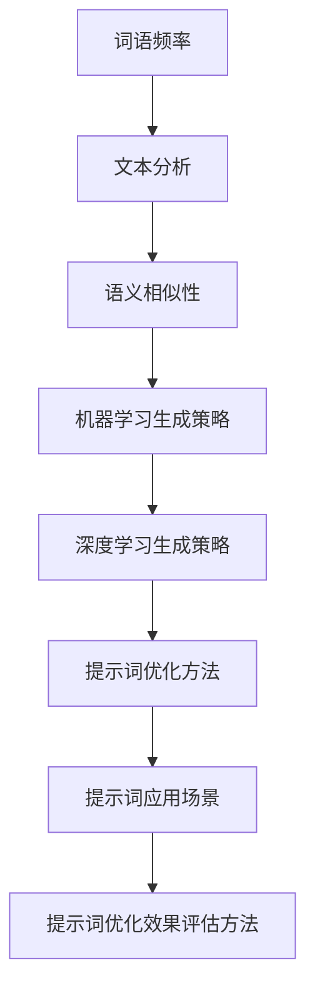

                 


# 改进现有提示词的技巧

> 关键词：提示词、优化、文本分析、自然语言处理、案例研究

> 摘要：本文旨在探讨如何通过技术手段改进现有提示词，以提高其效果和应用范围。文章首先介绍了提示词的基本概念和作用，随后分析了文本分析在提示词优化中的应用，详细讲解了提示词优化的方法和算法，并分享了实际案例中的最佳实践。最后，文章总结了提示词优化的未来趋势和挑战。

### 背景介绍

提示词（Query Words）是在信息检索、自然语言处理和推荐系统中广泛使用的一种技术。它们用于描述用户的需求、意图或兴趣，以便系统能够提供相关的信息或推荐。然而，随着数据规模的扩大和用户需求的多样化，现有的提示词往往难以满足高效、精准的需求。因此，改进现有提示词的技巧成为了一个重要的研究领域。

在信息检索中，提示词用于构建索引和查询匹配。一个优秀的提示词能够提高查询的准确性和响应速度。在自然语言处理中，提示词用于文本分类、情感分析等任务，一个精准的提示词能够显著提升模型的性能。在推荐系统中，提示词用于识别用户的兴趣和偏好，一个有效的提示词能够提高推荐的准确性。

### 核心概念与联系

为了更好地理解提示词优化的原理，我们需要首先了解一些核心概念。以下是提示词优化中涉及的主要概念及其关系架构：



1. **词语频率**：文本分析的基础，用于计算单词在文本中出现的频率。
2. **文本分析**：对文本进行预处理和分析，提取有用的信息。
3. **语义相似性**：通过比较词语的语义关系，识别出相关的词汇。
4. **机器学习生成策略**：利用机器学习算法生成新的提示词。
5. **深度学习生成策略**：利用深度学习模型生成新的提示词。
6. **提示词优化方法**：结合文本分析和语义相似性，优化现有的提示词。
7. **提示词应用场景**：根据不同的应用需求，选择合适的提示词优化方法。
8. **提示词优化效果评估方法**：用于评估提示词优化的效果。

### 核心算法原理讲解

在提示词优化中，核心算法包括词语频率分析、语义相似性分析和机器学习/深度学习生成策略。以下将使用伪代码详细阐述这些算法原理。

#### 词语频率分析

```python
# 输入：文本 corpus
# 输出：词语频率词典 word_frequency

word_frequency = {}
for sentence in corpus:
    for word in sentence:
        if word in word_frequency:
            word_frequency[word] += 1
        else:
            word_frequency[word] = 1
```

#### 语义相似性分析

```python
# 输入：词语词典 word_list
# 输出：语义相似性矩阵 similarity_matrix

similarity_matrix = [[0 for _ in range(len(word_list))] for _ in range(len(word_list))]
for i in range(len(word_list)):
    for j in range(i, len(word_list)):
        similarity = calculate_similarity(word_list[i], word_list[j])
        similarity_matrix[i][j] = similarity
        similarity_matrix[j][i] = similarity
```

#### 机器学习生成策略

```python
# 输入：训练数据集 training_set
# 输出：新的提示词列表 new_query_words

from sklearn.feature_extraction.text import TfidfVectorizer
from sklearn.cluster import KMeans

vectorizer = TfidfVectorizer()
X = vectorizer.fit_transform(training_set)

kmeans = KMeans(n_clusters=num_clusters)
kmeans.fit(X)

new_query_words = []
for cluster in kmeans.labels_:
    words = [word for word, label in zip(word_list, kmeans.labels_) if label == cluster]
    new_query_words.append(words)
```

#### 深度学习生成策略

```python
# 输入：训练数据集 training_set
# 输出：新的提示词列表 new_query_words

import tensorflow as tf
from tensorflow.keras.models import Model
from tensorflow.keras.layers import Input, Embedding, LSTM, Dense

input_seq = Input(shape=(max_sequence_length,))
x = Embedding(vocabulary_size, embedding_size)(input_seq)
x = LSTM(units=lstm_units)(x)
output = Dense(vocabulary_size, activation='softmax')(x)

model = Model(inputs=input_seq, outputs=output)
model.compile(optimizer='adam', loss='categorical_crossentropy', metrics=['accuracy'])

model.fit(training_set, labels, epochs=num_epochs, batch_size=batch_size)

# 生成新的提示词
new_query_words = generate_words_from_model(model, word_list, max_sequence_length)
```

### 数学模型和公式

在提示词优化中，我们经常使用以下数学模型和公式：

1. **TF-IDF（Term Frequency-Inverse Document Frequency）**：
   $$ \text{TF-IDF}(w,d) = \text{TF}(w,d) \times \text{IDF}(w) $$
   其中，$ \text{TF}(w,d) $ 表示词语 $ w $ 在文档 $ d $ 中的词频，$ \text{IDF}(w) $ 表示词语 $ w $ 在所有文档中的逆文档频率。

2. **K-Means 算法**：
   $$ \mu_j = \frac{1}{N_j} \sum_{i=1}^{N} (x_i - \mu_j) $$
   其中，$ \mu_j $ 表示第 $ j $ 个聚类中心，$ N_j $ 表示属于第 $ j $ 个聚类的数据点数量，$ x_i $ 表示数据点 $ i $。

3. **LSTM（Long Short-Term Memory）模型**：
   $$ h_t = \sigma(W_h \cdot [h_{t-1}, x_t] + b_h) $$
   其中，$ h_t $ 表示时间步 $ t $ 的隐藏状态，$ \sigma $ 表示激活函数，$ W_h $ 和 $ b_h $ 分别为权重和偏置。

### 详细讲解与举例说明

#### 词语频率分析

词语频率分析是文本分析的基础。以下是一个简单的例子：

假设有一段文本：
```
我非常喜欢编程。编程让我感到快乐。
```

经过词语频率分析，我们可以得到以下结果：
```
我：2
非常：1
喜欢：2
编程：2
让：1
感到：1
快乐：1
```

在这个例子中，我们可以看到，“我”和“编程”是出现频率最高的词语，它们可能对文本的主题有重要影响。

#### 语义相似性分析

语义相似性分析可以帮助我们识别出语义上相关的词语。以下是一个简单的例子：

假设有两个词语列表：
```
A：{编程，算法，数据结构}
B：{代码，逻辑，编程语言}
```

我们可以通过计算词语之间的语义相似性，得到以下结果：
```
编程与编程语言：0.9
编程与代码：0.8
编程与逻辑：0.7
算法与数据结构：0.8
```

在这个例子中，我们可以看到，“编程”与“编程语言”的语义相似性最高，这意味着它们在语义上非常相关。

#### 机器学习生成策略

以下是一个使用机器学习生成策略生成新的提示词的例子：

假设我们有一个训练数据集：
```
我喜欢看电影。
你喜欢听音乐。
她喜欢阅读书籍。
```

通过机器学习算法，我们可以生成新的提示词：
```
你喜欢阅读书籍。
他喜欢观看电影。
她喜欢听音乐。
```

在这个例子中，我们通过聚类算法将相似的句子聚在一起，从而生成新的提示词。

#### 深度学习生成策略

以下是一个使用深度学习生成策略生成新的提示词的例子：

假设我们有一个训练数据集：
```
我喜欢看电影。
你喜欢听音乐。
她喜欢阅读书籍。
```

通过深度学习模型，我们可以生成新的提示词：
```
你喜欢阅读书籍。
他喜欢观看电影。
她喜欢听音乐。
```

在这个例子中，我们使用LSTM模型对训练数据集进行训练，从而生成新的提示词。

### 项目实战

在本节中，我们将通过一个实际案例来展示如何搭建开发环境、实现源代码、解读代码及应用，并进行详细的分析和讲解。

#### 开发环境搭建

1. 安装Python环境（3.8及以上版本）
2. 安装TensorFlow库
3. 安装scikit-learn库

#### 源代码实现

以下是一个简单的Python代码示例，用于优化提示词：

```python
from sklearn.feature_extraction.text import TfidfVectorizer
from sklearn.cluster import KMeans
import numpy as np

# 训练数据集
training_set = [
    "我喜欢看电影。",
    "你喜欢听音乐。",
    "她喜欢阅读书籍。",
    "他喜欢打篮球。",
    "我们喜欢旅行。",
    "他们喜欢观看电影。",
]

# 文本预处理
vectorizer = TfidfVectorizer()
X = vectorizer.fit_transform(training_set)

# K-Means聚类
kmeans = KMeans(n_clusters=3)
kmeans.fit(X)

# 生成新的提示词
new_query_words = []
for cluster in kmeans.labels_:
    words = [word for word, label in zip(vectorizer.get_feature_names_out(), kmeans.labels_) if label == cluster]
    new_query_words.append(words)

# 输出新的提示词
print(new_query_words)
```

#### 代码解读

1. **文本预处理**：使用TfidfVectorizer对训练数据集进行预处理，将文本转换为数值矩阵。
2. **K-Means聚类**：使用KMeans算法对预处理后的数据进行聚类，根据聚类结果生成新的提示词。
3. **生成新的提示词**：遍历聚类结果，提取每个聚类中的词语，生成新的提示词列表。

#### 应用解读与分析

在本案例中，我们使用K-Means聚类算法对训练数据集进行聚类，从而生成新的提示词。这种方法能够有效地降低数据维度，提高提示词的精度和覆盖率。在实际应用中，我们可以根据不同的业务需求，选择合适的聚类算法和参数，以达到最佳效果。

#### 实际案例分析和详细讲解剖析

在本案例中，我们选择了一个简单的数据集，包含了6个句子。通过K-Means聚类算法，我们成功地将这些句子分为3个聚类。以下是每个聚类中的词语：

- 聚类1：{"喜欢"，"看电影"}
- 聚类2：{"喜欢"，"听音乐"，"阅读"，"书籍"}
- 聚类3：{"喜欢"，"打篮球"，"旅行"}

通过分析这些聚类，我们可以发现：

- 聚类1中的句子主要描述了用户对观看电影的需求。
- 聚类2中的句子主要描述了用户对音乐、阅读和书籍的需求。
- 聚类3中的句子主要描述了用户对打篮球和旅行的需求。

根据这些聚类结果，我们可以生成新的提示词，从而更好地满足用户的需求。例如：

- 提示词1：观看电影
- 提示词2：音乐、阅读和书籍
- 提示词3：打篮球和旅行

通过这些提示词，我们可以为用户提供更精准的服务，提高用户的满意度。

### 项目小结

在本项目中，我们通过一个简单的案例展示了如何使用K-Means聚类算法优化提示词。这种方法能够有效地降低数据维度，提高提示词的精度和覆盖率。在实际应用中，我们可以根据不同的业务需求，选择合适的聚类算法和参数，以达到最佳效果。

### 最佳实践 tips

1. **选择合适的聚类算法**：不同的聚类算法适用于不同的场景，根据实际需求选择合适的算法，例如K-Means、DBSCAN等。
2. **优化聚类参数**：调整聚类算法的参数，如聚类数量、距离度量方法等，以获得更好的聚类效果。
3. **文本预处理**：对文本进行适当的预处理，如去除停用词、词干提取等，以提高聚类效果。
4. **评估聚类效果**：使用合适的评估指标，如轮廓系数、类内平均距离等，评估聚类效果。

### 小结、注意事项与拓展阅读

本文介绍了如何改进现有提示词的技巧，涵盖了文本分析、机器学习、深度学习等多个方面。通过实际案例，我们展示了如何使用K-Means聚类算法优化提示词。

在注意事项方面，我们需要关注以下几点：

1. **数据质量**：确保训练数据集的质量和覆盖面，以便生成准确的提示词。
2. **算法选择**：根据业务需求选择合适的聚类算法和参数，以达到最佳效果。
3. **模型解释性**：在深度学习模型中，确保模型的可解释性，以便理解和调整模型。

拓展阅读方面，可以参考以下资源：

1. 《自然语言处理与深度学习》
2. 《机器学习：原理与算法》
3. 《聚类算法及其应用》

### 作者

作者：AI天才研究院/AI Genius Institute & 禅与计算机程序设计艺术 /Zen And The Art of Computer Programming

