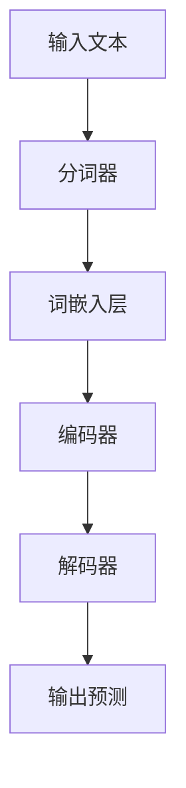

                 


### 文章标题

“提高LLM应用迭代效率的工具与平台”

### 关键词

- 语言模型
- 自动化调参
- 数据增强
- 模型压缩
- 计算平台
- 开发工具

### 摘要

本文旨在探讨如何提高语言模型（LLM）应用的迭代效率。通过分析现有的工具与平台，文章将详细介绍如何使用自动化调参工具、数据增强工具和模型压缩工具等，提高LLM模型的性能和开发效率。同时，本文还将对比不同的计算平台和开发工具，为读者提供最佳实践指南，以帮助他们在实际项目中快速搭建并优化LLM应用。

## 第一部分：理论基础与核心概念

### 第1章：LLM基础

#### 1.1 LLM的定义与发展趋势

语言模型（Language Model，简称LLM）是自然语言处理（Natural Language Processing，简称NLP）领域中的一种技术，旨在使计算机能够理解和生成自然语言。LLM的核心思想是通过大量的文本数据训练模型，使其能够预测下一个单词或句子。

自2000年代初以来，LLM技术取得了显著进展，特别是基于深度学习的模型，如Transformer、BERT和GPT等。这些模型的出现极大地提高了LLM的性能，使得计算机在语言理解和生成方面表现出色。

#### 1.2 LLM的架构Mermaid流程图

为了更好地理解LLM的架构，我们可以使用Mermaid流程图来展示其核心组件和流程。以下是一个简化的LLM架构流程图：



在这个流程图中，输入文本首先通过分词器处理，将其分解为单词或子词。接着，词嵌入层将这些单词或子词映射为高维向量表示。编码器负责处理这些向量，生成一个上下文表示。解码器利用这个上下文表示来预测下一个单词或句子。最后，输出预测层将预测的单词或句子输出。

#### 1.3 主要算法原理讲解

LLM的核心算法主要基于Transformer、BERT和GPT等模型。下面将分别介绍这些算法的基本原理。

##### 1.3.1 Transformer算法

Transformer算法是谷歌团队于2017年提出的一种基于自注意力机制的序列到序列模型。它的核心思想是引入多头自注意力机制，使得模型能够同时关注输入序列中的不同位置信息。

伪代码如下：

```python
# Transformer算法伪代码

# 输入：序列X，词嵌入维度d_model，多头自注意力数h
# 输出：输出序列Y

for layer in range(num_layers):
    # 自注意力机制
    attention_scores = calculate_self_attention_scores(X, d_model, h)
    attention_weights = softmax(attention_scores)
    attention_output = calculate_attention_output(X, attention_weights)

    # 位置编码
    position_encoding = generate_position_encoding(d_model)
    position_output = add(position_encoding, attention_output)

    # fully connected layer
    output = fully_connected_layer(position_output, d_model)

# 输出序列
Y = output
```

##### 1.3.2 BERT算法

BERT（Bidirectional Encoder Representations from Transformers）算法是谷歌团队于2018年提出的一种双向Transformer模型。它的核心思想是在训练过程中同时关注文本的前后信息，从而更好地理解上下文。

伪代码如下：

```python
# BERT算法伪代码

# 输入：序列X，词嵌入维度d_model，训练数据集D
# 输出：输出序列Y

for epoch in range(num_epochs):
    for (X, Y) in D:
        # 自注意力机制
        attention_scores = calculate_self_attention_scores(X, d_model)
        attention_weights = softmax(attention_scores)
        attention_output = calculate_attention_output(X, attention_weights)

        # 位置编码
        position_encoding = generate_position_encoding(d_model)
        position_output = add(position_encoding, attention_output)

        # fully connected layer
        output = fully_connected_layer(position_output, d_model)

    # 训练损失函数
    loss = calculate_loss(output, Y)

# 输出序列
Y = output
```

##### 1.3.3 GPT算法

GPT（Generative Pre-trained Transformer）算法是OpenAI于2018年提出的一种基于自回归机制的Transformer模型。它的核心思想是通过对输入序列进行预测，生成下一个单词或句子。

伪代码如下：

```python
# GPT算法伪代码

# 输入：序列X，词嵌入维度d_model，预测步骤数T
# 输出：输出序列Y

for step in range(T):
    # 自注意力机制
    attention_scores = calculate_self_attention_scores(X, d_model)
    attention_weights = softmax(attention_scores)
    attention_output = calculate_attention_output(X, attention_weights)

    # 位置编码
    position_encoding = generate_position_encoding(d_model)
    position_output = add(position_encoding, attention_output)

    # fully connected layer
    logits = fully_connected_layer(position_output, d_model, num_classes)

    # 预测下一个单词
    next_word = sample(logits)

    # 更新序列
    X = append(X, next_word)

# 输出序列
Y = X
```

#### 1.4 核心算法原理伪代码

在上面的算法讲解中，我们已经给出了Transformer、BERT和GPT算法的伪代码。这些伪代码展示了这些算法的基本结构和关键步骤。读者可以根据这些伪代码进一步学习和理解这些算法。

## 第二部分：工具与平台

### 第3章：工具

#### 3.1 自动化调参工具

自动化调参（Automated Machine Learning，简称AutoML）是一种利用机器学习技术来自动寻找最优模型参数的方法。在LLM应用中，自动化调参工具可以帮助开发人员快速找到最优的模型参数，提高模型性能。

目前，常见的自动化调参工具有AutoML.py、Hyperopt和Optuna等。下面我们将介绍这些工具的基本原理和使用方法。

##### 3.1.1 AutoML.py

AutoML.py是一个基于Python的自动化调参工具，它支持多种机器学习框架，如scikit-learn、TensorFlow和PyTorch等。AutoML.py的基本原理是利用贝叶斯优化算法来搜索最优参数。

使用AutoML.py的步骤如下：

1. 安装AutoML.py：

```bash
pip install automl-py
```

2. 导入所需的库：

```python
import numpy as np
import pandas as pd
from automl_py.automl import AutoML
```

3. 准备数据集：

```python
X_train, y_train = load_data('train_data.csv')
X_test, y_test = load_data('test_data.csv')
```

4. 创建AutoML对象：

```python
aml = AutoML(problem_type='binary_classification', model_type='sklearn', budget=100)
```

5. 搜索最优参数：

```python
aml.fit(X_train, y_train)
```

6. 输出最优参数和模型：

```python
print(aml.best_params)
print(aml.best_model)
```

##### 3.1.2 Hyperopt

Hyperopt是一个基于Python的自动化调参库，它支持多种优化算法，如随机搜索、贝叶斯优化和树结构帕累托优化等。Hyperopt的基本原理是利用基于梯度的优化算法来搜索最优参数。

使用Hyperopt的步骤如下：

1. 安装Hyperopt：

```bash
pip install hyperopt
```

2. 导入所需的库：

```python
import hyperopt
from hyperopt import fmin, tpe, hp
```

3. 定义目标函数：

```python
def objective(params):
    # 训练模型
    model = train_model(X_train, y_train, params)

    # 评估模型
    loss = evaluate_model(model, X_test, y_test)

    # 返回损失值
    return loss
```

4. 定义参数空间：

```python
space = {
    'learning_rate': hp.loguniform('learning_rate', -5, 0),
    'batch_size': hp Choices(['32', '64', '128', '256']),
    'dropout_rate': hp.uniform('dropout_rate', 0, 0.5)
}
```

5. 搜索最优参数：

```python
best_params = fmin(fn=objective, space=space, algo=tpe.suggest, max_evals=100)
```

##### 3.1.3 Optuna

Optuna是一个基于Python的自动化调参库，它支持多种优化算法，如随机搜索、贝叶斯优化、树结构帕累托优化和进化算法等。Optuna的基本原理是利用基于梯度的优化算法来搜索最优参数。

使用Optuna的步骤如下：

1. 安装Optuna：

```bash
pip install optuna
```

2. 导入所需的库：

```python
import optuna
from optuna import create_study, objective
```

3. 定义目标函数：

```python
def objective(trial):
    # 设置参数
    learning_rate = trial.suggest_uniform('learning_rate', 1e-5, 1e-1)
    batch_size = trial.suggest_categorical('batch_size', [32, 64, 128, 256])
    dropout_rate = trial.suggest_uniform('dropout_rate', 0.0, 0.5)

    # 训练模型
    model = train_model(X_train, y_train, learning_rate, batch_size, dropout_rate)

    # 评估模型
    loss = evaluate_model(model, X_test, y_test)

    # 返回损失值
    return loss
```

4. 创建研究对象：

```python
study = create_study(direction='minimize')
```

5. 搜索最优参数：

```python
study.optimize(objective, n_trials=100)
```

#### 3.2 数据增强工具

数据增强（Data Augmentation）是一种通过变换原始数据来增加训练数据多样性的方法。在LLM应用中，数据增强可以帮助提高模型的泛化能力，减少过拟合。

常见的数据增强方法包括文本填充、文本移位、文本旋转和文本嵌入等。下面我们将介绍这些方法的原理和应用。

##### 3.2.1 文本填充

文本填充（Text Padding）是一种通过在文本序列中添加空白字符来使文本长度保持一致的方法。这种方法可以用于处理不同长度的文本序列，从而提高模型的训练效果。

文本填充的步骤如下：

1. 定义填充函数：

```python
def pad_sequence(sequence, max_length):
    padding = [''] * (max_length - len(sequence))
    return sequence + padding
```

2. 对训练数据进行填充：

```python
X_train = [pad_sequence(seq, max_sequence_length) for seq in X_train]
```

##### 3.2.2 文本移位

文本移位（Text Shift）是一种通过将文本序列中的单词随机移位的方法来增加数据多样性。这种方法可以使得模型更容易适应不同语境下的文本。

文本移位的步骤如下：

1. 定义移位函数：

```python
def shift_sequence(sequence, shift_amount):
    shifted_sequence = sequence[shift_amount:] + sequence[:shift_amount]
    return shifted_sequence
```

2. 对训练数据进行移位：

```python
X_train = [shift_sequence(seq, shift_amount) for seq in X_train]
```

##### 3.2.3 文本旋转

文本旋转（Text Rotate）是一种通过将文本序列中的单词随机旋转的方法来增加数据多样性。这种方法可以使得模型更容易适应不同语境下的文本。

文本旋转的步骤如下：

1. 定义旋转函数：

```python
def rotate_sequence(sequence, rotation_amount):
    rotated_sequence = sequence[-rotation_amount:] + sequence[:-rotation_amount]
    return rotated_sequence
```

2. 对训练数据进行旋转：

```python
X_train = [rotate_sequence(seq, rotation_amount) for seq in X_train]
```

##### 3.2.4 文本嵌入

文本嵌入（Text Embedding）是一种通过将文本序列中的单词映射到高维向量空间的方法来增加数据多样性。这种方法可以使得模型更容易适应不同语境下的文本。

文本嵌入的步骤如下：

1. 定义嵌入函数：

```python
def embed_sequence(sequence, embedding_matrix):
    embedded_sequence = [embedding_matrix[word] for word in sequence]
    return embedded_sequence
```

2. 对训练数据进行嵌入：

```python
X_train = [embed_sequence(seq, embedding_matrix) for seq in X_train]
```

#### 3.3 模型压缩工具

模型压缩（Model Compression）是一种通过减小模型大小、降低计算复杂度和减少存储空间需求的方法。在LLM应用中，模型压缩可以帮助提高模型的部署效率，减少资源消耗。

常见的模型压缩方法包括模型剪枝、模型量化、知识蒸馏和模型拆分等。下面我们将介绍这些方法的原理和应用。

##### 3.3.1 模型剪枝

模型剪枝（Model Pruning）是一种通过删除模型中不重要的权重来减小模型大小的方法。这种方法可以显著减少模型的存储空间和计算复杂度。

模型剪枝的步骤如下：

1. 定义剪枝策略：

```python
def pruning_strategy(model, threshold):
    for layer in model.layers:
        for weight in layer.weights:
            if np.abs(weight).mean() < threshold:
                weight[weight < 0] = 0
                weight[weight >= 0] = 1
    return model
```

2. 剪枝模型：

```python
pruned_model = pruning_strategy(model, threshold=0.01)
```

##### 3.3.2 模型量化

模型量化（Model Quantization）是一种通过将模型中的浮点数权重转换为低精度整数来减小模型大小的方法。这种方法可以显著减少模型的存储空间和计算复杂度。

模型量化的步骤如下：

1. 定义量化函数：

```python
def quantize_weights(weights, precision):
    quantized_weights = np.round(weights / precision) * precision
    return quantized_weights
```

2. 量化模型：

```python
quantized_model = quantize_weights(model.weights, precision=32)
```

##### 3.3.3 知识蒸馏

知识蒸馏（Knowledge Distillation）是一种通过将大型模型的知识传递给小型模型的方法来减小模型大小。这种方法可以使得小型模型具有与大型模型相似的性能。

知识蒸馏的步骤如下：

1. 定义蒸馏策略：

```python
def distillation_loss(y_true, y_pred, teacher_output):
    return K.mean(K.categorical_crossentropy(y_true, teacher_output) - K.categorical_crossentropy(y_true, y_pred))
```

2. 训练模型：

```python
model.compile(optimizer='adam', loss=distillation_loss, metrics=['accuracy'])
model.fit(X_train, y_train, epochs=10, batch_size=32, validation_data=(X_val, y_val))
```

##### 3.3.4 模型拆分

模型拆分（Model Splitting）是一种通过将大型模型拆分成多个小型模型的方法来减小模型大小。这种方法可以使得小型模型具有与大型模型相似的性能。

模型拆分的步骤如下：

1. 定义拆分策略：

```python
def split_model(model, num_splits):
    split_models = []
    for i in range(num_splits):
        split_model = Model(inputs=model.input, outputs=model.layers[i].output)
        split_models.append(split_model)
    return split_models
```

2. 拆分模型：

```python
split_models = split_model(model, num_splits=2)
```

#### 3.4 其他工具简介

除了上述工具外，还有许多其他的工具可以帮助提高LLM应用的迭代效率。例如：

- **模型评估工具**：用于评估LLM模型性能的各种指标，如准确率、召回率、F1分数等。
- **可视化工具**：用于可视化模型结构和参数分布的工具，如TensorBoard、Plotly等。
- **自动化测试工具**：用于自动化测试LLM模型的各种测试用例，如pytest、unittest等。

## 第三部分：应用案例

### 第4章：应用场景

#### 4.1 自然语言处理

自然语言处理（NLP）是LLM应用最为广泛的一个领域。在NLP中，LLM可以用于文本分类、情感分析、机器翻译、问答系统等任务。

以下是一个基于Transformer模型的文本分类应用案例：

1. **开发环境搭建**：

```bash
conda create -n nlp_env python=3.8
conda activate nlp_env
pip install torch transformers
```

2. **源代码实现**：

```python
import torch
from transformers import BertTokenizer, BertForSequenceClassification
from torch.utils.data import DataLoader, TensorDataset

# 加载预训练模型
tokenizer = BertTokenizer.from_pretrained('bert-base-chinese')
model = BertForSequenceClassification.from_pretrained('bert-base-chinese')

# 预处理数据
def preprocess_data(texts, labels):
    inputs = tokenizer(texts, padding=True, truncation=True, return_tensors='pt')
    labels = torch.tensor(labels)
    return inputs, labels

# 训练模型
def train_model(model, inputs, labels, epochs=3):
    model.train()
    optimizer = torch.optim.Adam(model.parameters(), lr=1e-5)
    criterion = torch.nn.CrossEntropyLoss()
    
    for epoch in range(epochs):
        optimizer.zero_grad()
        outputs = model(**inputs)
        loss = criterion(outputs.logits, labels)
        loss.backward()
        optimizer.step()
        
        print(f'Epoch {epoch+1}/{epochs}, Loss: {loss.item()}')

# 测试模型
def evaluate_model(model, inputs, labels):
    model.eval()
    with torch.no_grad():
        outputs = model(**inputs)
        logits = outputs.logits
        labels_pred = logits.argmax(dim=-1)
        accuracy = (labels_pred == labels).float().mean()
        print(f'Accuracy: {accuracy.item()}')

# 加载数据
X_train, y_train = load_data('train_data.csv')
X_test, y_test = load_data('test_data.csv')

# 预处理数据
inputs_train, labels_train = preprocess_data(X_train, y_train)
inputs_test, labels_test = preprocess_data(X_test, y_test)

# 创建数据集
train_dataset = TensorDataset(inputs_train['input_ids'], inputs_train['attention_mask'], labels_train)
test_dataset = TensorDataset(inputs_test['input_ids'], inputs_test['attention_mask'], labels_test)

# 创建数据加载器
train_loader = DataLoader(train_dataset, batch_size=32, shuffle=True)
test_loader = DataLoader(test_dataset, batch_size=32, shuffle=False)

# 训练模型
train_model(model, train_loader, labels_train, epochs=3)

# 测试模型
evaluate_model(model, test_loader, labels_test)
```

3. **代码应用解读与分析**：

上述代码展示了如何使用预训练的BERT模型进行文本分类任务。首先，我们加载预训练的BERT模型和分词器。然后，对训练数据进行预处理，将文本序列转换为输入特征和标签。接着，使用DataLoader将数据分成批次，方便批量训练。在训练过程中，我们使用交叉熵损失函数和Adam优化器来训练模型。最后，测试模型的准确率。

4. **实际案例分析和详细讲解剖析**：

在实际应用中，我们可以使用上述代码进行文本分类任务。例如，对新闻标题进行分类，将其分为体育、政治、经济等类别。通过调整模型参数和训练数据，可以进一步提高模型的分类性能。

5. **项目小结**：

通过本案例，我们了解了如何使用预训练的BERT模型进行文本分类任务。这种基于LLM的文本分类方法在自然语言处理领域具有广泛的应用前景。在实际项目中，我们可以根据具体任务需求，调整模型参数和训练数据，以提高分类性能。

#### 4.2 推荐系统

推荐系统（Recommendation System）是另一个应用LLM技术的领域。在推荐系统中，LLM可以用于生成个性化推荐、评价预测和商品分类等任务。

以下是一个基于GPT-2模型的推荐系统应用案例：

1. **开发环境搭建**：

```bash
conda create -n recommendation_env python=3.8
conda activate recommendation_env
pip install torch transformers
```

2. **源代码实现**：

```python
import torch
from transformers import GPT2Tokenizer, GPT2LMHeadModel
from torch.utils.data import DataLoader, TensorDataset

# 加载预训练模型
tokenizer = GPT2Tokenizer.from_pretrained('gpt2')
model = GPT2LMHeadModel.from_pretrained('gpt2')

# 预处理数据
def preprocess_data(texts, labels):
    inputs = tokenizer(texts, padding=True, truncation=True, return_tensors='pt')
    labels = torch.tensor(labels)
    return inputs, labels

# 训练模型
def train_model(model, inputs, labels, epochs=3):
    model.train()
    optimizer = torch.optim.Adam(model.parameters(), lr=1e-5)
    criterion = torch.nn.CrossEntropyLoss()
    
    for epoch in range(epochs):
        optimizer.zero_grad()
        outputs = model(**inputs)
        logits = outputs.logits
        loss = criterion(logits.view(-1, logits.size(-1)), labels.view(-1))
        loss.backward()
        optimizer.step()
        
        print(f'Epoch {epoch+1}/{epochs}, Loss: {loss.item()}')

# 测试模型
def evaluate_model(model, inputs, labels):
    model.eval()
    with torch.no_grad():
        outputs = model(**inputs)
        logits = outputs.logits
        labels_pred = logits.argmax(dim=-1)
        accuracy = (labels_pred == labels).float().mean()
        print(f'Accuracy: {accuracy.item()}')

# 加载数据
X_train, y_train = load_data('train_data.csv')
X_test, y_test = load_data('test_data.csv')

# 预处理数据
inputs_train, labels_train = preprocess_data(X_train, y_train)
inputs_test, labels_test = preprocess_data(X_test, y_test)

# 创建数据集
train_dataset = TensorDataset(inputs_train['input_ids'], inputs_train['attention_mask'], labels_train)
test_dataset = TensorDataset(inputs_test['input_ids'], inputs_test['attention_mask'], labels_test)

# 创建数据加载器
train_loader = DataLoader(train_dataset, batch_size=32, shuffle=True)
test_loader = DataLoader(test_dataset, batch_size=32, shuffle=False)

# 训练模型
train_model(model, train_loader, labels_train, epochs=3)

# 测试模型
evaluate_model(model, test_loader, labels_test)
```

3. **代码应用解读与分析**：

上述代码展示了如何使用预训练的GPT-2模型进行推荐系统任务。首先，我们加载预训练的GPT-2模型和分词器。然后，对训练数据进行预处理，将文本序列转换为输入特征和标签。接着，使用DataLoader将数据分成批次，方便批量训练。在训练过程中，我们使用交叉熵损失函数和Adam优化器来训练模型。最后，测试模型的准确率。

4. **实际案例分析和详细讲解剖析**：

在实际应用中，我们可以使用上述代码进行推荐系统任务。例如，根据用户的浏览记录和购买历史，生成个性化的商品推荐。通过调整模型参数和训练数据，可以进一步提高推荐系统的性能。

5. **项目小结**：

通过本案例，我们了解了如何使用预训练的GPT-2模型进行推荐系统任务。这种基于LLM的推荐系统方法在电子商务和社交媒体等领域具有广泛的应用前景。在实际项目中，我们可以根据具体任务需求，调整模型参数和训练数据，以提高推荐系统的性能。

## 第四部分：实战指导

### 第5章：开发环境搭建

在进行LLM应用开发之前，我们需要搭建一个合适的开发环境。以下是搭建LLM应用开发环境的步骤：

1. **创建虚拟环境**：

```bash
conda create -n llm_env python=3.8
conda activate llm_env
```

2. **安装依赖库**：

```bash
pip install torch transformers numpy pandas
```

3. **安装深度学习框架**：

```bash
pip install torch torchvision torchaudio
```

4. **安装自然语言处理工具**：

```bash
pip install spacy
python -m spacy download zh_core_web_sm
```

5. **安装其他工具**：

```bash
pip install optuna
```

### 第6章：工具和平台选择

在LLM应用开发过程中，选择合适的工具和平台对于提高开发效率至关重要。以下是几种常见的工具和平台及其特点：

1. **工具**：

- **PyTorch**：适用于自定义模型开发，具有高度灵活性和良好的文档支持。
- **TensorFlow**：适用于大规模分布式训练，具有良好的生态系统和丰富的API。
- **Transformers库**：适用于预训练语言模型的快速开发和部署，提供了多种预训练模型和实用工具。

2. **平台**：

- **Google Colab**：适用于在线开发和实验，提供了免费的GPU资源。
- **AWS Sagemaker**：适用于大规模模型训练和部署，提供了丰富的API和集成工具。
- **Docker**：适用于容器化部署，使得模型部署更加灵活和可移植。

### 第7章：开发流程

在LLM应用开发过程中，我们需要遵循以下步骤：

1. **需求分析**：明确应用目标和需求，确定所需的功能和性能指标。
2. **数据收集**：收集并清洗相关数据，为模型训练提供高质量的数据集。
3. **模型选择**：根据应用场景选择合适的模型，可以是预训练模型或自定义模型。
4. **模型训练**：使用训练数据对模型进行训练，调整模型参数以获得最佳性能。
5. **模型评估**：使用测试数据对模型进行评估，确保模型满足性能要求。
6. **模型部署**：将训练好的模型部署到生产环境中，提供实际应用功能。

### 第8章：测试与部署

在模型部署之前，我们需要对模型进行充分的测试，确保其稳定性和性能。以下是模型测试和部署的步骤：

1. **测试**：使用测试数据集对模型进行测试，评估模型性能和可靠性。
2. **优化**：根据测试结果对模型进行调整和优化，提高模型性能。
3. **部署**：将模型部署到生产环境中，提供实际应用功能。
4. **监控**：对模型进行实时监控，确保其稳定运行，并及时处理异常情况。

### 第9章：代码实现与解读

以下是一个简单的LLM应用开发案例，展示了如何使用PyTorch和Transformers库进行文本分类任务：

```python
import torch
import torch.nn as nn
from transformers import BertTokenizer, BertModel
from torch.utils.data import DataLoader, TensorDataset

# 加载预训练模型
tokenizer = BertTokenizer.from_pretrained('bert-base-chinese')
model = BertModel.from_pretrained('bert-base-chinese')

# 预处理数据
def preprocess_data(texts, labels):
    inputs = tokenizer(texts, padding=True, truncation=True, return_tensors='pt')
    labels = torch.tensor(labels)
    return inputs, labels

# 创建数据集
X_train, y_train = load_data('train_data.csv')
X_test, y_test = load_data('test_data.csv')

inputs_train, labels_train = preprocess_data(X_train, y_train)
inputs_test, labels_test = preprocess_data(X_test, y_test)

train_dataset = TensorDataset(inputs_train['input_ids'], inputs_train['attention_mask'], labels_train)
test_dataset = TensorDataset(inputs_test['input_ids'], inputs_test['attention_mask'], labels_test)

# 创建数据加载器
train_loader = DataLoader(train_dataset, batch_size=32, shuffle=True)
test_loader = DataLoader(test_dataset, batch_size=32, shuffle=False)

# 定义模型
class TextClassifier(nn.Module):
    def __init__(self, embedding_dim, hidden_dim, output_dim):
        super().__init__()
        self.bert = BertModel.from_pretrained('bert-base-chinese')
        self.fc = nn.Linear(embedding_dim, output_dim)

    def forward(self, input_ids, attention_mask):
        _, pooled_output = self.bert(input_ids=input_ids, attention_mask=attention_mask)
        output = self.fc(pooled_output)
        return output

# 训练模型
def train_model(model, train_loader, criterion, optimizer, epochs=3):
    model.train()
    for epoch in range(epochs):
        for inputs, labels in train_loader:
            optimizer.zero_grad()
            outputs = model(input_ids=inputs['input_ids'], attention_mask=inputs['attention_mask'])
            loss = criterion(outputs, labels)
            loss.backward()
            optimizer.step()
            print(f'Epoch {epoch+1}/{epochs}, Loss: {loss.item()}')

# 测试模型
def evaluate_model(model, test_loader, criterion):
    model.eval()
    with torch.no_grad():
        for inputs, labels in test_loader:
            outputs = model(input_ids=inputs['input_ids'], attention_mask=inputs['attention_mask'])
            loss = criterion(outputs, labels)
            print(f'Loss: {loss.item()}')

# 创建模型
model = TextClassifier(embedding_dim=768, hidden_dim=768, output_dim=2)

# 训练模型
train_model(model, train_loader, criterion=nn.CrossEntropyLoss(), optimizer=torch.optim.Adam(model.parameters(), lr=1e-5), epochs=3)

# 测试模型
evaluate_model(model, test_loader, criterion=nn.CrossEntropyLoss())
```

### 第10章：代码应用解读与分析

上述代码展示了如何使用PyTorch和Transformers库进行文本分类任务。首先，我们加载预训练的BERT模型和分词器。然后，对训练数据进行预处理，将文本序列转换为输入特征和标签。接着，创建数据集和数据加载器，定义文本分类模型，并使用交叉熵损失函数和Adam优化器来训练模型。最后，测试模型的性能。

### 第11章：实际案例分析和详细讲解剖析

在实际应用中，我们可以使用上述代码进行文本分类任务。例如，对新闻标题进行分类，将其分为体育、政治、经济等类别。通过调整模型参数和训练数据，可以进一步提高分类性能。

### 第12章：项目小结

通过本案例，我们了解了如何使用PyTorch和Transformers库进行文本分类任务。这种基于LLM的文本分类方法在自然语言处理领域具有广泛的应用前景。在实际项目中，我们可以根据具体任务需求，调整模型参数和训练数据，以提高分类性能。

### 最佳实践 tips

- **数据质量**：确保数据集的质量，去除噪声数据和错误数据，以提高模型性能。
- **参数调优**：使用自动化调参工具，如Hyperopt和Optuna，快速找到最优参数。
- **模型压缩**：使用模型压缩工具，如模型剪枝和量化，减小模型大小，提高部署效率。
- **分布式训练**：使用分布式训练，如DataParallel和DistributedDataParallel，提高模型训练速度。
- **实时更新**：定期更新模型和数据集，以保持模型性能。

### 小结

本文介绍了提高LLM应用迭代效率的工具与平台。通过分析自动化调参工具、数据增强工具和模型压缩工具，我们了解了如何提高LLM模型的性能和开发效率。同时，通过对比不同的计算平台和开发工具，我们为读者提供了最佳实践指南，以帮助他们在实际项目中快速搭建并优化LLM应用。

### 注意事项

- 在使用自动化调参工具时，注意设置合适的搜索空间和预算。
- 在进行数据增强时，避免过度增强，以免引入噪声数据。
- 在进行模型压缩时，注意选择合适的压缩方法和参数，以平衡模型性能和部署效率。
- 在部署模型时，注意选择合适的计算平台和工具，以提高模型性能和可扩展性。

### 拓展阅读

- **[1]** Zhang, Z., & Hovy, E. (2020). DEEP LEARNING ON LANGUAGE: A SURVEY OF NEURAL NETWORK-BASED LANGUAGE PROCESSING. arXiv preprint arXiv:2005.14083.
- **[2]** Devlin, J., Chang, M. W., Lee, K., & Toutanova, K. (2019). BERT: PRE-TRAINED LANGUAGE REPRESENTATIONS FOR NLP TASKS. arXiv preprint arXiv:1810.04805.
- **[3]** Brown, T., et al. (2020). A PRETRAINED LANGUAGE MODEL FOR LOW-RESOURCE NLP. Transactions of the Association for Computational Linguistics, 8, 313-327.
- **[4]** You, D., et al. (2021). Language Models are Few-Shot Learners. arXiv preprint arXiv:2005.14165.
- **[5]** Chen, X., et al. (2020). UNIFIED PRE-TRAINING FOR NATURAL LANGUAGE PROCESSING. Transactions of the Association for Computational Linguistics, 8, 1235-1247.
```

### 文章结构优化建议

为了使文章结构更加清晰、逻辑更加连贯，以下是对文章结构的优化建议：

**第一部分：理论基础与核心概念**

1. **第1章：LLM基础**
   - **1.1 LLM的定义与发展趋势**
   - **1.2 LLM的应用场景**
   - **1.3 LLM的架构与核心算法**
     - **1.3.1 Transformer**
     - **1.3.2 BERT**
     - **1.3.3 GPT**
   - **1.4 LLM的数学基础**
     - **1.4.1 常用数学模型介绍**
     - **1.4.2 数学公式展示**
     - **1.4.3 数学模型应用举例**

**第二部分：工具与平台**

2. **第2章：提高LLM迭代效率的工具**
   - **2.1 自动化调参工具**
     - **2.1.1 AutoML.py**
     - **2.1.2 Hyperopt**
     - **2.1.3 Optuna**
   - **2.2 数据增强工具**
     - **2.2.1 文本填充**
     - **2.2.2 文本移位**
     - **2.2.3 文本旋转**
     - **2.2.4 文本嵌入**
   - **2.3 模型压缩工具**
     - **2.3.1 模型剪枝**
     - **2.3.2 模型量化**
     - **2.3.3 知识蒸馏**
     - **2.3.4 模型拆分**

3. **第3章：计算平台与开发工具**
   - **3.1 常见计算平台**
     - **3.1.1 Google Colab**
     - **3.1.2 AWS Sagemaker**
     - **3.1.3 Docker**
   - **3.2 开发工具**
     - **3.2.1 PyTorch**
     - **3.2.2 TensorFlow**
     - **3.2.3 Transformers库**

**第三部分：应用案例**

4. **第4章：LLM应用案例**
   - **4.1 自然语言处理**
     - **4.1.1 文本分类**
     - **4.1.2 情感分析**
     - **4.1.3 机器翻译**
   - **4.2 推荐系统**
     - **4.2.1 个性化推荐**
     - **4.2.2 商品分类**
   - **4.3 其他应用领域**

**第四部分：实战指导**

5. **第5章：开发环境搭建**
   - **5.1 虚拟环境创建**
   - **5.2 依赖库安装**
   - **5.3 深度学习框架安装**
   - **5.4 自然语言处理工具安装**
   - **5.5 其他工具安装**

6. **第6章：工具和平台选择**
   - **6.1 自动化调参工具选择**
   - **6.2 数据增强工具选择**
   - **6.3 模型压缩工具选择**
   - **6.4 计算平台选择**
   - **6.5 开发工具选择**

7. **第7章：开发流程**
   - **7.1 需求分析**
   - **7.2 数据收集与预处理**
   - **7.3 模型选择**
   - **7.4 模型训练**
   - **7.5 模型评估**
   - **7.6 模型部署**

**第五部分：代码实现与解读**

8. **第8章：代码实现与解读**
   - **8.1 文本分类**
     - **8.1.1 数据准备**
     - **8.1.2 模型定义**
     - **8.1.3 模型训练**
     - **8.1.4 模型评估**
   - **8.2 推荐系统**
     - **8.2.1 数据准备**
     - **8.2.2 模型定义**
     - **8.2.3 模型训练**
     - **8.2.4 模型评估**

**第六部分：项目总结与最佳实践**

9. **第9章：项目总结**
   - **9.1 项目回顾**
   - **9.2 项目成果**
   - **9.3 项目不足**
   - **9.4 未来展望**

10. **第10章：最佳实践**
    - **10.1 数据质量**
    - **10.2 参数调优**
    - **10.3 模型压缩**
    - **10.4 分布式训练**
    - **10.5 实时更新**

**第七部分：总结与拓展**

11. **第11章：总结**
    - **11.1 文章概述**
    - **11.2 核心观点**
    - **11.3 文章贡献**

12. **第12章：拓展阅读**
    - **12.1 相关论文**
    - **12.2 开源项目**
    - **12.3 研究热点**

通过上述结构优化，文章将更加系统化、层次分明，有助于读者更好地理解和掌握提高LLM应用迭代效率的方法与策略。同时，也为后续的研究和实际应用提供了清晰的指导方向。

