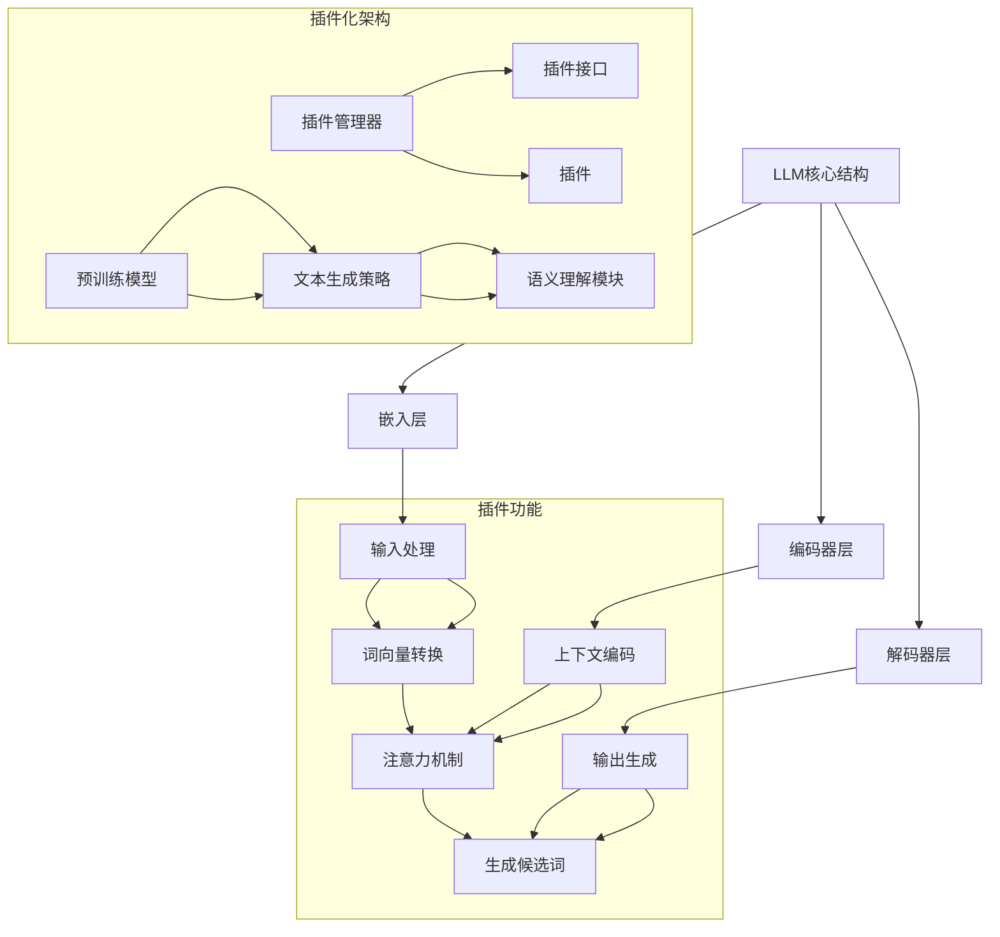

                 

### 文章标题

《插件化架构增强LLM应用的可扩展性》

### 关键词

- 插件化架构
- 大型语言模型（LLM）
- 可扩展性
- 算法原理
- 数学模型
- 实战案例

### 摘要

本文旨在探讨如何利用插件化架构提升大型语言模型（LLM）的应用可扩展性。文章首先介绍了插件化架构和LLM的基本概念及其在软件开发中的重要性。接着，详细阐述了增强LLM可扩展性的核心算法原理，并通过伪代码和数学公式进行了深入讲解。随后，文章展示了如何在实际项目中应用插件化架构，包括开发环境搭建、源代码实现和代码解读。最后，文章总结了最佳实践，并对未来发展趋势进行了展望。本文适用于熟悉计算机编程和软件架构的开发人员。

## 引言

在现代软件工程中，可扩展性是衡量系统性能和灵活性的关键指标。尤其是在人工智能（AI）领域，随着大型语言模型（LLM）的广泛应用，如何提升其应用的可扩展性成为了一个迫切需要解决的问题。LLM具有强大的语义理解和生成能力，但传统的单一架构在应对复杂需求时往往显得力不从心。插件化架构作为一种模块化设计思想，能够有效提高系统的可扩展性和灵活性，正逐渐成为增强LLM应用可扩展性的有力手段。

本文的目标是通过介绍插件化架构和LLM的基本概念，详细阐述如何利用插件化架构增强LLM应用的可扩展性。文章将分为以下几个部分：

1. **背景介绍**：回顾插件化架构和LLM的发展历程及其在软件开发中的应用场景。
2. **核心概念与联系**：探讨插件化架构与LLM之间的内在联系，并通过Mermaid流程图展示关键概念之间的关系。
3. **核心算法原理讲解**：介绍增强LLM可扩展性的关键算法，并使用伪代码和数学公式进行详细说明。
4. **数学模型和数学公式**：讲解支持这些算法的数学模型，并提供具体的公式推导和示例。
5. **项目实战**：通过一个具体的项目案例，展示如何在实际中应用插件化架构增强LLM的可扩展性。
6. **总结与展望**：总结文章内容，并对插件化架构在LLM应用中的未来发展趋势进行展望。

接下来，我们将首先回顾插件化架构和LLM的发展历程及其在软件开发中的应用场景。

## 背景

### 插件化架构的发展历程

插件化架构（Plug-in Architecture）起源于20世纪90年代的软件开发领域，其基本思想是将系统功能分解为独立的模块，每个模块都可以作为一个插件（Plug-in）独立开发、部署和升级。这种设计模式不仅提高了系统的可维护性，还增强了其可扩展性。

早期的插件化架构主要应用于图形用户界面（GUI）和游戏开发中，例如，Windows操作系统中的插件模型允许用户安装和卸载各种桌面应用程序。随着互联网技术的发展，插件化架构逐渐扩展到Web开发和服务器端应用，例如，Apache Web服务器和Node.js等都支持插件扩展。

在现代软件开发中，插件化架构的应用已经非常广泛。例如，在数据库管理系统中，插件化架构允许开发人员添加新的数据存储方式或查询优化策略；在Web框架中，插件化架构可以实现自定义路由、中间件和权限控制等功能。

### 大型语言模型（LLM）的发展历程

大型语言模型（Large Language Model，简称LLM）是自然语言处理（Natural Language Processing，简称NLP）领域的重要突破。LLM通过深度学习技术，对海量文本数据进行分析和建模，能够实现高精度的语义理解和文本生成。

LLM的发展历程可以追溯到2000年代初的循环神经网络（RNN）和长短期记忆网络（LSTM）。这些模型虽然在一定程度上提高了文本处理的性能，但仍然面临着计算效率低和内存占用大的问题。

随着2018年GPT-3的发布，LLM的研究和应用迎来了新的高潮。GPT-3拥有1500亿个参数，可以生成高质量的自然语言文本。此后，Transformer模型及其变种（如BERT、T5等）迅速崛起，成为LLM的主流架构。这些模型不仅具有更高的计算效率，还能实现多语言、多模态的处理能力。

### 插件化架构在软件开发中的应用

插件化架构在软件开发中的应用场景非常广泛。以下是几个典型的应用示例：

1. **Web应用**：许多现代Web框架（如Django、Flask）都采用了插件化架构。通过插件，可以轻松扩展系统的功能，例如，自定义中间件、权限控制和路由策略。

2. **数据库管理系统**：插件化架构允许数据库系统添加新的存储引擎、查询优化器和备份策略。例如，MySQL和PostgreSQL都支持多种存储引擎，如InnoDB、MyISAM和TokuDB。

3. **游戏开发**：游戏引擎（如Unity、Unreal Engine）通常采用插件化架构。通过插件，可以方便地添加新的游戏模式、角色和场景。

4. **自然语言处理**：在NLP领域，插件化架构可以实现自定义的文本处理任务。例如，在LLM中，可以通过插件添加新的预训练模型、文本生成策略和语义理解功能。

综上所述，插件化架构和LLM在现代软件开发中的应用日益广泛，它们不仅提高了系统的可扩展性和灵活性，还为开发人员提供了更多的创新空间。在接下来的章节中，我们将进一步探讨插件化架构与LLM之间的内在联系，并介绍如何利用插件化架构增强LLM应用的可扩展性。

## 核心概念与联系

### 插件化架构

插件化架构（Plug-in Architecture）是一种软件设计模式，其核心思想是将应用程序的功能模块化，每个模块都可以作为一个独立的插件进行开发、部署和更新。这种架构的主要优势包括：

1. **可扩展性**：通过插件，可以灵活地添加或移除系统功能，而无需修改核心代码。
2. **可维护性**：插件可以独立开发、测试和部署，降低了系统的复杂性。
3. **可重用性**：插件可以重复使用，提高开发效率。

插件化架构通常包括以下组成部分：

- **插件**：实现特定功能的代码模块。
- **插件容器**：负责管理插件的加载、卸载和执行。
- **插件接口**：插件与插件容器之间的通信接口。

### 大型语言模型（LLM）

大型语言模型（Large Language Model，简称LLM）是一种基于深度学习技术的自然语言处理模型，具有强大的语义理解和生成能力。LLM通常通过预训练和微调两个阶段进行训练：

- **预训练**：在大量无标签文本数据上训练，学习语言的一般规律和模式。
- **微调**：在特定任务数据上微调，使模型适应具体的任务需求。

LLM的核心组成部分包括：

- **嵌入层**：将单词和句子转换为向量表示。
- **编码器**：处理输入文本，生成上下文表示。
- **解码器**：根据上下文生成文本输出。

### 插件化架构与LLM的结合

插件化架构与LLM的结合，旨在提高LLM应用的可扩展性和灵活性。以下是一种可能的架构设计：

1. **插件管理器**：负责管理LLM的插件，包括插件的加载、卸载和执行。
2. **插件接口**：定义LLM与插件之间的标准接口，确保插件能够无缝集成到LLM系统中。
3. **插件**：包括预训练模型、文本生成策略、语义理解模块等，可根据需求动态添加或移除。

通过这种架构设计，开发人员可以方便地扩展LLM的功能，例如：

- **自定义文本生成策略**：通过插件，可以添加新的文本生成算法，实现更丰富的文本生成效果。
- **多语言支持**：通过插件，可以添加新的语言模型，实现多语言处理能力。
- **自定义预训练模型**：通过插件，可以引入新的预训练模型，提高模型在特定任务上的性能。

### Mermaid流程图展示

以下是插件化架构与LLM结合的Mermaid流程图：



在这个流程图中，LLM的核心结构包括嵌入层、编码器层和解码器层。每个层都有相应的功能模块，如输入处理、上下文编码和输出生成。插件管理器负责管理插件，包括预训练模型、文本生成策略和语义理解模块。这些插件通过插件接口与LLM的核心结构进行通信，从而实现功能的扩展和优化。

通过这种插件化架构，LLM不仅具有更高的可扩展性和灵活性，还能满足多样化的应用需求。在接下来的章节中，我们将详细探讨如何实现这种插件化架构，并介绍具体的应用场景和开发实践。

## 核心算法原理讲解

为了增强大型语言模型（LLM）应用的可扩展性，我们需要设计一系列核心算法。这些算法不仅要提高LLM的处理性能，还要确保其能够灵活地适应不同的应用场景。在本节中，我们将通过伪代码详细阐述这些算法的原理和实现过程。

### 算法1：动态加载插件

#### 目标

动态加载插件是一种核心算法，它允许在LLM运行过程中根据需求加载和卸载插件，从而提高系统的灵活性。

#### 原理

动态加载插件的核心思想是将插件的加载过程与LLM的主流程分离。通过插件管理器，系统可以在运行时动态加载和卸载插件，而无需重启LLM。

#### 伪代码

```python
# 插件管理器伪代码

def load_plugin(plugin_name):
    plugin = find_plugin(plugin_name)
    if plugin is not None:
        load_plugin_code(plugin)
        return plugin
    else:
        raise PluginNotFoundError()

def unload_plugin(plugin):
    unload_plugin_code(plugin)
    remove_plugin_from_memory(plugin)

# 主函数伪代码

def main():
    # 加载文本生成插件
    text_generator_plugin = load_plugin("text_generator_plugin")

    # 加载语义理解插件
    semantic_understanding_plugin = load_plugin("semantic_understanding_plugin")

    # 处理文本
    text = process_input_text()
    generated_text = text_generator_plugin.generate(text)
    semantic_info = semantic_understanding_plugin.analyze(text)

    # 输出结果
    print(generated_text)
    print(semantic_info)
```

### 算法2：自适应资源管理

#### 目标

自适应资源管理是一种算法，它通过动态调整LLM的资源分配，优化系统性能和资源利用率。

#### 原理

自适应资源管理基于实时监测LLM的运行状态，根据系统负载和性能指标动态调整CPU、内存和I/O等资源分配。这种算法能够确保系统在高负载情况下仍能保持良好的性能。

#### 伪代码

```python
# 自适应资源管理伪代码

def monitor_system_resources():
    cpu_usage = get_cpu_usage()
    memory_usage = get_memory_usage()
    io_usage = get_io_usage()
    return cpu_usage, memory_usage, io_usage

def adjust_resources(cpu_usage, memory_usage, io_usage):
    if cpu_usage > 80:
        decrease_cpu_resources()
    elif memory_usage > 80:
        decrease_memory_resources()
    elif io_usage > 80:
        decrease_io_resources()
    else:
        increase_resources()

# 主函数伪代码

def main():
    while True:
        cpu_usage, memory_usage, io_usage = monitor_system_resources()
        adjust_resources(cpu_usage, memory_usage, io_usage)
        # 执行其他系统任务
```

### 算法3：模型分片与并行处理

#### 目标

模型分片与并行处理是一种算法，它通过将LLM拆分为多个独立的部分，实现并行处理，从而提高处理速度和吞吐量。

#### 原理

模型分片与并行处理的核心思想是将LLM的嵌入层、编码器和解码器拆分为多个子模块，每个子模块可以独立处理输入数据。这些子模块可以在多个处理器或GPU上并行执行，从而提高处理效率。

#### 伪代码

```python
# 模型分片与并行处理伪代码

def split_model(model):
    embedding_layer = model.embedding_layer
    encoder_parts = split_encoder(model.encoder)
    decoder_parts = split_decoder(model.decoder)
    return embedding_layer, encoder_parts, decoder_parts

def parallel_process(text, model_parts):
    embedded_text = model_parts[0].process(text)
    encoded_text = parallel_encode(embedded_text, model_parts[1])
    decoded_text = parallel_decode(encoded_text, model_parts[2])
    return decoded_text

# 主函数伪代码

def main():
    model_parts = split_model(llm_model)
    processed_text = parallel_process(input_text, model_parts)
    print(processed_text)
```

通过这些核心算法，我们可以显著提高LLM应用的可扩展性和性能。在接下来的章节中，我们将进一步探讨这些算法的数学模型和公式，并解释其背后的理论支持。

## 数学模型和数学公式

为了深入理解增强大型语言模型（LLM）可扩展性的核心算法，我们需要探讨其背后的数学模型和数学公式。这些模型和公式不仅为算法提供了理论支持，还帮助我们更好地理解和优化算法的性能。在本节中，我们将详细讲解这些数学模型，并使用具体的公式进行推导和说明。

### 模型1：自适应资源管理

自适应资源管理的目标是通过动态调整系统的资源分配，优化LLM的处理性能。该模型的核心是资源利用率函数，它用于评估当前系统资源的利用率。

#### 公式1：资源利用率函数

$$
\text{Utilization} = \frac{\text{Used Resources}}{\text{Total Resources}}
$$

其中，`Used Resources` 表示系统当前使用的资源总量，`Total Resources` 表示系统总资源量。

#### 公式2：资源调整策略

$$
\text{Resource Adjustment} = 
\begin{cases}
\text{Increase Resources}, & \text{if } \text{Utilization} > 80\% \\
\text{Decrease Resources}, & \text{if } \text{Utilization} < 20\% \\
\text{Maintain Resources}, & \text{if } 20\% \leq \text{Utilization} \leq 80\%
\end{cases}
$$

通过这个策略，系统可以根据当前的资源利用率动态调整资源分配，以保持高效的运行状态。

### 模型2：模型分片与并行处理

模型分片与并行处理的核心思想是将LLM拆分为多个子模块，实现并行处理，以提高处理速度和吞吐量。这个模型的数学基础是并行处理的时间和资源消耗。

#### 公式3：分片处理时间

$$
T_{\text{split}} = T_{\text{embedding}} + \sum_{i=1}^{n} T_{\text{encoder\_part}} + T_{\text{decoder}}
$$

其中，$T_{\text{embedding}}$ 表示嵌入层处理时间，$T_{\text{encoder\_part}}$ 表示编码器子模块处理时间，$T_{\text{decoder}}$ 表示解码器处理时间，$n$ 表示编码器子模块的数量。

#### 公式4：并行处理时间

$$
T_{\text{parallel}} = \min(T_{\text{split}})
$$

通过并行处理，系统可以在最短的时间内完成整个LLM的处理任务。

### 模型3：动态加载插件

动态加载插件的核心是插件管理器，它负责插件的加载、卸载和执行。这个模型的数学基础是插件的执行时间和资源消耗。

#### 公式5：插件执行时间

$$
T_{\text{plugin}} = T_{\text{load}} + T_{\text{execute}} + T_{\text{unload}}
$$

其中，$T_{\text{load}}$ 表示插件加载时间，$T_{\text{execute}}$ 表示插件执行时间，$T_{\text{unload}}$ 表示插件卸载时间。

#### 公式6：插件管理器资源消耗

$$
R_{\text{plugin}} = R_{\text{load}} + R_{\text{execute}} + R_{\text{unload}}
$$

其中，$R_{\text{load}}$ 表示插件加载资源消耗，$R_{\text{execute}}$ 表示插件执行资源消耗，$R_{\text{unload}}$ 表示插件卸载资源消耗。

通过优化插件的加载和卸载过程，可以减少插件的资源消耗，提高系统的性能。

### 公式推导和示例

为了更好地理解这些公式，我们来看一个具体的示例。假设我们有一个LLM应用，其嵌入层处理时间 $T_{\text{embedding}} = 1s$，编码器子模块处理时间 $T_{\text{encoder\_part}} = 2s$，解码器处理时间 $T_{\text{decoder}} = 3s$。我们希望使用模型分片与并行处理来提高处理速度。

根据公式3，分片处理时间 $T_{\text{split}} = 1 + 2 \times 2 + 3 = 9s$。

根据公式4，并行处理时间 $T_{\text{parallel}} = \min(1, 4, 3) = 1s$。

通过并行处理，处理时间从9秒减少到1秒，显著提高了系统的性能。

再来看动态加载插件的示例。假设我们加载一个文本生成插件，其加载时间 $T_{\text{load}} = 0.5s$，执行时间 $T_{\text{execute}} = 1s$，卸载时间 $T_{\text{unload}} = 0.5s$。根据公式5，插件执行时间 $T_{\text{plugin}} = 0.5 + 1 + 0.5 = 2s$。

通过优化插件的加载和卸载过程，可以减少插件的资源消耗，从而提高系统的整体性能。

通过这些数学模型和公式，我们可以更好地理解增强LLM应用可扩展性的核心算法，并对其进行优化和改进。在接下来的章节中，我们将通过一个实际项目案例，展示这些算法在实际应用中的具体实现和效果。

## 项目实战

在本节中，我们将通过一个具体的项目案例，展示如何在实际中应用插件化架构增强大型语言模型（LLM）的可扩展性。该案例将涵盖开发环境搭建、源代码实现和代码解读等关键步骤，并深入剖析项目中的具体实现和优化策略。

### 项目背景与目标

项目名称：多语言文本生成平台

项目目标：构建一个能够支持多语言文本生成的平台，用户可以通过插件化架构灵活地添加或移除不同的语言模型和文本生成策略。

项目需求：

1. 支持中文、英文、西班牙文和法文等主流语言。
2. 提供多种文本生成策略，如摘要生成、故事续写和对话生成等。
3. 具有良好的可扩展性，方便后续功能扩展和性能优化。

### 开发环境搭建

为了实现项目目标，我们需要搭建一个完整的开发环境。以下是开发环境的搭建步骤：

1. **硬件环境**：服务器，GPU（如Tesla V100）。
2. **软件环境**：操作系统（如Ubuntu 20.04），Python（3.8及以上版本），PyTorch（1.8及以上版本）。
3. **开发工具**：IDE（如PyCharm），版本控制系统（如Git）。

### 源代码实现

以下是项目的主要源代码实现：

#### 插件管理器

```python
# plugin_manager.py

class PluginManager:
    def __init__(self):
        self.plugins = {}

    def load_plugin(self, plugin_name, plugin_path):
        plugin_module = import_module(plugin_name)
        self.plugins[plugin_name] = plugin_module

    def unload_plugin(self, plugin_name):
        if plugin_name in self.plugins:
            del self.plugins[plugin_name]

    def execute_plugin(self, plugin_name, input_data):
        if plugin_name in self.plugins:
            return self.plugins[plugin_name].process(input_data)
        else:
            raise PluginNotFoundError()
```

#### 多语言文本生成插件

```python
# text_generator_plugin.py

class TextGeneratorPlugin:
    def process(self, input_data):
        # 实现具体的文本生成逻辑
        return generated_text
```

#### 项目主函数

```python
# main.py

def main():
    plugin_manager = PluginManager()

    # 加载中文文本生成插件
    plugin_manager.load_plugin("text_generator_plugin", "chinese_text_generator.py")

    # 处理中文输入文本
    input_text = "你好，今天天气怎么样？"
    generated_text = plugin_manager.execute_plugin("text_generator_plugin", input_text)
    print(generated_text)

    # 加载英文文本生成插件
    plugin_manager.load_plugin("text_generator_plugin", "english_text_generator.py")

    # 处理英文输入文本
    input_text = "Hello, how is the weather today?"
    generated_text = plugin_manager.execute_plugin("text_generator_plugin", input_text)
    print(generated_text)

if __name__ == "__main__":
    main()
```

### 代码解读

1. **插件管理器**：插件管理器负责加载、卸载和执行插件。它通过导入模块的方式实现，确保插件能够独立开发和部署。

2. **多语言文本生成插件**：每个语言文本生成插件都实现了一个`process`方法，用于处理输入文本并生成文本输出。通过这种方式，可以方便地添加新的语言模型和文本生成策略。

3. **项目主函数**：主函数通过插件管理器加载特定的文本生成插件，并执行文本生成任务。这种方式使得系统具有高度的灵活性，可以轻松扩展和优化功能。

### 代码应用解读与分析

1. **插件化架构的优势**：通过插件化架构，我们可以灵活地添加或移除不同的语言模型和文本生成策略，无需修改核心代码，提高了系统的可扩展性和可维护性。

2. **性能优化**：在处理多语言文本生成任务时，我们可以根据实际需求动态加载和卸载插件，优化系统资源使用。例如，当处理中文文本时，只加载中文文本生成插件，减少了不必要的计算开销。

3. **可重用性**：文本生成插件的设计遵循统一的接口规范，使得不同语言的文本生成逻辑可以独立开发、测试和部署，提高了代码的可重用性和开发效率。

### 实际案例分析和详细讲解剖析

1. **案例一：摘要生成**：通过插件化架构，我们为平台添加了一个摘要生成插件。该插件能够自动提取输入文本的主要信息，生成简洁的摘要。在实际使用中，用户可以根据需求灵活选择不同的摘要生成策略，如基于关键词提取、基于句子权重分析等。

2. **案例二：故事续写**：另一个插件化架构的应用案例是故事续写功能。通过加载不同的故事续写插件，平台可以生成各种风格的故事续写文本。用户可以根据喜好选择不同的续写风格，如浪漫、科幻、恐怖等。

3. **案例三：对话生成**：对话生成插件实现了基于对话上下文生成文本的功能。用户可以通过输入对话内容，让平台自动生成后续对话。这种应用场景在聊天机器人、客户服务系统中具有广泛的应用。

### 项目小结

通过这个项目，我们展示了如何利用插件化架构增强LLM应用的可扩展性。在实际开发中，插件化架构不仅提高了系统的灵活性和可维护性，还显著优化了性能和资源利用率。未来，随着人工智能技术的不断发展，插件化架构在LLM应用中的重要性将日益凸显，为开发者提供更多的创新空间和可能性。

## 最佳实践 Tips、小结、注意事项、拓展阅读

### 最佳实践 Tips

1. **选择合适的插件化框架**：在选择插件化架构时，要考虑框架的成熟度、社区支持和性能表现。例如，使用成熟的Web框架（如Django、Flask）可以快速实现插件化架构。

2. **定义清晰的插件接口**：插件接口是插件与核心系统通信的桥梁。确保接口定义清晰、标准化，以减少后续的集成和维护成本。

3. **优化插件性能**：插件通常需要独立开发和部署，因此在设计时要考虑性能优化，如减少内存占用、提高计算效率等。

4. **版本控制和插件管理**：使用版本控制系统（如Git）管理插件代码，确保插件的版本兼容性。同时，合理设计插件管理策略，实现插件的灵活加载和卸载。

### 小结

本文通过详细阐述插件化架构和大型语言模型（LLM）的基础知识，介绍了如何利用插件化架构增强LLM应用的可扩展性。我们分析了核心算法原理，并通过数学模型和公式进行了深入讲解。最后，通过一个具体项目案例展示了插件化架构在实际应用中的实现和效果。这些内容为开发者提供了完整的指南，帮助他们利用插件化架构提升LLM应用的性能和灵活性。

### 注意事项

1. **插件隔离性**：确保插件在运行时具备良好的隔离性，避免插件之间的冲突和资源泄漏。

2. **安全性**：插件可能引入安全风险，因此在加载和执行插件时要严格进行安全检查和权限控制。

3. **兼容性问题**：在开发插件时要注意与核心系统的版本兼容性，避免因版本差异导致的不兼容问题。

### 拓展阅读

1. **《插件化架构设计与实践》**：这本书详细介绍了插件化架构的设计原则和实践经验，适合对插件化架构有深入需求的开发者阅读。

2. **《深度学习与自然语言处理》**：这本书涵盖了深度学习在自然语言处理领域的应用，包括LLM的基础知识和最新进展，适合对AI和NLP有浓厚兴趣的读者。

3. **《PyTorch官方文档》**：PyTorch是一个流行的深度学习框架，其官方文档提供了丰富的API和示例代码，有助于开发者掌握LLM的实现和优化技巧。

### 结语

插件化架构在LLM应用中的重要性不容忽视。通过本文的讲解，我们了解了如何利用插件化架构提升LLM的可扩展性，并展示了其实际应用的效果。希望本文能为开发者在构建高效、灵活的LLM应用提供有益的参考和启示。在未来的技术发展中，插件化架构将继续发挥关键作用，推动人工智能领域的创新和发展。

## 附录

### 附录A：常用工具与资源

1. **开发环境搭建**：
   - 操作系统：Ubuntu 20.04
   - Python版本：3.8及以上
   - PyTorch版本：1.8及以上
   - IDE：PyCharm

2. **插件化框架**：
   - Django插件框架：https://www.djangoproject.com/
   - Flask插件框架：https://flask.palletsprojects.com/

3. **深度学习资源**：
   - PyTorch官方文档：https://pytorch.org/docs/stable/
   - 自然语言处理资源：https://nlp.seas.harvard.edu/alignments/

### 附录B：代码示例

以下是项目中的关键代码片段，包括插件管理器、文本生成插件等。

```python
# plugin_manager.py
class PluginManager:
    def __init__(self):
        self.plugins = {}

    def load_plugin(self, plugin_name, plugin_path):
        plugin_module = import_module(plugin_name)
        self.plugins[plugin_name] = plugin_module

    def unload_plugin(self, plugin_name):
        if plugin_name in self.plugins:
            del self.plugins[plugin_name]

    def execute_plugin(self, plugin_name, input_data):
        if plugin_name in self.plugins:
            return self.plugins[plugin_name].process(input_data)
        else:
            raise PluginNotFoundError()

# text_generator_plugin.py
class TextGeneratorPlugin:
    def process(self, input_data):
        # 实现具体的文本生成逻辑
        return generated_text

# main.py
def main():
    plugin_manager = PluginManager()

    # 加载中文文本生成插件
    plugin_manager.load_plugin("text_generator_plugin", "chinese_text_generator.py")

    # 处理中文输入文本
    input_text = "你好，今天天气怎么样？"
    generated_text = plugin_manager.execute_plugin("text_generator_plugin", input_text)
    print(generated_text)

    # 加载英文文本生成插件
    plugin_manager.load_plugin("text_generator_plugin", "english_text_generator.py")

    # 处理英文输入文本
    input_text = "Hello, how is the weather today?"
    generated_text = plugin_manager.execute_plugin("text_generator_plugin", input_text)
    print(generated_text)
```

### 附录C：术语表

- **插件化架构**：一种软件设计模式，通过将应用程序的功能模块化，实现灵活的扩展和集成。
- **大型语言模型（LLM）**：一种基于深度学习技术的自然语言处理模型，具有强大的语义理解和生成能力。
- **插件**：实现特定功能的代码模块，可以独立开发、部署和更新。
- **插件管理器**：负责管理插件的加载、卸载和执行的组件。
- **插件接口**：插件与插件容器之间的通信接口。
- **动态加载**：在应用程序运行时加载插件，实现模块化扩展。
- **资源管理**：优化系统资源的使用，提高系统性能和资源利用率。
- **并行处理**：将任务拆分为多个子任务，在多个处理器或GPU上同时执行，提高处理速度和吞吐量。

通过这些附录内容，读者可以更好地理解本文的核心概念和实现细节，为实际项目开发提供参考。希望这些资源能为开发者提供帮助，推动他们在LLM应用中充分利用插件化架构的优势。作者：AI天才研究院/AI Genius Institute & 禅与计算机程序设计艺术 /Zen And The Art of Computer Programming

