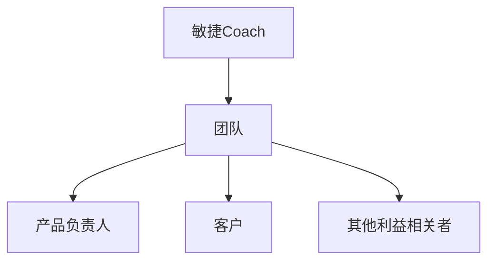

                 

### 文章标题：敏捷Coach在LLM应用开发团队中的角色

#### 关键词：
- 敏捷Coach
- LLM（大型语言模型）
- 敏捷开发
- 团队协作
- 技术决策

#### 摘要：
本文旨在深入探讨敏捷Coach在LLM（大型语言模型）应用开发团队中的角色和作用。通过逻辑清晰、结构紧凑的分析，本文将阐述敏捷Coach的基础理论，其在LLM开发团队中的具体作用，以及如何通过实践提升敏捷Coach的技能。同时，通过案例研究，本文将为读者提供敏捷Coach在LLM应用开发中的最佳实践，并展望其未来的发展趋势。

### 前言

#### 敏捷开发方法论简介

敏捷开发（Agile Development）是一种以人为核心、迭代、循序渐进的开发方法。它强调项目的可持续性发展，鼓励团队内部的紧密协作，以及对需求的快速响应能力。敏捷开发起源于20世纪90年代末，最早由软件开发团队采用，旨在应对快速变化的需求和环境。

敏捷开发的核心原则包括：

1. **个体和互动高于过程和工具**：团队协作和人际互动比单独的编程工具更为重要。
2. **可工作的软件高于详尽的文档**：软件的实际功能比详尽的文档更重要。
3. **客户合作高于合同谈判**：客户需求的变化被纳入开发过程中，而不是被忽视。
4. **响应变化重于遵循计划**：敏捷开发更注重对变化的适应，而非对初始计划的遵循。

#### 敏捷Coach的角色定义

敏捷Coach（敏捷教练）是敏捷开发中的重要角色，负责引导团队实践敏捷原则和方法。敏捷Coach不仅是一个指导者，更是一个支持者和赋能者。他们的主要职责包括：

- **帮助团队理解并应用敏捷原则和方法**。
- **促进团队协作，提升团队效能**。
- **提供敏捷实践和工具的培训与辅导**。
- **解决团队中的冲突和障碍**。
- **帮助团队持续改进，适应变化**。

#### 敏捷Coach的定义及其在LLM开发团队中的重要性

敏捷Coach在LLM（大型语言模型）应用开发团队中扮演着至关重要的角色。LLM项目通常涉及复杂的模型训练、大量的数据处理和高度的技术创新。在这样的环境中，敏捷Coach的作用尤为突出：

- **需求管理**：敏捷Coach可以帮助团队更好地理解和管理复杂的需求，确保项目始终聚焦于用户价值和业务目标。
- **技术决策**：在面对技术挑战时，敏捷Coach可以提供专业建议，帮助团队做出明智的决策。
- **团队协作**：敏捷Coach通过促进团队成员之间的沟通和协作，提高团队的凝聚力和工作效率。
- **持续改进**：敏捷Coach帮助团队不断回顾和改进，确保项目在各个阶段都能保持高效和高质量。

### 第一部分：敏捷Coach基础理论

#### 第1章：敏捷与敏捷Coach概述

##### 敏捷开发方法论简介

敏捷开发方法论是一种以用户需求为核心的软件开发方法，强调迭代、循序渐进和灵活应对变化。敏捷开发的基本原则包括：

- **个体和互动高于过程和工具**：注重团队成员之间的协作和沟通，而非依赖特定的工具。
- **可工作的软件高于详尽的文档**：软件的实际功能是首要考虑的，详尽的文档虽然重要，但不如软件的实际可操作性。
- **客户合作高于合同谈判**：与客户的紧密合作可以更好地理解需求，提高软件的实用性。
- **响应变化重于遵循计划**：在面对需求变化时，更注重快速响应和调整，而不是僵化地遵循初始计划。

##### 敏捷Coach的角色定义

敏捷Coach是敏捷开发中的关键角色，其职责包括：

- **指导团队实践敏捷原则和方法**：帮助团队理解并应用敏捷原则，提升团队的开发效率。
- **促进团队协作**：通过组织团队会议、沟通渠道建设等方式，促进团队成员之间的协作。
- **提供培训与辅导**：为团队成员提供敏捷实践和工具的培训，帮助团队掌握敏捷开发技巧。
- **解决冲突和障碍**：在团队遇到冲突或障碍时，提供解决方案，确保项目顺利进行。
- **持续改进**：通过回顾和反思，帮助团队不断改进，提高项目质量。

##### 敏捷Coach的核心技能与特质

敏捷Coach需要具备以下核心技能与特质：

- **沟通能力**：能够有效地与团队成员、客户和其他利益相关者进行沟通。
- **团队领导力**：能够激励和引导团队成员，提升团队的凝聚力和工作效率。
- **专业知识**：了解敏捷开发原则和方法，具备丰富的敏捷实践经验。
- **适应能力**：能够灵活应对变化，快速调整计划和策略。
- **倾听能力**：能够倾听团队成员的意见和建议，理解他们的需求和困难。

#### 第2章：敏捷Coach的工作流程与职责

##### 敏捷Coach的角色在团队中的角色与关系

敏捷Coach在团队中扮演多重角色，包括指导者、支持者和赋能者。他们与团队成员、产品负责人、客户和其他利益相关者之间的关系如下图所示：

##### 敏捷Coach的工作流程

敏捷Coach的工作流程可以分为以下几个阶段：

1. **启动阶段**：与团队建立联系，了解项目背景和目标，制定敏捷实践计划。
2. **规划阶段**：协助团队制定迭代计划和发布计划，确保项目进度和质量的平衡。
3. **执行阶段**：在迭代过程中，敏捷Coach负责跟踪进展，解决团队遇到的困难和障碍。
4. **回顾阶段**：在迭代结束后，与团队进行回顾会议，总结经验教训，制定改进措施。
5. **持续改进**：根据回顾会议的结果，持续调整敏捷实践计划，提升团队效能。

##### 敏捷Coach的职责与任务

敏捷Coach的职责与任务包括：

- **培训与辅导**：为团队成员提供敏捷开发的培训，确保团队成员掌握敏捷原则和方法。
- **沟通与协调**：促进团队成员、产品负责人、客户和其他利益相关者之间的沟通，确保项目顺利进行。
- **需求管理**：协助团队理解和管理需求，确保项目始终聚焦于用户价值和业务目标。
- **技术决策**：在面对技术挑战时，提供专业建议，帮助团队做出明智的决策。
- **团队协作**：通过组织团队会议、沟通渠道建设等方式，促进团队成员之间的协作。
- **冲突解决**：在团队遇到冲突时，提供解决方案，确保项目顺利进行。
- **持续改进**：通过回顾和反思，帮助团队不断改进，提高项目质量。

### 第二部分：LLM应用开发与敏捷Coach

#### 第3章：LLM应用开发概述

##### LLM的定义与分类

LLM（Large Language Model）是指大型语言模型，是一种能够理解和生成自然语言的人工智能模型。LLM通常具有以下特点：

- **大规模**：LLM通常由数亿甚至数十亿个参数组成，具有庞大的模型规模。
- **深度**：LLM通常包含多个神经网络层，能够深度学习语言模式。
- **自适应**：LLM能够根据不同的应用场景和需求进行自适应调整。

根据应用场景和功能，LLM可以分为以下几类：

- **通用语言模型**：如GPT（Generative Pre-trained Transformer），能够处理各种语言任务，如文本生成、文本分类等。
- **特定领域语言模型**：如BERT（Bidirectional Encoder Representations from Transformers），针对特定领域（如医学、法律等）进行训练，具有更高的专业性和准确性。
- **跨模态语言模型**：如ViTLM（Vision Transformer for Language Modeling），能够处理文本和图像等多模态数据，实现跨模态任务。

##### LLM的开发流程

LLM的开发流程通常包括以下几个阶段：

1. **数据准备**：收集和整理大量的文本数据，用于训练LLM。
2. **模型设计**：设计适合LLM的训练框架和神经网络结构。
3. **模型训练**：使用大量数据进行模型训练，优化模型参数。
4. **模型评估**：通过测试数据对模型进行评估，调整模型参数。
5. **模型部署**：将训练好的模型部署到实际应用场景中，提供语言生成、翻译、问答等功能。

##### LLM的技术挑战与解决方案

在LLM的开发过程中，面临以下技术挑战：

- **数据量巨大**：需要收集和处理大量的文本数据，数据清洗和预处理工作繁琐。
- **计算资源需求高**：训练大规模的LLM需要大量的计算资源，尤其是GPU资源。
- **模型可解释性差**：LLM的内部机制复杂，难以解释其生成结果的原因。
- **训练时间较长**：训练大规模的LLM需要较长的时间，影响开发进度。

针对以上挑战，可以采取以下解决方案：

- **数据增强**：使用数据增强技术，生成更多有价值的训练数据，提高模型性能。
- **分布式训练**：采用分布式训练技术，将模型训练任务分配到多台GPU服务器上，提高训练效率。
- **模型压缩**：使用模型压缩技术，降低模型参数数量，提高模型可解释性。
- **迁移学习**：利用迁移学习方法，将已经训练好的模型应用于新任务，减少训练时间。

#### 第4章：敏捷Coach在LLM开发团队中的作用

##### 敏捷Coach在需求管理中的作用

在LLM开发过程中，需求管理至关重要。敏捷Coach在需求管理中的作用包括：

- **需求分析**：与团队一起分析客户需求，确保需求清晰、明确。
- **需求优先级排序**：协助团队确定需求优先级，确保关键需求得到优先满足。
- **需求变更管理**：在需求发生变化时，敏捷Coach帮助团队快速响应和调整，确保项目不受影响。

##### 敏捷Coach在技术决策中的作用

在LLM开发过程中，技术决策是影响项目成败的关键因素。敏捷Coach在技术决策中的作用包括：

- **技术评估**：评估不同技术方案的优势和劣势，提供专业建议。
- **风险评估**：识别项目中的技术风险，制定应对策略。
- **技术选择**：协助团队选择最适合项目的技术方案，确保项目顺利进行。

##### 敏捷Coach在团队协作中的作用

在LLM开发过程中，团队协作是项目成功的关键。敏捷Coach在团队协作中的作用包括：

- **沟通协调**：促进团队成员之间的沟通，确保信息畅通。
- **团队建设**：组织团队建设活动，提高团队凝聚力和工作效率。
- **冲突解决**：在团队内部发生冲突时，提供中立的意见和解决方案，确保项目顺利进行。

### 第5章：敏捷Coach在LLM项目中的实践

#### 第5章：敏捷Coach在LLM项目中的实践

##### 敏捷Coach在LLM项目启动阶段的实践

在LLM项目启动阶段，敏捷Coach的作用至关重要。以下是敏捷Coach在项目启动阶段的具体实践：

1. **项目规划**：与团队一起制定项目计划，明确项目目标、里程碑和交付物。
2. **团队建设**：组织团队建设活动，增强团队成员之间的信任和协作。
3. **需求分析**：与产品负责人和客户进行需求分析，确保需求清晰、明确。
4. **技术评估**：评估不同技术方案的优势和劣势，提供专业建议。
5. **风险评估**：识别项目中的技术风险，制定应对策略。
6. **沟通渠道建设**：建立有效的沟通渠道，确保团队成员之间的信息畅通。

##### 敏捷Coach在迭代规划与执行的实践

在LLM项目的迭代过程中，敏捷Coach负责确保迭代计划的顺利执行。以下是敏捷Coach在迭代规划与执行阶段的具体实践：

1. **迭代计划**：与团队一起制定迭代计划，确定迭代目标、任务和资源分配。
2. **迭代评审**：在迭代开始前，组织迭代评审会议，确保团队成员对迭代计划有清晰的理解。
3. **任务跟踪**：使用任务管理工具，实时跟踪任务进展，确保任务按计划完成。
4. **团队协作**：促进团队成员之间的协作，解决团队协作中的障碍。
5. **迭代回顾**：在迭代结束后，组织迭代回顾会议，总结经验教训，制定改进措施。

##### 敏捷Coach在项目收尾与回顾的实践

在LLM项目收尾阶段，敏捷Coach负责确保项目的顺利完成和持续改进。以下是敏捷Coach在项目收尾与回顾阶段的具体实践：

1. **项目交付**：确保项目交付物的质量和符合客户需求，组织项目交付评审。
2. **项目总结**：组织项目总结会议，总结项目经验和教训，识别项目中的成功因素和改进点。
3. **知识共享**：将项目经验教训和最佳实践知识进行共享，提升团队整体能力。
4. **持续改进**：根据项目总结和迭代回顾的结果，制定持续改进计划，提升项目质量。
5. **团队赋能**：为团队成员提供培训和学习机会，提升团队成员的专业技能。

### 第三部分：敏捷Coach技能提升与案例研究

#### 第6章：敏捷Coach技能提升

##### 敏捷Coach的个人成长路径

敏捷Coach的个人成长路径包括以下几个阶段：

1. **入门阶段**：学习敏捷开发的基本原则和方法，了解敏捷Coach的职责和角色。
2. **实践阶段**：参与实际项目，担任敏捷Coach的角色，积累实践经验。
3. **提升阶段**：通过参加培训、研讨会和书籍学习，提升敏捷Coach的专业知识和技能。
4. **资深阶段**：成为资深敏捷Coach，能够指导和管理多个项目，具有丰富的敏捷实践经验。

##### 敏捷Coach的团队领导力

敏捷Coach的团队领导力包括以下几个方面：

1. **愿景领导**：明确团队的目标和愿景，激发团队成员的积极性和创造力。
2. **协作领导**：促进团队成员之间的协作，建立信任和合作关系。
3. **赋能领导**：赋予团队成员自主权和决策权，支持团队成员成长和发展。
4. **变革领导**：引领团队适应变化，推动团队持续改进和创新。

##### 敏捷Coach的人际沟通技巧

敏捷Coach的人际沟通技巧包括以下几个方面：

1. **倾听**：倾听团队成员的意见和需求，理解他们的困难和挑战。
2. **表达**：清晰、准确地表达自己的观点和建议，避免误解和冲突。
3. **沟通渠道建设**：建立有效的沟通渠道，确保团队成员之间的信息畅通。
4. **冲突解决**：在团队内部发生冲突时，提供中立的意见和解决方案，确保项目顺利进行。

#### 第7章：敏捷Coach在LLM开发团队中的案例研究

##### 案例一：某金融企业LLM项目的敏捷转型

某金融企业在面临市场竞争压力时，决定采用敏捷开发方法进行LLM项目的开发。以下是敏捷Coach在该企业LLM项目中的具体实践：

1. **需求管理**：敏捷Coach与产品负责人和客户密切合作，确保需求清晰、明确，并根据需求变化快速调整迭代计划。
2. **技术决策**：敏捷Coach在技术决策中发挥重要作用，为团队提供专业建议，确保技术方案的科学性和可行性。
3. **团队协作**：敏捷Coach通过组织团队会议、沟通渠道建设等方式，促进团队成员之间的协作，提高团队凝聚力。
4. **持续改进**：敏捷Coach在项目过程中不断回顾和总结，制定改进措施，提升项目质量。

最终，该金融企业的LLM项目在敏捷转型的过程中取得了显著成果，项目交付物的质量和用户满意度得到了显著提升。

##### 案例二：某互联网公司LLM项目的敏捷Coach实践

某互联网公司在进行LLM项目开发时，聘请了一位资深的敏捷Coach，以下是敏捷Coach在该项目中的具体实践：

1. **项目启动**：敏捷Coach在项目启动阶段与团队一起制定项目计划，明确项目目标和里程碑。
2. **迭代规划**：敏捷Coach协助团队制定迭代计划，确保迭代目标、任务和资源分配合理。
3. **任务跟踪**：敏捷Coach使用任务管理工具，实时跟踪任务进展，确保任务按计划完成。
4. **团队协作**：敏捷Coach通过组织团队会议、沟通渠道建设等方式，促进团队成员之间的协作。
5. **迭代回顾**：敏捷Coach在迭代结束后组织迭代回顾会议，总结经验教训，制定改进措施。

通过敏捷Coach的指导和帮助，该互联网公司的LLM项目在短时间内取得了显著进展，项目交付物的质量和用户满意度得到了显著提升。

##### 案例三：某科技初创公司LLM项目的敏捷转型与挑战

某科技初创公司在进行LLM项目开发时，面临着技术难度高、团队经验不足等挑战。为了实现项目的成功，公司决定采用敏捷开发方法，并聘请了一位资深的敏捷Coach。以下是敏捷Coach在该项目中的具体实践：

1. **需求管理**：敏捷Coach与产品负责人和客户密切合作，确保需求清晰、明确，并根据需求变化快速调整迭代计划。
2. **技术评估**：敏捷Coach在技术评估中发挥重要作用，为团队提供专业建议，确保技术方案的科学性和可行性。
3. **团队建设**：敏捷Coach通过组织团队建设活动，提高团队凝聚力，增强团队成员之间的信任和合作。
4. **持续改进**：敏捷Coach在项目过程中不断回顾和总结，制定改进措施，提升项目质量。
5. **挑战应对**：在项目过程中，敏捷Coach帮助团队应对技术难度高、团队经验不足等挑战，确保项目顺利进行。

最终，该科技初创公司的LLM项目在敏捷转型的过程中取得了成功，项目交付物的质量和用户满意度得到了显著提升。

### 第四部分：未来展望与趋势

#### 第8章：敏捷Coach在LLM应用开发中的未来趋势

##### LLM技术的发展趋势对敏捷Coach的影响

随着LLM技术的不断发展，敏捷Coach的角色和职责将面临以下趋势和挑战：

1. **技术复杂性增加**：随着LLM模型的规模和深度不断增加，敏捷Coach需要具备更深入的技术知识和技能，以应对复杂的技术挑战。
2. **数据隐私和安全**：在处理大规模的文本数据时，敏捷Coach需要关注数据隐私和安全问题，确保数据的安全和合规。
3. **模型可解释性**：随着用户对模型可解释性的需求增加，敏捷Coach需要关注模型的可解释性研究，提高模型的可解释性水平。

##### 敏捷Coach在未来的角色变化

未来，敏捷Coach的角色将发生以下变化：

1. **技术顾问**：敏捷Coach将更多地扮演技术顾问的角色，提供专业的技术建议和指导。
2. **数据科学家**：敏捷Coach需要具备一定的数据科学知识，能够参与数据预处理和模型优化。
3. **业务分析师**：敏捷Coach需要具备业务分析能力，能够深入了解用户需求，为团队提供有针对性的解决方案。

##### 敏捷Coach如何应对未来的挑战

为了应对未来的挑战，敏捷Coach需要采取以下策略：

1. **持续学习**：不断学习新技术、新方法，提升自身的技术水平和业务能力。
2. **跨学科合作**：与数据科学家、业务分析师等跨学科团队成员紧密合作，共同应对复杂问题。
3. **知识共享**：积极参与知识共享活动，将自身的经验和知识传授给团队成员。
4. **敏捷实践**：持续推广和实践敏捷开发方法，提高团队协作效率和项目质量。

### 附录

#### 敏捷Coach相关资源与推荐阅读

1. **书籍**：
   - 《敏捷实践指南》（Agile Practice Guide）- 适用于初学者和有经验的敏捷教练。
   - 《Scrum敏捷实践指南》（Scrum: The Art of Doing Twice the Work in Half the Time）- 深入了解Scrum方法的最佳实践。

2. **在线课程**：
   - 敏捷联盟（Agile Alliance）- 提供各种敏捷认证课程和培训。
   - Coursera、Udemy等在线教育平台- 提供丰富的敏捷开发课程。

3. **社区和论坛**：
   - 敏捷联盟论坛（Agile Alliance Forums）- 参与敏捷社区的讨论和交流。
   - Stack Overflow、GitHub等开发者社区- 寻找敏捷开发问题和解决方案。

#### LLM开发与敏捷Coach的常用工具与技术

1. **工具**：
   - JIRA、Trello等任务管理工具- 用于任务跟踪和团队协作。
   - Git、GitHub等版本控制工具- 用于代码管理和团队协作。
   - Docker、Kubernetes等容器化工具- 用于模型训练和部署。

2. **技术**：
   - Python、R等编程语言- 用于数据处理和模型训练。
   - TensorFlow、PyTorch等深度学习框架- 用于模型训练和优化。
   - Scikit-learn、Numpy等数据科学库- 用于数据处理和分析。

3. **推荐书籍**：
   - 《深度学习》（Deep Learning）- 由Ian Goodfellow等作者编写的深度学习经典教材。
   - 《机器学习实战》（Machine Learning in Action）- 适合初学者实践的机器学习入门书籍。

### 作者信息

**作者：AI天才研究院/AI Genius Institute & 禅与计算机程序设计艺术 /Zen And The Art of Computer Programming**

