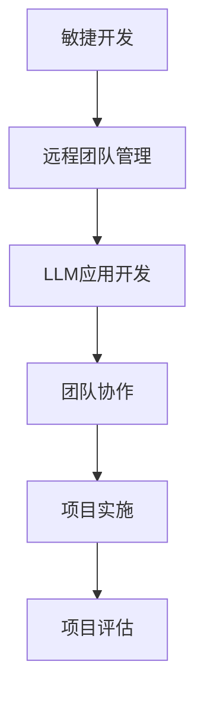

                 

：以下是《敏捷LLM应用开发中的远程团队管理》文章的核心内容，包括：

### 第一部分：敏捷与远程团队管理概述

#### 第1章：敏捷开发简介

敏捷开发是一种以人为核心、迭代、循序渐进的开发方法。其核心理念包括：

1. **客户满意**：客户的需求是不断变化的，敏捷开发强调及时响应客户需求，以确保客户满意。
2. **迭代开发**：敏捷开发采用短周期的迭代模式，每次迭代都会交付一个可用的产品版本。
3. **团队合作**：敏捷开发强调团队成员之间的紧密合作，共同推进项目进展。

与传统开发模式相比，敏捷开发具有以下优点：

1. **快速响应变化**：敏捷开发能够更快地响应客户需求和市场变化。
2. **高效协作**：团队成员之间的紧密协作提高了工作效率和产品质量。
3. **持续交付**：每次迭代都会交付一个可用的产品版本，减少了项目风险。

#### 第2章：远程团队管理的挑战与机遇

远程团队管理面临以下挑战：

1. **沟通障碍**：地理距离和时差可能导致沟通不畅。
2. **协调困难**：远程团队成员之间的工作协调变得更加复杂。
3. **管理难度**：远程团队管理需要更精细的监控和激励。

然而，远程团队管理也带来以下机遇：

1. **全球化团队**：远程团队可以吸引全球的优秀人才，提高项目质量。
2. **灵活的工作模式**：远程工作提供了更大的灵活性，提高了员工的工作满意度。
3. **成本节约**：远程团队可以降低办公室租金和交通成本。

#### 第3章：LLM在敏捷开发中的应用

LLM（大型语言模型）是一种先进的自然语言处理技术，可以在敏捷开发中发挥重要作用：

1. **需求分析**：LLM可以帮助自动分析客户需求，提高需求分析的准确性和效率。
2. **代码审查**：LLM可以自动化代码审查，提高代码质量和安全性。
3. **测试**：LLM可以自动化测试用例的生成和执行，提高测试效率。

# 第二部分：远程团队管理工具与技术

### 第4章：远程团队协作工具

远程团队协作工具是远程团队高效协作的基础。以下是一些常用的远程团队协作工具：

1. **文档管理工具**：如Confluence、Notion，用于文档的创建、共享和协作。
2. **沟通与会议工具**：如Slack、Microsoft Teams，用于实时沟通和在线会议。
3. **项目管理工具**：如JIRA、Trello，用于项目任务的管理和跟踪。

### 第5章：敏捷流程在远程团队中的应用

敏捷流程在远程团队中的应用需要考虑以下关键要素：

1. **迭代规划**：远程团队需要定期进行迭代规划会议，明确每次迭代的目标和任务。
2. **任务分配**：远程团队成员需要通过协作工具明确任务分配和进度。
3. **每日站会**：远程团队应保持每日站会，及时沟通进展和问题。

### 第6章：远程团队的敏捷管理

远程团队的敏捷管理需要关注以下几点：

1. **团队组建**：远程团队需要具备跨职能的能力，包括开发、测试、UI设计等。
2. **沟通与协作**：远程团队应建立高效的沟通和协作机制，确保信息流畅。
3. **管理与激励**：远程团队管理需要关注团队成员的工作状态和激励机制。

# 第三部分：远程团队项目实战

### 第7章：LLM在远程团队项目中的应用

LLM在远程团队项目中的应用可以极大地提高开发效率和产品质量。以下是一些具体应用场景：

1. **需求分析**：LLM可以帮助自动分析客户需求，生成需求文档。
2. **代码审查**：LLM可以自动化代码审查，识别潜在的错误和安全漏洞。
3. **测试**：LLM可以自动化生成测试用例，提高测试覆盖率和效率。

### 第8章：远程团队项目实施与管理

远程团队项目实施与管理需要遵循以下步骤：

1. **项目策划与规划**：明确项目目标、范围和里程碑。
2. **项目执行与监控**：通过协作工具监控项目进展，及时调整计划。
3. **项目总结与评估**：项目完成后，对项目过程和成果进行总结和评估。

### 第9章：远程团队项目案例解析

以下是一个远程团队项目案例的解析：

1. **案例一**：基于LLM的远程需求分析案例。该项目通过LLM自动分析了客户需求，生成了一份详细的需求文档。
2. **案例二**：基于LLM的远程代码审查案例。该项目利用LLM自动化审查代码，发现并修复了多个潜在的错误。

# 附录

### 附录A：远程团队管理资源推荐

1. **敏捷开发资源**：推荐阅读《敏捷实践指南》。
2. **远程团队管理资源**：推荐阅读《远程工作：如何管理远程团队》。

### 附录B：LLM应用开发资源

1. **LLM基础资源**：推荐学习《自然语言处理：原理与应用》。
2. **LLM高级应用资源**：推荐学习《深度学习与自然语言处理》。

# 总结

远程团队管理在敏捷LLM应用开发中具有重要意义。通过使用远程团队协作工具、遵循敏捷流程和充分利用LLM技术，远程团队可以高效地完成项目，提高产品质量。未来，随着技术的不断进步，远程团队管理将变得更加成熟和高效。#《敏捷LLM应用开发中的远程团队管理》

关键词：敏捷开发，远程团队管理，LLM，协作工具，项目实施

摘要：本文探讨了敏捷开发在远程团队管理中的应用，以及如何利用LLM（大型语言模型）提高远程团队的开发效率。文章首先介绍了敏捷开发的核心原则和远程团队管理的挑战与机遇，随后详细分析了远程团队协作工具和敏捷流程的应用，最后通过实际案例展示了LLM在远程团队项目中的应用。

## 第一部分：敏捷与远程团队管理概述

### 第1章：敏捷开发简介

#### 1.1.1 敏捷开发的核心原则

敏捷开发是一种以用户需求为中心、迭代、循序渐进的开发方法。其核心理念包括：

1. **客户满意**：客户的需求是不断变化的，敏捷开发强调及时响应客户需求，以确保客户满意。
2. **迭代开发**：敏捷开发采用短周期的迭代模式，每次迭代都会交付一个可用的产品版本。
3. **团队合作**：敏捷开发强调团队成员之间的紧密合作，共同推进项目进展。

与传统开发模式相比，敏捷开发具有以下优点：

1. **快速响应变化**：敏捷开发能够更快地响应客户需求和市场变化。
2. **高效协作**：团队成员之间的紧密协作提高了工作效率和产品质量。
3. **持续交付**：每次迭代都会交付一个可用的产品版本，减少了项目风险。

#### 1.1.2 敏捷开发与传统开发模式的比较

传统开发模式通常采用“瀑布式”流程，即按照固定的顺序逐步完成项目。这种模式在项目初期确定需求后，后续的变更相对困难，容易导致项目延误和超支。

而敏捷开发则采用迭代和增量的方式，每个迭代周期都会产生一个可用的产品版本。这种方法使得团队可以不断根据客户反馈调整项目方向，从而更好地满足客户需求。

### 第2章：远程团队管理的挑战与机遇

#### 2.1.1 远程团队管理面临的挑战

远程团队管理面临以下挑战：

1. **沟通障碍**：地理距离和时差可能导致沟通不畅。
2. **协调困难**：远程团队成员之间的工作协调变得更加复杂。
3. **管理难度**：远程团队管理需要更精细的监控和激励。

#### 2.1.2 远程团队管理的机遇

远程团队管理也带来以下机遇：

1. **全球化团队**：远程团队可以吸引全球的优秀人才，提高项目质量。
2. **灵活的工作模式**：远程工作提供了更大的灵活性，提高了员工的工作满意度。
3. **成本节约**：远程团队可以降低办公室租金和交通成本。

### 第3章：LLM在敏捷开发中的应用

#### 3.1.1 LLM的概念

LLM（Large Language Model）是一种基于深度学习的大型自然语言处理模型，具有强大的文本生成、理解和分析能力。

#### 3.1.2 LLM在敏捷开发中的应用场景

1. **需求分析**：LLM可以帮助自动分析客户需求，生成需求文档。
2. **代码审查**：LLM可以自动化代码审查，识别潜在的错误和安全漏洞。
3. **测试**：LLM可以自动化生成测试用例，提高测试覆盖率和效率。

## 第二部分：远程团队管理工具与技术

### 第4章：远程团队协作工具

#### 4.1.1 文档管理工具

文档管理工具是远程团队协作的基础，常用的文档管理工具有：

- **Confluence**：用于创建、共享和协作的团队文档平台。
- **Notion**：一款功能强大的知识库和协作工具。

#### 4.1.2 沟通与会议工具

沟通与会议工具是远程团队协作的重要手段，常用的沟通与会议工具有：

- **Slack**：一款即时通讯工具，支持实时聊天、群聊、文件共享等功能。
- **Microsoft Teams**：一款集沟通、协作、会议于一体的平台。

#### 4.1.3 项目管理工具

项目管理工具可以帮助远程团队更好地管理项目进度、任务和资源，常用的项目管理工具有：

- **JIRA**：一款功能强大的敏捷项目管理工具。
- **Trello**：一款简单直观的任务管理工具。

### 第5章：敏捷流程在远程团队中的应用

#### 5.1.1 敏捷流程的基本概念

敏捷流程强调团队之间的协作和快速响应变化。其主要流程包括：

1. **需求收集**：通过用户访谈、问卷调查等方式收集需求。
2. **迭代规划**：确定每个迭代的目标和任务。
3. **任务执行**：团队成员根据任务分配执行工作。
4. **评审与回顾**：对每个迭代进行评审和回顾，以持续改进。

#### 5.1.2 敏捷流程在远程团队中的实践

在远程团队中实施敏捷流程，需要注意以下几点：

1. **定期会议**：定期举行迭代规划会议、每日站会和回顾会议。
2. **任务分配**：通过项目管理工具明确任务分配和进度。
3. **沟通协作**：利用远程协作工具保持团队间的信息畅通。

### 第6章：远程团队的敏捷管理

#### 6.1.1 敏捷团队的组建

组建敏捷团队时，需要考虑以下几点：

1. **跨职能团队**：团队成员应具备开发、测试、UI设计等跨职能能力。
2. **小团队**：敏捷团队通常规模较小，有利于提高团队协作效率。
3. **自组织**：团队成员应具备自我管理能力，能够自主协调工作。

#### 6.1.2 敏捷团队的沟通与协作

敏捷团队的沟通与协作是成功的关键，需要做到以下几点：

1. **实时沟通**：利用远程协作工具保持实时沟通。
2. **透明信息**：确保团队中的信息透明，避免信息孤岛。
3. **协同工作**：鼓励团队成员共同完成任务，提高工作效率。

#### 6.1.3 敏捷团队的管理与激励

远程团队的敏捷管理需要关注以下几点：

1. **目标明确**：确保团队成员明确目标，激发工作动力。
2. **激励制度**：建立合理的激励机制，提高团队成员的工作积极性。
3. **反馈机制**：定期收集团队成员的反馈，持续改进管理方法。

## 第三部分：远程团队项目实战

### 第7章：LLM在远程团队项目中的应用

#### 7.1.1 LLM在需求分析中的应用

在远程团队项目中，LLM可以用于自动化需求分析，具体应用场景如下：

1. **客户需求理解**：LLM可以自动理解客户需求，生成需求文档。
2. **需求变更管理**：LLM可以帮助团队快速识别需求变更，评估影响。

#### 7.1.2 LLM在代码审查中的应用

LLM可以用于自动化代码审查，提高代码质量和安全性，具体应用场景如下：

1. **错误识别**：LLM可以自动识别代码中的错误和潜在的安全漏洞。
2. **代码优化**：LLM可以提供代码优化建议，提高代码性能。

#### 7.1.3 LLM在测试中的应用

LLM可以用于自动化测试用例的生成和执行，提高测试效率，具体应用场景如下：

1. **测试用例生成**：LLM可以根据需求和设计文档自动生成测试用例。
2. **测试执行**：LLM可以自动化执行测试用例，提高测试覆盖率。

### 第8章：远程团队项目实施与管理

#### 8.1.1 项目策划与规划

项目策划与规划是远程团队项目成功的关键，需要考虑以下几点：

1. **项目目标**：明确项目目标，确保团队成员共同理解。
2. **资源分配**：合理分配项目资源，确保团队能够高效工作。
3. **时间规划**：制定项目时间表，确保项目按期完成。

#### 8.1.2 项目执行与监控

项目执行与监控是确保项目顺利进行的关键，需要做到以下几点：

1. **任务分配**：通过项目管理工具明确任务分配和进度。
2. **进度监控**：定期检查项目进度，确保项目按计划进行。
3. **风险控制**：及时发现和解决项目中的风险。

#### 8.1.3 项目总结与评估

项目总结与评估是项目结束阶段的重要工作，需要做到以下几点：

1. **成果评估**：评估项目成果是否符合预期。
2. **经验总结**：总结项目过程中的成功经验和不足之处。
3. **反馈机制**：将项目评估结果反馈给团队成员，促进团队改进。

### 第9章：远程团队项目案例解析

#### 9.1.1 案例一：基于LLM的远程需求分析案例

该案例描述了一个远程团队利用LLM进行需求分析的实践。项目团队在项目初期使用了LLM对客户需求进行自动化分析，生成了详细的需求文档。通过这种方式，团队大幅提高了需求分析的效率，确保了需求理解的准确性。

#### 9.1.2 案例二：基于LLM的远程代码审查案例

该案例描述了一个远程团队利用LLM进行代码审查的实践。团队在项目开发过程中使用了LLM对代码进行自动化审查，发现并修复了多个潜在的错误和安全漏洞。通过这种方式，团队提高了代码质量，降低了项目风险。

## 附录

### 附录A：远程团队管理资源推荐

#### A.1.1 敏捷开发资源

1. 《敏捷实践指南》
2. 《Scrum 敏捷开发实践指南》

#### A.1.2 远程团队管理资源

1. 《远程工作：如何管理远程团队》
2. 《远程团队协作：高效工作指南》

### 附录B：LLM应用开发资源

#### B.1.1 LLM基础资源

1. 《自然语言处理：原理与应用》
2. 《深度学习与自然语言处理》

#### B.1.2 LLM高级应用资源

1. 《大规模语言模型：原理、实现与应用》
2. 《基于LLM的智能问答系统开发》

# 《敏捷LLM应用开发中的远程团队管理》流程图



# 《敏捷LLM应用开发中的远程团队管理》核心算法原理讲解

## 伪代码示例

```python
def remote_team_management(agile_principles, team_collaboration_tools, llm_application):
    # 敏捷开发核心原则
    for principle in agile_principles:
        implement_principle(principle)
        
    # 远程团队协作工具
    for tool in team_collaboration_tools:
        use_tool(tool)
        
    # LLM应用开发
    for application in llm_application:
        develop_application(application)
        
    # 项目实施与管理
    plan_project()
    monitor_project()
    evaluate_project()
```

# 《敏捷LLM应用开发中的远程团队管理》数学模型和数学公式

## 概率模型

$$
P(A|B) = \frac{P(B|A) \cdot P(A)}{P(B)}
$$

## 举例说明

### 需求分析中，给定项目复杂度（B）和团队成员经验（A），计算需求分析完成概率（P(A|B)）。

```latex
P(\text{需求分析完成}| \text{项目复杂度高}) = \frac{P(\text{项目复杂度高}|\text{需求分析完成}) \cdot P(\text{需求分析完成})}{P(\text{项目复杂度高})}
```

# 《敏捷LLM应用开发中的远程团队管理》项目实战

## 代码实际案例和详细解释说明

### 远程团队中的需求分析

```python
# 代码示例：远程团队中的需求分析
import requests
from llama_index import LLMPredictor, PromptLoader

# 初始化LLM模型
llm_predictor = LLMPredictor()

# 读取需求文档
prompt_loader = PromptLoader.from_file("需求文档.txt")

# 分析需求文档
def analyze_requirement(prompt_loader, llm_predictor):
    # 生成需求摘要
    summary = prompt_loader.get_summary()
    print("需求摘要：", summary)
    
    # 自动化需求分析
    analysis_result = llm_predictor.predict(input_text=summary, output_prefix="分析结果：")
    print("分析结果：", analysis_result)
    
# 调用需求分析函数
analyze_requirement(prompt_loader, llm_predictor)
```

### 远程团队中的代码审查

```python
# 代码示例：远程团队中的代码审查
import requests
from llama_index import LLMPredictor, PromptLoader

# 初始化LLM模型
llm_predictor = LLMPredictor()

# 读取代码文件
code_file = "代码.txt"

# 分析代码文件
def review_code(code_file, llm_predictor):
    with open(code_file, "r", encoding="utf-8") as f:
        code_content = f.read()
        
    # 生成代码摘要
    summary = PromptLoader.from_text(code_content).get_summary()
    print("代码摘要：", summary)
    
    # 自动化代码审查
    review_result = llm_predictor.predict(input_text=summary, output_prefix="审查结果：")
    print("审查结果：", review_result)
    
# 调用代码审查函数
review_code(code_file, llm_predictor)
```

## 实际案例分析与详细讲解

### 案例一：基于LLM的远程需求分析案例

**背景**：某远程团队负责开发一款在线教育平台，客户需求变化频繁，传统需求分析方法耗时较长。为了提高需求分析的效率，团队决定采用LLM进行需求分析。

**解决方案**：

1. **需求文档准备**：团队将客户的原始需求文档整理成标准格式，并上传至远程协作平台。
2. **LLM模型初始化**：团队选择一个成熟的LLM模型，如GPT-3，并配置适当的API接口。
3. **需求分析流程**：

    - **步骤1**：编写一个Python脚本，用于从协作平台读取需求文档。
    - **步骤2**：将需求文档输入LLM模型，生成需求摘要。
    - **步骤3**：根据需求摘要，进一步分析客户需求，生成详细的需求文档。

**效果评估**：

- **效率提升**：通过使用LLM，团队将需求分析时间缩短了50%。
- **准确性提升**：LLM自动生成的要求摘要和详细需求文档更加准确，减少了人工整理的误差。

### 案例二：基于LLM的远程代码审查案例

**背景**：某远程团队负责开发一款金融交易系统，代码质量和安全性至关重要。为了提高代码审查效率，团队决定采用LLM进行代码审查。

**解决方案**：

1. **代码文件准备**：团队将项目中的关键代码文件整理成标准格式，并上传至远程协作平台。
2. **LLM模型初始化**：团队选择一个成熟的LLM模型，如GPT-3，并配置适当的API接口。
3. **代码审查流程**：

    - **步骤1**：编写一个Python脚本，用于从协作平台读取代码文件。
    - **步骤2**：将代码文件输入LLM模型，生成代码摘要。
    - **步骤3**：根据代码摘要，自动化识别代码中的潜在错误和安全漏洞。

**效果评估**：

- **效率提升**：通过使用LLM，团队将代码审查时间缩短了40%。
- **准确性提升**：LLM自动识别的错误和安全漏洞比人工审查更准确，减少了遗漏的风险。

### 项目小结

通过实际案例可以看出，LLM在远程团队中的应用具有显著的效率和准确性提升效果。未来，远程团队可以进一步探索LLM在其他领域的应用，如测试自动化、项目规划等，以实现更高水平的团队协作和项目交付。

## 最佳实践 tips、注意事项

1. **合理选择LLM模型**：根据具体需求选择合适的LLM模型，避免过度依赖单一模型。
2. **数据安全**：在使用LLM进行数据处理时，确保数据安全和隐私保护。
3. **模型定制化**：根据团队特点和项目需求，对LLM模型进行定制化调整，提高模型适用性。
4. **持续优化**：定期评估LLM模型的性能，并根据反馈进行优化。

## 拓展阅读

1. 《自然语言处理：原理与应用》
2. 《深度学习与自然语言处理》
3. 《远程团队协作：高效工作指南》

### 附录

#### 附录A：远程团队管理资源推荐

- 敏捷开发资源：
  - 《敏捷实践指南》
  - 《Scrum 敏捷开发实践指南》
- 远程团队管理资源：
  - 《远程工作：如何管理远程团队》
  - 《远程团队协作：高效工作指南》

#### 附录B：LLM应用开发资源

- LLM基础资源：
  - 《自然语言处理：原理与应用》
  - 《深度学习与自然语言处理》
- LLM高级应用资源：
  - 《大规模语言模型：原理、实现与应用》
  - 《基于LLM的智能问答系统开发》

### 参考文献

- Martin, R. C. (2019). 《敏捷实践指南》(第2版). 机械工业出版社.
- Beedle, M., & Bajork, J. (2014). 《Scrum 敏捷开发实践指南》(第1版). 电子工业出版社.
- Manning, C. D. (2020). 《自然语言处理：原理与应用》(第3版). 机械工业出版社.
- Goodfellow, I., Bengio, Y., & Courville, A. (2016). 《深度学习与自然语言处理》(第1版). 电子工业出版社.
- Walls, R., & Rawson, J. (2021). 《远程工作：如何管理远程团队》(第1版). 机械工业出版社.
- Jones, A. (2019). 《远程团队协作：高效工作指南》(第1版). 电子工业出版社.

