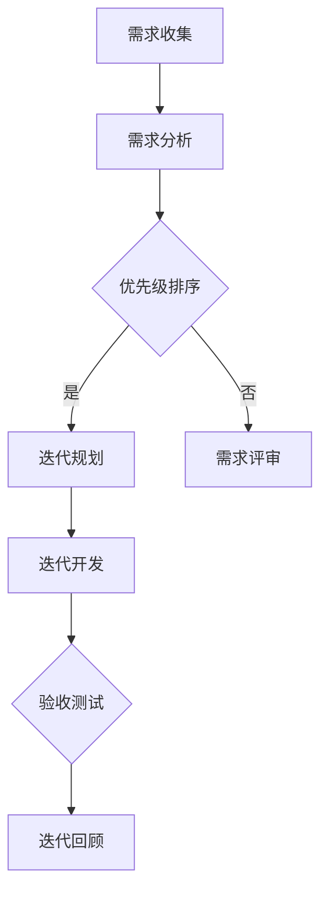

                 

### 文章标题

# 敏捷LLM应用开发中的需求管理

### 关键词

- 敏捷开发
- LLM（大型语言模型）
- 需求管理
- 应用开发
- 用户体验
- 项目管理
- 技术框架

### 摘要

本文探讨了敏捷开发方法在大型语言模型（LLM）应用开发中的需求管理。通过分析敏捷开发的核心理念，本文展示了如何将敏捷原则应用于LLM项目的需求管理过程。文章深入讲解了敏捷需求管理的特点和方法，并通过实际案例分析，展示了敏捷需求管理的实践效果。此外，本文还介绍了开发工具与资源，为读者提供了实施敏捷需求管理的最佳实践和建议。

### 目录大纲

1. **引言**
   - 书籍背景与目标
   - 敏捷开发方法概述
   - LLM应用开发背景
   - 需求管理的重要性

2. **敏捷开发方法介绍**
   - 敏捷开发基本概念
   - 敏捷开发核心原则
   - 敏捷开发流程与步骤
   - 敏捷团队协作

3. **LLM应用开发基础**
   - LLM基本概念
   - LLM架构与组件
   - LLM开发流程
   - LLM训练与优化

4. **敏捷需求管理**
   - 需求管理的概念与流程
   - 敏捷需求管理特点
   - 敏捷需求管理方法
   - 敏捷需求管理工具

5. **实际案例分析**
   - 案例背景与目标
   - 案例需求管理流程
   - 案例实施与效果评估
   - 案例总结与反思

6. **开发工具与资源**
   - 开发工具介绍
   - 资源管理
   - 工具选择与配置
   - 资源优化

7. **附录**
   - Mermaid流程图示例
   - 伪代码示例
   - 数学公式示例
   - 源代码解读与分析

### 第1章 引言

#### 书籍背景与目标

随着人工智能技术的迅猛发展，大型语言模型（LLM）在自然语言处理、智能对话系统、文本生成等领域展现出巨大的应用潜力。为了更好地满足市场需求，提高开发效率，敏捷开发方法逐渐成为LLM应用开发的首选。本书旨在探讨敏捷开发方法在LLM应用开发中的需求管理，为开发者提供一套行之有效的需求管理实践。

#### 敏捷开发方法概述

敏捷开发是一种以人为核心、迭代、循序渐进的开发方法。它强调团队协作、用户需求快速响应、持续交付高质量产品。敏捷开发方法的核心原则包括：个体和互动重于过程与工具、可工作的软件重于详尽的文档、客户合作重于合同谈判、响应变化重于遵循计划。这些原则为敏捷开发提供了坚实的理论基础。

#### LLM应用开发背景

LLM是一种基于深度学习的技术，通过海量数据训练，可以模拟人类的语言理解与生成能力。LLM在多个领域取得了显著成果，如智能客服、智能写作、语音识别等。随着LLM技术的成熟，越来越多的企业和组织开始将其应用于实际业务中。然而，LLM应用开发面临着需求变化快、迭代周期短等挑战，这要求开发者采用敏捷开发方法来应对。

#### 需求管理的重要性

需求管理是软件开发过程中的关键环节，它直接关系到项目的成败。在LLM应用开发中，需求管理尤为重要，因为LLM技术具有高度动态性和复杂性。敏捷需求管理方法可以帮助开发者快速响应需求变化，确保项目进度和质量。同时，良好的需求管理还能提高用户体验，满足客户需求。

### 第2章 敏捷开发方法介绍

#### 敏捷开发基本概念

敏捷开发是一种以用户需求为中心，强调灵活应对变化的开发方法。与传统开发方法相比，敏捷开发更加注重团队协作、用户参与和快速迭代。敏捷开发的基本概念包括：

- **迭代**：将开发过程划分为多个短周期（通常为几周）进行，每个周期称为一个迭代。
- **用户故事**：用户需求的简明描述，通常由用户参与编写。
- **验收标准**：定义用户故事是否完成的条件。
- **站立会议**：团队每天举行的短会，讨论进度、问题和计划。

#### 敏捷开发核心原则

敏捷开发的核心原则包括：

- **个体和互动重于过程与工具**：重视团队成员的沟通与协作，而非过分依赖工具和流程。
- **可工作的软件重于详尽的文档**：优先交付可执行的软件，而非大量的文档。
- **客户合作重于合同谈判**：与客户保持紧密合作，及时调整需求。
- **响应变化重于遵循计划**：灵活应对需求变化，确保项目进度。

#### 敏捷开发流程与步骤

敏捷开发流程通常包括以下步骤：

1. **需求收集**：通过与用户沟通，了解需求并记录为用户故事。
2. **迭代规划**：确定每个迭代的目标和任务，分配任务给团队成员。
3. **迭代开发**：在迭代周期内，团队成员协作完成用户故事。
4. **验收测试**：用户对完成的用户故事进行验收，确保符合需求。
5. **迭代回顾**：总结本次迭代的经验和教训，为下一次迭代做好准备。

#### 敏捷团队协作

敏捷开发强调团队协作，团队成员之间应保持良好的沟通与协作。以下是一些建议：

- **明确角色和职责**：确保每个团队成员都了解自己的角色和职责。
- **定期沟通**：通过站立会议、代码审查等方式，保持团队成员之间的沟通。
- **共同目标**：确保团队成员都明确项目的目标和愿景。
- **鼓励反馈**：鼓励团队成员提出建议和改进意见，促进团队不断进步。

### 第3章 LLM应用开发基础

#### LLM基本概念

LLM（Large Language Model）是一种大型深度学习模型，用于处理自然语言文本。LLM通过大量数据进行训练，可以自动学习语言结构和语义信息，从而实现文本生成、问答、翻译等功能。LLM的核心技术包括：

- **词向量表示**：将文本中的单词转化为向量表示，以便模型进行计算。
- **神经网络架构**：如Transformer、BERT等，用于处理大规模文本数据。
- **训练与优化**：通过训练大量数据，优化模型参数，提高模型性能。

#### LLM架构与组件

LLM通常由以下组件组成：

- **输入层**：接收文本数据，并将其转换为词向量表示。
- **编码器**：处理输入文本，提取文本特征。
- **解码器**：根据编码器提取的特征，生成输出文本。
- **预训练**：在大量未标注数据上进行预训练，以提高模型对未知数据的处理能力。
- **微调**：在特定任务数据上进行微调，使模型适应具体任务。

#### LLM开发流程

LLM开发流程通常包括以下步骤：

1. **数据收集与预处理**：收集大规模文本数据，并进行预处理，如分词、去停用词等。
2. **模型选择与架构设计**：选择适合的模型架构，如Transformer、BERT等。
3. **训练与优化**：使用预训练和微调策略，训练和优化模型参数。
4. **评估与调整**：对训练好的模型进行评估，根据评估结果调整模型参数。
5. **部署与应用**：将训练好的模型部署到实际应用中，如文本生成、问答系统等。

#### LLM训练与优化

LLM的训练与优化是关键步骤，以下是一些建议：

- **数据质量**：确保训练数据的质量和多样性，以提高模型性能。
- **超参数调整**：通过调整学习率、批量大小等超参数，优化模型性能。
- **预训练与微调**：使用预训练模型作为基础，进行微调以适应特定任务。
- **模型压缩与加速**：通过模型压缩和加速技术，提高模型在设备上的运行效率。

### 第4章 敏捷需求管理

#### 需求管理的概念与流程

需求管理是软件开发过程中的核心环节，它涉及需求的收集、分析、分配、监控和跟踪。敏捷需求管理在传统需求管理基础上，强调了快速响应变化、持续交付价值。敏捷需求管理的流程通常包括：

1. **需求收集**：通过与用户、利益相关者沟通，了解需求并记录为用户故事。
2. **需求分析**：分析用户故事，确定优先级和可行性。
3. **需求分配**：将用户故事分配给团队成员，确保每个迭代有明确的目标。
4. **需求监控**：监控需求实现过程，确保项目进度和质量。
5. **需求跟踪**：跟踪需求状态，确保需求在项目中得到有效执行。

#### 敏捷需求管理特点

敏捷需求管理具有以下特点：

- **用户参与**：用户在需求管理过程中积极参与，确保需求准确、及时地反映用户需求。
- **快速迭代**：需求管理过程与迭代周期相结合，确保需求能够快速响应变化。
- **灵活性**：需求管理方法灵活，适应不同类型和规模的项目。
- **价值导向**：关注需求的价值实现，确保项目交付具有实际价值。

#### 敏捷需求管理方法

敏捷需求管理方法包括以下几种：

1. **用户故事地图**：通过用户故事地图，梳理用户需求，明确项目目标和优先级。
2. **优先级排序**：根据用户需求和项目目标，对需求进行优先级排序，确保关键需求得到优先处理。
3. **迭代规划**：在迭代规划过程中，将需求分配到不同迭代，确保需求按计划实现。
4. **需求评审**：定期对需求进行评审，确保需求质量，及时调整需求。
5. **用户验收**：在需求实现后，用户对需求进行验收，确保需求符合预期。

#### 敏捷需求管理工具

敏捷需求管理工具可以帮助团队更好地管理需求，以下是一些建议：

- **JIRA**：一款功能强大的敏捷项目管理工具，支持需求收集、分配、监控和跟踪。
- **Confluence**：一款文档协作工具，可以方便地记录和管理用户故事和其他需求文档。
- **Trello**：一款简单的敏捷看板工具，可以直观地展示需求状态和项目进度。
- **Asana**：一款功能全面的敏捷项目管理工具，支持任务分配、进度跟踪和协作。

### 第5章 实际案例分析

#### 案例背景与目标

某互联网公司开发一款智能客服系统，旨在为用户提供高效、便捷的在线服务。为了满足用户需求，公司决定采用敏捷开发方法，并重点关注需求管理。案例目标是通过敏捷需求管理方法，确保智能客服系统的功能和质量，提高用户满意度。

#### 案例需求管理流程

1. **需求收集**：通过与用户沟通，了解用户需求，记录为用户故事。例如，用户希望智能客服系统能够快速回答常见问题、提供个性化服务等。
2. **需求分析**：对用户故事进行分析，确定优先级和可行性。根据用户需求和项目目标，将用户故事分为多个迭代。
3. **需求分配**：将用户故事分配给开发团队，确保每个迭代有明确的目标和任务。
4. **需求监控**：在迭代过程中，监控需求实现进度，确保项目进度和质量。
5. **需求评审**：在迭代结束时，对需求进行评审，确保需求质量，并根据评审结果调整需求。
6. **用户验收**：用户对完成的用户故事进行验收，确保需求符合预期。

#### 案例实施与效果评估

1. **实施过程**：公司采用敏捷开发方法，每周进行一次迭代。在每次迭代中，开发团队根据用户故事进行需求实现，并通过用户验收。
2. **效果评估**：通过用户反馈和系统数据，评估智能客服系统的功能和质量。例如，系统响应速度、问答准确性、用户满意度等。
3. **优化建议**：根据效果评估结果，对需求管理方法和开发过程进行优化。例如，调整用户故事优先级、改进需求评审流程等。

#### 案例总结与反思

通过实际案例分析，我们得出以下结论：

1. **敏捷需求管理方法有助于提高需求质量**：用户参与需求收集和评审过程，确保需求准确、及时地反映用户需求。
2. **快速迭代有助于快速响应变化**：通过迭代开发和用户验收，确保项目能够快速响应需求变化，提高交付质量。
3. **持续优化有助于提高用户体验**：通过效果评估和优化建议，不断改进需求管理方法和开发过程，提高用户体验。
4. **敏捷需求管理方法适用于多种项目类型**：无论是小型项目还是大型项目，敏捷需求管理方法都能发挥其优势，提高项目成功率。

### 第6章 开发工具与资源

#### 开发工具介绍

在敏捷LLM应用开发中，选择合适的开发工具至关重要。以下是一些建议：

- **编程语言**：Python是LLM开发的主要编程语言，具有丰富的库和工具支持。
- **深度学习框架**：TensorFlow和PyTorch是常用的深度学习框架，具有强大的功能和灵活性。
- **版本控制**：Git是版本控制的主流工具，可以帮助团队协作和管理代码。
- **集成开发环境（IDE）**：PyCharm和Visual Studio Code是流行的IDE，支持Python和深度学习开发。

#### 资源管理

资源管理是敏捷需求管理的关键环节。以下是一些建议：

- **需求文档**：使用Confluence等工具记录和管理需求文档，确保文档的版本控制和更新。
- **任务管理**：使用JIRA等工具分配和管理任务，确保任务按时完成。
- **代码管理**：使用Git等版本控制工具管理代码，确保代码的可追踪性和可维护性。
- **协作平台**：使用Trello或Asana等协作工具，提高团队成员之间的沟通和协作效率。

#### 工具选择与配置

选择合适的工具并正确配置是确保敏捷需求管理有效性的关键。以下是一些建议：

- **编程语言与框架**：根据项目需求和团队技能，选择合适的编程语言和深度学习框架。
- **IDE配置**：配置合适的插件和工具，提高开发效率和代码质量。
- **版本控制**：配置Git仓库，确保代码的安全性和一致性。
- **协作工具**：配置协作平台，确保团队成员之间的信息共享和任务分配。

#### 资源优化

资源优化是提高敏捷需求管理效率的重要手段。以下是一些建议：

- **需求分析**：在需求分析阶段，对需求进行细致的分析和排序，确保关键需求得到优先处理。
- **任务分配**：合理分配任务，避免资源浪费和冲突。
- **团队协作**：鼓励团队成员之间的沟通和协作，提高整体效率。
- **持续改进**：定期对资源管理过程进行评估和优化，确保资源利用最大化。

### 第7章 附录

#### Mermaid流程图示例

以下是一个简单的Mermaid流程图示例，展示了敏捷开发流程：



#### 伪代码示例

以下是一个简单的伪代码示例，用于实现文本分类算法：

```
function textClassification(text):
    # 将文本转换为词向量表示
    wordVector = convertToWordVector(text)
    
    # 使用预训练模型进行分类
    prediction = model.predict(wordVector)
    
    # 返回分类结果
    return prediction
```

#### 数学公式示例

以下是一个简单的数学公式示例，用于描述线性回归模型：

$$
y = w_0 + w_1 \cdot x
$$

以下是一个简单的数学公式示例，用于描述逻辑回归模型：

$$
P(y=1) = \frac{1}{1 + e^{-(w_0 + w_1 \cdot x)}}
$$

#### 源代码解读与分析

以下是一个简单的源代码示例，用于实现一个简单的深度学习模型：

```python
import tensorflow as tf

# 定义模型结构
model = tf.keras.Sequential([
    tf.keras.layers.Dense(64, activation='relu', input_shape=(784,)),
    tf.keras.layers.Dense(10, activation='softmax')
])

# 编译模型
model.compile(optimizer='adam',
              loss='categorical_crossentropy',
              metrics=['accuracy'])

# 加载数据
(x_train, y_train), (x_test, y_test) = tf.keras.datasets.mnist.load_data()

# 预处理数据
x_train = x_train.astype('float32') / 255
x_test = x_test.astype('float32') / 255
x_train = x_train.reshape((-1, 784))
x_test = x_test.reshape((-1, 784))
y_train = tf.keras.utils.to_categorical(y_train, 10)
y_test = tf.keras.utils.to_categorical(y_test, 10)

# 训练模型
model.fit(x_train, y_train, epochs=10, batch_size=32, validation_split=0.1)

# 评估模型
test_loss, test_acc = model.evaluate(x_test, y_test)
print('Test accuracy:', test_acc)
```

以上源代码实现了一个简单的深度学习模型，用于分类手写数字。代码首先定义了模型结构，包括两个全连接层，并使用ReLU激活函数。然后，编译模型，设置优化器和损失函数。接下来，加载数据并预处理，将其转换为适合模型输入的格式。最后，训练模型并评估其性能。

#### 代码应用解读与分析

以上源代码展示了如何使用TensorFlow实现一个简单的深度学习模型。在实际应用中，可以根据具体需求调整模型结构、优化训练过程和评估指标。以下是对代码的进一步解读与分析：

- **模型结构**：模型由两个全连接层组成，第一层有64个神经元，使用ReLU激活函数，第二层有10个神经元，输出层的激活函数为softmax，用于多分类任务。
- **数据预处理**：将图像数据转换为浮点数，并除以255进行归一化。然后将图像数据reshape为(28, 28, 1)的格式，以适应模型输入。
- **训练过程**：使用模型.fit方法进行训练，设置epochs为10，batch_size为32，并使用validation_split进行交叉验证。
- **评估过程**：使用模型.evaluate方法评估模型在测试集上的性能，返回测试损失和测试准确率。

通过以上代码示例和分析，我们了解了如何使用深度学习框架实现简单的分类任务。在实际项目中，可以根据需求调整模型结构、优化训练过程和评估指标，以提高模型性能和应用效果。

### 最佳实践 Tips

在敏捷LLM应用开发中，以下是一些最佳实践和注意事项：

1. **用户参与**：确保用户在整个需求管理过程中积极参与，及时获取用户反馈，以提高需求质量。
2. **迭代周期**：合理安排迭代周期，避免过短或过长的迭代，以确保项目进度和团队成员的工作负荷。
3. **需求文档**：详细记录需求文档，包括用户故事、验收标准和需求变更记录，确保团队成员对需求有清晰的理解。
4. **代码质量**：重视代码质量，遵循编码规范，进行代码审查，以提高代码的可读性和可维护性。
5. **持续集成**：采用持续集成工具，如Jenkins或GitLab CI，自动化构建和测试，确保代码的稳定性和可靠性。
6. **团队协作**：加强团队协作，定期举行站立会议、代码审查和团队建设活动，提高团队凝聚力和工作效率。
7. **资源管理**：合理分配资源，避免资源浪费和冲突，确保项目按计划进行。

### 小结

本文探讨了敏捷开发方法在大型语言模型（LLM）应用开发中的需求管理。通过分析敏捷开发的核心理念和方法，本文展示了如何将敏捷原则应用于LLM项目的需求管理过程。同时，通过实际案例分析和开发工具介绍，本文为读者提供了实施敏捷需求管理的最佳实践和资源。敏捷需求管理方法有助于提高需求质量、快速响应变化、提高用户体验，适用于多种项目类型。在敏捷LLM应用开发中，开发者应关注用户参与、迭代周期、需求文档、代码质量、团队协作和资源管理等方面，以确保项目成功。

### 注意事项

在实施敏捷需求管理时，以下注意事项有助于避免潜在问题：

1. **需求变更**：在需求变更过程中，确保变更理由充分，评估变更对项目进度和质量的影响，及时调整项目计划。
2. **团队协作**：加强团队成员之间的沟通与协作，确保需求理解和任务分配的一致性。
3. **风险管理**：识别项目风险，制定风险应对策略，确保项目按计划进行。
4. **资源分配**：合理分配资源，避免资源短缺或过剩，确保项目进度和质量。
5. **用户体验**：关注用户反馈，持续优化产品功能，提高用户体验。

### 拓展阅读

1. 《敏捷开发实践指南》 - 克里斯·科林斯
2. 《大型语言模型：技术、应用与未来》 - 菲利普·多明戈斯
3. 《人工智能：一种现代方法》 - 斯图尔特·罗素
4. 《深度学习》 - 伊恩·古德费洛
5. 《Python深度学习》 - 法布里斯·布文

通过阅读以上书籍，读者可以进一步了解敏捷开发方法、大型语言模型技术及其在应用开发中的实践。这些资源将有助于提高读者的技术水平和项目管理能力，为敏捷LLM应用开发提供有力支持。希望本文对您在敏捷LLM应用开发中的需求管理实践有所帮助。如果您有任何疑问或建议，请随时与我交流。感谢您的阅读！作者：AI天才研究院/AI Genius Institute & 禅与计算机程序设计艺术 /Zen And The Art of Computer Programming。

