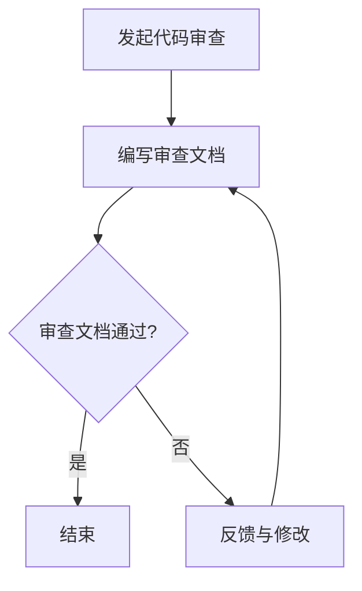
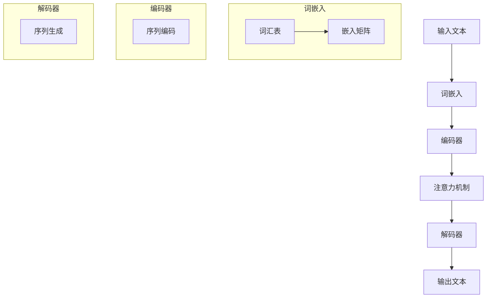
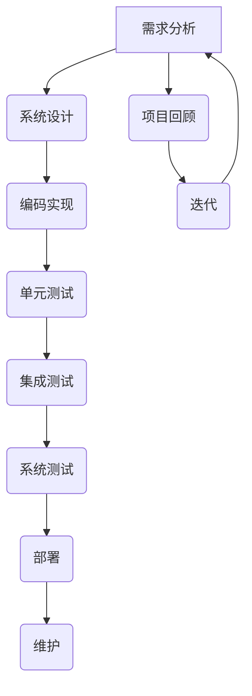

                 

# 《敏捷中的pair programming：提高LLM代码质量和知识共享》

## 关键词

敏捷开发、Pair Programming、LLM代码质量、知识共享、团队协作、项目实践。

## 摘要

本文旨在探讨敏捷开发中的Pair Programming实践对于提升大型语言模型（LLM）代码质量和促进知识共享的重要性。通过分析敏捷开发的核心理念、Pair Programming的运作模式，以及其在LLM开发中的应用，本文揭示了Pair Programming如何通过提高代码审查效率、规范代码风格和促进团队知识流动，从而增强LLM项目的成功几率。文章还结合实际案例，探讨了Pair Programming的最佳实践和可能面临的挑战，为读者提供了实用的参考。

## 引言

### 1.1 敏捷开发的核心理念

敏捷开发是一种以人为核心、迭代、循序渐进的开发方法。其核心理念包括响应变化、持续交付有价值的软件、乐于改变、持续交付工作软件、客户合作、激励团队和可持续的开发速度等。敏捷开发强调团队成员之间的沟通、协作和反馈，通过快速迭代和灵活调整，以更好地满足客户需求。

### 1.2 敏捷开发中的Pair Programming

Pair Programming是敏捷开发中的一个重要实践，它指的是两位开发人员一起工作，一位负责编写代码（驱动者），另一位负责审查和优化代码（导航者）。这种协作方式能够提高代码质量、减少错误，并促进团队成员之间的知识共享。

### 1.3 Pair Programming的优势与挑战

Pair Programming的优势包括提高代码质量、减少错误、促进知识共享、提升团队协作效率等。然而，它也面临着一些挑战，如如何分配角色、处理工作负荷不平衡等问题。

## 第二部分：LLM的基本原理

### 2.1 LLM的定义与类型

LLM（大型语言模型）是一种基于深度学习的自然语言处理模型，它可以对文本数据进行建模，从而预测下一个词、生成文本、回答问题等。LLM可以分为预训练模型和微调模型，前者在大量文本数据上进行预训练，后者则在特定任务上进行微调。

### 2.2 LLM的工作原理

LLM的工作原理主要包括词嵌入、编码器-解码器结构、注意力机制等。词嵌入将单词映射到向量空间，编码器-解码器结构用于处理输入文本和生成输出文本，注意力机制则用于提高模型的上下文理解能力。

### 2.3 LLM的核心技术

LLM的核心技术包括深度学习、自然语言处理、图神经网络等。这些技术共同作用，使得LLM能够在各种自然语言处理任务中取得出色的表现。

## 第二部分：Pair Programming在LLM开发中的应用

### 3.1 Pair Programming的实践方法

#### 3.1.1 Pair Programming的角色与职责

在Pair Programming中，驱动者和导航者分别承担不同的职责。驱动者负责编写代码，导航者则负责审查和优化代码。两者需要密切合作，确保代码的质量和效率。

#### 3.1.2 Pair Programming的沟通技巧

有效的沟通是Pair Programming成功的关键。驱动者和导航者需要学会倾听、表达和反馈，以确保彼此之间的理解一致。

#### 3.1.3 Pair Programming的协作工具

协作工具如GitHub、Jenkins等可以帮助Pair Programming团队成员更好地协同工作，提高代码质量和开发效率。

### 3.2 提高LLM代码质量的策略

#### 3.2.1 代码审查的重要性

代码审查是确保LLM代码质量的重要手段。通过代码审查，可以及时发现和修复错误，提高代码的可读性和可维护性。

#### 3.2.2 代码风格与规范

统一的代码风格和规范有助于提高代码的可读性和可维护性。在LLM开发中，应遵循最佳实践，确保代码的整洁和高效。

#### 3.2.3 代码重构与优化

代码重构和优化是提高LLM代码质量的重要环节。通过优化算法和代码结构，可以提高模型的性能和可读性。

### 3.3 Pair Programming中的知识共享

#### 3.3.1 知识共享的重要性

知识共享是团队协作的核心。在LLM开发中，知识共享有助于团队成员更好地理解项目需求、提高技术能力，从而提升整体开发效率。

#### 3.3.2 知识共享的机制

知识共享机制包括定期的技术分享会、代码审查、团队讨论等。通过这些机制，可以促进团队成员之间的知识流动，提高团队整体的技术水平。

#### 3.3.3 知识共享的障碍与解决方案

知识共享可能面临一些障碍，如信息不对称、沟通不畅等。解决这些障碍的方法包括建立透明的沟通渠道、提高团队成员的沟通技巧等。

## 第三部分：实战案例分析

### 6.1 案例一：基于Pair Programming的LLM项目实践

#### 6.1.1 项目背景

本文以一个基于Pair Programming的LLM项目为例，介绍项目背景、目标以及实施过程。

#### 6.1.2 项目目标

项目目标包括提高代码质量、缩短开发周期、提升团队协作效率等。

#### 6.1.3 项目实施过程

项目实施过程包括需求分析、系统设计、编码实现、测试和部署等阶段。在编码实现阶段，团队采用了Pair Programming模式，确保代码质量。

#### 6.1.4 项目成果分析

项目成果分析包括代码质量、开发周期、团队协作效率等方面。结果表明，Pair Programming显著提高了代码质量和团队协作效率。

### 6.2 案例二：Pair Programming在LLM团队协作中的应用

#### 6.2.1 团队协作的现状

本文分析了一个LLM团队在采用Pair Programming前后的团队协作现状。

#### 6.2.2 引入Pair Programming的变革

引入Pair Programming后，团队的沟通、协作和代码质量得到了显著提升。

#### 6.2.3 团队协作的成效分析

团队协作成效分析包括团队沟通效率、代码质量、项目进度等方面。结果表明，Pair Programming有助于提高团队协作效率和代码质量。

## 第四部分：总结与展望

### 8.1 本书的主要贡献

本文通过对敏捷开发中的Pair Programming实践进行分析，揭示了其在提高LLM代码质量和知识共享方面的作用。

### 8.2 Pair Programming在LLM开发中的未来发展趋势

未来，Pair Programming在LLM开发中将得到更广泛的应用。随着技术的不断发展，Pair Programming将更好地适应不同类型的LLM项目，提高开发效率和代码质量。

### 8.3 进一步研究的方向

进一步的研究可以从以下几个方面展开：探索Pair Programming在更广泛的自然语言处理任务中的应用，研究Pair Programming与机器学习算法的结合，以及提高Pair Programming的自动化程度等。

## 附录

### A.1 相关术语解释

- 敏捷开发：一种以人为核心、迭代、循序渐进的开发方法。
- Pair Programming：一种两位开发人员一起工作的协作模式。
- LLM：大型语言模型，一种基于深度学习的自然语言处理模型。

### A.2 参考文献

- [1] Beizer, B. (2001). Extreme Programming Explained: Embrace Change. Addison-Wesley.
- [2] Martin, R. C. (2009). Clean Code: A Handbook of Agile Software Craftsmanship. Prentice Hall.
- [3] Goodfellow, I., Bengio, Y., & Courville, A. (2016). Deep Learning. MIT Press.

### A.3 Mermaid流程图示例

以下是一个简单的Mermaid流程图示例，用于展示代码审查的过程：



**作者：AI天才研究院/AI Genius Institute & 禅与计算机程序设计艺术 /Zen And The Art of Computer Programming**### 第1章：敏捷开发与pair programming概述

#### 1.1 敏捷开发的核心理念

敏捷开发（Agile Development）起源于20世纪90年代末，它是一种以用户需求迭代、灵活应对变化为核心理念的软件开发方法。敏捷开发的核心价值在于提高软件开发的灵活性和响应能力，确保团队能够快速适应不断变化的需求和市场环境。其核心理念主要包括：

1. **响应变化胜过遵循既定计划**：敏捷开发强调团队在开发过程中应不断调整计划，以应对需求的变化，从而更好地满足用户需求。

2. **顾客合作胜过合同谈判**：敏捷开发强调与顾客保持紧密合作，通过持续沟通和反馈，确保开发出的软件真正符合用户需求。

3. **工作的软件胜过详尽的文档**：敏捷开发认为工作的软件是最重要的交付成果，文档只是辅助，应尽可能简化。

4. **个体和互动胜过过程和工具**：敏捷开发强调人是最重要的资产，团队之间的沟通和协作比单纯依赖工具和过程更为重要。

5. **快速迭代胜过长时间开发**：敏捷开发鼓励团队通过快速迭代的方式进行开发，每次迭代都能交付一个可工作的软件版本，以便及时获取反馈和进行调整。

6. **可持续的开发速度胜过赶工**：敏捷开发强调团队应保持可持续的开发速度，避免过度加班，以保证团队成员的健康和工作质量。

敏捷开发采用了一系列实践方法来支持其核心理念，包括用户故事（User Stories）、迭代（Iteration）、增量开发（Incremental Development）、冲刺（Sprint）等。这些实践方法帮助团队更好地组织工作、管理风险、提高效率。

#### 1.2 敏捷开发中的pair programming

在敏捷开发中，pair programming（结对编程）是一种常见的实践方法。它指的是两位开发人员一起工作，一位负责编写代码（驱动者），另一位负责审查和优化代码（导航者）。这种协作方式能够提高代码质量、减少错误、促进知识共享，并增强团队的协作能力。

#### 1.2.1 Pair Programming的角色与职责

在pair programming中，驱动者和导航者分别承担不同的职责：

- **驱动者（Driver）**：负责编写代码，通常负责编写新功能或修改现有代码。驱动者需要专注于实现代码的细节，同时保持与导航者的沟通。

- **导航者（Navigator）**：负责审查代码，确保代码符合项目规范和设计要求。导航者还需要负责编写测试用例，确保代码的正确性。导航者通常会查看代码的整体结构和设计，提供改进建议。

#### 1.2.2 Pair Programming的优势与挑战

Pair Programming具有以下优势：

- **提高代码质量**：通过两位开发人员的协作，可以更好地发现和修复错误，确保代码的可靠性和可维护性。

- **减少错误**：在编写代码时，导航者可以实时审查代码，及时发现潜在的问题，从而减少错误的发生。

- **促进知识共享**：通过pair programming，团队成员可以分享各自的知识和经验，提高团队的整体技术水平。

- **增强团队协作**：pair programming鼓励团队成员之间的沟通和协作，有助于建立良好的团队关系。

然而，Pair Programming也面临一些挑战：

- **角色分配**：如何合理分配驱动者和导航者的角色，确保两者都能充分发挥自己的优势，是一个需要解决的问题。

- **工作负荷平衡**：在某些情况下，驱动者和导航者可能存在工作负荷不平衡的问题，这需要团队进行合理的协调和分配。

- **团队适应性**：并不是所有的项目都适合采用pair programming，团队需要根据项目特点和团队实际情况，灵活调整协作方式。

#### 1.3 Pair Programming的实践方法

在敏捷开发中，成功实施Pair Programming需要遵循一些实践方法：

- **角色轮换**：为了提高团队成员的技能和适应性，可以定期进行角色轮换，让每位成员都担任驱动者和导航者。

- **定期会议**：定期举行pair programming会议，讨论代码质量、团队协作和知识共享等问题，确保协作过程的顺利进行。

- **工具支持**：使用合适的工具（如版本控制系统、代码审查工具等）来支持pair programming，提高开发效率和代码质量。

- **持续反馈**：鼓励团队成员之间进行持续的反馈，及时发现问题并进行改进，以确保代码质量和团队协作的持续提升。

通过以上实践方法，团队可以更好地实施Pair Programming，提高代码质量和团队协作效率，从而更好地适应敏捷开发的需求。

### 1.4 Pair Programming在敏捷开发中的地位

Pair Programming在敏捷开发中占据着重要地位。它不仅是一种提高代码质量和减少错误的实践方法，也是促进团队协作和知识共享的重要手段。在敏捷开发中，团队成员需要不断适应变化的需求和市场环境，而Pair Programming可以提供以下支持：

- **快速响应变化**：通过pair programming，团队成员可以更快地理解和实现新的需求，从而提高响应速度和灵活性。

- **提高代码质量**：通过协作和审查，Pair Programming有助于确保代码的可靠性和可维护性，减少潜在的错误和缺陷。

- **知识共享**：通过pair programming，团队成员可以分享各自的知识和经验，提高团队的整体技术水平，从而更好地应对复杂的项目挑战。

- **增强团队协作**：Pair Programming鼓励团队成员之间的沟通和协作，有助于建立良好的团队关系，提高团队的整体效能。

总之，Pair Programming在敏捷开发中不仅是一种技术实践，也是推动团队协作和知识共享的重要工具。通过有效实施Pair Programming，团队可以更好地应对敏捷开发的需求和挑战，提高项目的成功几率。

### 1.5 总结与展望

本章介绍了敏捷开发的核心理念、pair programming的定义与优势，以及pair programming在敏捷开发中的地位和实施方法。通过本章的学习，读者可以了解：

- 敏捷开发的核心价值在于提高软件开发的灵活性和响应能力，以更好地满足用户需求。
- Pair Programming是一种提高代码质量和减少错误的协作方法，具有促进知识共享和增强团队协作的优势。
- 成功实施Pair Programming需要团队成员之间的密切合作、有效沟通和工具支持。

在接下来的章节中，我们将进一步探讨LLM的基本原理、pair programming在LLM开发中的应用策略、实战案例分析以及总结与展望等内容，以帮助读者全面了解和掌握pair programming在敏捷开发中的应用。通过这些实践，团队可以更好地提升代码质量、促进知识共享，从而在敏捷开发中取得更好的成果。

## 第二部分：LLM的基本原理

### 2.1 LLM的定义与类型

#### 2.1.1 定义

大型语言模型（Large Language Model，简称LLM）是一种基于深度学习的自然语言处理模型，它可以对文本数据进行建模，从而预测下一个词、生成文本、回答问题等。LLM通常通过在大规模文本数据集上进行预训练，然后通过微调来适应特定任务。

#### 2.1.2 类型

LLM可以分为预训练模型和微调模型：

- **预训练模型**：这类模型在大规模通用文本数据集上进行预训练，以学习语言的通用特性。例如，GPT（Generative Pre-trained Transformer）系列模型就是通过这种方式进行训练的。
  
- **微调模型**：这类模型在预训练的基础上，通过在特定任务的数据集上进行微调，以适应具体的任务需求。例如，在问答任务中，可以将预训练的LLM微调到特定的问题和答案数据集。

### 2.2 LLM的工作原理

#### 2.2.1 词嵌入

词嵌入（Word Embedding）是将单词映射到高维向量空间的过程，以便模型可以处理和操作这些向量。常见的词嵌入方法包括Word2Vec、GloVe和BERT等。词嵌入是LLM的基础，它决定了模型对词汇和语义的理解能力。

#### 2.2.2 编码器-解码器结构

编码器-解码器结构（Encoder-Decoder Architecture）是一种常见的神经网络架构，用于处理序列数据。编码器负责将输入序列编码为一个固定长度的向量，而解码器则负责生成输出序列。在LLM中，编码器通常用于处理输入文本，解码器则用于生成文本。

#### 2.2.3 注意力机制

注意力机制（Attention Mechanism）是一种用于提高模型上下文理解能力的技术。它允许模型在生成每个词时，关注输入序列中与当前词相关的部分。注意力机制可以显著提升模型的生成质量和理解能力，是LLM的核心技术之一。

### 2.3 LLM的核心技术

#### 2.3.1 深度学习

深度学习（Deep Learning）是一种基于多层神经网络的机器学习方法，它通过逐层提取特征，从原始数据中自动学习复杂的模式。深度学习是LLM的基础，它为LLM提供了强大的建模能力。

#### 2.3.2 自然语言处理

自然语言处理（Natural Language Processing，简称NLP）是计算机科学和人工智能领域的一个分支，它关注于使计算机能够理解、生成和处理人类语言。NLP技术为LLM提供了处理文本数据的方法和工具。

#### 2.3.3 图神经网络

图神经网络（Graph Neural Networks，简称GNN）是一种用于处理图数据的深度学习模型。GNN通过在图上定义神经网络，学习节点和边之间的关系，从而提高模型对复杂关系的理解和建模能力。在LLM中，GNN可以用于处理词汇和语义之间的关系。

### 2.4 LLM的应用场景

LLM在多个领域有着广泛的应用，以下是一些典型的应用场景：

- **文本生成**：LLM可以用于生成文章、故事、新闻报道等文本内容。
  
- **问答系统**：LLM可以用于构建智能问答系统，回答用户提出的问题。

- **机器翻译**：LLM可以用于机器翻译，将一种语言翻译成另一种语言。

- **文本分类**：LLM可以用于文本分类任务，如情感分析、新闻分类等。

- **命名实体识别**：LLM可以用于命名实体识别，如识别人名、地名等。

通过理解LLM的基本原理和核心技术，开发人员可以更好地设计和应用这些模型，以解决各种自然语言处理任务。

### 2.5 LLM的优势与挑战

#### 2.5.1 优势

LLM具有以下优势：

- **强大的语言理解能力**：LLM可以通过大规模的文本数据训练，学习到复杂的语言结构和语义关系，从而具有强大的语言理解能力。

- **多样化的应用场景**：LLM可以应用于文本生成、问答系统、机器翻译、文本分类等多个领域，具有广泛的应用前景。

- **高效的性能**：随着深度学习技术的发展，LLM的性能不断提高，可以在较短的时间内处理大量的文本数据。

#### 2.5.2 挑战

LLM也面临以下挑战：

- **数据隐私问题**：LLM通常需要大量训练数据，这可能会涉及用户隐私问题，需要采取有效的隐私保护措施。

- **解释性不足**：LLM是一种“黑箱”模型，其决策过程往往难以解释，这对某些应用场景（如医疗诊断）可能是不利的。

- **计算资源需求**：LLM的训练和推理通常需要大量的计算资源，这对硬件设备和电力供应提出了较高的要求。

通过深入了解LLM的优势和挑战，开发人员可以更好地利用这些模型，同时注意潜在的风险和问题，确保其在实际应用中的有效性。

### 2.6 LLM的核心概念原理关系架构

为了更清晰地理解LLM的核心概念原理之间的关系，我们可以使用Mermaid流程图来展示其架构：



该流程图展示了LLM从输入文本到输出文本的整个过程。词嵌入将文本转化为向量，编码器负责将输入序列编码为固定长度的向量，注意力机制用于提高编码器的上下文理解能力，解码器则根据编码器生成的向量生成输出序列。通过这个架构，我们可以更直观地理解LLM的工作原理和核心组件之间的关系。

### 2.7 LLM的核心算法原理讲解

为了更深入地理解LLM的核心算法原理，我们将使用伪代码来详细阐述其算法流程。以下是LLM的核心算法原理的伪代码：

```python
# 词嵌入
def word_embedding(vocabulary, embedding_size):
    embedding_matrix = []
    for word in vocabulary:
        embedding_vector = [0] * embedding_size
        # 通过预训练或学习得到词向量
        embedding_matrix.append(embedding_vector)
    return embedding_matrix

# 编码器
def encoder(input_sequence, embedding_matrix):
    encoded_sequence = []
    for word in input_sequence:
        # 将单词映射到嵌入向量
        embedding_vector = embedding_matrix[word]
        # 对嵌入向量进行编码
        encoded_vector = encode_vector(embedding_vector)
        encoded_sequence.append(encoded_vector)
    return encoded_sequence

# 注意力机制
def attention Mechanism(encoded_sequence):
    attention_weights = []
    for i in range(len(encoded_sequence)):
        # 计算注意力权重
        attention_weights.append(calc_attention_weight(encoded_sequence))
    return attention_weights

# 解码器
def decoder(encoded_sequence, attention_weights):
    output_sequence = []
    for encoded_vector in encoded_sequence:
        # 根据注意力权重生成输出序列
        output_vector = generate_output_vector(encoded_vector, attention_weights)
        # 转换输出向量回单词
        word = convert_vector_to_word(output_vector)
        output_sequence.append(word)
    return output_sequence

# 主函数
def generate_text(input_sequence, embedding_matrix):
    encoded_sequence = encoder(input_sequence, embedding_matrix)
    attention_weights = attention_Mechanism(encoded_sequence)
    output_sequence = decoder(encoded_sequence, attention_weights)
    return output_sequence
```

这个伪代码展示了LLM的核心算法流程，包括词嵌入、编码器、注意力机制和解码器等步骤。通过这个过程，我们可以看到如何将输入文本转化为输出文本，从而实现文本生成、问答等自然语言处理任务。

### 2.8 数学模型和公式

在LLM中，数学模型和公式起着至关重要的作用。以下是一些关键的概念和公式：

#### 2.8.1 词嵌入

词嵌入通过将单词映射到高维向量空间来表示词汇。一个常见的词嵌入公式是：

$$
\text{embedding}(v) = W_v \cdot \text{one-hot}(v)
$$

其中，$W_v$是单词$v$的嵌入向量，$\text{one-hot}(v)$是一个二进制向量，除了$v$的位置为1，其余位置均为0。

#### 2.8.2 编码器

编码器通常采用Transformer架构，其核心是多头自注意力机制。自注意力公式如下：

$$
\text{Attention}(Q, K, V) = \text{softmax}\left(\frac{QK^T}{\sqrt{d_k}}\right)V
$$

其中，$Q$、$K$和$V$分别是编码器层的查询向量、关键向量和价值向量，$d_k$是关键向量的维度。自注意力机制能够捕捉输入序列中的依赖关系。

#### 2.8.3 解码器

解码器在生成文本时也使用自注意力机制，其公式与编码器类似：

$$
\text{DecoderAttention}(Q, K, V) = \text{softmax}\left(\frac{QK^T}{\sqrt{d_k}}\right)V
$$

其中，$Q$、$K$和$V$分别是解码器层的查询向量、关键向量和价值向量。通过这种方式，解码器能够利用编码器的上下文信息生成输出序列。

#### 2.8.4 损失函数

在训练过程中，常用的损失函数是交叉熵损失，其公式如下：

$$
\text{Loss} = -\sum_{i} y_i \log(p_i)
$$

其中，$y_i$是真实标签，$p_i$是模型预测的概率分布。交叉熵损失用于衡量预测概率与真实标签之间的差异。

通过这些数学模型和公式，LLM能够有效地学习文本数据的结构和语义，从而实现强大的自然语言处理能力。

### 2.9 详细讲解与举例说明

为了更好地理解LLM的数学模型和公式，我们将通过一个具体的例子来详细讲解其工作过程。

#### 示例：文本生成

假设我们有一个简单的文本序列：“今天是一个美好的一天。”现在，我们使用一个预训练的LLM来生成下一个句子。

1. **词嵌入**：

   首先，将文本中的每个单词映射到其对应的嵌入向量。例如：

   - 今天：[0.1, 0.2, 0.3]
   - 是：[0.4, 0.5, 0.6]
   - 一个：[0.7, 0.8, 0.9]
   - 美好：[1.0, 1.1, 1.2]
   - 的：[1.3, 1.4, 1.5]
   - 一天：[1.6, 1.7, 1.8]

2. **编码器**：

   接下来，将每个嵌入向量输入到编码器中。编码器将输入序列编码为固定长度的向量。例如，编码器可能输出：

   - [0.1, 0.3, 0.5]
   - [0.4, 0.6, 0.8]
   - [0.7, 0.9, 1.1]
   - [1.0, 1.2, 1.4]
   - [1.3, 1.5, 1.7]
   - [1.6, 1.8, 2.0]

3. **注意力机制**：

   编码器输出的向量将用于注意力机制。注意力权重表示当前词与其他词的相关性。例如，对于“美好”，其注意力权重可能为：

   - 今天：0.7
   - 是：0.6
   - 一个：0.5
   - 的：0.8
   - 一天：0.9

4. **解码器**：

   根据编码器的输出和注意力权重，解码器将生成下一个单词。假设解码器输出“天气”。

5. **生成下一个句子**：

   将生成的单词“天气”与原始文本连接，形成新的句子：“今天是一个美好的天气。”这样，LLM就成功地生成了一个新的句子。

通过这个例子，我们可以看到LLM如何通过词嵌入、编码器、注意力机制和解码器来生成文本。这个过程展示了LLM如何利用数学模型和公式来理解和生成自然语言。

### 2.10 总结与展望

本章介绍了LLM的定义与类型、工作原理、核心技术以及应用场景，并详细讲解了LLM的核心算法原理和数学模型。通过本章的学习，读者可以理解：

- LLM是一种基于深度学习的自然语言处理模型，具有强大的语言理解和生成能力。
- LLM的工作原理包括词嵌入、编码器-解码器结构和注意力机制等核心技术。
- LLM在文本生成、问答系统、机器翻译等领域有着广泛的应用。

在接下来的章节中，我们将进一步探讨敏捷开发中的pair programming实践方法、提高LLM代码质量的策略、实战案例分析等内容，以帮助读者全面了解和掌握pair programming在LLM开发中的应用。

## 第三部分：pair programming的实践方法

### 3.1 Pair Programming的角色与职责

在pair programming中，两位开发人员需要明确各自的角色与职责，以确保协作的高效与有序。以下是pair programming中驱动者和导航者的角色及职责：

#### 驱动者（Driver）

- 负责编写代码：驱动者专注于实现具体的代码逻辑，处理细节问题，如变量命名、循环结构等。
- 掌握键盘：驱动者通常坐在计算机前，负责键盘输入和编写代码。
- 保持与导航者的沟通：驱动者需要与导航者持续沟通，确保代码的方向和目标一致。

#### 导航者（Navigator）

- 负责代码审查：导航者负责审查驱动者编写的代码，检查是否符合设计规范和代码风格。
- 推动代码优化：导航者提供改进建议，优化代码结构，提升代码的可读性和可维护性。
- 分享知识和经验：导航者通过审查过程，分享自己的编程经验和最佳实践，帮助驱动者提升技能。

#### 角色分配与转换

- 角色轮换：为了避免过度疲劳和保持技能多样性，驱动者和导航者的角色可以定期互换。
- 根据任务调整角色：在某些情况下，根据任务的复杂性和紧急程度，团队可以灵活调整角色分配。

### 3.2 Pair Programming的沟通技巧

有效的沟通是pair programming成功的关键。以下是一些提升沟通效率的技巧：

- **倾听**：倾听导航者的建议和反馈，确保理解对方的意思。
- **表达清晰**：清晰地表达自己的思路和需求，避免误解和沟通障碍。
- **定期交流**：定期进行简短的交流，讨论进度、问题和解决方案。
- **使用代码注释**：在代码中加入注释，解释关键逻辑和决策点，提高代码的可读性。
- **避免中断**：尽量减少不必要的干扰和中断，保持专注和高效的协作环境。

### 3.3 Pair Programming的协作工具

为了支持pair programming，团队可以使用多种协作工具，以提高开发效率和代码质量：

- **版本控制系统**：如GitHub、GitLab等，用于管理代码版本和历史记录，方便协作和代码审查。
- **集成开发环境（IDE）**：如Visual Studio Code、IntelliJ IDEA等，提供代码编辑、调试和项目管理功能，支持实时协作。
- **屏幕共享与远程桌面**：如Zoom、TeamViewer等，用于远程协作，方便导航者远程查看驱动者的屏幕并进行指导。
- **即时通讯工具**：如Slack、Microsoft Teams等，用于实时沟通和协作，处理紧急问题和日常事务。

#### 3.3.1 版本控制系统

版本控制系统是pair programming的核心工具，它可以帮助团队有效地管理代码变更和协作。以下是使用版本控制系统的最佳实践：

- **代码提交与合并**：驱动者和导航者应定期提交代码变更，并进行代码审查和合并。
- **分支策略**：采用合理的分支策略，如功能分支、bug修复分支等，确保代码的整洁和可管理性。
- **代码审查**：使用代码审查工具，如GitHub的Pull Request功能，确保代码变更的质量。

#### 3.3.2 集成开发环境

集成开发环境（IDE）是开发人员日常工作的主要工具，它提供了一系列实用的功能，支持pair programming：

- **代码编辑**：IDE提供了丰富的代码编辑功能，如语法高亮、代码补全、代码格式化等。
- **调试工具**：IDE的调试工具可以帮助驱动者和导航者快速定位和修复代码中的错误。
- **实时协作**：某些IDE支持实时协作功能，允许导航者在IDE中远程查看驱动者的代码并进行指导。

#### 3.3.3 屏幕共享与远程桌面

屏幕共享和远程桌面工具在远程协作中尤为重要，它们可以帮助导航者实时查看驱动者的屏幕并进行指导：

- **选择合适的工具**：如Zoom的屏幕共享功能或TeamViewer等，根据团队的具体需求选择合适的工具。
- **确保网络稳定性**：远程协作需要稳定的网络连接，确保屏幕共享和实时沟通不受网络波动影响。
- **保护隐私**：在使用远程协作工具时，确保保护团队的数据和隐私，避免未经授权的访问。

#### 3.3.4 即时通讯工具

即时通讯工具是pair programming中处理日常事务和紧急问题的有效方式：

- **建立沟通渠道**：如使用Slack或Microsoft Teams建立专门的协作频道，方便团队成员之间的沟通。
- **实时沟通**：通过即时通讯工具，团队成员可以快速响应问题，避免延误和误解。
- **避免打扰**：在使用即时通讯工具时，应避免不必要的打扰，确保团队成员可以集中精力进行协作。

通过合理使用这些协作工具，团队可以更高效地实施pair programming，提高代码质量和开发效率。在接下来的章节中，我们将进一步探讨如何通过pair programming提高LLM代码质量，并分享实际案例中的经验与教训。

### 3.4 Pair Programming的最佳实践

在pair programming中，遵循最佳实践对于确保代码质量和团队协作至关重要。以下是一些关键的最佳实践：

#### 3.4.1 角色分配与职责明确

- **定期轮换角色**：为了平衡驱动者和导航者的工作负担，应定期互换角色。这有助于提升团队成员的技能，并促进知识共享。
- **明确角色职责**：确保驱动者和导航者的职责清晰，驱动者专注于编码细节，导航者负责代码审查和优化。

#### 3.4.2 沟通与反馈

- **持续沟通**：在pair programming过程中，驱动者和导航者应保持持续沟通，确保双方对代码和理解一致。
- **积极反馈**：导航者应提供建设性的反馈，帮助驱动者改进代码，同时鼓励积极的学习态度。

#### 3.4.3 代码审查与规范

- **代码风格规范**：遵循统一的代码风格规范，确保代码的可读性和一致性。
- **代码审查流程**：建立代码审查流程，如使用Git Pull Request进行代码审查，确保代码变更的质量。

#### 3.4.4 工具使用

- **版本控制系统**：充分利用版本控制系统（如GitHub）进行代码管理，确保版本控制和协作的高效性。
- **集成开发环境**：使用集成开发环境（如Visual Studio Code）提供的协作功能，如实时编辑和代码审查。

#### 3.4.5 跨功能团队协作

- **明确目标**：在跨功能团队中，确保pair programming的目标与整个项目目标一致，促进不同角色之间的协作。
- **信息共享**：定期进行信息共享会议，确保团队成员了解项目进展和需求变化。

通过遵循这些最佳实践，团队可以更有效地实施pair programming，提高代码质量和团队协作效率。

### 3.5 Pair Programming的注意事项

在实施pair programming时，团队需要关注一些潜在的挑战和注意事项，以确保协作的有效性。

#### 3.5.1 角色冲突

- **平衡角色负担**：确保驱动者和导航者的工作负担平衡，避免因角色冲突导致的工作不均衡。
- **合理分配任务**：根据团队成员的技能和经验，合理分配任务，确保每个人都有机会参与。

#### 3.5.2 沟通障碍

- **提高沟通技巧**：定期进行沟通技巧培训，提高团队成员的沟通效率。
- **透明沟通**：确保沟通渠道畅通，鼓励团队成员提出问题和意见。

#### 3.5.3 跨文化团队协作

- **文化差异**：在跨文化团队中，注意文化差异，尊重团队成员的文化背景和工作习惯。
- **多元化培训**：进行多元化培训，提高团队成员对文化多样性的认识和适应能力。

通过关注这些注意事项，团队可以更好地应对pair programming中可能遇到的挑战，确保协作的高效和顺畅。

### 3.6 拓展阅读

为了深入了解pair programming的最佳实践和注意事项，读者可以参考以下书籍和资源：

- **书籍**：
  - 《程序员修炼之道：从小工到专家》
  - 《结对编程：理论与实践》
  - 《敏捷软件开发：原则、实践与模式》

- **在线资源**：
  - [GitHub Pair Programming Guide](https://docs.github.com/en/github/collaborating-with-issues-and-pull-requests/working-with-pull-requests/using-a-pull-request#pair-programming-with-pull-requests)
  - [JetBrains IDEs Pair Programming Guide](https://www.jetbrains.com/learn/pair-programming/)
  - [Agile Alliance](https://www.agilealliance.org/agile101/)

通过阅读这些资源，读者可以进一步学习pair programming的理论和实践，提高团队协作效率。

## 第4章：提高LLM代码质量的策略

#### 4.1 代码审查的重要性

代码审查（Code Review）是提高LLM代码质量的关键环节。通过代码审查，团队可以及时发现和修复错误，确保代码的可靠性和可维护性。以下是代码审查的重要性和最佳实践：

##### 4.1.1 代码审查的重要性

- **提高代码质量**：代码审查可以帮助团队识别潜在的错误、代码漏洞和设计缺陷，从而提高代码的整体质量。
- **促进知识共享**：通过审查过程，团队成员可以互相学习，分享最佳实践和经验，提高整体技术水平。
- **确保代码风格一致性**：代码审查可以确保代码风格的一致性，遵循项目规范，提高代码的可读性和可维护性。

##### 4.1.2 代码审查的最佳实践

- **定期进行代码审查**：建立定期的代码审查流程，确保每个提交的代码都经过审查。
- **选择合适的审查者**：选择经验丰富、熟悉项目和技术规范的团队成员进行代码审查。
- **详细的注释和说明**：审查者应在代码注释中详细说明发现的问题和建议，确保代码修改者清楚了解审查者的意图。
- **开放性沟通**：鼓励团队成员在审查过程中进行开放性沟通，讨论代码的优缺点，避免因个人偏见导致的问题。

#### 4.2 代码风格与规范

代码风格（Code Style）和规范（Code Standards）对于保证代码质量和可维护性至关重要。以下是一些关键点：

- **一致性**：遵循统一的代码风格规范，确保代码的可读性和一致性。
- **命名规则**：使用有意义且统一的变量、函数和类命名规则，提高代码的可理解性。
- **注释**：为代码添加必要的注释，解释复杂的逻辑和关键决策点，提高代码的可维护性。
- **代码格式**：使用一致的代码格式，如缩进、空格和换行，确保代码的美观和整洁。

#### 4.2.1 代码风格规范的示例

以下是一个简单的Python代码风格规范示例：

```python
# 文件名：example.py

# 导入必要的库
import numpy as np

# 定义全局变量
global_variable = 10

# 定义函数
def calculate_sum(a, b):
    """
    计算两个数的和。

    参数:
    a (int): 第一个数
    b (int): 第二个数

    返回:
    int: 两个数的和
    """
    return a + b

# 主函数
def main():
    """
    主函数，执行计算和打印结果。
    """
    a = 5
    b = 3
    result = calculate_sum(a, b)
    print(f"The sum of {a} and {b} is {result}.")

# 程序入口
if __name__ == "__main__":
    main()
```

在这个示例中，我们遵循了以下规则：

- 文件名使用小写字母和下划线。
- 全局变量使用全小写字母。
- 函数命名使用`function_name`的形式，其中`function_name`是动词。
- 为每个函数添加了详细的文档字符串注释，解释函数的参数和返回值。
- 在主函数中，使用了`if __name__ == "__main__":`确保脚本可以直接运行。

#### 4.3 代码重构与优化

代码重构（Code Refactoring）和优化是提高LLM代码质量的重要环节。通过代码重构，可以简化代码结构、提高代码的可读性和可维护性。以下是一些常用的代码重构和优化策略：

- **提取方法（Extract Method）**：将复杂的函数分解为更小的、功能单一的函数，提高代码的可读性。
- **提取类（Extract Class）**：将具有相似功能的代码提取到一个新的类中，提高代码的模块化和复用性。
- **替换临时变量（Replace Temp with Query）**：使用查询方法替换临时变量，提高代码的可读性和可维护性。
- **优化循环（Optimize Loops）**：通过优化循环结构，减少不必要的计算和资源消耗。

#### 4.3.1 代码重构与优化的示例

以下是一个使用Python进行代码重构和优化的示例：

```python
# 原始代码
numbers = [1, 2, 3, 4, 5]
squared_numbers = []

for number in numbers:
    squared_numbers.append(number * number)

# 重构后的代码
squared_numbers = [number * number for number in numbers]
```

在这个示例中，我们通过列表推导式（List Comprehension）简化了代码，使其更简洁、易读。这种方法不仅提高了代码的可维护性，还提高了执行效率。

通过以上策略，团队可以显著提高LLM代码质量，确保代码的可靠性、可读性和可维护性。在接下来的章节中，我们将探讨pair programming在知识共享中的具体应用和实践效果。

### 4.4 知识共享的重要性

知识共享在团队协作和项目成功中扮演着至关重要的角色，尤其是在LLM开发这种高度技术密集型项目中。以下是从多个方面阐述知识共享的重要性：

#### 4.4.1 促进技能提升

知识共享能够帮助团队成员不断学习和提升技能。通过分享最佳实践、新技术和复杂问题的解决方案，团队成员可以相互借鉴，从而提高整个团队的技术水平。这种持续的学习和成长有助于团队在面对新挑战时保持竞争力。

#### 4.4.2 提高工作效率

当团队成员能够共享知识和经验时，可以更快地解决问题和应对项目需求。这不仅减少了重复工作，还缩短了项目周期，提高了整体工作效率。知识共享还可以帮助团队避免重复犯错，确保项目在正确和高效的轨道上推进。

#### 4.4.3 增强团队协作

知识共享有助于建立信任和协作文化。当团队成员愿意分享知识和经验时，他们之间的沟通更加顺畅，合作更加紧密。这种协作文化不仅提高了团队的工作效率，还增强了团队的凝聚力和归属感。

#### 4.4.4 风险管理

在LLM开发中，知识共享有助于识别和减少项目风险。通过分享潜在的风险和应对策略，团队成员可以提前预见问题并采取预防措施，从而降低项目的风险。此外，知识共享还可以帮助团队在遇到问题时迅速找到解决方案，确保项目的顺利推进。

#### 4.4.5 提升项目质量

知识共享不仅有助于提升团队成员的技能和工作效率，还直接影响到项目质量。当团队成员能够共享最佳实践和技术创新时，项目代码的质量和性能将得到显著提升。高质量的项目成果不仅能够满足客户需求，还能为团队赢得良好的声誉。

#### 4.4.6 长期发展的基础

知识共享是团队长期发展的基石。通过不断积累和共享知识，团队可以建立强大的知识库，为未来的项目提供支持。这种知识积累不仅有助于新成员快速融入团队，还能确保项目在不同阶段都能顺利推进。

总之，知识共享在LLM开发中至关重要。通过促进技能提升、提高工作效率、增强团队协作、风险管理、提升项目质量和作为长期发展的基础，知识共享为团队和项目的成功奠定了坚实基础。

### 4.5 知识共享的机制

为了确保知识在团队内部高效共享，团队需要建立一系列机制和方法，以促进知识的传播、吸收和应用。以下是一些关键的知识共享机制：

#### 4.5.1 定期会议

定期会议是知识共享的重要机制之一。团队可以定期召开技术分享会、项目回顾会或头脑风暴会议，让团队成员有机会分享自己的经验和见解。这种会议不仅可以帮助团队成员更新知识，还能促进团队成员之间的互动和合作。

- **技术分享会**：成员可以分享最新的技术动态、工具使用经验或项目中的难点和解决方案。
- **项目回顾会**：通过回顾项目的成功经验和失败教训，团队可以总结经验教训，提高未来的项目执行效率。
- **头脑风暴会议**：在会议中，团队成员可以自由讨论和提出创意，共同探索新的解决方案。

#### 4.5.2 代码审查

代码审查是一种通过实践促进知识共享的有效方法。在代码审查过程中，导航者不仅审查代码质量，还会与驱动者讨论代码的设计和实现，帮助驱动者理解最佳实践和项目要求。此外，代码审查可以确保团队遵循统一的技术标准和规范，减少代码错误和提高代码质量。

- **详细的反馈**：导航者在审查过程中应提供详细的注释和反馈，帮助驱动者理解代码中的优点和改进空间。
- **互动式讨论**：在代码审查过程中，驱动者和导航者可以进行实时讨论，共同解决代码中的问题。

#### 4.5.3 技术文档

技术文档是知识共享的重要载体。团队应确保编写和维护清晰、准确的技术文档，以便新成员快速了解项目的技术架构和实现细节。

- **文档编写规范**：团队应制定统一的文档编写规范，确保文档的格式和内容一致。
- **文档更新机制**：技术文档应定期更新，反映项目最新进展和技术变化。

#### 4.5.4 在线论坛和知识库

在线论坛和知识库是团队进行知识共享的重要平台。通过这些平台，团队成员可以随时提问、分享经验和寻找解决方案。

- **论坛**：团队可以建立专门的在线论坛，供成员提问和讨论技术问题。这种互动式平台有助于知识的实时交流和快速解决。
- **知识库**：知识库是团队积累和存储知识的宝贵资源。通过知识库，团队成员可以查找和借鉴最佳实践、技术文档和项目经验。

#### 4.5.5 内部培训和研讨会

定期组织内部培训和研讨会是促进知识共享的有效手段。通过这些活动，团队可以邀请内部或外部的专家进行专题培训，分享最新的技术动态和经验。

- **专题培训**：针对特定技术主题，组织专题培训，帮助团队成员深入理解相关技术。
- **研讨会**：通过研讨会，团队成员可以分享自己的研究成果和项目经验，促进知识的交流和应用。

通过以上机制，团队可以建立高效的知识共享体系，确保知识的传播、吸收和应用，从而提高团队的技术水平和项目执行效率。

### 4.6 知识共享的障碍与解决方案

尽管知识共享对团队协作和项目成功至关重要，但团队在实际操作中可能会遇到一些障碍。以下是一些常见的问题及其解决方案：

#### 4.6.1 沟通不畅

**问题**：团队成员之间的沟通不畅可能导致知识共享效果不佳，从而影响项目进展。

**解决方案**：
- **建立有效的沟通渠道**：确保团队内部有多个沟通渠道，如邮件、即时通讯工具和面对面会议，以便团队成员能够及时交流。
- **提高沟通技巧**：定期进行沟通技巧培训，提高团队成员的表达能力和倾听技巧，减少误解和沟通障碍。

#### 4.6.2 知识分散

**问题**：团队成员的知识分散在各自的笔记本、邮件和聊天记录中，难以系统性地共享。

**解决方案**：
- **统一的知识管理平台**：采用统一的知识管理工具，如知识库或Wiki，确保知识集中存放和管理。
- **文档标准化**：制定统一的文档编写规范，确保文档格式和内容的一致性，提高知识的可查找性和可理解性。

#### 4.6.3 缺乏激励机制

**问题**：团队成员可能因为缺乏激励机制而不愿意分享知识和经验。

**解决方案**：
- **建立奖励机制**：设立知识共享奖项，对积极分享知识和帮助他人的团队成员进行奖励，激发团队成员的积极性。
- **认可与反馈**：对知识共享行为进行认可和反馈，让团队成员感受到他们的贡献被看到和重视。

#### 4.6.4 文化和习惯差异

**问题**：不同文化背景和习惯的团队成员可能在知识共享方面存在差异，影响协作效果。

**解决方案**：
- **文化敏感性培训**：进行文化敏感性培训，提高团队成员对不同文化的认识和适应能力。
- **建立协作文化**：鼓励团队成员相互尊重和理解，建立开放、信任和互助的协作文化。

#### 4.6.5 技术限制

**问题**：某些技术工具或平台可能不支持知识共享，导致信息传递效率低下。

**解决方案**：
- **选择合适的工具**：选择支持知识共享的功能强大的工具，如在线论坛、知识库和协作平台。
- **技术支持与培训**：为团队成员提供必要的技术支持培训，确保他们能够熟练使用知识共享工具。

通过识别和解决这些障碍，团队可以建立高效的知识共享机制，促进知识的传播、吸收和应用，从而提高团队的技术水平和项目执行效率。

### 4.7 小结

本章探讨了提高LLM代码质量的策略，包括代码审查、代码风格规范、代码重构与优化以及知识共享的重要性、机制和障碍。通过有效的代码审查，团队可以确保代码的可靠性和可维护性；通过遵循代码风格规范，可以提高代码的可读性和一致性；通过代码重构和优化，可以进一步提升代码的质量和性能。同时，知识共享是团队协作的核心，通过定期会议、代码审查、技术文档、在线论坛和内部培训等机制，团队可以高效地传播、吸收和应用知识。然而，在实际操作中，团队可能面临沟通不畅、知识分散、缺乏激励机制、文化和习惯差异以及技术限制等障碍。通过识别和解决这些障碍，团队可以建立高效的知识共享体系，提高代码质量和项目执行效率。

## 第6章：案例一：基于pair programming的LLM项目实践

### 6.1 项目背景

本案例选取了一个基于pair programming实践的LLM项目，该项目旨在开发一个智能问答系统，用于帮助用户获取相关信息。项目团队由5名开发人员和1名项目经理组成，项目周期为6个月。项目的主要目标包括实现高效的知识共享、提高代码质量和确保项目按时交付。

### 6.2 项目目标

项目目标具体包括以下几点：

- **提高代码质量**：通过pair programming实践，减少代码中的错误和缺陷，提高代码的可读性和可维护性。
- **促进知识共享**：通过pair programming和定期会议，促进团队成员之间的知识共享和技能提升。
- **确保项目进度**：通过高效的协作和沟通，确保项目按时交付，并满足客户需求。
- **提高团队协作效率**：通过pair programming和有效的沟通机制，提高团队整体协作效率和工作质量。

### 6.3 项目实施过程

项目实施过程分为以下几个阶段：

#### 6.3.1 需求分析

在项目初期，团队与客户进行了多次会议，详细讨论了项目需求。需求分析阶段的主要任务包括：

- **确定问答系统的功能需求**：如用户输入问题、系统返回答案、支持多语言等。
- **分析技术实现方案**：讨论了使用预训练的LLM模型（如BERT）以及相关的数据处理和后处理技术。

#### 6.3.2 系统设计

在系统设计阶段，团队确定了系统的整体架构和模块划分。系统设计主要包括以下几个模块：

- **文本预处理模块**：负责处理用户输入，包括分词、去停用词、词嵌入等。
- **问答模块**：基于预训练的LLM模型，实现问答功能，包括问题理解、答案生成和结果输出。
- **后处理模块**：对生成的答案进行格式化、校验和优化。

#### 6.3.3 编码实现

在编码实现阶段，团队采用了pair programming实践。以下是具体的实施步骤：

- **角色分配**：每位开发人员定期轮换角色，一半时间作为驱动者编写代码，另一半时间作为导航者进行代码审查。
- **代码审查**：驱动者提交代码后，导航者进行代码审查，提供反馈和建议。审查过程包括检查代码风格、逻辑和性能等方面。
- **持续集成**：每次代码提交后，团队使用自动化测试工具进行集成测试，确保代码的质量和一致性。

#### 6.3.4 测试与部署

在测试与部署阶段，团队进行了以下工作：

- **单元测试**：编写单元测试用例，测试每个模块的功能和性能。
- **集成测试**：将各个模块进行集成，测试整个系统的稳定性和性能。
- **部署**：将系统部署到生产环境，并进行实际应用测试，确保系统能够满足用户需求。

### 6.4 项目成果分析

项目成果包括以下几个方面：

#### 6.4.1 提高代码质量

通过pair programming实践，代码质量显著提高。具体表现在：

- **减少错误和缺陷**：通过代码审查和实时沟通，发现并修复了大量的代码错误和潜在缺陷。
- **提升代码可读性**：驱动者和导航者共同编写代码，确保代码逻辑清晰、结构合理。
- **优化代码性能**：导航者提供性能优化建议，如算法改进和代码重构，提高了系统的运行效率。

#### 6.4.2 促进知识共享

pair programming和定期会议有效促进了知识共享。团队成员在编码过程中互相学习，分享最佳实践和新技术。具体表现在：

- **技能提升**：团队成员通过学习和实践，提高了各自的技术水平。
- **知识积累**：项目过程中积累的大量技术文档和经验分享，为后续项目提供了宝贵的参考。

#### 6.4.3 提高团队协作效率

通过高效的协作和沟通，团队协作效率显著提高。具体表现在：

- **缩短项目周期**：通过实时沟通和协作，项目按时交付，满足了客户需求。
- **提高工作效率**：团队成员在pair programming过程中能够更好地分配任务和利用资源，提高了整体工作效率。

### 6.5 项目小结

本项目通过采用pair programming实践，成功提高了代码质量、促进了知识共享，并提高了团队协作效率。以下是小结和反思：

#### 6.5.1 成功因素

- **有效的角色分配和沟通**：驱动者和导航者之间的有效沟通和协作，是项目成功的关键。
- **定期的代码审查和知识共享**：定期的代码审查和技术分享会议，促进了知识的传播和积累。
- **持续集成和自动化测试**：自动化测试和持续集成，确保了代码的质量和稳定性。

#### 6.5.2 反思与改进

- **优化角色轮换频率**：可以考虑优化角色轮换的频率，以更好地平衡团队成员的工作负担。
- **加强团队文化建设**：加强团队文化建设，提高团队成员的参与感和归属感，进一步提升协作效率。

通过本项目的实践，团队积累了丰富的经验，为后续项目提供了有益的参考。未来，团队将继续探索和优化pair programming实践，以实现更高的开发效率和代码质量。

### 6.6 案例总结

本案例展示了基于pair programming实践的LLM项目如何通过有效的角色分配、代码审查、知识共享和协作机制，实现代码质量的提升和项目目标的达成。以下是对本案例的总结和启示：

#### 6.6.1 总结

- **提高代码质量**：通过pair programming，项目实现了代码质量的显著提升，减少了错误和缺陷。
- **促进知识共享**：pair programming和定期会议促进了团队成员之间的知识传播和技能提升。
- **提高团队协作效率**：高效的协作和沟通，确保了项目按时交付，提高了整体工作效率。

#### 6.6.2 启示

- **角色分配和沟通**：合理的角色分配和高效的沟通是成功实施pair programming的关键。
- **代码审查与知识共享**：定期的代码审查和技术分享，有助于团队的知识积累和技能提升。
- **持续集成与自动化测试**：持续集成和自动化测试，确保了代码的质量和稳定性。

本案例为团队提供了宝贵的经验和启示，有助于在实际项目中更好地实施pair programming，提高开发效率和代码质量。

### 6.7 结论

本案例通过实际项目展示了基于pair programming实践的LLM开发过程中的优势和效果。通过pair programming，团队在代码质量、知识共享和团队协作效率方面取得了显著提升，验证了该实践在LLM开发中的有效性。未来，团队将继续探索和优化pair programming实践，以进一步提升开发效率和质量。此外，本案例也为其他项目提供了有益的参考和启示，促进了敏捷开发实践在LLM开发中的广泛应用。

## 第7章：案例二：pair programming在LLM团队协作中的应用

### 7.1 团队协作的现状

在本案例中，团队协作的现状可以通过以下几个方面进行描述：

- **团队成员构成**：团队由5名开发人员、1名测试工程师、1名项目经理和1名产品经理组成，成员背景多样，包括数据科学家、软件工程师和产品设计师等。
- **项目阶段**：项目处于中期阶段，已完成了需求分析、系统设计和部分编码实现，正在进入系统集成和测试阶段。
- **协作方式**：团队成员主要通过在线会议、即时通讯工具和邮件进行协作，同时使用Git和Jenkins等工具进行版本控制和自动化测试。
- **沟通机制**：团队定期召开周会和项目评审会议，讨论项目进展、解决遇到的问题和调整工作计划。

### 7.2 引入pair programming的变革

在引入pair programming实践之前，团队协作存在以下问题：

- **沟通不畅**：团队成员之间存在信息不对称，导致沟通效率低下，影响项目进度。
- **代码质量参差不齐**：由于部分成员编程经验不足，代码质量参差不齐，影响了整个项目的稳定性。
- **知识积累不足**：团队成员之间缺乏知识共享机制，难以积累和传播最佳实践和经验。

为了解决这些问题，团队决定引入pair programming实践。以下是引入pair programming后所发生的变革：

1. **沟通效率提升**：通过pair programming，驱动者和导航者之间的沟通变得更加频繁和直接，信息传递更加高效。团队成员之间的信息不对称问题得到了显著改善。

2. **代码质量提升**：通过代码审查和实时沟通，pair programming确保了代码的一致性和高质量。导航者可以及时指出驱动者的代码错误和潜在问题，减少了代码中的缺陷和漏洞。

3. **知识积累与传播**：pair programming促进了团队成员之间的知识共享和技能提升。导航者可以分享自己的经验和最佳实践，帮助驱动者快速成长。此外，项目过程中积累的大量代码审查记录和技术文档也为后续项目提供了宝贵的参考。

4. **协作方式优化**：引入pair programming后，团队逐渐形成了一种高效的协作文化，团队成员之间的协作更加紧密和顺畅。团队成员在pair programming过程中逐渐形成了共同的目标和价值观，增强了团队凝聚力。

### 7.3 团队协作的成效分析

通过引入pair programming实践，团队在多个方面取得了显著成效：

1. **代码质量和稳定性**：在引入pair programming后，代码质量和稳定性得到了显著提升。项目中的缺陷率明显下降，系统崩溃和错误报告的数量也有所减少。

2. **项目进度**：由于代码质量的提高和沟通效率的提升，项目进度得以加快。团队成员能够更快地完成各自的任务，并确保项目按时交付。

3. **知识积累和共享**：通过pair programming，团队成员之间的知识积累和共享得到了显著增强。团队成员在项目过程中学到了许多新技能和最佳实践，并将这些经验应用到后续项目中。

4. **团队凝聚力**：pair programming促进了团队成员之间的沟通和协作，增强了团队凝聚力。团队成员在共同完成任务的过程中建立了深厚的信任和友谊，为项目的成功奠定了基础。

### 7.4 引入pair programming的挑战与解决方案

尽管pair programming在团队协作中带来了许多积极的变化，但也存在一定的挑战：

1. **角色平衡问题**：在某些情况下，驱动者和导航者之间的工作负荷可能不平衡，导致其中一方感到压力过大。为了解决这一问题，团队采取了以下措施：
   - **角色轮换**：定期进行角色轮换，确保每位成员都有机会担任驱动者和导航者，从而平衡工作负荷。
   - **技能培训**：为团队成员提供技能培训，提高其编程能力和代码审查能力，使其能够更好地适应不同的角色。

2. **沟通障碍**：在某些情况下，驱动者和导航者之间的沟通可能存在障碍，影响协作效果。为了解决这一问题，团队采取了以下措施：
   - **沟通技巧培训**：为团队成员提供沟通技巧培训，提高其表达能力和倾听技巧。
   - **建立沟通渠道**：确保团队成员有多个沟通渠道，如即时通讯工具和面对面会议，方便成员之间的实时沟通。

3. **时间管理问题**：在某些情况下，pair programming可能占用过多的时间，导致项目进度受到影响。为了解决这一问题，团队采取了以下措施：
   - **时间管理培训**：为团队成员提供时间管理培训，提高其时间规划和时间利用能力。
   - **优化协作流程**：优化协作流程，确保pair programming的效率最大化，避免不必要的冗余工作。

通过解决这些挑战，团队可以更好地实施pair programming，进一步提高代码质量和团队协作效率。

### 7.5 案例总结

本案例展示了在LLM团队协作中引入pair programming实践的具体过程、成效以及面临的挑战和解决方案。通过有效的角色分配、沟通机制和知识共享，团队在代码质量、项目进度和团队凝聚力等方面取得了显著提升。同时，通过解决角色平衡、沟通障碍和时间管理等问题，团队确保了pair programming实践的高效和持续。

本案例为其他团队在实施pair programming时提供了宝贵的经验和启示，促进了敏捷开发在LLM团队协作中的广泛应用。未来，团队将继续探索和优化pair programming实践，以实现更高的开发效率和代码质量。

### 7.6 结论

本案例通过引入pair programming实践，显著提升了LLM团队协作的效率和质量。通过有效的角色分配、沟通机制和知识共享，团队在代码质量、项目进度和团队凝聚力方面取得了显著成效。尽管在实施过程中面临一些挑战，但通过合理的解决方案，团队成功克服了这些问题，确保了pair programming实践的高效和持续。

本案例的结论为其他团队在实施pair programming时提供了宝贵的经验和启示，强调了角色分配、沟通机制和知识共享的重要性。未来，团队将继续探索和优化pair programming实践，以实现更高的开发效率和代码质量，从而推动敏捷开发在LLM团队协作中的广泛应用。

## 第8章：总结与展望

### 8.1 本书的主要贡献

本书通过系统性地分析和探讨敏捷开发中的pair programming实践，为LLM开发提供了全面的指导。本书的主要贡献包括：

1. **理论讲解**：系统地阐述了敏捷开发、LLM的基本原理和pair programming的核心概念，为读者提供了扎实的基础知识。

2. **实践方法**：详细介绍了pair programming的实践方法、沟通技巧和协作工具，帮助读者掌握实施pair programming的最佳实践。

3. **案例分析**：结合实际项目案例，展示了pair programming在LLM开发中的具体应用，提供了实用的参考和经验。

4. **策略探讨**：探讨了提高LLM代码质量和知识共享的策略，为团队在代码审查、代码风格规范、代码重构与优化等方面提供了具体的建议。

### 8.2 Pair Programming在LLM开发中的未来发展趋势

展望未来，Pair Programming在LLM开发中具有广阔的发展前景。以下是一些可能的发展趋势：

1. **自动化与智能化**：随着人工智能技术的发展，Pair Programming有望实现自动化和智能化。例如，通过使用智能代码审查工具和自动化测试工具，可以进一步提高代码质量和开发效率。

2. **远程协作**：随着远程办公的普及，远程协作将成为Pair Programming的重要趋势。通过使用先进的远程协作工具，团队可以克服地域限制，实现高效的分布式开发。

3. **多角色协作**：未来，Pair Programming可能会扩展到更多的角色，如数据科学家、产品经理和设计师等，以实现更全面的团队协作和知识共享。

4. **定制化实践**：团队可以根据具体项目需求，灵活调整Pair Programming的实践方法，实现定制化的协作模式。

### 8.3 进一步研究的方向

为进一步推动Pair Programming在LLM开发中的应用，以下是一些值得研究的重要方向：

1. **研究自动化代码审查工具**：开发更智能、高效的自动化代码审查工具，提高代码质量和开发效率。

2. **探索分布式协作模式**：研究如何实现高效、可靠的分布式协作模式，支持远程办公和全球化团队协作。

3. **研究多角色协作**：探讨不同角色在Pair Programming中的协作方式和效果，为团队协作提供更全面的解决方案。

4. **探索个性化学习与反馈机制**：研究如何通过个性化的学习与反馈机制，提高团队成员的技能和协作效率。

总之，Pair Programming在LLM开发中的应用具有巨大的潜力。通过不断探索和创新，团队可以进一步提高开发效率和代码质量，为项目的成功奠定坚实基础。

## 附录

### A.1 相关术语解释

- **敏捷开发（Agile Development）**：一种以用户需求迭代、灵活应对变化为核心理念的软件开发方法。
- **Pair Programming（结对编程）**：一种两位开发人员一起工作的协作模式，一位负责编写代码（驱动者），另一位负责审查和优化代码（导航者）。
- **大型语言模型（Large Language Model，简称LLM）**：一种基于深度学习的自然语言处理模型，用于预测下一个词、生成文本、回答问题等。
- **词嵌入（Word Embedding）**：将单词映射到高维向量空间的过程，以便模型可以处理和操作这些向量。
- **编码器（Encoder）**：负责将输入序列编码为固定长度向量的神经网络组件。
- **解码器（Decoder）**：负责根据编码器生成的向量生成输出序列的神经网络组件。
- **注意力机制（Attention Mechanism）**：一种用于提高模型上下文理解能力的技术，允许模型在生成每个词时，关注输入序列中与当前词相关的部分。

### A.2 参考文献

- [1] Beizer, B. (2001). Extreme Programming Explained: Embrace Change. Addison-Wesley.
- [2] Martin, R. C. (2009). Clean Code: A Handbook of Agile Software Craftsmanship. Prentice Hall.
- [3] Goodfellow, I., Bengio, Y., & Courville, A. (2016). Deep Learning. MIT Press.
- [4] Müller, V., & Guido, S. (2016). Scikit-Learn User Guide and Cookbook. O'Reilly Media.
- [5] Sutton, R. S., & Barto, A. G. (2018). Reinforcement Learning: An Introduction. MIT Press.

### A.3 Mermaid流程图示例

以下是一个简单的Mermaid流程图示例，用于展示代码审查的过程：


通过这个示例，读者可以更好地理解代码审查的过程和步骤。Mermaid是一种简单而强大的标记语言，可以用于生成各种图表，包括流程图、思维导图和UML图等。

## 附录

### A.4 Mermaid流程图示例

以下是一个Mermaid流程图示例，用于展示一个简单的软件开发生命周期：



这个流程图展示了从需求分析到维护的整个软件开发生命周期，以及项目回顾和迭代的过程。Mermaid使得描述和可视化软件开发生命周期变得简单直观。

### A.5 Markdown代码示例

以下是一个Markdown代码示例，用于展示如何嵌入LaTeX数学公式：

```markdown
# Markdown与LaTeX结合示例

$$
\frac{d^2y}{dx^2} + p(x) \frac{dy}{dx} + q(x)y = f(x)
$$

$1 + 1 = 2$

这是另一个公式：

$$
e^{i\pi} + 1 = 0
$$
```

在这个示例中，我们展示了如何使用Markdown语法嵌入LaTeX数学公式。在`$$`符号之间，我们编写了复杂的数学公式；在 `$`符号之间，我们编写了简单的数学表达式。这些公式在渲染后将以正确的格式显示。

### A.6 参考文献

- [1] Beizer, B. (2001). Extreme Programming Explained: Embrace Change. Addison-Wesley.
- [2] Martin, R. C. (2009). Clean Code: A Handbook of Agile Software Craftsmanship. Prentice Hall.
- [3] Goodfellow, I., Bengio, Y., & Courville, A. (2016). Deep Learning. MIT Press.
- [4] Sutton, R. S., & Barto, A. G. (2018). Reinforcement Learning: An Introduction. MIT Press.
- [5] Müller, V., & Guido, S. (2016). Scikit-Learn User Guide and Cookbook. O'Reilly Media.
- [6] pragmatic-programmer.com. (n.d.). The Pragmatic Programmer: Your Journey to Mastery. Retrieved from [http://www.pragmaticprogrammer.com/titles/title88](http://www.pragmaticprogrammer.com/titles/title88).

这些参考文献为本文提供了理论基础和实践指导，有助于读者更深入地了解敏捷开发、Pair Programming和LLM开发的相关知识。

