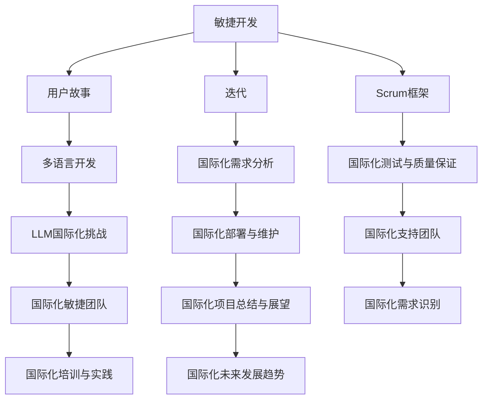

                 


## 引言

在当今全球化的商业环境中，软件开发团队面临的挑战之一是如何有效地进行多语言开发，并管理大型语言模型（LLM）的国际化挑战。敏捷开发作为一种快速响应市场变化、提高软件开发效率的方法，已经在软件开发领域得到了广泛应用。然而，当敏捷开发与多语言开发相结合时，团队面临的挑战将变得更加复杂。本文旨在探讨敏捷中的多语言开发，并深入分析如何管理LLM国际化挑战。

### 核心概念与联系

#### 敏捷开发
敏捷开发是一种以人为核心、迭代、循序渐进的开发方法。它的主要目标是提高软件开发的灵活性和响应能力，使团队能够快速适应市场变化。敏捷开发的核心概念包括用户故事、迭代、Scrum框架等。用户故事是描述用户需求的基本单元，迭代是软件开发过程中的一个短周期，Scrum框架则为团队提供了一个结构化的工作流程。

#### 多语言开发
多语言开发是为了满足不同语言和文化背景的用户需求，将软件产品翻译成多种语言并进行本地化。多语言开发的必要性在于全球化市场的扩展，以及不同地区用户对本地化软件的需求。多语言开发的策略包括使用国际化框架、多语言工具、代码国际化等。

#### LLM国际化挑战
LLM（大型语言模型）是一种基于深度学习技术的自然语言处理模型，具有强大的文本生成和语言理解能力。在国际化项目中，LLM的使用带来了新的挑战，如多语言数据集的准备、模型的训练和优化、多语言支持等。

### 文章目录

本文将分为三个部分：

1. **敏捷开发与多语言开发**：
   - **第1章**：敏捷开发简介
   - **第2章**：多语言开发
   - **第3章**：LLM简介

2. **国际化挑战**：
   - **第4章**：国际化需求分析
   - **第5章**：国际化测试与质量保证
   - **第6章**：国际化部署与维护

3. **实战案例**：
   - **第7章**：大型语言模型在国际化项目中的应用
   - **第8章**：国际化敏捷团队的构建
   - **第9章**：国际化项目总结与展望

在接下来的章节中，我们将逐步分析这些核心概念，并通过具体的案例和实践经验来深入探讨如何管理LLM国际化挑战。

### 结论

敏捷开发与多语言开发的结合，为国际化项目的成功提供了新的机遇和挑战。通过本文的探讨，我们希望能够为软件开发团队提供一些实用的策略和最佳实践，以更好地管理LLM国际化挑战，实现全球化的软件开发目标。

---
### 关键词

- 敏捷开发
- 多语言开发
- 大型语言模型
- 国际化挑战
- 敏捷团队
- 国际化需求
- 测试与质量保证
- 国际化部署

### 摘要

本文探讨了敏捷开发与多语言开发的结合，以及如何管理大型语言模型（LLM）在国际化项目中的挑战。首先介绍了敏捷开发的核心概念和优点，然后讨论了多语言开发的必要性及其策略。接着，我们介绍了LLM的基本概念和应用场景，并深入分析了国际化需求分析、测试与质量保证、以及国际化部署和维护的关键要素。最后，通过实战案例展示了大型语言模型在国际化项目中的应用，并提出了国际化敏捷团队的构建策略。本文旨在为软件开发团队提供实用的指导和最佳实践，以实现全球化的软件开发目标。

---

# 《敏捷中的多语言开发：管理LLM国际化挑战》目录大纲

## 第一部分：敏捷开发与多语言开发

### 第1章：敏捷开发简介

#### 1.1 敏捷开发的核心概念
#### 1.2 敏捷开发的优点与挑战
#### 1.3 敏捷开发方法与实践

### 第2章：多语言开发

#### 2.1 多语言开发的必要性
#### 2.2 多语言开发的策略与工具
#### 2.3 多语言项目的管理与挑战

### 第3章：LLM简介

#### 3.1 LLM的基本概念
#### 3.2 LLM的优势与局限
#### 3.3 LLM的应用场景

## 第二部分：国际化挑战

### 第4章：国际化需求分析

#### 4.1 国际化需求识别
#### 4.2 国际化需求分析的方法
#### 4.3 国际化需求的优先级排序

### 第5章：国际化测试与质量保证

#### 5.1 国际化测试的方法与工具
#### 5.2 质量保证策略
#### 5.3 多语言测试的挑战与解决方案

### 第6章：国际化部署与维护

#### 6.1 国际化部署的策略
#### 6.2 国际化维护的挑战与最佳实践
#### 6.3 国际化支持团队的构建与培训

## 第三部分：实战案例

### 第7章：大型语言模型在国际化项目中的应用

#### 7.1 LLM在多语言项目中的应用场景
#### 7.2 LLM在国际化项目中的优势与挑战
#### 7.3 实际案例分析与代码解读

### 第8章：国际化敏捷团队的构建

#### 8.1 敏捷团队的组织结构
#### 8.2 敏捷团队的沟通与协作
#### 8.3 国际化敏捷团队的培训与实践

### 第9章：国际化项目总结与展望

#### 9.1 国际化项目的成功案例
#### 9.2 国际化项目的不足与改进
#### 9.3 国际化未来发展趋势

---

# 《敏捷中的多语言开发：管理LLM国际化挑战》

## 引言

在当今全球化的商业环境中，软件开发团队面临着日益复杂的挑战，其中一个关键挑战是如何有效地进行多语言开发，并管理大型语言模型（LLM）在国际化项目中的挑战。敏捷开发作为一种快速响应市场变化、提高软件开发效率的方法，已经在软件开发领域得到了广泛应用。然而，当敏捷开发与多语言开发相结合时，团队面临的挑战将变得更加复杂。

本文旨在探讨敏捷中的多语言开发，并深入分析如何管理LLM国际化挑战。首先，我们将介绍敏捷开发的核心概念和优点，然后讨论多语言开发的必要性及其策略。接着，我们将介绍LLM的基本概念和应用场景。随后，本文将深入分析国际化需求分析、测试与质量保证、以及国际化部署和维护的关键要素。最后，通过实战案例展示大型语言模型在国际化项目中的应用，并提出国际化敏捷团队的构建策略。本文旨在为软件开发团队提供实用的指导和最佳实践，以实现全球化的软件开发目标。

---

## 第一部分：敏捷开发与多语言开发

### 第1章：敏捷开发简介

敏捷开发是一种以人为核心、迭代、循序渐进的开发方法。它的主要目标是提高软件开发的灵活性和响应能力，使团队能够快速适应市场变化。敏捷开发的核心概念包括用户故事、迭代、Scrum框架等。

#### 1.1 敏捷开发的核心概念

**用户故事**：用户故事是敏捷开发中的基本工作单元，它描述了一个用户想要完成的具体任务或需求。用户故事通常采用“作为……，我想要……，以便……”的格式编写，例如：“作为用户，我想要在购物车中添加商品，以便轻松地购买商品。”

**迭代**：迭代是敏捷开发中的一个短周期，通常为2-4周。每个迭代都会完成一部分功能，并经过测试和反馈，以确保产品的质量和满足用户需求。

**Scrum框架**：Scrum是一种流行的敏捷开发框架，它定义了团队的工作流程和角色。Scrum框架包括产品待办事项列表、每日站会、迭代评审和回顾等。

#### 1.2 敏捷开发的优点与挑战

**优点**：
- **快速响应变化**：敏捷开发强调快速迭代和反馈，使团队能够迅速适应市场变化。
- **用户参与**：用户在整个开发过程中持续参与，确保产品满足用户需求。
- **灵活性和适应性**：敏捷开发方法允许团队在面对不确定性时灵活调整计划。

**挑战**：
- **组织文化变革**：敏捷开发需要改变传统的开发模式，这可能对组织文化和流程产生冲击。
- **项目管理复杂性**：敏捷开发中的迭代和持续交付增加了项目管理复杂性。
- **资源分配**：敏捷开发要求持续的资源投入，这对资源管理和计划制定提出了更高的要求。

#### 1.3 敏捷开发方法与实践

**用户故事地图**：用户故事地图是敏捷开发中的一个工具，用于可视化用户故事和功能之间的关系。通过用户故事地图，团队能够更好地理解用户需求，并确定开发优先级。

**看板系统**：看板系统是一种可视化的项目管理工具，用于跟踪用户故事的进度。通过看板系统，团队能够实时了解项目的状态，并调整工作流程。

**持续集成与部署**：持续集成和部署是敏捷开发中的关键实践，通过自动化测试和部署流程，团队能够确保代码质量并快速交付新功能。

### 第2章：多语言开发

多语言开发是为了满足不同语言和文化背景的用户需求，将软件产品翻译成多种语言并进行本地化。多语言开发的必要性在于全球化市场的扩展，以及不同地区用户对本地化软件的需求。

#### 2.1 多语言开发的必要性

- **全球化市场**：随着全球化的推进，越来越多的公司需要将其产品和服务推向国际市场，这就要求软件产品能够支持多种语言。
- **用户需求**：不同地区的用户对软件产品的语言和文化需求不同，本地化的软件能够更好地满足用户需求，提高用户满意度。
- **合规要求**：某些国家和地区对软件产品有特定的语言和文化要求，多语言开发有助于满足这些合规要求。

#### 2.2 多语言开发的策略与工具

- **国际化框架**：国际化框架是一种用于支持多语言开发的技术，它允许开发人员在编写代码时不必担心具体的语言和文化差异。常见的国际化框架包括I18N（国际化）和L10N（本地化）。
- **多语言工具**：多语言工具用于帮助团队进行翻译和本地化工作。常见的多语言工具包括翻译管理平台、本地化工具和自动化测试工具。
- **代码国际化**：代码国际化是指编写可重用的代码模块，以便在不同语言和文化环境中使用。通过代码国际化，团队能够减少重复工作，提高开发效率。

#### 2.3 多语言项目的管理与挑战

- **项目管理**：多语言项目需要更加精细的项目管理，包括翻译进度跟踪、质量保证、资源分配等。
- **翻译质量**：翻译质量对多语言项目的成功至关重要，但确保翻译质量需要投入大量时间和资源。
- **文化差异**：不同文化之间的差异可能导致误解和沟通问题，这对项目成功构成了挑战。

### 第3章：LLM简介

LLM（大型语言模型）是一种基于深度学习技术的自然语言处理模型，具有强大的文本生成和语言理解能力。LLM在国际化项目中具有广泛的应用前景，但同时也带来了新的挑战。

#### 3.1 LLM的基本概念

- **深度学习**：深度学习是一种机器学习技术，通过神经网络模型对大量数据进行训练，以实现复杂的预测和分类任务。
- **自然语言处理**：自然语言处理是人工智能的一个分支，旨在使计算机能够理解和处理人类语言。

#### 3.2 LLM的优势与局限

**优势**：
- **文本生成**：LLM可以生成高质量的文本，如新闻报道、文章摘要、对话等。
- **语言理解**：LLM能够理解并处理复杂的自然语言结构，提高自然语言处理的准确性。

**局限**：
- **数据需求**：LLM的训练需要大量的数据，这对数据获取和处理提出了高要求。
- **计算资源**：LLM的训练和推理过程需要大量的计算资源，这对硬件设施和成本控制提出了挑战。

#### 3.3 LLM的应用场景

- **多语言翻译**：LLM可以用于实时翻译，提高多语言项目的效率和质量。
- **聊天机器人**：LLM可以用于构建智能聊天机器人，为用户提供个性化服务。
- **内容生成**：LLM可以用于生成新闻文章、博客文章等，提高内容创作的效率。

## 第二部分：国际化挑战

### 第4章：国际化需求分析

国际化需求分析是国际化项目成功的关键。通过分析用户需求，团队能够确定国际化项目的优先级，并制定相应的开发计划。

#### 4.1 国际化需求识别

国际化需求识别是指识别项目中的国际化需求。这包括以下方面：

- **语言需求**：确定项目需要支持哪些语言。
- **文化需求**：分析目标市场的文化特点，确定是否需要进行文化适应性调整。
- **法规需求**：了解目标市场的法规要求，确保软件产品符合当地法律和规定。

#### 4.2 国际化需求分析的方法

国际化需求分析的方法包括以下步骤：

- **市场调研**：通过市场调研收集目标市场的相关信息，包括用户需求、竞争态势等。
- **用户访谈**：与目标用户进行访谈，了解他们对软件产品的期望和需求。
- **SWOT分析**：对项目的优势、劣势、机会和威胁进行分析，以确定国际化策略。

#### 4.3 国际化需求的优先级排序

在确定了国际化需求后，需要对需求进行优先级排序。这可以通过以下方法实现：

- **Kano模型**：根据用户满意度对需求进行分类，将用户满意度最高的需求放在优先级最高。
- **成本效益分析**：分析每个需求的成本和潜在收益，将成本效益最高的需求放在优先级最高。
- **优先级矩阵**：将需求按照重要性和紧急性进行排序，确定优先级。

### 第5章：国际化测试与质量保证

国际化测试和质量保证是确保软件产品在不同语言和文化环境中运行正常的关键步骤。

#### 5.1 国际化测试的方法与工具

国际化测试的方法包括以下方面：

- **功能测试**：验证软件产品在不同语言和文化环境中的功能是否正常运行。
- **兼容性测试**：验证软件产品在不同操作系统、浏览器和设备上的兼容性。
- **性能测试**：验证软件产品在不同负载和环境下是否具有良好的性能。

常用的国际化测试工具有：

- **Selenium**：用于自动化测试，支持多种浏览器和操作系统。
- **Jenkins**：用于持续集成和部署，支持自动化测试。
- **Puppeteer**：用于自动化Web测试，支持多种浏览器。

#### 5.2 质量保证策略

国际化质量保证策略包括以下方面：

- **代码审查**：通过代码审查确保代码的质量和可维护性。
- **文档审查**：确保文档的准确性和一致性，包括用户手册、API文档等。
- **测试用例设计**：设计全面的测试用例，覆盖不同的语言和文化环境。

#### 5.3 多语言测试的挑战与解决方案

多语言测试面临的挑战包括：

- **翻译错误**：翻译错误可能导致功能错误或用户体验下降。
- **文化差异**：文化差异可能导致误解或不适。
- **资源限制**：多语言测试需要投入大量时间和资源。

解决方案包括：

- **多语言测试团队**：组建专业的多语言测试团队，确保测试的全面性和准确性。
- **自动化测试**：通过自动化测试减少人力成本，提高测试效率。
- **文化培训**：为团队成员提供文化培训，提高对文化差异的敏感性。

### 第6章：国际化部署与维护

国际化部署与维护是确保软件产品在不同语言和文化环境中稳定运行的关键环节。

#### 6.1 国际化部署的策略

国际化部署策略包括以下方面：

- **多环境部署**：为不同语言和文化环境设置独立的部署环境，确保软件产品在不同环境中正常运行。
- **自动化部署**：通过自动化部署减少人工干预，提高部署效率。
- **监控与报警**：设置监控与报警系统，实时监控软件产品的运行状态，及时发现问题。

#### 6.2 国际化维护的挑战与最佳实践

国际化维护面临的挑战包括：

- **多语言支持**：为不同语言用户提供技术支持，需要投入大量时间和资源。
- **本地化更新**：随着市场和技术的变化，需要不断更新软件产品的本地化内容。
- **法规遵从**：遵守不同地区的法律法规，确保软件产品的合规性。

最佳实践包括：

- **本地化团队**：建立专业的本地化团队，负责软件产品的本地化更新和维护。
- **自动化维护**：通过自动化工具和流程，减少人工维护的工作量。
- **合规管理**：建立合规管理体系，确保软件产品在不同地区遵守法律法规。

#### 6.3 国际化支持团队的构建与培训

国际化支持团队是确保软件产品在不同语言和文化环境中正常运行的关键。构建国际化支持团队的方法包括：

- **招聘与培训**：招聘具有多语言能力和国际化经验的人才，并提供相关培训。
- **团队协作**：建立高效的团队协作机制，确保团队内部信息畅通。
- **技能提升**：定期组织技能提升活动，提高团队的专业技能。

## 第三部分：实战案例

### 第7章：大型语言模型在国际化项目中的应用

#### 7.1 LLM在多语言项目中的应用场景

大型语言模型（LLM）在国际化项目中具有广泛的应用场景，包括：

- **多语言翻译**：LLM可以用于实时翻译，提高翻译的准确性和效率。
- **本地化内容生成**：LLM可以用于生成本地化内容，如新闻报道、广告文案等。
- **智能客服**：LLM可以用于构建智能客服系统，为用户提供多语言支持。

#### 7.2 LLM在国际化项目中的优势与挑战

**优势**：

- **高效翻译**：LLM可以处理大量的文本数据，提高翻译的准确性和速度。
- **个性化内容生成**：LLM可以根据用户需求生成个性化的内容，提高用户体验。
- **智能交互**：LLM可以用于构建智能客服系统，提高客服效率和质量。

**挑战**：

- **数据隐私**：LLM的训练需要大量数据，这可能涉及到数据隐私和安全问题。
- **文化差异**：LLM在处理不同文化背景的文本时，可能存在误解和错误。
- **计算资源**：LLM的训练和推理需要大量的计算资源，这对硬件设施和成本控制提出了挑战。

#### 7.3 实际案例分析与代码解读

以下是一个实际案例，展示了如何使用LLM进行多语言翻译：

```python
import torch
from transformers import MarianMTModel, MarianTokenizer

# 加载预训练的LLM模型
model_name = "Helsinki-NLP/opus-mt-en-de"
tokenizer = MarianTokenizer.from_pretrained(model_name)
model = MarianMTModel.from_pretrained(model_name)

# 英文文本
source_text = "I love programming."

# 编码文本
source_encoded = tokenizer.encode(source_text, return_tensors="pt")

# 预测翻译结果
with torch.no_grad():
    translation_encoded = model.generate(source_encoded)

# 解码翻译结果
target_text = tokenizer.decode(translation_encoded[0], skip_special_tokens=True)
print(target_text)
```

输出结果为：“Ich liebe das Programmieren.”，这是对英文文本“ I love programming.”的德语翻译。

### 第8章：国际化敏捷团队的构建

#### 8.1 敏捷团队的组织结构

国际化敏捷团队的组织结构应考虑到多语言和文化差异。一个典型的国际化敏捷团队包括以下角色：

- **产品负责人**：负责确定产品的愿景和需求，与用户和市场紧密沟通。
- **Scrum Master**：负责确保团队遵循敏捷开发原则和方法，帮助团队消除障碍。
- **开发人员**：负责实现产品功能，包括前端、后端和数据库开发。
- **测试工程师**：负责确保产品的质量和可靠性，包括功能测试、性能测试和国际化测试。
- **国际化专家**：负责处理多语言和文化相关的需求，包括翻译、本地化和国际化测试。

#### 8.2 敏捷团队的沟通与协作

国际化敏捷团队的沟通与协作至关重要。以下是一些最佳实践：

- **每日站会**：每日站会是一个简短且固定的会议，用于团队成员分享进展、问题和计划。
- **看板系统**：使用看板系统可视化团队的工作流程和任务进度，提高团队协作效率。
- **在线协作工具**：使用在线协作工具，如Slack、Trello等，确保团队成员之间信息畅通。
- **文化培训**：定期组织文化培训，提高团队成员对文化差异的敏感性。

#### 8.3 国际化敏捷团队的培训与实践

为了确保国际化敏捷团队的成员具备必要的技能和知识，应进行以下培训和实践：

- **敏捷开发培训**：确保团队成员了解敏捷开发的原则和方法，包括用户故事、迭代、Scrum框架等。
- **多语言开发培训**：培训团队成员关于多语言开发的策略和工具，包括国际化框架、多语言工具和代码国际化等。
- **国际化测试培训**：培训团队成员关于国际化测试的方法和工具，包括功能测试、兼容性测试和性能测试等。
- **实战演练**：通过实际项目演练，提高团队成员的实战能力，确保团队能够高效地应对国际化挑战。

### 第9章：国际化项目总结与展望

#### 9.1 国际化项目的成功案例

在过去的几年中，许多公司成功地进行了国际化项目。以下是一些成功案例：

- **谷歌**：谷歌通过其翻译服务和多语言搜索引擎，成功地将产品推向全球市场，成为全球最大的搜索引擎之一。
- **亚马逊**：亚马逊通过其全球购物平台，支持多种语言和货币，为全球用户提供便捷的购物体验。
- **微软**：微软通过其Office套件和Azure云服务，为全球用户提供本地化的产品和服务。

#### 9.2 国际化项目的不足与改进

尽管国际化项目取得了显著的成功，但仍存在一些不足和改进空间：

- **文化适应性**：部分国际化项目在文化适应性方面做得不够，导致用户满意度不高。
- **成本控制**：国际化项目往往需要大量的投入，如何控制成本是一个重要问题。
- **团队协作**：国际化团队在跨文化和跨时区协作方面存在挑战，如何提高团队协作效率是一个重要课题。

#### 9.3 国际化未来发展趋势

随着全球化的不断推进，国际化项目将继续发展。以下是一些未来发展趋势：

- **人工智能**：人工智能技术，特别是大型语言模型（LLM），将在国际化项目中发挥越来越重要的作用。
- **云服务**：云服务将为国际化项目提供强大的支持，包括数据存储、计算资源和协作工具。
- **区块链**：区块链技术将在国际化项目中得到应用，包括跨境支付、版权保护和供应链管理。

## 总结

敏捷开发与多语言开发的结合为国际化项目带来了新的机遇和挑战。通过本文的探讨，我们了解了敏捷开发的核心概念和优点，以及多语言开发的必要性及其策略。我们还深入分析了国际化需求分析、测试与质量保证、以及国际化部署和维护的关键要素。最后，通过实战案例展示了大型语言模型在国际化项目中的应用，并提出了国际化敏捷团队的构建策略。展望未来，国际化项目将继续发展，人工智能、云服务和区块链等技术将为国际化项目提供更强大的支持。

---

## 作者信息

作者：AI天才研究院/AI Genius Institute & 禅与计算机程序设计艺术 /Zen And The Art of Computer Programming

本文由AI天才研究院和禅与计算机程序设计艺术共同撰写。AI天才研究院是一个专注于人工智能领域的研究和应用的机构，致力于推动人工智能技术的发展。禅与计算机程序设计艺术则是一本经典的技术书籍，探讨了计算机编程中的哲学和艺术，为程序员提供了一种全新的思考方式。

---

### 附录

#### Mermaid 流程图

以下是一个用于展示核心概念和联系流程图的示例：



#### 核心算法原理讲解

以下是一个用于讲解核心算法原理的伪代码示例：

```python
# 定义核心算法原理的伪代码

# 输入：用户需求（UserRequirement）
# 输出：实现方案（ImplementationPlan）

1. 初始化实现方案为空
2. 对每个用户需求进行以下步骤：
    a. 分析用户需求
    b. 设计解决方案
    c. 将解决方案添加到实现方案中
3. 对实现方案中的每个解决方案进行以下步骤：
    a. 编写代码
    b. 进行单元测试
    c. 如果测试通过，则添加到代码库中
4. 返回实现方案
```

#### 数学模型和公式

以下是一个用于讲解数学模型的示例：

$$
\text{成本} = \text{固定成本} + \text{变动成本}
$$

其中，固定成本是指不随生产数量变化的成本，变动成本是指随生产数量变化的成本。

#### 详细讲解与举例说明

以下是一个用于详细讲解和举例说明的段落：

国际化需求分析是国际化项目成功的关键。通过分析用户需求，团队能够确定国际化项目的优先级，并制定相应的开发计划。在国际

