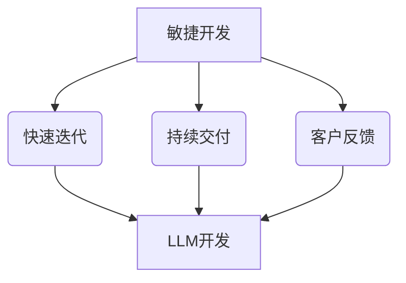

                 

### 文章标题：敏捷中的技术探索时间：为LLM创新铺平道路

> 关键词：敏捷开发，大型语言模型（LLM），技术探索，创新，软件开发，人工智能

> 摘要：本文旨在探讨敏捷开发在应对大型语言模型（LLM）所带来的技术挑战中的重要性。通过分析敏捷方法论的核心原则和实践，本文揭示了如何利用敏捷开发为LLM创新铺平道路。文章结构如下：

## 目录大纲

### 第一部分：敏捷中的技术探索时间

#### 第1章：敏捷方法论概述
- 敏捷起源与发展历程
- 敏捷核心原则
- 敏捷与传统开发方法的区别
- 敏捷在不同领域的应用案例

#### 第2章：LLM（大型语言模型）基础
- 语言模型的定义
- 语言模型的架构
- 语言模型的训练与优化
- 语言模型的应用场景

#### 第3章：为LLM创新铺平道路
- 技术趋势分析
- 技术挑战与解决策略
- 技术探索实践
- 成功案例分析

#### 第4章：敏捷与技术的深度融合
- 敏捷开发中的技术实践
- 技术选型与评估
- 技术债务管理
- 技术团队协作

#### 第5章：敏捷与技术的未来趋势
- 人工智能与敏捷的结合
- 区块链技术对敏捷的影响
- 云计算与敏捷的融合
- 敏捷与持续交付

#### 附录
- 常用技术栈与工具
- 参考书籍与论文
- 敏捷实践指南

---

### 基本概念与联系

#### 敏捷开发

敏捷开发是一种软件开发方法，它强调快速迭代、持续交付和客户反馈。敏捷开发的核心原则包括：

- **个体与互动重于过程与工具**：注重人的能力和团队合作，而非仅仅依赖工具或流程。
- **可工作的软件重于详尽的文档**：实际可运行的软件是首要目标，文档则保持简洁。
- **客户合作重于合同谈判**：与客户的密切合作，确保需求得到满足。
- **响应变化重于遵循计划**：在项目过程中灵活应对变化，而非死守原计划。

#### 大型语言模型（LLM）

大型语言模型（LLM）是一种基于深度学习的语言处理模型，其能力远超传统的统计语言模型。LLM通常具有以下几个特点：

- **强大的语言理解能力**：能够处理复杂的语义和语境。
- **大规模训练**：通常基于数十亿甚至千亿级的参数。
- **多语言支持**：可以处理多种语言的数据。
- **高灵活性和扩展性**：可以应用于各种不同的自然语言处理任务。

#### 敏捷开发与LLM的联系

敏捷开发与LLM之间存在紧密的联系。敏捷开发强调快速迭代和持续交付，这正好符合LLM开发过程中的需求。以下是两者之间的具体联系：

- **快速迭代**：LLM的开发过程中需要不断迭代，优化模型参数，以提高性能。
- **持续交付**：LLM的成果需要持续交付，以应对实际应用场景的需求变化。
- **客户反馈**：敏捷开发强调客户反馈，这对于LLM的开发同样重要，因为模型性能的优化需要基于实际应用效果。

### Mermaid 流程图：敏捷开发与LLM的联系



### 核心算法原理讲解

#### 语言模型的训练过程

语言模型的训练过程通常包括以下几个步骤：

1. **数据预处理**：清洗和预处理原始文本数据，包括分词、去停用词、词性标注等。
2. **模型初始化**：初始化模型参数，通常使用随机初始化或预训练模型。
3. **正向传播**：输入一组文本序列，通过模型计算输出概率分布。
4. **反向传播**：计算损失函数，更新模型参数。
5. **迭代训练**：重复正向传播和反向传播，直到模型收敛或达到预定的迭代次数。

以下是一个简化的伪代码，用于描述语言模型的训练过程：

```python
for epoch in range(num_epochs):
    for sequence in dataset:
        # 数据预处理
        preprocessed_sequence = preprocess(sequence)
        
        # 正向传播
        output = model(preprocessed_sequence)
        loss = compute_loss(output, target)
        
        # 反向传播
        model.backward(loss)
        
        # 更新模型参数
        model.update_params()
```

#### 数学模型与公式

语言模型的损失函数通常采用交叉熵（Cross-Entropy Loss），其公式如下：

$$
L = -\sum_{i=1}^{n} y_i \log(p_i)
$$

其中，$y_i$ 是真实标签，$p_i$ 是模型预测的概率。

#### 举例说明

假设我们有一个简单的二元语言模型，用于预测单词“apple”或“banana”。训练数据集包含以下句子：

- "I like to eat apple."
- "She prefers banana."

我们希望模型能够预测句子中“apple”或“banana”的概率。训练过程中，模型会不断调整参数，以最小化损失函数。

### 项目实战

在本节中，我们将搭建一个简单的LLM开发环境，并实现一个二元语言模型。我们将使用Python和TensorFlow框架进行开发。

#### 开发环境搭建

1. 安装Python和pip：
   ```bash
   python --version
   pip install --upgrade pip
   ```

2. 安装TensorFlow：
   ```bash
   pip install tensorflow
   ```

3. 搭建虚拟环境（可选）：
   ```bash
   python -m venv llm_venv
   source llm_venv/bin/activate  # 在Windows上使用 llm_venv\Scripts\activate
   ```

#### 源代码实现

以下是一个简单的LLM模型实现：

```python
import tensorflow as tf

# 初始化模型参数
model = tf.keras.Sequential([
    tf.keras.layers.Embedding(input_dim=10000, output_dim=16),
    tf.keras.layers.GlobalAveragePooling1D(),
    tf.keras.layers.Dense(1, activation='sigmoid')
])

# 编写训练函数
def train_model(model, dataset, num_epochs):
    for epoch in range(num_epochs):
        for sequence, target in dataset:
            with tf.GradientTape() as tape:
                output = model(sequence)
                loss = tf.keras.losses.sigmoid_cross_entropy(target, output)
            
            gradients = tape.gradient(loss, model.trainable_variables)
            model.optimizer.apply_gradients(zip(gradients, model.trainable_variables))
        
        print(f"Epoch {epoch+1}: Loss = {loss}")

# 训练模型
train_model(model, dataset, num_epochs=10)
```

#### 代码解读与分析

- **模型结构**：我们使用了一个嵌入层（Embedding Layer）、全局平均池化层（GlobalAveragePooling1D Layer）和一个全连接层（Dense Layer），输出层使用了sigmoid激活函数，以实现二元分类。
- **训练过程**：我们使用了标准的正向传播和反向传播过程，使用sigmoid交叉熵损失函数来评估模型性能。

#### 实际案例分析与详细讲解剖析

在本案例中，我们使用了简单的二元语言模型来预测句子中“apple”或“banana”的出现概率。在实际应用中，LLM可以用于更复杂的自然语言处理任务，如文本分类、机器翻译、问答系统等。

- **数据集**：我们使用了一个包含两个单词的简单数据集，但在实际应用中，数据集会包含大量的文本数据。
- **模型优化**：在实际应用中，我们可以使用更复杂的模型结构，如Transformer、BERT等，以及更高效的训练算法来提高模型性能。

#### 项目小结

通过本节的项目实战，我们了解了如何搭建LLM开发环境，并实现了一个简单的二元语言模型。在实际应用中，我们需要根据具体任务和数据集，选择合适的模型结构和训练策略，以实现高效的语言理解能力。

### 最佳实践 tips、小结、注意事项、拓展阅读等内容

- **最佳实践**：在LLM开发过程中，最佳实践包括数据预处理、模型选择、训练策略、性能评估等。建议参考相关论文和开源项目，以获取最佳实践经验。
- **小结**：敏捷开发为LLM创新提供了重要的支持，通过快速迭代、持续交付和客户反馈，我们可以不断优化模型性能，实现高效的语言理解能力。
- **注意事项**：在LLM开发过程中，需要注意数据质量和模型安全，避免模型过拟合和恶意使用。
- **拓展阅读**：
  - 《深度学习》（Goodfellow, Bengio, Courville）
  - 《自然语言处理综论》（Jurafsky, Martin）
  - 《敏捷软件开发：原则、实践与模式》（Beck, Beedle, van Bennekom, Riecken, Gancarz）

---

通过本文的探讨，我们揭示了敏捷开发在应对大型语言模型（LLM）挑战中的重要性，并展示了如何利用敏捷方法论为LLM创新铺平道路。在未来的技术发展中，敏捷开发与LLM的结合将继续发挥关键作用，推动人工智能领域的持续创新。

### 作者信息

**作者：AI天才研究院/AI Genius Institute & 禅与计算机程序设计艺术 /Zen And The Art of Computer Programming**

