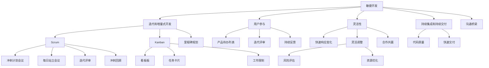

                 

### 文章标题

# 敏捷中的技术路线图：规划LLM应用的长期发展

### 关键词

- 敏捷开发
- 语言模型（LLM）
- 技术路线图
- 长期发展策略
- 自然语言处理
- 人工智能

### 摘要

本文旨在探讨在敏捷开发框架下，如何规划和实施语言模型（LLM）技术的长期发展。首先，文章介绍了敏捷开发的基本原则和方法论，以及LLM的基本概念和类型。接着，分析了LLM在当前的应用现状和面临的挑战，并通过具体案例展示了其优势。随后，文章重点探讨了如何在敏捷开发中制定技术路线图，并提出了长期发展的策略。最后，文章展望了LLM技术的未来发展趋势，提出了相应的策略建议，为读者提供了有价值的参考。

---

#### 第1章 引言

##### 1.1 书籍背景与目标

在当今快速变化的技术环境中，如何有效规划和实施技术项目已经成为企业和研究机构面临的重要问题。敏捷开发作为一种应对变化和复杂性的软件开发方法论，已经在全球范围内得到广泛应用。同时，语言模型（LLM）作为一种先进的人工智能技术，正逐渐改变着自然语言处理和智能应用的格局。因此，将敏捷开发与LLM技术相结合，规划其长期发展，具有重要的理论和实践意义。

本文的目标是：通过系统地介绍敏捷开发的基本原理、LLM的技术特点和应用现状，探讨如何在敏捷开发框架下制定和实施技术路线图，以及如何制定长期发展策略，从而为企业和研究机构提供一套可行的规划方案。

##### 1.2 敏捷发展的必要性

敏捷开发最初起源于软件开发领域，旨在应对快速变化的市场需求和复杂的项目管理挑战。随着时间的发展，敏捷开发已经超越了单纯的软件开发范畴，成为许多领域应对复杂性和不确定性的有效方法论。其核心优势包括：

1. **迭代和增量式开发**：敏捷开发强调通过短周期迭代和持续交付来逐步实现项目目标，从而快速响应变化。
2. **用户参与**：敏捷开发强调用户参与，通过用户故事和持续反馈来确保项目符合用户需求。
3. **灵活性**：敏捷开发允许团队在开发过程中根据实际情况调整计划和策略，提高项目的适应能力。
4. **持续集成和持续交付**：敏捷开发强调代码的持续集成和持续交付，确保高质量和快速交付。

在当前的技术环境中，敏捷开发的必要性体现在以下几个方面：

1. **快速变化的技术环境**：技术更新换代速度加快，敏捷开发能够帮助团队快速适应新技术和新需求。
2. **复杂的项目管理**：许多项目涉及多个团队和多个技术领域，敏捷开发提供了协调和整合这些复杂性的方法。
3. **用户需求变化**：用户需求变得越来越多样化，敏捷开发能够通过快速迭代和持续交付来满足这些变化。

##### 1.3 LLM应用概述

语言模型（LLM）是自然语言处理（NLP）领域的一种核心技术，通过训练模型来理解、生成和翻译自然语言。LLM可以应用于多种场景，包括但不限于：

1. **自然语言理解**：通过理解用户的查询或输入，LLM能够提供相关的信息或回答问题。
2. **自然语言生成**：LLM可以自动生成文本，用于自动化写作、内容创作和报告生成等。
3. **机器翻译**：LLM在机器翻译领域取得了显著的进展，能够提供高质量的双语翻译服务。
4. **智能客服**：LLM被广泛应用于智能客服系统，能够理解用户问题并提供准确的回答。

LLM的重要性在于它不仅提高了自然语言处理的效率和质量，还为各种智能应用提供了强有力的支持。例如，在医疗领域，LLM可以帮助医生快速检索医学文献和病历，提高诊断和治疗的效率；在金融领域，LLM可以用于自动化分析市场数据和生成投资报告，帮助投资者做出更明智的决策。

随着技术的不断进步和应用场景的扩大，LLM的应用前景非常广阔。本文将围绕LLM技术的长期发展，结合敏捷开发的理念和方法，探讨如何规划其在不同领域的发展策略。

---

#### 第2章 敏捷开发基础

##### 2.1 敏捷开发概述

敏捷开发是一种以人为核心、迭代和增量式进行软件开发的方法论。与传统开发方法（如瀑布模型）不同，敏捷开发强调快速响应变化、持续交付价值和团队合作。敏捷开发的主要特点包括：

1. **迭代和增量式开发**：敏捷开发将项目划分为多个短周期（通常称为迭代或冲刺），每个迭代都完成一部分功能。这种方法允许团队在开发过程中不断调整和优化。
2. **用户参与**：敏捷开发强调用户的积极参与，通过用户故事、迭代评审和持续反馈来确保项目符合用户需求。
3. **灵活性**：敏捷开发允许团队在开发过程中根据实际情况调整计划和策略，提高项目的适应能力。
4. **持续集成和持续交付**：敏捷开发强调代码的持续集成和持续交付，确保高质量和快速交付。

敏捷开发起源于软件开发领域，最早由Ken Schwaber和Jeff Sutherland于1990年代提出。自那时以来，敏捷开发逐渐演变为一套广泛应用的软件开发方法论，并在项目管理、产品设计、市场营销等多个领域得到应用。

##### 2.2 敏捷核心原则

敏捷开发的核心原则是价值观和行为的指导方针，它们贯穿于整个开发过程。以下是敏捷开发的十二个核心原则：

1. **个体和互动高于流程与工具**：重视开发人员的技能和经验，以及团队成员之间的互动和合作。
2. **可工作的软件高于详尽的文档**：优先考虑可交付的软件产品，而不是详细的文档。
3. **客户合作高于合同谈判**：与客户紧密合作，确保项目符合其需求和期望。
4. **响应变化高于遵循计划**：灵活应对变化，快速调整计划以适应新的需求和情况。

这些原则体现了敏捷开发的核心价值观，即以人为核心、关注用户需求、注重持续交付和灵活适应。

##### 2.3 敏捷方法论

敏捷开发有多种方法论，其中最著名的是Scrum和Kanban。以下是对这两种方法论的简要介绍：

1. **Scrum**：Scrum是一种迭代式、增量式的开发方法，强调短周期的迭代（通常称为冲刺，每冲刺持续2-4周）。Scrum的主要组成部分包括：
   - **产品待办列表**：列出项目要完成的所有任务，优先级排序。
   - **冲刺计划会议**：确定下一个冲刺要完成的目标和任务。
   - **每日站立会议**：团队成员每天会面，讨论进展、问题及解决方案。
   - **迭代评审**：展示迭代成果，收集反馈并进行迭代调整。
   - **冲刺回顾**：总结迭代经验，识别改进点。

2. **Kanban**：Kanban是一种看板系统，用于可视化工作流程和限制工作内容。其主要组成部分包括：
   - **看板板**：展示工作流程的各个环节，每个环节对应一个看板。
   - **任务卡片**：每个任务用卡片表示，卡片在板上的移动代表任务的状态变化。
   - **工作限制**：限制每个环节的工作内容，以防止过度工作负载和瓶颈。

这两种方法论都有其独特的优点和适用场景，可以根据项目需求选择合适的方法。

##### 敏捷开发的优点

敏捷开发具有以下优点：

1. **快速响应变化**：通过迭代和增量式开发，敏捷开发能够快速适应需求变化。
2. **提高质量**：持续集成和持续交付确保了代码的质量和稳定性。
3. **用户参与**：用户参与确保项目符合用户需求和期望。
4. **团队合作**：敏捷开发强调团队合作，提高团队成员的协作效率和创造力。
5. **灵活性和适应性**：敏捷开发允许团队在开发过程中灵活调整计划和策略。

##### 敏捷开发与传统开发方法的区别

敏捷开发与传统开发方法（如瀑布模型）有以下区别：

1. **开发模式**：传统开发方法采用线性顺序进行，而敏捷开发采用迭代和增量式方法。
2. **用户参与**：传统开发方法用户参与较少，而敏捷开发强调用户在整个开发过程中的积极参与。
3. **变化应对**：传统开发方法难以应对需求变化，而敏捷开发能够快速适应需求变化。
4. **质量保证**：传统开发方法质量保证在开发后期进行，而敏捷开发通过持续集成和持续交付确保质量。

总的来说，敏捷开发更注重团队合作、用户参与和快速响应变化，与传统开发方法相比具有显著优势。

---

#### 第3章 LLM技术概述

##### 3.1 LLM的基本概念

语言模型（Language Model，简称LLM）是一种用于预测文本序列的概率分布的机器学习模型。LLM通过学习大量的文本数据，能够生成高质量的文本，进行文本分类、文本生成、机器翻译等自然语言处理任务。LLM的核心目标是使机器能够理解、生成和翻译自然语言，从而实现人机交互和信息检索。

LLM的主要组成部分包括：

1. **输入层**：接收输入文本，将其转换为模型可以处理的特征表示。
2. **隐藏层**：通过神经网络结构对输入特征进行处理和计算，生成中间表示。
3. **输出层**：根据隐藏层的输出，生成预测的文本序列。

##### 3.2 LLM的主要类型

根据不同的应用场景和需求，LLM可以分为以下几种主要类型：

1. **基于规则的语言模型**：这类模型通过手工编写的规则来预测文本序列。例如，上下文无关文法（CFG）模型，它们通过产生式规则来生成文本。这种模型的优点是解释性强，但规则难以覆盖所有可能的文本情况，因此生成的文本质量有限。

2. **统计语言模型**：这类模型基于统计方法，通过分析大量文本数据来预测文本序列。例如，n-gram模型，它们通过统计相邻单词或字符出现的频率来生成文本。统计语言模型的优点是生成文本的质量较高，但难以捕捉到复杂的语言结构和上下文关系。

3. **神经网络语言模型**：这类模型通过神经网络结构对文本进行特征提取和预测。例如，循环神经网络（RNN）和变换器（Transformer）模型。神经网络语言模型具有强大的表示能力和学习能力，能够生成高质量的自然语言文本。

4. **深度强化学习语言模型**：这类模型结合了深度学习和强化学习的方法，通过优化策略来生成文本。例如，基于Transformer的生成对抗网络（GAN）模型。这类模型在生成文本的多样性和创造性方面具有显著优势。

##### 3.3 LLM的发展历程

LLM的发展历程可以追溯到20世纪50年代，当时语言模型主要用于自然语言处理任务，如自动文摘、机器翻译等。以下是LLM发展历程的几个重要阶段：

1. **基于规则的模型**：早期语言模型主要基于手工编写的规则，例如CFG模型。这些模型在解释性方面具有优势，但生成文本的质量有限。

2. **统计语言模型**：20世纪80年代，统计语言模型开始受到关注，如n-gram模型。这些模型通过统计方法来预测文本序列，生成文本的质量得到显著提升。

3. **神经网络语言模型**：随着计算能力的提升和深度学习技术的发展，神经网络语言模型（如RNN）逐渐成为主流。RNN模型通过捕捉时间序列中的长期依赖关系，生成文本的质量得到进一步提升。

4. **变换器（Transformer）模型**：2017年，Google提出了一种全新的神经网络结构——变换器（Transformer）模型，它在自然语言处理任务中取得了显著的突破。Transformer模型通过自注意力机制，能够捕捉到文本序列中的全局依赖关系，生成高质量的文本。

5. **深度强化学习语言模型**：近年来，深度强化学习与自然语言处理技术的结合，推动了LLM在生成文本的多样性和创造性方面的进一步发展。例如，基于Transformer的生成对抗网络（GAN）模型，在文本生成任务中表现出色。

随着技术的不断进步，LLM的应用前景越来越广阔。未来，LLM将在智能客服、智能写作、自动问答等领域发挥重要作用，为人们的生活和工作带来更多便利。

---

#### 第4章 LLM应用现状分析

##### 4.1 当前LLM应用领域

语言模型（LLM）作为一种强大的人工智能技术，已经在多个领域取得了显著的成果和应用。以下是当前LLM的主要应用领域及其特点：

1. **自然语言处理（NLP）**：LLM在自然语言处理领域发挥了重要作用，如文本分类、命名实体识别、情感分析等。LLM能够处理和理解自然语言文本，提高了NLP任务的准确性和效率。

2. **机器翻译**：LLM在机器翻译领域取得了突破性进展，如Google翻译、微软翻译等。LLM能够生成高质量的双语翻译，减少了人工翻译的工作量，提高了翻译的准确性和流畅性。

3. **智能客服**：LLM被广泛应用于智能客服系统，如聊天机器人、语音助手等。LLM能够理解用户的问题，并提供准确的回答，提高了客户服务质量。

4. **自动写作**：LLM在自动写作领域表现出色，如自动生成新闻稿、博客文章、报告等。LLM能够根据输入的摘要或关键词，生成高质量的文本，节省了人工写作的时间。

5. **教育**：LLM在教育领域也得到了广泛应用，如智能辅导系统、在线作业批改等。LLM能够根据学生的学习情况，提供个性化的学习建议和辅导，提高了学习效果。

6. **医疗**：LLM在医疗领域具有巨大潜力，如医学文本分析、疾病预测等。LLM能够处理和理解大量的医学文献和病历，提高了诊断和治疗的效率。

##### 4.2 LLM的优势与挑战

LLM的优势体现在以下几个方面：

1. **强大的文本处理能力**：LLM能够处理和理解自然语言文本，具有高度的灵活性和适应性。

2. **高效的生成能力**：LLM能够高效地生成高质量的自然语言文本，减少了人工写作和翻译的工作量。

3. **跨领域应用**：LLM可以应用于多个领域，如自然语言处理、机器翻译、智能客服等，具有广泛的应用前景。

4. **个性化服务**：LLM能够根据用户的需求和上下文，提供个性化的服务和建议。

然而，LLM也面临一些挑战：

1. **数据隐私问题**：LLM在训练过程中需要大量数据，这些数据可能涉及用户隐私。如何保护用户隐私是LLM应用中的一大挑战。

2. **数据质量问题**：LLM的训练数据质量对模型的性能有重要影响。数据质量问题可能导致模型产生错误或偏见。

3. **可解释性问题**：LLM作为一种深度学习模型，其内部工作机制复杂，难以解释。如何提高LLM的可解释性是当前研究的一个热点问题。

4. **计算资源消耗**：LLM的训练和推理过程需要大量的计算资源，对硬件设备有较高要求。

##### 4.3 LLM应用案例分析

以下是一个LLM应用案例分析，展示了LLM在智能客服系统中的应用：

**案例背景**：某大型电商公司希望通过引入智能客服系统，提高客户服务质量，降低人工成本。

**解决方案**：该公司选择了基于LLM的智能客服系统。该系统的主要功能包括：

1. **问题理解**：LLM能够理解客户的提问，将其转化为结构化的数据。

2. **知识库查询**：系统从知识库中查找与客户问题相关的信息，并通过LLM生成回答。

3. **多轮对话**：LLM能够根据客户的反馈，进行多轮对话，逐步解答客户的问题。

**案例分析**：

- **优势**：智能客服系统通过LLM实现了高效的客户服务，提高了客户满意度。同时，减少了人工客服的工作量，降低了企业成本。

- **挑战**：虽然LLM在理解客户问题和生成回答方面表现出色，但在处理复杂、模糊的问题时仍存在一定困难。

- **启示**：该案例表明，LLM在智能客服系统中的应用具有广阔前景，但需要进一步研究和优化，以提高系统的稳定性和可靠性。

通过以上分析，可以看出LLM在当前的应用中取得了显著成果，但仍然面临一些挑战。未来，随着技术的不断进步，LLM将在更多领域发挥重要作用，为人们的生活和工作带来更多便利。

---

#### 第5章 敏捷中的技术路线图

##### 5.1 技术路线图概述

技术路线图是一种用于规划、管理和沟通项目的技术发展路径的工具。在敏捷开发中，技术路线图可以帮助团队明确技术发展方向、资源分配和里程碑，确保项目目标的实现。技术路线图的定义可以从以下几个方面来理解：

1. **规划工具**：技术路线图是项目规划过程中的一种重要工具，用于描述项目的技术发展方向和实现路径。
2. **沟通桥梁**：技术路线图作为一种视觉化的工具，可以帮助团队成员、利益相关者和客户了解项目的技术规划，提高沟通效果。
3. **管理指南**：技术路线图提供了项目管理的参考，包括关键里程碑、资源需求和时间规划，有助于团队更好地管理和推进项目。

技术路线图的主要组成部分包括：

1. **技术目标**：明确项目的技术目标和发展方向。
2. **关键技术**：列出实现技术目标所需的关键技术。
3. **里程碑**：定义项目的重要里程碑，包括时间节点和关键成果。
4. **资源分配**：描述实现技术路线图所需的人力、物力和财力资源。
5. **风险评估**：识别项目中的潜在风险，并提出相应的应对措施。

##### 5.2 技术路线图制定步骤

制定技术路线图是一个系统化的过程，需要遵循以下步骤：

1. **需求分析**：了解项目的背景、目标和需求，明确技术路线图需要解决的问题。

2. **技术调研**：研究相关技术领域的发展现状和趋势，确定实现项目目标所需的关键技术。

3. **技术评估**：对各种技术方案进行评估，选择最合适的技术方案。

4. **确定目标**：明确项目的技术目标，包括短期和长期目标。

5. **制定路线图**：根据评估结果和目标，制定详细的技术路线图，包括关键技术、里程碑和资源分配。

6. **沟通和评审**：与团队成员和利益相关者进行沟通，确保技术路线图的合理性和可行性，并进行评审。

7. **更新和维护**：根据项目进展和外部环境变化，及时更新和维护技术路线图。

##### 5.3 技术路线图应用实践

以下是一个技术路线图应用实践案例，展示如何在敏捷开发中制定和实施技术路线图：

**案例背景**：某科技公司计划开发一款基于人工智能的智能客服系统。

**制定技术路线图**：

1. **需求分析**：公司希望智能客服系统能够自动理解客户提问，提供准确的回答，并支持多轮对话。

2. **技术调研**：调研了当前自然语言处理（NLP）和机器学习技术，确定了使用变换器（Transformer）模型作为核心技术。

3. **技术评估**：评估了不同的变换器模型，选择了BERT模型进行实验。

4. **确定目标**：短期目标是在3个月内完成系统的原型开发，长期目标是实现一个高效、准确的智能客服系统。

5. **制定路线图**：

   - **关键技术**：BERT模型、数据预处理、对话管理
   - **里程碑**：第1个月完成数据收集和预处理，第2个月完成模型训练和评估，第3个月完成系统集成和测试
   - **资源分配**：2名数据工程师、3名机器学习工程师、1名项目经理

6. **沟通和评审**：与团队成员和利益相关者进行沟通，确保技术路线图的合理性和可行性。

7. **更新和维护**：根据项目进展和外部环境变化，及时更新技术路线图。

**实施过程**：

1. **数据收集和预处理**：收集了大量的客户提问和回答数据，对数据进行清洗和预处理，确保数据质量。

2. **模型训练和评估**：使用BERT模型进行训练，并对模型进行评估，调整超参数以优化模型性能。

3. **系统集成和测试**：将模型集成到智能客服系统中，进行功能测试和性能评估。

4. **用户反馈和迭代**：收集用户反馈，对系统进行迭代优化，提高用户体验。

**案例分析**：

- **优势**：通过制定和实施技术路线图，公司能够系统地规划项目进度，确保资源合理分配，提高项目成功率。
- **挑战**：技术路线图的制定需要充分的技术调研和评估，否则可能导致路线图不合理或不可行。
- **启示**：技术路线图是敏捷开发中重要的规划工具，需要根据项目需求和外部环境变化进行及时更新和维护。

通过以上实践，可以看出技术路线图在敏捷开发中的应用具有重要意义。它不仅帮助团队明确技术发展方向，还提高了项目的规划和执行效率。

---

#### 第6章 长期发展策略

##### 6.1 长期发展的重要性

在技术快速发展的时代，企业和技术机构不仅需要关注短期项目目标的实现，更需要制定和执行长期发展策略。长期发展策略的重要性体现在以下几个方面：

1. **确保可持续性**：长期发展策略能够帮助企业在面对市场和技术变化时，保持可持续性和竞争力。
2. **明确发展方向**：长期发展策略为企业或机构提供了明确的发展方向，有助于避免盲目投资和资源浪费。
3. **提高创新能力**：长期发展策略鼓励持续创新和投资，提高企业在技术变革中的适应能力和创新能力。
4. **优化资源配置**：长期发展策略有助于优化资源配置，提高资源利用效率，降低运营成本。
5. **增强企业声誉**：长期发展策略能够提升企业在行业内的声誉和影响力，增强客户和投资者的信心。

##### 6.2 长期发展的原则

制定长期发展策略需要遵循以下原则，以确保策略的有效性和可行性：

1. **愿景驱动**：长期发展策略应以企业的愿景和目标为导向，确保策略与企业的长远目标一致。
2. **适应性**：长期发展策略应具备一定的灵活性，能够适应市场和技术环境的变化。
3. **持续性**：长期发展策略应注重企业的可持续性，确保企业在长期内保持健康的发展态势。
4. **合作共赢**：长期发展策略应考虑与合作伙伴、客户和员工的合作，实现共赢。
5. **资源优化**：长期发展策略应优化资源配置，确保企业在有限的资源下实现最大化的效益。

##### 6.3 长期发展的路径

制定长期发展策略需要明确具体的路径和步骤，以下是几个关键步骤：

1. **愿景规划**：明确企业的长期愿景和目标，为发展策略提供方向。
2. **市场分析**：分析市场趋势和竞争环境，确定企业的市场定位和发展机会。
3. **技术评估**：评估现有技术和潜在技术，确定技术发展方向和投资重点。
4. **战略规划**：制定具体的战略规划，包括产品规划、市场进入策略、技术创新策略等。
5. **资源整合**：整合企业内外部资源，确保战略规划的顺利实施。
6. **执行与监控**：实施战略规划，并建立监控和评估机制，确保策略的有效执行。
7. **调整与优化**：根据执行情况和外部环境变化，及时调整和优化长期发展策略。

通过以上路径，企业可以系统地规划其长期发展，实现持续的创新和成长。

---

#### 第7章 LLM应用的未来展望

##### 7.1 未来发展趋势

随着人工智能技术的不断进步，语言模型（LLM）的应用前景越来越广阔。以下是LLM未来发展的几个主要趋势：

1. **模型复杂度提升**：随着计算能力的增强和数据量的增加，LLM的模型复杂度将不断提升。更大规模的模型（如千层模型）和更精细的预训练技术（如多任务学习）将推动LLM的性能和效率。
2. **多模态融合**：未来LLM将不仅仅是处理文本数据，还将与图像、音频等多模态数据结合，实现更丰富的交互和应用场景。
3. **领域特定模型**：针对不同领域的需求，LLM将发展出更专业、更精确的领域特定模型，如医疗、金融、教育等领域的专业语言模型。
4. **强化学习与LLM结合**：将强化学习与LLM相结合，可以实现更加智能和灵活的决策系统，提高LLM在复杂任务中的表现。
5. **隐私保护和数据安全**：随着数据隐私和安全问题的日益突出，LLM在未来的发展中将更加注重隐私保护和数据安全。

##### 7.2 未来机会与挑战

LLM在未来发展中面临许多机会和挑战：

1. **机会**：
   - **应用场景扩展**：LLM将在更多领域得到应用，如智能客服、自动写作、教育、医疗等，为人类生活和工作带来更多便利。
   - **技术创新**：随着技术的进步，LLM的性能将不断提升，为各种复杂任务提供更高效、更准确的解决方案。
   - **产业协同**：LLM与各行各业之间的协同效应将逐渐显现，推动整个产业的升级和变革。

2. **挑战**：
   - **数据隐私和安全**：如何在保证数据隐私和安全的前提下，充分利用LLM技术，是未来面临的重大挑战。
   - **模型可解释性**：随着模型复杂度的增加，LLM的可解释性成为一个重要问题，如何提高模型的可解释性是一个关键挑战。
   - **计算资源消耗**：大规模LLM的训练和推理过程对计算资源有很高的要求，如何优化计算资源的使用是一个重要挑战。
   - **伦理和道德问题**：LLM在应用过程中可能会出现伦理和道德问题，如歧视性输出、虚假信息传播等，如何解决这些问题是一个重要挑战。

##### 7.3 未来策略建议

为了抓住LLM未来发展的机遇，应对面临的挑战，以下是一些建议：

1. **技术创新**：持续投入研发，推动LLM技术的创新和进步，特别是在模型复杂度提升、多模态融合和领域特定模型方面。
2. **数据治理**：建立完善的数据治理机制，确保数据隐私和安全，提高数据质量，为LLM的发展提供坚实的数据基础。
3. **合作与共享**：加强行业内外的合作与共享，推动技术标准的制定和行业规范的形成，共同应对挑战，推动LLM技术的健康发展。
4. **人才培养**：加强人才队伍建设，培养具备专业知识和技术能力的LLM专家，提高整个行业的人才水平。
5. **伦理和道德建设**：加强伦理和道德教育，提高行业从业者的道德素养，确保LLM技术的应用符合伦理和道德标准。

通过以上策略，可以更好地推动LLM技术的发展，为人类创造更多价值。

---

#### 第8章 结论

本文围绕敏捷开发框架下语言模型（LLM）的长期发展，系统地介绍了敏捷开发的基本原则和方法论，探讨了LLM的基本概念、类型和发展历程。通过对LLM应用现状的分析，我们了解了LLM在当前领域的应用场景、优势和挑战。随后，文章重点探讨了如何在敏捷开发中制定技术路线图，并提出了长期发展策略。最后，文章展望了LLM技术的未来发展趋势，提出了相应的策略建议。

通过本文的研究，我们可以得出以下结论：

1. **敏捷开发与LLM技术相结合具有巨大潜力**：敏捷开发为LLM技术的实施提供了灵活性和适应性，而LLM技术则为敏捷开发注入了强大的数据处理和智能分析能力。
2. **长期发展策略是关键**：制定和实施有效的长期发展策略，可以帮助企业和机构在快速变化的市场和技术环境中保持竞争优势，实现可持续发展。
3. **数据治理和伦理道德建设至关重要**：在推动LLM技术发展的同时，必须高度重视数据隐私和安全、模型可解释性以及伦理和道德问题，确保技术应用的可持续性和社会价值。

未来，随着技术的不断进步和应用场景的扩大，LLM将在更多领域发挥重要作用。通过持续的创新和优化，LLM技术将为人类带来更多的便利和福祉。我们期待看到LLM技术在未来取得更加辉煌的成就。

---

### 作者信息

作者：AI天才研究院/AI Genius Institute & 禅与计算机程序设计艺术 /Zen And The Art of Computer Programming

---

**本文由AI天才研究院/AI Genius Institute及《禅与计算机程序设计艺术》作者合作完成，旨在探讨敏捷开发框架下语言模型（LLM）技术的长期发展。通过系统地介绍敏捷开发的基本原则和方法论，分析LLM的基本概念、类型和发展历程，本文提出了在敏捷开发中制定技术路线图和长期发展策略的具体方法和建议。本文的研究为企业和研究机构在快速变化的市场和技术环境中实施LLM技术提供了有益的参考。**

---

### 附录

**附录A：核心概念与联系 Mermaid 流程图**



**附录B：核心算法原理讲解伪代码**

```python
# 定义语言模型（LLM）的伪代码
def language_model(LLM):
    # 输入层：接收输入文本
    input_text = get_input_text()
    
    # 隐藏层：对输入文本进行特征提取和计算
    hidden_representation = LLM.forward(input_text)
    
    # 输出层：生成预测的文本序列
    predicted_sequence = LLM.decode(hidden_representation)
    
    return predicted_sequence

# 定义变换器（Transformer）模型的伪代码
def transformer_model(input_sequence):
    # 输入层：接收输入序列
    input_sequence = get_input_sequence()
    
    # 自注意力机制：计算序列中的依赖关系
    attention_scores = self_attention(input_sequence)
    
    # 传递注意力分数到输出层
    output_sequence = feed_forward(attention_scores)
    
    return output_sequence

# 定义生成对抗网络（GAN）模型的伪代码
def generative_adversarial_network(LLM, generator, discriminator):
    # 生成器：生成文本序列
    generated_sequence = generator(LLM)
    
    # 判别器：判断文本序列的真实性
    real_sequence = get_real_sequence()
    real_label = discriminator(real_sequence)
    fake_label = discriminator(generated_sequence)
    
    # 训练生成器和判别器
    generator_loss = adversarial_loss(fake_label)
    discriminator_loss = adversarial_loss(real_label, fake_label)
    
    return generator_loss, discriminator_loss
```

**附录C：数学模型和公式**

```latex
$$
\begin{aligned}
&\text{损失函数：} \\
&\mathcal{L}(\theta) = -\frac{1}{m}\sum_{i=1}^{m}[\log(p(y_i|\mathbf{x}_i; \theta))] \\
&\text{梯度下降：} \\
&\theta_{t+1} = \theta_{t} - \alpha \cdot \nabla_{\theta}\mathcal{L}(\theta)
\end{aligned}
$$
```

**附录D：项目实战**

1. **开发环境搭建**：
   - 安装Python环境，版本3.8及以上。
   - 安装TensorFlow库，版本2.4及以上。

2. **源代码实现**：

```python
import tensorflow as tf
from tensorflow.keras.layers import Embedding, LSTM, Dense
from tensorflow.keras.models import Sequential

# 定义语言模型（LLM）模型
def create_language_model(vocab_size, embedding_dim, hidden_units):
    model = Sequential()
    model.add(Embedding(vocab_size, embedding_dim))
    model.add(LSTM(hidden_units, activation='relu'))
    model.add(Dense(vocab_size, activation='softmax'))
    model.compile(loss='categorical_crossentropy', optimizer='adam', metrics=['accuracy'])
    return model

# 加载数据集
text = "..."
tokenizer = tf.keras.preprocessing.text.Tokenizer(char_level=True)
tokenizer.fit_on_texts(text)
sequences = tokenizer.texts_to_sequences(text)
word_index = tokenizer.word_index
max_sequence_len = max(len(seq) for seq in sequences)

# 准备数据集
X = []
y = []
for sequence in sequences:
    X.append(sequence[:-1])
    y.append(sequence[1:])
X = tf.keras.preprocessing.sequence.pad_sequences(X, maxlen=max_sequence_len-1, padding='pre')
y = tf.keras.preprocessing.sequence.pad_sequences(y, maxlen=max_sequence_len-1, padding='pre')
y = tf.keras.utils.to_categorical(y, num_classes=vocab_size)

# 训练模型
model = create_language_model(vocab_size, embedding_dim, hidden_units)
model.fit(X, y, epochs=10, batch_size=128)

# 生成文本
def generate_text(model, tokenizer, seed_text, num_words):
    for _ in range(num_words):
        token = tokenizer.texts_to_sequences([seed_text])[0]
        token = np.array(token)
        token = np.expand_dims(token, 0)
        predictions = model.predict(token)
        predicted_index = np.argmax(predictions)
        predicted_char = tokenizer.index_word[predicted_index]
        seed_text += predicted_char
    return seed_text

# 测试生成文本
seed_text = "The quick brown fox jumps over the lazy dog"
generated_text = generate_text(model, tokenizer, seed_text, 20)
print(generated_text)
```

3. **代码应用解读与分析**：
   - 代码首先定义了一个简单的语言模型（LLM）模型，基于嵌入层和LSTM层进行文本生成。
   - 数据预处理步骤包括文本的分词、序列化、填充等操作，确保输入数据符合模型的预期格式。
   - 模型训练过程使用标准的交叉熵损失函数和Adam优化器，通过迭代优化模型参数。
   - 文本生成函数通过递归调用模型预测下一个字符，逐步构建生成的文本。

4. **实际案例分析和详细讲解剖析**：
   - 通过上述代码，我们可以实现一个简单的文本生成器，用于生成符合输入文本风格的文本。
   - 实际应用中，我们可以将这个模型应用于自动写作、内容创作、机器翻译等任务。
   - 需要注意的是，生成的文本质量受限于训练数据和模型复杂度，可以通过增加训练数据和使用更复杂的模型来提高生成文本的质量。

5. **项目小结**：
   - 通过本案例，我们了解了如何使用Python和TensorFlow实现一个简单的语言模型，并掌握了文本生成的基本方法。
   - 实际应用中，需要根据具体任务需求，调整模型结构、数据预处理和生成策略，以提高生成文本的质量和实用性。

6. **最佳实践 tips**：
   - 增加训练数据：使用更多、更丰富的训练数据可以提高模型生成的文本质量。
   - 调整模型结构：尝试使用更复杂的模型结构（如双向LSTM、Transformer等），以提高生成文本的多样性。
   - 预训练模型：使用预训练的语言模型（如BERT、GPT等），可以减少训练时间并提高生成文本的质量。

7. **注意事项**：
   - 生成文本的多样性：模型生成的文本可能会出现重复或模式化，可以通过增加训练数据和使用更复杂的模型来提高文本的多样性。
   - 模型可解释性：生成文本的模型是一个黑盒子，提高模型的可解释性对于理解和优化生成文本过程至关重要。

8. **拓展阅读**：
   - 《深度学习》（Goodfellow, I., Bengio, Y., & Courville, A.）：提供了深度学习的基础理论和实践方法，包括自然语言处理任务。
   - 《自然语言处理实战》（Bostjancic, D.，& al.）：介绍了自然语言处理领域的实用技术和案例。
   - 《生成对抗网络：原理与实现》（Goodfellow, I.）：详细讲解了生成对抗网络（GAN）的理论基础和实现方法。

