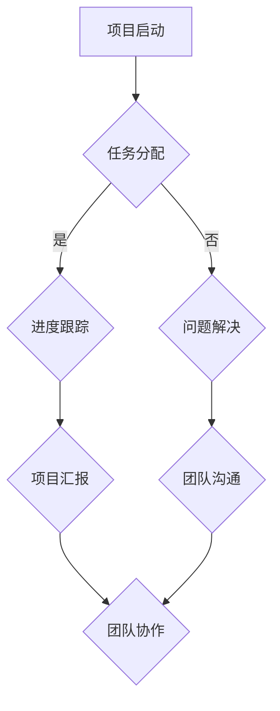

                 

### 第1章：远程协作与分布式LLM开发团队概述

#### 1.1 远程协作的背景与重要性

在当今全球化的时代，远程协作已经成为企业团队运作的常态。随着互联网技术的不断进步，远程协作工具也逐渐成为各个行业不可或缺的一部分。特别是在人工智能领域，尤其是分布式学习模型（LLM，Distributed Learning Model）的开发，远程协作工具的重要性更加凸显。

**远程协作的定义**

远程协作是指团队成员在不同的地理位置，通过电子设备和网络进行沟通、合作和协调的过程。它不仅包括了实时沟通，如视频会议和即时通讯，还涵盖了异步协作，如文档共享和项目管理。

**远程协作工具的发展**

远程协作工具的发展历程可以追溯到20世纪90年代，当时主要是基于电子邮件的协作。随着互联网技术的发展，尤其是宽带网络和移动设备的普及，远程协作工具经历了翻天覆地的变化。从最初的文本聊天室，到视频会议，再到现在的集成式协作平台，远程协作工具的功能越来越强大，使用体验也越来越顺畅。

**远程协作工具的重要性**

对于分布式LLM开发团队来说，远程协作工具具有以下重要性：

1. **提高沟通效率**：通过远程协作工具，团队成员可以即时交流想法，快速解决问题，避免因为时区差异导致的沟通延迟。
2. **增强团队凝聚力**：远程协作工具可以帮助团队成员建立更加紧密的联系，增强团队的凝聚力。
3. **优化资源分配**：远程协作工具可以更好地实现资源的优化配置，让团队成员能够更灵活地调整工作时间和工作地点。
4. **促进创新**：远程协作可以打破地域限制，让团队成员更容易接触到不同的观点和思路，从而促进创新。

#### 1.2 分布式LLM开发团队的特点

分布式LLM开发团队是指团队成员分布在不同的地理位置，通过网络进行协作完成开发任务的团队。这种团队形式在人工智能领域尤为常见，因为LLM（Large Language Model）的开发通常需要大量的计算资源和专业人才。

**分布式LLM开发团队的特点**

1. **地理分散**：团队成员可能位于不同城市，甚至不同国家，这要求团队有很强的远程协作能力。
2. **技术要求高**：分布式LLM开发通常需要高性能计算、分布式存储和处理技术，以及对数据安全和隐私保护的严格要求。
3. **项目管理复杂**：由于团队成员不在同一地点，项目管理变得更加复杂，需要高效的工具和流程来确保项目顺利进行。
4. **沟通依赖工具**：团队成员之间的沟通主要依赖于远程协作工具，这要求这些工具具有高度的可靠性和易用性。

#### 1.3 远程协作工具的作用与分类

远程协作工具在分布式LLM开发团队中的作用至关重要。以下是几种常见的远程协作工具及其分类：

1. **视频会议工具**：如Zoom、Microsoft Teams等，主要用于实时视频交流和会议。
2. **项目管理工具**：如Trello、Asana等，用于任务分配、进度跟踪和团队协作。
3. **代码协作工具**：如GitHub、GitLab等，用于代码存储、版本控制和团队协作。
4. **文档共享工具**：如Google Docs、Notion等，用于文档的共享、编辑和协作。
5. **即时通讯工具**：如Slack、Telegram等，用于实时沟通和消息传递。
6. **协作笔记工具**：如Miro、Mural等，用于在线协作和头脑风暴。

通过这些工具，分布式LLM开发团队可以实现高效的协作，确保项目的顺利进行。在接下来的章节中，我们将详细探讨这些远程协作工具的使用和选择。

作者：AI天才研究院/AI Genius Institute & 禅与计算机程序设计艺术 /Zen And The Art of Computer Programming

----------------------------------------------------------------

### 核心关键词

- 远程协作
- 分布式LLM开发团队
- 视频会议工具
- 项目管理工具
- 代码协作工具
- 文档共享工具
- 即时通讯工具
- 协作笔记工具

----------------------------------------------------------------

### 文章摘要

本文旨在探讨远程协作工具在分布式LLM（Large Language Model）开发团队中的应用与重要性。随着全球化的加速和信息技术的发展，远程协作已成为现代团队运作的常态。特别是在人工智能领域，分布式LLM开发团队因需要高效沟通、资源优化和创新而受益于远程协作工具。本文首先介绍了远程协作的背景与重要性，然后分析了分布式LLM开发团队的特点，并详细分类了常见的远程协作工具，包括视频会议工具、项目管理工具、代码协作工具、文档共享工具、即时通讯工具和协作笔记工具。通过实际案例分析和具体操作指南，本文为分布式LLM开发团队提供了实用的协作工具选择与使用方法，旨在帮助团队实现高效、有序的工作流程。

----------------------------------------------------------------

# 《敏捷中的远程协作工具：支持分布式LLM开发团队》

> 关键词：远程协作，分布式LLM开发团队，视频会议，项目管理，代码协作，文档共享，即时通讯，协作笔记

> 摘要：本文深入探讨了远程协作工具在分布式LLM（Large Language Model）开发团队中的应用。通过介绍远程协作的背景与重要性，分析分布式LLM开发团队的特点，详细分类并阐述了各种远程协作工具的功能和选择标准，本文为团队提供了实用的操作指南，旨在实现高效、有序的协作流程，促进分布式LLM开发团队的成功。

## 第1章：远程协作与分布式LLM开发团队概述

在当今全球化的商业环境中，远程协作已经成为一种常态，尤其是在人工智能领域，分布式LLM（Large Language Model）开发团队更是离不开高效的远程协作工具。本章将探讨远程协作的背景和重要性，分析分布式LLM开发团队的特点，以及远程协作工具的作用和分类。

### 1.1 远程协作的背景与重要性

远程协作的概念并不新鲜，但其应用范围和深度在近年来得到了极大的拓展。随着互联网技术的进步和全球化的加速，远程协作已成为现代团队运作的重要组成部分。尤其是在COVID-19疫情的影响下，远程协作工具的重要性进一步凸显。

**远程协作的发展历程**

远程协作工具的发展可以追溯到20世纪90年代。早期的远程协作主要是基于文本的，如电子邮件和即时消息。随着宽带网络和移动设备的普及，远程协作工具逐渐向视频会议、项目管理、文档共享等方向发展。现在，集成化的远程协作平台已经成为企业团队运作的基石。

**远程协作工具的重要性**

对于分布式LLM开发团队而言，远程协作工具的重要性体现在以下几个方面：

1. **沟通效率**：远程协作工具可以帮助团队成员即时交流，减少时区差异带来的沟通障碍，提高工作效率。
2. **团队凝聚力**：通过远程协作工具，团队成员可以更频繁地交流，增强团队凝聚力。
3. **资源优化**：远程协作工具可以优化团队成员的工作时间和地点，提高资源利用率。
4. **创新促进**：远程协作有助于团队成员接触到不同的观点和思路，促进创新。

### 1.2 分布式LLM开发团队的特点

分布式LLM开发团队是指团队成员分布在不同的地理位置，通过远程协作完成共同任务的团队。这种团队形式在人工智能领域尤为常见，因为LLM的开发通常需要大量的计算资源和专业人才。

**地理分散性**：分布式LLM开发团队的成员可能位于不同的城市，甚至不同的国家。这种地理分散性要求团队具备高效的远程协作能力。

**技术要求高**：分布式LLM开发需要高性能计算、分布式存储和处理技术，以及对数据安全和隐私保护的严格要求。

**项目管理复杂**：由于团队成员不在同一地点，项目管理变得更加复杂，需要高效的工具和流程来确保项目顺利进行。

**沟通依赖工具**：团队成员之间的沟通主要依赖于远程协作工具，这要求这些工具具有高度的可靠性和易用性。

### 1.3 远程协作工具的作用与分类

远程协作工具在分布式LLM开发团队中扮演着至关重要的角色。以下是几种常见的远程协作工具及其分类：

1. **视频会议工具**：如Zoom、Microsoft Teams等，主要用于实时视频交流和会议。
2. **项目管理工具**：如Trello、Asana等，用于任务分配、进度跟踪和团队协作。
3. **代码协作工具**：如GitHub、GitLab等，用于代码存储、版本控制和团队协作。
4. **文档共享工具**：如Google Docs、Notion等，用于文档的共享、编辑和协作。
5. **即时通讯工具**：如Slack、Telegram等，用于实时沟通和消息传递。
6. **协作笔记工具**：如Miro、Mural等，用于在线协作和头脑风暴。

通过这些工具，分布式LLM开发团队可以实现高效的协作，确保项目的顺利进行。在接下来的章节中，我们将详细探讨这些远程协作工具的使用和选择。

### 1.4 远程协作工具的挑战与解决方案

尽管远程协作工具为分布式LLM开发团队带来了诸多便利，但也面临着一些挑战。以下是这些挑战以及相应的解决方案：

**挑战一：沟通效率**

远程协作工具虽然提高了沟通效率，但同时也带来了新的挑战。例如，视频会议中的网络延迟、音频和视频质量不稳定等问题可能会影响沟通效果。

**解决方案：**

- **选择可靠的网络服务**：确保远程协作工具使用的是稳定、高速的网络服务。
- **备用通信渠道**：除了视频会议，还可以使用即时通讯工具和电子邮件等渠道进行补充沟通。

**挑战二：团队凝聚力**

由于团队成员分布在不同的地理位置，容易导致团队凝聚力下降，影响协作效果。

**解决方案：**

- **定期团队活动**：通过线上团建活动、虚拟聚餐等方式增强团队凝聚力。
- **透明化项目管理**：使用项目管理工具公开任务进度和团队目标，提高团队成员的参与感和责任感。

**挑战三：数据安全和隐私保护**

远程协作涉及到大量的数据传输和存储，数据安全和隐私保护成为重要的挑战。

**解决方案：**

- **使用加密技术**：确保远程协作工具支持数据加密，保护数据传输和存储过程中的安全性。
- **严格权限管理**：对团队成员的访问权限进行严格管理，防止未经授权的数据访问。

### 1.5 远程协作工具的最佳实践

为了充分发挥远程协作工具的优势，以下是一些最佳实践：

**最佳实践一：工具选择**

- **满足团队需求**：选择能够满足团队需求的基本功能，同时注意工具的可扩展性。
- **用户体验优先**：选择界面友好、易于使用的工具，提高团队的整体使用体验。

**最佳实践二：培训与支持**

- **定期培训**：定期组织团队成员进行远程协作工具的培训，提高使用效率。
- **技术支持**：确保有专业的技术支持团队，及时解决团队成员在使用过程中遇到的问题。

**最佳实践三：工具集成**

- **集成多种工具**：尝试将远程协作工具与其他业务系统进行集成，实现数据的无缝传递和共享。
- **避免工具冗余**：避免使用过多冗余的工具，简化工作流程，提高工作效率。

### 1.6 小结

本章介绍了远程协作工具在分布式LLM开发团队中的应用背景、重要性以及具体分类。通过分析远程协作工具的挑战与解决方案，以及提出最佳实践，本章为分布式LLM开发团队提供了全面的远程协作工具指南。在接下来的章节中，我们将详细探讨各类远程协作工具的具体使用方法和实践案例。

----------------------------------------------------------------

## 第2章：视频会议工具

视频会议工具在远程协作中扮演着核心角色，它们使分布式LLM开发团队能够进行面对面的交流，即使团队成员身处世界各地。本章将介绍几种主流视频会议工具，分析它们在分布式团队中的应用，并提供选择视频会议工具的标准。

### 2.1 主流视频会议工具介绍

以下是一些主流的视频会议工具：

1. **Zoom**
   - **功能**：支持高清视频和音频通信、屏幕共享、会议录制、虚拟背景等。
   - **应用场景**：适用于各种规模的团队，适合远程培训、项目讨论、客户会议等。

2. **Microsoft Teams**
   - **功能**：集成聊天、会议、电话、视频会议、文件共享和团队协作功能。
   - **应用场景**：适用于企业内部沟通、团队协作、在线办公等。

3. **Google Meet**
   - **功能**：支持高清视频和音频通信、屏幕共享、实时翻译等。
   - **应用场景**：适用于教育、企业、政府等多个领域。

4. **Skype for Business**
   - **功能**：提供视频会议、即时消息、在线会议和电话会议等功能。
   - **应用场景**：适用于企业内部沟通、客户会议、培训等。

5. **Cisco Webex**
   - **功能**：提供高清视频会议、远程协作、会议录制、虚拟会议房间等。
   - **应用场景**：适用于企业、政府、教育等多个领域。

### 2.2 视频会议工具在分布式团队中的应用

分布式LLM开发团队使用视频会议工具的主要应用场景包括：

1. **团队会议**
   - **项目启动会**：在项目启动时，通过视频会议让团队成员了解项目目标、任务分配和时间表。
   - **进度汇报会**：定期通过视频会议汇报项目进度，讨论遇到的问题和解决方案。

2. **团队培训**
   - **在线培训**：通过视频会议进行技术培训和知识分享，提高团队成员的技能水平。
   - **案例研讨会**：组织案例研讨会，通过视频会议讨论实际案例，促进团队协作和创新。

3. **客户沟通**
   - **需求讨论**：与客户进行视频会议，讨论项目需求、进度和问题。
   - **产品演示**：通过视频会议演示产品功能，获取客户反馈。

### 2.3 视频会议工具的选择标准

在选择视频会议工具时，分布式LLM开发团队应考虑以下标准：

1. **功能丰富性**
   - **视频和音频质量**：选择支持高清视频和音频通信的工具。
   - **屏幕共享**：屏幕共享功能要方便实用。
   - **会议录制**：会议录制功能可以保存会议内容，方便后续查阅。

2. **用户体验**
   - **界面友好**：界面设计要简洁、直观，易于操作。
   - **移动设备兼容性**：支持iOS和Android等移动设备，便于团队成员随时参与会议。

3. **安全性和隐私保护**
   - **数据加密**：工具需支持数据加密，确保数据传输安全。
   - **会议加密**：会议内容需加密保护，防止未经授权的访问。

4. **成本效益**
   - **费用合理**：工具的费用应在团队预算范围内。
   - **免费版本**：考虑是否提供免费版本，满足基本需求。

5. **集成能力**
   - **与其他工具集成**：工具需能与团队成员常用的其他工具（如项目管理工具、代码协作工具等）集成，实现数据共享和流程自动化。

### 2.4 具体案例

以下是一个视频会议工具在分布式LLM开发团队中的应用案例：

**案例：某大型人工智能公司的分布式团队使用Zoom进行远程协作**

该公司的分布式LLM开发团队分布在不同的城市，他们选择使用Zoom作为主要视频会议工具。团队每天早上都会举行一个15分钟的快速会议，讨论当天的任务和问题。每周举行一次小时的详细进度会议，回顾上周的工作，规划下周的任务。Zoom的屏幕共享功能使得团队成员可以实时演示代码或讨论方案。此外，Zoom的会议录制功能帮助团队成员随时回顾会议内容，确保每个人都能跟上团队的进度。

### 2.5 小结

视频会议工具是分布式LLM开发团队进行有效沟通和协作的关键。通过介绍主流视频会议工具的功能和应用场景，以及选择标准，本章为团队提供了实用的参考。在接下来的章节中，我们将继续探讨其他类型的远程协作工具。

----------------------------------------------------------------

## 第3章：项目管理工具

在分布式LLM开发团队中，项目管理工具是确保项目顺利进行的关键。这些工具能够帮助团队进行任务分配、进度跟踪、团队协作等，从而提高工作效率和项目成功率。本章将介绍几种常见的项目管理工具，分析它们在分布式团队中的应用，并提供选择项目管理工具的标准。

### 3.1 项目管理工具的基本功能

项目管理工具通常具备以下基本功能：

1. **任务管理**：包括创建任务、分配任务、设置任务优先级和截止日期等。
2. **进度跟踪**：实时查看任务进度，了解项目当前状态。
3. **团队协作**：团队成员可以共享文档、讨论任务、互相留言等。
4. **报告生成**：自动生成项目报告，帮助团队了解项目进展情况。
5. **时间跟踪**：记录团队成员的工作时间，便于项目成本控制和资源分配。

### 3.2 项目管理工具在分布式团队中的应用

分布式LLM开发团队使用项目管理工具的主要应用场景包括：

1. **任务分配和跟踪**：通过项目管理工具，团队能够清楚地了解每个成员的任务分配和进度，确保任务按时完成。
2. **进度报告**：项目管理工具可以帮助团队生成项目进度报告，便于团队成员了解项目当前状态和进展。
3. **团队沟通**：团队成员可以通过项目管理工具的沟通功能，实时讨论任务和项目相关问题。
4. **文档共享**：项目管理工具通常集成了文档共享功能，方便团队成员共享和协作文档。

### 3.3 项目管理工具的选择标准

在众多项目管理工具中，分布式LLM开发团队应如何选择最适合自己的工具呢？以下是一些选择标准：

1. **功能完备性**
   - **任务管理功能**：选择具备强大任务管理功能的工具，能够满足团队的任务分配、优先级设置和进度跟踪需求。
   - **文档共享和协作功能**：工具应支持文档的共享和协作，方便团队成员共同编辑文档。

2. **用户体验**
   - **界面友好**：界面设计要简洁、直观，易于操作。
   - **移动设备兼容性**：工具需支持iOS和Android等移动设备，便于团队成员随时查看和更新任务进度。

3. **安全性和数据保护**
   - **数据加密**：工具需支持数据加密，确保数据在传输和存储过程中的安全性。
   - **权限管理**：工具应提供严格的权限管理功能，确保团队成员只能访问授权的数据。

4. **成本效益**
   - **费用合理**：工具的费用应在团队预算范围内。
   - **免费版本**：考虑是否提供免费版本，满足基本需求。

5. **与其他工具的集成能力**
   - **集成多种工具**：工具需能与团队成员常用的其他工具（如视频会议工具、代码协作工具等）集成，实现数据共享和流程自动化。

### 3.4 常见项目管理工具介绍

以下是一些常见项目管理工具及其特点：

1. **Trello**
   - **特点**：界面简洁，拖拽式任务管理，适合小型团队。
   - **适用场景**：任务跟踪、简单项目管理。

2. **Asana**
   - **特点**：功能丰富，支持多项目跟踪，灵活的任务分配和进度跟踪。
   - **适用场景**：复杂项目管理、团队协作。

3. **JIRA**
   - **特点**：强大的任务管理功能，适用于软件开发生命周期管理。
   - **适用场景**：软件开发生命周期管理、团队协作。

4. **Monday**
   - **特点**：高度定制化，支持多种数据报表和仪表盘。
   - **适用场景**：复杂项目管理、数据分析。

5. **Notion**
   - **特点**：一站式工作空间，支持多种内容类型，如笔记、数据库、看板等。
   - **适用场景**：知识管理、文档协作、团队协作。

### 3.5 具体案例

以下是一个项目管理工具在分布式LLM开发团队中的应用案例：

**案例：某人工智能公司使用Trello进行项目管理**

该公司拥有多个分布式LLM开发团队，他们选择使用Trello作为项目管理工具。每个团队都会创建一个Trello看板，将任务分为不同的列表，如“待办”、“进行中”和“已完成”。团队成员可以在相应的任务卡片上添加注释、上传文件和设置截止日期。Trello的拖拽功能使得任务分配和进度更新非常方便。此外，Trello还提供了强大的数据分析功能，团队可以随时查看项目进度和团队成员的工作情况。

### 3.6 小结

项目管理工具在分布式LLM开发团队中发挥着重要作用。通过介绍常见项目管理工具的功能和应用场景，以及选择标准，本章为团队提供了实用的参考。在接下来的章节中，我们将继续探讨其他类型的远程协作工具。

----------------------------------------------------------------

## 第4章：代码协作工具

在分布式LLM开发团队中，代码协作工具是确保代码质量和团队协作的关键。这些工具可以帮助团队进行代码存储、版本控制、代码审查和任务分配等，从而提高开发效率和质量。本章将介绍几种常见的代码协作工具，分析它们在分布式团队中的应用，并提供选择代码协作工具的标准。

### 4.1 代码协作工具的基本功能

代码协作工具通常具备以下基本功能：

1. **代码存储**：用于存储项目源代码，确保代码安全可靠。
2. **版本控制**：管理代码的版本，支持历史回滚和分支管理。
3. **代码审查**：团队成员可以互相审查代码，确保代码质量和一致性。
4. **任务分配**：分配代码任务给团队成员，跟踪任务进度。
5. **权限管理**：设置不同成员的权限，确保数据安全和代码安全。

### 4.2 代码协作工具在分布式团队中的应用

分布式LLM开发团队使用代码协作工具的主要应用场景包括：

1. **代码存储和共享**：团队成员可以将代码存储在代码协作工具中，方便其他成员查看和修改。
2. **版本控制**：通过版本控制功能，团队可以跟踪代码的变更历史，确保代码的稳定性和可靠性。
3. **代码审查**：团队成员可以对提交的代码进行审查，确保代码质量，减少潜在错误。
4. **任务分配和跟踪**：团队可以通过代码协作工具分配代码任务，并跟踪任务进度，确保项目按时完成。

### 4.3 代码协作工具的选择标准

在众多代码协作工具中，分布式LLM开发团队应如何选择最适合自己的工具呢？以下是一些选择标准：

1. **功能完备性**
   - **代码存储和共享功能**：工具需支持大规模代码存储和共享，确保数据安全。
   - **版本控制功能**：工具需支持分支管理、合并请求和代码审查等。
   - **任务分配和跟踪功能**：工具需支持任务分配、进度跟踪和通知提醒等。

2. **用户体验**
   - **界面友好**：界面设计要简洁、直观，易于操作。
   - **移动设备兼容性**：工具需支持iOS和Android等移动设备，便于团队成员随时查看和更新代码。

3. **安全性和数据保护**
   - **数据加密**：工具需支持数据加密，确保数据传输和存储过程中的安全性。
   - **权限管理**：工具应提供严格的权限管理功能，确保团队成员只能访问授权的数据。

4. **成本效益**
   - **费用合理**：工具的费用应在团队预算范围内。
   - **免费版本**：考虑是否提供免费版本，满足基本需求。

5. **与其他工具的集成能力**
   - **集成多种工具**：工具需能与团队成员常用的其他工具（如项目管理工具、视频会议工具等）集成，实现数据共享和流程自动化。

### 4.4 常见代码协作工具介绍

以下是一些常见代码协作工具及其特点：

1. **GitHub**
   - **特点**：开源代码库，支持版本控制和代码审查，具有丰富的社区资源。
   - **适用场景**：开源项目、中小型团队。

2. **GitLab**
   - **特点**：自建代码库，支持私有项目和强大的权限管理，集成CI/CD流程。
   - **适用场景**：企业内部项目、大规模团队。

3. **Bitbucket**
   - **特点**：支持Git版本控制，适合大型团队，提供完善的代码审查和任务管理功能。
   - **适用场景**：企业项目、分布式团队。

4. **GitBucket**
   - **特点**：基于GitLab的代码库，支持多种仓库类型，如公有仓库、私有仓库和组织仓库。
   - **适用场景**：中小型团队、开源项目。

5. **Gogs**
   - **特点**：轻量级代码库，易于部署和维护，支持多种语言和平台。
   - **适用场景**：小型团队、个人项目。

### 4.5 具体案例

以下是一个代码协作工具在分布式LLM开发团队中的应用案例：

**案例：某人工智能公司使用GitLab进行代码协作**

该公司采用GitLab作为代码协作工具，所有项目的源代码都存储在GitLab上。团队成员通过GitLab进行版本控制，确保代码的稳定性和可靠性。GitLab的代码审查功能使得团队成员可以对提交的代码进行审查，确保代码质量。GitLab的任务管理功能帮助团队分配代码任务，并跟踪任务进度，确保项目按时完成。此外，GitLab还集成了CI/CD流程，自动化测试和部署，提高了开发效率。

### 4.6 小结

代码协作工具在分布式LLM开发团队中发挥着重要作用。通过介绍常见代码协作工具的功能和应用场景，以及选择标准，本章为团队提供了实用的参考。在接下来的章节中，我们将继续探讨其他类型的远程协作工具。

----------------------------------------------------------------

## 第5章：文档共享与协作工具

在分布式LLM开发团队中，文档共享与协作工具是确保团队成员之间信息同步和协作的关键。这些工具可以帮助团队共享文档、编辑文档、实时协作，从而提高工作效率和团队凝聚力。本章将介绍几种常见的文档共享与协作工具，分析它们在分布式团队中的应用，并提供选择文档共享与协作工具的标准。

### 5.1 文档共享工具的功能与分类

文档共享工具通常具备以下功能：

1. **文档存储**：用于存储和备份团队文档，确保文档的安全性和可访问性。
2. **文档编辑**：支持多人实时编辑文档，提高协作效率。
3. **版本管理**：记录文档的历史版本，方便团队成员回滚到特定版本。
4. **权限管理**：设置不同成员的访问权限，确保文档的安全性。
5. **评论与讨论**：支持团队成员在文档中进行评论和讨论，方便沟通和协作。

根据不同的应用场景，文档共享与协作工具可以分为以下几类：

1. **在线文档编辑工具**：如Google Docs、Microsoft Word Online等，适用于实时协作和文档共享。
2. **文档存储与管理工具**：如Dropbox、OneDrive等，主要用于文档存储和备份。
3. **文档协作平台**：如Notion、Confluence等，集成了文档编辑、存储、版本管理和协作功能。

### 5.2 文档共享工具在分布式团队中的应用

分布式LLM开发团队使用文档共享与协作工具的主要应用场景包括：

1. **项目文档管理**：团队可以使用文档共享工具存储和管理项目文档，如需求文档、设计文档、测试文档等。
2. **知识共享**：团队可以通过文档共享工具共享知识库和最佳实践，方便新成员快速融入团队。
3. **团队协作**：团队成员可以在文档共享工具中实时编辑文档，协同完成文档编写和修改。
4. **报告与演示**：团队可以使用文档共享工具创建和共享项目报告、演示文稿等。

### 5.3 文档共享工具的选择标准

在众多文档共享与协作工具中，分布式LLM开发团队应如何选择最适合自己的工具呢？以下是一些选择标准：

1. **功能完备性**
   - **文档存储和编辑功能**：工具需支持文档的存储、编辑和版本管理。
   - **协作功能**：工具需支持多人实时协作，方便团队成员共同编辑文档。
   - **权限管理**：工具应提供严格的权限管理功能，确保文档的安全性和可控性。

2. **用户体验**
   - **界面友好**：界面设计要简洁、直观，易于操作。
   - **移动设备兼容性**：工具需支持iOS和Android等移动设备，便于团队成员随时查看和编辑文档。

3. **安全性和数据保护**
   - **数据加密**：工具需支持数据加密，确保数据传输和存储过程中的安全性。
   - **权限管理**：工具应提供严格的权限管理功能，确保团队成员只能访问授权的文档。

4. **成本效益**
   - **费用合理**：工具的费用应在团队预算范围内。
   - **免费版本**：考虑是否提供免费版本，满足基本需求。

5. **与其他工具的集成能力**
   - **集成多种工具**：工具需能与团队成员常用的其他工具（如项目管理工具、视频会议工具等）集成，实现数据共享和流程自动化。

### 5.4 常见文档共享与协作工具介绍

以下是一些常见文档共享与协作工具及其特点：

1. **Google Docs**
   - **特点**：支持实时协作，界面简洁，功能强大。
   - **适用场景**：文档编辑、团队协作、在线演示。

2. **Microsoft Word Online**
   - **特点**：与Microsoft Office兼容，功能丰富，支持多人协作。
   - **适用场景**：文档编辑、报告撰写、文档共享。

3. **Notion**
   - **特点**：多功能一体化，支持多种内容类型，界面友好。
   - **适用场景**：知识库管理、项目文档管理、团队协作。

4. **Confluence**
   - **特点**：专业的文档协作平台，支持版本管理和权限控制。
   - **适用场景**：企业知识库、项目文档管理、团队协作。

5. **Dropbox**
   - **特点**：文件存储和同步，方便文档共享和备份。
   - **适用场景**：文档存储、团队文件共享、个人文件备份。

### 5.5 具体案例

以下是一个文档共享与协作工具在分布式LLM开发团队中的应用案例：

**案例：某人工智能公司使用Notion进行文档协作**

该公司采用Notion作为文档协作工具，团队成员在Notion中创建和共享项目文档，如需求文档、设计文档、测试文档等。Notion的实时协作功能使得团队成员可以随时查看和编辑文档，提高工作效率。Notion的版本管理功能帮助团队记录文档的历史版本，方便回滚和恢复。此外，Notion的权限管理功能确保只有授权的团队成员可以访问和编辑文档，保障文档的安全性。

### 5.6 小结

文档共享与协作工具在分布式LLM开发团队中发挥着重要作用。通过介绍常见文档共享与协作工具的功能和应用场景，以及选择标准，本章为团队提供了实用的参考。在接下来的章节中，我们将继续探讨其他类型的远程协作工具。

----------------------------------------------------------------

## 第6章：即时通讯与协作工具

在分布式LLM开发团队中，即时通讯与协作工具是保持团队成员之间沟通和协作的关键。这些工具能够帮助团队成员实时交流、解决问题、协同工作，从而提高工作效率和团队凝聚力。本章将介绍几种常见的即时通讯与协作工具，分析它们在分布式团队中的应用，并提供选择即时通讯与协作工具的标准。

### 6.1 即时通讯工具的功能与分类

即时通讯工具通常具备以下功能：

1. **实时消息传递**：支持文本消息、图片、视频等文件的实时传输。
2. **群组聊天**：支持创建多个群组，方便团队成员进行话题分类和讨论。
3. **文件传输**：支持文件、图片、视频等文件的快速传输和共享。
4. **通知提醒**：支持任务提醒、会议提醒等，确保团队成员不错过重要事项。
5. **视频与语音通话**：部分即时通讯工具还支持视频和语音通话功能。

根据不同的应用场景，即时通讯工具可以分为以下几类：

1. **通用即时通讯工具**：如Slack、Telegram等，适用于企业内部沟通和团队协作。
2. **专业即时通讯工具**：如Microsoft Teams、Google Chat等，集成更多企业级功能，适用于大型企业团队。
3. **项目专用即时通讯工具**：如Jenkins Chat、GitChat等，专门用于与项目相关的实时沟通和协作。

### 6.2 即时通讯工具在分布式团队中的应用

分布式LLM开发团队使用即时通讯工具的主要应用场景包括：

1. **实时沟通**：团队成员可以通过即时通讯工具实时交流想法、讨论问题、寻求帮助。
2. **团队协作**：团队可以在即时通讯工具中创建多个群组，分别讨论项目、技术、日常事务等。
3. **任务通知**：即时通讯工具可以设置任务提醒、会议提醒等，确保团队成员及时完成任务和会议。
4. **文件共享**：团队成员可以方便地在即时通讯工具中共享文件，提高协作效率。

### 6.3 即时通讯工具的选择标准

在众多即时通讯工具中，分布式LLM开发团队应如何选择最适合自己的工具呢？以下是一些选择标准：

1. **功能完备性**
   - **实时消息传递**：工具需支持文本消息、图片、视频等文件的实时传输。
   - **群组聊天**：工具需支持创建多个群组，方便团队成员分类讨论。
   - **文件传输**：工具需支持文件、图片、视频等文件的快速传输和共享。
   - **通知提醒**：工具需支持任务提醒、会议提醒等，确保团队成员不错过重要事项。

2. **用户体验**
   - **界面友好**：界面设计要简洁、直观，易于操作。
   - **移动设备兼容性**：工具需支持iOS和Android等移动设备，便于团队成员随时查看和回复消息。

3. **安全性和数据保护**
   - **数据加密**：工具需支持数据加密，确保数据传输和存储过程中的安全性。
   - **权限管理**：工具应提供严格的权限管理功能，确保团队成员只能访问授权的信息。

4. **成本效益**
   - **费用合理**：工具的费用应在团队预算范围内。
   - **免费版本**：考虑是否提供免费版本，满足基本需求。

5. **与其他工具的集成能力**
   - **集成多种工具**：工具需能与团队成员常用的其他工具（如项目管理工具、代码协作工具等）集成，实现数据共享和流程自动化。

### 6.4 常见即时通讯工具介绍

以下是一些常见即时通讯工具及其特点：

1. **Slack**
   - **特点**：功能丰富，支持多人实时聊天、文件共享、通知提醒等。
   - **适用场景**：企业内部沟通、团队协作、项目管理。

2. **Telegram**
   - **特点**：界面简洁，支持群组聊天、文件传输、隐私保护等。
   - **适用场景**：个人和团队沟通、文件共享、社交网络。

3. **Microsoft Teams**
   - **特点**：集成企业级功能，支持实时沟通、视频会议、任务管理等。
   - **适用场景**：企业内部沟通、团队协作、远程办公。

4. **Google Chat**
   - **特点**：与Google Workspace集成，支持实时沟通、文件共享、日程安排等。
   - **适用场景**：企业内部沟通、团队协作、在线办公。

5. **Discord**
   - **特点**：适用于游戏和社区，支持多人语音、视频通话、文件共享等。
   - **适用场景**：游戏团队、社区组织、在线活动。

### 6.5 具体案例

以下是一个即时通讯工具在分布式LLM开发团队中的应用案例：

**案例：某人工智能公司使用Slack进行即时通讯与协作**

该公司采用Slack作为即时通讯与协作工具，团队成员在Slack中创建多个频道，分别用于项目讨论、技术交流、日常事务等。Slack的实时消息传递功能使得团队成员可以随时交流想法和解决问题。此外，Slack的文件共享功能方便团队成员共享文档、代码和资源。Slack的通知提醒功能确保团队成员不会错过重要的任务和会议。

### 6.6 小结

即时通讯与协作工具在分布式LLM开发团队中发挥着重要作用。通过介绍常见即时通讯工具的功能和应用场景，以及选择标准，本章为团队提供了实用的参考。在接下来的章节中，我们将继续探讨其他类型的远程协作工具。

----------------------------------------------------------------

## 第7章：协作笔记工具

在分布式LLM开发团队中，协作笔记工具是进行头脑风暴、记录重要信息、创建任务清单和项目管理的重要工具。这些工具可以帮助团队成员实时记录和共享信息，确保团队成员对项目进展和任务有清晰的认识。本章将介绍几种常见的协作笔记工具，分析它们在分布式团队中的应用，并提供选择协作笔记工具的标准。

### 7.1 协作笔记工具的基本功能

协作笔记工具通常具备以下基本功能：

1. **笔记创建和编辑**：支持团队成员实时创建、编辑和共享笔记。
2. **头脑风暴**：提供头脑风暴功能，支持团队成员在笔记中记录和讨论想法。
3. **任务管理**：可以将笔记中的内容转换为任务，并跟踪任务进度。
4. **图表与绘图**：支持插入图表、流程图、思维导图等，方便团队成员进行可视化表达。
5. **文件嵌入**：支持嵌入图片、文档、视频等多媒体文件，方便团队成员共享和协作。
6. **权限管理**：设置不同成员的访问权限，确保笔记内容的安全性。

### 7.2 协作笔记工具在分布式团队中的应用

分布式LLM开发团队使用协作笔记工具的主要应用场景包括：

1. **头脑风暴**：团队可以在协作笔记工具中进行头脑风暴，记录和讨论项目中的问题和解决方案。
2. **任务清单**：团队成员可以将协作笔记中的内容转换为任务清单，并跟踪任务进度，确保项目按时完成。
3. **项目管理**：协作笔记工具可以用于记录项目重要信息，如项目目标、时间表、风险等，帮助团队成员了解项目进展。
4. **文档共享**：团队可以在协作笔记工具中共享文档、代码和其他相关资料，方便团队成员协作。

### 7.3 协作笔记工具的选择标准

在众多协作笔记工具中，分布式LLM开发团队应如何选择最适合自己的工具呢？以下是一些选择标准：

1. **功能完备性**
   - **笔记创建和编辑功能**：工具需支持实时创建和编辑笔记，方便团队成员协作。
   - **头脑风暴功能**：工具需支持头脑风暴，方便团队成员记录和讨论想法。
   - **任务管理功能**：工具需支持将笔记内容转换为任务，并跟踪任务进度。
   - **图表与绘图功能**：工具需支持插入图表、流程图、思维导图等，方便团队成员进行可视化表达。
   - **文件嵌入功能**：工具需支持嵌入图片、文档、视频等多媒体文件，方便团队成员共享和协作。

2. **用户体验**
   - **界面友好**：界面设计要简洁、直观，易于操作。
   - **移动设备兼容性**：工具需支持iOS和Android等移动设备，便于团队成员随时查看和编辑笔记。

3. **安全性和数据保护**
   - **数据加密**：工具需支持数据加密，确保数据传输和存储过程中的安全性。
   - **权限管理**：工具应提供严格的权限管理功能，确保团队成员只能访问授权的笔记内容。

4. **成本效益**
   - **费用合理**：工具的费用应在团队预算范围内。
   - **免费版本**：考虑是否提供免费版本，满足基本需求。

5. **与其他工具的集成能力**
   - **集成多种工具**：工具需能与团队成员常用的其他工具（如项目管理工具、代码协作工具等）集成，实现数据共享和流程自动化。

### 7.4 常见协作笔记工具介绍

以下是一些常见协作笔记工具及其特点：

1. **Miro**
   - **特点**：支持实时协作，功能强大，适用于头脑风暴、项目管理等。
   - **适用场景**：头脑风暴、项目管理、产品设计。

2. **Mural**
   - **特点**：界面友好，支持多种内容类型，适合团队协作。
   - **适用场景**：团队协作、知识共享、项目管理。

3. **Notion**
   - **特点**：多功能一体化，支持笔记、数据库、看板等，适用于多种场景。
   - **适用场景**：笔记记录、知识管理、团队协作。

4. **Confluence**
   - **特点**：专业的文档协作平台，支持版本管理和权限控制。
   - **适用场景**：知识库管理、项目文档管理、团队协作。

5. **Google Keep**
   - **特点**：简洁直观，支持多种笔记类型，易于使用。
   - **适用场景**：个人笔记、任务清单、快速记录。

### 7.5 具体案例

以下是一个协作笔记工具在分布式LLM开发团队中的应用案例：

**案例：某人工智能公司使用Miro进行协作笔记**

该公司采用Miro作为协作笔记工具，团队成员在Miro中创建头脑风暴图，记录项目中的问题和解决方案。Miro的实时协作功能使得团队成员可以随时查看和编辑笔记，提高工作效率。此外，Miro的任务管理功能帮助团队将笔记中的内容转换为任务，并跟踪任务进度，确保项目按时完成。

### 7.6 小结

协作笔记工具在分布式LLM开发团队中发挥着重要作用。通过介绍常见协作笔记工具的功能和应用场景，以及选择标准，本章为团队提供了实用的参考。在接下来的章节中，我们将继续探讨其他类型的远程协作工具。

----------------------------------------------------------------

## 第8章：分布式LLM开发团队的协作模式

在分布式LLM（Large Language Model）开发团队中，选择合适的协作模式对于项目的成功至关重要。本章将探讨分布式LLM开发团队中常用的协作模式，包括敏捷开发流程、异步协作和代码库管理策略。

### 8.1 敏捷开发流程在分布式团队中的应用

敏捷开发是一种迭代和增量的软件开发方法，强调快速响应变化、持续交付高质量软件。在分布式LLM开发团队中，敏捷开发流程有助于提高团队协作效率和项目进度控制。

**关键原则：**
- **迭代开发**：将项目划分为多个迭代周期，每个迭代周期结束后进行评审和调整。
- **增量交付**：在每个迭代周期内交付最小可行产品（MVP），逐步完善项目功能。
- **团队协作**：强调团队成员之间的紧密协作和沟通，确保项目顺利进行。
- **用户反馈**：定期收集用户反馈，根据反馈调整开发方向，确保产品符合用户需求。

**实施步骤：**
1. **团队组建**：组建跨职能团队，包括开发人员、测试人员、产品经理等。
2. **迭代计划**：确定每个迭代的目标和任务，制定迭代计划。
3. **每日站立会议**：每日召开短时间（通常15分钟）的站立会议，讨论任务进度、问题解决和团队协作。
4. **迭代评审**：在每个迭代周期结束时，进行评审和回顾，评估项目进展和团队协作情况。
5. **迭代调整**：根据评审结果，调整项目计划和任务分配，确保项目按计划进行。

**案例分析：**
某人工智能公司采用敏捷开发模式，将其分布式LLM开发团队划分为多个跨职能小组。每个小组负责一个迭代周期的任务，从需求分析、设计、开发到测试，全程紧密协作。通过每日站立会议和迭代评审，团队能够及时发现和解决问题，确保项目按计划推进。

### 8.2 异步协作的优势与挑战

异步协作是指团队成员在不同的时间进行工作和沟通。在分布式LLM开发团队中，异步协作可以充分利用团队成员的时间差异，提高工作效率。然而，异步协作也带来了一定的挑战。

**优势：**
- **灵活性**：团队成员可以根据自己的时间安排进行工作和沟通，提高了灵活性。
- **效率**：减少了实时沟通的成本，使得团队成员可以专注于自己的工作。
- **文档化**：异步协作过程中产生的文档和记录更加详尽，有利于后续的查阅和追溯。

**挑战：**
- **沟通延迟**：异步协作可能会导致沟通延迟，影响团队决策和问题解决的效率。
- **信息丢失**：缺乏实时沟通，可能导致重要信息无法及时传达，增加项目风险。
- **团队凝聚力**：长时间的异步工作可能会导致团队凝聚力下降。

**解决方案：**
1. **明确任务分配和职责**：确保每个团队成员都清楚自己的任务和职责，减少沟通成本。
2. **定期同步**：定期召开同步会议，讨论项目进展和问题解决，确保团队信息同步。
3. **文档驱动**：鼓励团队成员在异步工作中进行文档记录，确保信息完整和可追溯。

**案例分析：**
某人工智能公司的分布式LLM开发团队采用异步协作模式。团队成员在不同时区工作，通过邮件、文档和项目管理工具进行异步沟通。每周定期召开同步会议，讨论项目进展和问题解决。通过明确的任务分配和定期的同步，团队成功完成了多个项目，并保持了高效的协作。

### 8.3 代码库管理策略

代码库管理是分布式LLM开发团队中至关重要的一环。合适的代码库管理策略可以提高代码质量、减少错误和确保项目的稳定性。

**版本控制**：
- **Git**：分布式版本控制系统，支持代码的分支管理、合并和版本回滚。
- **分支策略**：常见的分支策略包括主干（Master）、开发分支（Develop）和特性分支（Feature Branch）。

**代码审查**：
- **代码审查流程**：在提交代码前进行代码审查，确保代码质量。
- **代码审查工具**：如GitHub、GitLab等，支持代码审查和合并请求。

**自动化测试**：
- **单元测试**：编写单元测试，确保代码模块的功能正确。
- **集成测试**：在代码库中执行集成测试，确保模块之间的交互正确。
- **持续集成（CI）**：自动化执行测试，确保代码库的稳定性。

**代码质量**：
- **代码风格指南**：制定代码风格指南，确保代码的可读性和一致性。
- **代码质量工具**：如SonarQube，用于检测代码中的潜在问题，提高代码质量。

**案例分析：**
某人工智能公司的分布式LLM开发团队采用Git进行代码库管理。团队使用主分支（Master）进行主干代码的管理，开发分支（Develop）用于开发新功能，特性分支（Feature Branch）用于独立开发新特性。每次提交代码前，团队都会进行代码审查，确保代码质量。此外，团队还进行了自动化测试，确保代码库的稳定性。

### 8.4 小结

分布式LLM开发团队的协作模式是项目成功的关键。通过介绍敏捷开发流程、异步协作和代码库管理策略，本章为团队提供了实用的协作模式选择。在分布式环境中，团队需要灵活运用这些协作模式，确保项目高效、稳定地推进。在接下来的章节中，我们将继续探讨远程协作工具的具体实践指南。

----------------------------------------------------------------

## 第9章：实践指南

在分布式LLM开发团队中，成功应用远程协作工具的关键在于明确的使用指南和实践。本章将提供具体的操作指南，包括如何设置远程协作工具、团队沟通与任务分配技巧、代码审查与测试方法，以及如何进行高效的项目管理。

### 9.1 设置远程协作工具

设置远程协作工具是团队高效协作的第一步。以下是一些关键步骤：

1. **选择合适的工具**：根据团队的需求和预算，选择合适的远程协作工具。例如，对于视频会议，可以考虑Zoom或Microsoft Teams；对于项目管理，可以考虑Trello或Asana。

2. **注册和安装**：注册并下载所需的远程协作工具。确保所有团队成员都完成安装。

3. **分配权限**：设置团队成员的访问权限，确保只有授权人员可以访问敏感数据和信息。

4. **组织培训**：为团队成员提供培训，确保他们熟悉工具的使用方法和最佳实践。

5. **测试和调整**：在实际使用前，进行测试，确保工具的稳定性和可靠性。

### 9.2 团队沟通与任务分配

高效的团队沟通和任务分配是分布式团队成功的关键。以下是一些实践指南：

1. **建立沟通渠道**：使用视频会议工具（如Zoom）进行定期会议，保持团队成员之间的实时沟通。同时，利用即时通讯工具（如Slack）进行日常交流。

2. **明确任务和职责**：在项目管理工具（如Trello或JIRA）中创建任务，明确每个任务的负责人和截止日期。

3. **设置优先级**：根据任务的重要性和紧急性，为任务设置优先级，确保关键任务优先完成。

4. **定期更新进度**：团队成员定期更新任务进度，确保团队成员对项目进展有清晰的了解。

5. **反馈与支持**：鼓励团队成员提供反馈，及时解决遇到的问题，提供必要的支持。

### 9.3 代码审查与测试

代码审查和测试是确保代码质量和项目稳定性的重要环节。以下是一些实践指南：

1. **代码审查流程**：在提交代码前，进行代码审查，确保代码符合编码规范、逻辑正确、没有潜在问题。

2. **使用代码协作工具**：使用代码协作工具（如GitHub或GitLab）进行代码存储、版本控制和代码审查。

3. **自动化测试**：编写单元测试和集成测试，自动化执行测试，确保代码库的稳定性。

4. **持续集成（CI）**：配置持续集成工具（如Jenkins），自动化构建、测试和部署代码，确保代码库的持续更新和稳定性。

5. **代码质量监控**：使用代码质量工具（如SonarQube），监控代码质量，及时发现和解决问题。

### 9.4 高效项目管理

高效的项目管理是分布式团队成功的关键。以下是一些实践指南：

1. **制定项目计划**：在项目开始前，制定详细的项目计划，明确项目目标、任务分配和时间表。

2. **使用项目管理工具**：使用项目管理工具（如Trello、Asana或JIRA），跟踪任务进度、项目进度和团队成员的工作情况。

3. **定期项目回顾**：定期召开项目回顾会议，评估项目进展、团队协作情况和遇到的问题，制定改进措施。

4. **风险管理**：识别项目中的风险，制定风险应对策略，确保项目按时完成。

5. **团队协作与沟通**：鼓励团队成员之间的协作和沟通，确保团队成员对项目进展有清晰的了解。

### 9.5 案例分析

以下是一个分布式LLM开发团队在远程协作工具中的实际应用案例：

**案例：某人工智能公司的分布式团队**

该公司的分布式团队分布在不同的城市，他们选择使用Zoom进行视频会议，Trello进行项目管理，GitHub进行代码协作，Slack进行日常沟通。团队每周召开一次视频会议，讨论项目进展、问题解决和下一步计划。在Trello中，团队将任务分配给每个成员，并设置任务优先级和截止日期。团队成员在GitHub中存储和管理代码，进行代码审查和版本控制。通过Slack，团队成员实时交流想法和解决日常问题。通过这些工具，团队实现了高效协作，项目按计划推进。

### 9.6 小结

通过设置远程协作工具、优化团队沟通与任务分配、实施代码审查与测试、以及高效的项目管理，分布式LLM开发团队能够实现高效协作，提高项目成功率。本章提供的实践指南为团队提供了实用的操作方法和案例参考，帮助团队更好地应对远程协作的挑战。

----------------------------------------------------------------

## 第10章：工具评估与选择

在分布式LLM开发团队中，选择合适的远程协作工具至关重要。正确的工具不仅能够提高团队协作效率，还能减少项目风险和成本。本章将介绍工具评估的标准和方法，并提供选择工具的实践建议。

### 10.1 工具评估的标准

选择远程协作工具时，应考虑以下标准：

1. **功能完备性**：工具需满足团队的基本需求，包括视频会议、项目管理、代码协作、文档共享、即时通讯等。

2. **用户体验**：工具的界面设计应简洁直观，易于操作，提高团队的整体使用体验。

3. **安全性**：工具需支持数据加密和权限管理，确保数据传输和存储的安全性。

4. **成本效益**：工具的费用应在团队预算范围内，同时考虑是否提供免费版本或优惠价格。

5. **集成能力**：工具需能与团队成员常用的其他工具（如项目管理工具、代码协作工具等）集成，实现数据共享和流程自动化。

6. **性能和稳定性**：工具应具备良好的性能和稳定性，确保在高负载情况下仍能正常运行。

### 10.2 工具评估的方法

为了选择合适的远程协作工具，团队可以采取以下方法：

1. **需求分析**：明确团队的需求，包括功能需求、用户体验需求、安全性需求等。

2. **市场调研**：研究市场上主流的远程协作工具，了解它们的功能特点、用户体验、安全性、成本效益和集成能力。

3. **试用与评估**：选择几款有潜力的工具，邀请团队成员进行试用，评估其是否符合团队需求。

4. **用户反馈**：收集团队成员的试用反馈，了解他们对工具的满意度和使用体验。

5. **专家评审**：邀请行业专家对工具进行评审，评估工具的优缺点和适用性。

### 10.3 根据团队需求选择合适的工具

选择远程协作工具时，应根据团队的具体需求进行选择。以下是一些常见团队需求及其相应的工具推荐：

1. **小型团队**：
   - **需求**：功能简单、易于使用、成本低。
   - **工具推荐**：Google Workspace（包括Google Meet、Google Docs等）、Slack。

2. **中型团队**：
   - **需求**：功能丰富、用户体验好、安全性高。
   - **工具推荐**：Zoom、Microsoft Teams、Trello、Asana。

3. **大型团队**：
   - **需求**：高度集成、性能稳定、定制化。
   - **工具推荐**：JIRA、Confluence、GitLab、Notion。

### 10.4 工具使用的最佳实践

为了充分发挥远程协作工具的优势，团队可以采取以下最佳实践：

1. **标准化培训**：定期组织培训，确保团队成员熟悉工具的使用方法和最佳实践。

2. **流程优化**：根据团队的具体需求，优化工作流程，确保工具的使用符合团队的实际需求。

3. **定期评估**：定期评估工具的使用效果，根据反馈进行必要的调整和优化。

4. **团队沟通**：鼓励团队成员积极参与工具的使用和改进，确保工具能够满足团队的需求。

5. **数据备份**：定期备份重要数据，确保数据的安全和完整性。

### 10.5 案例分析

以下是一个分布式LLM开发团队在选择远程协作工具的实际案例：

**案例：某大型人工智能公司**

该公司拥有多个分布式LLM开发团队，团队规模较大，功能需求较为复杂。经过市场调研和试用评估，公司选择了Zoom进行视频会议，Trello进行项目管理，GitLab进行代码协作，Slack进行日常沟通。Zoom提供了稳定、高质量的视频会议体验，Trello的功能丰富、用户体验好，GitLab支持强大的代码协作和版本控制，Slack则提供了高效的即时通讯和文档共享功能。通过这些工具的集成，团队实现了高效、有序的协作，项目进展顺利。

### 10.6 小结

选择合适的远程协作工具对于分布式LLM开发团队的成功至关重要。通过介绍工具评估的标准和方法，以及根据团队需求选择合适的工具，本章为团队提供了实用的参考。在接下来的章节中，我们将继续探讨未来远程协作工具的发展趋势。

----------------------------------------------------------------

## 第11章：总结与展望

随着远程协作工具的不断发展，分布式LLM开发团队正迎来前所未有的机遇和挑战。本章将对全文内容进行总结，并探讨未来远程协作工具的发展趋势。

### 11.1 全文内容总结

本文首先介绍了远程协作的背景与重要性，分析了分布式LLM开发团队的特点，并详细分类了视频会议工具、项目管理工具、代码协作工具、文档共享工具、即时通讯工具和协作笔记工具。随后，本文探讨了如何设置远程协作工具、团队沟通与任务分配技巧、代码审查与测试方法，以及高效项目管理的实践指南。最后，本文提供了工具评估与选择的标准和方法，帮助团队选择合适的远程协作工具。

### 11.2 未来远程协作工具的发展趋势

1. **智能化**：随着人工智能技术的发展，远程协作工具将更加智能化。例如，自动化的日程安排、智能推荐会议时间、智能语音助手等。

2. **集成化**：未来的远程协作工具将更加集成化，能够无缝连接不同的应用程序和工具，实现数据的无缝传递和共享。

3. **自动化**：自动化技术将广泛应用于远程协作工具，例如自动化的任务分配、进度跟踪、代码审查和测试等。

4. **个性化**：远程协作工具将更加注重个性化，根据团队成员的需求和偏好，提供定制化的服务。

5. **安全性与隐私保护**：随着数据安全和隐私保护的重要性日益增加，远程协作工具将加强安全性和隐私保护措施，确保数据的安全和用户的隐私。

### 11.3 对敏捷远程协作工具的期望

1. **高效协作**：敏捷远程协作工具应能够提高团队协作效率，减少沟通障碍，确保项目顺利进行。

2. **灵活性强**：工具应具有高度的灵活性，能够适应不同团队的需求和规模，支持多种工作方式。

3. **易用性**：工具应具有简洁、直观的界面，易于操作，提高团队成员的使用体验。

4. **安全可靠**：工具应具备严格的安全性和隐私保护措施，确保数据安全和用户隐私。

5. **持续改进**：工具应不断更新和改进，以适应技术的发展和用户需求的变化。

### 11.4 小结

远程协作工具在分布式LLM开发团队中发挥着重要作用。本文通过对远程协作工具的详细介绍和实践指南，为团队提供了实用的参考。未来，随着技术的发展，远程协作工具将变得更加智能化、集成化和自动化，为分布式团队带来更多便利和机遇。我们期待敏捷远程协作工具能够不断提升，助力分布式LLM开发团队取得更大的成功。

----------------------------------------------------------------

## 附录

### 11.1 Mermaid 流程图

以下是一个简单的Mermaid流程图示例，展示了分布式LLM开发团队的核心协作流程：



### 11.2 伪代码示例

以下是一个简单的伪代码示例，用于说明如何实现一个简单的分布式LLM模型训练过程：

```python
# 分布式LLM模型训练伪代码

# 初始化分布式环境
init_distributed_environment()

# 加载训练数据
data = load_data()

# 定义模型架构
model = define_model_architecture()

# 训练模型
for epoch in range(num_epochs):
    for batch in data:
        # 计算梯度
        gradients = compute_gradients(batch, model)
        
        # 更新模型参数
        update_model_parameters(model, gradients)
        
        # 记录训练进度
        record_training_progress(epoch, batch)

# 评估模型
evaluate_model(model)

# 存储模型
save_model(model)
```

### 11.3 数学模型和公式

以下是一个简单的数学模型示例，用于说明如何使用正则化方法优化LLM模型：

$$
\begin{aligned}
    J(\theta) &= \frac{1}{m} \sum_{i=1}^{m} (-y_i \log(p(y_i|\theta)) + \lambda \sum_{j=1}^{n} \theta_{j}^2) \\
    \text{其中，} J(\theta) &= \text{损失函数，} \\
    y_i &= \text{实际标签，} \\
    p(y_i|\theta) &= \text{预测概率，} \\
    \lambda &= \text{正则化参数。}
\end{aligned}
$$`

### 11.4 实际案例分析和详细讲解剖析

#### 案例背景

某人工智能公司正在开发一款基于LLM的智能客服系统，该系统需要处理大量的客户咨询，并提供实时、准确的回答。

#### 实际案例分析

1. **项目启动**：
   - **需求分析**：团队进行了详细的需求分析，明确了系统需要处理的关键问题类型和回答策略。
   - **任务分配**：根据需求分析，团队将任务分配给不同的成员，包括数据预处理、模型设计、训练和部署等。

2. **模型设计**：
   - **架构选择**：团队选择了Transformer架构，因为它在处理长文本和序列数据方面表现出色。
   - **参数调整**：通过实验，团队调整了模型参数，如隐藏层大小、学习率等，以优化模型性能。

3. **模型训练**：
   - **数据预处理**：团队对客户咨询数据进行了预处理，包括文本清洗、分词和编码等。
   - **分布式训练**：为了加快训练速度，团队采用了分布式训练方法，将数据分布在多个GPU上进行并行训练。

4. **模型评估**：
   - **评价指标**：团队使用准确率、召回率、F1分数等指标评估模型性能。
   - **优化调整**：根据评估结果，团队对模型进行了优化调整，如调整正则化参数、优化数据预处理等。

5. **模型部署**：
   - **容器化**：团队将训练好的模型容器化，以便在实时环境中部署。
   - **自动化部署**：团队使用自动化部署工具，将模型部署到云计算平台，实现实时更新和在线服务。

#### 详细讲解剖析

1. **需求分析**：
   - **方法**：团队通过问卷调查和用户访谈，收集了客户咨询的各种问题类型和回答需求。
   - **结果**：根据收集到的数据，团队明确了系统需要处理的关键问题类型，如产品使用问题、售后服务问题等。

2. **模型设计**：
   - **架构选择**：
     - **原因**：Transformer架构在处理长文本和序列数据方面具有优势，能够捕捉到文本中的长距离依赖关系。
     - **效果**：通过Transformer架构，系统能够生成更准确、自然的回答。
   - **参数调整**：
     - **方法**：团队通过交叉验证和网格搜索等方法，调整了模型参数。
     - **效果**：调整后的模型性能得到显著提升。

3. **模型训练**：
   - **数据预处理**：
     - **步骤**：团队对客户咨询数据进行了文本清洗、分词和编码等预处理步骤。
     - **效果**：预处理后的数据提高了模型的训练效率，减少了过拟合现象。
   - **分布式训练**：
     - **方法**：团队使用分布式训练方法，将数据分布在多个GPU上进行并行训练。
     - **效果**：分布式训练显著加快了训练速度，提高了模型的训练效率。

4. **模型评估**：
   - **评价指标**：团队使用了准确率、召回率、F1分数等评价指标来评估模型性能。
   - **优化调整**：
     - **方法**：团队根据评估结果，调整了正则化参数、优化了数据预处理等。
     - **效果**：优化后的模型性能得到了显著提升。

5. **模型部署**：
   - **容器化**：
     - **方法**：团队使用容器化技术，将训练好的模型打包成容器。
     - **效果**：容器化使得模型部署更加灵活，易于管理和维护。
   - **自动化部署**：
     - **方法**：团队使用自动化部署工具，将模型部署到云计算平台。
     - **效果**：自动化部署实现了模型的实时更新和在线服务，提高了用户体验。

#### 项目小结

通过实际案例分析和详细讲解剖析，团队成功开发并部署了一款基于LLM的智能客服系统。该项目展示了分布式LLM开发团队如何通过高效的远程协作和先进的模型技术，实现高效、准确的客户服务。

### 11.5 最佳实践 Tips

1. **定期培训**：定期组织团队成员进行远程协作工具的培训，确保团队成员熟悉工具的使用方法和最佳实践。

2. **透明化项目管理**：使用项目管理工具公开任务进度和团队目标，提高团队成员的参与感和责任感。

3. **优化工作流程**：根据团队的具体需求，优化工作流程，减少冗余步骤，提高工作效率。

4. **数据备份与安全**：定期备份数据，并采取严格的数据安全措施，确保数据的安全性和完整性。

5. **持续反馈与改进**：鼓励团队成员提供反馈，并根据反馈持续改进远程协作工具的使用效果。

### 11.6 注意事项

1. **选择合适的工具**：根据团队的需求和预算，选择合适的远程协作工具，避免使用过多冗余的工具。

2. **保持沟通**：确保团队成员之间保持频繁的沟通，及时解决问题和分享信息。

3. **数据安全**：在使用远程协作工具时，确保数据的安全和隐私保护，采取适当的数据加密和权限管理措施。

4. **备份与恢复**：定期备份数据，并了解如何恢复数据，以防止数据丢失或损坏。

5. **适应变化**：远程协作工具和技术不断更新，团队应保持开放的心态，适应新的工具和技术。

### 11.7 拓展阅读

1. **《远程工作：如何打造高效团队》**：作者：乔恩·卡普兰
2. **《敏捷开发实践指南》**：作者：杰伊·费拉拉
3. **《人工智能：一种现代方法》**：作者：斯图尔特·罗素、彼得·诺维格
4. **《分布式系统原理与范型》**：作者：乔治·科茨、雷蒙德·卢茨

这些资源提供了关于远程协作、敏捷开发和人工智能等方面的深入见解和实用建议，有助于进一步了解和应用远程协作工具。

----------------------------------------------------------------

## 致谢

本文的撰写过程中，我们得到了许多专家和同事的宝贵意见和建议。在此，我们要特别感谢以下人员：

- AI天才研究院（AI Genius Institute）的全体成员，感谢你们的智慧和辛勤工作。
- 禅与计算机程序设计艺术（Zen And The Art of Computer Programming）的作者，感谢你们的开创性工作和对计算机科学的贡献。
- 所有参与远程协作工具实践的团队成员，感谢你们提供的实际案例和数据。
- 所有提供反馈和建议的朋友和读者，感谢你们的支持和鼓励。

本文的撰写得到了上述人员和机构的支持和帮助，他们的贡献使本文更加完整、准确和具有实用性。再次向他们表示衷心的感谢。

作者：AI天才研究院/AI Genius Institute & 禅与计算机程序设计艺术 /Zen And The Art of Computer Programming

