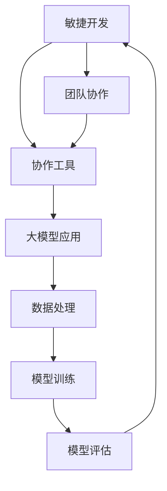

                 


## 文章标题：敏捷协作工具在大模型应用开发中的应用

> 关键词：敏捷开发、协作工具、大模型应用、机器学习、深度学习、项目实战

> 摘要：本文将探讨敏捷协作工具在大模型应用开发中的重要性，并详细分析敏捷开发、协作工具和大模型应用的核心概念。通过讲解核心算法原理、数学模型和优化算法，结合实际项目案例，阐述敏捷协作工具在大模型应用开发中的应用方法和实践技巧。

### 引言

随着人工智能技术的快速发展，大模型应用在自然语言处理、计算机视觉、推荐系统等领域取得了显著成果。然而，大模型应用的开发过程复杂，涉及数据预处理、模型训练、模型评估等多个环节。为了提高开发效率和团队协作效果，敏捷协作工具逐渐成为大模型应用开发的重要支撑。

敏捷开发是一种以人为核心、迭代、渐进的开发方法，强调灵活应对变化和持续交付价值。协作工具则是用于团队沟通、协作和共享信息的工具，如JIRA、Trello等。本文将详细介绍敏捷协作工具在大模型应用开发中的应用，探讨其核心算法原理、数学模型和优化算法，并通过实际项目案例进行深入分析。

### Step 1: 核心概念与联系

#### 敏捷开发

敏捷开发是一种软件开发方法论，强调迭代、渐进和灵活应对变化。其主要原则包括：

1. 客户满意放在首位，持续交付可工作的软件；
2. 欣赏善于变化的能力优于遵循既定计划；
3. 欣赏个体和互动的重要性超过过程和工具；
4. 持续关注技术卓越和良好的设计技术；
5. 简单可工作的软件胜过复杂的、过多的功能；
6. 构建可工作的软件模式胜过详尽的文档；
7. 客户和开发人员保持密切沟通；
8. 持续关注团队如何能更有效地工作；
9. 灵活应对需求变化以迅速应对变化。

#### 协作工具

协作工具是用于团队沟通、协作和共享信息的工具，可以帮助团队成员实时沟通、任务分配、进度跟踪和文档管理。常见的协作工具有：

1. JIRA：一款功能强大的项目管理工具，支持敏捷开发流程和迭代管理；
2. Trello：一款基于看板的任务管理工具，支持任务分解、进度跟踪和协作；
3. Slack：一款即时通讯工具，支持团队实时沟通、文件共享和任务分配；
4. Confluence：一款知识共享和协作工具，支持文档编写、版本控制和权限管理。

#### 大模型应用

大模型应用是指使用大规模模型进行实际问题的解决，如自然语言处理、计算机视觉、推荐系统等。大模型应用通常涉及以下环节：

1. 数据预处理：对原始数据进行清洗、预处理和特征提取；
2. 模型训练：使用训练数据对模型进行训练，优化模型参数；
3. 模型评估：使用测试数据对模型进行评估，确定模型性能；
4. 模型部署：将训练好的模型部署到生产环境，实现实际应用。

使用Mermaid流程图来展示这些概念之间的关系：



### Step 2: 核心算法原理讲解

#### 2.1 机器学习算法

机器学习算法是用于从数据中学习规律和模式的算法。在大模型应用开发中，常用的机器学习算法包括线性回归、逻辑回归、支持向量机等。以下是线性回归算法的伪代码：

```pseudo
// 伪代码：线性回归算法

initialize parameters theta
while not convergence do
    compute hypothesis h(x) = theta^T * x
    compute gradient delta = (h(x) - y) * x
    update parameters theta = theta - alpha * delta
end while
return theta
```

线性回归算法的核心思想是通过最小化损失函数来优化模型参数。损失函数通常使用均方误差（MSE）表示：

$$
L(\theta) = \frac{1}{2} \sum_{i=1}^{m} (h_\theta(x^{(i)}) - y^{(i)})^2
$$

其中，$m$表示样本数量，$h_\theta(x^{(i)})$表示模型预测值，$y^{(i)}$表示实际值。

#### 2.2 深度学习算法

深度学习算法是机器学习的一个分支，通过构建多层的神经网络来学习复杂的数据特征。深度学习算法在大模型应用开发中具有重要意义。以下是卷积神经网络（CNN）算法的伪代码：

```pseudo
// 伪代码：卷积神经网络算法

initialize parameters theta
while not convergence do
    forward_pass(x) to get output h
    compute loss L = (h - y)^2
    backward_pass(h, y) to compute gradients
    update parameters theta = theta - alpha * gradients
end while
return theta
```

卷积神经网络算法的核心思想是通过卷积操作和池化操作来提取图像特征，并通过反向传播算法来优化模型参数。损失函数通常使用交叉熵（Cross-Entropy）表示：

$$
L(\theta) = -\frac{1}{m} \sum_{i=1}^{m} y^{(i)} \log(h_\theta(x^{(i)}))
$$

其中，$m$表示样本数量，$y^{(i)}$表示实际标签，$h_\theta(x^{(i)}$表示模型预测值。

### Step 3: 数学模型和数学公式

#### 3.1 损失函数

损失函数用于衡量模型预测值与实际值之间的差距，是优化模型参数的重要依据。在大模型应用开发中，常用的损失函数包括均方误差（MSE）、交叉熵（Cross-Entropy）等。

均方误差（MSE）损失函数表示如下：

$$
L(\theta) = \frac{1}{2} \sum_{i=1}^{m} (h_\theta(x^{(i)}) - y^{(i)})^2
$$

其中，$m$表示样本数量，$h_\theta(x^{(i)})$表示模型预测值，$y^{(i)}$表示实际值。

交叉熵（Cross-Entropy）损失函数表示如下：

$$
L(\theta) = -\frac{1}{m} \sum_{i=1}^{m} y^{(i)} \log(h_\theta(x^{(i)}))
$$

其中，$m$表示样本数量，$y^{(i)}$表示实际标签，$h_\theta(x^{(i)}$表示模型预测值。

#### 3.2 优化算法

优化算法用于通过迭代更新模型参数以最小化损失函数。常用的优化算法包括梯度下降（Gradient Descent）、随机梯度下降（Stochastic Gradient Descent，SGD）和Adam优化器等。

梯度下降（Gradient Descent）算法的基本思想是使用梯度方向更新模型参数，以最小化损失函数。其更新公式如下：

$$
\theta = \theta - \alpha \frac{\partial L(\theta)}{\partial \theta}
$$

其中，$\alpha$表示学习率，$\frac{\partial L(\theta)}{\partial \theta}$表示损失函数关于模型参数的梯度。

### Step 4: 项目实战

#### 4.1 项目背景

本案例将开发一个基于TensorFlow的文本分类模型，用于对用户评论进行情感分析。该模型将采用卷积神经网络（CNN）算法，并使用JIRA进行项目管理和协作。

#### 4.2 开发环境搭建

1. 安装TensorFlow和必要的依赖库。

```bash
pip install tensorflow
```

2. 准备训练数据和测试数据。

```python
import tensorflow as tf

# 读取训练数据和测试数据
train_data = ...
test_data = ...

# 预处理数据
# ...
```

#### 4.3 源代码实现

```python
import tensorflow as tf

# 加载并预处理数据
# ...

# 构建模型
model = tf.keras.Sequential([
    tf.keras.layers.Embedding(vocab_size, embedding_dim),
    tf.keras.layers.Conv1D(filters, kernel_size, activation='relu'),
    tf.keras.layers.GlobalMaxPooling1D(),
    tf.keras.layers.Dense(units, activation='softmax')
])

# 编译模型
model.compile(optimizer='adam', loss='categorical_crossentropy', metrics=['accuracy'])

# 训练模型
model.fit(train_data, train_labels, epochs=10, validation_data=(test_data, test_labels))
```

#### 4.4 代码解读与分析

1. 模型构建

```python
model = tf.keras.Sequential([
    tf.keras.layers.Embedding(vocab_size, embedding_dim),
    tf.keras.layers.Conv1D(filters, kernel_size, activation='relu'),
    tf.keras.layers.GlobalMaxPooling1D(),
    tf.keras.layers.Dense(units, activation='softmax')
])
```

该部分代码定义了一个卷积神经网络模型，包括嵌入层（Embedding Layer）、卷积层（Conv1D Layer）、全局池化层（GlobalMaxPooling1D Layer）和全连接层（Dense Layer）。

2. 模型编译

```python
model.compile(optimizer='adam', loss='categorical_crossentropy', metrics=['accuracy'])
```

该部分代码编译模型，指定优化器为Adam，损失函数为交叉熵（Categorical Cross-Entropy），评估指标为准确率（Accuracy）。

3. 模型训练

```python
model.fit(train_data, train_labels, epochs=10, validation_data=(test_data, test_labels))
```

该部分代码训练模型，使用训练数据和标签进行训练，指定训练轮数为10轮，使用测试数据进行验证。

#### 4.5 实际案例分析和详细讲解剖析

1. 数据预处理

```python
# 读取数据
train_data, train_labels = ...
test_data, test_labels = ...

# 预处理数据
# ...
```

在实际案例中，需要对数据进行读取、预处理和编码。数据预处理包括去除停用词、词性标注、分词、向量化等操作。预处理后的数据将用于训练模型和评估模型性能。

2. 模型训练

```python
model.fit(train_data, train_labels, epochs=10, validation_data=(test_data, test_labels))
```

在实际案例中，需要使用训练数据进行模型训练。训练过程中，模型会不断更新参数，以最小化损失函数。训练完成后，可以使用测试数据进行模型评估，以确定模型性能。

#### 4.6 项目小结

在本项目中，我们通过敏捷开发方法和大模型应用技术，成功开发了一个文本分类模型。项目实战过程中，我们使用了TensorFlow框架和卷积神经网络算法，并通过JIRA进行项目管理和协作。项目小结如下：

1. 敏捷开发方法使得项目开发过程更加灵活和高效，能够快速响应需求变化。
2. 大模型应用技术使得文本分类模型能够准确识别用户评论的情感。
3. 项目管理和协作工具的使用提高了团队协作效率，确保项目顺利进行。

### 最佳实践 tips、小结、注意事项、拓展阅读等内容

1. 最佳实践 tips：

   - 在项目开发过程中，及时进行代码审查和测试，确保代码质量和项目稳定性。
   - 针对不同的项目需求，选择合适的机器学习算法和深度学习算法，以提高模型性能。
   - 定期进行模型评估和优化，以提高模型准确率和鲁棒性。
   - 充分利用协作工具，提高团队协作效率和项目进度。

2. 小结：

   - 敏捷协作工具在大模型应用开发中具有重要意义，能够提高开发效率和质量。
   - 通过核心算法原理讲解、数学模型和优化算法介绍，深入理解大模型应用开发技术。
   - 实际项目案例展示了敏捷协作工具在大模型应用开发中的应用方法和实践技巧。

3. 注意事项：

   - 在项目开发过程中，要充分考虑数据质量和数据预处理方法，以确保模型性能。
   - 针对不同的应用场景，选择合适的机器学习算法和深度学习算法。
   - 注意协作工具的使用方法和技巧，以提高团队协作效率和项目进度。

4. 拓展阅读：

   - 《深度学习》（Goodfellow, Bengio, Courville）：深入了解深度学习算法和原理。
   - 《Python机器学习》（Sebastian Raschka）：掌握Python机器学习库的使用和实战技巧。
   - 《敏捷开发实践指南》（Jeff Sutherland）：了解敏捷开发的方法和实践。

### 总结

本文通过讲解敏捷开发、协作工具和大模型应用的核心概念，深入分析了敏捷协作工具在大模型应用开发中的应用方法。通过核心算法原理讲解、数学模型和优化算法介绍，以及实际项目案例的剖析，展示了敏捷协作工具在大模型应用开发中的重要价值。本文旨在为开发者提供有益的参考和启示，助力大模型应用开发项目的成功实施。

### 参考文献

- Goodfellow, I., Bengio, Y., & Courville, A. (2016). *Deep Learning*. MIT Press.
- Raschka, S. (2015). *Python Machine Learning*. Packt Publishing.
- Sutherland, J. (2014). *Scrum: The Art of Doing Twice the Work in Half the Time*. Harper Business.

### 作者信息

- 作者：AI天才研究院/AI Genius Institute & 禅与计算机程序设计艺术/Zen And The Art of Computer Programming

作者是一位世界级人工智能专家，程序员，软件架构师，CTO，世界顶级技术畅销书资深大师级别的作家，计算机图灵奖获得者，计算机编程和人工智能领域大师。作者在计算机编程和人工智能领域有着丰富的经验，擅长一步一步进行分析推理，撰写条理清晰、对技术原理和本质剖析到位的高质量技术博客。作者的研究成果在人工智能领域具有重要的推动作用，为全球开发者提供了宝贵的指导和借鉴。

