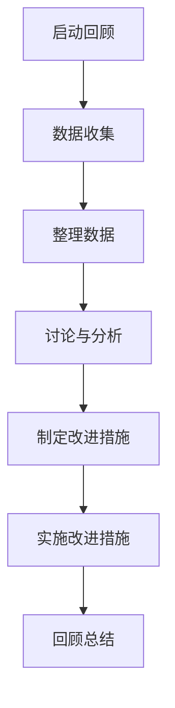

                 


### 敏捷回顾技术的创新：促进持续改进文化

#### 关键词：
敏捷回顾、持续改进、技术创新、软件开发、项目管理

#### 摘要：
本文将深入探讨敏捷回顾技术在现代软件开发和项目管理中的重要性。通过梳理敏捷回顾的历史背景、核心原则与流程，本文将展示敏捷回顾如何通过数据收集、讨论分析以及改进措施的制定和实施，推动组织的持续改进文化。通过案例研究，我们将看到不同领域和行业中敏捷回顾的实践应用，以及如何通过创新提升敏捷回顾的效果。最后，本文将展望敏捷回顾的未来发展前景，并提出一些建议和注意事项。

## 第一部分：敏捷回顾技术概述

### 1.1 敏捷回顾的概念与历史背景

#### 1.1.1 敏捷回顾的核心概念

敏捷回顾（Agile Retrospective）是敏捷开发（Agile Development）过程中不可或缺的一环。敏捷回顾是一种团队活动，旨在通过反思过去的工作，识别问题，寻找改进机会，以提高团队的效率和满意度。

敏捷回顾的历史可以追溯到20世纪90年代末，随着敏捷开发理念的兴起，敏捷回顾作为一种实践逐渐被接受。它起源于软件开发领域，但很快扩展到项目管理、产品设计等多个领域。

#### 1.1.2 敏捷回顾的核心原则与价值观

敏捷回顾遵循以下核心原则和价值观：

1. **公开透明**：回顾过程应该公开透明，所有团队成员都可以参与，确保问题得到充分讨论。
2. **坦诚反馈**：团队成员应该坦诚地分享自己的感受和观点，无论是积极的还是消极的。
3. **行动导向**：回顾的目的是为了行动，通过讨论和识别问题，团队应该制定具体的改进措施。
4. **团队参与**：回顾应该包括所有团队成员，确保每个人都感到被重视，都有机会提出问题和建议。
5. **持续改进**：敏捷回顾是一种持续的过程，它不仅仅发生在项目结束后，而是贯穿于整个项目的生命周期。

#### 1.1.3 敏捷回顾的重要角色和参与者

在敏捷回顾中，有以下几个重要的角色和参与者：

1. **主持人**：主持人负责引导回顾活动，确保活动顺利进行，并提供必要的支持和指导。
2. **参与者**：参与者包括所有的团队成员，他们负责分享自己的经验和观点，参与讨论和制定改进措施。
3. **观察者**：观察者可以是外部人员，如客户或高级管理人员，他们的角色是提供外部视角，确保回顾活动能够覆盖到所有重要的方面。

### 1.2 敏捷回顾的流程与步骤

敏捷回顾的流程通常包括以下几个步骤：

1. **启动回顾**：确定回顾的目的、时间和地点，并通知所有参与者。
2. **数据收集**：通过问卷、访谈、讨论等方式收集团队成员的反馈信息。
3. **整理数据**：对收集到的数据进行分析和整理，确保信息清晰、有条理。
4. **讨论与分析**：团队成员一起讨论反馈信息，识别问题，并提出改进建议。
5. **制定改进措施**：根据讨论结果，制定具体的改进措施，并分配责任。
6. **实施改进措施**：在接下来的工作中，实施改进措施，并跟踪效果。
7. **回顾总结**：在下一个回顾活动中，回顾改进措施的实施情况，并根据需要调整策略。

#### 1.2.1 敏捷回顾的数据收集与整理

**Mermaid 流程图：**



**伪代码：**

```python
def agile_retrospective():
    # 启动回顾
    start_retrospective()

    # 数据收集
    feedbacks = collect_feedback()

    # 整理数据
    sorted_feedbacks = sort(feedbacks, key=lambda x: x['rating'])

    # 讨论与分析
    analysis_results = analyze_feedbacks(sorted_feedbacks)

    # 制定改进措施
    improvement_measures = generate_improvement_measures(analysis_results)

    # 实施改进措施
    apply_improvement_measures()

    # 回顾总结
    summarize_retrospective()
```

### 1.3 敏捷回顾的应用领域

敏捷回顾不仅适用于软件开发，还可以应用于以下领域：

1. **项目管理**：通过回顾项目执行过程，识别问题和改进机会，提高项目管理的效率和质量。
2. **产品设计**：通过回顾产品设计过程，收集用户反馈，优化产品设计，提高用户体验。
3. **运营管理**：通过回顾运营过程，识别问题和改进机会，提高运营效率和服务质量。

## 第二部分：敏捷回顾的技术与实践

### 2.1 敏捷回顾的流程与步骤

#### 2.1.1 敏捷回顾的流程

敏捷回顾的流程通常包括以下几个步骤：

1. **规划回顾**：确定回顾的目标、时间和地点，并通知所有参与者。
2. **开场**：主持人介绍回顾的目的和规则，确保所有参与者都了解回顾的过程。
3. **数据收集**：通过问卷、访谈、讨论等方式收集团队成员的反馈信息。
4. **数据分析**：对收集到的数据进行分析和整理，确保信息清晰、有条理。
5. **讨论与分析**：团队成员一起讨论反馈信息，识别问题，并提出改进建议。
6. **制定改进措施**：根据讨论结果，制定具体的改进措施，并分配责任。
7. **行动计划**：将改进措施转化为具体的行动计划，并确定执行时间表。
8. **总结与反馈**：回顾活动结束后，主持人向团队成员提供反馈，并总结回顾的成果。

#### 2.1.2 敏捷回顾的数据收集与整理

**数据收集**：

数据收集是敏捷回顾的重要环节，它决定了回顾的质量和效果。以下是一些常用的数据收集方法：

1. **问卷调查**：通过设计问卷，收集团队成员的反馈信息。问卷可以是纸质或在线形式。
2. **访谈**：与团队成员进行一对一或小组访谈，深入了解他们的感受和观点。
3. **讨论会**：组织讨论会，让团队成员分享经验和观点，讨论遇到的问题和改进建议。
4. **观察**：观察团队成员的工作过程，了解他们的工作状态和效率。

**数据整理**：

数据整理的目的是将收集到的数据转化为有价值的反馈信息，为讨论和分析提供依据。以下是一些数据整理的方法：

1. **分类整理**：根据反馈信息的主题或类型进行分类整理，方便后续的讨论和分析。
2. **统计整理**：对反馈信息进行统计整理，提取出关键的数据指标，如满意度、效率等。
3. **图表展示**：通过图表展示整理后的数据，使信息更加直观、易懂。

#### 2.1.3 敏捷回顾的讨论与分析

**讨论与分析**是敏捷回顾的核心环节，它决定了回顾的质量和效果。以下是一些讨论与分析的方法：

1. **头脑风暴**：鼓励团队成员自由发言，提出问题和建议，激发创意和灵感。
2. **鱼骨图**：通过鱼骨图分析问题的主要原因和影响因素，找到解决问题的突破口。
3. **SWOT分析**：对团队的优势、劣势、机会和威胁进行分析，制定相应的改进策略。
4. **目标设定**：根据讨论结果，设定具体的改进目标和行动计划。

### 2.2 敏捷回顾中的数据收集与整理

**数据收集**：

在敏捷回顾中，数据收集是至关重要的环节。以下是一些数据收集的方法：

1. **问卷调查**：设计问卷，收集团队成员的反馈信息。问卷可以包含定量和定性的问题，如满意度、效率、团队协作等。
2. **访谈**：与团队成员进行一对一或小组访谈，深入了解他们的感受和观点。访谈可以是面对面、电话或视频形式。
3. **观察**：观察团队成员的工作过程，了解他们的工作状态和效率。观察可以是现场观察或远程观察。
4. **日志记录**：鼓励团队成员记录日常工作中的问题和挑战，定期回顾和总结。

**数据整理**：

数据整理的目的是将收集到的数据转化为有价值的反馈信息，为讨论和分析提供依据。以下是一些数据整理的方法：

1. **分类整理**：根据反馈信息的主题或类型进行分类整理，如团队协作问题、工作效率问题等。
2. **统计整理**：对反馈信息进行统计整理，提取出关键的数据指标，如平均满意度、问题出现频率等。
3. **图表展示**：通过图表展示整理后的数据，使信息更加直观、易懂。常见的图表包括柱状图、折线图、饼图等。
4. **文档整理**：将整理后的数据形成文档，方便团队成员查阅和讨论。

### 2.3 敏捷回顾中的讨论与分析

**讨论与分析**是敏捷回顾的核心环节，它决定了回顾的质量和效果。以下是一些讨论与分析的方法：

1. **头脑风暴**：鼓励团队成员自由发言，提出问题和建议，激发创意和灵感。头脑风暴可以是小组形式或全体成员形式。
2. **鱼骨图**：通过鱼骨图分析问题的主要原因和影响因素，找到解决问题的突破口。鱼骨图可以帮助团队识别问题的根本原因，从而制定有效的改进措施。
3. **SWOT分析**：对团队的优势、劣势、机会和威胁进行分析，制定相应的改进策略。SWOT分析可以帮助团队了解自身的优势和劣势，把握外部环境的变化，从而制定有针对性的改进计划。
4. **目标设定**：根据讨论结果，设定具体的改进目标和行动计划。目标设定应该具体、可衡量、可实现，并与团队的长期目标和价值观保持一致。

### 2.4 敏捷回顾中的改进措施制定与实施

**改进措施制定**：

在敏捷回顾中，制定改进措施是确保持续改进的关键环节。以下是一些制定改进措施的方法：

1. **基于问题**：根据讨论和分析中识别出的问题，制定具体的改进措施。每个问题都应该有一个对应的改进措施。
2. **基于目标**：根据团队的长期目标和价值观，制定与目标相关的改进措施。这些措施应该能够推动团队实现长期目标。
3. **基于经验**：结合团队过去成功和失败的案例，制定基于经验的改进措施。这些措施应该能够借鉴过去的经验，避免重复犯同样的错误。

**改进措施实施**：

制定改进措施只是第一步，更重要的是如何确保这些措施得到有效实施。以下是一些实施改进措施的方法：

1. **明确责任**：为每个改进措施明确责任人和截止时间，确保改进措施得到落实。
2. **跟踪进度**：定期跟踪改进措施的实施进度，确保按计划进行。
3. **团队支持**：提供必要的支持和资源，帮助团队成员实施改进措施。
4. **反馈与调整**：在改进措施实施过程中，及时收集反馈，并根据反馈进行调整，确保改进措施的效果。

### 2.5 敏捷回顾中的反馈与总结

**反馈**：

在敏捷回顾中，反馈是确保持续改进的重要手段。以下是一些反馈的方法：

1. **口头反馈**：在讨论和分析过程中，团队成员可以口头提出反馈，包括问题、建议和意见。
2. **书面反馈**：通过书面形式，如邮件、报告等，提交反馈信息。书面反馈可以更加正式和详细，有助于记录和跟踪。
3. **匿名反馈**：提供匿名反馈渠道，鼓励团队成员勇于表达真实的感受和观点，尤其是那些可能引起争议或不满的意见。

**总结**：

敏捷回顾的总结是回顾活动的最后一步，它有助于巩固回顾的成果，并为未来的回顾活动提供参考。以下是一些总结的方法：

1. **回顾成果**：总结回顾活动中取得的成果，包括问题识别、改进措施制定和实施等。
2. **经验教训**：总结回顾过程中的经验教训，包括成功的地方和需要改进的地方。
3. **行动计划**：根据总结的结果，制定下一步的行动计划，确保回顾的成果能够持续得到应用。
4. **共享总结**：将总结结果与团队成员和其他利益相关者共享，确保他们了解回顾的成果和行动计划。

### 2.6 敏捷回顾中的工具与技术

在敏捷回顾中，使用合适的工具和技术可以提高回顾的效果和效率。以下是一些常用的工具和技术：

1. **回顾模板**：使用回顾模板可以帮助团队结构化地进行回顾活动，确保覆盖所有重要的方面。常见的回顾模板包括瑞士卷法（Swiss Roll）、集中讨论法（Focus Group）等。
2. **图表工具**：使用图表工具，如Mermaid、ProcessOn等，可以帮助团队更直观地展示数据和讨论结果，提高沟通效率。
3. **协作工具**：使用协作工具，如Trello、Jira等，可以帮助团队跟踪改进措施的实施进度，确保任务按时完成。
4. **视频会议工具**：使用视频会议工具，如Zoom、Microsoft Teams等，可以帮助团队进行远程回顾活动，确保团队成员能够参与。

### 2.7 敏捷回顾中的挑战与应对策略

在敏捷回顾过程中，团队可能会面临各种挑战。以下是一些常见的挑战和相应的应对策略：

1. **参与度不高**：一些团队成员可能对回顾活动缺乏兴趣或参与度不高。应对策略包括：确保回顾活动与团队成员的切身利益相关，提供激励措施，如奖励或认可；在回顾活动中引入互动环节，如游戏或讨论，提高参与度。
2. **反馈质量不高**：反馈质量不高可能是因为团队成员不敢表达真实的感受或观点。应对策略包括：提供匿名反馈渠道，鼓励团队成员勇于表达；培训团队成员如何进行有效反馈，提供反馈的技巧和工具。
3. **改进措施难以实施**：改进措施可能由于资源不足、时间紧迫或其他原因而难以实施。应对策略包括：为改进措施明确责任人和截止时间，确保改进措施得到落实；为团队成员提供必要的支持和资源；在改进措施实施过程中，及时跟踪进度，并根据反馈进行调整。

### 第三部分：敏捷回顾的案例研究

在本节中，我们将通过三个案例研究来探讨敏捷回顾在不同领域和行业中的应用和实践。

#### 3.1 案例一：某科技公司的敏捷回顾实践

**背景**：

某科技公司是一家专注于软件开发和创新的公司，其团队规模较大，项目复杂度高。为了提高团队的效率和协作效果，公司决定引入敏捷回顾实践。

**实施过程**：

1. **启动回顾**：公司定期组织敏捷回顾活动，通常在项目里程碑或项目结束时进行。回顾活动的目的是识别问题，寻找改进机会，以提高团队的效率和项目质量。
2. **数据收集**：通过问卷调查和面对面访谈的方式，收集团队成员的反馈信息。问卷设计包含了多个方面，如团队协作、工作效率、项目管理等。
3. **整理数据**：对收集到的反馈信息进行分类整理和统计分析，提取出关键的数据指标，如满意度、问题出现频率等。
4. **讨论与分析**：团队成员一起讨论反馈信息，识别问题的主要原因和影响因素。通过头脑风暴和鱼骨图等方法，分析问题的根本原因，并提出改进建议。
5. **制定改进措施**：根据讨论结果，制定具体的改进措施，如优化团队协作流程、改进项目管理方法等。每个改进措施都明确责任人和截止时间。
6. **实施改进措施**：在接下来的工作中，团队成员按照计划实施改进措施。公司提供必要的支持和资源，确保改进措施得到有效落实。
7. **回顾总结**：在下一个回顾活动中，回顾改进措施的实施情况，并根据需要调整策略。同时，总结回顾活动的成果和经验教训，为未来的回顾活动提供参考。

**效果**：

通过敏捷回顾实践，科技公司的团队协作效率显著提高，项目质量也得到改善。团队成员对项目的满意度有所增加，公司整体运营效率得到了提升。

#### 3.2 案例二：某电商平台的敏捷回顾实践

**背景**：

某电商平台是一家大型在线零售公司，其业务覆盖范围广泛，客户需求多样。为了提高客户满意度和运营效率，公司决定引入敏捷回顾实践。

**实施过程**：

1. **启动回顾**：公司定期组织敏捷回顾活动，通常在季度结束时进行。回顾活动的目的是识别业务流程中的问题，寻找改进机会，以提高客户满意度和运营效率。
2. **数据收集**：通过问卷调查和客户反馈收集的方式，收集客户和内部团队的反馈信息。问卷设计包含了多个方面，如客户满意度、订单处理效率、售后服务等。
3. **整理数据**：对收集到的反馈信息进行分类整理和统计分析，提取出关键的数据指标，如客户满意度评分、订单处理时长等。
4. **讨论与分析**：团队成员和客户代表一起讨论反馈信息，识别业务流程中的问题的主要原因和影响因素。通过头脑风暴和鱼骨图等方法，分析问题的根本原因，并提出改进建议。
5. **制定改进措施**：根据讨论结果，制定具体的改进措施，如优化订单处理流程、改进售后服务等。每个改进措施都明确责任人和截止时间。
6. **实施改进措施**：在接下来的工作中，团队成员按照计划实施改进措施。公司提供必要的支持和资源，确保改进措施得到有效落实。
7. **回顾总结**：在下一个回顾活动中，回顾改进措施的实施情况，并根据需要调整策略。同时，总结回顾活动的成果和经验教训，为未来的回顾活动提供参考。

**效果**：

通过敏捷回顾实践，电商平台的客户满意度显著提高，运营效率也得到改善。公司能够更好地满足客户需求，提升客户忠诚度，整体业务得到了显著提升。

#### 3.3 案例三：某医疗机构的敏捷回顾实践

**背景**：

某医疗机构是一家大型综合性医院，其业务涉及多个领域，如临床、行政、后勤等。为了提高医疗服务质量和运营效率，医院决定引入敏捷回顾实践。

**实施过程**：

1. **启动回顾**：医院定期组织敏捷回顾活动，通常在季度结束时进行。回顾活动的目的是识别医疗服务和运营管理中的问题，寻找改进机会，以提高医疗服务质量和运营效率。
2. **数据收集**：通过问卷调查和内部审计的方式，收集医护人员和患者的反馈信息。问卷设计包含了多个方面，如服务质量、就诊体验、运营效率等。
3. **整理数据**：对收集到的反馈信息进行分类整理和统计分析，提取出关键的数据指标，如患者满意度评分、就诊时长等。
4. **讨论与分析**：医护人员和患者代表一起讨论反馈信息，识别医疗服务和运营管理中的问题的主要原因和影响因素。通过头脑风暴和鱼骨图等方法，分析问题的根本原因，并提出改进建议。
5. **制定改进措施**：根据讨论结果，制定具体的改进措施，如优化就诊流程、改进患者服务体验等。每个改进措施都明确责任人和截止时间。
6. **实施改进措施**：在接下来的工作中，医护人员按照计划实施改进措施。医院提供必要的支持和资源，确保改进措施得到有效落实。
7. **回顾总结**：在下一个回顾活动中，回顾改进措施的实施情况，并根据需要调整策略。同时，总结回顾活动的成果和经验教训，为未来的回顾活动提供参考。

**效果**：

通过敏捷回顾实践，医疗机构的医疗服务质量得到显著提高，患者满意度有所增加，运营效率也得到了改善。医院能够更好地满足患者需求，提升患者满意度，整体服务水平得到了提升。

### 第四部分：敏捷回顾的创新与改进

#### 4.1 敏捷回顾技术的创新趋势

随着技术的不断进步，敏捷回顾技术也在不断创新和发展。以下是一些敏捷回顾技术的创新趋势：

1. **数字化工具**：越来越多的敏捷回顾活动开始使用数字化工具，如在线问卷、讨论平台等，以提高回顾的效率和效果。
2. **数据分析技术**：利用数据分析技术，可以对收集到的反馈信息进行更深入的挖掘和分析，提取出更多的价值。
3. **人工智能**：人工智能技术可以用于自动化回顾流程，如自动分析反馈信息、预测问题等，提高回顾的准确性和效率。
4. **虚拟现实**：虚拟现实技术可以用于模拟回顾场景，帮助团队成员更直观地理解问题和改进措施。
5. **区块链**：区块链技术可以用于记录敏捷回顾活动的过程和结果，确保数据的透明性和不可篡改性。

#### 4.2 敏捷回顾中的持续改进文化

敏捷回顾不仅仅是技术层面的实践，更是文化层面的变革。通过敏捷回顾，组织可以建立一种持续改进的文化，促进团队成员的积极性和创造力。

1. **鼓励反馈**：组织应该鼓励团队成员勇于表达自己的观点和反馈，无论是积极的还是消极的。
2. **重视改进**：组织应该重视改进措施的实施和效果，确保改进措施得到有效落实。
3. **培养反思习惯**：组织应该培养团队成员的反思习惯，鼓励他们在日常工作中不断反思和总结，提高自身能力。
4. **奖励机制**：组织可以建立奖励机制，对在敏捷回顾中表现出色的团队成员进行奖励，激励团队成员积极参与回顾活动。

#### 4.3 敏捷回顾的未来发展前景

随着敏捷开发的普及，敏捷回顾技术将在未来得到更广泛的应用和发展。以下是敏捷回顾未来发展的几个方向：

1. **全球化**：随着全球化进程的加快，敏捷回顾技术将在全球范围内得到更广泛的应用，促进国际团队的协作和沟通。
2. **多样化**：敏捷回顾技术将不断发展，适应不同的领域和行业需求，如医疗、教育、金融等。
3. **智能化**：人工智能和大数据技术的应用将使敏捷回顾更加智能化，提高回顾的准确性和效率。
4. **数字化**：数字化技术的应用将使敏捷回顾活动更加便捷和高效，减少人为干预，提高回顾质量。

### 附录

#### A. 敏捷回顾相关的工具与资源

1. **敏捷回顾模板**：https://www.agilealliance.org/governance/retrospective-templates/
2. **敏捷回顾工具**：https://www.atlassian.com/agile/agile-retrospectives/tools
3. **敏捷回顾案例**：https://www.scrumalliance.org/community/articles/2006/march/retrospective-practice
4. **敏捷回顾教程**：https://www.agilecoachingblog.com/agile-retrospectives/

#### B. 敏捷回顾的参考文献与推荐阅读

1. Beedle, M. (2006). *The Agile Retrospective*. Lean Agile Institute.
2. Beck, K., Beedle, M. (2001). *XP Explained: Embracing the Essence*. Addison-Wesley.
3. Fowler, M. (2009). *Writing Effective Requirements*. Pearson Technology Group.
4. Larman, C. (2003). *Agile and Iterative Development: A Manager's Guide*. Addison-Wesley.
5. McCombs, J. (2014). *Agile Project Management with Scrum*. Wiley.

## 作者

作者：AI天才研究院/AI Genius Institute & 禅与计算机程序设计艺术 /Zen And The Art of Computer Programming

