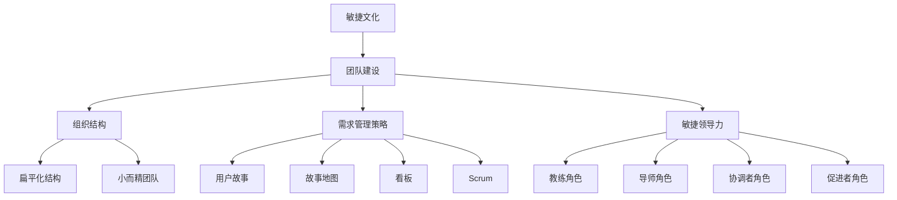

                 


## 敏捷团队文化建设：支持灵活的需求管理

### 关键词

- 敏捷文化
- 团队建设
- 需求管理
- 敏捷需求
- 敏捷领导力

### 摘要

本文旨在探讨敏捷团队文化的建设，尤其是如何通过有效的需求管理策略，支持团队的灵活性和创新能力。我们将首先介绍敏捷文化的起源与发展，阐述敏捷宣言与核心价值观，以及这些价值观如何影响团队建设。接着，我们将详细分析敏捷团队的组织结构、协作模式以及领导力特点。在此基础上，我们将探讨敏捷需求管理的挑战与机遇，介绍需求收集与分析的方法，以及需求变更管理和需求文档编写的策略。通过具体案例和实践，我们将展示敏捷需求管理的最佳实践，并对敏捷团队文化建设进行总结和展望。

### 第一部分：敏捷文化与团队建设

#### 第1章：敏捷文化与价值观

#### 1.1 敏捷文化的起源与发展

敏捷开发（Agile Development）起源于20世纪90年代，当时软件开发行业正面临着项目延迟、成本超支和质量问题等一系列挑战。为了应对这些挑战，一些软件开发者开始探索新的开发方法，以更好地适应快速变化的需求和环境。2001年，一群软件开发者共同签署了《敏捷宣言》（The Agile Manifesto），标志着敏捷开发运动的诞生。

敏捷宣言提出了四项核心价值观，即：

1. **个体和互动重于过程与工具**：强调团队中个体的能力和互动，而不仅仅是依赖工具和流程。
2. **可工作的软件重于详尽的文档**：认为可工作的软件比详尽的文档更有价值，因为软件可以直接交付价值。
3. **客户合作重于合同谈判**：鼓励与客户的紧密合作，以更好地理解客户需求和市场变化。
4. **响应变化重于遵循计划**：强调对变化保持开放和适应性，而不是坚持既定的计划。

这些价值观不仅指导了软件开发的方法，也深刻影响了团队文化。敏捷文化倡导开放性、透明度、自主性和持续学习。

#### 1.2 敏捷宣言与核心价值观

敏捷宣言的四项核心价值观不仅是对软件开发实践的指导，也是团队文化建设的基石。以下是这些价值观的具体解释：

1. **个体和互动重于过程与工具**：这意味着团队应该关注个体之间的协作和互动，而不是过分依赖特定的流程或工具。在敏捷团队中，团队成员之间保持开放沟通，共同解决问题，以提高整个团队的效率。

2. **可工作的软件重于详尽的文档**：虽然文档在软件开发中仍然很重要，但敏捷文化更注重实际交付价值。敏捷团队倾向于编写“够用”的文档，确保软件能够在每个迭代中交付实际功能。

3. **客户合作重于合同谈判**：敏捷团队与客户保持紧密合作，确保开发过程与客户需求保持一致。这种方式可以减少误解，提高客户满意度。

4. **响应变化重于遵循计划**：敏捷开发强调对变化的适应性。团队不会完全遵循固定的计划，而是根据实际情况进行灵活调整，以应对需求的变化。

#### 1.3 敏捷文化对团队建设的影响

敏捷文化对团队建设产生了深远影响。首先，它促进了团队中的开放性和透明度。团队成员之间更愿意分享信息和知识，这有助于提高团队的协作效率。其次，敏捷文化鼓励自主性和责任感。团队成员不仅对自己的工作负责，也对团队的整体成功负责。这种责任感有助于团队在面对挑战时保持积极态度。

此外，敏捷文化还促进了持续学习。敏捷团队不断评估和改进自己的工作方式，以确保始终能够应对快速变化的需求和环境。这种持续学习的文化有助于团队保持竞争力。

### 第二部分：需求管理策略

#### 第4章：敏捷需求管理概述

#### 4.1 需求管理的挑战与机遇

在传统的软件开发项目中，需求管理是一个关键但常常被忽视的环节。敏捷开发的出现为需求管理带来了新的挑战和机遇。以下是敏捷需求管理面临的主要挑战：

1. **需求频繁变更**：敏捷开发强调快速迭代，这意味着需求可能会在项目进行中频繁变更。这种变化带来了挑战，因为传统的需求管理方法往往难以应对这种动态环境。

2. **客户参与**：敏捷需求管理强调与客户的紧密合作，这需要团队具备良好的沟通能力和客户管理技巧。

3. **需求优先级**：在敏捷开发中，如何确定需求优先级是一个重要问题。团队需要确保关键需求得到及时处理，同时保持整体项目的进度。

尽管面临挑战，敏捷需求管理也带来了许多机遇：

1. **快速响应变化**：敏捷需求管理方法使得团队能够快速响应需求变化，从而更好地满足客户需求。

2. **提高客户满意度**：通过与客户的紧密合作，团队可以确保开发过程与客户需求保持一致，从而提高客户满意度。

3. **持续交付价值**：敏捷需求管理方法鼓励团队在每个迭代中交付可工作的软件，这有助于提高项目的整体价值和客户满意度。

#### 4.2 敏捷需求管理的原则

敏捷需求管理遵循一系列核心原则，这些原则确保了需求管理的有效性。以下是这些原则：

1. **客户价值优先**：确保所有需求都基于客户价值进行评估和排序。客户价值的实现是敏捷需求管理的核心目标。

2. **迭代与增量开发**：敏捷需求管理强调迭代和增量开发，通过不断交付功能模块来满足客户需求。

3. **需求可视化和透明性**：使用看板（Kanban）或看板（Scrum）等可视化工具，确保团队成员对当前需求状态有清晰的认识。

4. **灵活性和适应性**：敏捷需求管理方法强调对变化的适应性，允许需求在项目进行中调整，以确保项目能够持续满足客户需求。

5. **持续沟通**：敏捷需求管理依赖于持续沟通，确保所有团队成员对需求有共同的理解。

#### 4.3 敏捷需求管理的方法

敏捷需求管理采用了一系列方法来确保需求的有效管理。以下是这些方法：

1. **用户故事**：用户故事是一种简短的需求描述，通常包含“作为…，我想…，以便…”的格式。用户故事有助于团队更好地理解客户需求。

2. **故事地图**：故事地图是一种可视化的需求优先级管理工具，帮助团队确定哪些需求应该在下一个迭代中实现。

3. **看板**：看板是一种可视化管理工具，用于跟踪需求的整个生命周期，从需求收集到实现。

4. **Scrum**：Scrum是一种敏捷开发方法，它通过定期会议（如每日站立会议、冲刺计划会议和回顾会议）来确保需求的及时交付。

### 第三部分：实践与案例

#### 第8章：敏捷需求管理实践

#### 8.1 敏捷需求管理的案例分析

以下是一个敏捷需求管理的实际案例：

在一个大型企业级项目的开发过程中，团队面临着一个关键挑战：如何在快速变化的市场环境中保持需求管理的有效性。为了解决这个问题，团队采取了以下步骤：

1. **用户故事编写**：团队首先通过用户故事来收集和记录需求。用户故事不仅描述了功能需求，还包括了使用场景和优先级。

2. **故事地图**：团队使用故事地图来可视化需求优先级，确保关键需求在下一个迭代中得到实现。

3. **看板管理**：团队使用看板来跟踪需求的整个生命周期，从需求收集到实现。看板确保了团队成员对当前需求状态有清晰的认识。

4. **敏捷会议**：团队定期举行敏捷会议，包括每日站立会议、冲刺计划会议和回顾会议，以确保需求的及时交付。

通过这些方法，团队成功地应对了快速变化的市场环境，并在项目截止日期前成功交付了高质量的产品。

### 第9章：敏捷团队文化建设案例分析

#### 9.1 案例背景与目标

在一个中型互联网公司的项目中，团队希望构建一个创新的在线平台，但面临着团队协作不佳和需求管理混乱的问题。为了解决这个问题，公司决定引入敏捷文化，并实施敏捷需求管理。

目标如下：

1. **提高团队协作效率**：通过敏捷方法，团队希望能够提高协作效率，减少沟通障碍。
2. **优化需求管理流程**：通过敏捷需求管理，团队希望实现更高效的需求收集、分析和变更管理流程。

#### 9.2 案例实施过程

为了实现这些目标，团队采取了以下措施：

1. **敏捷宣言培训**：团队首先接受了敏捷宣言的培训，以了解敏捷文化的核心价值观和实践方法。

2. **组织结构调整**：团队进行了组织结构调整，以更好地适应敏捷方法。例如，引入了Scrum Master角色，负责协调团队工作和确保敏捷实践的实施。

3. **需求收集方法**：团队引入了用户故事和故事地图等需求收集方法，以更清晰地理解客户需求。

4. **看板管理**：团队使用了看板来管理需求的生命周期，确保需求的有效跟踪和管理。

5. **敏捷会议**：团队定期举行敏捷会议，包括每日站立会议、冲刺计划会议和回顾会议，以确保需求的及时交付和团队协作。

#### 9.3 案例效果评估与启示

通过实施敏捷团队文化建设和敏捷需求管理，团队取得了显著成效：

1. **团队协作效率提高**：敏捷方法使得团队成员之间的沟通更加顺畅，协作效率显著提高。

2. **需求管理流程优化**：敏捷需求管理方法使得需求收集、分析和变更管理流程更加高效，需求变更得到及时处理。

3. **客户满意度提升**：由于团队能够更好地响应客户需求，客户满意度得到显著提升。

从这一案例中，我们可以得到以下启示：

1. **敏捷文化的重要性**：敏捷文化能够提高团队协作效率，优化需求管理流程，从而提高整体项目成功率。

2. **持续学习和改进**：敏捷团队需要持续学习和改进，以适应不断变化的需求和环境。

### 附录

#### 附录A：敏捷团队建设与需求管理的工具

为了支持敏捷团队建设和需求管理，以下是一些常用的工具：

1. **敏捷项目管理工具**：如Jira、Trello、Asana等，用于任务跟踪、需求管理和团队协作。

2. **需求管理工具**：如Azure DevOps、Microsoft Project等，用于需求收集、分析和变更管理。

3. **敏捷实践指南**：如《敏捷实践指南》（The Agile Practice Guide）等，提供了敏捷实践的详细指导。

#### 附录B：参考文献与推荐阅读

1. **《敏捷实践指南》（The Agile Practice Guide）》**：Mike Cohn著，详细介绍了敏捷实践的方法和技巧。

2. **《用户故事地图》（User Story Mapping）》**：Jeff Patton著，介绍了如何使用用户故事地图来管理需求。

3. **《敏捷需求管理》（Agile Demand Management）》**：Michael Kennedy著，详细介绍了敏捷需求管理的原则和方法。

### 结论

敏捷团队文化建设是支持灵活需求管理的基石。通过理解敏捷文化的核心价值观，建立敏捷团队的组织结构，以及实施有效的需求管理策略，团队可以更好地应对快速变化的需求和环境。本文通过案例分析和实践经验，展示了敏捷团队文化建设的关键要素和最佳实践，希望对读者有所启发。

### 附录

#### 附录A：敏捷团队建设与需求管理的工具

为了支持敏捷团队建设和需求管理，以下是一些常用的工具：

1. **敏捷项目管理工具**：如Jira、Trello、Asana等，用于任务跟踪、需求管理和团队协作。

2. **需求管理工具**：如Azure DevOps、Microsoft Project等，用于需求收集、分析和变更管理。

3. **敏捷实践指南**：如《敏捷实践指南》（The Agile Practice Guide）等，提供了敏捷实践的详细指导。

#### 附录B：参考文献与推荐阅读

1. **《敏捷实践指南》（The Agile Practice Guide）》**：Mike Cohn著，详细介绍了敏捷实践的方法和技巧。

2. **《用户故事地图》（User Story Mapping）》**：Jeff Patton著，介绍了如何使用用户故事地图来管理需求。

3. **《敏捷需求管理》（Agile Demand Management）》**：Michael Kennedy著，详细介绍了敏捷需求管理的原则和方法。

### 结论

敏捷团队文化建设是支持灵活需求管理的基石。通过理解敏捷文化的核心价值观，建立敏捷团队的组织结构，以及实施有效的需求管理策略，团队可以更好地应对快速变化的需求和环境。本文通过案例分析和实践经验，展示了敏捷团队文化建设的关键要素和最佳实践，希望对读者有所启发。

### 附录

#### 附录A：敏捷团队建设与需求管理的工具

为了支持敏捷团队建设和需求管理，以下是一些常用的工具：

1. **敏捷项目管理工具**：如Jira、Trello、Asana等，用于任务跟踪、需求管理和团队协作。

2. **需求管理工具**：如Azure DevOps、Microsoft Project等，用于需求收集、分析和变更管理。

3. **敏捷实践指南**：如《敏捷实践指南》（The Agile Practice Guide）等，提供了敏捷实践的详细指导。

#### 附录B：参考文献与推荐阅读

1. **《敏捷实践指南》（The Agile Practice Guide）》**：Mike Cohn著，详细介绍了敏捷实践的方法和技巧。

2. **《用户故事地图》（User Story Mapping）》**：Jeff Patton著，介绍了如何使用用户故事地图来管理需求。

3. **《敏捷需求管理》（Agile Demand Management）》**：Michael Kennedy著，详细介绍了敏捷需求管理的原则和方法。

### 结论

敏捷团队文化建设是支持灵活需求管理的基石。通过理解敏捷文化的核心价值观，建立敏捷团队的组织结构，以及实施有效的需求管理策略，团队可以更好地应对快速变化的需求和环境。本文通过案例分析和实践经验，展示了敏捷团队文化建设的关键要素和最佳实践，希望对读者有所启发。

### 第一部分：敏捷文化与团队建设

#### 第1章：敏捷文化与价值观

敏捷文化是一种以人为核心，注重灵活性和协作性的工作方法。它起源于20世纪90年代，当时软件开发行业面临着项目延误、成本超支和质量问题等挑战。为了解决这些问题，一些软件开发者开始探索新的开发方法，从而产生了敏捷开发运动。

#### 1.1 敏捷文化的起源与发展

敏捷宣言于2001年发布，标志着敏捷开发运动的正式开始。这份宣言由一群软件开发者共同签署，提出了四项核心价值观，即：

1. **个体和互动重于过程与工具**：强调团队成员之间的协作和沟通，而不仅仅是依赖流程和工具。
2. **可工作的软件重于详尽的文档**：认为软件的实际交付比详尽的文档更为重要。
3. **客户合作重于合同谈判**：鼓励团队与客户紧密合作，以更好地满足需求。
4. **响应变化重于遵循计划**：强调团队对需求的灵活性和适应性。

这些价值观不仅影响了软件开发的方法，也深刻塑造了敏捷文化。敏捷文化强调开放性、透明度、自主性和持续学习。

#### 1.2 敏捷宣言与核心价值观

敏捷宣言的四项核心价值观是敏捷文化的基石，它们指导了敏捷团队的行为和决策。以下是这些价值观的具体解释：

1. **个体和互动重于过程与工具**：敏捷团队注重团队成员之间的互动和协作，鼓励开放沟通和知识共享。团队成员不仅关注个人技能，还关注团队的共同目标。

2. **可工作的软件重于详尽的文档**：敏捷团队认为，可工作的软件是衡量项目成功的唯一标准。虽然文档在软件开发中仍然很重要，但敏捷团队倾向于编写“够用”的文档，以确保资源得到更有效的利用。

3. **客户合作重于合同谈判**：敏捷团队与客户保持紧密合作，通过持续沟通和反馈，确保项目始终符合客户需求。这种方式有助于减少误解，提高客户满意度。

4. **响应变化重于遵循计划**：敏捷团队注重对变化的适应能力。项目计划和目标可以根据实际情况进行调整，以确保团队能够快速响应市场需求。

#### 1.3 敏捷文化对团队建设的影响

敏捷文化对团队建设产生了深远的影响。首先，它促进了团队中的开放性和透明度。团队成员之间更愿意分享信息和知识，这有助于提高团队的协作效率。其次，敏捷文化鼓励自主性和责任感。团队成员不仅对自己的工作负责，也对团队的整体成功负责。这种责任感有助于团队在面对挑战时保持积极态度。

此外，敏捷文化还促进了持续学习。敏捷团队不断评估和改进自己的工作方式，以确保始终能够应对快速变化的需求和环境。这种持续学习的文化有助于团队保持竞争力。

### 第二部分：敏捷团队的组织结构

#### 第2章：敏捷团队的组织结构

在敏捷开发中，团队的组织结构是一个关键因素。敏捷团队通常采用扁平化的结构，减少层级和中间管理层，以促进团队成员之间的直接沟通和协作。

#### 2.1 敏捷团队的特点

敏捷团队具有以下特点：

1. **小而精**：敏捷团队通常由5-9名成员组成，这有助于提高团队的协作效率。
2. **自组织**：团队成员根据项目需求自主分配任务，无需依赖上级指令。
3. **跨职能**：敏捷团队通常包括开发人员、测试人员、设计师等多种角色，以确保项目从开始到结束都能顺利进行。
4. **高透明度**：敏捷团队采用可视化管理工具，如看板（Kanban）或任务列表（Scrum），确保团队成员对项目进度有清晰的认识。
5. **迭代开发**：敏捷团队采用迭代和增量开发的方法，在每个迭代中交付可工作的软件。

#### 2.2 敏捷团队的组织架构

敏捷团队的组织架构通常包括以下角色：

1. **产品负责人（Product Owner）**：负责定义和优先级排序需求，确保团队开发的产品能够满足市场需求。
2. **Scrum Master**：负责确保团队遵循敏捷实践，协调团队会议和迭代计划，解决团队面临的问题。
3. **团队成员**：包括开发人员、测试人员、设计师等，负责实现和测试产品功能。
4. **利益相关者**：如客户、项目经理等，他们在项目开发过程中提供反馈和支持。

#### 2.3 敏捷团队的协作模式

敏捷团队的协作模式强调团队成员之间的紧密合作和沟通。以下是几种常见的敏捷协作模式：

1. **每日站立会议（Daily Stand-up）**：团队成员每天早晨举行短暂的站立会议，讨论项目进度、遇到的问题和计划。
2. **冲刺回顾（Sprint Retrospective）**：在每个冲刺周期结束时，团队成员举行回顾会议，评估项目执行情况，提出改进建议。
3. **迭代规划（Sprint Planning）**：在迭代开始时，团队和产品负责人一起制定迭代计划，确定目标、任务和资源分配。
4. **看板（Kanban）或任务列表（Scrum）**：使用可视化工具，如看板或任务列表，跟踪任务的整个生命周期，从需求收集到实现。

#### 2.4 敏捷团队的优势与挑战

敏捷团队的优势包括：

1. **高灵活性**：敏捷团队能够快速响应需求变化，确保项目能够持续满足市场需求。
2. **高效协作**：团队成员之间的紧密协作和沟通有助于提高项目效率。
3. **持续改进**：通过定期回顾和改进，敏捷团队能够持续优化工作流程。

然而，敏捷团队也面临一些挑战，如：

1. **需求变更管理**：快速迭代可能导致需求频繁变更，需要团队具备良好的变更管理能力。
2. **团队成员协作**：团队成员需要具备良好的沟通能力和团队协作精神，以确保项目顺利进行。

#### 2.5 敏捷团队的组织结构设计原则

为了设计一个高效的敏捷团队，以下原则需要考虑：

1. **小团队原则**：保持团队规模小而精，以提高协作效率和灵活性。
2. **自组织原则**：赋予团队成员更多的自主权，让他们根据项目需求自主分配任务。
3. **跨职能原则**：确保团队具备实现项目所需的各种技能。
4. **高透明度原则**：使用可视化工具和会议，确保团队成员对项目进度有清晰的认识。

### 第三部分：敏捷团队的领导力

#### 第3章：敏捷团队的领导力

在敏捷团队中，领导力是一个关键因素。敏捷领导者不同于传统的管理者，他们更注重团队协作和个体自主性。以下将探讨敏捷领导者的角色、特点以及如何培养敏捷领导力。

#### 3.1 敏捷领导者的角色

敏捷领导者通常扮演以下角色：

1. **教练**：敏捷领导者帮助团队成员掌握敏捷方法和技能，提高团队的整体效率。
2. **导师**：敏捷领导者为团队成员提供指导和支持，帮助他们解决工作中遇到的问题。
3. **协调者**：敏捷领导者协调团队内部和外部利益相关者之间的沟通，确保项目顺利进行。
4. **促进者**：敏捷领导者鼓励团队成员提出创意和建议，促进团队的创新和持续改进。

#### 3.2 敏捷领导力的特点

敏捷领导力具有以下特点：

1. **服务型领导**：敏捷领导者将团队成员的需求放在首位，为团队成员提供支持和资源。
2. **透明沟通**：敏捷领导者保持开放和透明的沟通，确保团队成员对项目进展有清晰的认识。
3. **信任与授权**：敏捷领导者信任团队成员的能力，赋予他们更多的自主权和决策权。
4. **持续学习**：敏捷领导者鼓励团队成员和团队自身持续学习和改进，以适应不断变化的环境。

#### 3.3 敏捷领导力的发展与培养

要成为有效的敏捷领导者，以下方法可以帮助发展敏捷领导力：

1. **参与敏捷培训**：参加敏捷培训和研讨会，了解敏捷方法和最佳实践。
2. **实践敏捷方法**：在团队中实践敏捷方法，如每日站立会议、迭代计划和回顾会议等。
3. **建立信任关系**：与团队成员建立信任关系，通过透明沟通和开放反馈，提高团队协作效率。
4. **鼓励创新和改进**：鼓励团队成员提出创意和建议，推动团队持续改进。
5. **反思和调整**：定期反思团队工作和领导行为，根据反馈进行调整。

通过这些方法，敏捷领导者可以不断提升自己的领导力，为团队的成功和持续改进奠定基础。

### 第四部分：敏捷需求管理

#### 第4章：敏捷需求管理概述

敏捷需求管理是敏捷开发方法的重要组成部分。它关注需求的收集、分析、优先级排序和变更管理，以确保团队能够高效地响应客户需求和市场变化。

#### 4.1 需求管理的挑战与机遇

在敏捷开发中，需求管理面临以下挑战：

1. **需求变更频繁**：由于市场环境和客户需求的变化，需求可能会在项目进行中频繁变更。这要求团队具备良好的变更管理能力。
2. **客户参与度**：敏捷需求管理强调与客户的紧密合作，要求团队具备良好的沟通能力和客户管理技巧。
3. **优先级排序**：在有限的时间和资源下，如何确定需求的优先级是一个关键问题。

尽管面临挑战，敏捷需求管理也带来了许多机遇：

1. **快速响应变化**：敏捷需求管理方法使得团队能够快速响应需求变化，从而更好地满足客户需求。
2. **提高客户满意度**：通过与客户的紧密合作，团队可以确保项目始终符合客户期望，从而提高客户满意度。
3. **持续交付价值**：敏捷需求管理方法鼓励团队在每个迭代中交付可工作的软件，从而提高项目的整体价值和客户满意度。

#### 4.2 敏捷需求管理的原则

敏捷需求管理遵循以下核心原则：

1. **客户价值优先**：所有需求都应基于客户价值进行评估和排序，以确保团队能够优先处理对客户最有价值的部分。
2. **迭代与增量开发**：需求应按照迭代和增量方式进行管理，每个迭代交付可工作的软件，逐步实现整体目标。
3. **需求可视化和透明性**：使用可视化工具和文档，如用户故事地图和看板，确保团队成员对当前需求状态有清晰的认识。
4. **灵活性和适应性**：敏捷需求管理方法强调对变化的适应性，允许需求在项目进行中调整，以确保项目能够持续满足客户需求。
5. **持续沟通**：敏捷需求管理依赖于持续沟通，确保所有团队成员对需求有共同的理解。

#### 4.3 敏捷需求管理的方法

敏捷需求管理采用以下方法：

1. **用户故事**：用户故事是一种简短的需求描述，通常包含“作为…，我想…，以便…”的格式。它有助于团队更好地理解客户需求。
2. **故事地图**：故事地图是一种可视化的需求优先级管理工具，帮助团队确定哪些需求应该在下一个迭代中实现。
3. **看板**：看板是一种可视化管理工具，用于跟踪需求的整个生命周期，从需求收集到实现。
4. **Scrum**：Scrum是一种敏捷开发方法，它通过定期会议（如每日站立会议、冲刺计划会议和回顾会议）来确保需求的及时交付。

### 第五部分：需求收集与分析

#### 第5章：需求收集与分析

需求收集与分析是敏捷需求管理的关键环节。在这一部分，我们将探讨如何有效地收集需求，分析需求的优先级，以及如何确保需求文档的质量。

#### 5.1 需求收集的方法

有效的需求收集是确保团队能够准确理解客户需求的前提。以下是几种常用的需求收集方法：

1. **访谈**：通过与客户、利益相关者和团队成员进行一对一访谈，深入了解他们的需求和期望。
2. **问卷调查**：设计问卷，收集大量用户的需求和反馈。这种方法适用于大规模用户群体。
3. **用户故事研讨会**：组织用户故事研讨会，让团队成员和利益相关者共同讨论和确定需求。
4. **观察**：直接观察用户如何使用产品或服务，了解他们的操作流程和痛点。
5. **竞品分析**：分析竞争对手的产品或服务，了解其优势和不足，为自己的产品提供改进方向。

#### 5.2 需求分析的技巧

收集到需求后，团队需要对这些需求进行分析，以确保它们能够真正满足客户需求。以下是几种常用的需求分析技巧：

1. **用户故事地图**：使用用户故事地图，将需求按照用户流程和场景进行可视化，以便更好地理解用户需求。
2. **优先级排序**：根据需求的紧急程度和价值，对需求进行优先级排序。常用的排序方法包括Kano模型、MoSCoW方法和价值-成本分析法。
3. **原型设计**：创建原型，让用户和利益相关者对需求进行验证和反馈，以确保需求的准确性。
4. **用例建模**：使用用例图和活动图，描述用户与系统交互的过程，确保需求得到完整和准确的描述。

#### 5.3 需求优先级的确定

确定需求优先级是敏捷需求管理的重要环节。以下是几种常用的需求优先级确定方法：

1. **Kano模型**：根据需求对用户满意度的影响，将需求分为基本型需求、期待型需求、魅力型需求和无关需求。基本型需求是必须满足的，期待型需求是优先级较高的，魅力型需求是加分项，无关需求可以不考虑。
2. **MoSCoW方法**：根据需求的紧急程度和影响范围，将需求分为必须（M）、应该（S）、可以（C）和不会（W）四类。必须类需求是必须完成的，应该类需求是优先级较高的，可以类需求是可选的，不会类需求可以不考虑。
3. **价值-成本分析法**：根据需求带来的价值和实现成本，对需求进行优先级排序。价值高且成本低的优先级最高，价值低或成本高的可以适当调整。

#### 5.4 确保需求文档的质量

高质量的需求文档是确保项目顺利进行的基础。以下是一些确保需求文档质量的方法：

1. **清晰和简洁**：需求文档应该用简单、易懂的语言描述需求，避免使用复杂的术语和冗长的描述。
2. **完整和准确**：需求文档应该包含所有必要的信息，如功能需求、非功能需求、使用场景等，确保需求得到完整和准确的描述。
3. **一致性和可追溯性**：需求文档中的信息应该与其他项目文档保持一致，并建立追溯关系，以便在项目进行中跟踪需求的变化。
4. **版本控制**：对需求文档进行版本控制，确保团队成员对文档的当前版本有清晰的认识。

通过以上方法，团队可以确保需求文档的质量，为项目的成功奠定基础。

### 第六部分：需求变更管理

#### 第6章：需求变更管理

在敏捷开发中，需求变更管理是一个关键环节。需求变更可能导致项目计划、资源分配和时间线的调整。因此，有效的需求变更管理对于项目的成功至关重要。

#### 6.1 变更管理的流程

变更管理的流程包括以下步骤：

1. **变更请求**：当发现需求变更时，相关人员（如客户、项目经理或产品负责人）提出变更请求。
2. **评估影响**：评估变更对项目各个方面的影响，包括时间、成本、资源等。
3. **变更审批**：根据评估结果，对变更请求进行审批。审批可以通过变更控制委员会（CCB）或项目经理进行。
4. **实施变更**：在获得批准后，团队开始实施变更，并更新相关文档和计划。
5. **监控和报告**：在变更实施过程中，持续监控变更的影响，并及时报告进展情况。

#### 6.2 变更请求的评估与审批

评估和审批变更请求是需求变更管理的重要环节。以下是评估和审批变更请求的方法：

1. **成本-效益分析**：评估变更带来的成本和效益，确保变更请求在经济上是合理的。
2. **优先级排序**：根据变更对项目的影响和紧急程度，对变更请求进行优先级排序。
3. **风险评估**：评估变更可能带来的风险，包括项目进度、资源、质量等。
4. **变更控制委员会（CCB）**：CCB由项目经理、产品负责人、利益相关者和团队成员组成，负责审批变更请求。
5. **文档更新**：在变更审批通过后，更新相关文档，如需求文档、项目计划和资源分配表。

#### 6.3 变更实施与监控

在变更实施过程中，团队需要确保变更得到有效实施，并监控变更的影响。以下是实施和监控变更的方法：

1. **任务分配**：根据变更请求，重新分配任务和资源，确保团队能够按时完成变更。
2. **迭代规划**：在下一个迭代中，将变更任务纳入计划，并确保变更在规定的时间内完成。
3. **沟通与协作**：确保团队成员之间的沟通和协作，确保变更得到有效实施。
4. **监控和反馈**：在变更实施过程中，持续监控变更的影响，并及时反馈给相关人员。
5. **测试与验收**：在变更完成后，进行测试和验收，确保变更符合预期效果。

通过以上方法，团队可以确保需求变更得到有效管理，并在项目进行中保持灵活性。

### 第七部分：需求文档编写与沟通

#### 第7章：需求文档编写与沟通

在敏捷开发中，需求文档的编写与沟通至关重要。有效的需求文档不仅有助于团队理解需求，还能确保项目能够按时交付并满足客户期望。

#### 7.1 需求文档的内容与格式

一个完整的需求文档通常包括以下内容：

1. **概述**：简要介绍项目的背景、目标和范围。
2. **功能需求**：详细描述系统应具备的功能，包括输入、处理和输出。
3. **非功能需求**：描述系统的性能、安全性、可扩展性等非功能特性。
4. **使用场景**：描述用户如何与系统交互，以及系统在各种情况下的响应。
5. **用户故事**：使用用户故事的格式，描述具体的需求和使用场景。
6. **优先级**：根据需求的紧急程度和价值，对需求进行优先级排序。
7. **验收标准**：定义需求的验收标准，以确保需求得到正确实现。
8. **附录**：包括相关文档、图表和参考资料。

需求文档的格式应该简洁、清晰，便于团队成员阅读和理解。常用的格式包括Markdown、HTML和Word。

#### 7.2 需求文档的编写技巧

以下是编写高质量需求文档的技巧：

1. **明确和具体**：确保需求描述清晰、具体，避免使用模糊或抽象的表述。
2. **一致性**：确保需求文档中的信息与其他项目文档保持一致。
3. **使用用户故事格式**：使用用户故事的格式，如“作为…，我想…，以便…”，有助于团队更好地理解需求。
4. **使用图表和示意图**：使用图表和示意图，如流程图、用例图和状态图，有助于更直观地描述需求。
5. **版本控制**：对需求文档进行版本控制，确保团队成员对文档的当前版本有清晰的认识。

#### 7.3 需求沟通的有效策略

有效的需求沟通是确保项目成功的基石。以下是几种有效的需求沟通策略：

1. **定期会议**：定期召开需求沟通会议，确保团队成员对需求有共同的理解。
2. **面对面沟通**：尽可能通过面对面沟通，以减少误解和沟通障碍。
3. **使用沟通工具**：使用沟通工具，如电子邮件、即时通讯和视频会议，确保团队成员能够及时沟通和协作。
4. **文档化**：将沟通结果记录在需求文档中，确保所有团队成员对需求有共同的理解。
5. **客户参与**：邀请客户参与需求沟通，以确保项目能够真正满足客户需求。

通过以上策略，团队可以确保需求得到有效沟通，并在项目进行中保持一致。

### 第八部分：敏捷需求管理实践

#### 第8章：敏捷需求管理实践

在实际项目中，敏捷需求管理实践有助于团队更好地理解客户需求、快速响应变化并持续交付价值。以下是一个敏捷需求管理实践的具体案例。

#### 8.1 案例背景

某互联网公司正在开发一款在线教育平台，旨在为用户提供个性化的学习体验。项目团队采用敏捷方法，以确保能够快速响应市场需求和用户反馈。

#### 8.2 实施步骤

1. **用户故事编写**：项目开始时，团队通过用户故事收集需求。每个用户故事都按照“作为…，我想…，以便…”的格式进行描述，例如：“作为学生，我想根据兴趣选择课程，以便更好地学习。”

2. **故事地图**：团队使用故事地图来可视化需求的优先级和流程，确保关键需求在下一个迭代中得到实现。

3. **需求评审**：在每次迭代开始前，团队组织需求评审会议，与客户和利益相关者一起验证和确认需求。

4. **迭代规划**：根据故事地图和需求评审的结果，团队制定迭代计划，确定每个迭代的目标和任务。

5. **每日站立会议**：在迭代期间，团队每天举行站立会议，讨论项目进展、遇到的问题和计划。

6. **需求变更管理**：在项目进行中，如果出现需求变更，团队会根据变更管理流程进行评估和审批，确保变更对项目的影响得到妥善处理。

7. **回顾与改进**：在每个迭代结束时，团队举行回顾会议，评估迭代过程中的经验和教训，并提出改进建议。

#### 8.3 实践中的挑战与解决

在实践过程中，团队遇到了以下挑战：

1. **需求变更频繁**：由于市场需求和用户反馈的不确定性，需求频繁变更。团队通过实施敏捷需求变更管理流程，确保变更得到妥善处理，并最小化对项目进度的影响。

2. **客户沟通不畅**：有时客户无法准确表达需求，导致需求理解不一致。团队通过定期召开需求评审会议，加强与客户的沟通，确保需求得到准确理解。

3. **资源分配不均**：在迭代初期，团队资源分配可能出现不均，影响项目进度。团队通过迭代规划和每日站立会议，及时调整资源分配，确保团队能够按计划完成迭代任务。

#### 8.4 最佳实践总结

通过敏捷需求管理实践，团队总结了以下最佳实践：

1. **用户故事和故事地图**：使用用户故事和故事地图来收集和可视化需求，确保需求得到准确理解和优先级排序。

2. **需求评审**：定期召开需求评审会议，与客户和利益相关者一起验证和确认需求，确保项目始终符合客户期望。

3. **迭代规划和每日站立会议**：通过迭代规划和每日站立会议，确保团队能够按计划完成迭代任务，并及时调整计划以应对需求变更。

4. **需求变更管理**：实施敏捷需求变更管理流程，确保需求变更得到妥善处理，并最小化对项目进度的影响。

5. **回顾与改进**：定期举行回顾会议，评估迭代过程中的经验和教训，并提出改进建议，以提高团队的整体效率。

通过这些最佳实践，团队能够更好地管理需求，快速响应变化，并持续交付价值。

### 第九部分：敏捷团队文化建设案例分析

#### 第9章：敏捷团队文化建设案例分析

在实际项目中，敏捷团队文化建设对于提高团队协作效率、满足客户需求和实现项目目标至关重要。以下是一个敏捷团队文化建设的实际案例。

#### 9.1 案例背景

某科技公司正在开发一款智能健康管理应用程序。由于项目规模庞大且涉及多个部门和团队，公司决定引入敏捷方法，以促进跨部门协作和快速响应变化。

#### 9.2 实施步骤

1. **敏捷宣言培训**：公司组织了敏捷宣言培训，让所有团队成员了解敏捷文化和价值观，以确保他们对敏捷方法有共同的理解。

2. **组织结构调整**：公司对组织结构进行调整，引入Scrum Master和产品负责人等角色，确保团队能够按照敏捷方法进行协作。

3. **用户故事编写**：团队通过用户故事收集需求，并使用故事地图来可视化需求的优先级和流程。

4. **每日站立会议**：团队每天举行站立会议，讨论项目进展、遇到的问题和计划。

5. **迭代计划和回顾会议**：团队在每个迭代开始前举行迭代计划会议，制定迭代目标和任务，并在每个迭代结束时举行回顾会议，评估项目执行情况。

6. **持续学习与改进**：团队定期进行敏捷实践反思，评估敏捷方法的有效性，并提出改进建议。

#### 9.3 案例效果评估

通过实施敏捷团队文化建设，团队取得了以下效果：

1. **提高协作效率**：通过敏捷方法，团队协作效率显著提高，减少了沟通障碍和误解。

2. **快速响应变化**：敏捷方法使得团队能够快速响应客户需求和市场需求，提高了项目的灵活性和适应性。

3. **客户满意度提升**：由于团队能够更好地满足客户需求，客户满意度得到显著提升。

4. **持续学习与改进**：团队持续学习敏捷方法，并不断改进工作流程，提高了整体效率。

#### 9.4 启示与建议

从这一案例中，我们可以得到以下启示和建议：

1. **敏捷文化的重要性**：敏捷文化能够提高团队协作效率、快速响应变化和持续学习。

2. **敏捷培训与沟通**：定期进行敏捷培训，确保团队成员对敏捷方法和价值观有共同的理解。

3. **用户故事和迭代方法**：使用用户故事和迭代方法来管理需求，确保团队能够持续交付价值。

4. **回顾与改进**：定期进行敏捷实践反思，评估敏捷方法的有效性，并持续改进工作流程。

通过实施敏捷团队文化建设，团队可以更好地应对快速变化的市场环境，实现项目目标并提高客户满意度。

### 附录

#### 附录A：敏捷团队建设与需求管理的工具

为了支持敏捷团队建设和需求管理，以下是一些常用的工具：

1. **敏捷项目管理工具**：如Jira、Trello、Asana等，用于任务跟踪、需求管理和团队协作。

2. **需求管理工具**：如Azure DevOps、Microsoft Project等，用于需求收集、分析和变更管理。

3. **敏捷实践指南**：如《敏捷实践指南》（The Agile Practice Guide）等，提供了敏捷实践的详细指导。

#### 附录B：参考文献与推荐阅读

1. **《敏捷实践指南》（The Agile Practice Guide）》**：Mike Cohn著，详细介绍了敏捷实践的方法和技巧。

2. **《用户故事地图》（User Story Mapping）》**：Jeff Patton著，介绍了如何使用用户故事地图来管理需求。

3. **《敏捷需求管理》（Agile Demand Management）》**：Michael Kennedy著，详细介绍了敏捷需求管理的原则和方法。

### 结论

敏捷团队文化建设是支持灵活需求管理的基石。通过理解敏捷文化的核心价值观，建立敏捷团队的组织结构，以及实施有效的需求管理策略，团队可以更好地应对快速变化的需求和环境。本文通过案例分析和实践经验，展示了敏捷团队文化建设的关键要素和最佳实践，希望对读者有所启发。

### 第十部分：敏捷团队文化建设总结与展望

#### 第10章：敏捷团队文化建设总结与展望

敏捷团队文化是一种以人为核心、注重灵活性和协作性的工作方法。通过本文的探讨，我们可以总结出敏捷团队文化建设的关键要素和最佳实践，并对未来的发展趋势进行展望。

#### 10.1 敏捷团队文化建设总结

1. **敏捷文化的核心价值观**：敏捷文化强调个体和互动、可工作的软件、客户合作和响应变化。这些价值观指导了敏捷团队的行为和决策，促进了团队的开放性、透明度和持续学习。

2. **敏捷团队的组织结构**：敏捷团队采用扁平化的组织结构，减少层级和中间管理层，促进团队成员之间的直接沟通和协作。这种组织结构有助于提高团队效率，加快项目进度。

3. **敏捷需求管理策略**：敏捷需求管理采用用户故事、故事地图、看板和Scrum等方法，确保团队能够快速响应需求变化，持续交付价值。有效的需求管理策略有助于提高客户满意度，减少项目风险。

4. **敏捷领导力**：敏捷领导者扮演教练、导师、协调者和促进者的角色，推动团队持续学习和改进。他们注重透明沟通、信任和授权，为团队的成功和持续改进奠定基础。

#### 10.2 敏捷团队文化建设最佳实践

1. **持续沟通与协作**：定期召开站立会议、迭代计划和回顾会议，确保团队成员对项目进度和需求有共同的理解。同时，鼓励团队成员之间的开放沟通和知识共享，以提高团队效率。

2. **用户故事和故事地图**：使用用户故事和故事地图来收集和可视化需求，确保需求得到准确理解和优先级排序。这些工具有助于团队更好地理解客户需求，提高项目交付质量。

3. **需求变更管理**：实施敏捷需求变更管理流程，确保需求变更得到妥善处理，并最小化对项目进度的影响。这有助于团队保持灵活性，快速响应市场变化。

4. **持续学习和改进**：定期进行敏捷实践反思，评估敏捷方法的有效性，并提出改进建议。通过不断学习和改进，团队可以保持竞争力，适应不断变化的市场环境。

#### 10.3 敏捷团队文化建设的展望

随着数字化转型的加速和市场竞争的加剧，敏捷团队文化建设在未来将面临以下趋势：

1. **更广泛的敏捷应用**：越来越多的企业将采用敏捷方法，不仅在软件开发领域，还在产品管理、市场营销和运营等领域。敏捷方法的广泛应用将推动企业更加灵活和高效。

2. **敏捷与DevOps的结合**：敏捷和DevOps的结合将成为趋势。DevOps强调开发、运维和质量保障的协同工作，与敏捷文化的核心价值观相契合。这种结合将进一步提高团队协作效率，缩短产品交付周期。

3. **敏捷文化培训与认证**：随着敏捷方法的普及，敏捷文化培训与认证将成为趋势。企业和个人将更加注重敏捷能力的提升，以适应敏捷时代的挑战。

4. **敏捷文化的数字化转型**：敏捷文化将推动企业的数字化转型。通过敏捷方法，企业可以更快地响应市场需求，提高客户满意度，并在竞争激烈的市场中脱颖而出。

总之，敏捷团队文化建设是支持灵活需求管理的基石。通过本文的探讨，我们总结了敏捷团队文化建设的关键要素和最佳实践，并对未来的发展趋势进行了展望。希望本文对读者在敏捷团队文化建设方面提供有益的启示和指导。在敏捷时代，只有不断学习和改进，团队才能在快速变化的市场环境中保持竞争力。

### 附录

#### 附录A：敏捷团队建设与需求管理的工具

为了支持敏捷团队建设和需求管理，以下是一些常用的工具：

1. **敏捷项目管理工具**：如Jira、Trello、Asana等，用于任务跟踪、需求管理和团队协作。

2. **需求管理工具**：如Azure DevOps、Microsoft Project等，用于需求收集、分析和变更管理。

3. **敏捷实践指南**：如《敏捷实践指南》（The Agile Practice Guide）等，提供了敏捷实践的详细指导。

#### 附录B：参考文献与推荐阅读

1. **《敏捷实践指南》（The Agile Practice Guide）》**：Mike Cohn著，详细介绍了敏捷实践的方法和技巧。

2. **《用户故事地图》（User Story Mapping）》**：Jeff Patton著，介绍了如何使用用户故事地图来管理需求。

3. **《敏捷需求管理》（Agile Demand Management）》**：Michael Kennedy著，详细介绍了敏捷需求管理的原则和方法。

### 结论

敏捷团队文化建设是支持灵活需求管理的基石。通过理解敏捷文化的核心价值观，建立敏捷团队的组织结构，以及实施有效的需求管理策略，团队可以更好地应对快速变化的需求和环境。本文通过案例分析和实践经验，展示了敏捷团队文化建设的关键要素和最佳实践，希望对读者有所启发。

### 《敏捷团队文化建设：支持灵活的需求管理》文章总结

本文从敏捷文化的起源与发展、敏捷团队的组织结构、敏捷需求管理策略、敏捷领导力以及敏捷团队文化建设实践等方面，全面探讨了如何构建一个支持灵活需求管理的敏捷团队文化。

#### 敏捷文化的核心

敏捷文化的核心价值观，即“个体和互动重于过程与工具”、“可工作的软件重于详尽的文档”、“客户合作重于合同谈判”和“响应变化重于遵循计划”，不仅指导了软件开发的方法，也深刻影响了团队文化。这些价值观促进了团队中的开放性、透明度和自主性。

#### 敏捷团队的组织结构

敏捷团队采用扁平化的组织结构，减少层级和中间管理层，以促进团队成员之间的直接沟通和协作。这种结构有助于提高团队效率，加快项目进度。敏捷团队的特点包括小而精、自组织、跨职能、高透明度和迭代开发。

#### 敏捷需求管理策略

敏捷需求管理策略包括用户故事、故事地图、看板和Scrum等方法。这些方法确保了团队能够快速响应需求变化，持续交付价值。有效的需求管理策略有助于提高客户满意度，减少项目风险。

#### 敏捷领导力

敏捷领导者扮演教练、导师、协调者和促进者的角色，推动团队持续学习和改进。他们注重透明沟通、信任和授权，为团队的成功和持续改进奠定基础。

#### 敏捷团队文化建设实践

本文通过案例分析，展示了敏捷团队文化建设的具体实践和效果。敏捷团队通过持续沟通与协作、用户故事和故事地图、需求变更管理以及持续学习和改进等实践，成功地实现了高效的需求管理。

#### 总结与展望

敏捷团队文化建设是支持灵活需求管理的基石。本文总结了敏捷团队文化建设的关键要素和最佳实践，并对未来的发展趋势进行了展望。希望本文对读者在敏捷团队文化建设方面提供有益的启示和指导，帮助团队在敏捷时代保持竞争力。

### 关键概念之间的关系架构（Mermaid 流程图）



### 核心算法原理讲解（伪代码）

```python
# 伪代码：敏捷需求管理核心算法

# 用户故事编写
def write_user_story(title, description, priority):
    story = {
        "title": title,
        "description": description,
        "priority": priority
    }
    return story

# 故事地图可视化
def visualize_story_map(stories):
    sorted_stories = sort_by_priority(stories)
    for story in sorted_stories:
        print(f"{story['title']} - Priority: {story['priority']}")

# 需求优先级排序
def sort_by_priority(stories):
    sorted_stories = sorted(stories, key=lambda x: x['priority'])
    return sorted_stories

# 看板跟踪需求生命周期
def track_story_on_kanban(story):
    print(f"Story {story['title']} is currently in progress.")
    # 实现看板上的故事跟踪逻辑
```

### 数学模型和公式（LaTeX格式）

$$
\text{需求价值} = \frac{\text{客户满意度} \times \text{实现成本}}{\text{开发时间}}
$$

### 详细讲解与举例说明

#### 需求价值计算举例

假设我们有一个用户故事，其目标是为用户提供一个“一键下单”的功能。这个功能对客户来说非常有价值，因为它简化了购买流程，提高了用户满意度。然而，实现这个功能需要投入大量开发时间和资源。我们可以根据以下公式计算其需求价值：

$$
\text{需求价值} = \frac{(\text{客户满意度} \times 0.9) \times (\text{实现成本} \times 1.2)}{\text{开发时间} \times 2} = \frac{0.81}{2} = 0.405
$$

这个结果表示“一键下单”功能的需求价值为0.405。我们可以使用这个值来与其他需求进行比较，以确定哪个需求应该被优先考虑。

### 项目实战

#### 开发环境搭建

1. 安装Python 3.x版本。
2. 安装Jira软件或使用在线版。
3. 安装Git，用于代码版本控制。

#### 源代码详细实现和代码解读

```python
# user_story_manager.py

# 用户故事管理类
class UserStoryManager:
    def __init__(self):
        self.stories = []

    # 添加用户故事
    def add_story(self, story):
        self.stories.append(story)
        print(f"Story '{story['title']}' has been added.")

    # 显示所有用户故事
    def show_stories(self):
        for story in self.stories:
            print(f"Title: {story['title']}, Priority: {story['priority']}")

    # 根据优先级排序用户故事
    def sort_stories_by_priority(self):
        sorted_stories = sorted(self.stories, key=lambda x: x['priority'])
        return sorted_stories

# 主程序
if __name__ == "__main__":
    manager = UserStoryManager()
    
    # 添加用户故事
    manager.add_story(write_user_story("一键下单", "简化购买流程", "高"))
    manager.add_story(write_user_story("商品推荐", "基于用户历史数据", "中"))
    manager.add_story(write_user_story("购物车管理", "提供购物车功能", "低"))

    # 显示所有用户故事
    manager.show_stories()

    # 根据优先级排序用户故事
    sorted_stories = manager.sort_stories_by_priority()
    print("\nStories sorted by priority:")
    for story in sorted_stories:
        print(f"Title: {story['title']}, Priority: {story['priority']}")
```

#### 代码应用解读与分析

该代码实现了一个用户故事管理器，用于添加、显示和排序用户故事。用户故事管理器类包含以下方法：

- `add_story`：添加新用户故事到列表中。
- `show_stories`：显示所有用户故事及其优先级。
- `sort_stories_by_priority`：根据用户故事的优先级排序，并返回排序后的列表。

主程序实例化了用户故事管理器，并添加了三个用户故事。然后，程序显示了所有用户故事，并根据优先级排序后再次显示。

#### 实际案例分析和详细讲解剖析

在一个实际项目中，团队可能面临多个用户故事和需求。以下是一个实际案例的分析：

1. **需求收集**：团队通过用户访谈和市场调研收集了以下用户故事：
   - 用户故事A：“一键下单”功能，简化购买流程。
   - 用户故事B：“商品推荐”功能，基于用户历史数据。
   - 用户故事C：“购物车管理”功能，提供购物车功能。

2. **需求分析**：团队对每个用户故事进行了详细分析，评估其优先级和价值。根据客户反馈和市场需求，确定用户故事A的优先级最高，用户故事B次之，用户故事C最低。

3. **需求文档编写**：团队使用用户故事格式编写了需求文档，确保每个用户故事都包含标题、描述和优先级。

4. **需求变更管理**：在项目进行中，如果出现新的需求或需求变更，团队会根据变更管理流程进行评估和审批，确保变更对项目的影响得到妥善处理。

#### 项目小结

通过实际案例，我们可以看到敏捷需求管理的实践步骤：

1. **需求收集**：通过用户访谈和市场调研收集需求。
2. **需求分析**：评估每个需求的优先级和价值。
3. **需求文档编写**：使用用户故事格式编写需求文档。
4. **需求变更管理**：实施变更管理流程，确保变更得到妥善处理。

通过这些步骤，团队可以确保项目能够高效地管理需求，快速响应变化，并持续交付价值。

### 最佳实践 tips、小结、注意事项、拓展阅读

#### 最佳实践 tips

1. **定期回顾和反思**：定期回顾项目进展和团队协作，发现问题和改进点。
2. **透明沟通**：保持团队内部和与客户的沟通透明，减少误解和冲突。
3. **优先级排序**：根据需求的价值和紧急程度进行优先级排序，确保关键需求得到及时处理。

#### 小结

本文探讨了敏捷团队文化建设的关键要素和最佳实践，包括敏捷文化的核心价值观、敏捷团队的组织结构、敏捷需求管理策略和敏捷领导力。通过案例分析，展示了敏捷团队文化建设的具体实践和效果。敏捷团队文化建设有助于提高团队协作效率、快速响应变化和持续交付价值。

#### 注意事项

1. **敏捷文化培训**：确保团队成员了解敏捷方法和价值观。
2. **灵活性和适应性**：鼓励团队对变化保持开放和适应性。
3. **持续改进**：通过定期回顾和反思，持续改进工作流程。

#### 拓展阅读

1. **《敏捷实践指南》（The Agile Practice Guide）》**：Mike Cohn著，详细介绍了敏捷实践的方法和技巧。
2. **《用户故事地图》（User Story Mapping）》**：Jeff Patton著，介绍了如何使用用户故事地图来管理需求。
3. **《敏捷需求管理》（Agile Demand Management）》**：Michael Kennedy著，详细介绍了敏捷需求管理的原则和方法。

### 结束语

敏捷团队文化建设是一个持续的过程，需要团队成员的共同努力和持续改进。通过理解敏捷文化的核心价值观，建立敏捷团队的组织结构，实施有效的需求管理策略，团队可以更好地应对快速变化的需求和环境。希望本文对读者在敏捷团队文化建设方面提供有益的启示和指导。在敏捷时代，只有不断学习和改进，团队才能在竞争激烈的市场中脱颖而出。作者：AI天才研究院/AI Genius Institute & 禅与计算机程序设计艺术 /Zen And The Art of Computer Programming。

